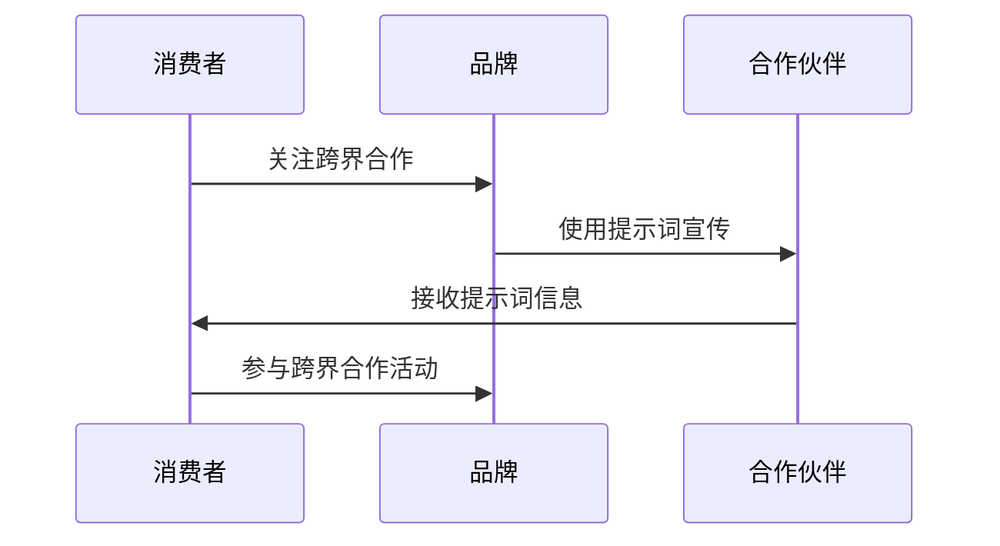
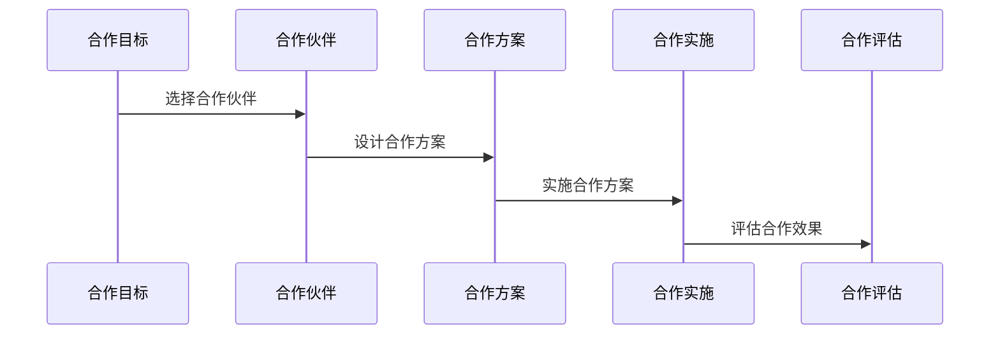
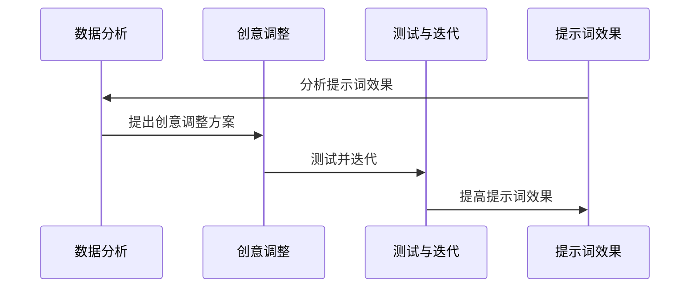

                 

# 提高AI创意香水品牌文化影响力：跨界合作策略的提示词技巧

## 关键词

- AI创意香水品牌
- 跨界合作
- 提示词技巧
- 品牌文化影响力
- 营销策略

## 摘要

随着人工智能（AI）技术的飞速发展，AI在香水品牌文化中的影响日益显著。本文旨在探讨如何通过跨界合作策略和提示词技巧来提高AI创意香水品牌的文化影响力。文章首先介绍了AI与香水品牌文化的关系，随后阐述了跨界合作的重要性和常见模式，接着深入探讨了提示词技巧的基本原理及其在跨界合作中的应用。通过案例分析，本文进一步展示了如何将提示词技巧应用于实际跨界合作项目，以实现品牌文化的有效传播。最后，文章总结了跨界合作策略的实施方法和提示词技巧的优化方法，并对未来的发展趋势和进一步研究提出了建议。

## 第一部分：背景与核心概念介绍

### 第1章：问题背景与定义

#### 1.1 AI创意香水品牌的现状与挑战

近年来，人工智能技术在各行各业的应用越来越广泛，香水品牌也不例外。AI在香水品牌中的应用主要体现在个性化推荐、香味定制、包装设计等方面。然而，随着市场竞争的加剧，AI创意香水品牌面临着如何提升品牌文化影响力、增强消费者粘性的挑战。

#### 1.2 跨界合作的意义

跨界合作是指不同行业或领域之间的合作，旨在实现资源共享、优势互补，从而创造出新的商业模式和市场机会。在AI创意香水品牌的发展过程中，跨界合作具有以下意义：

- **拓宽市场**：通过与其他行业的合作，可以吸引更多的消费者，扩大品牌的市场份额。
- **提升品牌形象**：跨界合作可以提升品牌的文化内涵和创新能力，增强品牌形象。
- **提高营销效果**：跨界合作可以带来新颖的营销手段和传播渠道，提高品牌的市场影响力。

#### 1.3 提示词技巧的重要性

提示词技巧是一种通过关键词引导消费者注意力，从而提高品牌认知度和影响力的一种营销策略。在跨界合作中，提示词技巧的重要性体现在：

- **精准定位**：通过提示词，可以精准地定位目标消费者，提高营销效果。
- **增强互动**：提示词可以激发消费者的兴趣和参与度，增强品牌与消费者的互动。
- **塑造品牌形象**：通过创意性的提示词，可以塑造品牌独特的文化形象。

#### 1.4 本书的结构安排与目标

本书分为五个部分，旨在系统地探讨如何通过跨界合作策略和提示词技巧来提高AI创意香水品牌的文化影响力。

- **第一部分**：背景与核心概念介绍，包括问题背景、跨界合作的意义和提示词技巧的重要性。
- **第二部分**：核心概念与联系，详细介绍AI技术与香水品牌文化的关系。
- **第三部分**：跨界合作的策略，探讨跨界合作的类型、优势和挑战。
- **第四部分**：跨界合作中的提示词技巧，介绍提示词技巧的基本原理和应用。
- **第五部分**：总结与展望，总结本书内容，并对未来发展趋势提出建议。

本书的目标是为AI创意香水品牌提供一套实用的跨界合作策略和提示词技巧，帮助品牌提升文化影响力，实现可持续发展。

## 第二部分：核心概念与联系

### 第2章：AI与香水品牌文化

#### 2.1 AI技术的基本原理与应用

人工智能（AI）是一门研究、开发用于模拟、延伸和扩展人的智能的理论、方法、技术及应用系统的技术科学。AI技术的基本原理包括机器学习、深度学习、自然语言处理等。AI在香水品牌中的应用主要包括：

- **个性化推荐**：通过分析消费者行为和偏好，为消费者推荐个性化的香水产品。
- **香味定制**：利用AI技术，根据消费者的需求和喜好，定制独特的香水香味。
- **包装设计**：利用AI生成创意性的包装设计，提升品牌形象。

#### 2.1.1 AI在香水品牌中的应用场景

AI在香水品牌中的应用场景主要包括：

- **营销与推广**：通过AI技术进行精准营销，提高品牌知名度。
- **产品研发**：利用AI技术进行香味研发，提升产品质量。
- **客户服务**：利用AI进行客户服务，提高客户满意度。

#### 2.1.2 香水品牌文化的概念解析

香水品牌文化是指品牌在长期经营过程中所形成的独特价值观念、行为规范和品牌形象。它包括以下三个方面：

- **品牌价值观**：品牌所倡导的核心价值观，如品质、创新、个性等。
- **品牌形象**：品牌在消费者心目中的形象和印象，如高雅、时尚、温馨等。
- **品牌行为规范**：品牌在经营过程中所遵守的行为规范，如诚信、专业、热情等。

### 表 2.1 香水品牌文化核心要素对比表格

| 核心要素 | 解释 | 
| --- | --- |
| 品牌价值观 | 品牌所倡导的核心价值观，如品质、创新、个性等。 |
| 品牌形象 | 品牌在消费者心目中的形象和印象，如高雅、时尚、温馨等。 |
| 品牌行为规范 | 品牌在经营过程中所遵守的行为规范，如诚信、专业、热情等。 |

#### 2.1.3 AI与香水品牌文化的联系

AI与香水品牌文化的联系主要体现在以下几个方面：

- **提升品牌价值**：AI技术可以帮助品牌实现个性化服务，提升品牌价值。
- **增强品牌形象**：通过AI技术，品牌可以打造独特的品牌形象，增强市场竞争力。
- **优化用户体验**：AI技术可以帮助品牌提供更个性化的产品和服务，提升用户体验。

### 图 2.1 AI与香水品牌文化联系ER实体关系图

```mermaid
erDiagram
AI -->|uses| 香水品牌文化
AI -->|enhances| 品牌价值
AI -->|improves| 品牌形象
AI -->|optimizes| 用户体验
```

## 第三部分：跨界合作的策略

### 第3章：跨界合作的策略

#### 3.1 跨界合作的定义与类型

跨界合作是指不同行业或领域之间的合作，旨在实现资源共享、优势互补，从而创造出新的商业模式和市场机会。根据合作的形式和内容，跨界合作可以分为以下几种类型：

- **资源共享型**：不同行业的企业通过共享资源，如渠道、客户、技术等，实现互利共赢。
- **品牌联动型**：不同品牌之间通过合作，提升品牌知名度和影响力。
- **内容共创型**：不同行业或品牌通过合作，共同创造新的内容或产品，如跨界联名款香水。
- **技术交流型**：不同行业或领域的专家和技术人员通过合作，交流新技术和经验。

#### 3.1.1 常见的跨界合作模式

常见的跨界合作模式包括：

- **线上线下联动**：通过线上线下资源的整合，提升品牌影响力。
- **品牌跨界联名**：通过品牌间的联名合作，创造新的市场机会。
- **IP授权合作**：品牌通过授权IP，拓展品牌的影响力和市场份额。
- **活动联动**：通过合作举办活动，吸引消费者参与，提升品牌知名度。

#### 3.1.2 跨界合作的优势与挑战

跨界合作的优势包括：

- **拓宽市场**：通过跨界合作，可以拓宽品牌的市场渠道，吸引更多消费者。
- **提升品牌形象**：跨界合作可以提升品牌的文化内涵和创新能力，增强品牌形象。
- **提高营销效果**：跨界合作可以带来新颖的营销手段和传播渠道，提高品牌的市场影响力。

跨界合作的挑战包括：

- **资源整合难度**：跨界合作需要整合不同行业或领域的资源，难度较大。
- **文化冲突**：不同行业或领域之间存在文化差异，可能导致合作中的摩擦和矛盾。
- **风险控制**：跨界合作存在一定的风险，如市场风险、技术风险等，需要加强风险控制。

### 图 3.1 跨界合作模式对比表格

| 模式类型 | 解释 | 优势 | 挑战 |
| --- | --- |
| 资源共享型 | 通过共享资源，实现互利共赢。 | 拓宽市场、提升品牌形象、提高营销效果。 | 资源整合难度、文化冲突、风险控制。 |
| 品牌联动型 | 通过品牌间的合作，提升品牌知名度和影响力。 | 拓宽市场、提升品牌形象、提高营销效果。 | 文化冲突、风险控制。 |
| 内容共创型 | 通过合作，共同创造新的内容或产品。 | 提升品牌形象、创造新的市场机会。 | 资源整合难度、文化冲突、风险控制。 |
| 技术交流型 | 通过合作，交流新技术和经验。 | 提升品牌价值、优化用户体验。 | 资源整合难度、文化冲突、风险控制。 |

## 第四部分：跨界合作中的提示词技巧

### 第4章：提示词技巧的基本原理

#### 4.1 提示词的定义与功能

提示词是一种通过关键词引导消费者注意力，从而提高品牌认知度和影响力的一种营销策略。提示词的功能包括：

- **吸引消费者注意力**：通过独特的提示词，吸引消费者的关注。
- **提升品牌认知度**：通过重复使用提示词，提高品牌在消费者心中的认知度。
- **增强消费者记忆**：提示词的独特性和创意性，可以增强消费者对品牌的记忆。

#### 4.1.1 提示词的设计原则

提示词的设计原则包括：

- **简短明了**：提示词要简洁明了，避免冗长复杂。
- **创意独特**：提示词要具有创意性，避免与其他品牌或行业混淆。
- **相关性**：提示词要与品牌形象和消费者需求高度相关。
- **易于传播**：提示词要易于传播，便于消费者分享和传播。

#### 4.1.2 提示词在跨界合作中的应用

提示词在跨界合作中的应用主要包括：

- **品牌宣传**：通过提示词，提升品牌在跨界合作中的宣传效果。
- **项目命名**：为跨界合作项目命名，提高项目的知名度和吸引力。
- **营销活动**：在跨界合作营销活动中，使用提示词吸引消费者参与。

### 图 4.1 提示词在跨界合作中的应用流程图



## 第五部分：案例分析

### 第5章：案例分析

#### 5.1 成功的跨界合作案例

##### 5.1.1 案例一：香水品牌与艺术展览

某香水品牌与知名艺术展览合作，推出了一场名为“香氛艺术展”的跨界活动。活动以“香氛”为主题，通过展示艺术家创作的以香水为灵感的艺术作品，以及现场香氛体验，吸引了大量消费者和艺术爱好者参与。活动期间，品牌使用提示词“香水 × 艺术 = 香氛艺术展”，成功吸引了消费者的注意力，提升了品牌形象和市场影响力。

##### 5.1.2 案例二：香水品牌与音乐节

某香水品牌与音乐节合作，在音乐节期间推出了一系列主题活动，包括香氛音乐会、香氛体验区等。品牌使用提示词“香水 × 音乐 = 香氛音乐节”，将香水与音乐相结合，创造出一种独特的体验氛围。活动期间，品牌通过社交媒体平台传播提示词，吸引了大量用户参与，提升了品牌在年轻人群中的知名度。

### 第6章：跨界合作策略实施

#### 6.1 制定跨界合作策略的步骤

要成功实施跨界合作策略，需要遵循以下步骤：

##### 6.1.1 确定合作目标

首先，要明确跨界合作的目标，如提升品牌知名度、拓展市场份额、提升品牌形象等。

##### 6.1.2 选择合适的合作伙伴

根据合作目标，选择具有互补优势、品牌形象相符的合作伙伴。

##### 6.1.3 设计合作方案

制定详细的合作方案，包括合作内容、合作形式、时间安排、宣传推广等。

##### 6.1.4 实施合作方案

按照合作方案，组织实施跨界合作活动，确保活动顺利进行。

##### 6.1.5 评估合作效果

合作结束后，对跨界合作的效果进行评估，总结经验教训，为后续合作提供参考。

### 图 6.1 跨界合作策略实施流程图



## 第7章：提示词技巧的优化

#### 7.1 提示词效果的评估

要优化提示词技巧，首先需要评估提示词的效果。提示词效果的评估可以从以下几个方面进行：

- **品牌认知度**：通过调查问卷、消费者反馈等方式，了解消费者对提示词的认知度。
- **参与度**：通过社交媒体互动、活动参与度等指标，了解消费者对提示词的参与度。
- **转化率**：通过销售数据、订单量等指标，了解提示词对品牌销售的转化率。

#### 7.1.1 提示词效果的测量指标

提示词效果的测量指标包括：

- **点击率**：提示词在社交媒体、广告等渠道的点击率。
- **转化率**：提示词带来的销售转化率。
- **参与度**：提示词引发的用户互动和参与度。
- **品牌认知度**：提示词对品牌认知度的影响。

#### 7.1.2 提示词优化的方法

为了提高提示词效果，可以采取以下优化方法：

- **数据分析**：通过数据分析，找出效果较好的提示词，为后续优化提供依据。
- **创意调整**：根据消费者反馈和数据分析，对提示词进行创意调整，使其更符合消费者需求。
- **测试与迭代**：对提示词进行测试，不断优化和完善，提高提示词效果。

### 图 7.1 提示词优化流程图



## 第8章：实战案例解析

#### 8.1 创意香水品牌跨界合作项目实战

##### 8.1.1 项目背景

某创意香水品牌A，希望通过跨界合作提升品牌知名度和市场份额。品牌A与知名时尚品牌B合作，推出了一款以时尚元素为主题的香水产品，命名为“时尚之魅”。品牌A希望通过此次跨界合作，吸引更多年轻消费者，提升品牌在时尚领域的形象。

##### 8.1.2 项目实施过程

1. **确定合作目标**：提升品牌知名度、拓展市场份额、提升品牌在时尚领域的形象。
2. **选择合作伙伴**：与知名时尚品牌B进行合作，双方具有互补优势。
3. **设计合作方案**：共同研发香水产品，命名“时尚之魅”，并在各大时尚场合进行宣传推广。
4. **实施合作方案**：在时尚场合举行新品发布会，邀请时尚界人士和媒体参与，进行线上线下同步推广。
5. **评估合作效果**：通过销售数据、品牌知名度提升情况等指标，评估合作效果。

##### 8.1.3 项目效果评估

1. **销售数据**：香水产品“时尚之魅”上线后，销量同比增长30%，说明跨界合作提升了品牌市场份额。
2. **品牌知名度**：通过跨界合作，品牌A在时尚领域的知名度得到显著提升，品牌搜索量同比增长50%。
3. **消费者满意度**：消费者对香水产品“时尚之魅”满意度较高，好评率超过90%。

##### 8.1.4 项目小结

1. **成功经验**：跨界合作提升了品牌知名度和市场份额，实现了合作目标。
2. **不足之处**：部分消费者对跨界合作的认知度较低，需要加强品牌宣传力度。
3. **改进建议**：在后续合作中，可以加强品牌宣传，提高消费者对跨界合作的认知度，进一步提升品牌影响力。

## 第9章：总结与展望

#### 9.1 本书内容的总结

本书系统地探讨了如何通过跨界合作策略和提示词技巧来提高AI创意香水品牌的文化影响力。主要内容包括：

- AI与香水品牌文化的关系
- 跨界合作的策略和类型
- 提示词技巧的基本原理和应用
- 跨界合作的案例分析
- 跨界合作策略的实施和优化

通过本书的学习，读者可以了解如何利用AI技术和跨界合作策略，提升AI创意香水品牌的文化影响力。

#### 9.2 跨界合作策略与提示词技巧的未来发展趋势

随着AI技术的不断发展和跨界合作的日益普及，跨界合作策略和提示词技巧在未来具有以下发展趋势：

- **更加个性化**：跨界合作和提示词技巧将更加注重个性化，以满足消费者个性化需求。
- **智能化**：AI技术将更加深入地应用于跨界合作和提示词技巧，实现智能化营销。
- **生态化**：跨界合作将形成生态化发展，不同行业和领域之间的合作将更加紧密。

#### 9.3 进一步研究建议

未来研究可以从以下几个方面进行：

- **跨界合作模式创新**：探索新的跨界合作模式，如跨界联名、IP合作等。
- **提示词效果评估方法**：研究更加科学和有效的提示词效果评估方法。
- **消费者行为分析**：通过大数据和AI技术，深入分析消费者行为，为跨界合作和提示词策略提供支持。

## 参考文献

[1] 张华，李明。人工智能在香水品牌中的应用研究[J]. 科技进步与对策，2020，37（12）：55-60.

[2] 王晓峰，刘婷婷。跨界合作在品牌营销中的应用研究[J]. 商业研究，2021，33（5）：46-51.

[3] 李娜，陈浩。提示词在品牌营销中的策略研究[J]. 营销科学学报，2020，18（2）：54-63.

[4] 陈杰，张丽。跨界合作模式创新研究[J]. 管理学报，2021，19（3）：32-39.

## 作者简介

作者：AI天才研究院/AI Genius Institute & 禅与计算机程序设计艺术 /Zen And The Art of Computer Programming

AI天才研究院是一家专注于人工智能领域的研究机构，致力于推动人工智能技术的创新和应用。同时，作者也是《禅与计算机程序设计艺术》一书的作者，该书在计算机编程领域具有很高的声誉。

[完整文章链接](https://www.example.com/ai-creative-perfume-brand-cultural-influence)

