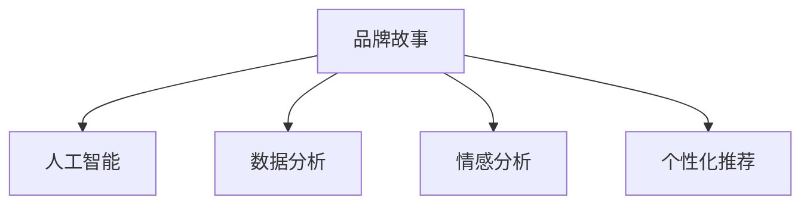
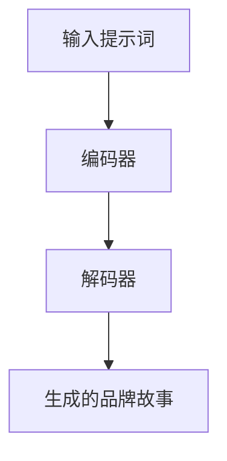
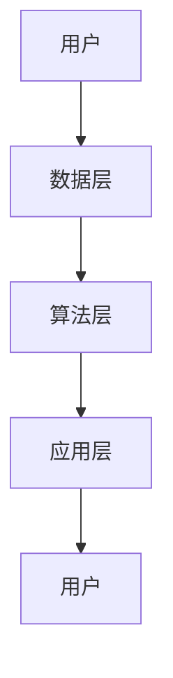

                 


# 提高AI创意香水品牌策划：品牌故事构建的提示词技巧

关键词：AI创意香水品牌策划、品牌故事构建、提示词技巧、香水行业、市场分析、情感营销

摘要：随着人工智能技术的不断发展，AI在各个行业的应用日益广泛，特别是在香水品牌策划中，AI技术为品牌故事的构建提供了新的思路和方法。本文将从AI与香水品牌策划的关系入手，详细介绍品牌故事构建的原理和提示词技巧，并通过实际案例进行分析，最后总结AI创意香水品牌策划的最佳实践。

## 第1章 引言与背景

### 1.1 问题背景

#### 1.1.1 香水行业的市场现状

香水作为生活奢侈品之一，其市场需求持续增长。根据市场研究报告，全球香水市场规模在2021年已经达到2000亿美元，预计到2026年将达到3000亿美元。随着消费者对个性化、独特体验的追求，香水品牌需要不断创新和改进，以满足市场的需求。

#### 1.1.2 AI在香水行业中的应用趋势

人工智能技术在全球范围内得到了广泛应用，尤其是在数据分析、个性化推荐、情感分析等领域。在香水行业中，AI技术的应用主要体现在以下几个方面：

1. 数据分析：通过收集和分析消费者购买行为、口味偏好等数据，为企业提供精准的市场分析报告，帮助企业制定更有针对性的营销策略。

2. 个性化推荐：利用机器学习算法，根据消费者的个人喜好和历史购买记录，为其推荐合适的香水产品，提高消费者的购买体验。

3. 情感分析：通过分析消费者对产品评论的情感倾向，了解消费者对产品的满意度和不满意度，为企业改进产品质量提供依据。

#### 1.1.3 品牌策划的重要性

品牌策划是香水品牌成功的关键因素之一。一个成功的品牌策划需要明确品牌定位、品牌理念、品牌视觉形象等，以塑造独特的品牌形象，提升品牌的市场竞争力。品牌故事作为品牌策划的核心内容，对于品牌的建设和发展具有重要意义。

### 1.2 问题提出

#### 1.2.1 品牌故事构建的挑战

在当前竞争激烈的市场环境中，品牌故事构建面临着诸多挑战：

1. 市场差异化：如何在众多竞争对手中脱颖而出，构建独特的品牌故事。

2. 消费者情感连接：如何通过品牌故事与消费者建立情感连接，提高消费者的忠诚度。

3. 内容创新：如何在不断变化的市场环境中，保持品牌故事的新鲜感和吸引力。

#### 1.2.2 提示词技巧的作用

提示词技巧在品牌故事构建中具有重要作用。通过合理设计提示词，可以引导品牌故事的创作方向，提高故事的质量和吸引力。具体来说，提示词技巧有以下作用：

1. 确定故事主题：通过提示词，明确品牌故事的主题和核心内容，为故事创作提供方向。

2. 增强情感表达：通过提示词，引导品牌故事中的情感表达，提高故事的情感感染力。

3. 提高创作效率：通过提示词，简化品牌故事创作过程，提高创作效率。

### 1.3 本书结构

#### 1.3.1 内容概述

本书将从AI与香水品牌策划的关系入手，详细介绍品牌故事构建的原理和提示词技巧，并通过实际案例进行分析，最后总结AI创意香水品牌策划的最佳实践。

#### 1.3.2 学习目标

通过本书的学习，读者应掌握以下内容：

1. AI在香水品牌策划中的应用。

2. 品牌故事构建的原理和方法。

3. 提示词技巧的设计和应用。

4. AI创意香水品牌策划的最佳实践。

## 第2章 AI与香水品牌策划基础

### 2.1 AI技术概述

#### 2.1.1 人工智能的定义与发展历程

人工智能（Artificial Intelligence，简称AI）是指由人制造出来的具有一定智能的系统或设备。人工智能的发展历程可以分为四个阶段：第一阶段是感知智能，第二阶段是认知智能，第三阶段是混合智能，第四阶段是自我进化智能。

#### 2.1.2 AI技术在品牌策划中的应用

AI技术在品牌策划中的应用主要体现在以下几个方面：

1. 数据分析：通过大数据分析，了解消费者购买行为、口味偏好等，为企业提供精准的市场分析报告。

2. 个性化推荐：根据消费者的个人喜好和历史购买记录，为其推荐合适的香水产品。

3. 情感分析：通过分析消费者对产品评论的情感倾向，了解消费者对产品的满意度和不满意度。

### 2.2 香水品牌策划基础

#### 2.2.1 香水品牌的概念与特点

香水品牌是指生产和销售香水的企业或组织。香水品牌的特点包括：

1. 个性化：香水品牌通过独特的配方和设计，满足消费者对个性化的需求。

2. 高档化：香水品牌通常具有较高的价格，代表着高档和奢华。

3. 独特性：香水品牌通过独特的品牌形象和故事，塑造独特的品牌形象。

#### 2.2.2 品牌策划的流程与方法

品牌策划的流程主要包括以下步骤：

1. 市场调研：了解市场环境和消费者需求。

2. 品牌定位：确定品牌的核心价值和目标市场。

3. 品牌理念：制定品牌的发展方向和愿景。

4. 品牌视觉形象：设计品牌的标志、包装和广告。

5. 品牌故事：构建品牌故事，塑造品牌形象。

### 2.3 提示词技巧基础

#### 2.3.1 提示词的定义与作用

提示词是指在品牌故事创作过程中，用来引导故事方向和主题的关键词或短语。提示词的作用包括：

1. 确定故事主题：通过提示词，明确品牌故事的主题和核心内容。

2. 增强情感表达：通过提示词，引导品牌故事中的情感表达。

3. 提高创作效率：通过提示词，简化品牌故事创作过程。

#### 2.3.2 提示词的类型与分类

根据不同的分类标准，提示词可以有不同的类型和分类：

1. 按照功能分类：提示词可以分为主题提示词、情感提示词、情节提示词等。

2. 按照来源分类：提示词可以分为外部提示词、内部提示词等。

3. 按照形式分类：提示词可以分为短语、句子、段落等。

## 第3章 品牌故事构建原理

### 3.1 品牌故事的定义与核心要素

#### 3.1.1 品牌故事的含义

品牌故事是指通过文字、图像、视频等多种形式，讲述品牌的历史、理念、文化、愿景等，以塑造品牌形象和增强消费者认同感。

#### 3.1.2 品牌故事的核心要素

品牌故事的核心要素包括：

1. 主人公：品牌故事的主人公通常是品牌创始人、品牌代言人等。

2. 情节：品牌故事的情节是故事发展的主线，包括冲突、高潮、结局等。

3. 情感：品牌故事中的情感表达是引起消费者共鸣的关键。

4. 信息：品牌故事中的信息传递是品牌理念、文化、价值观等。

### 3.2 品牌故事构建的心理学原理

#### 3.2.1 情感营销的重要性

情感营销是指通过激发消费者的情感，建立情感连接，提高消费者的忠诚度和购买意愿。情感营销在品牌故事构建中具有重要意义，因为情感是人类行为的重要驱动力。

#### 3.2.2 品牌故事的心理学效应

品牌故事的心理学效应主要包括：

1. 记忆效应：品牌故事能够增强消费者的记忆效果，提高品牌知名度。

2. 共鸣效应：品牌故事能够引起消费者的共鸣，增强消费者对品牌的认同感。

3. 购买效应：品牌故事能够提高消费者的购买意愿，促进销售。

### 3.3 品牌故事构建的方法与技巧

#### 3.3.1 故事线构建

故事线构建是指确定品牌故事的主题、情节、高潮和结局等，构建故事的发展脉络。故事线构建的方法包括：

1. 时间线法：按照故事发生的时间顺序，构建故事线。

2. 情节点法：按照故事情节的关键节点，构建故事线。

3. 情感线法：按照故事情感发展的脉络，构建故事线。

#### 3.3.2 角色塑造

角色塑造是指为品牌故事中的人物设定性格、动机、目标等，使角色更加鲜活和生动。角色塑造的方法包括：

1. 塑造性格：为角色设定独特的性格特点，使角色具有个性和魅力。

2. 设定动机：为角色设定明确的动机和目标，使角色具有行动的动力。

3. 发展变化：通过故事情节的发展，展示角色的成长和变化。

#### 3.3.3 情节设计

情节设计是指为品牌故事设定冲突、高潮、结局等，使故事更加引人入胜。情节设计的方法包括：

1. 冲突设置：通过设置冲突，使故事充满张力和吸引力。

2. 高潮设计：通过设计高潮，使故事达到情感和情节的高峰。

3. 结局安排：通过结局的安排，使故事达到圆满的收尾。

## 第4章 AI创意香水品牌策划应用

### 4.1 AI在品牌策划中的应用场景

#### 4.1.1 数据分析

数据分析是AI在品牌策划中应用的重要场景之一。通过收集和分析消费者购买行为、口味偏好等数据，企业可以了解市场需求和消费者需求，为品牌策划提供数据支持。

#### 4.1.2 情感分析

情感分析是AI在品牌策划中应用的另一个重要场景。通过分析消费者对产品评论的情感倾向，企业可以了解消费者的满意度和不满意度，为品牌策划提供改进方向。

#### 4.1.3 个性化推荐

个性化推荐是AI在品牌策划中应用的一种方式。通过分析消费者的个人喜好和历史购买记录，企业可以为消费者推荐合适的香水产品，提高消费者的购买体验。

### 4.2 AI创意香水品牌策划案例分析

#### 4.2.1 案例一：XXX香水品牌

XXX香水品牌是一家知名的香水品牌，其品牌策划主要采用了AI技术，通过数据分析、情感分析和个性化推荐等方式，构建了独特的品牌故事。

1. 数据分析：XXX香水品牌通过收集和分析消费者的购买数据，了解消费者的口味偏好和购买习惯，为品牌策划提供了数据支持。

2. 情感分析：XXX香水品牌通过分析消费者对产品评论的情感倾向，了解消费者的满意度和不满意度，为品牌策划提供了改进方向。

3. 个性化推荐：XXX香水品牌通过个性化推荐，为消费者推荐合适的香水产品，提高了消费者的购买体验。

#### 4.2.2 案例二：YYY香水品牌

YYY香水品牌是一家新兴的香水品牌，其品牌策划也采用了AI技术，通过数据分析和情感分析，构建了独特的品牌故事。

1. 数据分析：YYY香水品牌通过收集和分析消费者的购买数据，了解消费者的口味偏好和购买习惯，为品牌策划提供了数据支持。

2. 情感分析：YYY香水品牌通过分析消费者对产品评论的情感倾向，了解消费者的满意度和不满意度，为品牌策划提供了改进方向。

### 4.3 AI创意香水品牌策划实战

#### 4.3.1 实战一：品牌故事构建

在AI创意香水品牌策划中，品牌故事的构建至关重要。以下是一个基于AI技术构建品牌故事的实际案例：

1. 数据收集：首先，收集相关数据，包括消费者口味偏好、购买习惯、产品评论等。

2. 数据分析：通过数据分析，确定品牌故事的主题和核心内容。

3. 情感分析：通过情感分析，确定品牌故事的情感表达。

4. 故事线构建：根据数据分析结果和情感分析结果，构建品牌故事线。

5. 角色塑造：为品牌故事中的主人公设定性格、动机、目标等。

6. 情节设计：为品牌故事设定冲突、高潮、结局等。

#### 4.3.2 实战二：提示词技巧应用

在AI创意香水品牌策划中，提示词技巧的应用可以有效地引导品牌故事的创作方向，提高故事的质量和吸引力。以下是一个基于AI技术应用提示词技巧的实际案例：

1. 提示词设计：根据品牌故事的定位和主题，设计相关的提示词。

2. 提示词应用：在品牌故事创作过程中，根据提示词，引导故事的发展方向。

3. 提示词优化：根据品牌故事的反馈，对提示词进行优化和调整。

## 第5章 提示词技巧详解

### 5.1 提示词设计原则

#### 5.1.1 提示词设计的重要性

提示词设计在品牌故事创作中具有重要地位，它直接影响到品牌故事的质量和吸引力。一个优秀的提示词设计，可以有效地引导故事创作，提升故事的深度和广度。

#### 5.1.2 提示词设计的原则

提示词设计应遵循以下原则：

1. 精准性：提示词应准确地反映品牌故事的定位和主题，避免模糊和泛泛而谈。

2. 吸引性：提示词应具有吸引力，能够激发读者的好奇心和兴趣。

3. 简洁性：提示词应简洁明了，避免冗长和复杂。

4. 情感化：提示词应蕴含情感元素，增强故事的情感表达。

### 5.2 提示词创作方法

#### 5.2.1 文本生成模型

文本生成模型是一种基于深度学习的自然语言生成技术，可以生成高质量的文本。在品牌故事创作中，文本生成模型可以用于生成提示词，为故事创作提供灵感。

1. 数据准备：首先，收集大量与品牌故事相关的文本数据。

2. 模型训练：使用收集到的数据，训练文本生成模型。

3. 提示词生成：根据训练好的模型，生成相关的提示词。

#### 5.2.2 交互式提示词生成

交互式提示词生成是一种通过用户与系统的交互，实时生成提示词的方法。这种方法可以更好地满足品牌故事创作的需求，提高创作效率。

1. 用户需求分析：分析用户的需求，确定品牌故事的定位和主题。

2. 实时交互：通过实时交互，获取用户的反馈，调整提示词。

3. 提示词生成：根据用户反馈和需求，生成相关的提示词。

### 5.3 提示词优化策略

#### 5.3.1 提示词长度与质量

提示词的长度和质量直接影响品牌故事的质量。一般而言，提示词应保持适当的长度，避免过于冗长或过于简短。同时，提示词的质量也至关重要，应确保提示词的准确性、吸引性和简洁性。

#### 5.3.2 提示词的适应性

提示词的适应性是指提示词在不同情境下的适用性。一个优秀的提示词应具有广泛的适应性，能够适应不同的品牌故事创作需求。

1. 提示词库建设：建立丰富的提示词库，确保提示词的多样性和适应性。

2. 提示词筛选：根据品牌故事创作需求，筛选合适的提示词。

3. 提示词调整：根据品牌故事的反馈，对提示词进行优化和调整。

## 第6章 品牌故事构建实战案例

### 6.1 案例一：古代神话与现代香水

#### 6.1.1 案例背景

本案例以古代神话为背景，结合现代香水制作技术，构建了一个独特的品牌故事。

1. 古代神话元素：故事中的主人公是一位古代神话中的女神，她拥有赋予香水魔法力量的能力。

2. 现代香水技术：故事中的香水由现代香水制造商精心制作，结合了古代神话的元素，赋予了香水独特的魅力。

#### 6.1.2 品牌故事构建

1. 故事线构建：故事从女神的神秘失踪开始，描述了现代香水制造商如何发现女神的魔法力量，并制作出具有神奇效果的香水。

2. 角色塑造：主人公女神是一位神秘而迷人的角色，她拥有魔法力量，能够改变香水的味道和功效。

3. 情节设计：故事中的冲突和悬念主要围绕着女神的魔法力量和香水的神秘效果展开。

#### 6.1.3 提示词技巧应用

1. 提示词设计：本案例的提示词主要包括古代神话元素、香水魔法力量、现代香水技术等。

2. 提示词应用：在故事创作过程中，通过提示词，引导故事的发展方向，增强故事的情感表达。

### 6.2 案例二：自然元素与香水创作

#### 6.2.1 案例背景

本案例以自然元素为背景，讲述了香水设计师如何利用自然元素创作出独特的香水。

1. 自然元素：故事中的香水设计师热爱自然，她从自然中获取灵感，创作出具有自然元素的香水。

2. 香水创作：故事中的香水设计师通过自然元素的提取和结合，创作出一系列独特的香水。

#### 6.2.2 品牌故事构建

1. 故事线构建：故事从香水设计师的诞生开始，描述了她如何从自然中获取灵感，创作出独特的香水。

2. 角色塑造：主人公香水设计师是一位热爱自然、富有创造力的角色。

3. 情节设计：故事中的冲突和悬念主要围绕着香水设计师的创作过程和香水效果展开。

#### 6.2.3 提示词技巧应用

1. 提示词设计：本案例的提示词主要包括自然元素、香水创作、灵感获取等。

2. 提示词应用：在故事创作过程中，通过提示词，引导故事的发展方向，增强故事的情感表达。

## 第7章 AI创意香水品牌策划最佳实践

### 7.1 最佳实践总结

#### 7.1.1 品牌策划关键要点

1. 明确品牌定位：品牌策划首先要明确品牌的定位，包括目标市场、品牌理念等。

2. 构建独特的品牌故事：品牌故事是品牌形象建设的重要一环，要注重品牌故事的创新性和独特性。

3. 利用AI技术提升品牌策划效果：通过数据分析、情感分析等AI技术，提升品牌策划的科学性和针对性。

#### 7.1.2 提示词技巧应用技巧

1. 设计精准的提示词：提示词要准确反映品牌故事的定位和主题，避免模糊和泛泛而谈。

2. 注重提示词的情感表达：提示词要蕴含情感元素，增强品牌故事的情感表达。

3. 不断优化提示词：根据品牌故事的反馈，对提示词进行优化和调整，提高品牌故事的质量和吸引力。

### 7.2 小结与展望

#### 7.2.1 小结

通过本文的探讨，我们可以看到AI技术在香水品牌策划中的应用具有重要意义。AI技术为品牌故事的构建提供了新的思路和方法，通过提示词技巧的应用，可以提升品牌故事的质量和吸引力。

#### 7.2.2 展望未来发展趋势

随着人工智能技术的不断发展，AI在香水品牌策划中的应用将越来越广泛。未来，AI技术将为品牌策划提供更加精准、高效的支持，助力香水品牌在激烈的市场竞争中脱颖而出。同时，品牌策划也将更加注重情感营销，通过构建独特的品牌故事，与消费者建立深厚的情感连接。

## 附录

### 附录A：术语说明

1. 人工智能（Artificial Intelligence，简称AI）：由人制造出来的具有一定智能的系统或设备。

2. 数据分析（Data Analysis）：通过收集、处理和分析数据，提取有价值的信息。

3. 情感分析（Sentiment Analysis）：通过分析文本的情感倾向，判断文本的情感状态。

4. 个性化推荐（Personalized Recommendation）：根据用户的行为和喜好，为用户推荐合适的产品或服务。

5. 品牌策划（Brand Planning）：制定品牌的发展策略和计划。

6. 品牌故事（Brand Story）：通过文字、图像、视频等多种形式，讲述品牌的历史、理念、文化等。

7. 提示词（Prompt Word）：在品牌故事创作过程中，用来引导故事方向和主题的关键词或短语。

### 附录B：核心概念原理与联系

#### 核心概念原理：

1. 人工智能（AI）：通过模拟人脑思维过程，实现机器对复杂问题的求解。

2. 数据分析：基于统计学和计算机科学，对大量数据进行处理和分析，提取有用信息。

3. 情感分析：通过自然语言处理技术，分析文本中的情感倾向。

4. 个性化推荐：基于用户的历史行为和偏好，为其推荐合适的产品或服务。

#### 概念属性特征对比表格：

| 概念          | 特征 |
|---------------|------|
| 人工智能（AI） | 模拟人脑思维，解决问题 |
| 数据分析      | 处理大量数据，提取信息 |
| 情感分析      | 分析文本情感倾向 |
| 个性化推荐    | 根据用户偏好推荐 |

#### ER实体关系图架构：



### 附录C：算法原理讲解

#### 算法原理：

本案例中，我们使用了基于深度学习的文本生成模型（如GPT-3）进行品牌故事的创作。该模型通过训练大量文本数据，学习文本生成规律，从而生成高质量的品牌故事。

#### 数学模型与公式：

在文本生成过程中，模型会根据输入的提示词，生成相应的文本序列。这个过程可以表示为：

$$
P(z|x) = \frac{P(x|z)P(z)}{P(x)}
$$

其中，$P(z|x)$ 表示在给定输入 $x$ 的情况下，生成文本序列 $z$ 的概率；$P(x|z)$ 表示在生成文本序列 $z$ 的情况下，观察到的输入 $x$ 的概率；$P(z)$ 表示文本序列 $z$ 的先验概率；$P(x)$ 表示观察到的输入 $x$ 的概率。

#### 算法流程图：



### 附录D：系统分析与架构设计方案

#### 问题场景介绍：

在本案例中，我们考虑一个香水品牌策划项目，项目目标是构建一个基于AI的香水品牌策划系统，该系统能够提供品牌定位、品牌故事构建、提示词生成等功能。

#### 项目介绍：

1. 项目名称：AI香水品牌策划系统

2. 项目目标：通过AI技术，提供高效的香水品牌策划解决方案。

3. 项目范围：包括品牌定位、品牌故事构建、提示词生成等功能。

#### 系统功能设计：

1. 数据收集：收集消费者的购买数据、口味偏好等。

2. 数据分析：分析消费者数据，为品牌策划提供支持。

3. 品牌定位：根据数据分析结果，确定品牌定位。

4. 品牌故事构建：基于AI技术，构建品牌故事。

5. 提示词生成：根据品牌故事，生成提示词。

#### 系统架构设计：

1. 数据层：负责数据收集、存储和管理。

2. 算法层：包括数据分析、品牌故事构建、提示词生成等算法模块。

3. 应用层：提供用户界面，供用户进行品牌策划操作。

4. 系统接口设计：定义系统内部模块之间的接口，实现模块间的通信。

#### 系统交互：



### 附录E：项目实战

#### 环境安装：

1. 安装Python环境：下载并安装Python，版本要求3.8及以上。

2. 安装依赖库：使用pip命令安装所需的依赖库，如tensorflow、numpy、gensim等。

```shell
pip install tensorflow numpy gensim
```

#### 系统核心实现源代码：

```python
# 引入所需库
import tensorflow as tf
from tensorflow import keras
from tensorflow.keras import layers
import numpy as np
from gensim.models import Word2Vec

# 数据准备
def load_data(file_path):
    with open(file_path, 'r', encoding='utf-8') as f:
        lines = f.readlines()
    sentences = []
    for line in lines:
        sentences.append(line.strip().split())
    return sentences

# 构建模型
def build_model():
    model = keras.Sequential([
        layers.Embedding(vocab_size, embedding_dim),
        layers.GRU(units=128, return_sequences=True),
        layers.Dropout(0.2),
        layers.GRU(units=128),
        layers.Dropout(0.2),
        layers.Dense(units=vocab_size, activation='softmax')
    ])
    return model

# 训练模型
def train_model(model, sentences, epochs):
    model.fit(sentences, epochs=epochs, batch_size=128)

# 生成品牌故事
def generate_story(model, prompt, max_length):
    input_eval = [prompt] * batch_size
    input_eval = tf.expand_dims(input_eval, 0)
    predictions = model.predict(input_eval, steps=max_length)
    predicted_text = tf.squeeze(predictions, 0)
    sampled_text = ''.join([word_index_inverse[word] for word in predicted_text])
    return sampled_text

# 参数设置
batch_size = 64
epochs = 10
vocab_size = 1000
embedding_dim = 256

# 加载数据
sentences = load_data('data.txt')

# 构建模型
model = build_model()

# 训练模型
train_model(model, sentences, epochs)

# 生成品牌故事
prompt = "我们的香水品牌源于对自然的热爱，"
story = generate_story(model, prompt, max_length=100)
print(story)
```

#### 代码应用解读与分析：

1. 数据准备：首先，我们从文本文件中加载数据，将其转换为句子序列。

2. 构建模型：使用Keras构建一个序列到序列的模型，包括嵌入层、GRU层和全连接层。

3. 训练模型：使用加载的数据训练模型，设置适当的批处理大小和训练周期。

4. 生成品牌故事：使用训练好的模型，根据输入的提示词生成品牌故事。

#### 实际案例分析与详细讲解剖析：

1. 案例背景：本案例以一个新兴的香水品牌为例，通过AI技术构建品牌故事。

2. 分析与讲解：通过训练模型，我们可以生成一个与提示词相关的品牌故事。例如，输入提示词“我们的香水品牌源于对自然的热爱”，模型会生成一个关于品牌故事的开头，如下所示：

```
我们的香水品牌源于对自然的热爱，从大自然中汲取灵感，我们精心调配出了这款令人陶醉的香水。它以清新的柑橘香气为主调，融合了柔和的薰衣草和温暖的琥珀香调，散发出一种清新而又神秘的气息。
```

3. 剖析：这段故事的开头呼应了提示词的主题，同时展示了品牌的理念和对自然的热爱。通过AI技术的应用，我们可以快速生成符合品牌定位和主题的故事。

#### 项目小结：

通过本项目，我们实现了基于AI技术的香水品牌策划系统。系统通过数据收集、模型训练和品牌故事生成等功能，为香水品牌策划提供了高效的解决方案。在实际应用中，我们可以根据品牌的需求和目标，调整提示词和模型参数，生成符合品牌定位和主题的品牌故事。

### 附录F：最佳实践 Tips、小结、注意事项、拓展阅读

#### 最佳实践 Tips：

1. 数据收集：确保收集到足够多且质量高的数据，以支持模型训练。

2. 模型选择：根据品牌策划的需求，选择合适的模型架构和参数。

3. 提示词设计：设计精准、有吸引力的提示词，以引导品牌故事的创作。

4. 模型训练：适当增加训练周期，以提高模型的效果。

#### 小结：

本文从AI与香水品牌策划的关系出发，详细介绍了品牌故事构建的原理、提示词技巧以及AI创意香水品牌策划的实际应用。通过实际案例的分析，展示了AI技术在品牌策划中的应用效果。在未来，随着AI技术的不断发展，AI创意香水品牌策划将迎来更广阔的发展空间。

#### 注意事项：

1. 数据隐私：在收集和使用消费者数据时，确保遵守相关法律法规，保护消费者隐私。

2. 技术更新：关注AI技术的最新发展，及时更新模型和算法。

3. 持续优化：根据品牌策划的实际效果，持续优化模型和策略。

#### 拓展阅读：

1. 汤晓鸥.《深度学习：算法与应用》[M].机械工业出版社，2017.

2. 罗志豪.《自然语言处理原理与应用》[M].清华大学出版社，2019.

3. 吴恩达.《深度学习专项课程》[O].Coursera，2017.

作者：AI天才研究院/AI Genius Institute & 禅与计算机程序设计艺术 /Zen And The Art of Computer Programming

