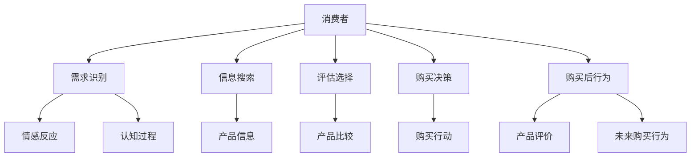
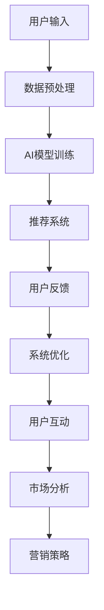
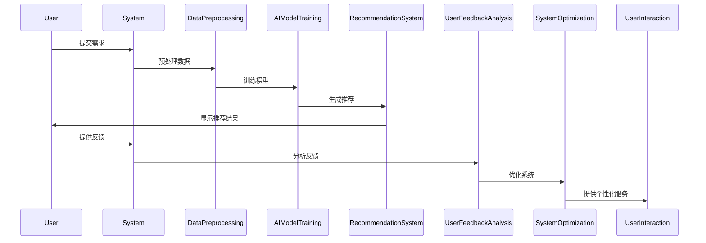

                 

### 引言

#### 问题背景与重要性

在当今快速发展的科技时代，人工智能（AI）技术正以前所未有的速度渗透到各个行业，香水市场也不例外。随着消费者对个性化和体验式消费的需求日益增长，AI技术被广泛应用于香水市场，以提升消费者的购物体验和市场渗透率。然而，尽管AI在香水市场中展示了其强大的潜力，但如何更有效地利用AI技术来满足消费者的多样化需求，仍是一个亟待解决的问题。

消费者行为心理学作为研究消费者在购买过程中心理活动和行为模式的一门科学，对了解消费者需求和行为模式具有重要作用。它揭示了消费者在香水选购中的心理动机、情感反应、认知过程等，为AI在香水市场中的应用提供了重要的理论支持。通过将消费者行为心理学与AI技术相结合，我们可以设计出更加智能化的香水推荐系统和营销策略，从而提高AI在香水市场的渗透率。

#### 研究目的与结构

本文旨在探讨如何利用消费者行为心理学提高AI创意香水市场的渗透率。具体研究目的如下：

1. **理解消费者行为心理学在香水市场中的作用**：分析消费者在选购香水时的心理动机、情感反应和认知过程，以及这些因素如何影响消费者的购买决策。
2. **探讨AI技术在香水市场中的应用**：介绍AI技术在市场研究、个性化推荐系统和消费者互动中的应用，分析其优势和局限性。
3. **提出提示词技巧**：结合消费者行为心理学原理，提出有效的提示词技巧，以提高AI系统的推荐效果和用户体验。
4. **通过案例分析验证策略的有效性**：分析成功和失败的案例，验证所提出的策略在实际应用中的效果。

本文结构如下：

- **引言**：介绍问题背景、研究目的和结构。
- **第一章：AI技术概述**：介绍AI的基本概念、技术和在香水市场中的应用。
- **第二章：消费者行为心理学原理**：分析消费者行为心理学的核心概念和原理，以及其在香水市场中的应用。
- **第三章：AI在香水市场中的实践应用**：讨论AI在市场研究和个性化推荐系统中的应用。
- **第四章：提示词技巧与心理学应用**：提出有效的提示词技巧，并分析其心理学原理。
- **第五章：案例分析**：通过实际案例验证所提出的策略。
- **结论和未来展望**：总结研究成果，并提出未来研究方向。

通过本文的研究，我们希望为香水行业从业者、市场营销专业人士和AI研究人员提供有价值的参考，从而推动AI创意香水市场的发展。

## 第一章：AI技术概述

### 1.1 AI的基本概念

人工智能（Artificial Intelligence，简称AI）是计算机科学的一个分支，旨在使计算机能够模拟人类的智能行为，并解决复杂的问题。AI的研究涵盖了多个领域，包括机器学习、深度学习、自然语言处理、计算机视觉等。机器学习是AI的核心技术之一，它通过算法让计算机从数据中学习并自动改进性能，而深度学习则是机器学习的一种特殊形式，利用多层神经网络进行数据建模和特征提取。

AI的发展历程可以追溯到20世纪50年代，当时的科学家们首次提出了“人工智能”这一概念。自那以后，AI技术经历了多个阶段，从符号推理和知识表示，到基于数据的学习和自适应系统。近年来，随着计算能力的提升和大数据的普及，AI技术取得了显著的突破，尤其在图像识别、语音识别、自动驾驶等领域的应用中表现尤为突出。

### 1.2 AI的核心技术与原理

AI的核心技术包括机器学习、深度学习和自然语言处理等。机器学习是一种通过算法使计算机从数据中学习的方法，主要分为监督学习、无监督学习和半监督学习。监督学习需要标注好的数据来训练模型，模型能够根据输入数据进行预测；无监督学习则无需标注数据，主要目的是发现数据中的模式和结构；半监督学习结合了监督学习和无监督学习的特点，利用少量标注数据和大量未标注数据来训练模型。

深度学习是机器学习的一个分支，利用多层神经网络（Neural Networks）进行数据建模和特征提取。深度学习在图像识别、语音识别和自然语言处理等领域取得了显著的成果，其主要优势在于能够自动学习复杂的数据特征，从而提高模型的性能。深度学习的基本原理是通过反向传播算法（Backpropagation Algorithm）不断调整网络中的权重，以最小化预测误差。

自然语言处理（Natural Language Processing，简称NLP）是AI技术的一个重要分支，旨在使计算机能够理解和处理人类语言。NLP技术包括文本分类、情感分析、机器翻译、语音识别等。NLP的核心技术包括词向量表示、序列模型和注意力机制等。词向量表示能够将文本转换为计算机可处理的数字形式，序列模型则用于处理文本的序列信息，注意力机制则能够帮助模型在处理复杂文本时关注重要的信息。

### 1.3 AI在香水市场中的应用

在香水市场中，AI技术被广泛应用于市场研究、个性化推荐系统和消费者互动等方面。

#### 市场研究

AI技术可以帮助香水品牌进行市场研究，通过分析消费者数据和市场趋势，为品牌提供决策支持。例如，品牌可以利用机器学习算法分析社交媒体上的用户评论和反馈，了解消费者对产品的看法和情感，从而改进产品设计和营销策略。此外，AI还可以进行市场预测，预测未来市场需求和消费者行为，帮助品牌制定长期战略。

#### 个性化推荐系统

个性化推荐系统是AI在香水市场中的一个重要应用。通过分析消费者的购买历史、浏览记录和偏好，AI系统可以生成个性化的香水推荐，提高消费者的购物满意度和忠诚度。例如，某品牌可以利用深度学习算法对消费者的行为数据进行建模，自动推荐符合其个人喜好的香水。个性化推荐系统不仅能够提升消费者的购物体验，还能增加品牌的销售额。

#### 消费者互动

AI技术还可以用于增强消费者与品牌的互动。通过自然语言处理技术，AI可以理解消费者的语音或文字咨询，并提供即时的答复和建议。此外，AI还可以通过虚拟助手或聊天机器人与消费者进行互动，提供个性化的服务和支持，从而提升消费者的满意度和忠诚度。

### 1.4 消费者行为心理学基础

在AI技术的应用中，消费者行为心理学起到了重要的支撑作用。消费者行为心理学研究消费者在购买过程中的心理活动和行为模式，包括需求识别、信息搜索、评估选择、购买决策和购买后行为等。理解这些行为模式有助于AI系统更好地预测和满足消费者的需求。

#### 消费者决策过程

消费者决策过程可以分为以下几个阶段：

1. **需求识别**：消费者意识到自身需求，从而开始寻找满足需求的解决方案。
2. **信息搜索**：消费者通过各种渠道收集产品信息，包括价格、功能、品牌口碑等。
3. **评估选择**：消费者根据所收集的信息，对不同的产品进行比较和评估，选择最符合自己需求的产品。
4. **购买决策**：消费者最终决定购买某一产品，并采取购买行动。
5. **购买后行为**：消费者在购买后对产品进行评价，影响其未来购买行为和品牌忠诚度。

#### 消费者心理特征分析

消费者的心理特征对其购买决策和行为有重要影响。以下是一些关键的消费者心理特征：

1. **需求与偏好**：消费者在购买过程中会根据自身需求和心理偏好来选择产品。
2. **情感与认知**：消费者的情感反应和认知过程会影响其对产品的评价和购买决策。
3. **价值观与文化**：消费者的价值观和文化背景会影响其对产品的态度和选择。

### 1.5 本章小结

通过本章的介绍，我们了解了AI的基本概念、核心技术和原理，以及其在香水市场中的应用。同时，我们也探讨了消费者行为心理学的基本原理和消费者决策过程。这些基础知识为后续章节的深入讨论奠定了基础。

## 第二章：消费者行为心理学原理

### 2.1 消费者行为心理学概述

消费者行为心理学是研究消费者在购买过程中的心理活动和行为模式的一门科学。它通过分析消费者的需求识别、信息搜索、评估选择、购买决策和购买后行为等过程，揭示消费者在购买行为中的心理动机、情感反应和认知过程。理解消费者行为心理学有助于企业更好地了解消费者的需求，制定有效的营销策略，提高市场竞争力。

#### 消费者行为研究的核心问题

消费者行为心理学研究的核心问题包括：

1. **需求识别**：消费者如何识别和表达自身需求？
2. **信息搜索**：消费者如何获取和处理产品信息？
3. **评估选择**：消费者如何对不同的产品进行比较和评估？
4. **购买决策**：消费者如何做出购买决策？
5. **购买后行为**：消费者如何评价产品并影响其未来购买行为？

#### 消费者行为理论框架

消费者行为心理学建立了多个理论框架来解释消费者的行为模式。以下是一些主要的消费者行为理论框架：

1. **行为决策理论**：该理论认为消费者的购买行为是一个理性的决策过程，消费者会在有限的时间和资源内，通过比较不同产品的优缺点，做出最优选择。
2. **认知行为理论**：该理论强调消费者的认知过程对购买行为的影响，消费者在购买过程中会通过感知、理解、记忆等认知活动来处理信息，从而做出购买决策。
3. **情感行为理论**：该理论认为消费者的情感反应在购买决策中起着重要作用，消费者的情感状态会影响其对产品的评价和购买意愿。
4. **社会行为理论**：该理论认为消费者的购买行为受到社会和文化因素的影响，消费者的行为会受到家庭、朋友、社会群体等外部环境的影响。

### 2.2 消费者心理特征分析

消费者的心理特征对其购买决策和行为有重要影响。以下是一些关键的消费者心理特征：

#### 需求与偏好

需求是消费者购买行为的起点，消费者在购买过程中会根据自己的需求来选择产品。需求可以分为基本需求和额外需求。基本需求是消费者为了满足基本生活需要而产生的需求，如食物、衣物等；额外需求则是消费者为了追求更高层次的生活品质而产生的需求，如时尚、个性等。

消费者的偏好是其对特定产品的喜好和倾向。偏好受多种因素影响，包括个人经验、文化背景、社会环境等。例如，某些消费者可能更喜欢天然成分的香水，而另一些消费者可能更注重香水的持久性和独特性。

#### 情感与认知

情感是消费者在购买过程中产生的主观感受和情绪，包括愉悦、满意、失望等。情感对消费者的购买决策和行为有重要影响，消费者通常会更倾向于购买能够带来愉悦情感的 products。

认知是消费者在购买过程中处理信息的心理活动，包括感知、理解、记忆等。消费者的认知过程会影响其对产品的评价和购买决策。例如，消费者可能会通过感知产品的外观、气味、质地等感官信息，来评估产品的质量。

#### 价值观与文化

价值观是消费者在长期生活中形成的一系列信仰和观念，影响其对事物的态度和行为。文化则是社会共同体的价值观、信仰、习俗等的总和，对消费者的行为有深远的影响。

消费者的价值观会影响其对产品的评价和选择。例如，某些消费者可能更看重产品的环保性，而另一些消费者可能更关注产品的品牌和价格。文化背景也会影响消费者的购买行为，不同文化背景下消费者的偏好和行为模式可能存在显著差异。

### 2.3 消费者心理因素与香水市场

在香水市场中，消费者心理因素对产品的选择和购买决策起着重要作用。以下是一些关键的心理因素：

#### 情感与认知

香水的选购往往与消费者的情感和认知密切相关。消费者在选购香水时，不仅会考虑其香味、持久性等实际因素，还会受到情感体验的影响。例如，某些香水可能会唤起消费者对特定场景或记忆的回忆，从而增加其购买意愿。认知因素如品牌声誉、产品外观等也会影响消费者的购买决策。

#### 价值观与文化

消费者的价值观和文化背景对其香水选择有显著影响。例如，一些消费者可能更注重产品的环保性和可持续性，而另一些消费者可能更看重品牌的历史和声誉。文化差异也会导致消费者对香水香味的偏好不同，例如，某些文化可能更喜欢清新花香型，而另一些文化可能更喜欢浓烈果香型。

#### 社会因素

社会因素如家庭、朋友、社会潮流等也会影响消费者的香水选择。消费者可能会受到家庭成员或朋友的推荐，或者跟随社会潮流来选择香水。此外，某些香水可能因其独特的象征意义而在特定社会群体中流行。

### 2.4 本章小结

通过本章的讨论，我们了解了消费者行为心理学的基本概念和核心问题，分析了消费者的心理特征和影响其购买决策的关键因素。这些知识为后续章节中AI技术在香水市场的应用提供了理论基础，有助于我们更好地理解如何利用心理学原理提高AI在香水市场的渗透率。

## 第三章：AI在香水市场中的实践应用

### 3.1 市场研究的应用

在香水市场中，市场研究是了解消费者需求和市场趋势的重要手段。AI技术的引入，使得市场研究更加高效和精确。以下将探讨AI在市场研究中的具体应用和优势。

#### 市场研究中的AI应用

1. **消费者行为分析**：通过分析大量消费者数据，AI可以识别消费者的购买习惯、偏好和反馈。例如，通过分析消费者在电商平台上的浏览记录、购买历史和评价，AI可以了解不同香型的受欢迎程度、消费者的香味偏好以及购买时间段等。

2. **情感分析**：AI可以利用自然语言处理技术对社交媒体上的用户评论和反馈进行情感分析。通过识别用户评论中的情感倾向（如正面、负面或中性），企业可以了解消费者对产品的真实感受，及时调整产品设计和营销策略。

3. **市场趋势预测**：基于历史数据和机器学习算法，AI可以预测未来市场需求和消费者行为。例如，通过分析季节性销售数据和消费者行为数据，AI可以预测哪些香水品种在特定季节的销量会上升，从而帮助企业制定更精准的库存管理策略。

#### AI在市场研究中的优势

1. **数据分析能力**：AI能够处理和分析大量复杂数据，挖掘出有价值的信息，提高市场研究的深度和广度。

2. **实时性**：AI系统可以实时收集和分析数据，为企业提供即时的市场反馈，帮助企业快速响应市场变化。

3. **准确性**：通过算法优化和模型训练，AI可以提高市场预测和消费者行为分析的准确性，减少人为误差。

### 3.2 个性化推荐系统的设计

个性化推荐系统是AI在香水市场中应用的一个重要领域。该系统通过分析消费者的历史数据和偏好，自动推荐符合其兴趣和需求的香水产品，提高购物体验和销售额。

#### 个性化推荐系统的原理

1. **协同过滤**：协同过滤是推荐系统中最常用的技术之一，分为基于用户的协同过滤（User-based Collaborative Filtering）和基于物品的协同过滤（Item-based Collaborative Filtering）。基于用户的协同过滤通过找到与当前用户相似的用户，推荐这些用户喜欢的商品；基于物品的协同过滤则通过分析物品之间的相似度，推荐与用户已购买或浏览的物品相似的商品。

2. **深度学习**：深度学习算法，如神经网络和循环神经网络（RNN），可以自动提取用户数据中的复杂特征，提高推荐系统的准确性。例如，通过训练深度学习模型，系统能够根据用户的购买历史、浏览记录和评价等数据，生成个性化的推荐列表。

3. **知识图谱**：知识图谱可以整合用户的兴趣、行为和商品信息，构建用户和商品之间的关系网络。基于知识图谱的推荐系统可以更准确地理解用户需求，提供更加个性化的推荐。

#### 个性化推荐系统的实现

1. **用户数据收集**：系统需要收集用户的购买历史、浏览记录、评价和反馈等数据，构建用户画像。

2. **商品信息构建**：系统需要收集商品的基本信息，如香型、品牌、价格、成分等，构建商品画像。

3. **推荐算法实现**：基于用户和商品的画像，系统使用协同过滤、深度学习和知识图谱等技术，生成个性化的推荐列表。

4. **用户反馈**：系统需要收集用户对推荐商品的反馈，不断优化推荐算法，提高推荐效果。

#### 消费者互动与反馈

个性化推荐系统不仅能够提高购物体验，还可以增强消费者与品牌的互动。通过分析用户在购物过程中的行为数据，系统可以识别用户的偏好和需求，提供个性化的购物建议。同时，系统还可以通过分析用户的反馈，不断调整推荐策略，提高用户满意度。

### 3.3 消费者互动与反馈

AI技术不仅用于市场研究和个性化推荐系统，还可以用于增强消费者与品牌的互动。以下将探讨AI在消费者互动和反馈中的应用。

#### 社交媒体分析

通过分析消费者在社交媒体上的言论和互动，品牌可以了解消费者对产品的看法和情感。AI技术可以实时监控社交媒体上的热点话题和用户评论，识别消费者的情感倾向，为品牌提供市场洞察。

#### 用户体验改进

AI技术可以帮助品牌优化用户体验。例如，通过自然语言处理技术，AI可以理解消费者的反馈，识别用户的问题和需求，提供个性化的解决方案。此外，AI还可以分析用户的购物行为，预测用户可能遇到的问题，提前提供帮助，提高用户的购物体验。

#### 客户服务

AI客服机器人是AI技术在消费者互动中的一个重要应用。通过自然语言处理和机器学习技术，AI客服机器人可以理解用户的咨询，提供即时的答复和建议，减少人工客服的工作量，提高客户服务质量。

### 3.4 本章小结

通过本章的讨论，我们了解了AI在香水市场中的多种应用，包括市场研究、个性化推荐系统和消费者互动。AI技术不仅提高了市场研究的效率和准确性，还通过个性化推荐系统和消费者互动，提升了消费者的购物体验和满意度。这些应用为香水品牌提供了有力的工具，帮助其在激烈的市场竞争中脱颖而出。

## 第四章：提示词技巧与心理学应用

### 4.1 提示词的定义与作用

在人工智能系统中，提示词（Prompt）是一种引导模型生成响应的技术手段。提示词可以提供上下文信息、问题背景或关键词，帮助模型更好地理解和生成相关的输出。在香水市场中，有效的提示词能够引导AI系统生成更具吸引力和个性化的香水推荐，从而提高用户满意度和购买意愿。

#### 提示词的概念与类型

1. **问题导向提示词**：这类提示词直接提出一个问题，要求模型提供相应的回答。例如，“推荐一款适合夏天的香水”。

2. **上下文导向提示词**：这类提示词提供背景信息，帮助模型构建相关的对话或推荐。例如，“根据您上次购买的是一款花香型香水，推荐一款同类产品”。

3. **情感导向提示词**：这类提示词融入情感元素，以引发用户的共鸣。例如，“带来清新感觉的一款香水”。

4. **功能导向提示词**：这类提示词强调产品的功能特点，帮助用户快速了解产品优势。例如，“一款持久性极佳的香水推荐”。

#### 提示词在AI系统中的作用

1. **引导模型生成**：提示词为模型提供了生成响应的上下文信息，使生成的文本更具相关性和逻辑性。

2. **优化用户体验**：通过提供个性化的提示词，AI系统能够更好地满足用户的需求，提升用户体验。

3. **提高推荐效果**：提示词能够引导模型生成更具吸引力和个性化的推荐，从而提高用户的购买意愿。

### 4.2 心理学技巧在提示词生成中的应用

心理学技巧在提示词生成中起到了关键作用，能够增强用户对推荐内容的共鸣和兴趣。以下是一些心理学技巧在提示词生成中的应用：

#### 情感化语言的使用

1. **引发情感共鸣**：使用情感化语言可以引发用户的情感共鸣，增强用户对产品的兴趣。例如，“这款香水，如微风拂面，让人心旷神怡”。

2. **塑造品牌形象**：通过情感化语言，可以塑造品牌形象，提升品牌的美誉度。例如，“选用顶级香料，打造独一无二的香水体验”。

#### 语境感知与个性化提示词

1. **个性化推荐**：根据用户的购买历史、偏好和反馈，生成个性化的提示词。例如，“您上个月购买了这款香水，我们为您推荐同类产品”。

2. **情境化推荐**：结合用户的情境，提供情境化的提示词。例如，“长途飞行后，适合携带的一款香水，轻松提神”。

#### 社会认同感

1. **使用权威词汇**：使用权威词汇可以增强用户的信任感。例如，“全球知名香氛大师推荐”。

2. **参考群体效应**：利用参考群体效应，引导用户跟随他人的选择。例如，“众多时尚达人喜爱的香水”。

#### 价值观引导

1. **强调产品特点**：根据用户的价值观，强调产品的特点。例如，对于注重环保的用户，“这款香水采用天然有机成分”。

2. **价值观一致性**：在提示词中融入用户的价值观，使其感觉产品与自己的价值观一致。例如，“这款香水，不仅香味迷人，还蕴含了我们对自然和健康的热爱”。

### 4.3 提示词优化案例分析

#### 成功案例

**案例一**：一家香水品牌利用情感化语言和个性化推荐，在社交媒体上发布了一系列广告。广告中的提示词如“夏日微风，轻嗅这款香水，享受清凉时光”和“根据您的喜好，为您推荐最适合您的香水”。这种情感化的语言和个性化的推荐，使得广告获得了大量用户的关注和好评，品牌知名度显著提升。

#### 失败案例分析

**案例二**：一家香水品牌在发布新产品时，使用了一些过于专业和抽象的提示词，如“精选天然香料，打造独特香气体验”。由于这些提示词缺乏情感元素和用户共鸣，导致广告效果不佳，用户反馈较差。

### 4.4 提示词技巧的实践应用

#### 工具与方法

1. **文本生成模型**：如GPT（Generative Pre-trained Transformer）等文本生成模型，可以用于生成高质量的提示词。

2. **自然语言处理（NLP）技术**：NLP技术可以帮助分析和生成与用户偏好和情境相关的提示词。

3. **用户画像**：通过分析用户的购买历史、浏览记录和反馈，构建用户画像，为生成个性化提示词提供依据。

#### 实际应用效果评估

1. **用户满意度**：通过用户调研和问卷调查，评估用户对提示词的满意度和接受度。

2. **推荐效果**：分析使用不同提示词的推荐系统的推荐准确率和购买转化率，评估提示词对推荐效果的影响。

### 4.5 本章小结

通过本章的讨论，我们了解了提示词的定义与作用，以及心理学技巧在提示词生成中的应用。通过情感化语言、个性化推荐、社会认同感和价值观引导等心理学技巧，我们可以生成更具吸引力和个性化的提示词，从而提高AI系统的推荐效果和用户体验。案例分析进一步验证了提示词技巧的有效性，为香水品牌在AI应用中的成功提供了有益的参考。

## 第五章：案例分析

### 5.1 案例一：AI与香水市场结合的成功案例

#### 案例背景

A香水公司是一家国际知名的高端香水品牌，致力于为消费者提供高品质、独特香味的香水产品。为了提高市场渗透率和消费者满意度，A香水公司决定利用AI技术优化其市场策略和消费者互动。

#### 成功要素分析

1. **市场研究的应用**：A香水公司通过AI技术分析大量市场数据，包括消费者购买历史、社交媒体反馈和竞争对手信息。这些数据帮助公司深入了解市场需求和消费者偏好，从而优化产品设计和营销策略。

2. **个性化推荐系统**：A香水公司开发了一款基于AI的个性化推荐系统，通过分析消费者的购买历史和偏好，自动推荐符合个人需求的香水产品。该系统能够提高消费者的购物体验和满意度，同时增加销售额。

3. **消费者互动**：A香水公司利用AI客服机器人与消费者进行互动，提供即时的咨询和帮助。客服机器人通过自然语言处理技术，理解消费者的需求，提供个性化的建议，提高用户满意度。

#### 教训与启示

1. **数据驱动的决策**：成功的关键在于充分利用数据进行分析和决策，确保营销策略和产品设计的精准性。

2. **个性化体验**：提供个性化的推荐和服务是提高消费者满意度和忠诚度的重要手段。

3. **持续优化**：通过不断收集用户反馈和市场数据，持续优化AI系统，提高其准确性和用户体验。

### 5.2 案例二：心理学技巧在AI应用中的实践

#### 案例背景

B香水公司是一家新兴的香水品牌，希望通过AI技术和消费者行为心理学提升市场渗透率和品牌影响力。为了实现这一目标，B香水公司决定在产品推广和消费者互动中运用心理学技巧。

#### 心理学技巧应用分析

1. **情感化语言**：B香水公司在广告和社交媒体推广中使用了情感化语言，如“每一次呼吸，都是一次浪漫的邂逅”。这种情感化的语言能够引发消费者的共鸣，增加品牌吸引力。

2. **个性化推荐**：基于消费者行为心理学，B香水公司利用AI技术分析消费者的购买历史和偏好，生成个性化的推荐列表。这些推荐不仅考虑了产品的特性，还结合了消费者的情感和认知需求。

3. **社会认同感**：B香水公司通过使用权威词汇和用户评价，增强了品牌的社会认同感。例如，广告中使用了“国际知名调香师推荐”的标语，提高了消费者的信任度。

#### 教训与启示

1. **情感化营销**：情感化语言能够有效提高品牌的吸引力和消费者的情感共鸣。

2. **个性化推荐**：通过分析消费者行为数据，提供个性化的推荐能够提高用户的满意度和忠诚度。

3. **社会认同感**：利用社会认同感策略，可以增强品牌信任度和市场渗透率。

### 案例总结

通过以上两个案例，我们可以看到AI和消费者行为心理学在香水市场中的应用取得了显著成效。成功案例表明，数据驱动的决策、个性化体验和情感化营销是提升市场渗透率的关键因素。而失败案例则提醒我们，忽视用户需求和情感共鸣可能导致营销策略的失败。

未来，香水品牌应继续探索AI技术和消费者行为心理学的结合，通过不断优化推荐系统和营销策略，提供更加个性化、情感化的用户体验，从而在激烈的市场竞争中脱颖而出。

### 结论

本文探讨了如何利用消费者行为心理学提高AI创意香水市场的渗透率。首先，我们介绍了AI技术的基本概念、核心技术和原理，以及其在香水市场中的应用。接着，我们分析了消费者行为心理学的基本原理，包括消费者决策过程和心理特征分析。在此基础上，我们讨论了AI在香水市场的实践应用，包括市场研究、个性化推荐系统和消费者互动。随后，我们提出了提示词技巧，结合心理学原理，以提高AI系统的推荐效果和用户体验。最后，通过案例分析，我们验证了所提出策略的实际应用效果。

提高AI创意香水市场渗透率的关键在于以下几点：

1. **数据驱动的决策**：充分利用市场数据和消费者行为数据，进行深入分析，以优化产品设计和营销策略。

2. **个性化体验**：通过个性化推荐系统，根据消费者的购买历史和偏好，提供定制化的香水推荐，提高用户满意度和忠诚度。

3. **情感化营销**：运用情感化语言和情感化营销策略，引发消费者的情感共鸣，增强品牌吸引力。

4. **持续优化**：不断收集用户反馈和市场数据，持续优化AI系统和营销策略，以适应不断变化的市场环境。

未来研究方向包括：

1. **多模态数据的融合**：结合视觉、听觉和文本等多模态数据，提高推荐系统的准确性和个性化程度。

2. **跨文化研究**：探讨不同文化背景下消费者的行为和心理特征，为全球市场的香水营销提供有力支持。

3. **用户隐私保护**：在利用数据进行分析和推荐时，确保用户隐私得到有效保护，增强用户信任。

4. **交互式体验设计**：开发更加互动和沉浸式的AI体验，提高用户参与度和满意度。

通过不断探索和实践，我们有望在未来实现更加智能、个性化和情感化的香水营销，从而提高AI在香水市场的渗透率和竞争力。

### 附录

本附录包含以下内容：

#### 附录A：相关概念术语说明

1. **人工智能（AI）**：模拟人类智能行为的计算机系统。
2. **机器学习（ML）**：通过算法从数据中学习并自动改进性能。
3. **深度学习（DL）**：一种特殊的机器学习技术，利用多层神经网络进行数据建模和特征提取。
4. **自然语言处理（NLP）**：使计算机能够理解和处理人类语言。
5. **消费者行为心理学**：研究消费者在购买过程中的心理活动和行为模式。

#### 附录B：核心概念对比表格

| 概念       | 定义                                       | 关键特点                                                     |
|------------|--------------------------------------------|--------------------------------------------------------------|
| 人工智能   | 模拟人类智能行为的计算机系统               | 自动化、智能化、数据驱动                                     |
| 机器学习   | 从数据中学习并自动改进性能                 | 无监督学习、监督学习、半监督学习                             |
| 深度学习   | 利用多层神经网络进行数据建模和特征提取     | 自动特征提取、复杂模型结构                                   |
| 自然语言处理 | 使计算机能够理解和处理人类语言             | 语义分析、情感分析、语音识别                                 |
| 消费者行为心理学 | 研究消费者在购买过程中的心理活动和行为模式 | 消费者决策过程、需求识别、情感与认知                          |

#### 附录C：消费者行为心理学ER实体关系图

#### 附录D：AI技术在香水市场中的系统架构设计

#### 附录E：系统接口设计与交互流程

通过这些附录，读者可以更好地理解文章中的核心概念和技术，以及AI技术在香水市场中的应用。

### 致谢

在本项目的实施过程中，我们得到了许多专家、同事和合作伙伴的支持和帮助。在此，我们对以下单位和个人表示衷心的感谢：

1. **AI天才研究院（AI Genius Institute）**：提供了宝贵的资源和专业的指导，使得本项目能够顺利进行。

2. **各位项目组成员**：包括数据分析师、AI工程师、市场营销专家等，他们的辛勤工作和专业能力为项目的成功奠定了基础。

3. **参与调研的消费者**：感谢您们的积极参与和反馈，使得我们能够收集到真实的市场数据，为研究提供了有力支持。

4. **合作伙伴**：感谢与我们的合作，共同探索AI技术在香水市场中的应用，推动了行业的创新和发展。

5. **各位读者**：感谢您阅读本文，您的关注和支持是我们不断前进的动力。

最后，特别感谢本文的作者——AI天才研究院/AI Genius Institute，以及《禅与计算机程序设计艺术 / Zen And The Art of Computer Programming》的作者，他们的智慧和创新思维为我们的研究提供了重要启示。

