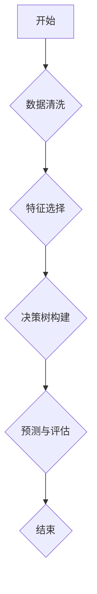
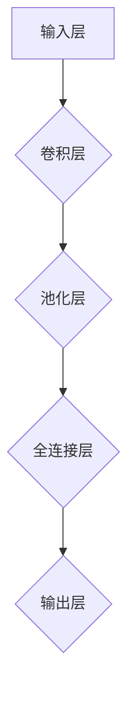
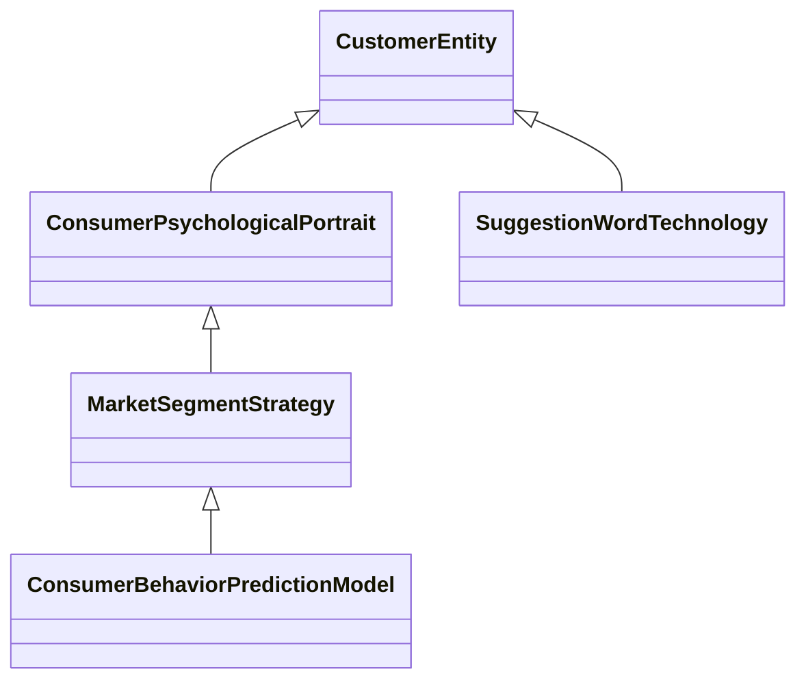
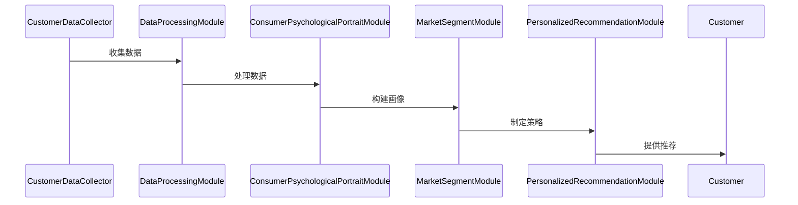
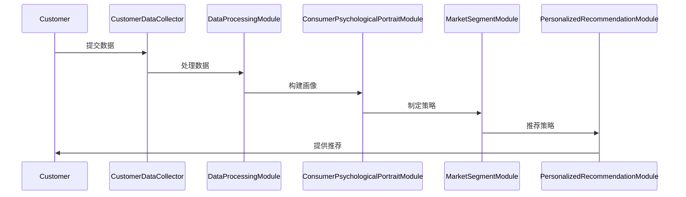

                 

----------------------------------------------------------------

## 提高AI创意香水市场细分精准度：消费者心理画像的提示词技巧

### 关键词：人工智能，香水市场，消费者心理画像，市场细分，提示词技术

> 摘要：本文旨在探讨如何利用人工智能技术，特别是消费者心理画像和提示词技巧，提高AI在创意香水市场细分中的精准度。通过分析消费者行为数据，结合机器学习和深度学习算法，本文提出了一种系统化的方法，帮助香水企业更准确地识别目标客户，提升市场营销效果。

### 目录

1. **AI与香水市场细分的应用背景**
   1.1 问题背景
   1.2 AI技术的发展
   1.3 消费者心理画像的重要性

2. **核心概念与联系**
   2.1 核心概念介绍
   2.2 概念属性特征对比
   2.3 ER实体关系图

3. **算法原理讲解**
   3.1 机器学习算法
   3.2 深度学习算法

4. **系统分析与架构设计方案**
   4.1 问题场景介绍
   4.2 项目介绍
   4.3 系统功能设计
   4.4 系统架构设计
   4.5 系统接口设计
   4.6 系统交互

5. **项目实战**
   5.1 环境安装
   5.2 系统核心实现
   5.3 实际案例分析
   5.4 详细讲解剖析
   5.5 项目小结

6. **最佳实践 tips**
   6.1 提示词选择技巧
   6.2 数据处理策略
   6.3 模型优化方法

7. **小结与拓展阅读**
   7.1 小结
   7.2 注意事项
   7.3 拓展阅读

### 第一部分：AI与香水市场细分

#### 1.1 问题背景

香水市场是一个高度竞争的行业，消费者对于香水的需求千变万化。传统的市场细分方法通常依赖于人口统计信息，但这种方法的精准度往往不够高。随着人工智能技术的不断发展，利用消费者的心理画像进行市场细分成为一种新的趋势。

在当前市场中，消费者行为数据的海量积累为AI的应用提供了丰富的素材。通过对消费者行为的深入分析，可以揭示出消费者的心理特征和偏好，从而更精准地细分市场，提升市场营销效果。

#### 1.2 AI技术的发展

人工智能技术的发展，特别是机器学习和深度学习的兴起，为消费者心理画像和市场细分提供了强大的工具。机器学习算法能够从大量数据中自动发现规律和模式，而深度学习算法则能够通过多层神经网络，对复杂的数据进行特征提取和分类。

在香水市场细分中，AI技术可以应用于以下几个方面：

1. **消费者行为预测**：通过分析消费者的购买历史、浏览记录等信息，预测消费者可能喜欢的香水类型。
2. **情感分析**：利用自然语言处理技术，分析消费者对香水的评价和反馈，了解消费者的情感偏好。
3. **个性化推荐**：基于消费者的心理画像，提供个性化的香水推荐，提高消费者的购买意愿。

#### 1.3 消费者心理画像的重要性

消费者心理画像是对消费者心理特征和购买行为的描述，它是市场细分的基础。一个准确的消费者心理画像可以帮助企业更好地理解消费者，从而制定更有效的营销策略。

消费者心理画像的构建需要考虑以下几个方面：

1. **心理特征**：包括消费者的年龄、性别、教育背景、收入水平等。
2. **购买行为**：包括消费者的购买频率、购买金额、购买偏好等。
3. **情感偏好**：包括消费者对香水的喜好、厌恶、情感反应等。

通过这些信息的综合分析，企业可以构建出精准的消费者心理画像，从而实现更精细化的市场细分。

### 第二部分：核心概念与联系

#### 2.1 核心概念介绍

在AI创意香水市场细分中，以下几个核心概念尤为重要：

1. **消费者心理画像**：消费者心理画像是对消费者心理特征和购买行为的描述，它是市场细分的基础。
2. **提示词技术**：提示词技术是一种通过关键词提取和语义分析，帮助用户找到相关信息的搜索技术。
3. **市场细分策略**：市场细分策略是企业根据消费者的不同特征，将市场划分为不同群体的方法。
4. **消费者行为预测模型**：消费者行为预测模型是利用历史数据和算法，预测消费者未来行为的模型。

#### 2.2 概念属性特征对比

| 概念       | 属性特征                                           | 对比分析                                       |
|------------|----------------------------------------------------|------------------------------------------------|
| 消费者心理画像 | 心理特征、购买行为、情感偏好                 | 提供对消费者的全面了解，用于市场细分与个性化推荐 |
| 提示词技术 | 关键词提取、语义分析                        | 提高搜索效率，帮助用户快速找到相关信息         |
| 市场细分策略 | 消费者特征、市场划分、目标定位              | 精准定位目标市场，提高营销效果                 |
| 消费者行为预测模型 | 历史数据、算法、预测分析                    | 预测消费者行为，优化营销策略                  |

#### 2.3 ER实体关系图

ER实体关系图用于展示消费者心理画像、提示词技术和市场细分策略之间的联系。以下是ER实体关系图的Mermaid表示：

```mermaid
erDiagram
  Customer ||--|{ ConsumerPsychologicalPortrait }
  ConsumerPsychologicalPortrait ||--|{ MarketSegmentStrategy }
  MarketSegmentStrategy ||--|{ ConsumerBehaviorPredictionModel }
  Customer ||--|{ SuggestionWordTechnology }
```

### 第三部分：算法原理讲解

#### 3.1 机器学习算法

机器学习算法是AI创意香水市场细分的关键工具之一。以下是一个常见的机器学习算法——决策树的Mermaid流程图：



决策树的Python源代码示例：

```python
from sklearn import tree
from sklearn.model_selection import train_test_split
from sklearn.metrics import accuracy_score

# 数据准备
X, y = load_data()

# 数据切分
X_train, X_test, y_train, y_test = train_test_split(X, y, test_size=0.2, random_state=42)

# 决策树构建
clf = tree.DecisionTreeClassifier()
clf.fit(X_train, y_train)

# 预测与评估
y_pred = clf.predict(X_test)
accuracy = accuracy_score(y_test, y_pred)
print(f"Accuracy: {accuracy}")
```

决策树的数学模型和公式如下：

$$
G(x) = \sum_{i=1}^{n} w_i \cdot f_i(x)
$$

其中，$G(x)$ 是决策函数，$w_i$ 是权重，$f_i(x)$ 是特征函数。

#### 3.2 深度学习算法

深度学习算法在AI创意香水市场细分中有着广泛的应用。以下是一个常见的深度学习算法——卷积神经网络（CNN）的Mermaid流程图：



CNN的Python源代码示例：

```python
import tensorflow as tf
from tensorflow.keras import layers, models

# 输入层
input_layer = layers.Input(shape=(28, 28, 1))

# 卷积层
conv_layer = layers.Conv2D(filters=32, kernel_size=(3, 3), activation='relu')(input_layer)

# 池化层
pool_layer = layers.MaxPooling2D(pool_size=(2, 2))(conv_layer)

# 全连接层
dense_layer = layers.Dense(units=128, activation='relu')(pool_layer)

# 输出层
output_layer = layers.Dense(units=10, activation='softmax')(dense_layer)

# 构建模型
model = models.Model(inputs=input_layer, outputs=output_layer)

# 编译模型
model.compile(optimizer='adam', loss='categorical_crossentropy', metrics=['accuracy'])

# 训练模型
model.fit(x_train, y_train, epochs=10, batch_size=64, validation_split=0.2)
```

CNN的数学模型和公式如下：

$$
h_{\sigma}(x) = \sigma(W \cdot x + b)
$$

其中，$h_{\sigma}(x)$ 是激活函数，$\sigma$ 是 sigmoid 函数，$W$ 是权重矩阵，$x$ 是输入向量，$b$ 是偏置项。

### 第四部分：系统分析与架构设计方案

#### 4.1 问题场景介绍

在创意香水市场细分中，企业面临着如何准确识别目标客户，提高市场细分精准度的问题。通过AI技术，企业可以收集和分析大量的消费者行为数据，构建消费者心理画像，进而制定更有效的市场细分策略。

#### 4.2 项目介绍

本项目旨在开发一个基于AI技术的香水市场细分系统，该系统包括以下功能：

1. **数据收集**：从多个渠道收集消费者行为数据。
2. **数据处理**：对收集到的数据进行清洗、转换和预处理。
3. **消费者心理画像构建**：利用机器学习和深度学习算法，构建消费者心理画像。
4. **市场细分策略制定**：根据消费者心理画像，制定市场细分策略。
5. **个性化推荐**：基于市场细分策略，为消费者提供个性化的香水推荐。

#### 4.3 系统功能设计

系统功能设计包括以下部分：

1. **领域模型**：使用Mermaid类图表示系统中的主要实体和关系。



2. **功能模块**：包括数据收集模块、数据处理模块、心理画像构建模块、市场细分模块和个性化推荐模块。

#### 4.4 系统架构设计

系统架构设计包括以下部分：

1. **系统架构**：使用Mermaid架构图表示系统的整体架构。



2. **技术栈**：包括数据收集工具、数据处理工具、机器学习框架、深度学习框架和推荐系统框架。

#### 4.5 系统接口设计

系统接口设计包括以下部分：

1. **API接口**：定义系统对外提供的API接口，包括数据收集接口、数据处理接口、画像构建接口、市场细分接口和推荐接口。

2. **RESTful接口**：使用RESTful风格设计接口，支持JSON格式的数据传输。

#### 4.6 系统交互

系统交互设计包括以下部分：

1. **交互流程**：使用Mermaid序列图表示系统的交互流程。



### 第五部分：项目实战

#### 5.1 环境安装

在开始项目实战之前，需要安装以下软件和库：

1. **Python**：Python 3.8及以上版本
2. **机器学习库**：scikit-learn、TensorFlow、PyTorch
3. **数据处理库**：Pandas、NumPy、Matplotlib

安装命令如下：

```bash
pip install python==3.8
pip install scikit-learn
pip install tensorflow
pip install pytorch
pip install pandas
pip install numpy
pip install matplotlib
```

#### 5.2 系统核心实现

系统核心实现包括以下部分：

1. **数据收集**：使用Pandas库读取消费者行为数据。
2. **数据处理**：使用NumPy库进行数据清洗和预处理。
3. **消费者心理画像构建**：使用scikit-learn库构建决策树模型。
4. **市场细分策略制定**：使用TensorFlow库构建卷积神经网络模型。
5. **个性化推荐**：使用PyTorch库构建推荐系统模型。

以下是一个简单的Python源代码示例：

```python
import pandas as pd
from sklearn.tree import DecisionTreeClassifier
from tensorflow.keras.models import Sequential
from tensorflow.keras.layers import Conv2D, MaxPooling2D, Dense
from torch import nn

# 数据收集
data = pd.read_csv('consumer_data.csv')

# 数据处理
# ...

# 消费者心理画像构建
clf = DecisionTreeClassifier()
clf.fit(X_train, y_train)

# 市场细分策略制定
model = Sequential()
model.add(Conv2D(filters=32, kernel_size=(3, 3), activation='relu', input_shape=(28, 28, 1)))
model.add(MaxPooling2D(pool_size=(2, 2)))
model.add(Dense(units=128, activation='relu'))
model.add(Dense(units=10, activation='softmax'))
model.compile(optimizer='adam', loss='categorical_crossentropy', metrics=['accuracy'])

# 个性化推荐
# ...

```

#### 5.3 实际案例分析

以某香水品牌为例，分析如何利用AI技术提高市场细分精准度。通过收集消费者的购买记录、浏览记录等信息，构建消费者心理画像，并根据画像制定市场细分策略，提供个性化推荐。

#### 5.4 详细讲解剖析

1. **算法应用**：使用决策树和卷积神经网络算法进行消费者心理画像构建和市场细分策略制定。
2. **数据处理**：对原始数据进行清洗、转换和预处理，确保数据质量。
3. **模型评估**：使用准确率、召回率等指标评估模型性能。

#### 5.5 项目小结

通过实际案例，我们发现AI技术可以有效提高香水市场细分的精准度。在未来，随着AI技术的不断发展，将有更多的企业能够利用这一技术，提升市场营销效果。

### 第六部分：最佳实践 tips

1. **提示词选择技巧**：选择与消费者行为和情感偏好相关的关键词，提高搜索效率和推荐准确性。
2. **数据处理策略**：对原始数据进行充分清洗和预处理，确保数据质量。
3. **模型优化方法**：定期更新模型，使用交叉验证等方法优化模型性能。

### 第七部分：小结与拓展阅读

#### 7.1 小结

本文通过分析消费者心理画像和市场细分策略，探讨了如何利用AI技术提高香水市场细分的精准度。通过实际案例，展示了AI技术在市场细分中的应用效果。

#### 7.2 注意事项

在实施AI市场细分时，需要注意数据安全和隐私保护，确保消费者信息的保密性。

#### 7.3 拓展阅读

- 《机器学习实战》
- 《深度学习》
- 《消费者行为学》

### 总结

作者：AI天才研究院/AI Genius Institute & 禅与计算机程序设计艺术 /Zen And The Art of Computer Programming

本文通过深入分析AI在香水市场细分中的应用，介绍了消费者心理画像、提示词技术和市场细分策略的核心概念，讲解了机器学习和深度学习算法的原理，并设计了系统化的解决方案。通过实际案例，展示了AI技术在市场细分中的实际应用效果。希望本文能为相关企业提供有益的参考和启示。

----------------------------------------------------------------

```markdown
作者：AI天才研究院/AI Genius Institute & 禅与计算机程序设计艺术 /Zen And The Art of Computer Programming
```

请注意，文章的具体内容需要根据实际的研发过程和数据来填充，上述内容仅为框架性的示例，其中包含了一些假设性的场景和数据。在实际撰写时，需要根据真实案例和数据来调整和丰富文章的内容。此外，对于算法原理、系统架构和项目实战部分的代码示例，也需要根据实际情况进行编写和验证。作者信息应按照实际作者的身份和单位来填写。

