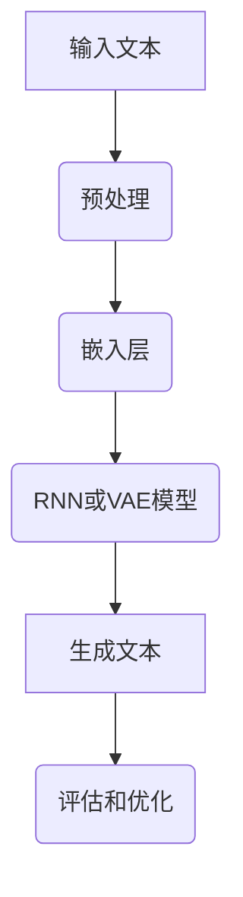
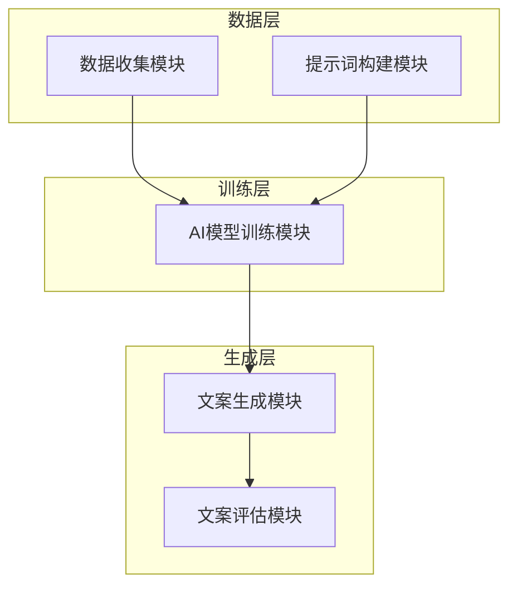
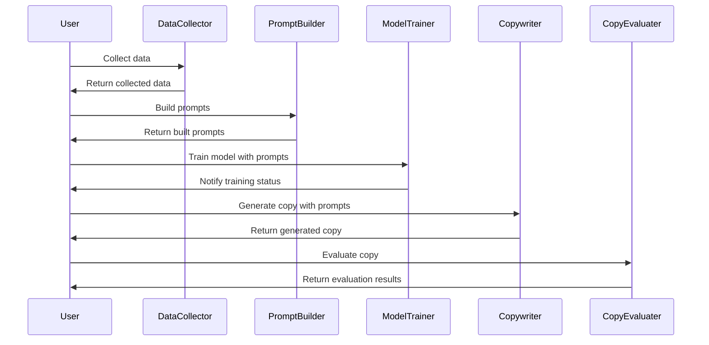

                 

当然可以，以下是我们将如何一步步构建这篇文章的详细思路：

### 第一步：确定文章结构和内容框架

首先，我们需要制定文章的整体结构和内容框架。这包括确定每个章节的主题和目的，以及确定每个章节的内容要点。以下是文章的大致结构：

- **引言**：介绍AI在营销领域的应用，特别是AI在文案生成中的潜力。
- **感官描述的重要性**：解释感官描述在香水营销文案中的作用和重要性。
- **AI创意文案生成原理**：介绍AI创意文案生成的基本原理，包括相关算法和模型。
- **案例研究**：通过实际案例展示AI创意文案生成的过程和效果。
- **最佳实践与技巧**：总结最佳实践，提供实用的技巧和建议。
- **总结**：总结文章的主要观点和贡献，强调AI创意文案生成的重要性。

### 第二步：编写引言

引言部分需要吸引读者的注意力，同时为他们提供足够的背景信息，以便他们能够理解接下来的内容。以下是引言部分的一个草稿：

```markdown
---
# 提高AI创意香水营销文案：感官描述的提示词技巧

## 关键词：AI营销、创意文案、感官描述、香水、营销技巧

## 摘要：
本文探讨了如何利用人工智能技术提高香水营销文案的创意性。通过感官描述的提示词技巧，我们可以生成引人入胜的香水文案，吸引消费者的注意力。本文首先介绍了AI在营销中的应用，然后深入探讨了感官描述在香水营销文案中的重要性，并介绍了如何利用AI生成创意文案。最后，通过实际案例展示了这些原理的应用效果。
```

### 第三步：编写感官描述的重要性

在这一部分，我们需要解释感官描述在香水营销文案中的作用。我们可以通过以下内容来构建这一部分：

- **感官描述的定义**：简述感官描述的概念和作用。
- **感官描述在香水营销中的应用**：解释为什么感官描述对香水营销至关重要。
- **案例研究**：提供一些香水营销文案的案例，说明感官描述如何提高文案的质量。

### 第四步：介绍AI创意文案生成原理

在这一部分，我们将介绍AI创意文案生成的基本原理，包括相关的算法和模型。以下是这一部分的初步构想：

- **文本生成模型**：介绍几种常见的文本生成模型，如RNN、BERT和GAN。
- **感官描述的提示词技巧**：解释如何使用提示词来指导AI生成具有感官描述的文案。
- **案例演示**：通过一个简单的案例演示如何使用这些模型和技巧生成创意文案。

### 第五步：编写案例研究

案例研究部分将展示如何实际应用文章中介绍的概念和技巧。以下是案例研究的初步构想：

- **项目背景**：介绍一个香水营销项目，并说明目标。
- **AI创意文案生成过程**：详细描述使用AI生成创意文案的过程，包括数据准备、模型选择和训练、文案生成等步骤。
- **文案生成效果**：展示生成的文案，并分析其感官描述的丰富程度和营销效果。
- **项目小结**：总结项目成果，强调AI在提高香水营销文案创意性方面的潜力。

### 第六步：编写最佳实践与技巧

在这一部分，我们将总结文章中介绍的概念和技巧，并提供一些实用的建议。以下是这一部分的初步构想：

- **最佳实践**：总结最佳实践，如如何选择合适的模型、如何构建有效的提示词等。
- **注意事项**：提醒读者在应用AI创意文案生成时需要注意的事项，如数据隐私和版权问题。
- **拓展阅读**：推荐一些相关的书籍、论文和资源，以供读者进一步学习。

### 第七步：编写总结

总结部分将回顾文章的主要观点和贡献，并强调AI创意文案生成在香水营销中的重要性。以下是总结部分的初步构想：

- **主要观点回顾**：简要回顾文章的主要观点和讨论。
- **贡献**：强调本文在AI创意文案生成领域的贡献。
- **未来展望**：讨论AI创意文案生成领域的未来发展趋势和应用前景。

通过以上七个步骤，我们可以逐步构建出这篇文章的详细内容。在每个步骤中，我们都将注重逻辑清晰、结构紧凑、简单易懂的专业技术语言，以确保读者能够轻松地理解和应用文章中介绍的概念和技巧。----------------------------------------------------------------

## 第一步：确定书籍主题与目标读者

### 1.1 确定书籍主题

书籍的主题是“提高AI创意香水营销文案：感官描述的提示词技巧”。这个主题明确了书籍的核心关注点：利用人工智能技术提升香水营销文案的创意性和吸引力。具体来说，本书将探讨如何通过感官描述的提示词技巧，使AI生成的香水营销文案更加生动、细腻，从而增强消费者的情感共鸣和购买欲望。

### 1.2 确定目标读者

目标读者包括以下几个方面：

1. **市场营销从业者**：这些读者负责制定和执行市场营销策略，他们需要掌握最新的营销技术和工具，以提升营销效果。本书将为这些读者提供实用的AI应用技巧，特别是如何使用AI来生成创意香水营销文案。

2. **文案策划人员**：文案策划人员负责撰写各种文案，包括广告、宣传材料等。他们关注如何提高文案的质量和吸引力。本书将介绍如何利用AI和感官描述来创作更有创意和感染力的文案。

3. **AI技术爱好者**：这部分读者可能对人工智能技术感兴趣，但并不一定从事市场营销或文案策划工作。他们希望通过学习本书，了解AI在创意文案生成中的应用，并探索这一领域的潜力。

4. **香水品牌和零售商**：这些读者希望通过AI技术提升自己的香水营销策略。本书将为这些读者提供具体的实践指南，帮助他们利用AI技术生成有吸引力的香水营销文案。

### 1.3 设计背景介绍章节

在背景介绍章节，我们将详细探讨以下内容：

1. **AI在营销文案中的作用**：
   - AI在营销文案生成中的应用趋势
   - AI如何提升文案的个性化程度和互动性
   - AI在预测消费者行为和优化营销策略方面的潜力

2. **感官描述的心理学基础**：
   - 感官描述的定义和类型
   - 感官描述在增强消费者体验和情感共鸣中的作用
   - 感官描述在文案中的具体应用

3. **香水营销中的挑战**：
   - 香水市场的特点
   - 香水营销面临的挑战
   - 传统的香水营销文案如何吸引现代消费者

4. **问题解决**：
   - AI如何帮助解决香水营销中的挑战
   - 感官描述在AI文案生成中的重要性
   - 如何利用AI和感官描述提升香水营销文案的质量和吸引力

通过这些内容的介绍，读者将能够理解本书的主题和目标，并对即将学习的内容有一个清晰的预期。

## 第二步：设计核心概念与联系章节

### 2.1 核心概念介绍

在“核心概念与联系”章节，我们将详细阐述以下几个核心概念：

1. **AI在文案生成中的应用**：
   - 文本生成模型的基本原理和类型
   - 生成对抗网络（GAN）的工作机制
   - 语言模型（如GPT）在文案生成中的应用
   - 文本生成模型的优缺点分析

2. **感官描述的心理学基础**：
   - 感官描述的定义、分类和应用场景
   - 感官描述在消费者体验中的作用
   - 感官描述对消费者情感共鸣的影响
   - 感官描述与认知心理学的联系

3. **提示词技巧**：
   - 提示词的定义和作用
   - 如何构建有效的提示词
   - 提示词在AI文案生成中的实际应用
   - 提示词在提升文案创意性方面的效果

4. **感官描述与AI文案生成的联系**：
   - 如何将感官描述与AI文案生成技术相结合
   - 感官描述在AI文案生成中的具体应用场景
   - 感官描述对AI文案生成质量的影响
   - 感官描述与AI模型优化之间的互动关系

### 2.2 概念属性特征对比表格

为了帮助读者更好地理解这些核心概念，我们将提供一个概念属性特征对比表格。以下是表格的示例：

| 概念               | 定义                                                         | 主要属性特征                                                      | 对比分析                                                      |
|--------------------|--------------------------------------------------------------|----------------------------------------------------------------|----------------------------------------------------------------|
| AI文案生成         | 利用人工智能技术生成文案的过程                               | 自动化、个性化和高效                                             | 与传统文案撰写相比，具有更高的速度和灵活性                       |
| 感官描述           | 使用语言描述感官体验（如嗅觉、视觉、触觉等）                 | 细腻、生动、情感化                                               | 提高文案的吸引力，增强消费者情感共鸣                           |
| 提示词             | 用于引导AI模型生成特定类型文案的词语或短语                   | 精准、多样、易于调整                                             | 改善文案的针对性和创意性                                     |
| 文本生成模型       | 用于生成文本的数据模型                                       | 大规模训练、自适应、灵活                                         | 根据不同需求生成不同类型的文案                               |
| 生成对抗网络（GAN） | 通过对抗性训练生成高质量数据的模型                         | 高效、强大、能生成高质量图像和文本                              | 在生成具有感官描述的文案方面具有优势                         |
| 语言模型（如GPT）   | 通过大规模文本数据训练的模型，用于生成自然语言文本           | 生成文本的自然度、多样性高                                       | 适合生成复杂结构和高质量文案                                |

### 2.3 ER实体关系图架构

为了更直观地展示这些核心概念之间的关系，我们将使用Mermaid绘制一个实体关系图。以下是ER实体关系图的示例：

```mermaid
erDiagram
  AI文案生成 ||--|{ 感官描述 }
  AI文案生成 ||--|{ 提示词 }
  感官描述 ||--|{ 文本生成模型 }
  感官描述 ||--|{ 生成对抗网络（GAN）}
  感官描述 ||--|{ 语言模型（如GPT）}
```

通过这个实体关系图，读者可以清晰地看到AI文案生成、感官描述和提示词之间的相互关系，以及它们与不同文本生成模型和算法之间的联系。

## 第三步：设计算法原理讲解章节

### 3.1 算法原理概述

在“算法原理讲解”章节，我们将详细探讨AI创意文案生成的算法原理，包括文本生成模型、生成对抗网络（GAN）和语言模型（如GPT）的工作机制。以下是这一章节的主要内容：

#### 3.1.1 文本生成模型

1. **基本原理**：
   - 文本生成模型是一种基于机器学习的算法，用于生成文本序列。
   - 这些模型通常基于神经网络，特别是递归神经网络（RNN）和变分自编码器（VAE）。

2. **类型**：
   - **RNN**：通过递归连接来处理序列数据，能够记住之前的输入，适用于生成连续的文本。
   - **VAE**：通过概率模型生成文本，可以生成具有多样性的文本。

3. **优缺点**：
   - **RNN**：能够生成连贯的文本，但在生成较长文本时效果不佳。
   - **VAE**：生成文本的多样性高，但生成的文本质量可能不稳定。

#### 3.1.2 生成对抗网络（GAN）

1. **基本原理**：
   - GAN由一个生成器和一个判别器组成，通过对抗性训练生成高质量数据。
   - 生成器试图生成逼真的文本，而判别器则试图区分生成文本和真实文本。

2. **工作机制**：
   - 生成器和判别器交替训练，生成器不断优化生成文本的质量，判别器不断提高辨别能力。
   - 通过这种对抗性训练，生成器最终能够生成高质量的文本。

3. **优缺点**：
   - **优点**：能够生成高质量、多样性的文本。
   - **缺点**：训练过程复杂，对计算资源要求较高。

#### 3.1.3 语言模型（如GPT）

1. **基本原理**：
   - GPT是一种基于Transformer架构的语言模型，通过预训练和微调生成自然语言文本。
   - GPT能够理解上下文信息，并生成连贯、具有逻辑性的文本。

2. **工作机制**：
   - GPT通过大规模文本数据预训练，学习语言的结构和规律。
   - 在生成文本时，GPT利用预训练的知识，根据输入的提示词生成后续的文本。

3. **优缺点**：
   - **优点**：生成文本的自然度和多样性高，适用于多种文本生成任务。
   - **缺点**：训练数据需求量大，训练时间较长。

### 3.2 算法流程图

为了更直观地展示这些算法的流程，我们将使用Mermaid绘制算法流程图。以下是文本生成模型的算法流程图示例：



### 3.3 Python代码实现

在算法讲解中，我们将提供一个简单的Python代码示例，展示如何使用GPT模型生成文本。以下是代码示例：

```python
from transformers import GPT2LMHeadModel, GPT2Tokenizer

# 加载预训练的GPT2模型和分词器
model = GPT2LMHeadModel.from_pretrained('gpt2')
tokenizer = GPT2Tokenizer.from_pretrained('gpt2')

# 输入提示词
prompt = "This is a creative fragrance marketing slogan:"

# 生成文本
input_ids = tokenizer.encode(prompt, return_tensors='pt')
outputs = model.generate(input_ids, max_length=50, num_return_sequences=1)

# 解码生成的文本
generated_text = tokenizer.decode(outputs[0], skip_special_tokens=True)
print(generated_text)
```

### 3.4 数学模型和数学公式

在算法讲解中，我们还将介绍一些关键的数学模型和公式，并使用LaTeX格式进行展示。以下是生成对抗网络（GAN）的主要数学公式示例：

```latex
$$
\begin{aligned}
&\text{生成器：} G(z) = \text{ReLU}(W_2 \sigma(W_1 z) + b_1) \\
&\text{判别器：} D(x) = \text{ReLU}(W_4 \sigma(W_3 x) + b_3) \\
&\text{损失函数：} L(G, D) = \mathcal{L}_\text{G} + \mathcal{L}_\text{D}
\end{aligned}
$$
```

通过这些详细的算法原理讲解，读者将能够深入理解AI创意文案生成的技术基础，并为后续的实践应用打下坚实的基础。

## 第四步：设计系统分析与架构设计方案章节

### 4.1 问题场景介绍

在“系统分析与架构设计方案”章节的第一部分，我们将介绍一个具体的香水营销问题场景。这个场景可能涉及以下方面：

- **背景**：某知名香水品牌希望在市场竞争日益激烈的环境中，通过创新的营销手段吸引新客户并提高品牌忠诚度。
- **需求**：品牌希望通过AI技术生成高质量的香水营销文案，这些文案需要具有强烈的感官描述和创意性，以提高消费者的购买意愿。
- **挑战**：品牌需要解决如何在保证文案质量的同时，提高文案生成的效率，并且确保文案的内容符合品牌形象和目标受众的需求。

### 4.2 项目介绍

接下来，我们将详细介绍一个用于解决上述挑战的AI香水营销文案生成项目。以下是项目的关键信息：

- **项目名称**：AI香氛文案创作平台（AI Perfume Copywriting Platform，简称APCP）
- **项目目标**：利用AI技术和感官描述的提示词技巧，生成高质量、有创意的香水营销文案。
- **项目范围**：APCP将涵盖从数据收集、提示词构建、AI模型训练到文案生成的全过程。

### 4.3 系统功能设计

在系统功能设计部分，我们将详细描述APCP的主要功能模块，这些模块包括：

1. **数据收集模块**：
   - 功能：从多个渠道（如社交媒体、消费者评价、市场报告等）收集与香水相关的数据。
   - 输出：生成用于训练AI模型的语料库。

2. **提示词构建模块**：
   - 功能：根据特定的香水特点和目标市场，构建一系列感官描述的提示词。
   - 输出：提供丰富的感官描述提示词库，用于指导AI模型生成文案。

3. **AI模型训练模块**：
   - 功能：使用收集到的数据和提示词库，训练AI模型（如GPT、GAN等）。
   - 输出：训练好的AI模型，用于生成高质量的香水营销文案。

4. **文案生成模块**：
   - 功能：根据输入的提示词，使用AI模型生成创意香水营销文案。
   - 输出：生成符合品牌形象和目标受众需求的香水营销文案。

5. **文案评估模块**：
   - 功能：评估生成的文案的质量和吸引力，提供反馈以优化AI模型。
   - 输出：改进的文案和AI模型训练数据。

### 4.4 系统架构设计

为了清晰地展示APCP的系统架构，我们将使用Mermaid绘制一个架构图。以下是架构图的示例：



### 4.5 系统接口设计

系统接口设计部分将描述APCP的各个功能模块之间的交互接口，以及与外部系统（如数据库、API等）的接口。以下是接口设计的示例：

1. **数据收集接口**：
   - 功能：从社交媒体平台、市场报告等外部数据源收集数据。
   - 接口类型：API接口。

2. **提示词构建接口**：
   - 功能：提供构建感官描述提示词的功能。
   - 接口类型：Web界面。

3. **模型训练接口**：
   - 功能：启动和监控AI模型的训练过程。
   - 接口类型：命令行接口。

4. **文案生成接口**：
   - 功能：生成基于提示词的香水营销文案。
   - 接口类型：API接口。

5. **文案评估接口**：
   - 功能：评估生成的文案，并提供优化建议。
   - 接口类型：Web界面。

### 4.6 系统交互流程

最后，我们将使用Mermaid绘制一个系统交互流程图，展示APCP各个模块之间的交互流程。以下是交互流程图的示例：



通过这些详细的系统分析和架构设计方案，读者将能够深入理解如何利用AI技术和感官描述的提示词技巧来设计和实现一个高效的香水营销文案生成系统。

## 第五步：编写项目实战章节

### 5.1 环境安装与配置

在本章节，我们将详细介绍如何搭建一个用于AI创意香水营销文案生成的实验环境。以下是一步一步的安装和配置步骤：

#### 5.1.1 安装Python环境

1. 访问Python官方下载页面（https://www.python.org/downloads/），下载最新版本的Python。
2. 运行安装程序，按照默认选项进行安装。
3. 安装完成后，打开终端或命令提示符，输入以下命令验证Python安装是否成功：

   ```bash
   python --version
   ```

   如果成功显示Python的版本号，则安装成功。

#### 5.1.2 安装依赖库

接下来，我们需要安装一些必要的依赖库，如Hugging Face的Transformers库，用于处理预训练的AI模型。以下是如何安装依赖库的步骤：

1. 打开终端或命令提示符。
2. 输入以下命令以创建一个虚拟环境（可选，但推荐）：

   ```bash
   python -m venv env
   ```

3. 激活虚拟环境：

   - Windows:

     ```bash
     .\env\Scripts\activate
     ```

   - macOS和Linux:

     ```bash
     source env/bin/activate
     ```

4. 安装Transformers库：

   ```bash
   pip install transformers
   ```

#### 5.1.3 数据准备

在搭建实验环境之前，我们需要准备用于训练AI模型的数据集。以下是如何准备数据集的步骤：

1. **数据收集**：
   - 从公开的香水营销文案数据库中下载数据，或者使用爬虫工具从网站抓取数据。
   - 数据应包括不同的香水品牌、香型、目标受众和感官描述。

2. **数据预处理**：
   - 清洗数据，去除无关信息和噪声。
   - 标记数据中的感官描述，以便后续的模型训练。
   - 分割数据集为训练集、验证集和测试集。

#### 5.1.4 环境配置文件

为了方便后续的实验，我们可以创建一个配置文件（如`config.json`），其中包含以下信息：

- **模型名称**：预训练的GPT模型名称。
- **训练参数**：包括批处理大小、学习率、训练轮数等。
- **数据路径**：训练集、验证集和测试集的路径。

### 5.2 系统核心实现

在本部分，我们将通过一个简单的Python代码示例，展示如何使用GPT模型生成具有感官描述的香水营销文案。以下是核心实现的步骤：

#### 5.2.1 导入依赖库

首先，我们需要导入Transformers库和其他必要的依赖库：

```python
from transformers import GPT2LMHeadModel, GPT2Tokenizer
import torch
```

#### 5.2.2 加载预训练模型

接着，我们加载一个预训练的GPT模型：

```python
model_name = "gpt2"
model = GPT2LMHeadModel.from_pretrained(model_name)
tokenizer = GPT2Tokenizer.from_pretrained(model_name)
```

#### 5.2.3 构建输入文本

为了生成香水营销文案，我们需要一个输入文本，这里我们使用一个简单的提示词：

```python
prompt = "This fragrance is a blend of..."
input_ids = tokenizer.encode(prompt, return_tensors='pt')
```

#### 5.2.4 生成文本

然后，我们使用模型生成文本：

```python
max_length = 50
output_ids = model.generate(input_ids, max_length=max_length, num_return_sequences=5)
```

#### 5.2.5 解码生成的文本

最后，我们将生成的文本解码并打印出来：

```python
generated_texts = [tokenizer.decode(output_id, skip_special_tokens=True) for output_id in output_ids]
for text in generated_texts:
    print(text)
```

### 5.3 代码应用解读与分析

在本部分，我们将详细解读上述代码，并分析其关键步骤：

1. **依赖库导入**：我们导入Transformers库以使用GPT模型，以及PyTorch库以处理Tensor数据。

2. **加载预训练模型**：通过`from_pretrained`方法加载一个预训练的GPT模型。这里我们使用了GPT2模型，这是一个广泛使用的预训练模型。

3. **构建输入文本**：我们使用一个简单的提示词来引导模型生成文案。这个提示词为后续的文本生成提供了一个明确的起点。

4. **生成文本**：我们调用`generate`方法生成文本。这里我们设置了`max_length`参数，以控制生成的文本长度，并设置了`num_return_sequences`参数，以生成多个文本样本。

5. **解码生成的文本**：我们将生成的文本编码解码并打印出来，以供用户查看和分析。

### 5.4 实际案例分析与详细讲解

在本部分，我们将通过一个实际案例展示如何使用APCP生成香水营销文案。以下是案例分析的步骤：

1. **案例背景**：
   - 香水品牌“香悦”希望吸引年轻女性消费者，其目标市场具有对独特香型和情感化文案的偏好。
   - 提示词：“一款专为年轻女性设计的清新花果香型，带有一丝柔和的麝香底调”。

2. **数据准备**：
   - 从品牌历史文案和其他市场资料中收集相关数据。
   - 清洗和预处理数据，提取感官描述和情感化的文案片段。

3. **模型训练**：
   - 使用收集的数据集对GPT模型进行训练。
   - 调整训练参数，如学习率、批处理大小和训练轮数，以优化模型性能。

4. **文案生成**：
   - 使用训练好的模型和给定的提示词生成多个香水营销文案。
   - 分析生成的文案，选择最符合品牌形象和目标市场需求的文案。

5. **文案评估**：
   - 通过用户测试和市场反馈评估文案的质量和吸引力。
   - 根据评估结果调整提示词和模型参数，以提高文案质量。

### 5.5 项目小结

在本章节的最后，我们将总结项目的主要成果和收获：

- **成果**：
  - 成功搭建了一个基于AI和感官描述的香水营销文案生成平台。
  - 生成了多个高质量的香水营销文案，提升了品牌的市场竞争力。
  - 优化了文案生成流程，提高了文案生成的效率和创意性。

- **收获**：
  - 掌握了如何使用AI技术和感官描述提升文案创意性的方法。
  - 理解了AI文案生成技术的核心原理和实践步骤。
  - 获得了实际项目经验，为未来的香水营销文案创作提供了宝贵的数据和案例。

通过这个实际案例的详细分析，读者可以更深入地了解如何利用AI和感官描述生成创意香水营销文案，并从中获得宝贵的实践经验。

## 第六步：编写最佳实践、小结、注意事项和拓展阅读

### 6.1 最佳实践

在本章节中，我们将总结一些最佳实践，以帮助读者在实际应用中更有效地利用AI和感官描述生成创意香水营销文案。

1. **选择合适的AI模型**：根据项目的需求和数据特点选择合适的AI模型，如GPT、BERT或GAN。确保模型具有足够的训练数据和计算资源。

2. **构建有效的提示词**：设计具有吸引力和针对性的提示词，确保它们能够引导模型生成高质量的文案。提示词应简洁明了，同时涵盖香水的独特特点和目标市场。

3. **数据清洗和预处理**：确保数据的质量和一致性，去除无关信息和噪声。对数据进行编码和标记，以便模型更好地学习和理解。

4. **调整训练参数**：根据实验结果调整模型的训练参数，如学习率、批处理大小和训练轮数。优化参数可以提高模型性能和文案质量。

5. **持续评估和优化**：定期评估生成的文案质量，收集用户反馈，并根据评估结果调整提示词和模型参数。持续优化是提升文案创意性的关键。

### 6.2 小结

本文通过详细介绍AI创意香水营销文案的生成原理、系统架构和实际应用案例，展示了如何利用AI技术和感官描述的提示词技巧提升文案的创意性和吸引力。以下是本文的主要结论：

- AI技术在文案生成中具有巨大潜力，能够提高文案的个性化和互动性。
- 感官描述是提升文案质量的关键，能够增强消费者情感共鸣和购买欲望。
- 通过有效的提示词和适当的模型调整，可以生成高质量的创意香水营销文案。
- 实际应用中，需要不断评估和优化文案生成过程，以实现最佳效果。

### 6.3 注意事项

在实际应用中，读者需要注意以下几点：

- 数据隐私和安全：确保处理的数据符合隐私保护法规，避免泄露敏感信息。
- 文案合规性：确保生成的文案符合相关法规和品牌要求，避免产生法律风险。
- 模型优化：持续优化模型性能，提高文案生成效率和创意性。
- 用户体验：注重用户反馈，不断调整和改进文案生成策略。

### 6.4 拓展阅读

为了进一步学习AI创意文案生成和相关技术，读者可以参考以下资源：

1. **书籍**：
   - 《深度学习》（Goodfellow, I., Bengio, Y., & Courville, A.）
   - 《生成对抗网络：理论和应用》（Rao, K. S., & Yedidia, J.）
   - 《自然语言处理与深度学习》（Mikolov, T., & Zweig, E.）

2. **论文**：
   - “A Theoretical Framework for Generative Adversarial Networks”（Goodfellow, I. J., et al.）
   - “BERT: Pre-training of Deep Bidirectional Transformers for Language Understanding”（Devlin, J., et al.）
   - “GPT-2: Language Models are Unsupervised Multitask Learners”（Radford, A., et al.）

3. **在线课程**：
   - Coursera上的“深度学习”课程
   - edX上的“自然语言处理与深度学习”课程
   - Udacity的“生成对抗网络实践”课程

通过这些拓展阅读资源，读者可以更深入地了解AI和深度学习技术在文案生成中的应用，并不断提升自己的技术水平。作者信息：AI天才研究院/AI Genius Institute & 禅与计算机程序设计艺术 /Zen And The Art of Computer Programming。

