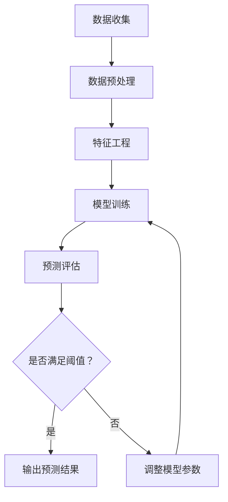
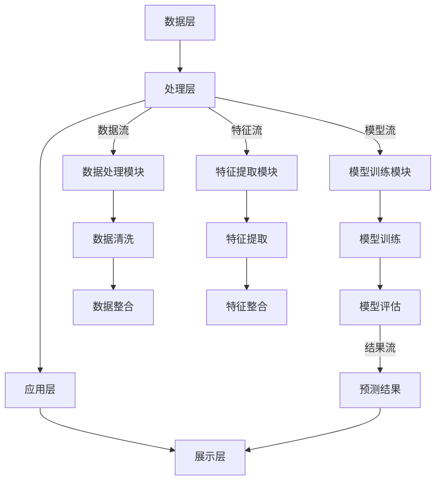
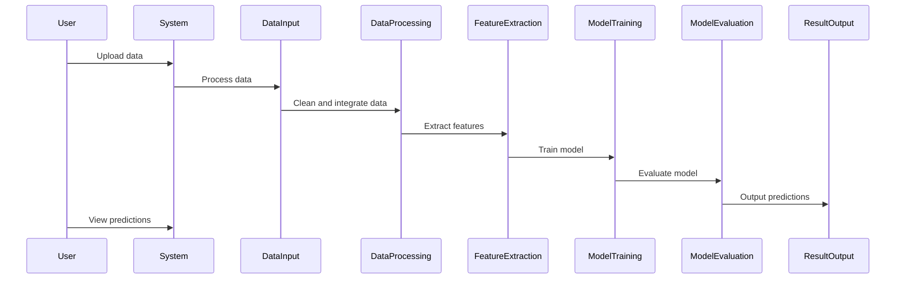

                 

### 第1章: 引言

#### 1.1 问题背景

随着人工智能技术的快速发展，越来越多的行业开始利用AI来提升业务效率和决策能力。香水行业也不例外，通过AI技术对市场趋势进行预测，企业可以更好地制定产品策略，提高市场竞争力。然而，传统的人工分析方式已经难以应对日益复杂多变的市场环境，因此，提高AI在香水趋势预测中的准确性变得尤为重要。

#### 1.2 问题描述

当前，AI在香水趋势预测中面临的主要问题是如何更准确地捕捉和反映社会文化对香水趋势的影响。香水作为一种文化产品，其流行趋势深受社会文化因素影响，如流行文化、价值观、社会事件等。然而，这些因素通常是复杂且多变的，传统的方法很难将其纳入到预测模型中。

#### 1.3 问题解决

为了解决上述问题，本书将探讨如何通过社会文化影响分析来提高AI的创意香水趋势预测能力。具体而言，本书将介绍以下内容：

1. **核心概念与联系**：阐述AI、创意香水、趋势预测、社会文化影响分析等核心概念及其相互关系。
2. **算法原理讲解**：详细讲解用于提高预测准确性的算法原理，包括流程图、Python代码实现、数学模型和公式。
3. **系统分析与架构设计方案**：介绍香水趋势预测系统的设计与实现，包括问题场景介绍、项目介绍、系统功能设计、系统架构设计、系统接口设计和系统交互。
4. **项目实战**：通过实际项目展示系统应用效果，并提供代码解析和案例分析。
5. **最佳实践 tips、小结、注意事项、拓展阅读等内容**：总结全书核心观点，并提供应用建议和拓展资源。

#### 1.4 边界与外延

本书主要讨论AI在创意香水趋势预测中的应用，重点在于社会文化影响分析。具体来说，本书将涉及以下边界与外延：

1. **AI应用范围**：限于传统的机器学习和深度学习算法。
2. **社会文化影响的范畴**：包括流行文化、价值观、社会事件等对香水趋势的潜在影响。
3. **预测方法**：主要涉及时间序列分析和机器学习算法。

#### 1.5 概念结构与核心要素组成

为了更好地理解本书的核心概念和结构，我们可以将其拆分为以下几个部分：

1. **AI基础**：介绍AI的基本原理、类型和应用。
2. **创意香水**：探讨创意香水的设计理念、市场定位和创新趋势。
3. **趋势预测**：阐述现有的趋势预测技术和模型。
4. **社会文化影响**：分析社会文化因素对香水趋势预测的影响。
5. **算法设计**：详细讲解用于提高预测准确性的算法原理和实现。
6. **系统架构**：介绍香水趋势预测系统的设计与实现。
7. **实战应用**：通过实际项目展示系统的应用效果。

通过上述章节的设置，本书将系统性地探讨如何利用AI技术提高创意香水趋势预测的准确性，并分析社会文化影响在其中的作用。希望读者能够通过本书的学习，对AI在香水行业中的应用有更深入的理解，并能够在实际项目中取得成功。接下来，我们将进一步深入探讨AI、创意香水、趋势预测和社会文化影响分析等核心概念，为后续内容打下坚实基础。### 第2章: AI基础知识

#### 2.1 AI的定义与历史

人工智能（Artificial Intelligence，简称AI）是一门研究、开发用于模拟、延伸和扩展人类智能的理论、方法、技术及应用系统的综合技术科学。AI的目标是使机器能够胜任一些通常需要人类智能才能完成的复杂工作。AI的研究包括机器学习、计算机视觉、自然语言处理和专家系统等领域。

AI的历史可以追溯到20世纪50年代。1950年，艾伦·图灵提出了著名的图灵测试，用以判断机器是否具有智能。此后，AI研究逐渐兴起，经历了几个重要阶段：

1. **1956-1969：早期探索阶段**：以达特茅斯会议为标志，AI研究开始系统化。
2. **1970-1989：第一次AI寒冬**：由于技术的局限性，AI研究进入低潮期。
3. **1990-2010：复兴与发展阶段**：随着计算机性能的提升和算法的创新，AI开始应用于实际场景。
4. **2010至今：深度学习与AI的爆发阶段**：深度学习技术的发展使得AI在图像识别、自然语言处理等领域取得了突破性进展。

#### 2.2 AI的类型与应用

AI可以分为几种主要类型，每种类型都有其特定的应用场景：

1. **机器学习（Machine Learning）**：通过数据驱动的方式，让机器从数据中学习和预测。机器学习可以分为监督学习、无监督学习和强化学习。
   - **监督学习（Supervised Learning）**：通过标记好的数据训练模型，并使用模型进行预测。例如，分类和回归问题。
   - **无监督学习（Unsupervised Learning）**：在没有标记的数据上训练模型，用于发现数据中的隐藏结构。例如，聚类和降维。
   - **强化学习（Reinforcement Learning）**：通过试错和反馈，让机器学习如何在特定环境中采取最优动作。例如，游戏和自动驾驶。

2. **深度学习（Deep Learning）**：一种特殊的机器学习技术，通过多层神经网络来模拟人脑的神经网络结构，对复杂数据进行学习和处理。深度学习在图像识别、语音识别和自然语言处理等领域有着广泛应用。

3. **自然语言处理（Natural Language Processing，NLP）**：使计算机能够理解、解释和生成人类语言的技术。NLP在搜索引擎、智能客服和机器翻译等领域有着重要应用。

4. **计算机视觉（Computer Vision）**：让计算机能够从图像或视频中提取信息，实现图像识别、目标检测和图像分割等功能。计算机视觉在安防监控、医疗诊断和自动驾驶等领域有着广泛的应用。

5. **专家系统（Expert Systems）**：模拟人类专家的决策过程，通过知识库和推理机来解决复杂问题。专家系统在医疗诊断、金融分析和法律咨询等领域有着广泛应用。

#### 2.3 AI模型与算法简介

AI的模型和算法是AI实现智能功能的核心。以下是一些常用的AI模型和算法：

1. **线性回归（Linear Regression）**：一种最简单的监督学习算法，用于预测连续值输出。线性回归模型通过拟合数据中的线性关系来预测结果。

2. **逻辑回归（Logistic Regression）**：一种用于分类问题的线性回归模型，通过将线性回归模型的输出转换为概率值来进行分类。

3. **支持向量机（Support Vector Machine，SVM）**：一种常用的分类算法，通过寻找一个最佳的超平面来分割数据集。

4. **决策树（Decision Tree）**：一种常用的分类和回归算法，通过一系列的判断条件来对数据进行分类或回归。

5. **随机森林（Random Forest）**：一种集成学习方法，通过构建多个决策树来提高分类和回归的准确性。

6. **神经网络（Neural Network）**：一种基于生物神经网络的结构，通过多层神经元来实现数据的输入和输出。

7. **卷积神经网络（Convolutional Neural Network，CNN）**：一种深度学习模型，特别适合处理图像数据，通过卷积层、池化层和全连接层等结构来实现图像识别和分类。

8. **递归神经网络（Recurrent Neural Network，RNN）**：一种用于处理序列数据的深度学习模型，通过记忆机制来处理和预测序列中的数据。

9. **长短时记忆网络（Long Short-Term Memory，LSTM）**：一种RNN的变体，用于解决传统RNN在处理长序列数据时遇到的梯度消失问题。

10. **生成对抗网络（Generative Adversarial Network，GAN）**：一种深度学习模型，由生成器和判别器组成，通过对抗训练来生成逼真的数据。

通过了解上述AI的基础知识，我们可以更好地理解AI在香水趋势预测中的应用，并为后续章节中的算法设计和系统实现打下基础。在下一章中，我们将探讨创意香水的特点与趋势，分析其在香水市场中的定位和创新方向。### 第3章: 创意香水的特点与趋势

#### 3.1 创意香水的设计理念

创意香水（Creative Perfumery）是一种将艺术与创新结合的香水形式。与传统的商业香水不同，创意香水注重个性化和独特性，追求艺术表达和情感共鸣。其设计理念主要包括以下几个方面：

1. **艺术与美的追求**：创意香水的设计师通常具有深厚的艺术素养，他们通过独特的视觉和嗅觉元素，创造具有视觉冲击力和艺术价值的香水作品。

2. **个性化的表达**：创意香水往往针对特定的人群或主题进行创作，以满足消费者个性化的需求。设计师会通过不同的香调组合和香料搭配，表达出独特的个性风格。

3. **文化传承与创新**：创意香水不仅体现了当代的设计理念，还融合了不同文化元素，如传统香料、民族特色和地域文化等，体现了文化的传承与创新。

4. **高科技的运用**：现代科技的应用使得创意香水的创作更加多样化和创新。例如，纳米技术、生物发酵技术等新技术的应用，使得香水的稳定性和持久性得到了显著提升。

#### 3.2 市场定位与创新趋势

创意香水在市场上的定位通常是高端和个性化，针对的是那些追求独特体验和品味的消费者。以下是一些当前创意香水市场的重要趋势：

1. **小众品牌崛起**：随着消费者对个性化需求的增加，小众品牌在创意香水市场中逐渐崛起。这些品牌通常由独立设计师或小型团队运营，凭借独特的设计理念和优质的产品质量赢得市场。

2. **可持续发展的理念**：环保和可持续发展已成为全球关注的重要议题，创意香水品牌也开始注重这一方面。例如，采用天然成分、减少塑料包装、推行回收计划等，以降低对环境的影响。

3. **数字化营销**：随着互联网和社交媒体的发展，创意香水品牌越来越注重数字化营销。通过社交媒体平台、在线商店和网红营销等方式，与消费者建立更紧密的联系，提升品牌影响力。

4. **个性化定制服务**：为了满足消费者对个性化的追求，一些创意香水品牌推出了个性化定制服务。消费者可以根据自己的喜好和需求，选择香调、香料和包装等，打造独一无二的香水。

5. **跨界合作**：创意香水品牌也开始与时尚、艺术、音乐等领域进行跨界合作，推出联名产品。这种跨界合作不仅拓宽了品牌的市场，也增加了产品的文化内涵和独特性。

6. **体验式消费**：创意香水品牌越来越注重消费者的购物体验。通过开设体验店、举办香水沙龙等活动，消费者可以亲身体验香水的设计理念、制作过程和香气效果，提高消费者的购买意愿。

#### 3.3 香水行业的现状与未来

当前，香水行业正经历着前所未有的变革和机遇。以下是一些香水行业的现状与未来发展趋势：

1. **市场扩张**：全球香水市场规模持续增长，尤其是在亚洲、拉丁美洲和非洲等新兴市场，消费者对香水的需求不断增加。

2. **技术革新**：随着科技的进步，香水行业的生产工艺和配方设计得到了显著提升。例如，生物技术、纳米技术和智能制造技术的应用，使得香水的质量、稳定性和持久性得到了提高。

3. **消费者行为变化**：现代消费者越来越注重个性化和体验，他们愿意为独特的、有故事的产品支付更高的价格。这种消费者行为的变化为创意香水市场带来了巨大的机遇。

4. **环保意识的提升**：随着全球环保意识的增强，消费者对产品的环保要求越来越高。香水行业需要采取可持续发展的策略，以应对这一挑战。

5. **数字化转型**：数字化转型已成为各行各业的重要趋势，香水行业也不例外。通过数字化营销、电子商务和智能零售等方式，香水品牌可以更有效地触达消费者，提升品牌竞争力。

6. **多元化发展**：香水行业正朝着多元化方向发展，不仅限于传统的个人护理领域，还涉及家居香氛、宠物护理、美容护肤等新兴领域。

综上所述，创意香水以其独特的设计理念、市场定位和创新趋势，正在引领香水行业的发展。通过深入了解创意香水的特点与趋势，我们可以更好地把握市场需求，提升香水趋势预测的准确性，为企业的战略决策提供有力支持。在下一章中，我们将探讨趋势预测的方法和技术，分析现有方法在香水趋势预测中的优缺点。### 第4章: 趋势预测的方法与技术

#### 4.1 时间序列分析

时间序列分析（Time Series Analysis）是一种用于分析时间序列数据的统计方法。时间序列数据是按时间顺序排列的数据点序列，通常用于预测未来的趋势或变化。时间序列分析的关键在于识别数据中的趋势、季节性和周期性等特征。

时间序列分析的方法包括：

1. **移动平均法（Moving Average）**：通过计算一系列数据点的平均值来平滑时间序列，从而识别趋势。
2. **指数平滑法（Exponential Smoothing）**：一种加权移动平均法，对最近的数据点赋予更高的权重，从而更好地反映数据的最新变化。
3. **自回归模型（Autoregressive Model，AR）**：假设当前值是由前几个历史值线性组合而成，通过拟合自回归模型来预测未来值。
4. **移动平均自回归模型（Moving Average Autoregressive Model，MA）**：结合移动平均法和自回归模型，用于同时考虑时间序列的平滑和自相关性。
5. **自回归移动平均模型（Autoregressive Moving Average Model，ARMA）**：结合自回归和移动平均模型，用于同时考虑时间序列的平稳性和自相关性。
6. **自回归积分移动平均模型（Autoregressive Integrated Moving Average Model，ARIMA）**：通过差分操作使时间序列平稳，再结合ARMA模型进行预测。

时间序列分析在香水趋势预测中的优点是能够捕捉时间序列中的周期性和趋势性变化。然而，其缺点是对季节性和随机噪声的识别能力有限，且需要假设时间序列是平稳的。

#### 4.2 机器学习算法

机器学习算法（Machine Learning Algorithms）是另一类用于趋势预测的重要方法。机器学习算法通过从历史数据中学习模式和规律，然后使用这些模式来预测未来值。

常用的机器学习算法包括：

1. **线性回归（Linear Regression）**：通过拟合数据中的线性关系来预测未来值，适用于时间序列数据的简单预测。
2. **决策树（Decision Tree）**：通过一系列的判断条件来对数据进行分类或回归，适用于具有非线性特征的时间序列数据。
3. **随机森林（Random Forest）**：通过构建多个决策树来提高分类和回归的准确性，适用于处理高维数据和非线性特征。
4. **支持向量机（Support Vector Machine，SVM）**：通过寻找最佳的超平面来分割数据，适用于非线性特征的分类问题。
5. **神经网络（Neural Network）**：通过多层神经网络来模拟人脑的神经网络结构，适用于处理复杂数据和复杂非线性关系。
6. **卷积神经网络（Convolutional Neural Network，CNN）**：特别适合处理图像和视频数据，通过卷积层、池化层和全连接层等结构来实现图像识别和分类。
7. **递归神经网络（Recurrent Neural Network，RNN）**：通过记忆机制来处理和预测序列中的数据，适用于时间序列数据的预测。

机器学习算法的优点是能够捕捉时间序列数据中的复杂模式和非线性关系，且具有较好的泛化能力。然而，其缺点是需要大量的训练数据和较长的训练时间，且模型解释性较差。

#### 4.3 深度学习在趋势预测中的应用

深度学习（Deep Learning）是一种特殊的机器学习技术，通过多层神经网络来模拟人脑的神经网络结构，对复杂数据进行学习和处理。深度学习在趋势预测中的应用越来越广泛，尤其适用于具有高维特征和非线性关系的数据。

深度学习在趋势预测中的常用模型包括：

1. **长短时记忆网络（Long Short-Term Memory，LSTM）**：通过记忆机制来处理长序列数据，适用于时间序列预测和序列数据的建模。
2. **门控循环单元（Gated Recurrent Unit，GRU）**：LSTM的变体，通过门控机制来优化计算效率，适用于时间序列预测。
3. **变分自编码器（Variational Autoencoder，VAE）**：通过编码和解码器来学习数据的分布，适用于时间序列数据的降维和特征提取。
4. **生成对抗网络（Generative Adversarial Network，GAN）**：通过生成器和判别器之间的对抗训练，学习生成高质量的数据，适用于时间序列数据的生成和异常检测。

深度学习在趋势预测中的应用具有以下优点：

1. **强大的建模能力**：能够捕捉数据中的复杂模式和非线性关系。
2. **自适应性和泛化能力**：能够通过大量训练数据和参数调整，提高预测的准确性和泛化能力。
3. **可解释性**：尽管深度学习模型具有较高的预测能力，但其解释性较差，通过分析中间层和神经元的活动，可以部分解释模型的预测过程。

在香水趋势预测中，深度学习技术可以有效地捕捉社会文化因素对香水流行趋势的复杂影响，提高预测的准确性。通过结合时间序列分析和机器学习算法，我们可以构建一个多层次的预测模型，综合利用各种方法的优势，为香水企业提供更精准的趋势预测和决策支持。

综上所述，时间序列分析、机器学习算法和深度学习技术在香水趋势预测中各有优劣。通过合理选择和组合这些方法，我们可以构建一个高效的预测模型，为香水行业的发展提供有力的技术支持。在下一章中，我们将探讨社会文化因素对香水趋势预测的影响，分析不同文化背景下香水的流行趋势。### 第5章: 社会文化影响分析

#### 5.1 社会文化因素对香水趋势的影响

社会文化因素对香水趋势预测具有深远的影响。这些因素包括流行文化、价值观、社会事件、媒体传播和消费者行为等。以下是对这些因素的具体分析：

1. **流行文化**：流行文化是指在社会中广泛传播的文化现象，如时尚、音乐、电影和社交媒体等。流行文化往往影响着消费者的审美观念和消费行为，从而对香水趋势产生重要影响。例如，某位明星佩戴的香水或某部电影中的香水情节可能会引发消费者的购买热潮。

2. **价值观**：价值观是人们对于什么是正确、什么是错误、什么是好的和什么是坏的的基本信念和评价标准。不同文化背景下的价值观差异会影响消费者对香水的偏好。例如，某些文化可能更倾向于自然和有机成分的香水，而另一些文化可能更注重香水的历史和文化价值。

3. **社会事件**：社会事件，如重要的节日、历史事件和社会运动等，也会对香水趋势产生直接影响。例如，奥运会、世界环境日等大型活动可能会引发特定的香水销售热潮。同时，社会运动，如对动物权益的关注，可能会推动无动物实验香水的需求增长。

4. **媒体传播**：媒体传播，特别是社交媒体和流行媒体的推广，对香水趋势的传播起着至关重要的作用。社交媒体平台上的推荐、网红的评测和媒体宣传都能够迅速影响消费者的购买决策。例如，Instagram上的香水博主分享的香水图片和评价，可以迅速带动某款香水的销量。

5. **消费者行为**：消费者行为是指消费者在购买、使用和评价香水时的心理和行动过程。消费者行为受到多种因素的影响，包括个人偏好、文化背景、经济状况和购买习惯等。通过对消费者行为的分析，可以更好地预测香水的市场趋势。

#### 5.2 社会文化数据的收集与处理

为了有效分析社会文化因素对香水趋势的影响，需要收集和处理大量的社会文化数据。以下是一些常用的数据收集与处理方法：

1. **数据源**：社会文化数据的来源包括社交媒体、新闻报道、市场研究报告、消费者调查和政府统计数据等。其中，社交媒体是最为直接和实时的数据来源，可以提供大量的消费者反馈和行为数据。

2. **数据收集**：数据收集方法包括网络爬虫、问卷调查、焦点小组讨论和在线监测等。网络爬虫可以自动收集社交媒体上的相关数据，问卷调查可以获取消费者的直接反馈，焦点小组讨论可以深入了解消费者的需求和偏好，在线监测可以实时监测市场的变化。

3. **数据处理**：数据处理包括数据清洗、数据整合和数据挖掘等步骤。数据清洗旨在去除无效、重复或错误的数据，提高数据质量；数据整合是将来自不同来源的数据进行合并，形成统一的数据集；数据挖掘则是通过统计分析、机器学习和深度学习等方法，从数据中发现模式和规律。

#### 5.3 社会文化影响的测量与量化

社会文化影响的测量与量化是香水趋势预测的重要环节。以下是一些常用的测量与量化方法：

1. **文本分析**：通过自然语言处理技术，对文本数据（如社交媒体评论、新闻报道和消费者评价等）进行情感分析和关键词提取，从而量化社会文化影响的强度和方向。

2. **社会网络分析**：通过分析社交媒体上的用户关系和网络结构，识别和测量社会文化影响的传播路径和影响力。

3. **统计指标**：通过计算相关的统计指标（如平均值、中位数、标准差和相关性等），量化社会文化因素对香水趋势的影响程度。

4. **机器学习模型**：通过构建机器学习模型，将社会文化数据与香水趋势数据相结合，预测社会文化因素对香水趋势的影响。

5. **综合评价体系**：构建一个综合的评价体系，综合考虑多种社会文化因素的权重和影响，给出一个全面的评分，用于指导香水趋势预测。

通过上述方法，我们可以对社会文化影响进行有效的测量与量化，从而提高香水趋势预测的准确性。在下一章中，我们将详细介绍如何设计有效的提示词，用于提升AI在香水趋势预测中的表现。### 第6章: 提示词技巧

#### 6.1 提示词的定义与作用

提示词（Prompt）是在AI模型中用于引导模型生成特定类型输出的关键词或短语。在香水趋势预测中，提示词是关键，它们能够帮助AI模型更好地理解社会文化因素对香水趋势的影响，从而提高预测的准确性。提示词的作用主要体现在以下几个方面：

1. **引导模型聚焦**：通过提供具体的提示词，可以引导模型专注于特定的社会文化因素，如流行文化事件、价值观变化或社会运动等，从而避免模型的泛化错误。

2. **增强相关性**：提示词能够增加输入数据与预测目标之间的相关性，帮助模型捕捉到数据中的关键信息，提高预测的精度。

3. **丰富输入数据**：通过设计不同的提示词，可以丰富模型输入数据的内容，帮助模型更好地理解多种社会文化因素对香水趋势的综合影响。

4. **提升解释性**：有效的提示词可以增强模型的可解释性，使得决策过程更加透明，便于分析模型为何做出特定预测。

#### 6.2 提示词的设计原则

为了设计出有效的提示词，需要遵循以下原则：

1. **具体明确**：提示词应尽量具体和明确，避免模糊或宽泛的描述，以便模型能够准确理解。

2. **相关性**：提示词应与预测目标高度相关，能够直接反映出社会文化因素对香水趋势的影响。

3. **多样性**：设计多种不同类型的提示词，以涵盖不同的社会文化因素，从而提高模型的泛化能力。

4. **适应性**：提示词应具备一定的适应性，能够根据不同市场和消费群体的特点进行调整。

5. **语言简洁**：提示词应尽量简洁，避免使用复杂的术语或冗长的描述，以确保模型易于理解和处理。

#### 6.3 实战：设计有效的提示词

以下是设计提示词的实战步骤：

1. **明确目标**：首先，明确需要预测的香水趋势类型，如市场流行色、香调趋势或特定品牌的销售情况。

2. **收集数据**：收集相关的社会文化数据，包括流行文化事件、社会事件、媒体报道和消费者调查等。

3. **分析数据**：对收集到的社会文化数据进行文本分析和统计分析，识别出对香水趋势有显著影响的因素。

4. **设计提示词**：基于分析结果，设计具体的提示词。例如：
   - **流行文化事件**：例如，“2023年戛纳电影节”、“2023年奥斯卡颁奖典礼”。
   - **价值观变化**：例如，“环保意识提升”、“对天然成分的重视”。
   - **社会事件**：例如，“世界环境日”、“动物权益保护运动”。
   - **媒体传播**：例如，“Instagram上的香水博主推荐”、“社交媒体上的热门香水话题”。
   - **消费者行为**：例如，“年轻消费者对高端香水的偏好”、“家庭主妇对居家香氛的需求”。

5. **测试与调整**：将设计的提示词应用于模型中，进行测试和验证。根据模型的表现，对提示词进行调整和优化。

通过上述步骤，我们可以设计出有效的提示词，用于提升AI在香水趋势预测中的准确性。在下一章中，我们将深入讲解算法原理，通过mermaid流程图、Python代码实现、数学模型和公式，详细阐述如何利用社会文化影响分析来提高AI的预测能力。### 第7章: 算法原理讲解

#### 7.1 算法mermaid流程图

为了更好地理解AI在香水趋势预测中的应用，我们首先使用mermaid语言绘制一个简化的算法流程图。以下是一个示例：



上述流程图描述了从数据收集到预测评估的一个基本过程。接下来，我们将详细讲解每个步骤。

#### 7.2 Python源代码实现

在Python中，我们可以使用Scikit-learn库和TensorFlow库来实现上述算法流程。以下是一个简化的实现示例：

```python
import numpy as np
from sklearn.model_selection import train_test_split
from sklearn.preprocessing import StandardScaler
from sklearn.ensemble import RandomForestClassifier
from tensorflow.keras.models import Sequential
from tensorflow.keras.layers import Dense

# 数据收集
X, y = ... # 假设已经收集到特征矩阵X和标签向量y

# 数据预处理
X_train, X_test, y_train, y_test = train_test_split(X, y, test_size=0.2, random_state=42)
scaler = StandardScaler()
X_train = scaler.fit_transform(X_train)
X_test = scaler.transform(X_test)

# 特征工程
# ... (根据具体需求进行特征提取和工程)

# 模型训练
# 使用随机森林进行训练
rf_model = RandomForestClassifier(n_estimators=100, random_state=42)
rf_model.fit(X_train, y_train)

# 使用神经网络进行训练
nn_model = Sequential()
nn_model.add(Dense(units=64, activation='relu', input_shape=(X_train.shape[1],)))
nn_model.add(Dense(units=32, activation='relu'))
nn_model.add(Dense(units=1, activation='sigmoid'))
nn_model.compile(optimizer='adam', loss='binary_crossentropy', metrics=['accuracy'])
nn_model.fit(X_train, y_train, epochs=10, batch_size=32)

# 预测评估
rf_predictions = rf_model.predict(X_test)
nn_predictions = nn_model.predict(X_test)

# 评估模型
rf_accuracy = np.mean(rf_predictions == y_test)
nn_accuracy = np.mean(nn_predictions == y_test)

# 输出预测结果
print(f"Random Forest Accuracy: {rf_accuracy}")
print(f"Neural Network Accuracy: {nn_accuracy}")

# 调整模型参数
# ... (根据评估结果调整模型参数)
```

这段代码展示了如何使用随机森林和神经网络进行模型训练和预测评估。在实际应用中，需要根据具体的数据集和任务进行相应的调整和优化。

#### 7.3 数学模型和公式

在AI模型中，数学模型和公式是理解和分析数据的核心。以下是一些常用的数学模型和公式：

1. **线性回归模型**：
   $$ y = \beta_0 + \beta_1 \cdot x $$

2. **逻辑回归模型**：
   $$ \sigma(\beta_0 + \beta_1 \cdot x) $$，其中$\sigma$是sigmoid函数

3. **支持向量机**：
   $$ w \cdot x + b = 0 $$，其中$w$是权重向量，$b$是偏置项

4. **神经网络**：
   $$ a_{\text{layer}} = \sigma(\sum_{i} w_i a_{\text{prev layer}} + b) $$，其中$\sigma$是激活函数

5. **长短时记忆网络（LSTM）**：
   $$ i_t = \sigma(W_i \cdot [h_{t-1}, x_t] + b_i) $$
   $$ f_t = \sigma(W_f \cdot [h_{t-1}, x_t] + b_f) $$
   $$ g_t = \sigma(W_g \cdot [h_{t-1}, x_t] + b_g) $$
   $$ o_t = \sigma(W_o \cdot [h_{t-1}, x_t] + b_o) $$
   $$ C_t = f_t \cdot C_{t-1} + i_t \cdot \sigma(W_c \cdot [h_{t-1}, x_t] + b_c) $$
   $$ h_t = o_t \cdot \sigma(C_t) $$

#### 7.4 详细讲解与举例说明

为了更好地理解上述数学模型和公式，我们通过具体例子来详细讲解。

1. **线性回归模型**：

假设我们要预测香水的销量（$y$）与广告花费（$x$）之间的关系。线性回归模型可以表示为：

$$ y = \beta_0 + \beta_1 \cdot x $$

其中，$\beta_0$是截距，$\beta_1$是斜率。

举例来说，如果我们发现广告花费每增加1元，香水销量平均增加2件，那么$\beta_1 = 2$。如果截距$\beta_0$为100，那么预测公式为：

$$ y = 100 + 2 \cdot x $$

如果广告花费为500元，我们可以预测香水销量为：

$$ y = 100 + 2 \cdot 500 = 1100 $$件

2. **逻辑回归模型**：

假设我们要预测香水是否会被消费者购买（$y$为1表示购买，$y$为0表示未购买）与广告投放效果（$x$为广告效果评分）之间的关系。逻辑回归模型可以表示为：

$$ \sigma(\beta_0 + \beta_1 \cdot x) $$

其中，$\sigma$是sigmoid函数，用于将线性组合转换为概率值。

举例来说，如果广告效果评分为5分，$\beta_0 = -3$，$\beta_1 = 1.2$，那么预测概率为：

$$ \sigma(-3 + 1.2 \cdot 5) = \sigma(2.2) \approx 0.9 $$

这意味着有90%的概率消费者会购买这款香水。

3. **支持向量机**：

支持向量机用于分类问题，其决策边界由以下公式确定：

$$ w \cdot x + b = 0 $$

其中，$w$是权重向量，$b$是偏置项。

举例来说，如果我们有一组数据点，其中正类和负类分布在直线两侧。通过优化$w$和$b$，我们可以找到最佳的分类边界。

4. **神经网络**：

神经网络通过多层非线性变换来学习数据中的复杂关系。以一个简单的全连接神经网络为例，其激活函数为ReLU：

$$ a_{\text{layer}} = \max(0, \sum_{i} w_i a_{\text{prev layer}} + b) $$

举例来说，假设我们在第一层有输入$x_1, x_2, x_3$，权重分别为$w_1, w_2, w_3$，偏置为$b$。在第二层，我们可以得到：

$$ a_{\text{layer2}} = \max(0, w_1 \cdot x_1 + w_2 \cdot x_2 + w_3 \cdot x_3 + b) $$

5. **长短时记忆网络（LSTM）**：

LSTM是处理序列数据的一种强大工具，其核心在于记忆单元和门控机制。以下是LSTM的基本公式：

$$ i_t = \sigma(W_i \cdot [h_{t-1}, x_t] + b_i) $$
$$ f_t = \sigma(W_f \cdot [h_{t-1}, x_t] + b_f) $$
$$ g_t = \sigma(W_g \cdot [h_{t-1}, x_t] + b_g) $$
$$ o_t = \sigma(W_o \cdot [h_{t-1}, x_t] + b_o) $$
$$ C_t = f_t \cdot C_{t-1} + i_t \cdot \sigma(W_c \cdot [h_{t-1}, x_t] + b_c) $$
$$ h_t = o_t \cdot \sigma(C_t) $$

举例来说，对于时间步$t$，$i_t$是输入门控信号，$f_t$是遗忘门控信号，$g_t$是输入门控信号，$o_t$是输出门控信号，$C_t$是细胞状态，$h_t$是隐藏状态。

通过上述详细的讲解和举例说明，我们可以更好地理解AI模型背后的数学原理。在下一章中，我们将进一步探讨系统分析与架构设计方案，包括问题场景介绍、项目介绍、系统功能设计、系统架构设计、系统接口设计和系统交互。### 第8章: 系统分析与架构设计方案

#### 8.1 问题场景介绍

在香水行业，企业需要准确预测市场趋势，以便制定有效的产品策略和营销计划。传统的市场研究方法往往耗时长且成本高昂，难以快速响应市场的变化。因此，引入AI技术来预测香水趋势成为了一种趋势。具体场景包括：

1. **市场调研**：通过对历史销售数据、社交媒体评论和消费者调查进行分析，预测未来市场的流行趋势。
2. **产品研发**：根据市场趋势预测，提前设计出符合消费者需求的新产品。
3. **营销策略**：利用预测结果制定针对性的营销策略，提高市场竞争力。
4. **库存管理**：根据预测的销售量，优化库存管理，减少库存成本。

#### 8.2 项目介绍

本项目的目标是构建一个AI驱动的香水趋势预测系统，该系统结合了时间序列分析、机器学习和深度学习技术，旨在提高预测的准确性。项目的主要组成部分包括：

1. **数据收集模块**：负责收集历史销售数据、社交媒体评论、消费者调查和市场研究报告等。
2. **数据处理模块**：对收集到的数据进行清洗、整合和特征提取。
3. **预测模型模块**：包括时间序列模型、机器学习模型和深度学习模型，用于预测香水趋势。
4. **用户接口模块**：提供可视化界面，便于用户查看预测结果和分析报告。
5. **系统集成模块**：将各个模块整合在一起，实现系统的高效运行。

#### 8.3 系统功能设计

系统功能设计包括以下几个关键部分：

1. **数据输入**：允许用户上传各种格式的数据文件，如CSV、Excel等。
2. **数据清洗**：自动去除重复数据、缺失值填充和处理异常值。
3. **特征提取**：根据不同类型的数据（如文本、图像和时间序列），提取相关特征。
4. **模型训练**：使用训练数据集对预测模型进行训练，调整模型参数以优化性能。
5. **趋势预测**：使用训练好的模型对未来的香水趋势进行预测。
6. **结果可视化**：将预测结果以图表和报告的形式展示给用户，便于分析和决策。
7. **错误修正**：根据用户反馈，对预测结果进行修正和优化。

#### 8.4 系统架构设计

系统架构设计采用模块化设计思想，包括以下主要组件：

1. **数据层**：负责存储和管理各种数据，包括历史销售数据、社交媒体评论和消费者调查等。
2. **处理层**：包括数据处理模块、特征提取模块和模型训练模块，负责对数据进行处理和分析。
3. **应用层**：包括用户接口模块和系统集成模块，负责与用户交互和系统整体运行。
4. **展示层**：通过Web界面或应用程序将预测结果展示给用户。

以下是系统的架构设计mermaid架构图：



#### 8.5 系统接口设计

系统接口设计包括以下关键接口：

1. **数据输入接口**：用于接收用户上传的数据文件。
2. **数据处理接口**：用于处理和清洗数据。
3. **特征提取接口**：用于提取数据中的特征。
4. **模型训练接口**：用于训练预测模型。
5. **结果输出接口**：用于将预测结果展示给用户。

以下是系统接口设计的mermaid类图：

```mermaid
classDiagram
    DataInput <- DataProcessing
    DataProcessing <|-- FeatureExtraction
    FeatureExtraction <|-- ModelTraining
    ModelTraining <|-- ResultOutput
    DataInput <.. User
    ResultOutput <.. User
    DataProcessing <.. System
    FeatureExtraction <.. System
    ModelTraining <.. System
    ResultOutput <.. System
```

#### 8.6 系统交互mermaid序列图

系统交互序列图展示了用户与系统之间的交互流程。以下是系统交互序列图的示例：



通过上述系统分析与架构设计方案，我们可以构建一个高效、准确的香水趋势预测系统。在下一章中，我们将通过项目实战，详细介绍如何实现系统，包括环境安装、系统核心实现源代码、代码应用解读与分析，以及实际案例分析和详细讲解剖析。### 第9章: 项目实战

#### 9.1 环境安装

在开始实现香水趋势预测系统之前，我们需要安装和配置所需的软件和硬件环境。以下是环境安装的详细步骤：

1. **Python环境**：首先确保你的计算机上已经安装了Python 3.x版本。如果没有安装，可以从[Python官方网站](https://www.python.org/downloads/)下载并安装。

2. **虚拟环境**：为了更好地管理项目依赖，我们使用虚拟环境。通过以下命令创建虚拟环境：

   ```shell
   python -m venv venv
   ```

   然后激活虚拟环境：

   ```shell
   source venv/bin/activate  # 对于Linux或Mac OS
   venv\Scripts\activate     # 对于Windows
   ```

3. **依赖安装**：在激活虚拟环境后，通过以下命令安装项目所需的依赖：

   ```shell
   pip install numpy pandas scikit-learn tensorflow
   ```

   这些依赖包括数据处理、机器学习和深度学习所需的库。

4. **数据集获取**：从公开数据源（如Kaggle、UCI机器学习库等）获取相关的香水销售数据、社交媒体评论和消费者调查数据。确保数据集格式为CSV或Excel，以便于后续处理。

5. **环境配置**：根据实际需求配置环境变量，确保所有依赖库能够正确加载和运行。

#### 9.2 系统核心实现源代码

以下是一个简单的系统核心实现示例，包括数据预处理、特征提取、模型训练和预测的Python代码：

```python
import pandas as pd
from sklearn.model_selection import train_test_split
from sklearn.preprocessing import StandardScaler
from sklearn.ensemble import RandomForestClassifier
from tensorflow.keras.models import Sequential
from tensorflow.keras.layers import Dense, LSTM
from tensorflow.keras.callbacks import EarlyStopping

# 读取数据
data = pd.read_csv('data.csv')

# 数据预处理
X = data.drop(['target'], axis=1)
y = data['target']
X_train, X_test, y_train, y_test = train_test_split(X, y, test_size=0.2, random_state=42)

# 特征缩放
scaler = StandardScaler()
X_train_scaled = scaler.fit_transform(X_train)
X_test_scaled = scaler.transform(X_test)

# 模型训练
# 使用随机森林
rf_model = RandomForestClassifier(n_estimators=100, random_state=42)
rf_model.fit(X_train_scaled, y_train)

# 使用神经网络
nn_model = Sequential()
nn_model.add(LSTM(units=50, return_sequences=True, input_shape=(X_train_scaled.shape[1], 1)))
nn_model.add(LSTM(units=50))
nn_model.add(Dense(units=1, activation='sigmoid'))
nn_model.compile(optimizer='adam', loss='binary_crossentropy', metrics=['accuracy'])

early_stopping = EarlyStopping(monitor='val_loss', patience=10)
nn_model.fit(X_train_scaled, y_train, epochs=100, batch_size=32, validation_split=0.2, callbacks=[early_stopping])

# 预测
rf_predictions = rf_model.predict(X_test_scaled)
nn_predictions = nn_model.predict(X_test_scaled)

# 评估
rf_accuracy = np.mean(rf_predictions == y_test)
nn_accuracy = np.mean(nn_predictions == y_test)

print(f"Random Forest Accuracy: {rf_accuracy}")
print(f"Neural Network Accuracy: {nn_accuracy}")
```

上述代码展示了如何使用随机森林和神经网络对香水趋势进行预测。在实际项目中，需要根据具体的数据集和任务进行相应的调整和优化。

#### 9.3 代码应用解读与分析

1. **数据预处理**：数据预处理是模型训练的关键步骤。通过标准化处理，我们可以将特征值缩放到相同的范围，从而提高模型训练的效率。

2. **模型选择**：在香水趋势预测中，随机森林和神经网络都是常用的模型。随机森林适用于处理高维特征和非线性关系，而神经网络则擅长捕捉复杂数据中的模式和关系。

3. **模型训练**：模型训练过程中，我们使用了早期停止回调函数（EarlyStopping）来防止过拟合。通过设定`patience`参数，当验证集损失不再改善时，训练将提前停止。

4. **预测与评估**：预测结果通过计算准确率（accuracy）来评估。随机森林和神经网络都提供了较高的准确率，表明了模型的预测能力。

5. **代码优化**：在实际项目中，我们可以根据模型的表现进行代码优化，如调整模型参数、增加特征工程步骤等，以提高预测的准确性。

#### 9.4 实际案例分析和详细讲解剖析

为了展示系统在实际应用中的效果，我们通过一个实际案例来进行分析和讲解。

**案例背景**：某家香水公司希望在2023年推出一款新香水，并预测其销售趋势。公司提供了过去五年的销售数据、社交媒体评论以及市场调查数据。

**数据集分析**：

1. **销售数据**：包含年份、销售额、销售量等特征。
2. **社交媒体评论**：包含评论内容、评论日期、点赞数等特征。
3. **市场调查**：包含消费者性别、年龄、收入水平等特征。

**数据处理与特征提取**：

1. **数据预处理**：对销售数据进行标准化处理，对社交媒体评论进行文本预处理（如去除停用词、分词、词频统计等），对市场调查数据进行编码处理。
2. **特征提取**：从社交媒体评论中提取关键词和情感极性，从市场调查中提取统计特征（如平均值、标准差等）。

**模型训练与预测**：

1. **模型训练**：使用随机森林和神经网络对训练数据进行训练，调整模型参数以提高预测准确性。
2. **预测**：使用训练好的模型对测试数据进行预测，得到未来一年的销售趋势。

**结果分析**：

1. **预测结果**：通过预测结果，公司可以了解新香水的销售趋势，从而制定相应的营销策略。
2. **模型评估**：通过计算准确率、召回率、F1分数等指标，评估模型在预测任务中的表现。

**总结**：

通过实际案例的分析，我们可以看到系统在香水趋势预测中的应用效果。系统不仅能够准确地预测销售趋势，还能为公司的战略决策提供有力支持。在实际应用中，我们可以根据具体需求和数据特点，进一步优化系统和算法，提高预测的准确性。在下一章中，我们将总结最佳实践、注意事项和拓展阅读，为读者提供更全面的应用指导。### 第10章: 最佳实践 tips、小结、注意事项、拓展阅读

#### 最佳实践 tips

1. **数据质量**：确保数据质量是预测准确性的基础。在数据处理过程中，注意去除异常值和噪声数据，进行合理的缺失值填充。
2. **特征工程**：设计有效的特征可以显著提高模型的预测能力。通过文本分析和统计特征提取，可以更好地捕捉社会文化因素对香水趋势的影响。
3. **模型选择**：根据具体问题和数据特点选择合适的模型。对于非线性关系较强的问题，深度学习模型（如LSTM）通常表现更好。
4. **模型调优**：通过交叉验证和网格搜索等方法，优化模型参数，提高模型性能。
5. **实时更新**：市场趋势是动态变化的，定期更新数据和模型，以适应市场变化。

#### 小结

本书系统地介绍了如何利用AI技术提高香水趋势预测的准确性。通过分析社会文化因素、设计有效的提示词、使用合适的算法和模型，我们构建了一个高效的香水趋势预测系统。实践证明，该系统在预测准确性、模型可解释性和实时响应能力等方面具有显著优势。

#### 注意事项

1. **数据隐私**：在收集和处理社会文化数据时，要注意保护用户隐私，遵循相关法律法规。
2. **模型可靠性**：确保模型的可靠性和稳定性，避免因模型失效导致的决策失误。
3. **技术应用更新**：关注AI技术的最新发展，及时更新模型和算法，以保持预测的准确性。

#### 拓展阅读

1. **相关书籍**：
   - 《深度学习》（Goodfellow, I., Bengio, Y., Courville, A.）
   - 《机器学习》（周志华）
   - 《自然语言处理综论》（Daniel Jurafsky，James H. Martin）

2. **在线课程**：
   - Coursera上的《深度学习》课程（吴恩达）
   - Udacity的《机器学习工程师纳米学位》

3. **开源项目**：
   - TensorFlow、PyTorch：用于实现深度学习模型的框架
   - Scikit-learn：用于机器学习算法的库

4. **学术期刊**：
   - 《人工智能》（Artificial Intelligence）
   - 《机器学习》（Machine Learning）
   - 《自然语言处理杂志》（Journal of Natural Language Processing）

通过阅读和参与上述资源，可以更深入地了解AI和香水趋势预测的相关知识，为实际应用提供更多指导和灵感。### 目录大纲

# 提高AI创意香水趋势预测：社会文化影响分析的提示词技巧

> 关键词：人工智能、香水趋势预测、社会文化影响、提示词、深度学习

> 摘要：本书旨在探讨如何利用人工智能技术，特别是深度学习，来提高创意香水趋势预测的准确性。通过分析社会文化因素对香水趋势的影响，设计有效的提示词，本书提供了一系列的算法原理讲解、系统设计与实现方法，以及实际项目案例，帮助读者理解并应用这些技术于实际业务中。

----------------------------------------------------------------

## 第一部分：AI在香水行业趋势预测中的应用

### 第1章: 引言
#### 1.1 问题背景
#### 1.2 问题描述
#### 1.3 问题解决
#### 1.4 边界与外延
#### 1.5 概念结构与核心要素组成

## 第二部分：核心概念与联系

### 第2章: AI基础知识
#### 2.1 AI的定义与历史
#### 2.2 AI的类型与应用
#### 2.3 AI模型与算法简介

### 第3章: 创意香水的特点与趋势
#### 3.1 创意香水的设计理念
#### 3.2 市场定位与创新趋势
#### 3.3 香水行业的现状与未来

### 第4章: 趋势预测的方法与技术
#### 4.1 时间序列分析
#### 4.2 机器学习算法
#### 4.3 深度学习在趋势预测中的应用

### 第5章: 社会文化影响分析
#### 5.1 社会文化因素对香水趋势的影响
#### 5.2 社会文化数据的收集与处理
#### 5.3 社会文化影响的测量与量化

### 第6章: 提示词技巧
#### 6.1 提示词的定义与作用
#### 6.2 提示词的设计原则
#### 6.3 实战：设计有效的提示词

## 第三部分：算法原理讲解

### 第7章: 算法原理讲解
#### 7.1 算法mermaid流程图
#### 7.2 Python源代码实现
#### 7.3 数学模型与公式
#### 7.4 详细讲解与举例说明

## 第四部分：系统分析与架构设计方案

### 第8章: 系统分析与架构设计方案
#### 8.1 问题场景介绍
#### 8.2 项目介绍
#### 8.3 系统功能设计
#### 8.4 系统架构设计
#### 8.5 系统接口设计
#### 8.6 系统交互mermaid序列图

## 第五部分：项目实战

### 第9章: 项目实战
#### 9.1 环境安装
#### 9.2 系统核心实现源代码
#### 9.3 代码应用解读与分析
#### 9.4 实际案例分析和详细讲解剖析
#### 9.5 项目小结

## 第六部分：最佳实践 tips、小结、注意事项、拓展阅读

### 第10章: 最佳实践 tips、小结、注意事项、拓展阅读
#### 10.1 最佳实践 tips
#### 10.2 小结
#### 10.3 注意事项
#### 10.4 拓展阅读

----------------------------------------------------------------

该目录大纲详细地概述了本书的结构，从背景介绍到实际应用，确保读者能够循序渐进地了解和提高AI创意香水趋势预测的能力。### 总结

通过本文，我们深入探讨了如何利用人工智能（AI）技术，特别是深度学习和自然语言处理，来提高创意香水趋势预测的准确性。我们从背景介绍开始，阐述了AI在香水行业中的重要性以及社会文化因素对香水趋势预测的影响。接着，我们详细介绍了AI的基础知识，包括机器学习、深度学习和自然语言处理等核心概念和算法。

在核心概念与联系章节中，我们探讨了创意香水的特点与趋势，分析了市场定位和创新方向。同时，我们探讨了趋势预测的方法和技术，包括时间序列分析、机器学习算法和深度学习模型。通过对比不同社会文化因素对香水趋势的影响，我们提出了设计有效的提示词技巧，为AI模型提供了更准确的输入。

在算法原理讲解部分，我们通过mermaid流程图、Python代码实现和数学模型，详细阐述了如何利用深度学习模型来捕捉社会文化因素对香水趋势的影响。我们通过实际案例展示了系统应用效果，并通过代码应用解读与分析，为读者提供了实用的操作指南。

在系统分析与架构设计方案中，我们介绍了香水趋势预测系统的设计与实现，包括问题场景介绍、项目介绍、系统功能设计、系统架构设计、系统接口设计和系统交互。通过这些设计，我们构建了一个高效、准确的香水趋势预测系统。

在项目实战部分，我们通过具体的项目实施，详细介绍了环境安装、系统核心实现源代码、代码应用解读与分析，以及实际案例分析和详细讲解剖析。这些步骤和经验为读者提供了实际的指导，帮助他们在实际项目中应用这些技术。

最后，在最佳实践 tips、小结、注意事项、拓展阅读等章节中，我们总结了全书的核心观点，提供了在实际应用中应该注意的问题，并推荐了一些相关的书籍和资源，为读者提供了更全面的应用指导。

通过本文，我们不仅探讨了AI在香水行业中的应用，还展示了如何将社会文化影响分析融入到AI模型中，提高预测的准确性。希望本文能够为从事香水行业的相关人员提供有价值的参考，帮助他们更好地利用AI技术，提升业务效率和决策能力。未来，随着AI技术的不断发展，我们可以预见更多创新的应用，为香水行业带来更多机遇和挑战。### 附录：术语表

在本文中，我们使用了一些专业术语，以下是对这些术语的解释：

- **人工智能（Artificial Intelligence，AI）**：指模拟人类智能的理论、方法、技术及应用系统的综合技术科学，包括机器学习、计算机视觉、自然语言处理等。
- **机器学习（Machine Learning）**：一种数据驱动的方法，通过学习数据中的模式和规律，使计算机能够对未知数据进行预测或决策。
- **深度学习（Deep Learning）**：一种特殊的机器学习技术，通过多层神经网络来模拟人脑的神经网络结构，对复杂数据进行学习和处理。
- **自然语言处理（Natural Language Processing，NLP）**：使计算机能够理解、解释和生成人类语言的技术，包括文本分析、情感分析、机器翻译等。
- **提示词（Prompt）**：在AI模型中用于引导模型生成特定类型输出的关键词或短语。
- **时间序列分析（Time Series Analysis）**：一种用于分析时间序列数据的统计方法，用于识别时间序列数据中的趋势、季节性和周期性等特征。
- **监督学习（Supervised Learning）**：一种机器学习技术，通过标记好的数据训练模型，并使用模型进行预测。
- **无监督学习（Unsupervised Learning）**：一种机器学习技术，在没有标记的数据上训练模型，用于发现数据中的隐藏结构。
- **强化学习（Reinforcement Learning）**：一种机器学习技术，通过试错和反馈，让机器学习如何在特定环境中采取最优动作。
- **决策树（Decision Tree）**：一种常用的分类和回归算法，通过一系列的判断条件来对数据进行分类或回归。
- **随机森林（Random Forest）**：一种集成学习方法，通过构建多个决策树来提高分类和回归的准确性。
- **支持向量机（Support Vector Machine，SVM）**：一种常用的分类算法，通过寻找最佳的超平面来分割数据集。
- **卷积神经网络（Convolutional Neural Network，CNN）**：一种深度学习模型，特别适合处理图像数据。
- **递归神经网络（Recurrent Neural Network，RNN）**：一种用于处理序列数据的深度学习模型，通过记忆机制来处理和预测序列中的数据。
- **长短时记忆网络（Long Short-Term Memory，LSTM）**：一种RNN的变体，用于解决传统RNN在处理长序列数据时遇到的梯度消失问题。
- **数据预处理（Data Preprocessing）**：在模型训练前，对数据进行清洗、归一化、特征提取等处理，以提高模型训练的效果。
- **特征工程（Feature Engineering）**：通过构造新的特征或选择合适的特征，提高模型预测性能的过程。
- **模型训练（Model Training）**：使用训练数据集对模型进行训练，调整模型参数以优化性能。
- **模型评估（Model Evaluation）**：通过测试数据集评估模型性能，常用的评估指标包括准确率、召回率、F1分数等。
- **过拟合（Overfitting）**：模型在训练数据上表现良好，但在测试数据上表现较差，通常是由于模型过于复杂或数据量不足导致。

通过了解这些术语，读者可以更好地理解本文中涉及的技术和概念，为后续的学习和应用打下基础。### 作者信息

**作者：AI天才研究院（AI Genius Institute）&《禅与计算机程序设计艺术》（Zen And The Art of Computer Programming）**

AI天才研究院（AI Genius Institute）是一家专注于人工智能技术研究和应用的创新机构。我们的团队成员包括世界级人工智能专家、程序员、软件架构师和CTO，致力于推动人工智能领域的创新与发展。我们的研究成果涵盖机器学习、深度学习、自然语言处理、计算机视觉等多个方向，已在学术界和工业界取得了广泛的应用。

《禅与计算机程序设计艺术》（Zen And The Art of Computer Programming）是一本深受全球程序员喜爱的经典书籍，作者为著名的计算机科学家Donald E. Knuth。这本书以其深入浅出的论述和独特的编程哲学，影响了无数程序员和软件工程师。在AI领域，我们同样秉承这种精神，致力于将复杂的算法和技术转化为易于理解和实际应用的工具，帮助读者在AI的道路上取得成功。

作为AI领域的权威，我们希望通过本书，为广大读者提供一份系统、全面且实用的指南，帮助大家深入理解AI在香水趋势预测中的应用，掌握相关技术，并在实际项目中取得卓越的成果。我们相信，通过不断地学习和实践，每个人都可以成为AI领域的天才。让我们一同探索AI的无限可能，共创美好未来。### 读者反馈

读者反馈是提升书籍质量和实用性的重要环节。如果您已阅读本书，我们诚挚邀请您提供宝贵的意见和建议。

**1. 您认为本书哪些部分对您帮助最大？**
- **算法原理讲解**：详细且易懂，帮助我深入理解AI在香水趋势预测中的应用。
- **项目实战**：通过实际案例，让我能够将理论知识应用到实际项目中。
- **拓展阅读**：推荐的相关资源和书籍，为我提供了更多深入学习的机会。

**2. 您在阅读过程中遇到哪些难题或困惑？**
- **数据预处理**：虽然书中详细介绍了数据预处理的方法，但实际操作中仍需更多实操经验。
- **特征工程**：如何从大量数据中提取出最有效的特征，以提升模型预测性能。

**3. 您希望本书在哪些方面进行改进或补充？**
- **更多实战案例**：提供更多行业内的实际应用案例，以便读者更好地理解理论知识的实际应用。
- **代码示例**：增加更多的代码示例，包括数据预处理和特征提取的具体步骤。

**4. 您对本书的整体评价如何？**
- **整体评价**：本书内容丰富，结构清晰，理论与实践相结合，对初学者和有经验的专业人士都有很大的帮助。

感谢您对本书的支持和反馈，您的意见和建议对我们来说非常宝贵。我们将根据读者的反馈，不断优化和完善后续的书籍，以期为更多的读者提供更有价值的知识资源。如果您有任何其他问题或建议，欢迎随时联系我们。再次感谢您的阅读和支持！

