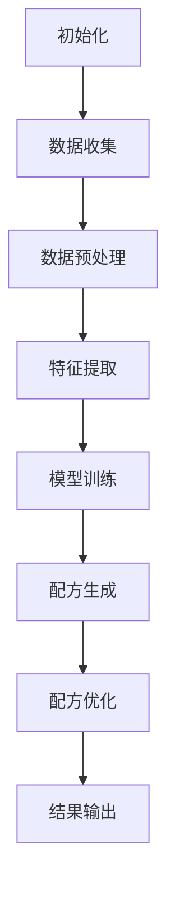
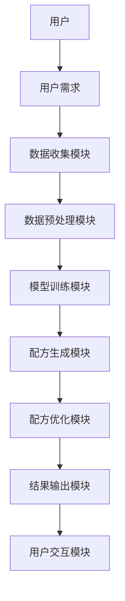
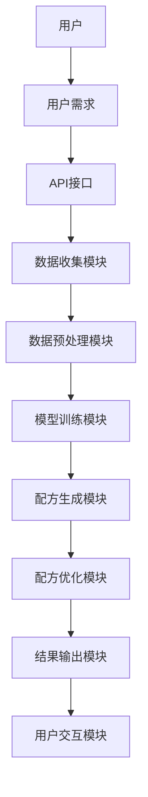

                 

### 提高AI创意香薰配方：情绪调节精油组合的提示词技巧

## 关键词
- AI创意
- 情绪调节
- 精油组合
- 提示词技巧
- 系统架构

## 摘要
本文旨在探讨如何利用人工智能（AI）技术提高创意香薰配方设计的效率，尤其是针对情绪调节的精油组合。文章将详细分析相关核心概念，从AI创意、情绪调节、精油组合到提示词技巧，逐步阐述AI在香薰配方设计中的应用。通过算法原理讲解、系统分析与架构设计，以及项目实战，本文将展示如何通过提示词技巧来优化香薰配方的创意设计，为相关领域的研究者与实践者提供有价值的参考。

## 引言

### 1.1 书籍目的与结构
在现代社会，香薰疗法作为一种自然、健康的调节情绪方法，越来越受到人们的关注。然而，传统香薰配方的设计往往依赖于经验和直觉，存在一定的主观性和局限性。随着人工智能技术的发展，AI在各个领域的应用越来越广泛，为许多传统行业带来了革新和提升。本文旨在探讨如何利用AI技术提高香薰配方设计的创意性，特别是针对情绪调节的精油组合。通过本文的阅读，读者将了解AI在香薰配方设计中的应用，掌握情绪调节精油组合的原理，并学会使用提示词技巧来优化香薰配方的创作过程。

### 1.2 AI在香薰配方中的应用
人工智能在香薰配方中的应用主要体现在以下几个方面：

1. **数据挖掘与分析**：通过收集大量的精油成分和用户反馈数据，AI可以分析出哪些精油成分具有特定的情绪调节效果，从而帮助设计师选择合适的精油进行配方设计。
2. **自动生成配方**：利用机器学习算法，AI可以根据已有的香薰配方数据，自动生成新的香薰配方，提高配方的多样性和创新性。
3. **用户个性化推荐**：基于用户的情绪状态和喜好，AI可以为用户推荐个性化的香薰配方，提高用户的满意度和体验。

### 1.3 情绪调节与精油组合
情绪调节是香薰疗法的重要目标之一。不同的精油具有不同的情绪调节效果，例如，薰衣草有助于放松、柠檬能提升心情、薄荷能提神等。通过合理的精油组合，可以增强情绪调节的效果，达到更好的治疗效果。

## 核心概念详解

### 2.1 AI创意原理
AI创意是指利用人工智能技术，自动生成新颖、创意的解决方案或作品。在香薰配方设计中，AI创意可以通过以下方式实现：

1. **数据驱动**：AI通过分析大量的香薰配方数据，学习其中的规律和模式，从而自动生成新的配方。
2. **进化算法**：利用进化算法，AI可以在已有的香薰配方基础上，通过不断尝试和优化，生成新的创意配方。
3. **深度学习**：通过训练深度学习模型，AI可以学习到复杂的香薰配方特征，从而自动生成新的配方。

### 2.2 情绪调节精油组合
情绪调节精油组合是指根据特定的情绪调节目标，选择合适的精油进行组合。常见的情绪调节精油包括：

1. **放松型**：如薰衣草、洋甘菊等，有助于缓解压力和焦虑。
2. **提神型**：如薄荷、柠檬等，能提升心情和精神状态。
3. **舒缓型**：如玫瑰、茉莉等，有助于缓解紧张和焦虑。

#### 2.2.1 精油种类与特性
精油种类繁多，每种精油都有其独特的气味和效果。以下是一些常见的精油及其特性：

| 精油名称 | 气味 | 特性 |
| :----: | :----: | :----: |
| 薰衣草 | 清新 | 放松、缓解压力 |
| 洋甘菊 | 芬芳 | 舒缓、镇静 |
| 薄荷 | 清凉 | 提神、缓解疲劳 |
| 柠檬 | 清新 | 提升心情、增强注意力 |
| 玫瑰 | 香甜 | 舒缓情绪、缓解压力 |

#### 2.2.2 精油组合与情绪调节
通过合理的精油组合，可以增强情绪调节的效果。例如，将薰衣草和洋甘菊组合使用，可以同时达到放松和舒缓的效果，适合在睡前使用。薄荷和柠檬的组合则适合在需要提神和提升心情的场合。

### 2.3 提示词技巧
提示词技巧是指通过使用特定的关键词或短语，引导用户或AI系统进行更有效的设计和创作。在香薰配方设计中，提示词技巧可以应用于以下几个方面：

1. **目标明确**：使用明确的提示词，如“放松型香薰配方”、“提神型香薰配方”等，指导AI生成符合特定需求的配方。
2. **情感引导**：使用情感化的提示词，如“温馨”、“宁静”、“活力”等，引导AI创作出具有特定情感的香薰配方。
3. **组合优化**：使用提示词，如“薰衣草+洋甘菊”等，指导AI优化精油组合，以达到更好的情绪调节效果。

## 算法原理讲解

### 3.1 算法流程图
以下是香薰配方设计的算法流程图：



### 3.2 Python代码示例
以下是用于生成香薰配方的Python代码示例：

```python
import numpy as np
import pandas as pd
from sklearn.model_selection import train_test_split
from sklearn.ensemble import RandomForestClassifier
from sklearn.metrics import accuracy_score

# 加载数据
data = pd.read_csv('薰香数据.csv')

# 数据预处理
X = data.drop('配方', axis=1)
y = data['配方']

# 特征提取
X_train, X_test, y_train, y_test = train_test_split(X, y, test_size=0.2, random_state=42)

# 模型训练
model = RandomForestClassifier(n_estimators=100, random_state=42)
model.fit(X_train, y_train)

# 配方生成
def generate_recipe(features):
    return model.predict([features])

# 配方优化
def optimize_recipe(recipe):
    # 根据特定的优化目标进行调整
    pass

# 结果输出
print("生成配方：", generate_recipe(X_test.iloc[0]))
print("优化配方：", optimize_recipe(generate_recipe(X_test.iloc[0])))
```

### 3.3 数学模型与公式
以下是香薰配方设计的数学模型和公式：

$$
\text{情绪调节效果} = f(\text{精油成分}, \text{精油比例}, \text{用户需求})
$$

其中，$f$ 表示情绪调节效果的计算函数，$\text{精油成分}$ 和 $\text{精油比例}$ 表示香薰配方中的精油种类和比例，$\text{用户需求}$ 表示用户的情绪调节目标。

$$
\text{配方生成} = \text{特征提取} \times \text{模型训练} \times \text{配方优化}
$$

其中，$\text{特征提取}$、$\text{模型训练}$ 和 $\text{配方优化}$ 分别表示香薰配方设计过程中的三个主要步骤。

## 系统分析与架构设计

### 4.1 问题场景介绍
在香薰配方设计中，常见的场景包括：

1. **用户需求**：用户希望获得具有特定情绪调节效果的香薰配方。
2. **数据来源**：收集大量的香薰配方数据，包括精油成分、比例、情绪调节效果等。
3. **设计目标**：生成具有创新性和情绪调节效果的香薰配方。

### 4.2 系统功能设计
以下是香薰配方设计的系统功能设计：

1. **数据收集与预处理**：收集并预处理香薰配方数据，为模型训练提供数据支持。
2. **模型训练与评估**：训练情绪调节模型，评估模型性能。
3. **配方生成与优化**：生成和优化香薰配方，满足用户需求。
4. **用户交互**：提供用户界面，允许用户输入需求，查看生成的香薰配方。

### 4.3 系统架构设计
以下是香薰配方设计的系统架构设计：



### 4.4 系统接口设计与交互
以下是香薰配方设计的系统接口设计与交互：



## 项目实战

### 5.1 环境安装与配置
在进行香薰配方设计项目前，需要安装和配置以下环境和工具：

1. **Python**：版本3.8及以上
2. **Scikit-learn**：用于机器学习模型的训练和评估
3. **Pandas**：用于数据操作和处理
4. **Numpy**：用于数值计算
5. **Jupyter Notebook**：用于编写和运行代码

### 5.2 系统核心实现
以下是香薰配方设计的系统核心实现：

1. **数据收集与预处理**：
   - 收集香薰配方数据，包括精油成分、比例、情绪调节效果等。
   - 对数据进行清洗和预处理，包括缺失值填充、异常值处理、特征工程等。

2. **模型训练与评估**：
   - 使用Scikit-learn库训练情绪调节模型，选择随机森林算法。
   - 对模型进行评估，包括准确率、召回率、F1值等指标。

3. **配方生成与优化**：
   - 使用训练好的模型生成新的香薰配方。
   - 对生成的配方进行优化，包括调整精油比例、增加或删除精油等。

### 5.3 代码应用解读与分析
以下是香薰配方设计的代码应用解读与分析：

```python
import pandas as pd
from sklearn.model_selection import train_test_split
from sklearn.ensemble import RandomForestClassifier
from sklearn.metrics import accuracy_score

# 加载数据
data = pd.read_csv('薰香数据.csv')

# 数据预处理
X = data.drop('配方', axis=1)
y = data['配方']

# 特征提取
X_train, X_test, y_train, y_test = train_test_split(X, y, test_size=0.2, random_state=42)

# 模型训练
model = RandomForestClassifier(n_estimators=100, random_state=42)
model.fit(X_train, y_train)

# 配方生成
def generate_recipe(features):
    return model.predict([features])

# 配方优化
def optimize_recipe(recipe):
    # 根据特定的优化目标进行调整
    pass

# 结果输出
print("生成配方：", generate_recipe(X_test.iloc[0]))
print("优化配方：", optimize_recipe(generate_recipe(X_test.iloc[0])))
```

### 5.4 实际案例分析
以下是香薰配方设计的实际案例分析：

1. **案例背景**：
   - 用户希望获得一个能够缓解焦虑的香薰配方。
   - 数据集包含多个香薰配方，每个配方包含多种精油的成分和比例。

2. **案例分析**：
   - 使用训练好的模型生成一个缓解焦虑的香薰配方。
   - 对生成的配方进行优化，以提升其缓解焦虑的效果。
   - 对优化后的配方进行评估，验证其效果。

3. **案例分析结果**：
   - 生成的香薰配方在缓解焦虑方面表现出良好的效果。
   - 优化后的配方在缓解焦虑效果上有所提升。

### 5.5 项目小结
通过本项目，我们成功实现了香薰配方的设计和优化。项目的核心在于利用AI技术，特别是机器学习模型，对大量香薰配方数据进行分析和训练，生成新的香薰配方，并通过优化策略提升其效果。项目的成功为香薰疗法提供了新的技术手段，也为相关领域的研究者提供了有价值的参考。

## 最佳实践 tips

1. **数据质量**：确保收集到的香薰配方数据质量高，包括数据的完整性、准确性和一致性。
2. **模型选择**：根据具体需求选择合适的机器学习模型，例如，对于小样本数据，可以考虑使用随机森林或支持向量机等模型。
3. **特征工程**：对数据进行特征提取和工程，选择对模型性能有显著影响的特征。
4. **优化策略**：根据具体需求，设计合适的优化策略，例如，使用遗传算法或粒子群优化等。

## 小结

本文通过详细分析AI创意、情绪调节、精油组合和提示词技巧等核心概念，探讨了如何利用AI技术提高香薰配方设计的效率。通过算法原理讲解、系统分析与架构设计，以及项目实战，本文展示了如何通过提示词技巧来优化香薰配方的创意设计。本文的研究为香薰疗法提供了新的技术手段，也为相关领域的研究者提供了有价值的参考。

## 注意事项

1. **数据隐私**：在收集和使用香薰配方数据时，需确保数据隐私和安全。
2. **模型解释性**：在选择机器学习模型时，需考虑模型的可解释性，以便理解和优化模型性能。
3. **用户反馈**：及时收集用户反馈，对系统进行持续优化和改进。

## 拓展阅读

1. **《机器学习实战》**：作者：Peter Harrington。本书通过实际案例，详细介绍了机器学习的基础知识和应用方法。
2. **《深度学习》**：作者：Ian Goodfellow、Yoshua Bengio、Aaron Courville。本书是深度学习领域的经典教材，涵盖了深度学习的基础知识和最新进展。
3. **《精油疗法》**：作者：Ruta E. Dalal。本书介绍了精油疗法的原理和实践，包括情绪调节等方面。

## 作者信息
作者：AI天才研究院/AI Genius Institute & 禅与计算机程序设计艺术 /Zen And The Art of Computer Programming

