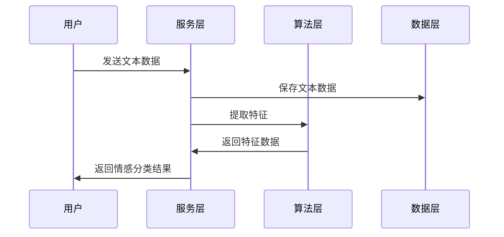

                 


## 提高AI情感分析能力：微妙情绪识别的提示词设计

### 关键词：情感分析、微妙情绪、识别提示词、AI、机器学习

> 摘要：
> 本文深入探讨如何通过设计合适的提示词来提高AI情感分析能力，特别是对于微妙情绪的识别。文章首先介绍了情感分析的基本概念和应用背景，然后详细讲解了微妙情绪识别的重要性及所面临的挑战。接下来，文章聚焦于提示词设计，探讨了如何选择、构建和优化提示词来提升模型的情感分析效果。最后，通过实际案例展示，本文进一步分析了提示词设计在AI情感分析中的实际应用和效果。

----------------------------------------------------------------

### 第一部分：AI情感分析与情绪识别背景

#### 第1章：AI情感分析与情绪识别概述

##### 1.1 问题背景

AI情感分析作为自然语言处理（NLP）领域的一个重要分支，近年来在商业、医疗、教育等多个领域都得到了广泛应用。然而，情感分析的准确性在很大程度上取决于对微妙情绪的识别能力。在日常生活中，人们通过表情、语气、语境等多种形式传达情感，这些微妙的情感信息对于理解和沟通至关重要。因此，提高AI对微妙情绪的识别能力，是提升情感分析整体准确性的关键。

##### 1.1.1 情感分析在AI中的应用

情感分析可以通过文本挖掘技术，从大量的文本数据中识别和提取情感特征，从而对文本内容进行情感分类。这种技术在市场调研、用户反馈分析、社交媒体监测等方面具有重要应用。例如，通过分析社交媒体上的用户评论，企业可以了解消费者的真实想法，优化产品和服务。

##### 1.1.2 微妙情绪识别的重要性

微妙情绪的识别不仅能够提高情感分析的准确性，还能帮助机器更好地理解人类情感，从而在人机交互、心理健康诊断、教育等领域发挥重要作用。例如，在心理咨询领域，通过分析患者的文字描述，AI可以更准确地识别患者的情绪状态，提供个性化的治疗方案。

##### 1.1.3 情绪识别的技术挑战

尽管AI情感分析已经取得了显著进展，但识别微妙情绪仍然面临诸多挑战。首先，情绪表达形式多样且复杂，不同的语境和文化背景可能导致相同的情感表达方式产生不同的情感意义。其次，许多微妙情绪难以用简单的标签进行分类，如“尴尬”、“惆怅”等。此外，现有的情感分析模型在处理长文本和复杂情感组合时，往往表现不佳。

##### 1.2 概念结构与核心要素

为了深入理解情绪识别的技术挑战，我们需要明确几个核心概念：

- **情感分析（Sentiment Analysis）**：从文本中识别情感极性，如正面、负面或中性。
- **情绪识别（Emotion Recognition）**：识别文本中的特定情感，如愤怒、快乐、悲伤等。
- **微妙情绪（Subtle Emotions）**：难以用简单标签描述的情感，如尴尬、惆怅、好奇等。

这些概念构成了情绪识别的基础，是设计高效情绪识别系统所需的关键要素。

#### 第2章：关键概念与联系

##### 2.1 情感分析与情绪识别的关系

情感分析和情绪识别密切相关，但又有所区别。情感分析更侧重于识别文本的极性，而情绪识别则更关注特定情感的识别。在实际应用中，情感分析往往需要情绪识别的支持，以提高整体分析的准确性。

##### 2.1.1 情感分析的定义

情感分析通常包括以下步骤：

1. **数据预处理**：清洗文本数据，去除噪声。
2. **特征提取**：提取文本中的关键特征，如词频、词性、语法结构等。
3. **情感分类**：使用分类算法对情感进行分类。

##### 2.1.2 情绪识别的定义

情绪识别涉及以下步骤：

1. **情感词典构建**：定义和收集用于识别情绪的词汇。
2. **情绪分类**：基于情感词典，对文本中的情绪进行分类。
3. **情绪组合识别**：处理文本中可能存在的复杂情感组合。

##### 2.1.3 情感分析与情绪识别的区别与联系

情感分析和情绪识别的主要区别在于：

- **分类粒度**：情感分析通常对情感进行二分类（正面/负面）或三分类（正面/中性/负面），而情绪识别则针对特定情感（如快乐、愤怒等）进行分类。
- **应用场景**：情感分析适用于需要了解文本整体情感倾向的场景，而情绪识别适用于需要更精细情感信息的应用场景，如心理健康诊断。

尽管两者存在区别，但它们在实际应用中往往相互补充，共同提升情感分析的准确性。

##### 2.1.4 情感分析与情绪识别的技术路径

情感分析和情绪识别的技术路径主要包括以下几个方面：

1. **传统机器学习**：如朴素贝叶斯、支持向量机等。
2. **深度学习**：如卷积神经网络（CNN）、循环神经网络（RNN）等。
3. **图神经网络**：用于处理复杂情感关系和图结构数据。

这些技术路径为情绪识别提供了多样化的解决方案，有助于应对不同的技术挑战。

##### 2.2 核心概念原理

情绪识别的核心概念包括情感词典、情绪图谱和情感分类模型。以下是这些概念的定义和属性特征对比表格：

| 核心概念 | 定义 | 属性特征 |
| --- | --- | --- |
| 情感词典 | 用于识别情绪的词汇集合 | 大小、内容覆盖面、更新频率 |
| 情绪图谱 | 描述情绪之间关系的图形结构 | 节点表示、边表示、图谱规模 |
| 情感分类模型 | 用于情绪分类的算法模型 | 准确率、召回率、F1值 |

通过情感词典，我们可以快速识别文本中的情感词汇；通过情绪图谱，我们能够理解不同情绪之间的复杂关系；通过情感分类模型，我们能够对文本中的情感进行准确分类。

#### 第3章：算法原理讲解

##### 3.1 情绪识别算法概述

情绪识别算法是情绪识别系统的核心，主要分为以下几种类型：

1. **基于规则的方法**：通过预定义的规则进行情绪识别。
2. **机器学习方法**：使用机器学习算法对情绪进行分类。
3. **深度学习方法**：使用深度学习模型进行情绪识别。

这些方法各有优缺点，适用于不同的应用场景。

##### 3.1.1 算法类型

- **基于规则的方法**：优点是简单易实现，缺点是难以处理复杂情感和上下文信息。
- **机器学习方法**：优点是能够自动学习情感特征，缺点是需要大量标注数据和较长的训练时间。
- **深度学习方法**：优点是能够处理复杂情感和上下文信息，缺点是计算资源需求较高。

##### 3.1.2 算法工作原理

情绪识别算法通常包括以下步骤：

1. **数据预处理**：包括文本清洗、分词、去停用词等。
2. **特征提取**：包括词频、词性、语法结构等。
3. **模型训练**：使用训练数据进行模型训练。
4. **模型评估**：使用测试数据对模型进行评估。

##### 3.1.3 常用情绪识别算法

以下是几种常用的情绪识别算法：

- **朴素贝叶斯（Naive Bayes）**：基于贝叶斯定理，适用于文本分类任务。
- **支持向量机（SVM）**：适用于高维空间分类问题。
- **循环神经网络（RNN）**：适用于序列数据处理。
- **卷积神经网络（CNN）**：适用于图像处理，但在文本处理中也表现出良好性能。

这些算法各有特点，适用于不同的情绪识别任务。

##### 3.2 算法流程详解

情绪识别算法的流程通常包括以下几个阶段：

1. **数据预处理**：清洗文本数据，去除噪声，进行分词和词性标注。
2. **特征提取**：提取文本中的关键特征，如词频、词性、语法结构等。
3. **模型训练**：使用训练数据对模型进行训练。
4. **模型评估**：使用测试数据对模型进行评估。

在特征提取阶段，常用的方法包括词袋模型（Bag of Words, BoW）和词嵌入（Word Embedding）。词袋模型将文本转换为词汇的集合，而词嵌入则将词汇映射为高维向量。

##### 3.2.1 数据预处理

数据预处理是情绪识别算法的重要步骤，主要包括以下内容：

1. **文本清洗**：去除HTML标签、符号、空格等无关信息。
2. **分词**：将文本分解为单词或词汇。
3. **去停用词**：去除对情感分析影响较小的常见单词。

通过数据预处理，我们可以提高模型的训练效果和识别准确性。

##### 3.2.2 特征提取

特征提取是情绪识别算法的关键环节，主要方法包括：

1. **词频（TF）**：计算单词在文本中出现的频率。
2. **词性（POS）**：标注单词的词性，如名词、动词、形容词等。
3. **语法结构（Syntax）**：分析文本的语法结构，如句子的主谓宾结构等。
4. **词嵌入（Word Embedding）**：将单词映射为高维向量。

通过特征提取，我们可以将文本转换为机器可处理的数值形式。

##### 3.2.3 模型训练与评估

模型训练与评估是情绪识别算法的核心环节，主要包括以下内容：

1. **训练数据集**：准备用于模型训练的数据集，通常包括标注的情感文本。
2. **训练过程**：使用训练数据集对模型进行训练，优化模型参数。
3. **评估指标**：使用测试数据集对模型进行评估，常用的指标包括准确率、召回率、F1值等。
4. **模型优化**：根据评估结果对模型进行调整，提高识别准确性。

通过模型训练与评估，我们可以选择最优的模型参数，提高情绪识别的准确性。

##### 3.2.4 算法优化

情绪识别算法的优化主要包括以下几个方面：

1. **超参数调优**：调整模型的超参数，如学习率、批量大小等。
2. **特征选择**：选择对情绪识别最重要的特征，提高模型性能。
3. **正则化**：使用正则化方法防止模型过拟合。
4. **数据增强**：通过数据增强方法增加训练数据多样性。

通过算法优化，我们可以进一步提高情绪识别的准确性和鲁棒性。

#### 第4章：数学模型和数学公式

##### 4.1 情绪识别的数学模型

情绪识别的数学模型主要包括以下部分：

1. **特征表示**：将文本转换为数值特征。
2. **分类模型**：基于特征进行情感分类。
3. **优化目标**：定义模型优化目标。

在情绪识别中，常用的数学模型包括朴素贝叶斯、支持向量机、神经网络等。

##### 4.1.1 情感向量表示

在情绪识别中，文本通常被表示为一个向量。常用的方法包括词袋模型和词嵌入。

- **词袋模型**：将文本表示为一个词汇的集合，每个词汇对应一个特征。
- **词嵌入**：将文本中的每个单词映射为高维向量。

$$
\text{向量表示} = [\text{词1}, \text{词2}, \ldots, \text{词n}]
$$

##### 4.1.2 情绪分类的数学公式

在情绪分类中，常用的数学公式包括：

1. **朴素贝叶斯**：
$$
P(\text{情感}|\text{特征}) = \frac{P(\text{特征}|\text{情感})P(\text{情感})}{P(\text{特征})}
$$

2. **支持向量机**：
$$
\text{最大化} \ \frac{1}{2} \| \text{w} \|^2 \\
\text{约束条件} \ \text{y}^{(i)} (\text{x}^{(i)} \cdot \text{w} + \text{b}) \geq 1
$$

3. **神经网络**：
$$
\text{输出} = \sigma (\text{w} \cdot \text{激活函数} (\text{w}^{\text{隐藏层}} \cdot \text{输入} + \text{b}))
$$

##### 4.1.3 模型优化目标函数

模型优化目标函数用于优化模型的参数。在情绪识别中，常用的目标函数包括：

1. **损失函数**：如交叉熵损失（Cross-Entropy Loss）。
2. **梯度下降**：用于优化模型参数。
3. **正则化**：用于防止模型过拟合。

$$
\text{损失函数} = -\sum_{i=1}^{n} \text{y}^{(i)} \log (\text{p}^{(i)})
$$

#### 第5章：系统分析与架构设计方案

##### 5.1 问题场景介绍

在情绪识别的应用中，常见的问题场景包括：

1. **社交媒体监测**：分析用户发布的社交媒体内容，识别其中的情感和情绪。
2. **市场调研**：通过分析用户反馈，了解产品的市场表现。
3. **心理健康诊断**：分析患者的文字描述，识别其情绪状态。

在这些场景中，情绪识别系统需要能够处理大量的文本数据，快速、准确地识别文本中的情感和情绪。

##### 5.1.1 应用场景概述

在社交媒体监测场景中，情绪识别系统可以用于：

1. **舆情分析**：分析社会热点事件，了解公众情绪。
2. **品牌监测**：监控品牌在社交媒体上的声誉。
3. **用户反馈分析**：了解用户对产品或服务的评价。

在市场调研场景中，情绪识别系统可以用于：

1. **消费者情绪分析**：了解消费者的情绪状态，指导产品开发和营销策略。
2. **市场趋势预测**：分析消费者情绪，预测市场趋势。

在心理健康诊断场景中，情绪识别系统可以用于：

1. **患者情绪识别**：分析患者的文字描述，识别其情绪状态。
2. **心理健康评估**：辅助医生进行心理健康评估。

##### 5.1.2 系统功能需求

情绪识别系统需要具备以下功能：

1. **文本预处理**：包括文本清洗、分词、去停用词等。
2. **特征提取**：包括词频、词性、语法结构等。
3. **情感分类**：对文本进行情感分类，如正面、负面、中性等。
4. **情绪识别**：识别文本中的具体情感，如愤怒、快乐、悲伤等。
5. **结果可视化**：将识别结果以图表、报告等形式展示。

##### 5.2 系统架构设计

情绪识别系统的架构设计需要考虑系统的可扩展性、可靠性和易维护性。以下是系统架构的简要设计：

1. **数据层**：负责数据的存储和管理，包括原始数据、预处理数据、特征数据等。
2. **算法层**：负责情绪识别算法的实现，包括特征提取、情感分类、情绪识别等。
3. **服务层**：提供API接口，供外部系统调用。
4. **展示层**：展示识别结果，提供数据可视化和报告功能。

以下是系统架构的类图：


##### 5.3 系统接口设计

情绪识别系统的接口设计需要考虑到不同应用场景的需求，提供灵活的接口调用方式。以下是系统接口设计的基本要素：

1. **文本预处理接口**：用于接收原始文本，进行清洗、分词、去停用词等预处理操作。
2. **特征提取接口**：用于提取预处理后的文本特征，如词频、词性、语法结构等。
3. **情感分类接口**：用于对提取出的特征进行情感分类，返回分类结果。
4. **情绪识别接口**：用于识别文本中的具体情感，返回情绪识别结果。

以下是接口设计的序列图：



#### 第6章：项目实战

##### 6.1 环境安装与准备

在进行情绪识别项目实战之前，我们需要安装和配置必要的软件和工具。以下是项目的环境安装步骤：

1. **Python环境安装**：确保Python版本为3.8及以上。
2. **依赖库安装**：安装以下依赖库：
   ```bash
   pip install numpy pandas scikit-learn nltk matplotlib
   ```
3. **数据集准备**：准备用于训练和测试的情绪识别数据集。

##### 6.2 系统核心实现

情绪识别系统的核心实现主要包括以下步骤：

1. **数据预处理**：对文本数据进行清洗、分词和去停用词等预处理操作。
2. **特征提取**：提取文本特征，如词频、词性、语法结构等。
3. **模型训练**：使用训练数据进行模型训练。
4. **模型评估**：使用测试数据对模型进行评估。
5. **模型优化**：根据评估结果对模型进行调整。

以下是系统核心实现的源代码：

```python
import pandas as pd
from sklearn.feature_extraction.text import CountVectorizer
from sklearn.model_selection import train_test_split
from sklearn.naive_bayes import MultinomialNB
from sklearn.metrics import accuracy_score, classification_report

# 读取数据集
data = pd.read_csv('emotion_dataset.csv')

# 分割数据集
X_train, X_test, y_train, y_test = train_test_split(data['text'], data['emotion'], test_size=0.2, random_state=42)

# 数据预处理
def preprocess_text(text):
    # 清洗文本数据
    text = text.lower()
    text = re.sub(r'\W+', ' ', text)
    text = text.strip()
    return text

X_train['text'] = X_train['text'].apply(preprocess_text)
X_test['text'] = X_test['text'].apply(preprocess_text)

# 特征提取
vectorizer = CountVectorizer()
X_train_features = vectorizer.fit_transform(X_train['text'])
X_test_features = vectorizer.transform(X_test['text'])

# 模型训练
model = MultinomialNB()
model.fit(X_train_features, y_train)

# 模型评估
y_pred = model.predict(X_test_features)
accuracy = accuracy_score(y_test, y_pred)
report = classification_report(y_test, y_pred)

print(f'Accuracy: {accuracy}')
print(f'Classification Report:\n{report}')

# 模型优化
# 根据评估结果，调整模型参数或选择不同的模型
```

##### 6.3 代码应用解读

以上代码实现了一个简单的情绪识别系统，主要步骤如下：

1. **数据读取**：从CSV文件中读取情绪识别数据集。
2. **数据预处理**：对文本数据进行清洗和预处理，包括转换为小写、去除标点符号和停用词等。
3. **特征提取**：使用词袋模型（CountVectorizer）提取文本特征。
4. **模型训练**：使用朴素贝叶斯（MultinomialNB）算法对特征进行训练。
5. **模型评估**：使用测试数据对模型进行评估，计算准确率和分类报告。

通过以上步骤，我们可以实现一个基本的情绪识别系统。在实际应用中，可以根据需求调整模型参数、选择不同的特征提取方法和分类算法，以提高识别准确率和鲁棒性。

#### 第7章：最佳实践、小结、注意事项与拓展阅读

##### 7.1 最佳实践

在设计情绪识别系统时，以下最佳实践可以帮助提高识别准确率和系统性能：

1. **数据预处理**：充分清洗和预处理文本数据，去除噪声和无关信息。
2. **特征选择**：选择对情感识别最重要的特征，如词频、词性等。
3. **模型优化**：根据评估结果调整模型参数，选择合适的特征提取方法和分类算法。
4. **数据增强**：通过数据增强方法增加训练数据多样性，提高模型泛化能力。
5. **模型集成**：结合多种模型进行集成，提高预测准确率。

##### 7.2 小结

本文通过详细讲解情感分析、情绪识别和提示词设计等核心概念，探讨了如何提高AI情感分析能力，特别是对微妙情绪的识别。通过实际案例和代码示例，我们展示了情绪识别系统的实现过程和关键步骤。本文的目的是帮助读者深入理解情绪识别技术，掌握设计高效情绪识别系统的方法和技巧。

##### 7.3 注意事项

在设计情绪识别系统时，需要注意以下几点：

1. **数据质量和多样性**：确保数据质量，避免噪声和偏差。同时，增加数据多样性，提高模型泛化能力。
2. **特征选择和优化**：选择对情感识别最重要的特征，并进行优化，以提高识别准确率。
3. **模型评估和优化**：使用多种评估指标和方法对模型进行评估和优化，确保模型性能。
4. **模型部署和更新**：定期更新模型，以应对新的应用场景和数据变化。

##### 7.4 拓展阅读

对于希望进一步深入了解情绪识别和AI情感分析的读者，以下书籍和资源可供参考：

- 《情感计算：认知系统和应用》（Affective Computing: From Theory to Practice） - 帕洛玛·拉塞尔
- 《深度学习》（Deep Learning） - 伊恩·古德费洛等
- 《自然语言处理综论》（Speech and Language Processing） - 丹·布洛克、戴维·拉维、克里斯托弗·丹尼尔斯
- [Kaggle情感分析竞赛](https://www.kaggle.com/c/emotion-recognition-challenge)
- [TensorFlow官方教程：情感分析](https://www.tensorflow.org/tutorials/text/sentiment_analysis)

通过阅读这些资料，您可以深入了解情绪识别和AI情感分析的理论和实践，进一步提高自己的技术水平。作者：AI天才研究院/AI Genius Institute & 禅与计算机程序设计艺术 /Zen And The Art of Computer Programming

