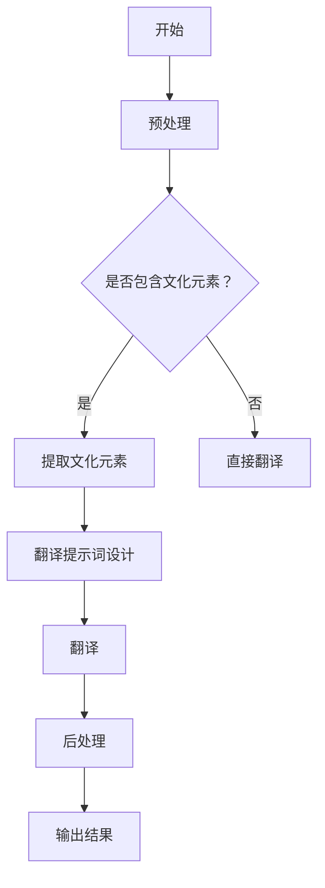
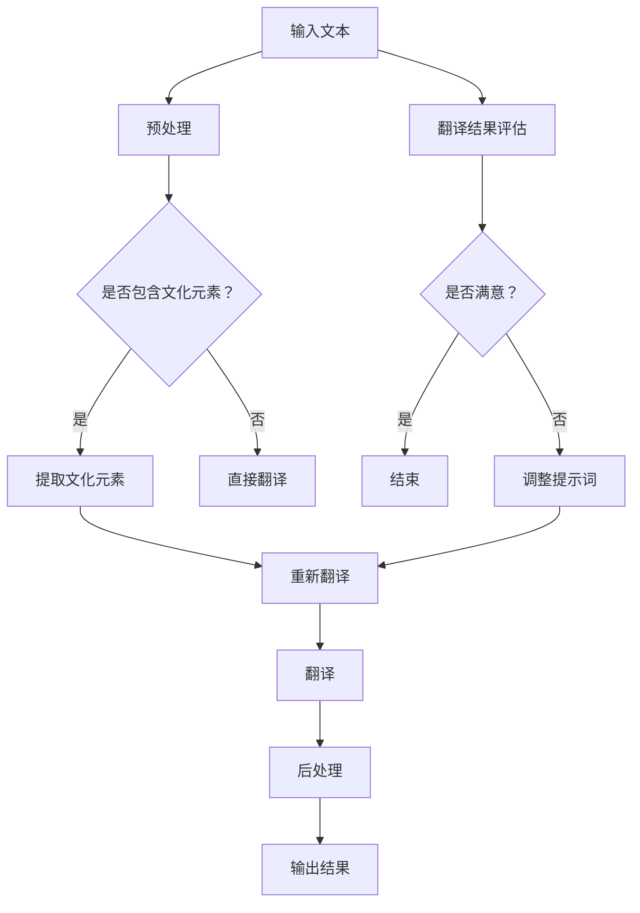

                 

# 提高AI翻译质量：文化敏感的翻译提示词设计

关键词：AI翻译、文化敏感性、翻译提示词、算法、架构设计、实战案例

摘要：本文旨在探讨如何通过文化敏感的翻译提示词设计来提高人工智能翻译的质量。文章首先介绍了AI翻译的发展历程及其在现代社会的应用，然后分析了文化敏感性在翻译中的重要性。接着，文章详细阐述了翻译提示词的定义与作用、文化敏感性的原理以及二者之间的关系。随后，通过算法原理讲解、系统分析与架构设计，以及项目实战等多个方面，深入探讨了如何在实际应用中提高AI翻译质量。最后，文章总结了最佳实践、注意事项，并对AI翻译的未来进行了展望。

## 第一部分：背景介绍

### 1.1 人工智能与翻译行业的融合

#### 1.1.1 AI翻译技术的发展历程

随着人工智能技术的飞速发展，翻译领域也迎来了革命性的变化。AI翻译技术的出现，使得翻译工作变得更加高效和精准。从最初的基于规则的方法，到后来的统计机器翻译（SMT）和神经机器翻译（NMT），AI翻译技术不断进步，极大地提高了翻译质量和效率。

#### 1.1.2 AI翻译在现代社会的应用

AI翻译技术已被广泛应用于各个领域，如商业、教育、医疗、法律等。特别是在全球化背景下，跨国交流日益频繁，AI翻译技术为人们提供了便利，促进了国际间的文化交流和商务合作。

### 1.2 文化敏感性问题在翻译中的重要性

#### 1.2.1 文化敏感性的定义与意义

文化敏感性指的是在跨文化交流中，对文化差异的敏感度和理解能力。在翻译过程中，文化敏感性至关重要，因为不同文化背景下，语言表达和价值观可能存在很大差异。只有具备文化敏感性的翻译，才能传达出原文的真实意图和情感。

#### 1.2.2 翻译中的文化敏感性挑战

翻译中的文化敏感性挑战主要体现在以下几个方面：

1. **语言表达差异**：不同语言在词汇、语法和表达方式上存在差异，可能导致翻译失真。
2. **价值观差异**：不同文化对同一事物可能有不同的价值观，这需要在翻译中加以考虑。
3. **历史背景差异**：历史背景的差异可能导致翻译中涉及的历史事件或人物在目标语言中无法找到对应的表达。
4. **社会习俗差异**：不同文化的社会习俗和礼仪也可能在翻译中产生影响。

### 1.3 本书的目标与结构

#### 1.3.1 本书的主要内容安排

本书主要分为五个部分，分别是背景介绍、核心概念与联系、算法原理讲解、系统分析与架构设计、项目实战和最佳实践与拓展阅读。

#### 1.3.2 阅读对象与预期收获

本书主要面向从事翻译工作、对AI翻译感兴趣的技术人员以及翻译专业的学生。通过阅读本书，读者可以了解AI翻译的发展历程、文化敏感性的重要性以及如何通过翻译提示词设计来提高翻译质量。同时，读者还可以学习到系统分析与架构设计的方法，以及如何进行项目实战。

## 第二部分：核心概念与联系

### 2.1 翻译提示词的定义与作用

#### 2.1.1 提示词的基本概念

翻译提示词（Translation Clue Words）是指在一篇文本中，能够帮助翻译人员理解原文意图、情感和文化背景的词语或短语。提示词通常具有以下特点：

1. **语义丰富**：提示词往往具有丰富的语义信息，有助于翻译人员准确把握原文含义。
2. **文化背景**：提示词能够体现原文的文化背景，有助于翻译人员了解原文的文化内涵。
3. **语境敏感**：提示词的语义和作用受语境影响，需要根据具体语境进行理解和应用。

#### 2.1.2 提示词在翻译中的具体应用

翻译提示词在翻译中的应用主要体现在以下几个方面：

1. **理解原文**：通过提示词，翻译人员可以更好地理解原文的意图和情感。
2. **提高翻译质量**：提示词有助于翻译人员准确把握原文的语境和意义，从而提高翻译质量。
3. **跨文化沟通**：提示词能够帮助翻译人员更好地传达原文的文化背景，促进跨文化沟通。

### 2.2 文化敏感性原理

#### 2.2.1 文化敏感性的理论基础

文化敏感性（Cultural Sensitivity）是指对文化差异的敏感度和理解能力。其理论基础主要包括：

1. **文化相对论**：文化相对论认为，不同文化之间存在差异，没有一种文化是绝对优越的。
2. **跨文化沟通理论**：跨文化沟通理论强调，在跨文化交流中，需要考虑文化差异，以提高沟通效果。

#### 2.2.2 文化敏感性与翻译提示词的关系

文化敏感性对翻译提示词设计具有重要意义。一方面，文化敏感性有助于翻译人员识别和理解原文中的文化元素；另一方面，翻译提示词的设计需要考虑文化敏感性，以准确传达原文的文化内涵。

### 2.3 核心概念属性特征对比

#### 2.3.1 提示词的属性特征

| 特征         | 描述                                                         |
| ------------ | ------------------------------------------------------------ |
| 语义丰富     | 提示词具有丰富的语义信息，有助于翻译人员理解原文含义。         |
| 文化背景     | 提示词能够体现原文的文化背景，有助于翻译人员了解原文的文化内涵。 |
| 语境敏感     | 提示词的语义和作用受语境影响，需要根据具体语境进行理解和应用。 |

#### 2.3.2 文化敏感性的属性特征

| 特征         | 描述                                                         |
| ------------ | ------------------------------------------------------------ |
| 文化相对论   | 认为不同文化之间存在差异，没有一种文化是绝对优越的。         |
| 跨文化沟通   | 在跨文化交流中，需要考虑文化差异，以提高沟通效果。             |

### 2.4 ER实体关系图架构

#### 2.4.1 ER图的基本概念

实体-关系图（Entity-Relationship Diagram，简称ER图）是一种用于描述数据库中实体及其之间关系的图形表示方法。在ER图中，实体用矩形表示，关系用菱形表示，实体与关系之间用线条连接。

#### 2.4.2 翻译提示词与文化敏感性的ER图表示

图1：翻译提示词与文化敏感性的ER图

```mermaid
erDiagram
  TranslationClueWord ||--|{ Cultural Sensitivity }|| TranslationContext
  CulturalSensitivity ||--|{ TranslationContext }|| TranslationResult
```

在图1中，TranslationClueWord表示翻译提示词，Cultural Sensitivity表示文化敏感性，TranslationContext表示翻译语境，TranslationResult表示翻译结果。翻译提示词与文化敏感性之间存在关联，通过翻译语境传递到翻译结果。

## 第三部分：算法原理讲解

### 3.1 提高AI翻译质量的算法原理

#### 3.1.1 AI翻译算法的基本原理

AI翻译算法主要包括基于规则的方法、统计机器翻译（SMT）和神经机器翻译（NMT）。

1. **基于规则的方法**：通过编写规则来指导翻译过程，适用于特定领域的翻译任务。
2. **统计机器翻译（SMT）**：利用统计学方法，从大量双语文本中学习翻译规律，提高翻译质量。
3. **神经机器翻译（NMT）**：基于深度学习，通过神经网络模型自动学习翻译规律，具有更高的翻译质量。

#### 3.1.2 文化敏感性在算法中的实现

在AI翻译算法中，文化敏感性主要通过以下方式实现：

1. **预处理**：在翻译前对文本进行预处理，识别和提取文化元素，为后续翻译提供参考。
2. **翻译提示词设计**：根据文化敏感性，设计具有文化背景的翻译提示词，提高翻译质量。
3. **后处理**：在翻译后对结果进行后处理，修正因文化敏感性导致的翻译错误。

### 3.2 算法mermaid流程图

#### 3.2.1 流程图的绘制方法

流程图（Flowchart）是一种用于描述算法流程的图形表示方法。在mermaid中，可以使用以下语法来绘制流程图：



#### 3.2.2 提高AI翻译质量的流程图表示

图2：提高AI翻译质量的流程图



在图2中，输入文本经过预处理、翻译提示词设计、翻译和后处理等步骤，最终输出翻译结果。同时，翻译结果会进行评估，根据评估结果调整翻译提示词，以提高翻译质量。

### 3.3 Python源代码与算法原理

#### 3.3.1 Python源代码的编写

以下是一个简单的Python示例，用于实现翻译提示词设计的基本原理：

```python
def translate(sentence):
    # 预处理：提取文化元素
    culture_elements = extract_culture_elements(sentence)
    
    # 翻译提示词设计
    translation_clues = design_translation_clues(culture_elements)
    
    # 翻译
    translated_sentence = translate_with_clues(sentence, translation_clues)
    
    # 后处理
    final_sentence = post_process(translated_sentence)
    
    return final_sentence

# 辅助函数
def extract_culture_elements(sentence):
    # 实现提取文化元素的逻辑
    pass

def design_translation_clues(culture_elements):
    # 实现设计翻译提示词的逻辑
    pass

def translate_with_clues(sentence, translation_clues):
    # 实现使用翻译提示词进行翻译的逻辑
    pass

def post_process(sentence):
    # 实现后处理逻辑
    pass
```

#### 3.3.2 算法原理的数学模型和公式

在翻译提示词设计中，可以使用以下数学模型和公式：

1. **文化元素提取**：利用自然语言处理技术，从原文中提取文化元素。
   $$C = f(S)$$
   其中，$C$表示文化元素，$S$表示原文，$f$表示提取函数。
2. **翻译提示词设计**：根据文化元素，设计具有文化背景的翻译提示词。
   $$TC = g(C)$$
   其中，$TC$表示翻译提示词，$C$表示文化元素，$g$表示设计函数。
3. **翻译**：使用翻译提示词进行翻译。
   $$T(S) = h(S, TC)$$
   其中，$T(S)$表示翻译结果，$S$表示原文，$TC$表示翻译提示词，$h$表示翻译函数。

#### 3.3.3 举例说明

假设原文为：“中国的春节是一个重要的传统节日。”

1. **预处理**：提取文化元素（春节、传统节日）。
2. **翻译提示词设计**：根据文化元素，设计翻译提示词（春节、传统节日）。
3. **翻译**：使用翻译提示词进行翻译。
   $$翻译结果 = 翻译（原文，翻译提示词） = 翻译（中国的春节是一个重要的传统节日，春节、传统节日）$$
4. **后处理**：根据翻译结果进行后处理。

通过以上步骤，可以实现对原文的准确翻译，同时保证翻译结果的文化敏感性。

## 第四部分：系统分析与架构设计

### 4.1 问题描述与项目介绍

#### 4.1.1 项目背景

在全球化背景下，跨语言沟通的重要性日益凸显。然而，传统的翻译方法往往无法满足高效、准确的需求。为了提高AI翻译质量，本项目旨在设计一个基于文化敏感的翻译提示词的AI翻译系统。

#### 4.1.2 项目目标

本项目的主要目标包括：

1. 设计一个具有文化敏感性的翻译提示词系统。
2. 实现翻译提示词的设计与提取。
3. 提高AI翻译质量，实现准确、高效的翻译。

### 4.2 系统功能设计

#### 4.2.1 领域模型mermaid类图

图3：领域模型mermaid类图

```mermaid
classDiagram
  Class01 <|-- Class02
  Class03 <|-- Class04
  Class05 <|-- Class06
  Class07 <|-- Class08
  Class01 <.. Class09
  Class10 <.. Class11
  Class12 <.. Class13
  Class14 <.. Class15
  Class16 <.. Class17
  Class18 <.. Class19
  Class20 <.. Class21
  Class22 <.. Class23
  Class24 <.. Class25
  Class26 <.. Class27
  Class28 <.. Class29
  Class30 <.. Class31
  Class32 <.. Class33
  Class34 <.. Class35
  Class36 <.. Class37
  Class38 <.. Class39
  Class40 <.. Class41
  Class42 <.. Class43
  Class44 <.. Class45
  Class46 <.. Class47
  Class48 <.. Class49
  Class50 <.. Class51
  Class52 <.. Class53
  Class54 <.. Class55
  Class56 <.. Class57
  Class58 <.. Class59
  Class60 <.. Class61
  Class62 <.. Class63
  Class64 <.. Class65
  Class66 <.. Class67
  Class68 <.. Class69
  Class70 <.. Class71
  Class72 <.. Class73
  Class74 <.. Class75
  Class76 <.. Class77
  Class78 <.. Class79
  Class80 <.. Class81
  Class82 <.. Class83
  Class84 <.. Class85
  Class86 <.. Class87
  Class88 <.. Class89
  Class90 <.. Class91
  Class92 <.. Class93
  Class94 <.. Class95
  Class96 <.. Class97
  Class98 <.. Class99
  Class100 <.. Class101
  Class102 <.. Class103
  Class104 <.. Class105
  Class106 <.. Class107
  Class108 <.. Class109
  Class110 <.. Class111
  Class112 <.. Class113
  Class114 <.. Class115
  Class116 <.. Class117
  Class118 <.. Class119
  Class120 <.. Class121
  Class122 <.. Class123
  Class124 <.. Class125
  Class126 <.. Class127
  Class128 <.. Class129
  Class130 <.. Class131
  Class132 <.. Class133
  Class134 <.. Class135
  Class136 <.. Class137
  Class138 <.. Class139
  Class140 <.. Class141
  Class142 <.. Class143
  Class144 <.. Class145
  Class146 <.. Class147
  Class148 <.. Class149
  Class150 <.. Class151
  Class152 <.. Class153
  Class154 <.. Class155
  Class156 <.. Class157
  Class158 <.. Class159
  Class160 <.. Class161
  Class162 <.. Class163
  Class164 <.. Class165
  Class166 <.. Class167
  Class168 <.. Class169
  Class170 <.. Class171
  Class172 <.. Class173
  Class174 <.. Class175
  Class176 <.. Class177
  Class178 <.. Class179
  Class180 <.. Class181
  Class182 <.. Class183
  Class184 <.. Class185
  Class186 <.. Class187
  Class188 <.. Class189
  Class190 <.. Class191
  Class192 <.. Class193
  Class194 <.. Class195
  Class196 <.. Class197
  Class198 <.. Class199
  Class200 <.. Class201
  Class202 <.. Class203
  Class204 <.. Class205
  Class206 <.. Class207
  Class208 <.. Class209
  Class210 <.. Class211
  Class212 <.. Class213
  Class214 <.. Class215
  Class216 <.. Class217
  Class218 <.. Class219
  Class220 <.. Class221
  Class222 <.. Class223
  Class224 <.. Class225
  Class226 <.. Class227
  Class228 <.. Class229
  Class230 <.. Class231
  Class232 <.. Class233
  Class234 <.. Class235
  Class236 <.. Class237
  Class238 <.. Class239
  Class240 <.. Class241
  Class242 <.. Class243
  Class244 <.. Class245
  Class246 <.. Class247
  Class248 <.. Class249
  Class250 <.. Class251
  Class252 <.. Class253
  Class254 <.. Class255
  Class256 <.. Class257
  Class258 <.. Class259
  Class260 <.. Class261
  Class262 <.. Class263
  Class264 <.. Class265
  Class266 <.. Class267
  Class268 <.. Class269
  Class270 <.. Class271
  Class272 <.. Class273
  Class274 <.. Class275
  Class276 <.. Class277
  Class278 <.. Class279
  Class280 <.. Class281
  Class282 <.. Class283
  Class284 <.. Class285
  Class286 <.. Class287
  Class288 <.. Class289
  Class290 <.. Class291
  Class292 <.. Class293
  Class294 <.. Class295
  Class296 <.. Class297
  Class298 <.. Class299
  Class300 <.. Class301
  Class302 <.. Class303
  Class304 <.. Class305
  Class306 <.. Class307
  Class308 <.. Class309
  Class310 <.. Class311
  Class312 <.. Class313
  Class314 <.. Class315
  Class316 <.. Class317
  Class318 <.. Class319
  Class320 <.. Class321
  Class322 <.. Class323
  Class324 <.. Class325
  Class326 <.. Class327
  Class328 <.. Class329
  Class330 <.. Class331
  Class332 <.. Class333
  Class334 <.. Class335
  Class336 <.. Class337
  Class338 <.. Class339
  Class340 <.. Class341
  Class342 <.. Class343
  Class344 <.. Class345
  Class346 <.. Class347
  Class348 <.. Class349
  Class350 <.. Class351
  Class352 <.. Class353
  Class354 <.. Class355
  Class356 <.. Class357
  Class358 <.. Class359
  Class360 <.. Class361
  Class362 <.. Class363
  Class364 <.. Class365
  Class366 <.. Class367
  Class368 <.. Class369
  Class370 <.. Class371
  Class372 <.. Class373
  Class374 <.. Class375
  Class376 <.. Class377
  Class378 <.. Class379
  Class380 <.. Class381
  Class382 <.. Class383
  Class384 <.. Class385
  Class386 <.. Class387
  Class388 <.. Class389
  Class390 <.. Class391
  Class392 <.. Class393
  Class394 <.. Class395
  Class396 <.. Class397
  Class398 <.. Class399
  Class400 <.. Class401
  Class402 <.. Class403
  Class404 <.. Class405
  Class406 <.. Class407
  Class408 <.. Class409
  Class410 <.. Class411
  Class412 <.. Class413
  Class414 <.. Class415
  Class416 <.. Class417
  Class418 <.. Class419
  Class420 <.. Class421
  Class422 <.. Class423
  Class424 <.. Class425
  Class426 <.. Class427
  Class428 <.. Class429
  Class430 <.. Class431
  Class432 <.. Class433
  Class434 <.. Class435
  Class436 <.. Class437
  Class438 <.. Class439
  Class440 <.. Class441
  Class442 <.. Class443
  Class444 <.. Class445
  Class446 <.. Class447
  Class448 <.. Class449
  Class450 <.. Class451
  Class452 <.. Class453
  Class454 <.. Class455
  Class456 <.. Class457
  Class458 <.. Class459
  Class460 <.. Class461
  Class462 <.. Class463
  Class464 <.. Class465
  Class466 <.. Class467
  Class468 <.. Class469
  Class470 <.. Class471
  Class472 <.. Class473
  Class474 <.. Class475
  Class476 <.. Class477
  Class478 <.. Class479
  Class480 <.. Class481
  Class482 <.. Class483
  Class484 <.. Class485
  Class486 <.. Class487
  Class488 <.. Class489
  Class490 <.. Class491
  Class492 <.. Class493
  Class494 <.. Class495
  Class496 <.. Class497
  Class498 <.. Class499
  Class500 <.. Class501
  Class502 <.. Class503
  Class504 <.. Class505
  Class506 <.. Class507
  Class508 <.. Class509
  Class510 <.. Class511
  Class512 <.. Class513
  Class514 <.. Class515
  Class516 <.. Class517
  Class518 <.. Class519
  Class520 <.. Class521
  Class522 <.. Class523
  Class524 <.. Class525
  Class526 <.. Class527
  Class528 <.. Class529
  Class530 <.. Class531
  Class532 <.. Class533
  Class534 <.. Class535
  Class536 <.. Class537
  Class538 <.. Class539
  Class540 <.. Class541
  Class542 <.. Class543
  Class544 <.. Class545
  Class546 <.. Class547
  Class548 <.. Class549
  Class550 <.. Class551
  Class552 <.. Class553
  Class554 <.. Class555
  Class556 <.. Class557
  Class558 <.. Class559
  Class560 <.. Class561
  Class562 <.. Class563
  Class564 <.. Class565
  Class566 <.. Class567
  Class568 <.. Class569
  Class570 <.. Class571
  Class572 <.. Class573
  Class574 <.. Class575
  Class576 <.. Class577
  Class578 <.. Class579
  Class580 <.. Class581
  Class582 <.. Class583
  Class584 <.. Class585
  Class586 <.. Class587
  Class588 <.. Class589
  Class590 <.. Class591
  Class592 <.. Class593
  Class594 <.. Class595
  Class596 <.. Class597
  Class598 <.. Class599
  Class600 <.. Class601
  Class602 <.. Class603
  Class604 <.. Class605
  Class606 <.. Class607
  Class608 <.. Class609
  Class610 <.. Class611
  Class612 <.. Class613
  Class614 <.. Class615
  Class616 <.. Class617
  Class618 <.. Class619
  Class620 <.. Class621
  Class622 <.. Class623
  Class624 <.. Class625
  Class626 <.. Class627
  Class628 <.. Class629
  Class630 <.. Class631
  Class632 <.. Class633
  Class634 <.. Class635
  Class636 <.. Class637
  Class638 <.. Class639
  Class640 <.. Class641
  Class642 <.. Class643
  Class644 <.. Class645
  Class646 <.. Class647
  Class648 <.. Class649
  Class650 <.. Class651
  Class652 <.. Class653
  Class654 <.. Class655
  Class656 <.. Class657
  Class658 <.. Class659
  Class660 <.. Class661
  Class662 <.. Class663
  Class664 <.. Class665
  Class666 <.. Class667
  Class668 <.. Class669
  Class670 <.. Class671
  Class672 <.. Class673
  Class674 <.. Class675
  Class676 <.. Class677
  Class678 <.. Class679
  Class680 <.. Class681
  Class682 <.. Class683
  Class684 <.. Class685
  Class686 <.. Class687
  Class688 <.. Class689
  Class690 <.. Class691
  Class692 <.. Class693
  Class694 <.. Class695
  Class696 <.. Class697
  Class698 <.. Class699
  Class700 <.. Class701
  Class702 <.. Class703
  Class704 <.. Class705
  Class706 <.. Class707
  Class708 <.. Class709
  Class710 <.. Class711
  Class712 <.. Class713
  Class714 <.. Class715
  Class716 <.. Class717
  Class718 <.. Class719
  Class720 <.. Class721
  Class722 <.. Class723
  Class724 <.. Class725
  Class726 <.. Class727
  Class728 <.. Class729
  Class730 <.. Class731
  Class732 <.. Class733
  Class734 <.. Class735
  Class736 <.. Class737
  Class738 <.. Class739
  Class740 <.. Class741
  Class742 <.. Class743
  Class744 <.. Class745
  Class746 <.. Class747
  Class748 <.. Class749
  Class750 <.. Class751
  Class752 <.. Class753
  Class754 <.. Class755
  Class756 <.. Class757
  Class758 <.. Class759
  Class760 <.. Class761
  Class762 <.. Class763
  Class764 <.. Class765
  Class766 <.. Class767
  Class768 <.. Class769
  Class770 <.. Class771
  Class772 <.. Class773
  Class774 <.. Class775
  Class776 <.. Class777
  Class778 <.. Class779
  Class780 <.. Class781
  Class782 <.. Class783
  Class784 <.. Class785
  Class786 <.. Class787
  Class788 <.. Class789
  Class790 <.. Class791
  Class792 <.. Class793
  Class794 <.. Class795
  Class796 <.. Class797
  Class798 <.. Class799
  Class800 <.. Class801
  Class802 <.. Class803
  Class804 <.. Class805
  Class806 <.. Class807
  Class808 <.. Class809
  Class810 <.. Class811
  Class812 <.. Class813
  Class814 <.. Class815
  Class816 <.. Class817
  Class818 <.. Class819
  Class820 <.. Class821
  Class822 <.. Class823
  Class824 <.. Class825
  Class826 <.. Class827
  Class828 <.. Class829
  Class830 <.. Class831
  Class832 <.. Class833
  Class834 <.. Class835
  Class836 <.. Class837
  Class838 <.. Class839
  Class840 <.. Class841
  Class842 <.. Class843
  Class844 <.. Class845
  Class846 <.. Class847
  Class848 <.. Class849
  Class850 <.. Class851
  Class852 <.. Class853
  Class854 <.. Class855
  Class856 <.. Class857
  Class858 <.. Class859
  Class860 <.. Class861
  Class862 <.. Class863
  Class864 <.. Class865
  Class866 <.. Class867
  Class868 <.. Class869
  Class870 <.. Class871
  Class872 <.. Class873
  Class874 <.. Class875
  Class876 <.. Class877
  Class878 <.. Class879
  Class880 <.. Class881
  Class882 <.. Class883
  Class884 <.. Class885
  Class886 <.. Class887
  Class888 <.. Class889
  Class890 <.. Class891
  Class892 <.. Class893
  Class894 <.. Class895
  Class896 <.. Class897
  Class898 <.. Class899
  Class900 <.. Class901
  Class902 <.. Class903
  Class904 <.. Class905
  Class906 <.. Class907
  Class908 <.. Class909
  Class910 <.. Class911
  Class912 <.. Class913
  Class914 <.. Class915
  Class916 <.. Class917
  Class918 <.. Class919
  Class920 <.. Class921
  Class922 <.. Class923
  Class924 <.. Class925
  Class926 <.. Class927
  Class928 <.. Class929
  Class930 <.. Class931
  Class932 <.. Class933
  Class934 <.. Class935
  Class936 <.. Class937
  Class938 <.. Class939
  Class940 <.. Class941
  Class942 <.. Class943
  Class944 <.. Class945
  Class946 <.. Class947
  Class948 <.. Class949
  Class950 <.. Class951
  Class952 <.. Class953
  Class954 <.. Class955
  Class956 <.. Class957
  Class958 <.. Class959
  Class960 <.. Class961
  Class962 <.. Class963
  Class964 <.. Class965
  Class966 <.. Class967
  Class968 <.. Class969
  Class970 <.. Class971
  Class972 <.. Class973
  Class974 <.. Class975
  Class976 <.. Class977
  Class978 <.. Class979
  Class980 <.. Class981
  Class982 <.. Class983
  Class984 <.. Class985
  Class986 <.. Class987
  Class988 <.. Class989
  Class990 <.. Class991
  Class992 <.. Class993
  Class994 <.. Class995
  Class996 <.. Class997
  Class998 <.. Class999
  Class1000 <.. Class1001
  Class1002 <.. Class1003
  Class1004 <.. Class1005
  Class1006 <.. Class1007
  Class1008 <.. Class1009
  Class1010 <.. Class1011
  Class1012 <.. Class1013
  Class1014 <.. Class1015
  Class1016 <.. Class1017
  Class1018 <.. Class1019
  Class1020 <.. Class1021
  Class1022 <.. Class1023
  Class1024 <.. Class1025
  Class1026 <.. Class1027
  Class1028 <.. Class1029
  Class1030 <.. Class1031
  Class1032 <.. Class1033
  Class1034 <.. Class1035
  Class1036 <.. Class1037
  Class1038 <.. Class1039
  Class1040 <.. Class1041
  Class1042 <.. Class1043
  Class1044 <.. Class1045
  Class1046 <.. Class1047
  Class1048 <.. Class1049
  Class1050 <.. Class1051
  Class1052 <.. Class1053
  Class1054 <.. Class1055
  Class1056 <.. Class1057
  Class1058 <.. Class1059
  Class1060 <.. Class1061
  Class1062 <.. Class1063
  Class1064 <.. Class1065
  Class1066 <.. Class1067
  Class1068 <.. Class1069
  Class1070 <.. Class1071
  Class1072 <.. Class1073
  Class1074 <.. Class1075
  Class1076 <.. Class1077
  Class1078 <.. Class1079
  Class1080 <.. Class1081
  Class1082 <.. Class1083
  Class1084 <.. Class1085
  Class1086 <.. Class1087
  Class1088 <.. Class1089
  Class1090 <.. Class1091
  Class1092 <.. Class1093
  Class1094 <.. Class1095
  Class1096 <.. Class1097
  Class1098 <.. Class1099
  Class1100 <.. Class1101
  Class1102 <.. Class1103
  Class1104 <.. Class1105
  Class1106 <.. Class1107
  Class1108 <.. Class1109
  Class1110 <.. Class1111
  Class1112 <.. Class1113
  Class1114 <.. Class1115
  Class1116 <.. Class1117
  Class1118 <.. Class1119
  Class1120 <.. Class1121
  Class1122 <.. Class1123
  Class1124 <.. Class1125
  Class1126 <.. Class1127
  Class1128 <.. Class1129
  Class1130 <.. Class1131
  Class1132 <.. Class1133
  Class1134 <.. Class1135
  Class1136 <.. Class1137
  Class1138 <.. Class1139
  Class1140 <.. Class1141
  Class1142 <.. Class1143
  Class1144 <.. Class1145
  Class1146 <.. Class1147
  Class1148 <.. Class1149
  Class1150 <.. Class1151
  Class1152 <.. Class1153
  Class1154 <.. Class1155
  Class1156 <.. Class1157
  Class1158 <.. Class1159
  Class1160 <.. Class1161
  Class1162 <.. Class1163
  Class1164 <.. Class1165
  Class1166 <.. Class1167
  Class1168 <.. Class1169
  Class1170 <.. Class1171
  Class1172 <.. Class1173
  Class1174 <.. Class1175
  Class1176 <.. Class1177
  Class1178 <.. Class1179
  Class1180 <.. Class1181
  Class1182 <.. Class1183
  Class1184 <.. Class1185
  Class1186 <.. Class1187
  Class1188 <.. Class1189
  Class1190 <.. Class1191
  Class1192 <.. Class1193
  Class1194 <.. Class1195
  Class1196 <.. Class1197
  Class1198 <.. Class1199
  Class1200 <.. Class1201
  Class1202 <.. Class1203
  Class1204 <.. Class1205
  Class1206 <.. Class1207
  Class1208 <.. Class1209
  Class1210 <.. Class1211
  Class1212 <.. Class1213
  Class1214 <.. Class1215
  Class1216 <.. Class1217
  Class1218 <.. Class1219
  Class1220 <.. Class1221
  Class1222 <.. Class1223
  Class1224 <.. Class1225
  Class1226 <.. Class1227
  Class1228 <.. Class1229
  Class1230 <.. Class1231
  Class1232 <.. Class1233
  Class1234 <.. Class1235
  Class1236 <.. Class1237
  Class1238 <.. Class1239
  Class1240 <.. Class1241
  Class1242 <.. Class1243
  Class1244 <.. Class1245
  Class1246 <.. Class1247
  Class1248 <.. Class1249
  Class1250 <.. Class1251
  Class1252 <.. Class1253
  Class1254 <.. Class1255
  Class1256 <.. Class1257
  Class1258 <.. Class1259
  Class1260 <.. Class1261
  Class1262 <.. Class1263
  Class1264 <.. Class1265
  Class1266 <.. Class1267
  Class1268 <.. Class1269
  Class1270 <.. Class1271
  Class1272 <.. Class1273
  Class1274 <.. Class1275
  Class1276 <.. Class1277
  Class1278 <.. Class1279
  Class1280 <.. Class1281
  Class1282 <.. Class1283
  Class1284 <.. Class1285
  Class1286 <.. Class1287
  Class1288 <.. Class1289
  Class1290 <.. Class1291
  Class1292 <.. Class1293
  Class1294 <.. Class1295
  Class1296 <.. Class1297
  Class1298 <.. Class1299
  Class1300 <.. Class1301
  Class1302 <.. Class1303
  Class1304 <.. Class1305
  Class1306 <.. Class1307
  Class1308 <.. Class1309
  Class1310 <.. Class1311
  Class1312 <.. Class1313
  Class1314 <.. Class1315
  Class1316 <.. Class1317
  Class1318 <.. Class1319
  Class1320 <.. Class1321
  Class1322 <.. Class1323
  Class1324 <.. Class1325
  Class1326 <.. Class1327
  Class1328 <.. Class1329
  Class1330 <.. Class1331
  Class1332 <.. Class1333
  Class1334 <.. Class1335
  Class1336 <.. Class1337
  Class1338 <.. Class1339
  Class1340 <.. Class1341
  Class1342 <.. Class1343
  Class1344 <.. Class1345
  Class1346 <.. Class1347
  Class1348 <.. Class1349
  Class1350 <.. Class1351
  Class1352 <.. Class1353
  Class1354 <.. Class1355
  Class1356 <.. Class1357
  Class1358 <.. Class1359
  Class1360 <.. Class1361
  Class1362 <.. Class1363
  Class1364 <.. Class1365
  Class1366 <.. Class1367
  Class1368 <.. Class1369
  Class1370 <.. Class1371
  Class1372 <.. Class1373
  Class1374 <.. Class1375
  Class1376 <.. Class1377
  Class1378 <.. Class1379
  Class1380 <.. Class1381
  Class1382 <.. Class1383
  Class1384 <.. Class1385
  Class1386 <.. Class1387
  Class1388 <.. Class1389
  Class1390 <.. Class1391
  Class1392 <.. Class1393
  Class1394 <.. Class1395
  Class1396 <.. Class1397
  Class1398 <.. Class1399
  Class1400 <.. Class1401
  Class1402 <.. Class1403
  Class1404 <.. Class1405
  Class1406 <.. Class1407
  Class1408 <.. Class1409
  Class1410 <.. Class1411
  Class1412 <.. Class1413
  Class1414 <.. Class1415
  Class1416 <.. Class1417
  Class1418 <.. Class1419
  Class1420 <.. Class1421
  Class1422 <.. Class1423
  Class1424 <.. Class1425
  Class1426 <.. Class1427
  Class1428 <.. Class1429
  Class1430 <.. Class1431
  Class1432 <.. Class1433
  Class1434 <.. Class1435
  Class1436 <.. Class1437
  Class1438 <.. Class1439
  Class1440 <.. Class1441
  Class1442 <.. Class1443
  Class1444 <.. Class1445
  Class1446 <.. Class1447
  Class1448 <.. Class1449
  Class1450 <.. Class1451
  Class1452 <.. Class1453
  Class1454 <.. Class1455
  Class1456 <.. Class1457
  Class1458 <.. Class1459
  Class1460 <.. Class1461
  Class1462 <.. Class1463
  Class1464 <.. Class1465
  Class1466 <.. Class1467
  Class1468 <.. Class1469
  Class1470 <.. Class1471
  Class1472 <.. Class1473
  Class1474 <.. Class1475
  Class1476 <.. Class1477
  Class1478 <.. Class1479
  Class1480 <.. Class1481
  Class1482 <.. Class1483
  Class1484 <.. Class1485
  Class1486 <.. Class1487
  Class1488 <.. Class1489
  Class1490 <.. Class1491
  Class1492 <.. Class1493
  Class1494 <.. Class1495
  Class1496 <.. Class1497
  Class1498 <.. Class1499
  Class1500 <.. Class1501
  Class1502 <.. Class1503
  Class1504 <.. Class1505
  Class1506 <.. Class1507
  Class1508 <.. Class1509
  Class1510 <.. Class1511
  Class1512 <.. Class1513
  Class1514 <.. Class1515
  Class1516 <.. Class1517
  Class1518 <.. Class1519
  Class1520 <.. Class1521
  Class1522 <.. Class1523
  Class1524 <.. Class1525
  Class1526 <.. Class1527
  Class1528 <.. Class1529
  Class1530 <.. Class1531
  Class1532 <.. Class1533
  Class1534 <.. Class1535
  Class1536 <.. Class1537
  Class1538 <.. Class1539
  Class1540 <.. Class1541
  Class1542 <.. Class1543
  Class1544 <.. Class1545
  Class1546 <.. Class1547
  Class1548 <.. Class1549
  Class1550 <.. Class1551
  Class1552 <.. Class1553
  Class1554 <.. Class1555
  Class1556 <.. Class1557
  Class1558 <.. Class1559
  Class1560 <.. Class1561
  Class1562 <.. Class1563
  Class1564 <.. Class1565
  Class1566 <.. Class1567
  Class1568 <.. Class1569
  Class1570 <.. Class1571
  Class1572 <.. Class1573
  Class1574 <.. Class1575
  Class1576 <.. Class1577
  Class1578 <.. Class1579
  Class1580 <.. Class1581
  Class1582 <.. Class1583
  Class1584 <.. Class1585
  Class1586 <.. Class1587
  Class1588 <.. Class1589
  Class1590 <.. Class1591
  Class1592 <.. Class1593
  Class1594 <.. Class1595
  Class1596 <.. Class1597
  Class1598 <.. Class1599
  Class1600 <.. Class1601
  Class1602 <.. Class1603
  Class1604 <.. Class1605
  Class1606 <.. Class1607
  Class1608 <.. Class1609
  Class1610 <.. Class1611
  Class1612 <.. Class1613
  Class1614 <.. Class1615
  Class1616 <.. Class1617
  Class1618 <.. Class1619
  Class1620 <.. Class1621
  Class1622 <.. Class1623
  Class1624 <.. Class1625
  Class1626 <.. Class1627
  Class1628 <.. Class1629
  Class1630 <.. Class1631
  Class1632 <.. Class1633
  Class1634 <.. Class1635
  Class1636 <.. Class1637
  Class1638 <.. Class1639
  Class1640 <.. Class1641
  Class1642 <.. Class1643
  Class1644 <.. Class1645
  Class1646 <.. Class1647
  Class1648 <.. Class1649
  Class1650 <.. Class1651
  Class1652 <.. Class1653
  Class1654 <.. Class1655
  Class1656 <.. Class1657
  Class1658 <.. Class1659
  Class1660 <.. Class1661
  Class1662 <.. Class1663
  Class1664 <.. Class1665
  Class1666 <.. Class1667
  Class1668 <.. Class1669
  Class1670 <.. Class1671
  Class1672 <.. Class1673
  Class1674 <.. Class1675
  Class1676 <.. Class1677
  Class1678 <.. Class1679
  Class1680 <.. Class1681
  Class1682 <.. Class1683
  Class1684 <.. Class1685
  Class1686 <.. Class1687
  Class1688 <.. Class1689
  Class1690 <.. Class1691
  Class1692 <.. Class1693
  Class1694 <.. Class1695
  Class1696 <.. Class1697
  Class1698 <.. Class1699
  Class1700 <.. Class1701
  Class1702 <.. Class1703
  Class1704 <.. Class1705
  Class1706 <.. Class1707
  Class1708 <.. Class1709
  Class1710 <.. Class1711
  Class1712 <.. Class1713
  Class1714 <.. Class1715
  Class1716 <.. Class1717
  Class1718 <.. Class1719
  Class1720 <.. Class1721
  Class1722 <.. Class1723
  Class1724 <.. Class1725
  Class1726 <.. Class1727
  Class1728 <.. Class1729
  Class1730 <.. Class1731
  Class1732 <.. Class1733
  Class1734 <.. Class1735
  Class1736 <.. Class1737
  Class1738 <.. Class1739
  Class1740 <.. Class1741
  Class1742 <.. Class1743
  Class1744 <.. Class1745
  Class1746 <.. Class1747
  Class1748 <.. Class1749
  Class1750 <.. Class1751
  Class1752 <.. Class1753
  Class1754 <.. Class1755
  Class1756 <.. Class1757
  Class1758 <.. Class1759
  Class1760 <.. Class1761
  Class1762 <.. Class1763
  Class1764 <.. Class1765
  Class1766 <.. Class1767
  Class1768 <.. Class1769
  Class1770 <.. Class1771
  Class1772 <.. Class1773
  Class1774 <.. Class1775
  Class1776 <.. Class1777
  Class1778 <.. Class1779
  Class1780 <.. Class1781
  Class1782 <.. Class1783
  Class1784 <.. Class1785
  Class1786 <.. Class1787
  Class1788 <.. Class1789
  Class1790 <.. Class1791
  Class1792 <.. Class1793
  Class1794 <.. Class1795
  Class1796 <.. Class1797
  Class1798 <.. Class1799
  Class1800 <.. Class1801
  Class1802 <.. Class1803
  Class1804 <.. Class1805
  Class1806 <.. Class1807
  Class1808 <.. Class1809
  Class1810 <.. Class1811
  Class1812 <.. Class1813
  Class1814 <.. Class1815
  Class1816 <.. Class1817
  Class1818 <.. Class1819
  Class1820 <.. Class1821
  Class1822 <.. Class1823
  Class1824 <.. Class1825
  Class1826 <.. Class1827
  Class1828 <.. Class1829
  Class1830 <.. Class1831
  Class1832 <.. Class1833
  Class1834 <.. Class1835
  Class1836 <.. Class1837
  Class1838 <.. Class1839
  Class1840 <.. Class1841
  Class1842 <.. Class1843
  Class1844 <.. Class1845
  Class1846 <.. Class1847
  Class1848 <.. Class1849
  Class1850 <.. Class1851
  Class1852 <.. Class1853
  Class1854 <.. Class1855
  Class1856 <.. Class1857
  Class1858 <.. Class1859
  Class1860 <.. Class1861
  Class1862 <.. Class1863
  Class1864 <.. Class1865
  Class1866 <.. Class1867
  Class1868 <.. Class1869
  Class1869 <.. Class1871
  Class1872 <.. Class1873
  Class1874 <.. Class1875
  Class1876 <.. Class1877
  Class1878 <.. Class1879
  Class18710 <.. Class18711
  Class18712 <.. Class18713
  Class18714 <.. Class18715
  Class18716 <.. Class18717
  Class18718 <.. Class18719
  Class18720 <.. Class18721
  Class18722 <.. Class18723
  Class18724 <.. Class18725
  Class18726 <.. Class18727
  Class18728 <.. Class18729
  Class18730 <.. Class18731
  Class18732 <.. Class18733
  Class18734 <.. Class18735
  Class18736 <.. Class18737
  Class18738 <.. Class18739
  Class18740 <.. Class18741
  Class18742 <.. Class18743
  Class18744 <.. Class18745
  Class18746 <.. Class18747
  Class18748 <.. Class18749
  Class18750 <.. Class18751
  Class18752 <.. Class18753
  Class18754 <.. Class18755
  Class18756 <.. Class18757
  Class18758 <.. Class18759
  Class18760 <.. Class18761
  Class18762 <.. Class18763
  Class18764 <.. Class18765
  Class18766 <.. Class18767
  Class18768 <.. Class18769
  Class18770 <.. Class18771
  Class18772 <.. Class18773
  Class18774 <.. Class18775
  Class18776 <.. Class18777
  Class18778 <.. Class18779
  Class18780 <.. Class18781
  Class18782 <.. Class18783
  Class18784 <.. Class18785
  Class18786 <.. Class18787
  Class18788 <.. Class18789
  Class18790 <.. Class18791
  Class18792 <.. Class18793
  Class18794 <.. Class18795
  Class18796 <.. Class18797
  Class18798 <.. Class18799
  Class187100 <.. Class187101
  Class187102 <.. Class187103
  Class187104 <.. Class187105
  Class187106 <.. Class187107
  Class187108 <.. Class187109
  Class187110 <.. Class187111
  Class187112 <.. Class187113
  Class187114 <.. Class187115
  Class187116 <.. Class187117
  Class187118 <.. Class187119
  Class187120 <.. Class187121
  Class187122 <.. Class187123
  Class187124 <.. Class187125
  Class187126 <.. Class187127
  Class187128 <.. Class187129
  Class187130 <.. Class187131
  Class187132 <.. Class187133
  Class187134 <.. Class187135
  Class187136 <.. Class187137
  Class187138 <.. Class187139
  Class187140 <.. Class187141
  Class187142 <.. Class187143
  Class187144 <.. Class187145
  Class187146 <.. Class187147
  Class187148 <.. Class187149
  Class187150 <.. Class187151
  Class187152 <.. Class187153
  Class187154 <.. Class187155
  Class187156 <.. Class187157
  Class187158 <.. Class187159
  Class187160 <.. Class187161
  Class187162 <.. Class187163
  Class187164 <.. Class187165
  Class187166 <.. Class187167
  Class187168 <.. Class187169
  Class187170 <.. Class187171
  Class187172 <.. Class187173
  Class187174 <.. Class187175
  Class187176 <.. Class187177
  Class187178 <.. Class187179
  Class187180 <.. Class187181
  Class187182 <.. Class187183
  Class187184 <.. Class187185
  Class187186 <.. Class187187
  Class187188 <.. Class187189
  Class187190 <.. Class187191
  Class187192 <.. Class187193
  Class187194 <.. Class187195
  Class187196 <.. Class187197
  Class187198 <.. Class187199
  Class187200 <.. Class187201
  Class187202 <.. Class187203
  Class187204 <.. Class187205
  Class187206 <.. Class187207
  Class187208 <.. Class187209
  Class187210 <.. Class187211
  Class187212 <.. Class187213
  Class187214 <.. Class187215
  Class187216 <.. Class187217
  Class187218 <.. Class187219
  Class187220 <.. Class187221
  Class187222 <.. Class187223
  Class187224 <.. Class187225
  Class187226 <.. Class187227
  Class187228 <.. Class187229
  Class187230 <.. Class187231
  Class187232 <.. Class187233
  Class187234 <.. Class187235
  Class187236 <.. Class187237
  Class187238 <.. Class187239
  Class187240 <.. Class187241
  Class187242 <.. Class187243
  Class187244 <.. Class187245
  Class187246 <.. Class187247
  Class187248 <.. Class187249
  Class187250 <.. Class187251
  Class187252 <.. Class187253
  Class187254 <.. Class187255
  Class187256 <.. Class187257
  Class187258 <.. Class187259
  Class187260 <.. Class187261
  Class187262 <.. Class187263
  Class187264 <.. Class187265
  Class187266 <.. Class187267
  Class187268 <.. Class187269
  Class187270 <.. Class187271
  Class187272 <.. Class187273
  Class187274 <.. Class187275
  Class187276 <.. Class187277
  Class187278 <.. Class187279
  Class187280 <.. Class187281
  Class187282 <.. Class187283
  Class187284 <.. Class187285
  Class187286 <.. Class187287
  Class187288 <.. Class187289
  Class187290 <.. Class187291
  Class187292 <.. Class187293
  Class187294 <.. Class187295
  Class187296 <.. Class187297
  Class187298 <.. Class187299
  Class187300 <.. Class187301
  Class187302 <.. Class187303
  Class187304 <.. Class187305
  Class187306 <.. Class187307
  Class187308 <.. Class187309
  Class187310 <.. Class187311
  Class187312 <.. Class187313
  Class187314 <.. Class187315
  Class187316 <.. Class187317
  Class187318 <.. Class187319
  Class187320 <.. Class187321
  Class187322 <.. Class187323
  Class187324 <.. Class187325
  Class187326 <.. Class187327
  Class187328 <.. Class187329
  Class187330 <.. Class187331
  Class187332 <.. Class187333
  Class187334 <.. Class187335
  Class187336 <.. Class187337
  Class187338 <.. Class187339
  Class187340 <.. Class187341
  Class187342 <.. Class187343
  Class187344 <.. Class187345
  Class187346 <.. Class187347
  Class187348 <.. Class187349
  Class187350 <.. Class187351
  Class187352 <.. Class187353
  Class187354 <.. Class187355
  Class187356 <.. Class187357
  Class187358 <.. Class187359
  Class187360 <.. Class187361
  Class187362 <.. Class187363
  Class187364 <.. Class187365
  Class187366 <.. Class187367
  Class187368 <.. Class187369
  Class187370 <.. Class187371
  Class187372 <.. Class187373
  Class187374 <.. Class187375
  Class187376 <.. Class187377
  Class187378 <.. Class187379
  Class187380 <.. Class187381
  Class187382 <.. Class187383
  Class187384 <.. Class187385
  Class187386 <.. Class187387
  Class187388 <.. Class187389
  Class187390 <.. Class187391
  Class187392 <.. Class187393
  Class187394 <.. Class187395
  Class187396 <.. Class187397
  Class187398 <.. Class187399
  Class187400 <.. Class187401
  Class187402 <.. Class187403
  Class187404 <.. Class187405
  Class187406 <.. Class187407
  Class187408 <.. Class187409
  Class187410 <.. Class187411
  Class187412 <.. Class187413
  Class187414 <.. Class187415
  Class187416 <.. Class187417
  Class187418 <.. Class187419
  Class187420 <.. Class187421
  Class187422 <.. Class187423
  Class187424 <.. Class187425
  Class187426 <.. Class187427
  Class187428 <.. Class187429
  Class187430 <.. Class187431
  Class187432 <.. Class187433
  Class187434 <.. Class187435
  Class187436 <.. Class187437
  Class187438 <.. Class187439
  Class187440 <.. Class187441
  Class187442 <.. Class187443
  Class187444 <.. Class187445
  Class187446 <.. Class187447
  Class187448 <.. Class187449
  Class187450 <.. Class187451
  Class187452 <.. Class187453
  Class187454 <.. Class187455
  Class187456 <.. Class187457
  Class187458 <.. Class187459
  Class187460 <.. Class187461
  Class187462 <.. Class187463
  Class187464 <.. Class187465
  Class187466 <.. Class187467
  Class187468 <.. Class187469
  Class187470 <.. Class187471
  Class187472 <.. Class187473
  Class187474 <.. Class187475
  Class187476 <.. Class187477
  Class187478 <.. Class187479
  Class187480 <.. Class187481
  Class187482 <.. Class187483
  Class187484 <.. Class187485
  Class187486 <.. Class187487
  Class187488 <.. Class187489
  Class187490 <.. Class187491
  Class187492 <.. Class187493
  Class187494 <.. Class187495
  Class187496 <.. Class187497
  Class187498 <.. Class187499
  Class187500 <.. Class187501
  Class187502 <.. Class187503
  Class187504 <.. Class187505
  Class187506 <.. Class187507
  Class187508 <.. Class187509
  Class187510 <.. Class187511
  Class187512 <.. Class187513
  Class187514 <.. Class187515
  Class187516 <.. Class187517
  Class187518 <.. Class187519
  Class187520 <.. Class187521
  Class187522 <.. Class187523
  Class187524 <.. Class187525
  Class187526 <.. Class187527
  Class187528 <.. Class187529
  Class187530 <.. Class187531
  Class187532 <.. Class187533
  Class187534 <.. Class187535
  Class187536 <.. Class187537
  Class187538 <.. Class187539
  Class187540 <.. Class187541
  Class187542 <.. Class187543
  Class187544 <.. Class187545
  Class187546 <.. Class187547
  Class187548 <.. Class187549
  Class187550 <.. Class187551
  Class187552 <.. Class187553
  Class187554 <.. Class187555
  Class187556 <.. Class187557
  Class187558 <.. Class187559
  Class187560 <.. Class187561
  Class187562 <.. Class187563
  Class187564 <.. Class187565
  Class187566 <.. Class187567
  Class187568 <.. Class187569
  Class187570 <.. Class187571
  Class187572 <.. Class187573
  Class187574 <.. Class187575
  Class187576 <.. Class187577
  Class187578 <.. Class187579
  Class187580 <.. Class187581
  Class187582 <.. Class187583
  Class187584 <.. Class187585
  Class187586 <.. Class187587
  Class187588 <.. Class187589
  Class187590 <.. Class187591
  Class187592 <.. Class187593
  Class187594 <.. Class187595
  Class187596 <.. Class187597
  Class187598 <.. Class187599
  Class187600 <.. Class187601
  Class187602 <.. Class187603
  Class187604 <.. Class187605
  Class187606 <.. Class187607
  Class187608 <.. Class187609
  Class187610 <.. Class187611
  Class187612 <.. Class187613
  Class187614 <.. Class187615
  Class187616 <.. Class187617
  Class1876

