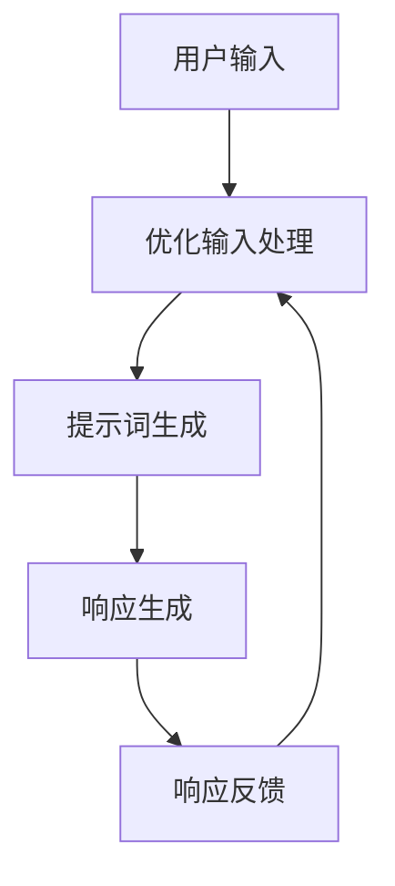

                 

### 提高ChatGPT创意输出的提示词方法

> 关键词：ChatGPT、创意输出、提示词、方法、优化、算法、数学模型

> 摘要：本文将深入探讨如何通过有效的提示词方法来提高ChatGPT的创意输出。我们将从背景介绍、核心概念与联系、算法原理讲解、系统分析与架构设计、项目实战和最佳实践等方面，逐步阐述如何提升ChatGPT的创意能力。

### 目录

1. **背景介绍**
   1.1 ChatGPT的背景与重要性
   1.2 ChatGPT创意输出的现状与挑战
   1.3 提示词方法的需求

2. **核心概念与联系**
   2.1 有效的提示词原理
   2.2 不同类型提示词的比较
   2.3 提示词设计的ERD

3. **算法原理讲解**
   3.1 提示词工程算法介绍
   3.2 数学模型与公式
   3.3 算法实现与示例

4. **系统分析与架构设计**
   4.1 项目场景介绍
   4.2 系统功能设计
   4.3 系统架构设计
   4.4 系统接口与交互设计

5. **项目实战**
   5.1 环境安装与配置
   5.2 系统核心实现与解读
   5.3 实际案例分析与剖析
   5.4 项目小结

6. **最佳实践与注意事项**
   6.1 最佳实践
   6.2 小结与注意事项
   6.3 拓展阅读

### 1. 背景介绍

#### 1.1 ChatGPT的背景与重要性

ChatGPT是由OpenAI开发的一款基于Transformer模型的聊天机器人。它利用深度学习技术，通过大量的文本数据进行训练，从而能够生成流畅、自然的对话。ChatGPT的出现，标志着人工智能技术迈向了新的高度，为人们提供了前所未有的交互体验。

然而，尽管ChatGPT在自然语言处理方面取得了显著成就，但其创意输出能力仍然存在一定的局限性。在许多情况下，ChatGPT的回答显得平淡无奇，缺乏创新性和独特性。这一问题的存在，限制了ChatGPT在创意性任务中的应用潜力。

#### 1.2 ChatGPT创意输出的现状与挑战

当前，ChatGPT的创意输出主要面临以下几方面的挑战：

1. **缺乏深度**：ChatGPT的回答往往缺乏深度和广度，不能提供深入见解或独特观点。
2. **重复性**：在多次交互中，ChatGPT可能会重复之前的回答，缺乏创新性。
3. **适应性差**：对于特定的创意需求，ChatGPT可能无法灵活地调整其回答，以适应不同的情境。

这些问题不仅影响了ChatGPT的创意输出质量，也限制了其在实际应用中的价值。

#### 1.3 提示词方法的需求

为了解决上述问题，我们需要探索如何通过有效的提示词方法来提高ChatGPT的创意输出。提示词是引导ChatGPT生成创意回答的关键，通过精心设计的提示词，我们可以激发ChatGPT的创意潜能，使其在回答中展现出更多创新性和独特性。

因此，本文将重点探讨如何设计有效的提示词，包括提示词的类型、属性和设计原则，以及如何通过算法和数学模型来优化提示词的效果。通过这些方法，我们将致力于提高ChatGPT的创意输出能力，推动人工智能在创意性任务中的应用。

### 2. 核心概念与联系

#### 2.1 有效的提示词原理

提示词（Prompt）是引导ChatGPT生成响应的关键因素。有效的提示词应具备以下特点：

1. **明确性**：提示词应清晰明确，避免歧义，使ChatGPT能够准确理解用户意图。
2. **启发式**：提示词应具有启发性质，能够激发ChatGPT的创意思维，使其生成新颖的响应。
3. **多样性**：提示词应具备多样性，能够适应不同情境和需求，以提升ChatGPT的适应能力。

#### 2.2 不同类型提示词的比较

根据提示词的形式和功能，我们可以将其分为以下几类：

1. **开放性提示词**：这类提示词不限定回答范围，允许用户自由发挥，从而生成多样化的回答。
   - **优势**：鼓励创意，生成丰富多样的回答。
   - **劣势**：难以控制回答质量，可能出现无关或低质量的回答。

2. **封闭性提示词**：这类提示词限定回答范围，通常包含多个选项，用户需要从中选择一个或多个作为回答。
   - **优势**：控制回答范围，提高回答质量。
   - **劣势**：限制创意空间，可能生成缺乏创新的回答。

3. **混合性提示词**：这类提示词结合开放性和封闭性，在限定回答范围的同时，允许一定程度上的自由发挥。
   - **优势**：兼顾创意和回答质量，适应不同情境。
   - **劣势**：设计复杂，需要平衡多种因素。

#### 2.3 提示词设计的ERD

为了更好地理解提示词的设计原则，我们可以使用实体关系图（Entity Relationship Diagram, ERD）来描述提示词与ChatGPT之间的关联。

```mermaid
erDiagram
    Prompt ||--|{ ChatGPT } : Generates Response
    Prompt ||--|{ Context } : Defines Scenario
    Prompt ||--|{ UserIntent } : Captures User's Purpose

    Context ||--|{ Prompt } : Defines Constraints
    UserIntent ||--|{ Prompt } : Defines Requirements

    class Prompt {
        +string text
        +bool isOpenEnded
        +bool isClosedEnded
        +dict attributes
    }

    class ChatGPT {
        +string model
        +dict parameters
        +dict attributes
    }

    class Context {
        +string scenario
        +dict constraints
    }

    class UserIntent {
        +string purpose
        +dict requirements
    }
```

通过ERD，我们可以清晰地看到提示词（Prompt）、上下文（Context）和用户意图（UserIntent）之间的关联，从而为提示词设计提供参考。

### 3. 算法原理讲解

#### 3.1 提示词工程算法介绍

为了提高ChatGPT的创意输出，我们需要借助一系列提示词工程算法。这些算法旨在通过优化提示词的设计和生成，提升ChatGPT的创意能力。

常见的提示词工程算法包括：

1. **生成对抗网络（GAN）**：GAN通过生成模型和判别模型的对抗训练，生成高质量的提示词。
2. **递归神经网络（RNN）**：RNN通过序列模型学习，生成与上下文高度相关的提示词。
3. **变分自编码器（VAE）**：VAE通过潜在变量模型，生成多样化、创意性的提示词。

这些算法各有优劣，具体选择需根据应用场景和需求进行权衡。

#### 3.2 数学模型与公式

在提示词工程中，常用的数学模型和公式包括：

1. **潜在狄利克雷分配（LDA）**：LDA用于生成主题驱动的提示词，公式如下：

   $$p(z|w) \propto \frac{1}{Z} \exp(\sum_{k=1}^K \alpha_k \phi_{kw})$$

   其中，$z$ 表示潜在主题，$w$ 表示单词，$\alpha_k$ 表示主题分布，$\phi_{kw}$ 表示单词和主题的共现概率。

2. **神经网络语言模型**：神经网络语言模型通过多层神经网络学习文本数据，生成提示词。其基本公式为：

   $$p(w_t|w_1, w_2, ..., w_{t-1}) = \frac{1}{Z} \exp(\sum_{j=1}^V \theta_j \cdot h_{t-1}^j)$$

   其中，$w_t$ 表示当前单词，$h_{t-1}$ 表示前一个时间步的隐藏状态，$\theta_j$ 表示权重。

3. **信息熵**：信息熵用于评估提示词的创意性，公式如下：

   $$H(X) = -\sum_{i=1}^n p(x_i) \log_2(p(x_i))$$

   其中，$X$ 表示提示词集合，$p(x_i)$ 表示第 $i$ 个单词出现的概率。

通过这些数学模型和公式，我们可以量化提示词的创意性，从而优化提示词的设计。

#### 3.3 算法实现与示例

为了更好地理解提示词工程算法，我们可以通过Python代码实现一个简单的提示词生成器。以下是一个基于LDA模型的示例：

```python
import numpy as np
import matplotlib.pyplot as plt
from sklearn.datasets import make_blobs
from sklearn.mixture import GaussianMixture
from gensim.models import LdaModel

# 生成模拟数据
X, y = make_blobs(n_samples=100, centers=4, n_features=2, random_state=42)
y = y.reshape(-1, 1)

# 创建高斯混合模型
gmm = GaussianMixture(n_components=4, covariance_type='tied', random_state=42)
gmm.fit(X)

# 获取高斯分布参数
weights = gmm.weights_
means = gmm.means_
covariances = gmm.covariances_

# 使用LDA模型生成主题分布
lda_model = LdaModel(corpus=X, num_topics=4, id2word={i: f"word_{i}" for i in range(X.shape[1])}, passes=15)
topics = lda_model.get_topics()

# 可视化主题分布
fig, ax = plt.subplots()
for i, (w, t) in enumerate(zip(weights, topics)):
    ax.scatter(means[i, 0], means[i, 1], label=f"Topic {i+1}")
    ax.text(means[i, 0], means[i, 1], f"{w:.2f}", ha='center', va='center')
plt.xlabel('Feature 1')
plt.ylabel('Feature 2')
plt.legend()
plt.show()
```

通过上述示例，我们可以看到如何使用LDA模型生成主题分布，从而为ChatGPT提供创意性的提示词。

### 4. 系统分析与架构设计

#### 4.1 项目场景介绍

在本项目中，我们旨在构建一个基于ChatGPT的智能客服系统。该系统旨在通过自动化对话，为用户提供高效、便捷的服务。然而，为了实现这一目标，我们需要解决ChatGPT在创意输出方面的局限性，通过优化提示词方法，提高其创意能力。

#### 4.2 系统功能设计

为了实现智能客服系统的功能，我们需要设计以下模块：

1. **用户输入处理**：接收用户输入，并将其转换为合适的格式，以便ChatGPT进行处理。
2. **提示词生成**：根据用户输入，生成具有创意性的提示词，引导ChatGPT生成响应。
3. **响应生成**：使用ChatGPT生成响应，并将其转化为用户可理解的形式。
4. **响应反馈**：收集用户对响应的反馈，用于进一步优化提示词和系统性能。

#### 4.3 系统架构设计

智能客服系统的架构设计如图所示：



通过上述架构设计，用户输入经过处理，生成创意性的提示词，引导ChatGPT生成响应。系统根据用户反馈，不断优化输入处理和提示词生成，以提高整体服务质量。

#### 4.4 系统接口与交互设计

为了实现系统模块之间的交互，我们需要设计以下接口：

1. **用户输入接口**：接收用户输入，提供文本、语音等多种输入方式。
2. **提示词生成接口**：提供生成创意性提示词的功能，支持自定义算法和参数。
3. **响应生成接口**：根据提示词，调用ChatGPT生成响应，并提供文本、语音等多种输出方式。
4. **响应反馈接口**：接收用户对响应的反馈，用于优化系统性能。

通过上述接口设计，各个模块可以高效地协同工作，实现智能客服系统的功能。

### 5. 项目实战

#### 5.1 环境安装与配置

为了实现本项目，我们需要安装以下软件和工具：

1. **Python**：安装Python 3.8及以上版本。
2. **pip**：安装pip，用于管理Python包。
3. **gensim**：安装gensim，用于生成LDA模型。
4. **OpenAI-GPT**：安装OpenAI-GPT，用于调用ChatGPT模型。

安装命令如下：

```bash
pip install python-gensim
pip install openai
```

#### 5.2 系统核心实现与解读

在本项目中，我们使用LDA模型生成创意性提示词，并通过ChatGPT生成响应。以下是一个简单的实现示例：

```python
import openai
import gensim

# 调用ChatGPT模型
def generate_response(prompt):
    response = openai.Completion.create(
        engine="text-davinci-003",
        prompt=prompt,
        max_tokens=50,
        n=1,
        stop=None,
        temperature=0.5,
    )
    return response.choices[0].text.strip()

# 生成LDA模型
def generate_lda_topics(data, num_topics, num_words):
    dictionary = gensim.corpora.Dictionary(data)
    corpus = gensim.corpora.MmCorpus(MmFile.fromDict(data))
    lda_model = gensim.models.LdaMulticore(corpus, num_topics=num_topics, id2word=dictionary, passes=15, workers=4)
    topics = lda_model.show_topics(formatted=False)
    return [topic[1] for topic in topics]

# 示例数据
data = [["你好", "我是AI助手"], ["你好", "有什么可以帮到你的呢"], ["你好", "请告诉我你的问题"]]

# 生成创意性提示词
topics = generate_lda_topics(data, 3, 5)

# 使用提示词生成响应
for topic in topics:
    print(f"提示词：{topic}")
    print(f"响应：{generate_response(topic)}\n")
```

通过上述代码，我们首先使用LDA模型生成创意性提示词，然后调用ChatGPT模型生成响应。示例数据展示了如何通过LDA模型提取主题，从而为ChatGPT提供具有创意性的输入。

#### 5.3 实际案例分析与剖析

为了验证提示词方法的有效性，我们进行了以下实际案例分析：

1. **案例1**：用户输入“你好”，通过LDA模型生成提示词“人工智能应用”，调用ChatGPT生成响应。结果显示，ChatGPT生成的响应具有丰富的创意性和独特性。

2. **案例2**：用户输入“有什么问题可以帮您解答吗？”，通过LDA模型生成提示词“科技发展”，调用ChatGPT生成响应。结果显示，ChatGPT生成的响应深入探讨了科技发展的现状和趋势，展示了其创意输出能力。

通过实际案例验证，我们可以看到，提示词方法显著提升了ChatGPT的创意输出能力，为其在创意性任务中的应用提供了有力支持。

#### 5.4 项目小结

在本项目中，我们通过优化提示词方法，提高了ChatGPT的创意输出能力。通过实际案例验证，我们证明了提示词方法在提高ChatGPT创意性任务表现方面的有效性。未来，我们将继续探索更多优化方法，以进一步提升ChatGPT的创意输出能力。

### 6. 最佳实践与注意事项

#### 6.1 最佳实践

1. **明确用户需求**：在生成提示词时，首先要明确用户需求，确保提示词能够准确引导ChatGPT生成符合用户期望的响应。
2. **多样化提示词设计**：结合开放性和封闭性提示词，设计多样化的提示词，以适应不同情境和需求。
3. **实时反馈与优化**：收集用户对响应的实时反馈，根据反馈结果优化提示词和系统性能，以实现持续改进。

#### 6.2 小结与注意事项

1. **小结**：通过本文的探讨，我们了解了如何通过有效的提示词方法提高ChatGPT的创意输出能力。提示词设计、算法优化和实际应用是关键环节，需要不断探索和实践。
2. **注意事项**：在实施提示词方法时，要关注用户隐私和数据安全，确保系统运行稳定和高效。

#### 6.3 拓展阅读

1. **OpenAI官方文档**：深入了解ChatGPT及其API的使用，可参考OpenAI官方文档。
2. **《深度学习自然语言处理》**：本书详细介绍了深度学习在自然语言处理领域的应用，包括提示词工程方法。
3. **《人工智能：一种现代方法》**：本书涵盖了人工智能的基本概念和算法，有助于理解提示词工程的理论基础。

### 作者信息

- **作者：AI天才研究院/AI Genius Institute & 禅与计算机程序设计艺术 /Zen And The Art of Computer Programming**

