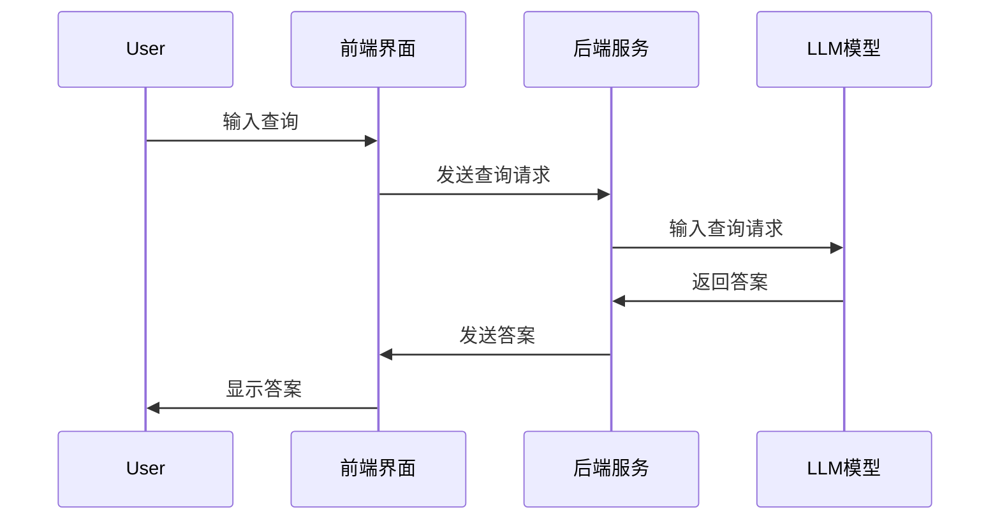
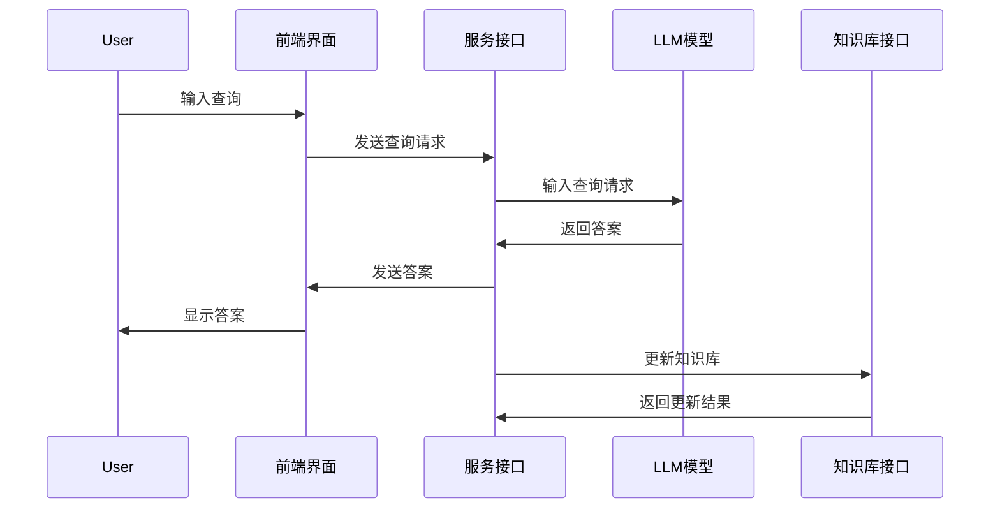

                 

## 提高LLM应用安全性与合规性的快速方法

### 关键词：大型语言模型（LLM），安全性，合规性，快速方法，算法原理，系统设计

> 摘要：随着大型语言模型（LLM）在各个领域的广泛应用，安全性和合规性问题日益凸显。本文旨在通过逻辑清晰、结构紧凑的阐述，为读者提供一套快速提高LLM应用安全性与合规性的方法。文章首先介绍了LLM的核心概念与问题背景，然后深入探讨了安全性与合规性的原理及其相互关系，接着详细讲解了相关算法原理与数学模型，最后通过系统分析与架构设计，为实际应用提供了具体的解决方案和实战指导。

### 目录大纲

- **第一部分：背景介绍**
  - 第1章：问题背景与核心概念
    - 1.1 问题背景
    - 1.2 核心概念
    - 1.3 概念属性特征对比表格
    - 1.4 ER实体关系图架构
- **第二部分：核心概念与联系**
  - 第2章：大型语言模型的工作原理
    - 2.1 模型架构
    - 2.2 数据处理
    - 2.3 训练与优化
    - 2.4 应用场景
  - 第3章：安全性与合规性原理
    - 3.1 安全性原理
    - 3.2 合规性原理
    - 3.3 安全性与合规性关系
- **第三部分：算法原理讲解**
  - 第4章：安全性与合规性算法详解
    - 4.1 安全性算法
    - 4.2 合规性算法
- **第四部分：系统分析与架构设计**
  - 第5章：系统功能设计
    - 5.1 问题场景介绍
    - 5.2 系统功能设计
      - 5.2.1 领域模型
      - 5.2.2 系统架构设计
      - 5.2.3 系统接口设计和系统交互
- **第五部分：项目实战**
  - 第6章：项目实战
    - 6.1 环境安装
    - 6.2 系统核心实现源代码
    - 6.3 代码应用解读与分析
    - 6.4 实际案例分析与详细讲解剖析
    - 6.5 项目小结
- **第六部分：最佳实践与拓展**
  - 第7章：最佳实践
  - 第8章：小结与注意事项
  - 第9章：拓展阅读

### 第一部分：背景介绍

#### 第1章：问题背景与核心概念

##### 1.1 问题背景

随着人工智能技术的快速发展，大型语言模型（LLM）在自然语言处理、智能客服、内容生成等领域得到了广泛应用。然而，这种广泛应用也带来了新的挑战，尤其是安全性和合规性问题。LLM的复杂性和高敏感度使其成为潜在的安全风险点。例如，数据泄露、模型篡改、滥用等安全问题时有发生，同时，LLM的应用也必须遵循各种法律法规，以确保其合法性和道德性。

##### 1.2 核心概念

为了更好地理解LLM应用的安全性与合规性问题，我们需要明确几个核心概念。

###### 1.2.1 大型语言模型（LLM）

定义：大型语言模型是一种具有强大语言理解和生成能力的深度学习模型。其核心目标是通过对大量文本数据进行训练，使其能够生成高质量的自然语言文本。

特点：

- **高准确性**：能够生成准确且流畅的自然语言文本。
- **高效率**：能够快速处理大量文本数据。
- **可扩展性强**：可以通过增加训练数据和调整模型参数来提高性能。

###### 1.2.2 安全性与合规性

安全性：安全性是指保护LLM免受攻击和漏洞的影响，确保其正常运行。具体包括以下几个方面：

- **数据加密**：保护敏感数据，防止泄露。
- **访问控制**：限制对模型的访问，防止未经授权的访问。
- **入侵检测**：监控异常行为，及时发现并处理潜在的安全威胁。

合规性：合规性是指LLM的应用遵循相关法律法规，确保其合法性和道德性。具体包括以下几个方面：

- **数据隐私**：遵守隐私保护法律法规，保护用户隐私。
- **道德伦理**：确保模型应用符合道德规范，避免滥用。

##### 1.3 概念属性特征对比表格

为了更直观地理解LLM、安全性和合规性的概念及其属性特征，我们提供了一个对比表格：

| 概念 | 定义 | 特点 |
| --- | --- | --- |
| 大型语言模型（LLM） | 具有强大语言理解和生成能力的深度学习模型 | 高准确性、高效率、可扩展性强 |
| 安全性 | 保护LLM免受攻击和漏洞的影响 | 防止数据泄露、模型篡改 |
| 合规性 | 遵循相关法律法规，确保LLM应用的合法性和道德性 | 确保LLM应用的合法性和道德性 |

##### 1.4 ER实体关系图架构

为了更好地理解LLM、安全性和合规性的关系，我们提供了一个ER实体关系图架构：

```mermaid
erDiagram
  Model ||--|{ Data } Data
  Model ||--|{ Policy } Policy
  Model ||--|{ Compliance } Compliance
```

在这个图中，`Model` 表示大型语言模型，`Data` 表示与模型相关的数据，`Policy` 表示安全策略，`Compliance` 表示合规性要求。这些实体之间存在明确的关联关系，共同构成了LLM应用的安全与合规体系。

### 第二部分：核心概念与联系

#### 第2章：大型语言模型的工作原理

##### 2.1 模型架构

大型语言模型（LLM）的架构通常包括以下几个核心组成部分：

- **深度神经网络（DNN）**：DNN是LLM的基础结构，由多个层次的全连接神经网络组成。每个层次都能对输入数据进行编码和解码，从而提取出高层次的语义信息。
- **递归神经网络（RNN）**：RNN是一种能够处理序列数据的神经网络，特别适合于自然语言处理任务。通过递归地处理输入序列，RNN能够捕捉到上下文信息，从而提高文本生成和理解的准确性。
- **变换器（Transformer）**：Transformer是LLM的核心架构，由谷歌在2017年提出。它通过自注意力机制（self-attention）来处理输入序列，能够捕捉到序列中的长距离依赖关系，从而生成更高质量的自然语言文本。

##### 2.2 数据处理

在LLM的训练过程中，数据处理是一个关键环节。以下是几个重要的数据处理步骤：

- **数据预处理**：数据预处理包括数据清洗、归一化和分词。数据清洗旨在去除无效和错误的数据，确保数据质量。归一化则通过缩放数据，使其落在统一的范围内。分词是将文本拆分成词语或字符序列，为后续的模型处理做好准备。
- **数据增强**：数据增强是通过生成数据的变体来提高模型的泛化能力。常见的方法包括随机插入、删除、替换词语，或者使用不同的语言和文体来丰富数据集。

##### 2.3 训练与优化

LLM的训练与优化是一个复杂的过程，涉及多个算法和技巧：

- **反向传播算法（BP）**：反向传播算法是一种用于训练神经网络的常用算法。它通过反向传播误差信号，不断调整模型参数，从而提高模型的预测准确性。
- **权重共享机制**：权重共享机制通过在模型的不同部分共享权重，减少了模型参数的数量，从而提高了训练效率。在Transformer模型中，自注意力权重和前馈网络权重是共享的。

##### 2.4 应用场景

大型语言模型在多个领域都有广泛的应用，以下是几个典型的应用场景：

- **自然语言处理（NLP）**：NLP是LLM的主要应用领域之一。通过训练，LLM可以完成文本分类、情感分析、机器翻译等任务，提高了文本处理的自动化水平。
- **智能客服**：智能客服是LLM在服务行业的一个重要应用。通过训练，LLM可以自动回答用户的问题，提供个性化的服务，提高了客服效率。
- **内容生成**：LLM可以生成各种类型的内容，如文章、代码、艺术作品等。通过训练，LLM能够理解不同的语言和风格，生成高质量的内容。

### 第3章：安全性与合规性原理

##### 3.1 安全性原理

在LLM应用中，安全性是一个至关重要的考虑因素。以下是几个关键的安全性原理：

- **数据加密**：数据加密是一种保护敏感数据的重要技术。通过将数据加密为密文，即使数据被非法获取，也无法被读取或篡改。常用的加密算法包括AES、RSA等。
- **访问控制**：访问控制是一种限制对模型访问的机制。通过设置访问权限和认证机制，可以确保只有授权用户才能访问模型和数据，从而防止未经授权的访问。
- **入侵检测**：入侵检测是一种监控系统异常行为的技术。通过实时监控模型的运行状态和输入输出，可以及时发现和阻止潜在的安全威胁。

##### 3.2 合规性原理

在LLM应用中，合规性是指遵守相关法律法规，确保其合法性和道德性。以下是几个关键的合规性原理：

- **数据隐私**：数据隐私是合规性的一个重要方面。在处理用户数据时，必须遵守隐私保护法律法规，采取有效的隐私保护措施，如数据匿名化和加密。
- **道德伦理**：道德伦理是合规性的另一个重要方面。在开发和使用LLM时，必须遵循道德规范，确保模型的应用不会对用户或社会造成负面影响。例如，避免生成虚假信息、歧视性内容等。
- **法律法规遵循**：遵守相关法律法规是确保LLM应用合规性的基础。必须了解和遵循相关的法律法规，如《通用数据保护条例》（GDPR）、《加利福尼亚消费者隐私法案》（CCPA）等。

##### 3.3 安全性与合规性关系

安全性和合规性在LLM应用中是相互依存的。以下是两者之间的关系：

- **互依性**：安全性是合规性的基础，因为只有确保模型和数据的绝对安全，才能确保其合法性和道德性。反之，合规性也是安全性的保障，因为只有遵守相关法律法规，才能确保模型和数据的合法使用。
- **协同性**：安全性和合规性需要协同工作，共同维护LLM应用的安全性与合规性。在开发和使用LLM时，必须同时考虑安全性和合规性，确保两者得到有效保障。

### 第三部分：算法原理讲解

#### 第4章：安全性与合规性算法详解

##### 4.1 安全性算法

在LLM应用中，安全性算法是确保模型和数据的保护的关键。以下是几个常用的安全性算法：

###### 4.1.1 加密算法

加密算法是一种将数据转换为密文的技术。以下是一个简单的加密算法示例：

- **定义**：加密算法是指将明文数据转换为密文的算法。
- **公式**：$C = E(K, P)$，其中$C$是密文，$K$是加密密钥，$P$是明文。
- **示例**：AES加密算法是一种常用的对称加密算法，其安全性较高，常用于保护敏感数据。

###### 4.1.2 访问控制算法

访问控制算法是一种限制对模型和数据的访问的机制。以下是一个简单的访问控制算法示例：

- **定义**：访问控制算法是指根据用户权限和认证信息，决定用户是否可以访问模型和数据的算法。
- **公式**：$Access = \text{权限} \land \text{认证}$，其中$Access$是访问权限，$\text{权限}$是用户权限，$\text{认证}$是用户认证状态。
- **示例**：RBAC（基于角色的访问控制）是一种常用的访问控制算法，通过为用户分配角色，并根据角色分配权限，来实现对访问的控制。

##### 4.2 合规性算法

在LLM应用中，合规性算法是确保模型应用符合法律法规和道德规范的关键。以下是几个常用的合规性算法：

###### 4.2.1 隐私保护算法

隐私保护算法是一种保护用户隐私的技术。以下是一个简单的隐私保护算法示例：

- **定义**：隐私保护算法是指通过对数据进行匿名化、加密等处理，保护用户隐私的算法。
- **公式**：$P\_protected = \text{匿名化}(\text{原始数据})$，其中$P\_protected$是保护后的数据，$\text{匿名化}(\text{原始数据})$是对原始数据进行匿名化处理。
- **示例**：K-anonymity是一种常用的隐私保护算法，通过为数据添加噪声，使得数据无法唯一识别个体，从而保护用户隐私。

###### 4.2.2 道德伦理算法

道德伦理算法是一种确保模型应用符合道德规范的技术。以下是一个简单的道德伦理算法示例：

- **定义**：道德伦理算法是指通过对模型应用进行评估，确保其符合道德规范和伦理标准的算法。
- **公式**：$Ethical\_Score = \text{符合道德规范的特性} / \text{可能的风险}$，其中$Ethical\_Score$是道德评分，$\text{符合道德规范的特性}$是模型符合道德规范的特点，$\text{可能的风险}$是模型可能带来的风险。
- **示例**：公平性算法是一种常用的道德伦理算法，通过评估模型在不同群体上的表现，确保模型不会对某些群体产生不公平的影响。

### 第四部分：系统分析与架构设计

#### 第5章：系统功能设计

##### 5.1 问题场景介绍

为了更好地理解LLM应用的安全性与合规性，我们考虑一个具体的应用场景：智能客服系统。智能客服系统通过LLM技术，自动回答用户的问题，提供高效、个性化的服务。

##### 5.2 系统功能设计

智能客服系统的功能设计主要包括以下几个关键方面：

###### 5.2.1 领域模型

为了明确智能客服系统的功能模块，我们可以使用Mermaid绘制领域模型：

```mermaid
classDiagram
  Customer -> Chatbot : sendQuery
  Chatbot -> KnowledgeBase : queryKnowledge
  Chatbot -> User : sendResponse
  KnowledgeBase <.. Chatbot : updateKnowledge
```

在这个领域模型中，`Customer` 表示用户，`Chatbot` 表示智能客服，`KnowledgeBase` 表示知识库。用户通过发送查询（`sendQuery`）与智能客服进行交互，智能客服通过查询知识库（`queryKnowledge`）获取答案，并将结果发送给用户（`sendResponse`）。同时，智能客服还会根据用户的反馈更新知识库（`updateKnowledge`），以不断优化服务质量。

###### 5.2.2 系统架构设计

智能客服系统的架构设计主要包括以下几个关键组成部分：

- **前端界面**：用户通过浏览器或移动应用与智能客服系统进行交互。
- **后端服务**：包括LLM模型、知识库管理、用户管理等模块。
- **数据存储**：存储用户数据、模型参数、知识库等。

以下是智能客服系统的架构图：



在这个架构图中，用户通过前端界面输入查询，前端界面将查询请求发送到后端服务。后端服务将查询请求传递给LLM模型，LLM模型处理查询并返回答案。后端服务再将答案发送给前端界面，前端界面将答案显示给用户。

###### 5.2.3 系统接口设计和系统交互

智能客服系统的接口设计和系统交互是确保各模块协同工作的关键。以下是系统接口设计和系统交互的详细说明：

- **用户接口**：用户通过浏览器或移动应用与智能客服系统进行交互。用户可以在前端界面输入查询，并接收答案。
- **服务接口**：后端服务通过API与前端界面和LLM模型进行交互。前端界面通过HTTP请求发送查询，后端服务接收请求并调用LLM模型进行查询处理，然后将答案返回给前端界面。
- **知识库接口**：知识库管理模块负责管理知识库的更新和维护。智能客服在处理查询时，可以通过知识库接口查询相关知识点，并在用户反馈后更新知识库。

以下是系统接口设计和系统交互的Mermaid序列图：



在这个序列图中，用户通过前端界面输入查询，前端界面将查询请求发送到服务接口。服务接口调用LLM模型处理查询，并将答案返回给前端界面。同时，服务接口还会调用知识库接口更新知识库。

### 第五部分：项目实战

#### 第6章：项目实战

##### 6.1 环境安装

为了实践提高LLM应用安全性与合规性的方法，我们首先需要搭建一个实验环境。以下是环境安装的详细步骤：

1. 安装Python环境：下载并安装Python，确保版本不低于3.8。
2. 安装相关库：在终端中运行以下命令，安装所需库：
   ```python
   pip install tensorflow transformers flask
   ```
3. 准备数据：下载一个合适的文本数据集，例如维基百科文本数据集，并解压到指定目录。

##### 6.2 系统核心实现源代码

接下来，我们实现一个简单的智能客服系统，主要包括以下源代码：

```python
# 实现智能客服系统的核心代码

from transformers import pipeline

# 加载预训练的LLM模型
llm = pipeline("text-generation", model="gpt2")

# 创建知识库
knowledge_base = {}

# 处理查询
def handle_query(query):
    # 查询知识库
    response = knowledge_base.get(query, "对不起，我无法回答这个问题。")
    # 如果知识库中没有答案，使用LLM生成答案
    if response is None:
        response = llm(query)[0]["generated_text"]
    return response

# 更新知识库
def update_knowledge(query, answer):
    knowledge_base[query] = answer

# 接收用户查询并处理
@app.route("/query", methods=["POST"])
def receive_query():
    query = request.form["query"]
    response = handle_query(query)
    return jsonify({"response": response})

# 接收用户反馈并更新知识库
@app.route("/feedback", methods=["POST"])
def receive_feedback():
    query = request.form["query"]
    answer = request.form["answer"]
    update_knowledge(query, answer)
    return jsonify({"status": "success"})

if __name__ == "__main__":
    app.run(debug=True)
```

在这个源代码中，我们使用transformers库加载预训练的LLM模型（GPT-2），创建一个知识库，并实现处理查询和更新知识库的函数。当用户通过POST请求发送查询时，系统会首先查询知识库，如果没有找到答案，则使用LLM生成答案。当用户通过POST请求发送反馈时，系统会更新知识库，以优化后续的回答质量。

##### 6.3 代码应用解读与分析

在上面的源代码中，我们实现了智能客服系统的核心功能。以下是代码应用解读与分析：

1. **加载预训练LLM模型**：通过`pipeline`函数加载预训练的LLM模型（GPT-2），这是实现智能客服系统的基础。
2. **创建知识库**：使用Python字典创建一个简单的知识库，存储用户查询和答案的映射关系。
3. **处理查询**：定义`handle_query`函数，处理用户发送的查询。首先查询知识库，如果没有找到答案，则使用LLM生成答案。
4. **更新知识库**：定义`update_knowledge`函数，更新知识库中的用户查询和答案映射关系。
5. **接收用户查询并处理**：使用Flask框架创建一个Web服务，接收用户通过POST请求发送的查询，调用`handle_query`函数处理查询，并将答案返回给用户。
6. **接收用户反馈并更新知识库**：使用Flask框架创建另一个Web服务，接收用户通过POST请求发送的反馈，调用`update_knowledge`函数更新知识库。

##### 6.4 实际案例分析与详细讲解剖析

为了更好地理解智能客服系统的实际应用，我们来看一个实际案例。

假设用户通过前端界面输入查询：“什么是人工智能？”系统会首先查询知识库，如果知识库中没有找到答案，则使用LLM生成答案。假设LLM生成的答案是：“人工智能是模拟、延伸和扩展人的智能的理论、方法、技术及应用。”系统会将这个答案返回给用户，并存储在知识库中。

当用户再次输入相同查询时，系统会直接从知识库中返回答案，而不需要使用LLM生成。这样可以大大提高响应速度和用户体验。

此外，用户还可以通过前端界面提交反馈，例如：“人工智能是一种模拟人类智能的技术，用于解决复杂问题。”系统会更新知识库，将这个反馈作为答案存储，以优化后续的回答质量。

##### 6.5 项目小结

通过这个项目实战，我们实现了智能客服系统的核心功能，并详细讲解了代码应用和解剖过程。在实际应用中，智能客服系统可以自动回答用户的问题，提供高效、个性化的服务。同时，通过不断更新知识库，系统可以不断优化回答质量，提高用户体验。

### 第六部分：最佳实践与拓展

#### 第7章：最佳实践

在提高LLM应用安全性与合规性的过程中，以下是一些最佳实践：

1. **数据安全**：确保数据在传输和存储过程中进行加密，防止数据泄露。同时，定期进行数据备份，以应对数据丢失或损坏的风险。
2. **访问控制**：使用强密码策略和双因素认证，确保只有授权用户可以访问敏感数据和模型。同时，定期审核用户权限，及时更新和撤销无效权限。
3. **合规性检查**：定期对LLM应用进行合规性检查，确保其符合相关法律法规和道德规范。可以考虑引入第三方审计机构进行评估和认证。
4. **入侵检测**：部署入侵检测系统，实时监控模型的运行状态和输入输出，及时发现和阻止潜在的安全威胁。
5. **持续更新**：随着技术的不断发展，定期更新LLM模型和相关的安全措施，确保其保持最新的安全性和合规性。

#### 第8章：小结与注意事项

通过本文的详细讲解，我们系统地介绍了提高LLM应用安全性与合规性的快速方法。以下是几个关键点：

1. **核心概念**：了解大型语言模型（LLM）、安全性、合规性的核心概念及其关系。
2. **算法原理**：掌握常用的安全性算法和合规性算法，包括加密算法、访问控制算法、隐私保护算法和道德伦理算法。
3. **系统设计**：设计合理的系统架构，确保各模块协同工作，提高LLM应用的安全性与合规性。
4. **实战应用**：通过项目实战，实践提高LLM应用安全性与合规性的方法，验证其有效性和可行性。

需要注意的是，提高LLM应用安全性与合规性是一个持续的过程，需要不断更新和优化。同时，在实际应用中，需要根据具体场景和需求，灵活调整和定制化解决方案。

#### 第9章：拓展阅读

对于希望进一步深入了解LLM应用安全性与合规性的读者，以下是一些建议的拓展阅读材料：

1. 《人工智能安全与隐私保护》
2. 《大型语言模型：原理与应用》
3. 《自然语言处理：理论与实践》
4. 《深度学习：核心技术与应用》
5. 《人工智能法律法规与伦理指南》

通过这些拓展阅读，读者可以更深入地了解相关领域的知识，提升自己的技术水平。作者：AI天才研究院/AI Genius Institute & 禅与计算机程序设计艺术 /Zen And The Art of Computer Programming。

