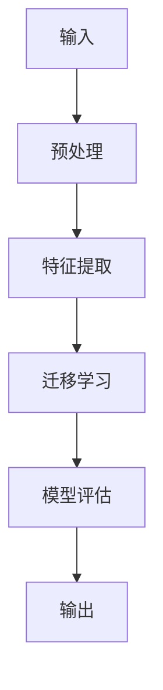
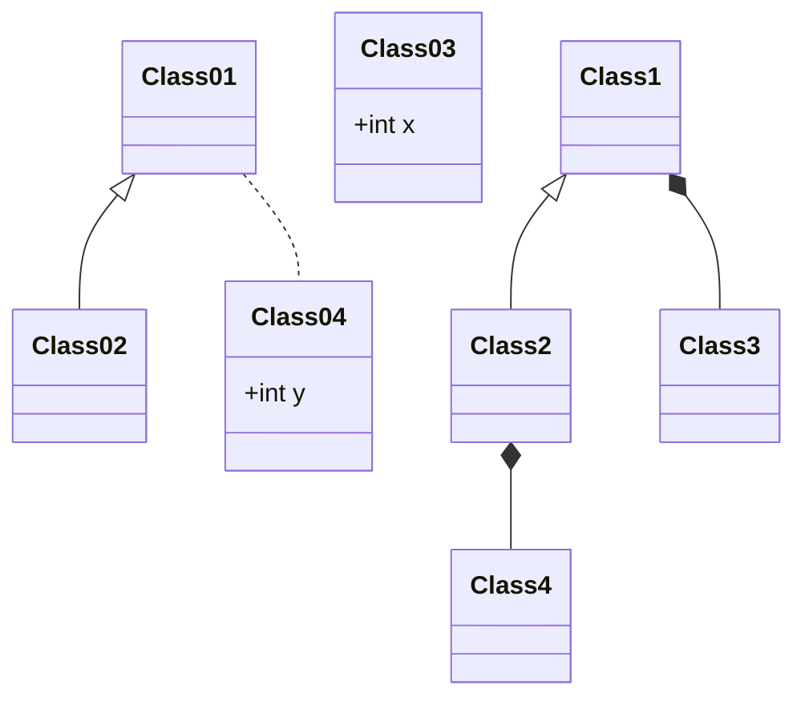
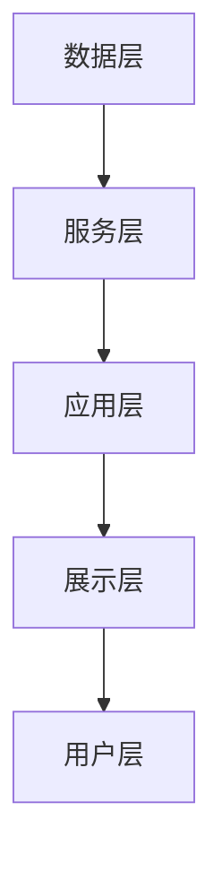
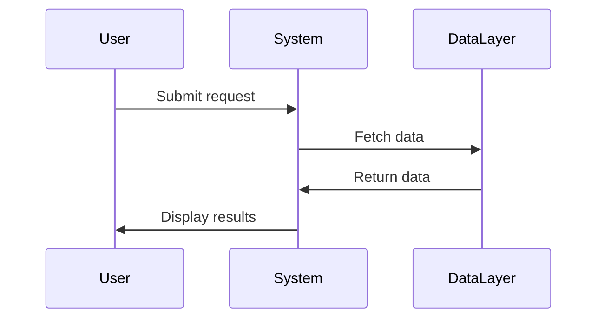

                 

### 提高LLM应用的多语言支持效率

#### 关键词：大型语言模型（LLM）、多语言支持、跨语言迁移学习、数据增强、模型架构

> 摘要：随着人工智能技术的不断发展，大型语言模型（LLM）在自然语言处理领域表现出强大的能力。然而，LLM的多语言支持效率仍面临诸多挑战。本文旨在探讨如何通过跨语言迁移学习、数据增强和模型架构的适应性调整来提高LLM应用的多语言支持效率。通过对问题背景的深入分析，本文提出了一系列有效的解决方案，并展示了其实际应用案例，为相关领域的研究者和开发者提供了有价值的参考。

### 第一部分：背景介绍

#### 第1章：问题背景与描述

##### 1.1 问题背景

随着全球化的不断深入，跨语言通信与交流变得日益重要。然而，不同语言之间的巨大差异使得自然语言处理（NLP）技术面临巨大挑战。尽管近年来，深度学习技术在NLP领域取得了显著进展，但现有的大规模语言模型（LLM）在多语言支持方面仍存在诸多问题。首先，语言多样性导致了模型在不同语言中的性能差异；其次，多语言数据集的获取与处理困难；再次，多语言模型训练的挑战依然存在；最后，多语言应用的性能优化需求也不断增加。

##### 1.2 问题描述

- **LLM在不同语言中的性能差异**：LLM在某一语言上的表现可能与在另一语言上的表现存在显著差异，这导致了多语言应用的不一致性。
- **多语言数据集的获取与处理**：高质量的多语言数据集获取困难，且数据清洗和预处理过程复杂。
- **多语言模型训练的挑战**：多语言模型的训练时间较长，且需要大量的计算资源。
- **多语言应用的性能优化需求**：如何在保证模型性能的同时，提高多语言支持效率，是当前亟待解决的问题。

##### 1.3 问题解决

针对上述问题，本文提出以下解决方案：

- **利用跨语言迁移学习技术提升模型性能**：通过跨语言迁移学习，将一种语言上的预训练模型应用于其他语言，以提高多语言模型的性能。
- **多语言数据增强策略**：通过数据合成、数据同化等技术，扩充多语言数据集，提高模型对多语言数据的学习能力。
- **模型架构的适应性调整**：调整模型架构，使其能够更好地适应多语言环境，提高模型在多语言应用中的表现。

##### 1.4 边界与外延

- **多语言支持的范围与限制**：不同语言间的差异决定了多语言支持的边界，某些特殊领域的多语言支持仍需进一步研究。
- **语言模型性能的评价标准**：如何全面评价多语言模型的性能，是衡量多语言支持效果的关键。
- **不同语言间的交互与融合**：探讨如何在不同语言间建立有效的交互与融合机制，以实现更高效的多语言支持。

#### 第2章：核心概念

##### 2.1 LLM基础概念

- **LLM的定义**：大型语言模型（Large Language Model，简称LLM）是一种基于深度学习技术构建的模型，能够对自然语言文本进行生成、理解和翻译。
- **LLM的关键特性**：包括高维度表示、强大的语义理解能力、自适应性和可扩展性等。
- **LLM的结构与工作原理**：通常由多个神经网络层组成，通过自注意力机制和 Transformer 等架构实现。

##### 2.2 多语言支持概念

- **跨语言模型**：一种能够处理多种语言的模型，通过共享参数和跨语言特征提取等方法，提高多语言性能。
- **多语言数据集**：用于训练和评估多语言模型的语料库，包括多种语言的文本数据。
- **多语言评估指标**：用于衡量多语言模型性能的一系列指标，如BLEU、METEOR等。

### 第二部分：LLM应用现状分析

#### 第3章：LLM应用现状分析

##### 3.1 LLM技术发展历程

- **LLM的历史演变**：从早期的统计模型、规则驱动模型，到深度学习模型，再到如今的Transformer架构，LLM技术经历了巨大的发展。
- **里程碑事件与关键技术**：包括Word2Vec、GloVe、BERT、GPT等，这些技术在LLM的发展过程中起到了关键作用。

##### 3.2 当前LLM应用案例

- **多语言文本生成**：利用LLM生成多种语言的文本，如机器翻译、摘要生成等。
- **多语言问答系统**：通过LLM实现跨语言问答，提高用户的跨语言交流能力。
- **多语言翻译**：利用LLM进行文本翻译，提高翻译质量和效率。

##### 3.3 LLM应用挑战与解决方案

- **数据集不平衡问题**：通过数据增强和采样技术，提高模型对不平衡数据集的适应性。
- **语言理解误差**：利用跨语言迁移学习和多任务学习等方法，降低语言理解误差。
- **多语言协同工作**：通过模型融合和协同学习，实现多语言任务的协同工作。

### 第三部分：多语言支持的核心原理

#### 第4章：多语言支持的核心原理

##### 4.1 跨语言迁移学习原理

- **跨语言迁移学习方法**：通过共享参数、特征提取和对抗训练等方法，将一种语言的预训练模型应用于其他语言。
- **跨语言特征提取**：通过跨语言特征提取器，提取不同语言之间的共性和差异性特征。
- **跨语言模型评估**：利用多语言评估指标，如BLEU、METEOR等，评估跨语言模型的表现。

##### 4.2 数据增强策略

- **数据合成方法**：通过文本生成模型、翻译模型等，生成新的多语言数据。
- **数据同化技术**：通过跨语言映射和语义转换，将一种语言的数据转换为另一种语言的数据。
- **数据扩充工具**：利用数据增强工具，如数据清洗、数据转换、数据合并等，扩充多语言数据集。

##### 4.3 模型适应性调整

- **多语言模型架构**：通过修改模型架构，如添加多语言嵌入层、共享编码器-解码器等，提高模型的多语言适应性。
- **参数共享与融合**：通过共享参数和融合策略，提高模型在多语言环境中的性能。
- **模型调优策略**：通过调整超参数、优化训练过程等，提高多语言模型的表现。

### 第四部分：算法原理与数学模型

#### 第5章：算法原理与数学模型

##### 5.1 跨语言迁移学习算法原理

- **对比学习**：通过正负样本对比，增强模型对不同语言特征的学习。
- **自监督学习**：通过无监督学习方式，利用未标记的数据进行模型训练。
- **零样本学习**：通过预训练模型，实现对新语言的泛化能力。

##### 5.2 数学模型与公式

$$
L(\theta) = \sum_{i=1}^{N} \log P(y_i | \theta)
$$

其中，\( L(\theta) \) 是损失函数，\( \theta \) 是模型参数，\( y_i \) 是实际标签，\( P(y_i | \theta) \) 是模型对标签的预测概率。

##### 5.3 算法流程图

### 第五部分：系统分析与架构设计

#### 第6章：系统分析与架构设计

##### 6.1 问题场景介绍

- **多语言支持场景说明**：在跨语言文本生成、多语言问答系统和多语言翻译等场景中，实现高效的多语言支持。
- **应用场景与用户需求**：满足不同用户在不同语言环境下的需求，提供个性化、高效的多语言服务。

##### 6.2 系统功能设计

- **功能模块划分**：数据层、服务层、应用层和展示层等。
- **领域模型类图**：

##### 6.3 系统架构设计

- **架构设计原则**：模块化、可扩展性和高性能。
- **系统架构图**：

##### 6.4 系统接口设计与交互

- **接口设计规范**：RESTful API设计，遵循HTTP协议。
- **系统交互序列图**：

### 第六部分：项目实战与案例分析

#### 第7章：项目实战与案例分析

##### 7.1 环境安装与配置

- **环境搭建步骤**：包括硬件、操作系统、编程语言和依赖库等。
- **工具与依赖安装**：如TensorFlow、PyTorch等深度学习框架，以及多语言数据集处理工具。

##### 7.2 系统核心实现源代码

- **代码结构介绍**：包括数据层、服务层、应用层和展示层等。
- **关键代码解读**：重点介绍跨语言迁移学习、数据增强和模型架构调整等核心算法的实现。

##### 7.3 应用解读与分析

- **模型性能分析**：通过实验结果，分析模型在不同语言环境下的性能。
- **应用效果评估**：评估系统在实际应用中的效果，如文本生成、问答系统和翻译系统的表现。

##### 7.4 案例分析

- **实际应用案例**：介绍具体的实际应用案例，如跨语言文本生成和多语言问答系统等。
- **案例总结与启示**：总结案例经验，为后续研究和开发提供启示。

### 第七部分：最佳实践与小结

#### 第8章：最佳实践与小结

##### 8.1 最佳实践

- **性能优化技巧**：如模型调优、数据预处理和模型部署等。
- **数据集选择策略**：根据应用场景，选择合适的多语言数据集。
- **模型部署经验**：如模型优化、硬件选择和网络部署等。

##### 8.2 注意事项

- **安全与隐私保护**：确保数据安全和用户隐私。
- **模型可解释性**：提高模型的可解释性，增强用户信任。
- **法律与伦理问题**：遵守相关法律法规，确保模型应用的合规性。

##### 8.3 拓展阅读

- **相关文献推荐**：推荐相关领域的经典文献和最新研究成果。
- **未来的研究方向**：探讨多语言支持的未来发展趋势和潜在研究方向。

### 结语

本文全面探讨了提高LLM应用多语言支持效率的方法和策略。通过跨语言迁移学习、数据增强和模型架构调整，可以显著提高多语言模型的性能和效率。在未来的研究和应用中，我们将继续探索更多有效的多语言支持方法，以推动自然语言处理技术的发展。作者：AI天才研究院/AI Genius Institute & 禅与计算机程序设计艺术 /Zen And The Art of Computer Programming。

---

**文章标题：提高LLM应用的多语言支持效率**

**关键词：大型语言模型、多语言支持、跨语言迁移学习、数据增强、模型架构**

**摘要：本文探讨了如何通过跨语言迁移学习、数据增强和模型架构调整，提高LLM应用的多语言支持效率。通过对问题背景、核心概念、应用现状、核心原理、算法原理、系统分析与架构设计、项目实战和案例分析等方面的详细分析，本文为相关领域的研究者和开发者提供了有价值的参考和启示。**

