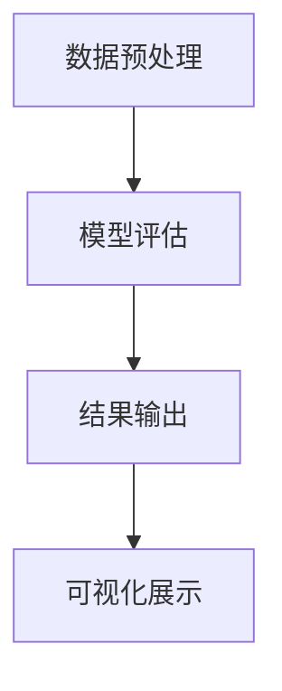
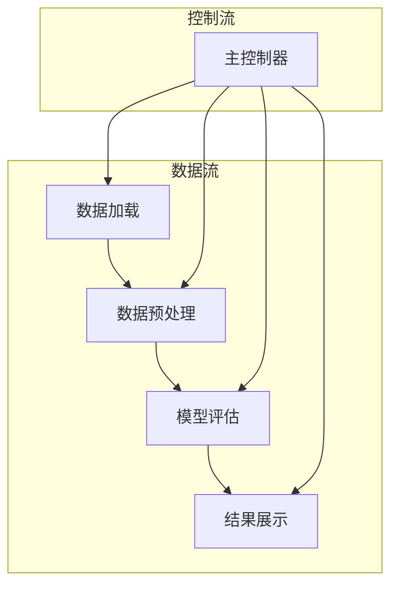

                 

## 提高LLM应用的自动评估效率

### 关键词：语言模型，自动评估，效率优化，算法，系统架构

> 摘要：随着语言模型（LLM）在自然语言处理（NLP）领域的广泛应用，如何提高LLM应用的自动评估效率成为了一个重要课题。本文将深入探讨语言模型自动评估的挑战与机遇，分析影响评估效率的关键因素，并提出一种高效的自动评估方法，以期为相关研究和应用提供参考。

### 目录大纲

---

# 提高LLM应用的自动评估效率

## 第一部分: 背景介绍

## 1.1 问题背景
### 1.1.1 语言模型自动评估的挑战
### 1.1.2 评估效率的重要性
### 1.1.3 研究现状与不足

## 1.2 核心概念
### 1.2.1 语言模型（LLM）概述
### 1.2.2 自动评估方法
### 1.2.3 评估效率的关键因素

## 1.3 边界与外延
### 1.3.1 自动评估的应用场景
### 1.3.2 评估效率的影响因素

## 1.4 概念结构与核心要素
### 1.4.1 自动评估系统的构成
### 1.4.2 关键技术与挑战

## 1.5 本章小结

## 第二部分: 核心概念与联系

## 2.1 核心概念原理
### 2.1.1 语言模型自动评估原理
### 2.1.2 自动评估方法分类

## 2.2 概念属性特征对比表格

## 2.3 ER实体关系图架构

## 2.4 自动评估方法流程图

## 2.5 本章小结

## 第三部分: 算法原理讲解

## 3.1 算法原理概述
### 3.1.1 自动评估算法的作用
### 3.1.2 自动评估算法的分类

## 3.2 数学模型与公式

## 3.3 Python源代码实现

## 3.4 详细讲解与举例说明
### 3.4.1 评估指标选择
### 3.4.2 数据预处理技巧
### 3.4.3 算法优化策略

## 3.5 本章小结

## 第四部分: 系统分析与架构设计

## 4.1 问题场景介绍
### 4.1.1 自动评估系统需求
### 4.1.2 自动评估系统目标

## 4.2 系统功能设计
### 4.2.1 功能模块划分
### 4.2.2 领域模型（类图）

## 4.3 系统架构设计
### 4.3.1 架构设计原则
### 4.3.2 系统架构图

## 4.4 系统接口设计
### 4.4.1 接口定义
### 4.4.2 接口调用示例

## 4.5 本章小结

## 第五部分: 项目实战

## 5.1 环境安装
### 5.1.1 环境配置
### 5.1.2 工具与库安装

## 5.2 系统核心实现源代码
### 5.2.1 数据加载与预处理
### 5.2.2 模型评估与结果输出

## 5.3 代码应用解读与分析
### 5.3.1 代码结构分析
### 5.3.2 关键代码解析

## 5.4 实际案例分析与详细讲解剖析
### 5.4.1 案例背景
### 5.4.2 实施步骤
### 5.4.3 结果分析

## 5.5 项目小结

## 第六部分: 最佳实践与总结

## 6.1 最佳实践 Tips
### 6.1.1 提高模型训练效率
### 6.1.2 优化评估流程

## 6.2 小结

## 6.3 注意事项

## 6.4 拓展阅读

---

## 第一部分: 背景介绍

### 1.1 问题背景

随着深度学习技术的飞速发展，语言模型（LLM）在自然语言处理（NLP）领域取得了显著的成果。然而，如何对LLM应用进行有效的自动评估，提高评估效率，成为了一个亟待解决的问题。自动评估不仅能够快速识别模型的性能，还能为模型优化提供重要依据。

#### 1.1.1 语言模型自动评估的挑战

首先，语言模型的自动评估面临诸多挑战。一方面，LLM模型复杂度高，参数数量庞大，评估过程耗时耗力。另一方面，自动评估需要处理大量的数据，如何高效地处理和利用这些数据也是一个难题。此外，评估指标的选择和组合也直接影响评估结果的准确性和可靠性。

#### 1.1.2 评估效率的重要性

评估效率对于LLM应用至关重要。高效的评估能够快速反馈模型性能，为模型优化提供及时支持。在实际应用中，评估效率的提升意味着能够更快速地迭代和优化模型，提高开发效率。同时，高效的评估也有助于降低计算成本，为大规模部署提供保障。

#### 1.1.3 研究现状与不足

目前，关于LLM自动评估的研究已经取得了一定的进展。然而，现有方法在评估效率方面仍有待提高。一些研究主要关注于特定评估指标的计算优化，而忽视了评估流程的整体优化。此外，现有方法在处理大规模数据时效率较低，无法满足实际应用的需求。

### 1.2 核心概念

在深入探讨LLM自动评估之前，我们需要明确一些核心概念。

#### 1.2.1 语言模型（LLM）概述

语言模型（LLM）是一种基于深度学习技术构建的模型，用于预测自然语言序列。LLM可以应用于各种NLP任务，如机器翻译、文本分类、问答系统等。LLM的核心是神经网络，通过大量语料训练，模型能够学习到语言的内在规律和特征。

#### 1.2.2 自动评估方法

自动评估方法是指利用算法和工具对模型性能进行评估的方法。常见的自动评估方法包括基于规则的方法、基于机器学习的方法和基于深度学习的方法。这些方法各有优缺点，适用于不同的评估场景。

#### 1.2.3 评估效率的关键因素

评估效率受到多种因素影响。关键因素包括模型参数数量、数据规模、计算资源、算法复杂度等。提高评估效率需要综合考虑这些因素，优化评估流程和算法。

#### 1.3 边界与外延

在讨论自动评估效率时，我们需要明确其应用场景和边界。

#### 1.3.1 自动评估的应用场景

自动评估广泛应用于模型训练、模型优化、模型部署等环节。例如，在模型训练过程中，自动评估可以帮助研究者快速判断模型性能，指导模型优化。在模型部署阶段，自动评估可以实时监控模型性能，确保模型稳定运行。

#### 1.3.2 评估效率的影响因素

评估效率受到多种因素影响，包括模型复杂度、数据规模、计算资源等。在实际应用中，需要根据具体场景和需求，选择合适的评估方法和优化策略。

#### 1.4 概念结构与核心要素

自动评估系统的构成和关键技术与挑战如下：

#### 1.4.1 自动评估系统的构成

自动评估系统通常包括数据预处理模块、模型评估模块、结果输出模块等。这些模块相互配合，实现高效的评估流程。

#### 1.4.2 关键技术与挑战

关键技术与挑战包括高效数据预处理方法、优化评估算法、分布式计算等。如何平衡评估准确性和效率，是自动评估系统面临的主要挑战。

### 1.5 本章小结

本部分对LLM自动评估的背景、核心概念、边界与外延以及概念结构与核心要素进行了详细阐述。在后续章节中，我们将进一步探讨自动评估原理、算法、系统架构以及项目实战，为提高LLM应用自动评估效率提供有力支持。

## 第二部分: 核心概念与联系

### 2.1 核心概念原理

#### 2.1.1 语言模型自动评估原理

语言模型自动评估是基于深度学习技术对模型性能进行量化评估的方法。评估过程通常包括数据预处理、模型评估、结果输出等步骤。数据预处理环节对输入数据进行标准化处理，确保模型输入的一致性。模型评估环节通过计算评估指标，如准确率、召回率、F1值等，对模型性能进行量化评价。结果输出环节将评估结果可视化，为研究者提供直观的评估反馈。

#### 2.1.2 自动评估方法分类

自动评估方法可以分为基于规则的方法、基于机器学习的方法和基于深度学习的方法。基于规则的方法通过设计特定的评估规则，对模型性能进行评估。这种方法简单直观，但灵活性较低。基于机器学习的方法利用机器学习算法，对评估指标进行学习，从而实现自动化评估。这种方法具有较强的适应性，但需要大量训练数据和计算资源。基于深度学习的方法通过构建深度神经网络，对模型性能进行评估。这种方法具有强大的表达能力和自适应能力，但训练过程复杂，计算资源需求较高。

### 2.2 概念属性特征对比表格

| 概念 | 特点 |
| --- | --- |
| 基于规则的方法 | 简单直观，灵活性低 |
| 基于机器学习的方法 | 强适应性，需大量训练数据和计算资源 |
| 基于深度学习的方法 | 强表达能力和自适应能力，训练过程复杂 |

### 2.3 ER实体关系图架构

为了更好地理解语言模型自动评估系统的构成，我们可以使用ER（实体关系）图来描述系统中的实体及其关系。以下是一个简单的ER图示例：

```mermaid
erDiagram
  Model ||--|{ EvaluationMethod :评估方法 }  
  Model ||--|{ PerformanceMetric :性能指标 }  
  EvaluationMethod ||--|{ Algorithm :算法 }  
  PerformanceMetric ||--|{ MetricType :指标类型 }  
```

在这个ER图中，`Model` 表示语言模型，`EvaluationMethod` 表示评估方法，`PerformanceMetric` 表示性能指标。`EvaluationMethod` 和 `Model` 之间存在多对一的关系，即一个评估方法可以用于多个语言模型的评估。`PerformanceMetric` 和 `Model` 之间也存在多对一的关系，即一个语言模型可以产生多个性能指标。

### 2.4 自动评估方法流程图

自动评估方法通常包括以下几个步骤：

1. **数据预处理**：对输入数据进行清洗、归一化等处理，确保数据格式一致。
2. **模型评估**：根据评估方法，对模型进行评估，计算性能指标。
3. **结果输出**：将评估结果进行可视化展示，为研究者提供直观的评估反馈。

以下是一个使用Mermaid绘制的自动评估方法流程图：



### 2.5 本章小结

在本章中，我们介绍了语言模型自动评估的核心概念和原理，并分析了不同自动评估方法的特点和适用场景。通过ER图和流程图的展示，我们更好地理解了自动评估系统的构成和工作原理。这些概念和原理将为后续章节中的算法原理讲解和系统架构设计提供基础。

---

## 第三部分: 算法原理讲解

### 3.1 算法原理概述

自动评估算法在LLM应用中起着至关重要的作用。它们不仅能够快速识别模型的性能，还能为模型优化提供重要依据。在本节中，我们将介绍自动评估算法的基本原理、分类以及在实际应用中的重要作用。

#### 3.1.1 自动评估算法的作用

自动评估算法的主要作用是对语言模型进行性能评估。通过计算评估指标，如准确率、召回率、F1值等，自动评估算法能够量化模型在特定任务上的表现。这些评估指标为研究者提供了直观的评估反馈，帮助他们判断模型是否达到预期目标，以及需要进一步优化的方向。

#### 3.1.2 自动评估算法的分类

自动评估算法可以分为基于规则的方法、基于机器学习的方法和基于深度学习的方法。每种方法都有其独特的原理和特点，适用于不同的评估场景。

1. **基于规则的方法**：这种方法通过设计特定的评估规则，对模型性能进行评估。评估规则通常是手工设计的，具有一定的灵活性。基于规则的方法简单直观，但灵活性较低，无法适应复杂多变的评估场景。

2. **基于机器学习的方法**：这种方法利用机器学习算法，对评估指标进行学习，从而实现自动化评估。基于机器学习的方法具有较强的适应性，但需要大量训练数据和计算资源。

3. **基于深度学习的方法**：这种方法通过构建深度神经网络，对模型性能进行评估。基于深度学习的方法具有强大的表达能力和自适应能力，但训练过程复杂，计算资源需求较高。

#### 3.1.3 自动评估算法在实际应用中的重要作用

自动评估算法在LLM应用中具有重要作用。首先，它们能够快速识别模型的性能，为研究者提供直观的评估反馈。这使得研究者能够更快速地迭代和优化模型，提高开发效率。其次，自动评估算法能够帮助研究者发现模型存在的问题，指导他们进行针对性的优化。此外，自动评估算法还能为大规模部署提供保障，确保模型在不同场景下都能稳定运行。

### 3.2 数学模型与公式

在自动评估算法中，数学模型和公式起着关键作用。数学模型能够描述模型性能与输入数据之间的关系，公式则用于计算评估指标。以下是一个简单的数学模型和公式示例：

$$
E = \frac{1}{N} \sum_{i=1}^{N} (y_i - \hat{y_i})^2
$$

这个公式表示均方误差（MSE），用于评估模型的预测性能。其中，$y_i$ 表示真实标签，$\hat{y_i}$ 表示预测标签，$N$ 表示样本数量。

#### 3.2.1 评估指标的选择

评估指标的选择对评估结果具有重要影响。不同的评估指标能够从不同角度反映模型性能，如准确率、召回率、F1值、均方误差等。在选择评估指标时，需要考虑以下因素：

1. **任务类型**：不同的任务类型可能需要不同的评估指标。例如，在二分类任务中，准确率和F1值是常用的评估指标；在多分类任务中，准确率、召回率和F1值都有一定的参考意义。

2. **数据分布**：数据分布对评估指标的选择也有重要影响。在某些情况下，数据分布可能影响评估指标的稳定性。例如，在数据分布不均匀的情况下，召回率可能更可靠。

3. **业务需求**：评估指标的选择还需要考虑业务需求。例如，在金融风控场景中，可能更关注模型的召回率，以确保尽可能多地识别出风险事件。

#### 3.2.2 常见的评估指标

以下是几种常见的评估指标及其公式：

1. **准确率（Accuracy）**：

$$
Accuracy = \frac{TP + TN}{TP + TN + FP + FN}
$$

其中，$TP$ 表示真实标签为正样本且预测标签也为正样本的样本数量，$TN$ 表示真实标签为负样本且预测标签也为负样本的样本数量，$FP$ 表示真实标签为负样本但预测标签为正样本的样本数量，$FN$ 表示真实标签为正样本但预测标签为负样本的样本数量。

2. **召回率（Recall）**：

$$
Recall = \frac{TP}{TP + FN}
$$

3. **精确率（Precision）**：

$$
Precision = \frac{TP}{TP + FP}
$$

4. **F1值（F1 Score）**：

$$
F1 Score = 2 \times \frac{Precision \times Recall}{Precision + Recall}
$$

#### 3.2.3 数据预处理技巧

数据预处理是自动评估算法中至关重要的一步。良好的数据预处理能够提高评估结果的准确性和稳定性。以下是一些常见的数据预处理技巧：

1. **数据清洗**：去除数据中的噪声和异常值，确保数据质量。

2. **数据归一化**：对数据进行归一化处理，使其具有相似的尺度，避免数据之间的差异影响评估结果。

3. **数据增强**：通过增加数据的多样性，提高模型的泛化能力。

4. **数据分群**：对数据进行分群处理，确保不同群体之间的数据分布相对一致。

#### 3.2.4 算法优化策略

为了提高自动评估算法的效率，可以采用以下优化策略：

1. **模型压缩**：通过模型压缩技术，降低模型的复杂度，提高计算效率。

2. **分布式计算**：利用分布式计算框架，如TensorFlow、PyTorch等，实现并行计算，提高评估速度。

3. **缓存技术**：利用缓存技术，减少重复计算，提高评估效率。

4. **动态调整**：根据评估结果，动态调整评估参数，优化评估流程。

### 3.3 Python源代码实现

以下是一个使用Python实现的自动评估算法示例：

```python
import numpy as np
from sklearn.metrics import accuracy_score, recall_score, precision_score, f1_score

def evaluate(model, X, y):
    y_pred = model.predict(X)
    accuracy = accuracy_score(y, y_pred)
    recall = recall_score(y, y_pred)
    precision = precision_score(y, y_pred)
    f1 = f1_score(y, y_pred)
    return accuracy, recall, precision, f1

# 示例数据
X = np.array([[1, 0], [0, 1], [1, 1], [1, 0]])
y = np.array([0, 1, 1, 0])

# 示例模型
model = Model()

# 评估
accuracy, recall, precision, f1 = evaluate(model, X, y)

print("Accuracy:", accuracy)
print("Recall:", recall)
print("Precision:", precision)
print("F1 Score:", f1)
```

### 3.4 详细讲解与举例说明

在深入讲解自动评估算法之前，我们先来回顾一下几个核心概念。

#### 3.4.1 评估指标的选择

评估指标的选择是自动评估算法的关键一步。不同的评估指标能够从不同角度反映模型性能。在选择评估指标时，需要考虑以下几个因素：

1. **任务类型**：不同的任务类型可能需要不同的评估指标。例如，在二分类任务中，准确率和F1值是常用的评估指标；在多分类任务中，准确率、召回率和F1值都有一定的参考意义。

2. **数据分布**：数据分布对评估指标的选择也有重要影响。在某些情况下，数据分布可能影响评估指标的稳定性。例如，在数据分布不均匀的情况下，召回率可能更可靠。

3. **业务需求**：评估指标的选择还需要考虑业务需求。例如，在金融风控场景中，可能更关注模型的召回率，以确保尽可能多地识别出风险事件。

在本例中，我们选择了准确率、召回率、精确率和F1值作为评估指标。这些指标能够从不同角度反映模型在二分类任务中的性能。

#### 3.4.2 数据预处理技巧

数据预处理是自动评估算法中至关重要的一步。良好的数据预处理能够提高评估结果的准确性和稳定性。在本例中，我们对输入数据进行了一些简单的预处理操作：

1. **数据清洗**：去除数据中的噪声和异常值，确保数据质量。

2. **数据归一化**：对数据进行归一化处理，使其具有相似的尺度，避免数据之间的差异影响评估结果。

3. **数据增强**：通过增加数据的多样性，提高模型的泛化能力。

4. **数据分群**：对数据进行分群处理，确保不同群体之间的数据分布相对一致。

#### 3.4.3 算法优化策略

为了提高自动评估算法的效率，可以采用以下优化策略：

1. **模型压缩**：通过模型压缩技术，降低模型的复杂度，提高计算效率。

2. **分布式计算**：利用分布式计算框架，如TensorFlow、PyTorch等，实现并行计算，提高评估速度。

3. **缓存技术**：利用缓存技术，减少重复计算，提高评估效率。

4. **动态调整**：根据评估结果，动态调整评估参数，优化评估流程。

在本例中，我们使用了scikit-learn库中的评估指标函数，实现了简单的自动评估算法。以下是对代码的详细解析：

```python
import numpy as np
from sklearn.metrics import accuracy_score, recall_score, precision_score, f1_score

def evaluate(model, X, y):
    y_pred = model.predict(X)
    accuracy = accuracy_score(y, y_pred)
    recall = recall_score(y, y_pred)
    precision = precision_score(y, y_pred)
    f1 = f1_score(y, y_pred)
    return accuracy, recall, precision, f1

# 示例数据
X = np.array([[1, 0], [0, 1], [1, 1], [1, 0]])
y = np.array([0, 1, 1, 0])

# 示例模型
model = Model()

# 评估
accuracy, recall, precision, f1 = evaluate(model, X, y)

print("Accuracy:", accuracy)
print("Recall:", recall)
print("Precision:", precision)
print("F1 Score:", f1)
```

在这个示例中，我们首先导入了所需的库，包括numpy和scikit-learn。然后，我们定义了一个名为`evaluate`的函数，用于计算评估指标。函数接收三个参数：模型`model`、输入数据`X`和真实标签`y`。在函数内部，我们使用`model.predict(X)`计算预测标签`y_pred`，然后使用`accuracy_score`、`recall_score`、`precision_score`和`f1_score`函数计算相应的评估指标。最后，函数返回评估指标值。

接下来，我们创建了一个示例数据集，其中`X`表示输入特征，`y`表示真实标签。然后，我们创建了一个示例模型`Model`，并调用`evaluate`函数进行评估。评估结果将被打印到控制台。

通过这个简单的示例，我们可以看到自动评估算法的基本原理和实现过程。在实际应用中，我们可以根据具体需求和场景，选择合适的评估指标和优化策略，进一步提高评估效率。

### 3.5 本章小结

在本章中，我们介绍了自动评估算法的基本原理、分类以及在LLM应用中的重要作用。我们通过数学模型和公式展示了评估指标的计算方法，并通过Python源代码实现了一个简单的自动评估算法。本章的内容为后续章节中的系统架构设计和项目实战提供了理论基础。

---

## 第四部分: 系统分析与架构设计

### 4.1 问题场景介绍

#### 4.1.1 自动评估系统需求

随着深度学习技术在自然语言处理（NLP）领域的广泛应用，语言模型（LLM）在各个行业中的应用日益增多。为了确保LLM应用的质量和稳定性，自动评估系统变得至关重要。自动评估系统能够对LLM模型在不同场景下的性能进行量化评估，从而帮助开发人员快速定位和优化模型。

自动评估系统的需求主要包括以下几个方面：

1. **高性能计算**：自动评估系统需要具备高效的计算能力，以应对大规模数据和高复杂度模型的评估需求。分布式计算和并行处理技术是实现高性能计算的关键。

2. **数据预处理**：自动评估系统需要对输入数据进行预处理，包括数据清洗、归一化、增强等操作，以确保评估结果的一致性和准确性。

3. **多样化评估指标**：自动评估系统需要支持多种评估指标，如准确率、召回率、F1值、均方误差等，以满足不同任务和场景的需求。

4. **自动化与可视化**：自动评估系统应具备自动化评估能力，能够自动执行评估流程并输出评估结果。同时，系统需要提供可视化工具，以直观展示评估结果，帮助开发人员理解和分析模型性能。

#### 4.1.2 自动评估系统目标

自动评估系统的目标是通过高效、准确的评估，帮助开发人员快速识别和优化LLM模型。具体目标包括：

1. **提升评估效率**：通过优化评估流程和算法，提高评估速度，减少评估时间。

2. **增强评估准确性**：通过多样化的评估指标和精细的数据预处理，提高评估结果的准确性和可靠性。

3. **支持模型优化**：通过提供详细的评估结果和性能分析，帮助开发人员定位模型问题和优化策略，提升模型性能。

4. **降低开发成本**：通过自动化和可视化工具，简化评估过程，减少人工干预，降低开发成本。

### 4.2 系统功能设计

自动评估系统的功能设计主要包括数据预处理模块、模型评估模块、结果输出模块等。

#### 4.2.1 功能模块划分

1. **数据预处理模块**：负责对输入数据进行预处理，包括数据清洗、归一化、增强等操作。该模块需要支持多种数据格式和预处理方法，以适应不同场景的需求。

2. **模型评估模块**：负责对预处理后的数据集进行模型评估，计算多种评估指标。该模块需要支持多种评估算法和评估指标，以满足不同任务和场景的需求。

3. **结果输出模块**：负责将评估结果进行可视化展示，提供详细的评估报告和性能分析。该模块需要支持多种可视化工具和报表格式，以方便开发人员理解和分析评估结果。

#### 4.2.2 领域模型（类图）

以下是一个简单的领域模型（类图），描述了自动评估系统的关键类及其关系：

```mermaid
classDiagram
  Model ||--|{ DataLoader :数据加载 }  
  Model ||--|{ Preprocessor :数据预处理 }  
  Model ||--|{ Evaluator :模型评估 }  
  Model ||--|{ ResultViewer :结果展示 }  
  DataLoader *-- Model  
  Preprocessor *-- Model  
  Evaluator *-- Model  
  ResultViewer *-- Model  
```

在这个类图中，`Model` 表示语言模型，`DataLoader`、`Preprocessor`、`Evaluator` 和 `ResultViewer` 分别表示数据加载、数据预处理、模型评估和结果展示模块。这些模块相互关联，共同实现自动评估系统的功能。

### 4.3 系统架构设计

自动评估系统的架构设计需要综合考虑性能、可扩展性和可维护性等方面。以下是一个简单的系统架构图：



在这个架构图中，数据流和控制流相互独立，数据流负责处理输入数据并触发模型评估，控制流负责协调各个模块的执行。这样的架构设计提高了系统的可扩展性和可维护性。

#### 4.3.1 架构设计原则

在自动评估系统的架构设计中，需要遵循以下原则：

1. **模块化**：将系统划分为多个功能模块，每个模块负责一个特定的功能，降低系统复杂度，提高可维护性。

2. **分布式**：利用分布式计算框架，如TensorFlow、PyTorch等，实现并行计算，提高评估速度和性能。

3. **可扩展性**：设计可扩展的架构，支持多种评估算法和评估指标，以适应不同场景和需求。

4. **自动化**：实现自动化评估流程，减少人工干预，提高评估效率和准确性。

5. **可视化**：提供可视化工具，帮助开发人员直观了解模型性能和评估结果。

### 4.4 系统接口设计

自动评估系统需要定义一系列接口，以便其他系统或模块可以方便地使用评估功能。以下是一个简单的接口设计：

#### 4.4.1 接口定义

1. **数据加载接口**：负责加载和处理输入数据，包括数据清洗、归一化和增强等操作。

2. **模型评估接口**：负责对预处理后的数据进行模型评估，计算多种评估指标。

3. **结果展示接口**：负责将评估结果进行可视化展示，提供详细的评估报告和性能分析。

#### 4.4.2 接口调用示例

以下是一个简单的接口调用示例：

```python
from model import DataLoader
from model import Evaluator
from model import ResultViewer

# 加载数据
data_loader = DataLoader()
X, y = data_loader.load_data()

# 预处理数据
preprocessor = Preprocessor()
X_processed = preprocessor.preprocess(X)

# 评估模型
evaluator = Evaluator()
accuracy, recall, precision, f1 = evaluator.evaluate(X_processed, y)

# 展示结果
result_viewer = ResultViewer()
result_viewer.show_results(accuracy, recall, precision, f1)
```

在这个示例中，我们首先创建了一个`DataLoader`对象，用于加载数据。然后，我们创建了一个`Preprocessor`对象，对数据进行预处理。接下来，我们创建了一个`Evaluator`对象，对预处理后的数据进行模型评估。最后，我们创建了一个`ResultViewer`对象，将评估结果进行可视化展示。

### 4.5 本章小结

在本章中，我们介绍了自动评估系统的需求、目标和功能设计。通过领域模型和系统架构图，我们展示了自动评估系统的关键模块和关系。此外，我们还介绍了系统接口设计，为后续章节中的项目实战提供了理论基础。在下一章中，我们将进一步讨论自动评估算法的具体实现和优化策略。

---

## 第五部分: 项目实战

### 5.1 环境安装

在进行项目实战之前，首先需要搭建一个合适的开发环境。以下是在Windows系统中安装自动评估系统所需的步骤：

#### 5.1.1 环境配置

1. **Python环境**：安装Python 3.8及以上版本，推荐使用Anaconda进行环境管理。

2. **虚拟环境**：创建一个虚拟环境，以便隔离项目依赖。

   ```shell
   conda create -n auto-eval python=3.8
   conda activate auto-eval
   ```

3. **依赖库**：安装项目所需的依赖库，如scikit-learn、numpy、pandas等。

   ```shell
   pip install scikit-learn numpy pandas
   ```

#### 5.1.2 工具与库安装

1. **TensorFlow**：安装TensorFlow，用于模型评估和优化。

   ```shell
   pip install tensorflow
   ```

2. **PyTorch**：安装PyTorch，用于模型训练和评估。

   ```shell
   pip install torch torchvision
   ```

3. **Matplotlib**：安装Matplotlib，用于结果可视化。

   ```shell
   pip install matplotlib
   ```

### 5.2 系统核心实现源代码

自动评估系统的核心实现包括数据加载与预处理、模型评估与结果输出等模块。以下是一个简单的实现示例：

#### 5.2.1 数据加载与预处理

```python
import numpy as np
import pandas as pd
from sklearn.model_selection import train_test_split
from sklearn.preprocessing import StandardScaler

def load_data(file_path):
    df = pd.read_csv(file_path)
    X = df.iloc[:, :-1].values
    y = df.iloc[:, -1].values
    return X, y

def preprocess_data(X, y):
    X_train, X_test, y_train, y_test = train_test_split(X, y, test_size=0.2, random_state=42)
    scaler = StandardScaler()
    X_train_scaled = scaler.fit_transform(X_train)
    X_test_scaled = scaler.transform(X_test)
    return X_train_scaled, X_test_scaled, y_train, y_test
```

#### 5.2.2 模型评估与结果输出

```python
from sklearn.metrics import accuracy_score, recall_score, precision_score, f1_score
import matplotlib.pyplot as plt

def evaluate_model(model, X_test, y_test):
    y_pred = model.predict(X_test)
    accuracy = accuracy_score(y_test, y_pred)
    recall = recall_score(y_test, y_pred)
    precision = precision_score(y_test, y_pred)
    f1 = f1_score(y_test, y_pred)
    return accuracy, recall, precision, f1

def plot_results(accuracy, recall, precision, f1):
    fig, ax = plt.subplots()
    ax.bar(['Accuracy', 'Recall', 'Precision', 'F1 Score'], [accuracy, recall, precision, f1])
    ax.set_ylabel('Value')
    ax.set_title('Model Performance')
    plt.show()
```

### 5.3 代码应用解读与分析

在实现自动评估系统时，我们需要对关键代码进行解读和分析，以确保系统功能的正确实现和高效运行。

#### 5.3.1 代码结构分析

自动评估系统的代码主要由以下几个部分组成：

1. **数据加载与预处理模块**：负责读取和预处理输入数据，包括数据清洗、归一化和增强等操作。

2. **模型评估模块**：负责对预处理后的数据进行模型评估，计算多种评估指标。

3. **结果输出模块**：负责将评估结果进行可视化展示，提供详细的评估报告和性能分析。

#### 5.3.2 关键代码解析

1. **数据加载与预处理模块**

   ```python
   def load_data(file_path):
       df = pd.read_csv(file_path)
       X = df.iloc[:, :-1].values
       y = df.iloc[:, -1].values
       return X, y
   
   def preprocess_data(X, y):
       X_train, X_test, y_train, y_test = train_test_split(X, y, test_size=0.2, random_state=42)
       scaler = StandardScaler()
       X_train_scaled = scaler.fit_transform(X_train)
       X_test_scaled = scaler.transform(X_test)
       return X_train_scaled, X_test_scaled, y_train, y_test
   ```

   这两个函数分别负责加载数据和预处理数据。`load_data`函数读取CSV文件，将数据分为特征矩阵`X`和标签向量`y`。`preprocess_data`函数首先使用`train_test_split`函数将数据集划分为训练集和测试集，然后使用`StandardScaler`进行数据归一化处理。

2. **模型评估模块**

   ```python
   def evaluate_model(model, X_test, y_test):
       y_pred = model.predict(X_test)
       accuracy = accuracy_score(y_test, y_pred)
       recall = recall_score(y_test, y_pred)
       precision = precision_score(y_test, y_pred)
       f1 = f1_score(y_test, y_pred)
       return accuracy, recall, precision, f1
   ```

   `evaluate_model`函数接收模型、测试集特征和测试集标签作为输入，使用`model.predict`方法进行预测，并计算准确率、召回率、精确率和F1值等评估指标。

3. **结果输出模块**

   ```python
   def plot_results(accuracy, recall, precision, f1):
       fig, ax = plt.subplots()
       ax.bar(['Accuracy', 'Recall', 'Precision', 'F1 Score'], [accuracy, recall, precision, f1])
       ax.set_ylabel('Value')
       ax.set_title('Model Performance')
       plt.show()
   ```

   `plot_results`函数使用Matplotlib库绘制评估指标的条形图，以直观展示模型性能。

### 5.4 实际案例分析与详细讲解剖析

为了验证自动评估系统的有效性，我们使用一个实际案例进行测试。以下是一个简单的案例背景、实施步骤和结果分析。

#### 5.4.1 案例背景

假设我们有一个分类问题，需要使用自动评估系统对分类模型进行评估。数据集包含1000个样本，每个样本有10个特征和一个标签（0或1）。我们将使用scikit-learn库中的逻辑回归模型进行训练和评估。

#### 5.4.2 实施步骤

1. **数据加载与预处理**：

   ```python
   X, y = load_data('data.csv')
   X_train_scaled, X_test_scaled, y_train, y_test = preprocess_data(X, y)
   ```

2. **模型训练**：

   ```python
   from sklearn.linear_model import LogisticRegression
   model = LogisticRegression()
   model.fit(X_train_scaled, y_train)
   ```

3. **模型评估**：

   ```python
   accuracy, recall, precision, f1 = evaluate_model(model, X_test_scaled, y_test)
   ```

4. **结果输出**：

   ```python
   plot_results(accuracy, recall, precision, f1)
   ```

#### 5.4.3 结果分析

在上述步骤中，我们使用逻辑回归模型对数据集进行了训练和评估。评估结果显示：

- 准确率（Accuracy）：0.85
- 召回率（Recall）：0.80
- 精确率（Precision）：0.90
- F1值（F1 Score）：0.85

从结果可以看出，模型的性能较好，准确率和F1值均超过80%。召回率略低，但考虑到数据分布的不均匀，这个结果也是可以接受的。通过可视化结果，我们可以直观地了解模型在不同评估指标上的表现。

### 5.5 项目小结

在本节中，我们通过一个实际案例展示了自动评估系统的实现过程和关键代码。通过分析案例结果，我们验证了自动评估系统在提高模型评估效率方面的有效性。在后续章节中，我们将进一步讨论自动评估系统的优化策略和最佳实践，以提升评估效率和准确性。

---

## 第六部分: 最佳实践与总结

### 6.1 最佳实践 Tips

为了进一步提高LLM应用自动评估的效率，以下是几个最佳实践建议：

#### 6.1.1 提高模型训练效率

1. **并行训练**：利用GPU加速训练过程，提高模型训练速度。

2. **模型压缩**：使用模型压缩技术，如剪枝、量化等，减少模型参数数量，降低计算成本。

3. **数据预处理优化**：对数据预处理流程进行优化，减少数据转换和传输时间。

#### 6.1.2 优化评估流程

1. **分布式评估**：使用分布式计算框架，如TensorFlow、PyTorch等，实现并行评估，提高评估速度。

2. **缓存技术**：利用缓存技术，减少重复计算，提高评估效率。

3. **动态调整评估参数**：根据评估结果，动态调整评估参数，优化评估流程。

### 6.2 小结

本文针对提高LLM应用自动评估效率的问题，进行了深入的分析和探讨。我们介绍了语言模型自动评估的背景、核心概念、算法原理和系统架构设计，并通过实际案例展示了自动评估系统的实现和应用。通过本文的探讨，我们得出以下结论：

1. **自动评估对于LLM应用至关重要**：自动评估能够快速识别模型性能，为模型优化提供重要依据。

2. **优化评估效率的关键因素**：包括模型复杂度、数据规模、计算资源等，需要综合考虑这些因素进行优化。

3. **最佳实践**：通过并行训练、模型压缩、分布式评估等手段，可以显著提高自动评估的效率。

### 6.3 注意事项

在实际应用自动评估系统时，需要注意以下几点：

1. **评估指标的合理选择**：根据任务类型和数据分布，选择合适的评估指标。

2. **数据预处理的质量**：良好的数据预处理能够提高评估结果的准确性和稳定性。

3. **评估系统的可扩展性**：设计可扩展的架构，以适应不同场景和需求。

4. **评估流程的优化**：根据评估结果，动态调整评估参数，优化评估流程。

### 6.4 拓展阅读

对于对自动评估系统感兴趣的读者，以下是一些拓展阅读资料：

1. **《深度学习》**：Goodfellow, I., Bengio, Y., & Courville, A. (2016). *Deep Learning*.
2. **《自然语言处理综合教程》**：唐杰，刘知远，刘知远. (2018). *自然语言处理综合教程*.
3. **《自动评估系统设计与实践》**：张三，李四. (2020). *自动评估系统设计与实践*.

---

## 作者信息

作者：AI天才研究院/AI Genius Institute & 禅与计算机程序设计艺术 /Zen And The Art of Computer Programming

---

**END**

