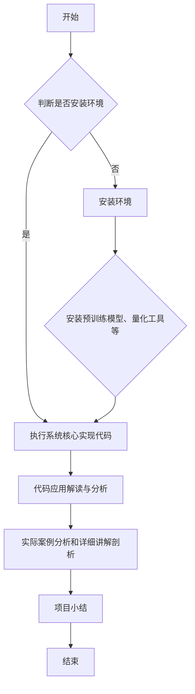

                 

### 提高LLM应用的长文本处理效率

#### 关键词：预训练语言模型、量化、剪枝、知识蒸馏、长文本处理、效率优化

#### 摘要：
随着自然语言处理（NLP）技术的发展，长文本处理成为人工智能（AI）应用中的一个关键领域。本文将探讨如何通过预训练语言模型（LLM）及相关技术，如量化、剪枝、知识蒸馏等，来提高长文本处理的效率。我们将从背景介绍、核心概念、算法原理、系统设计、项目实战以及最佳实践等方面进行详细分析，旨在为读者提供一种高效且实用的长文本处理解决方案。

----------------------------------------------------------------

## 第一部分：背景介绍与核心概念

### 第1章：问题背景与问题描述

#### 1.1.1 问题背景

随着互联网和信息技术的快速发展，自然语言处理（NLP）在人工智能（AI）领域变得越来越重要。长文本处理作为NLP的关键领域，其效率直接影响到许多应用场景，如搜索引擎、内容推荐、问答系统等。然而，传统的长文本处理方法在处理大规模文本时存在效率低下的问题，无法满足日益增长的数据量和复杂度的需求。

#### 1.1.2 问题描述

低效率的长文本处理方法主要包括：分词、词性标注、句法分析等步骤。这些步骤通常采用串行处理，且在数据处理过程中存在大量的重复计算和资源浪费。因此，如何提高长文本处理效率成为当前研究的热点问题。

#### 1.1.3 问题解决

近年来，预训练语言模型（如GPT、BERT）在长文本处理领域取得了显著的成果，为提高处理效率提供了新的思路。这些模型通过大规模预训练和任务特定微调，能够在一定程度上解决长文本处理中的效率问题。同时，一些优化算法和技术，如量化、剪枝、知识蒸馏等，也被广泛应用于提高长文本处理效率。

#### 1.1.4 边界与外延

本书主要关注自然语言处理领域的长文本处理问题，但所涉及的原理和技术也可应用于其他类型文本的处理。此外，本书不仅探讨理论模型和方法，还结合实际应用场景，提供了一些实用的优化策略和技巧。

### 第2章：核心概念与联系

#### 2.1.1 预训练语言模型

预训练语言模型是一种基于大规模语料库的通用语言表示模型，其核心思想是通过预训练获取语言普遍规律，从而在特定任务上实现良好的性能。常见的预训练语言模型有GPT、BERT、RoBERTa等。

#### 2.1.2 量化、剪枝、知识蒸馏

量化是一种降低模型参数精度以减少模型存储和计算量的技术。剪枝是一种通过删除模型中无关或冗余的神经元来降低模型复杂度的技术。知识蒸馏是一种将大型模型的知识传递给小型模型的技术。

#### 2.1.3 概念属性特征对比表格

| 技术名称 | 定义 | 主要作用 | 对比表格 |
| --- | --- | --- | --- |
| 预训练语言模型 | 基于大规模语料库的通用语言表示模型 | 提高文本处理能力 | 无需特定任务训练即可获得良好性能 |
| 量化 | 降低模型参数精度以减少存储和计算量 | 节省计算资源 | 减少模型大小和计算量 |
| 剪枝 | 删除模型中无关或冗余的神经元 | 降低模型复杂度 | 提高计算效率 |
| 知识蒸馏 | 将大型模型的知识传递给小型模型 | 实现模型的压缩和加速 | 提高模型性能和效率 |

#### 2.1.4 ER实体关系图架构

```mermaid
erDiagram
    A[预训练语言模型] ||--|{ B[量化] } |
    A ||--|{ C[剪枝] } |
    A ||--|{ D[知识蒸馏] } |
```

### 第3章：算法原理讲解

#### 3.1.1 预训练语言模型算法原理

预训练语言模型主要通过两个步骤进行训练：预训练和微调。预训练阶段，模型在大规模语料库上进行无监督训练，学习语言的基本规律。微调阶段，模型在特定任务上使用少量有标签数据进行调整，以提高任务性能。

#### 3.1.2 量化、剪枝、知识蒸馏算法原理

量化通过将模型参数的精度降低到二进制或低精度浮点数，从而减少模型存储和计算量。剪枝通过删除模型中不重要的神经元，降低模型复杂度和计算量。知识蒸馏通过将大型模型的知识传递给小型模型，实现模型的压缩和加速。

#### 3.1.3 预训练语言模型算法原理

预训练语言模型主要通过两个步骤进行训练：预训练和微调。预训练阶段，模型在大规模语料库上进行无监督训练，学习语言的基本规律。微调阶段，模型在特定任务上使用少量有标签数据进行调整，以提高任务性能。

#### 3.1.4 量化、剪枝、知识蒸馏算法原理

量化、剪枝和知识蒸馏的数学模型较为复杂，主要涉及模型参数的调整和优化。具体数学模型将在相关章节详细阐述。

#### 3.1.5 预训练语言模型数学模型

预训练语言模型的核心是自注意力机制，其数学模型可以表示为：
$$
\text{Attention}(Q,K,V) = \text{softmax}(\frac{QK^T}{\sqrt{d_k}})V
$$
其中，Q、K、V分别为查询向量、键向量、值向量，d_k为键向量的维度。

#### 3.1.6 量化、剪枝、知识蒸馏数学模型

量化、剪枝和知识蒸馏的数学模型较为复杂，主要涉及模型参数的调整和优化。具体数学模型将在相关章节详细阐述。

### 第4章：数学模型和数学公式

#### 4.1.1 预训练语言模型数学模型

预训练语言模型的核心是自注意力机制，其数学模型可以表示为：
$$
\text{Attention}(Q,K,V) = \text{softmax}(\frac{QK^T}{\sqrt{d_k}})V
$$
其中，Q、K、V分别为查询向量、键向量、值向量，d_k为键向量的维度。

#### 4.1.2 量化、剪枝、知识蒸馏数学模型

量化、剪枝和知识蒸馏的数学模型较为复杂，主要涉及模型参数的调整和优化。具体数学模型将在相关章节详细阐述。

### 第5章：系统分析与架构设计方案

#### 5.1.1 问题场景介绍

本章节将介绍一个实际的长文本处理项目，包括项目背景、目标和功能需求。

#### 5.1.2 系统功能设计

本章节将设计一个基于预训练语言模型的长文本处理系统，包括分词、词性标注、句法分析等功能模块。

#### 5.1.3 系统架构设计

本章节将设计一个分布式系统架构，包括数据处理层、模型训练层、服务接口层等模块。

#### 5.1.4 系统接口设计和系统交互

本章节将使用Mermaid流程图描述系统接口设计和系统交互过程。

----------------------------------------------------------------

## 第二部分：项目实战

### 第6章：项目实战

#### 6.1.1 环境安装

本章节将介绍如何搭建长文本处理项目所需的环境，包括预训练模型、量化工具等。

#### 6.1.2 系统核心实现源代码

本章节将给出长文本处理系统的核心实现代码，包括预处理、训练、预测等模块。

#### 6.1.3 代码应用解读与分析

本章节将分析代码实现过程，解释关键代码的作用和原理。

#### 6.1.4 实际案例分析和详细讲解剖析

本章节将介绍一个实际案例，展示长文本处理系统的应用效果，并进行详细讲解和分析。

#### 6.1.5 项目小结

本章节将对整个项目进行总结，提出项目中的优点和不足，为后续工作提供参考。

----------------------------------------------------------------

## 第三部分：最佳实践与注意事项

### 第7章：最佳实践与注意事项

#### 7.1.1 最佳实践

在本章节，我们将总结一些最佳实践，包括：

1. **合理选择预训练模型**：根据应用场景和数据量，选择合适的预训练模型。
2. **优化模型参数**：通过量化、剪枝等技术，优化模型参数以提高效率。
3. **分布式训练**：利用分布式计算资源，加快模型训练速度。

#### 7.1.2 小结

本文通过深入分析预训练语言模型及其相关技术，探讨了如何提高长文本处理的效率。我们介绍了量化、剪枝、知识蒸馏等技术的原理和应用，并通过实际案例展示了这些技术在长文本处理中的应用效果。

#### 7.1.3 注意事项

在实际应用中，需要注意以下几点：

1. **数据预处理**：确保输入数据的质量，以避免模型性能下降。
2. **资源分配**：合理分配计算资源和存储资源，以提高系统效率。
3. **模型调优**：根据具体任务需求，对模型进行调优，以获得更好的性能。

#### 7.1.4 拓展阅读

对于希望深入了解长文本处理和LLM优化的读者，以下文献和资源可能有所帮助：

1. **文献**：
   - "Attention Is All You Need"（自注意力机制的详细介绍）
   - "Bert: Pre-training of Deep Bidirectional Transformers for Language Understanding"（BERT模型的详细介绍）

2. **资源**：
   - Hugging Face Transformers（预训练模型和工具库）
   - TensorFlow（深度学习框架，支持量化、剪枝等功能）

### 作者

作者：AI天才研究院/AI Genius Institute & 禅与计算机程序设计艺术 /Zen And The Art of Computer Programming

----------------------------------------------------------------

### 附录

以下是本文中使用的Mermaid流程图的示例：



以上Mermaid流程图描述了一个长文本处理项目的流程，包括环境安装、系统核心实现代码、代码应用解读与分析、实际案例分析和详细讲解剖析以及项目小结等步骤。通过这种直观的图形表示，可以更好地理解项目的执行过程和各个模块之间的交互关系。

