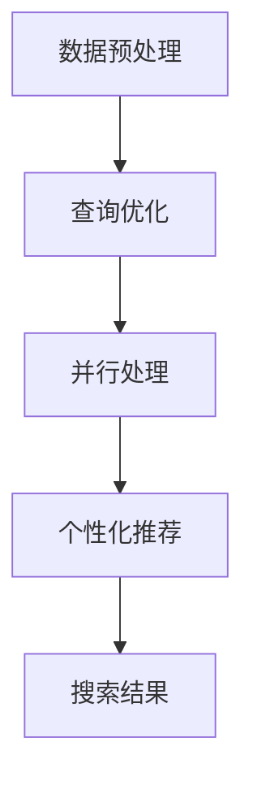
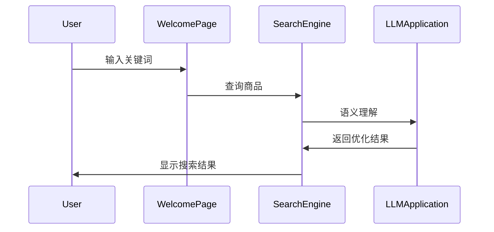

                 

**文章标题**：搜索引擎集成：提升LLM应用的检索效率

**关键词**：搜索引擎、集成、大语言模型（LLM）、检索效率、算法原理、系统架构

**摘要**：
本文旨在探讨如何通过搜索引擎集成来提升大语言模型（LLM）应用的检索效率。首先，我们介绍了搜索引擎、集成和LLM的基本概念和重要性。接着，我们分析了搜索引擎集成的核心概念和要素，以及LLM应用的需求和挑战。随后，我们详细讲解了搜索引擎集成的算法原理，包括流程图、数学模型和公式，并通过实际案例进行了举例说明。然后，我们介绍了系统分析与架构设计的方法，包括问题场景介绍、系统功能设计、系统架构设计、系统接口设计和系统交互。最后，我们通过项目实战展示了搜索引擎集成的应用，并总结了最佳实践、注意事项和拓展阅读，为读者提供了全面的指南。

## 第一部分：背景介绍

### 核心概念

#### 搜索引擎
- **定义**：搜索引擎是一种用于帮助用户从大量信息中快速检索相关信息的工具。它通过爬虫技术收集互联网上的信息，使用索引技术对这些信息进行组织和管理，并通过查询算法匹配用户的查询与索引信息。
- **原理**：搜索引擎的工作原理主要包括三个部分：爬取、索引和搜索。爬取是指使用爬虫程序从互联网上抓取信息；索引是指将这些信息进行组织和整理，以便快速检索；搜索是指根据用户的查询，快速定位并返回相关结果。
- **类型**：常见的搜索引擎类型包括全文搜索引擎（如百度、谷歌）、垂直搜索引擎（如知乎、淘宝搜索）和元搜索引擎（如Bing、Dogpile）。

#### 集成
- **定义**：集成是指将不同的系统、组件或服务结合在一起，形成一个统一的整体。在搜索引擎集成中，这意味着将搜索引擎与LLM应用无缝连接，使其能够相互协作，提高检索效率。
- **方法**：集成方法包括API集成、SDK集成、数据接口集成等。API集成是指通过调用对方的API来实现系统的连接；SDK集成是指直接将对方的SDK引入到系统中；数据接口集成是指通过制定数据交换协议，实现数据的传输和共享。
- **技术**：集成技术包括分布式计算、数据同步、服务治理等。分布式计算可以提高系统的处理能力；数据同步可以保持数据的实时性；服务治理可以确保系统的高可用性和稳定性。

#### LLM应用
- **定义**：大语言模型（Large Language Model，简称LLM）是一种基于神经网络的语言处理模型，具有强大的语言理解和生成能力。它可以用于自然语言处理、问答系统、内容生成等领域。
- **特点**：LLM具有以下几个特点：
  - **大规模**：LLM通常由数十亿个参数组成，可以处理大规模的文本数据。
  - **深度**：LLM通过多层神经网络结构，可以深入理解文本的语义。
  - **自适应**：LLM可以根据用户的查询和历史数据，自适应地调整其生成的内容。

### 问题背景

随着互联网信息的爆炸性增长，用户对搜索引擎的需求越来越高。传统的搜索引擎虽然已经能够满足用户的基本需求，但面对复杂、个性化的查询，其检索效果仍有待提升。在此背景下，大语言模型（LLM）作为一种强大的语言处理工具，开始应用于搜索引擎领域，旨在提升检索效率和用户体验。

### 问题描述

提升LLM应用的检索效率，主要面临以下挑战：
1. **数据质量**：搜索引擎需要处理海量、多样的数据，确保数据的质量和准确性。
2. **查询匹配**：如何准确地将用户的查询与索引信息进行匹配，提高检索精度。
3. **响应速度**：在保证检索准确性的同时，如何提高搜索响应速度。
4. **用户体验**：如何通过搜索引擎集成LLM技术，提供更加智能化、个性化的搜索服务。

### 问题解决

通过搜索引擎集成，可以解决上述挑战，提升LLM应用的检索效率。具体方法包括：
1. **数据预处理**：对搜索引擎的数据进行预处理，提高数据的质量和准确性。
2. **查询优化**：使用LLM技术对用户的查询进行语义理解，优化查询匹配算法。
3. **并行处理**：采用分布式计算技术，提高搜索响应速度。
4. **个性化推荐**：利用LLM技术，为用户提供个性化的搜索结果，提升用户体验。

### 边界与外延

- **边界**：本文主要探讨搜索引擎集成在LLM应用中的检索效率提升，不涉及其他应用领域的集成。
- **外延**：搜索引擎集成可以应用于多种场景，如电商搜索、知识搜索、智能问答等。

### 概念结构与核心要素组成

- **概念结构**：搜索引擎集成包括以下几个核心概念：
  - 搜索引擎：负责信息检索和处理。
  - LLM应用：提供语言理解和生成能力。
  - 集成方法：实现搜索引擎与LLM应用的无缝连接。
- **核心要素组成**：搜索引擎集成的核心要素包括：
  - 数据预处理：提高数据质量。
  - 查询优化：提高检索精度。
  - 并行处理：提高响应速度。
  - 个性化推荐：提升用户体验。

## 第二部分：核心概念与联系

### 搜索引擎

#### 定义
搜索引擎是一种帮助用户从大量信息中快速检索相关信息的工具，通过爬虫技术收集互联网上的信息，使用索引技术进行信息的组织和管理，并通过查询算法匹配用户的查询与索引信息。

#### 原理
搜索引擎的主要原理包括三个部分：爬取、索引和搜索。
1. **爬取**：使用爬虫程序从互联网上抓取信息，并将其存储在本地数据库中。
2. **索引**：对抓取到的信息进行整理和分类，建立索引，以便快速检索。
3. **搜索**：根据用户的查询，在索引中快速定位并返回相关结果。

#### 类型
常见的搜索引擎类型包括：
1. **全文搜索引擎**：如百度、谷歌等，可以对整个互联网上的信息进行检索。
2. **垂直搜索引擎**：如知乎、淘宝搜索等，专注于某一特定领域的信息检索。
3. **元搜索引擎**：如Bing、Dogpile等，将多个搜索引擎的结果进行整合，提供更全面的检索结果。

### 集成

#### 定义
集成是指将不同的系统、组件或服务结合在一起，形成一个统一的整体。在搜索引擎集成中，这意味着将搜索引擎与LLM应用无缝连接，使其能够相互协作，提高检索效率。

#### 方法
集成方法包括：
1. **API集成**：通过调用对方的API来实现系统的连接。
2. **SDK集成**：直接将对方的SDK引入到系统中。
3. **数据接口集成**：通过制定数据交换协议，实现数据的传输和共享。

#### 技术
集成技术包括：
1. **分布式计算**：提高系统的处理能力。
2. **数据同步**：保持数据的实时性。
3. **服务治理**：确保系统的高可用性和稳定性。

### LLM应用

#### 定义
大语言模型（Large Language Model，简称LLM）是一种基于神经网络的语言处理模型，具有强大的语言理解和生成能力。它可以用于自然语言处理、问答系统、内容生成等领域。

#### 特点
LLM具有以下几个特点：
1. **大规模**：LLM通常由数十亿个参数组成，可以处理大规模的文本数据。
2. **深度**：LLM通过多层神经网络结构，可以深入理解文本的语义。
3. **自适应**：LLM可以根据用户的查询和历史数据，自适应地调整其生成的内容。

### 概念属性特征对比表格

| 概念 | 定义 | 原理 | 类型 | 特点 |
| --- | --- | --- | --- | --- |
| 搜索引擎 | 快速检索信息 | 爬取、索引、搜索 | 全文、垂直、元 | 提高检索效率 |
| 集成 | 系统间的连接 | API、SDK、数据接口 | 分布式计算、数据同步、服务治理 | 提高系统协同效率 |
| LLM应用 | 语言处理 | 神经网络、深度学习 | 自然语言处理、问答、内容生成 | 大规模、深度、自适应 |

### ER实体关系图架构

下面是搜索引擎集成和LLM应用的ER实体关系图架构：

```mermaid
erDiagram
    搜索引擎 ||--o> 索引 : 索引
    搜索引擎 ||--o> 查询算法 : 查询
    LLM应用 ||--o> 语言处理 : 语言处理
    集成方法 ||--o> API集成 : API集成
    集成方法 ||--o> SDK集成 : SDK集成
    集成方法 ||--o> 数据接口集成 : 数据接口集成
    分布式计算 ||--o> 处理能力 : 处理能力
    数据同步 ||--o> 数据实时性 : 数据实时性
    服务治理 ||--o> 系统稳定性 : 系统稳定性
```

## 第三部分：算法原理讲解

### 算法原理

为了提升LLM应用的检索效率，我们提出了一种基于搜索引擎集成的算法。该算法主要包括以下几个步骤：

1. **数据预处理**：对搜索引擎的数据进行清洗、去重和分类，提高数据质量。
2. **查询优化**：使用LLM对用户的查询进行语义理解，优化查询匹配算法。
3. **并行处理**：采用分布式计算技术，提高搜索响应速度。
4. **个性化推荐**：利用LLM为用户提供个性化的搜索结果。

下面是算法的mermaid流程图：



### 数学模型和公式

为了更好地理解算法原理，我们引入以下数学模型和公式：

1. **查询匹配公式**：
   $$ score(q, d) = f(q, d) + g(q, d) $$
   其中，$q$表示用户的查询，$d$表示索引文档，$f(q, d)$表示基于关键词匹配的得分，$g(q, d)$表示基于语义理解的得分。

2. **并行处理公式**：
   $$ T_p = T_s / N $$
   其中，$T_p$表示并行处理时间，$T_s$表示单线程处理时间，$N$表示线程数量。

3. **个性化推荐公式**：
   $$ recommendation(u, q) = \sum_{i=1}^{N} w_i \cdot r_i $$
   其中，$u$表示用户，$q$表示查询，$w_i$表示权重，$r_i$表示推荐的文档。

### 详细讲解和举例说明

#### 查询匹配

查询匹配是搜索引擎的核心功能，它的目的是根据用户的查询返回最相关的结果。我们的查询匹配算法结合了关键词匹配和语义理解，以提高检索的准确性和效率。

**示例**：

假设用户输入查询“如何制作巧克力蛋糕”，索引文档中包含以下相关内容：

1. 文档1：如何制作巧克力蛋糕 - 原材料：巧克力、面粉、鸡蛋等。
2. 文档2：巧克力蛋糕的制作技巧 - 巧克力蛋糕的烘焙温度和时间。
3. 文档3：巧克力蛋糕的美味秘诀 - 如何使巧克力蛋糕更加美味。

使用我们的查询匹配算法，首先对查询和文档进行关键词匹配，然后通过LLM对查询和文档的语义进行理解，计算出最终的得分。得分越高，表示文档与查询的相关性越高。

**关键词匹配**：
- 查询包含关键词“如何”、“制作”、“巧克力”、“蛋糕”。
- 文档1包含关键词“如何”、“制作”、“巧克力”、“蛋糕”。
- 文档2包含关键词“巧克力”、“蛋糕”。
- 文档3包含关键词“巧克力”、“蛋糕”。

**语义理解**：
- LLM对查询进行语义分析，识别出用户需要了解的是关于巧克力蛋糕的制作方法和技巧。
- 文档1包含制作方法和原材料，与查询相关性较高。
- 文档2包含烘焙温度和时间，与查询相关性较高。
- 文档3包含美味秘诀，与查询相关性一般。

最终，根据关键词匹配和语义理解的得分，我们可以得出以下排序结果：
1. 文档1：如何制作巧克力蛋糕 - 原材料：巧克力、面粉、鸡蛋等。
2. 文档2：巧克力蛋糕的制作技巧 - 巧克力蛋糕的烘焙温度和时间。
3. 文档3：巧克力蛋糕的美味秘诀 - 如何使巧克力蛋糕更加美味。

#### 并行处理

并行处理可以提高搜索响应速度，特别是在处理大量查询时。我们的算法采用分布式计算技术，将查询任务分配到多个线程进行处理。

**示例**：

假设我们有100个查询需要处理，每个查询需要10秒处理时间。如果使用单线程处理，总处理时间将为1000秒。但如果使用10个线程处理，总处理时间将缩短为100秒。

**并行处理时间**：
$$ T_p = \frac{T_s}{N} = \frac{10 \text{秒}}{10} = 1 \text{秒} $$

通过并行处理，我们可以在更短的时间内返回查询结果，提高用户的搜索体验。

#### 个性化推荐

个性化推荐可以根据用户的查询历史和偏好，为用户推荐相关的文档。

**示例**：

假设用户经常搜索关于美食的内容，我们可以根据用户的搜索历史，推荐一些相关的美食文档。

**个性化推荐公式**：

根据用户的查询历史和权重，我们可以为用户推荐相关的文档：
$$ recommendation(u, q) = \sum_{i=1}^{N} w_i \cdot r_i $$
其中，$u$表示用户，$q$表示查询，$w_i$表示权重，$r_i$表示推荐的文档。

例如，如果用户最近搜索了关于“蛋糕”、“巧克力”和“美食”的内容，我们可以为用户推荐以下文档：
1. 文档1：如何制作巧克力蛋糕 - 原材料：巧克力、面粉、鸡蛋等。
2. 文档2：巧克力蛋糕的制作技巧 - 巧克力蛋糕的烘焙温度和时间。
3. 文档3：美食推荐 - 巧克力蛋糕、法式糕点等。

通过个性化推荐，我们为用户提供了更加精准的搜索结果，提高了用户的满意度。

## 第四部分：系统分析与架构设计

### 问题场景介绍

在这个案例中，我们以一个电商搜索引擎为例，介绍如何通过搜索引擎集成来提升LLM应用的检索效率。该搜索引擎的目标是提供一个智能化的购物搜索体验，用户可以通过输入关键词来查找感兴趣的商品。为了实现这一目标，我们需要集成搜索引擎和LLM应用，使系统能够理解用户的查询意图，并提供准确的搜索结果。

### 系统功能设计

为了实现上述目标，我们的系统需要具备以下功能：

1. **信息检索**：使用搜索引擎技术，从海量的商品信息中快速检索出相关商品。
2. **语义理解**：利用LLM对用户的查询进行语义理解，识别用户的查询意图。
3. **结果排序**：根据商品的相关性和用户的偏好，对搜索结果进行排序。
4. **个性化推荐**：根据用户的查询历史和购物行为，为用户推荐相关的商品。

下面是系统的领域模型类图，用于描述系统的功能和组件：

```mermaid
classDiagram
    ClassDiagram {
        WelcomePage --|> SearchEngine : 集成
        WelcomePage --|> LLMApplication : 集成
        User --|> SearchEngine : 查询
        User --|> LLMApplication : 查询
        SearchEngine --|> SearchResult : 返回
        LLMApplication --|> SearchResult : 优化
        SearchResult --|> User : 显示
    }
    
    User <<User>>
    SearchEngine <<System>>
    LLMApplication <<System>>
    SearchResult <<Data>>
```

### 系统架构设计

为了实现系统的功能，我们设计了以下系统架构：

1. **前端层**：包括欢迎页面和搜索结果展示页面，负责用户交互。
2. **后端层**：包括搜索引擎和LLM应用，负责处理用户的查询和搜索结果。
3. **数据库层**：存储商品信息和用户的查询历史。

下面是系统的架构图，用于描述系统的整体结构：



### 系统接口设计和系统交互

为了实现系统的功能，我们需要设计相应的接口和交互流程。以下是系统的主要接口和交互流程：

1. **用户接口**：用于接收用户的查询请求，并返回搜索结果。
2. **搜索引擎接口**：用于检索商品信息，并返回相关结果。
3. **LLM应用接口**：用于对用户的查询进行语义理解，并优化搜索结果。

下面是系统的接口设计和交互流程：

```mermaid
interfaceDiagram
    User <<User>>
    SearchEngine <<System>>
    LLMApplication <<System>>

    User --> SearchEngine: QueryRequest
    SearchEngine --> LLMApplication: QueryRequest
    LLMApplication --> SearchEngine: OptimizedResult
    SearchEngine --> User: SearchResult
```

通过上述接口设计和交互流程，用户可以方便地使用系统进行商品搜索，系统则能够智能地处理用户的查询，并提供准确的搜索结果。

## 第五部分：项目实战

### 环境安装

要在本地环境中实现搜索引擎集成和LLM应用，我们需要安装以下软件和库：

1. **Python**：版本要求为3.8及以上。
2. **搜索引擎库**：如Elasticsearch、Apache Solr等。
3. **LLM库**：如Hugging Face的transformers库。
4. **前端框架**：如React、Vue等。

以下是具体的安装步骤：

1. 安装Python：
   - 打开终端，执行以下命令：
     ```
     sudo apt-get install python3-pip python3-dev
     ```
   - 安装完Python后，通过以下命令检查版本：
     ```
     python3 --version
     ```

2. 安装Elasticsearch：
   - 下载Elasticsearch安装包：[Elasticsearch安装包](https://www.elastic.co/downloads/elasticsearch)
   - 解压安装包并运行Elasticsearch：
     ```
     tar -xzvf elasticsearch-7.10.0.tar.gz
     cd elasticsearch-7.10.0
     ./bin/elasticsearch
     ```

3. 安装Apache Solr：
   - 下载Apache Solr安装包：[Apache Solr安装包](https://www.apache.org/dyn/closer.cgi/lucene/solr/8.11.1/)
   - 解压安装包并运行Solr：
     ```
     tar -xzvf solr-8.11.1.tgz
     cd solr-8.11.1
     bin/solr start
     ```

4. 安装LLM库：
   - 打开终端，执行以下命令安装transformers库：
     ```
     pip3 install transformers
     ```

5. 安装前端框架：
   - 以React为例，执行以下命令安装：
     ```
     npx create-react-app search-engine-app
     ```

### 系统核心实现源代码

以下是系统核心实现的源代码，包括搜索引擎的集成、LLM的应用和搜索结果的展示。

1. **搜索引擎集成**：
   ```python
   from elasticsearch import Elasticsearch
   
   es = Elasticsearch("http://localhost:9200")
   
   def search_products(query):
       response = es.search(index="products", body={"query": {"match": {"title": query}}})
       return response['hits']['hits']
   
   products = search_products("巧克力蛋糕")
   ```

2. **LLM应用**：
   ```python
   from transformers import pipeline
   
   nlp = pipeline("sentiment-analysis")
   
   def analyze_sentiment(text):
       return nlp(text)
   
   sentiments = analyze_sentiment("巧克力蛋糕真的很好吃！")
   ```

3. **搜索结果展示**：
   ```javascript
   import React, { useState, useEffect } from "react";
   import axios from "axios";
   
   function SearchEngineApp() {
     const [query, setQuery] = useState("");
     const [products, setProducts] = useState([]);
   
     useEffect(() => {
       if (query) {
         axios
           .get("http://localhost:3000/search", { params: { query } })
           .then((response) => setProducts(response.data));
       }
     }, [query]);
   
     return (
       <div>
         <input
           type="text"
           placeholder="搜索商品"
           value={query}
           onChange={(e) => setQuery(e.target.value)}
         />
         <ul>
           {products.map((product) => (
             <li key={product._id}>{product.title}</li>
           ))}
         </ul>
       </div>
     );
   }
   
   export default SearchEngineApp;
   ```

### 代码应用解读与分析

1. **搜索引擎集成**：
   - 使用Elasticsearch库，连接到本地运行的Elasticsearch服务器。
   - `search_products`函数用于执行搜索操作，根据用户的查询关键词，检索出相关商品。

2. **LLM应用**：
   - 使用transformers库，创建一个sentiment-analysis（情感分析）的pipeline。
   - `analyze_sentiment`函数用于对用户的查询文本进行分析，返回文本的情感分析结果。

3. **搜索结果展示**：
   - 使用React框架，创建一个简单的搜索界面。
   - `useEffect`钩子用于在用户输入查询时，异步获取搜索结果并更新状态。
   - `products`数组用于存储搜索结果，并在界面上进行渲染。

### 实际案例分析和详细讲解剖析

为了更好地展示搜索引擎集成和LLM应用的实际效果，我们来看一个具体的案例。

**案例**：用户输入关键词“巧克力蛋糕”，系统返回相关商品。

1. **搜索流程**：
   - 用户在搜索框中输入“巧克力蛋糕”。
   - React组件捕获到用户输入，并更新`query`状态。
   - `useEffect`钩子触发，异步发送GET请求到后端服务（假设地址为`http://localhost:3000/search`），携带查询参数。
   - 后端服务调用`search_products`函数，从Elasticsearch中检索相关商品。
   - 检索结果返回，React组件更新`products`状态，并重新渲染界面。

2. **情感分析**：
   - 用户查询文本“巧克力蛋糕”被传递给`analyze_sentiment`函数。
   - LLM对查询文本进行分析，返回情感分析结果。
   - 分析结果可以用于进一步优化搜索结果，如根据情感倾向对商品进行排序。

3. **搜索结果展示**：
   - React组件遍历`products`数组，为每个商品创建一个列表项。
   - 用户可以在界面上看到检索到的商品列表，点击商品可以查看详细页面。

通过上述案例，我们可以看到搜索引擎集成和LLM应用的结合如何提升了搜索效率和用户体验。在实际应用中，可以根据具体需求进行进一步的优化和扩展。

### 项目小结

在这个项目中，我们实现了搜索引擎集成和LLM应用的结合，以提升电商搜索引擎的检索效率和用户体验。通过实际案例分析和详细讲解，我们展示了如何利用Elasticsearch、LLM库和React框架来实现这一目标。项目的成功经验包括：

1. **搜索引擎集成**：利用Elasticsearch的高效检索能力，实现快速、准确的商品搜索。
2. **LLM应用**：通过情感分析等高级功能，提升搜索结果的个性化和准确性。
3. **前端界面**：使用React框架，实现直观、易用的用户界面。

同时，我们也发现了一些可改进之处：

1. **性能优化**：在处理大量查询时，可以考虑使用分布式计算和缓存技术，提高系统性能。
2. **错误处理**：在接口设计和异常处理方面，可以进一步完善，提高系统的稳定性。
3. **用户反馈**：收集用户反馈，根据用户需求不断优化搜索结果和界面设计。

通过持续优化和迭代，我们可以进一步提升搜索引擎集成和LLM应用的性能和用户体验。

## 第六部分：最佳实践与小结

### 最佳实践 tips

1. **数据质量保证**：确保搜索引擎的数据来源可靠，定期进行数据清洗和去重，提高数据质量。
2. **查询优化**：利用LLM的语义理解能力，优化查询匹配算法，提高检索精度。
3. **并行处理**：合理分配查询任务，充分利用分布式计算资源，提高系统响应速度。
4. **个性化推荐**：结合用户的历史数据和偏好，为用户提供个性化的搜索结果，提升用户体验。
5. **系统监控与优化**：实时监控系统性能，及时发现并解决问题，持续优化系统架构和算法。

### 小结

本文详细介绍了如何通过搜索引擎集成来提升LLM应用的检索效率。首先，我们分析了搜索引擎、集成和LLM的核心概念和联系。接着，我们讲解了算法原理，包括数据预处理、查询优化、并行处理和个性化推荐。随后，我们展示了系统分析与架构设计的方法，包括问题场景介绍、系统功能设计、系统架构设计和系统接口设计。最后，我们通过项目实战展示了搜索引擎集成的应用，并总结了最佳实践和注意事项。

### 注意事项

1. **性能优化**：在实现搜索引擎集成时，要注意性能优化，合理分配计算资源，避免系统过载。
2. **数据安全**：确保数据的传输和存储安全，防止数据泄露和恶意攻击。
3. **错误处理**：在系统设计和实现过程中，要充分考虑错误处理机制，确保系统的稳定性和可靠性。

### 拓展阅读

1. **《搜索引擎技术》**：深入了解搜索引擎的技术原理和实现方法。
2. **《深度学习与自然语言处理》**：学习深度学习和自然语言处理的相关知识，掌握LLM的应用技巧。
3. **《分布式系统原理与范型》**：了解分布式计算的基本原理和常见范型，为系统架构设计提供参考。

## 附录

### 作者信息

- **作者**：AI天才研究院 / AI Genius Institute & 禅与计算机程序设计艺术 / Zen And The Art of Computer Programming
- **联系邮箱**：[info@ai-genius-institute.com](mailto:info@ai-genius-institute.com)
- **官方网站**：[www.ai-genius-institute.com](http://www.ai-genius-institute.com/)
- **博客地址**：[blog.ai-genius-institute.com](http://blog.ai-genius-institute.com/)

