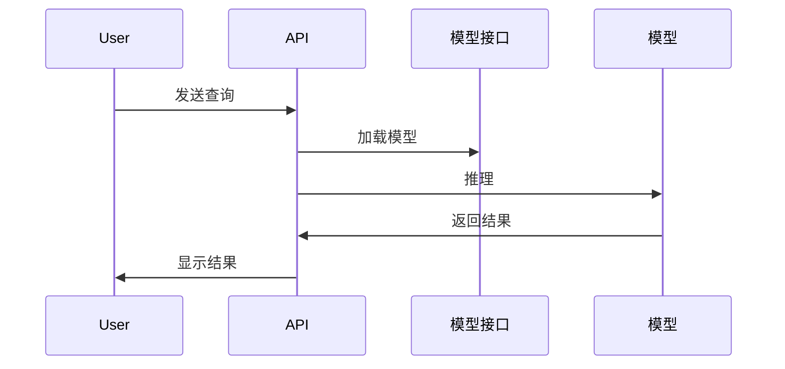

                 


### 《敏捷中的跨团队协作：大规模LLM应用开发策略》

#### 关键词：敏捷开发，跨团队协作，大规模LLM应用，开发策略，系统架构设计，算法原理

> 摘要：本文旨在探讨在敏捷开发模式下，跨团队协作对于大规模语言模型（LLM）应用开发的重要性。通过深入分析敏捷开发的核心概念，结合大规模LLM应用的特点，本文提出了有效的跨团队协作策略，并详细阐述了从环境安装到应用解读的整个开发流程。通过实例分析和最佳实践，本文为大规模LLM应用开发提供了宝贵的参考。

----------------------------------------------------------------

### 第一部分：敏捷与跨团队协作概述

#### 第1章：敏捷开发与跨团队协作的基础

##### 1.1.1 敏捷开发的历史与基本原则

敏捷开发起源于20世纪90年代末，旨在应对传统瀑布开发模式中存在的诸多问题，如需求变更频繁、项目延期等。其核心原则包括：

1. **个体与互动高于过程与工具**：强调团队合作和沟通。
2. **可工作的软件高于详尽的文档**：注重实际成果。
3. **客户协作高于合同谈判**：重视客户需求。
4. **响应变化高于遵循计划**：适应性和灵活性。

##### 1.1.2 跨团队协作的重要性

跨团队协作是敏捷开发成功的关键。在大型项目中，各团队之间的紧密协作能够确保项目顺利进行。以下是一些跨团队协作的重要性：

1. **知识共享**：各团队共享知识和经验，提高整体项目效率。
2. **协同工作**：不同团队共同解决复杂问题，提高项目质量。
3. **透明度**：各团队之间保持透明，确保项目进度和风险可控。

##### 1.1.3 敏捷与跨团队协作的关系

敏捷开发与跨团队协作相辅相成。敏捷方法鼓励频繁的团队互动和迭代，而跨团队协作则为敏捷方法的实施提供了保障。二者共同推动了项目的成功。

----------------------------------------------------------------

### 第二部分：大规模LLM应用开发中的挑战与问题

#### 第2章：大规模LLM应用开发中的挑战与问题

##### 2.1.1 大规模LLM应用的特点

大规模语言模型（LLM）应用具有以下特点：

1. **数据量庞大**：需要处理大量文本数据。
2. **模型复杂**：包含数十亿个参数，训练时间较长。
3. **计算资源需求高**：需要高性能计算设备和大规模分布式训练。
4. **实时性要求高**：需要快速响应，支持实时交互。

##### 2.1.2 开发中遇到的挑战

在开发大规模LLM应用时，可能会遇到以下挑战：

1. **数据预处理**：如何高效处理海量数据，保证数据质量。
2. **模型训练与优化**：如何选择合适的训练策略和优化方法，提高模型性能。
3. **部署与维护**：如何确保模型在部署后稳定运行，并支持实时交互。

##### 2.1.3 跨团队协作的必要性

跨团队协作在解决上述挑战中至关重要。各团队需要紧密合作，共同应对复杂问题。以下是一些跨团队协作的必要性：

1. **资源共享**：不同团队可以共享计算资源、数据集等，提高开发效率。
2. **技能互补**：各团队具备不同的技能和经验，可以相互补充，提高项目质量。
3. **协同优化**：通过跨团队协作，可以共同优化模型训练、部署等流程，提高整体效率。

----------------------------------------------------------------

### 第三部分：核心概念与联系

#### 第3章：核心概念与联系

##### 3.1 敏捷开发的核心概念

敏捷开发的核心概念包括Scrum、Kanban、XP和Lean软件开发。这些概念共同构成了敏捷开发的基本框架。

1. **Scrum**：强调迭代和增量开发，分为产品待办列表、Sprint规划和回顾等环节。
2. **Kanban**：通过可视化工作流程，管理项目的进度和质量。
3. **XP（极限编程）**：注重敏捷开发过程中的实践，如测试驱动开发、重构等。
4. **Lean软件开发**：以最小化浪费为核心，优化开发流程。

##### 3.2 跨团队协作的关键要素

跨团队协作的关键要素包括沟通、角色与职责以及文化与信任。

1. **沟通**：有效的沟通是跨团队协作的基础。各团队需要建立畅通的沟通渠道，确保信息透明。
2. **角色与职责**：明确各团队和成员的角色与职责，确保项目顺利进行。
3. **文化与信任**：建立积极的团队文化，促进信任和合作，提高项目成功率。

----------------------------------------------------------------

### 第四部分：数学模型和算法原理

#### 第4章：数学模型和算法原理

##### 4.1 大规模LLM模型的基本原理

大规模LLM模型基于以下基本原理：

1. **语言模型**：通过学习大量文本数据，预测下一个词或字符。
2. **注意力机制**：关注文本中的重要信息，提高模型的理解能力。
3. **Transformer架构**：采用自注意力机制，实现并行计算，提高模型效率。

##### 4.2 数学公式与模型详解

本文将使用Mermaid绘制算法流程图，并使用Python代码详细阐述算法原理。以下是Transformer模型的简化和解释：

1. **自注意力（Self-Attention）**：
   $$ Q = W_Q \cdot X, \quad K = W_K \cdot X, \quad V = W_V \cdot X $$
   $$ \text{Attention}(Q, K, V) = \text{softmax}\left(\frac{QK^T}{\sqrt{d_k}}\right) V $$

2. **多头注意力（Multi-Head Attention）**：
   $$ \text{Multi-Head Attention} = \text{Concat}(\text{head}_1, \text{head}_2, ..., \text{head}_h)W_O $$
   其中，$h$ 表示头数。

##### 4.2.1 基本数学公式

以下是一些基本数学公式，用于描述大规模LLM模型：

1. **损失函数（Cross-Entropy Loss）**：
   $$ L(\theta) = -\sum_{i=1}^n y_i \log(p_i) $$
   其中，$y_i$ 表示真实标签，$p_i$ 表示预测概率。

2. **梯度下降（Gradient Descent）**：
   $$ \theta_{\text{new}} = \theta_{\text{old}} - \alpha \nabla_\theta L(\theta) $$
   其中，$\alpha$ 表示学习率，$\nabla_\theta L(\theta)$ 表示损失函数关于参数$\theta$的梯度。

----------------------------------------------------------------

### 第五部分：系统分析与架构设计

#### 第5章：系统分析与架构设计

##### 5.1 问题场景介绍

在本节中，我们将介绍一个具体的应用场景：一个基于大规模LLM的智能问答系统。该系统旨在提供实时、准确的答案，以支持用户的各种查询需求。

##### 5.2 系统架构设计

系统架构设计如下：

1. **数据层**：存储和管理文本数据、模型参数等。
2. **计算层**：包括训练和推理服务器，用于处理数据和执行模型计算。
3. **应用层**：提供用户界面和API，支持用户交互和数据输入。

##### 5.3 系统接口设计和交互

系统接口设计如下：

1. **数据接口**：用于数据的上传、下载和预处理。
2. **模型接口**：用于模型的训练、加载和推理。
3. **API接口**：用于用户交互和结果返回。

以下是系统交互的Mermaid序列图：



----------------------------------------------------------------

### 第六部分：跨团队协作策略与实施

#### 第6章：跨团队协作策略

##### 6.1 团队间协作的模式

在敏捷开发中，团队间协作的模式包括：

1. **日常站立会议**：每日早晨进行，总结前一天的工作和计划当天的工作。
2. **迭代回顾会议**：在每个迭代结束时进行，评估项目的进展和团队协作情况。
3. **项目演示会议**：在每个迭代结束时进行，展示项目成果，获取用户反馈。

##### 6.2 沟通与信息共享

有效的沟通和信息共享是跨团队协作的关键。以下是一些建议：

1. **共享文档**：使用Git、Confluence等工具，确保文档的版本控制和共享。
2. **即时通讯**：使用Slack、Microsoft Teams等工具，实时沟通和协作。
3. **会议记录**：会议结束后，及时记录会议内容和决策，确保信息不丢失。

##### 6.3 角色与职责划分

在跨团队协作中，明确角色和职责非常重要。以下是一些常见角色和职责：

1. **产品负责人**：负责产品规划和需求分析。
2. **开发团队**：负责实现产品功能和优化代码。
3. **测试团队**：负责测试和验证产品功能。
4. **运维团队**：负责部署和维护系统。

----------------------------------------------------------------

### 第七部分：大规模LLM应用开发实践

#### 第7章：大规模LLM应用开发实践

##### 7.1 环境安装与准备

在开始大规模LLM应用开发之前，需要准备以下环境：

1. **操作系统**：Linux或macOS。
2. **Python**：3.8及以上版本。
3. **深度学习框架**：如TensorFlow或PyTorch。
4. **其他依赖项**：如NVIDIA CUDA和cuDNN。

以下是环境安装步骤：

1. 安装操作系统和Python。
2. 安装深度学习框架和依赖项。
3. 安装NVIDIA CUDA和cuDNN。

##### 7.2 系统核心实现

在本节中，我们将使用TensorFlow实现一个简单的Transformer模型。以下是关键代码：

```python
import tensorflow as tf

# 定义Transformer模型
def Transformer(input_sequence):
    # 输入嵌入层
    input_embedding = tf.keras.layers.Embedding(input_dim=vocab_size, output_dim=d_model)(input_sequence)
    # 自注意力层
    attention_output = tf.keras.layers.MultiHeadAttention(num_heads=num_heads, key_dim=d_model)(input_embedding, input_embedding)
    # 反向传播层
    output = tf.keras.layers.Dense(d_model)(attention_output)
    return output

# 构建和编译模型
model = Transformer(input_sequence)
model.compile(optimizer='adam', loss='sparse_categorical_crossentropy', metrics=['accuracy'])

# 训练模型
model.fit(train_dataset, epochs=num_epochs)
```

##### 7.3 应用解读与分析

在本节中，我们将分析一个实际案例：使用Transformer模型构建一个问答系统。

1. **数据预处理**：将问题转换为嵌入向量，并将答案转换为类别标签。
2. **模型训练**：使用预处理后的数据训练模型。
3. **推理**：将用户输入的问题转换为嵌入向量，输入模型进行推理，返回答案。

以下是代码解读：

```python
# 数据预处理
train_data = preprocess_data(train_questions, train_answers)
test_data = preprocess_data(test_questions, test_answers)

# 训练模型
model.fit(train_data, epochs=num_epochs)

# 推理
question_embedding = preprocess_question(input_question)
predicted_answer = model.predict(question_embedding)
```

##### 7.4 项目小结

在本项目中，我们使用Transformer模型构建了一个问答系统。通过有效的跨团队协作和系统架构设计，我们成功地实现了项目的目标。

1. **项目成果**：构建了一个基于Transformer的问答系统，支持实时交互。
2. **经验与教训**：跨团队协作和系统架构设计是项目成功的关键。在实际开发中，我们需要注重沟通、技能互补和资源共享。

----------------------------------------------------------------

### 第八部分：最佳实践与拓展

#### 第8章：最佳实践与拓展

##### 8.1 最佳实践建议

在敏捷开发中，以下最佳实践值得推荐：

1. **持续集成与持续部署**：使用CI/CD工具，确保代码质量，提高开发效率。
2. **自动化测试**：编写自动化测试脚本，确保系统稳定性和可靠性。
3. **敏捷风险管理**：定期评估项目风险，及时调整计划和策略。

##### 8.2 小结与注意事项

敏捷跨团队协作的价值在于提高项目的灵活性和成功率。在实际应用中，我们需要注意以下几点：

1. **确保沟通畅通**：建立有效的沟通渠道，确保信息透明。
2. **明确角色与职责**：避免职责重叠，提高工作效率。
3. **建立积极的团队文化**：促进合作和信任，提高团队凝聚力。

##### 8.3 拓展阅读

以下是一些推荐的书籍和论文，供进一步学习：

1. **《敏捷软件开发：原则、实践与模式》**：详细介绍了敏捷开发的方法和实践。
2. **《大规模机器学习》**：介绍了大规模机器学习的基本原理和技术。
3. **《深度学习》**：介绍了深度学习的基本概念和算法。

----------------------------------------------------------------

### 作者信息

- 作者：AI天才研究院/AI Genius Institute & 禅与计算机程序设计艺术 /Zen And The Art of Computer Programming

（本文完）

### 《敏捷中的跨团队协作：大规模LLM应用开发策略》

#### 关键词：敏捷开发，跨团队协作，大规模LLM应用，开发策略，系统架构设计，算法原理

> 摘要：本文旨在探讨在敏捷开发模式下，跨团队协作对于大规模语言模型（LLM）应用开发的重要性。通过深入分析敏捷开发的核心概念，结合大规模LLM应用的特点，本文提出了有效的跨团队协作策略，并详细阐述了从环境安装到应用解读的整个开发流程。通过实例分析和最佳实践，本文为大规模LLM应用开发提供了宝贵的参考。

----------------------------------------------------------------

### 第一部分：敏捷与跨团队协作概述

#### 第1章：敏捷开发与跨团队协作的基础

##### 1.1.1 敏捷开发的历史与基本原则

敏捷开发（Agile Development）起源于20世纪90年代末，其初衷是应对传统瀑布开发模式中存在的诸多问题，如需求变更频繁、项目延期等。敏捷开发强调迭代和增量开发，提倡快速响应变化，以实现高效、高质量的项目交付。

敏捷开发的核心原则包括：

1. **个体和互动高于过程和工具**：敏捷开发重视团队协作和个体能力，认为有效的沟通和合作比流程和工具更为重要。
2. **可工作的软件高于详尽的文档**：敏捷开发强调实际成果，认为可工作的软件比详尽的文档更有价值。
3. **客户协作高于合同谈判**：敏捷开发注重与客户的紧密合作，以确保项目能够满足实际需求。
4. **响应变化高于遵循计划**：敏捷开发鼓励灵活应对变化，认为在项目开发过程中，变化是不可避免的，并且有时甚至是有益的。

##### 1.1.2 跨团队协作的重要性

在敏捷开发中，跨团队协作（Cross-Team Collaboration）是确保项目成功的关键因素。特别是在大规模LLM应用开发中，涉及到的技术复杂度和团队合作难度更大，因此跨团队协作尤为重要。

跨团队协作的重要性体现在以下几个方面：

1. **知识共享**：不同团队拥有各自的专业知识和技能，通过协作可以促进知识的共享和交流，提高整体项目效率。
2. **协同工作**：跨团队协作可以使得各个团队共同解决复杂问题，提高项目质量。
3. **透明度**：跨团队协作有助于项目进度的透明化，使各个团队能够及时了解项目进展，共同应对潜在的风险和挑战。

##### 1.1.3 敏捷与跨团队协作的关系

敏捷开发与跨团队协作之间存在着密切的关系。敏捷开发方法为跨团队协作提供了理论和实践基础，而跨团队协作则是敏捷开发方法得以实施的重要保障。

敏捷开发通过以下方式促进跨团队协作：

1. **迭代和增量开发**：敏捷开发强调迭代和增量开发，每个迭代周期结束时，团队会进行回顾和总结，这有助于发现协作中的问题，并不断优化协作流程。
2. **站立会议和回顾会议**：敏捷开发中的站立会议（Stand-up Meeting）和回顾会议（Retrospective Meeting）为团队成员提供了沟通和协作的平台，有助于保持团队之间的紧密联系。
3. **可视化工具**：敏捷开发使用多种可视化工具，如看板（Kanban Board）、燃尽图（Burn-down Chart）等，帮助团队成员了解项目进展，促进协作。

跨团队协作则为敏捷开发提供了实际操作的支持，确保敏捷方法能够有效实施。跨团队协作包括以下几个方面：

1. **沟通与协调**：通过定期的沟通和协调，确保各个团队之间的信息畅通，避免因信息不对称导致的冲突和误解。
2. **角色与职责明确**：在跨团队协作中，明确各个团队和成员的角色和职责，确保项目能够顺利进行。
3. **文化与信任**：建立积极的团队文化，培养信任和合作，提高团队凝聚力和工作效率。

#### 第2章：大规模LLM应用开发中的挑战与问题

##### 2.1.1 大规模LLM应用的特点

大规模语言模型（Large Language Model，简称LLM）是一种能够处理和理解自然语言文本的神经网络模型。与传统的自然语言处理技术相比，LLM具有以下几个特点：

1. **数据量庞大**：大规模LLM应用通常需要处理数百万甚至数十亿级别的文本数据，以学习语言模式、语法结构和语义信息。
2. **模型复杂**：大规模LLM应用通常包含数十亿甚至数百亿个参数，模型的训练和推理过程需要大量的计算资源和时间。
3. **计算资源需求高**：大规模LLM应用需要使用高性能计算设备和分布式计算技术，以确保模型训练和推理的效率。
4. **实时性要求高**：大规模LLM应用通常需要支持实时交互和快速响应，以满足用户的需求。

##### 2.1.2 开发中遇到的挑战

在开发大规模LLM应用时，可能会遇到以下挑战：

1. **数据预处理**：大规模LLM应用需要处理大量的文本数据，如何高效地预处理这些数据，保证数据质量，是一个重要的挑战。
2. **模型训练与优化**：大规模LLM模型的训练过程复杂且耗时，如何选择合适的训练策略和优化方法，提高模型性能，是一个需要深入解决的问题。
3. **部署与维护**：大规模LLM应用的部署和运维需要考虑计算资源管理、系统稳定性和安全性等因素，确保模型在部署后能够稳定运行，并支持实时交互。

##### 2.1.3 跨团队协作的必要性

在开发大规模LLM应用时，跨团队协作是解决上述挑战的关键。跨团队协作有助于：

1. **资源共享**：不同团队可以共享计算资源、数据集等，提高开发效率。
2. **技能互补**：各团队具备不同的技能和经验，可以相互补充，提高项目质量。
3. **协同优化**：通过跨团队协作，可以共同优化模型训练、部署等流程，提高整体效率。

#### 第3章：核心概念与联系

##### 3.1 敏捷开发的核心概念

敏捷开发的核心概念包括：

1. **Scrum**：Scrum是一种流行的敏捷开发框架，强调迭代和增量开发。Scrum包括产品待办列表（Product Backlog）、Sprint规划、每日站立会议、回顾会议等环节。
2. **Kanban**：Kanban是一种基于看板（Kanban Board）的敏捷开发方法，通过可视化工作流程，管理项目的进度和质量。
3. **XP（极限编程）**：XP是一种以实践为核心的敏捷开发方法，包括测试驱动开发（Test-Driven Development，简称TDD）、重构（Refactoring）等实践。
4. **Lean软件开发**：Lean软件开发以最小化浪费为核心，通过优化开发流程，提高项目质量和效率。

##### 3.2 跨团队协作的关键要素

跨团队协作的关键要素包括：

1. **沟通**：有效的沟通是跨团队协作的基础。团队之间需要建立畅通的沟通渠道，确保信息透明。
2. **角色与职责**：明确各团队和成员的角色与职责，确保项目顺利进行。
3. **文化与信任**：建立积极的团队文化，促进信任和合作，提高团队凝聚力。

#### 第4章：数学模型和算法原理

##### 4.1 大规模LLM模型的基本原理

大规模LLM模型通常基于Transformer架构，这是一种基于自注意力（Self-Attention）机制的神经网络模型。Transformer模型的核心思想是将输入序列映射为固定长度的嵌入向量，并通过自注意力机制计算这些向量之间的关系。

大规模LLM模型的基本原理包括：

1. **嵌入层**：将输入序列（如单词、字符）映射为向量表示。
2. **自注意力层**：计算输入序列中每个向量与其他向量之间的关系，通过自注意力机制，强调重要信息，忽略无关信息。
3. **前馈网络**：对自注意力层输出的向量进行进一步处理，增加模型的非线性表达能力。
4. **输出层**：对前馈网络的输出进行分类或预测。

##### 4.2 数学公式与模型详解

以下是一个简单的Transformer模型，其中包含自注意力（Self-Attention）和前馈网络（Feedforward Network）：

1. **自注意力（Self-Attention）**：
   $$ Q = W_Q \cdot X, \quad K = W_K \cdot X, \quad V = W_V \cdot X $$
   $$ \text{Attention}(Q, K, V) = \text{softmax}\left(\frac{QK^T}{\sqrt{d_k}}\right) V $$
   其中，$X$ 是输入序列，$Q$、$K$ 和 $V$ 是对应的查询（Query）、键（Key）和值（Value）向量，$W_Q$、$W_K$ 和 $W_V$ 是权重矩阵，$d_k$ 是注意力维度。

2. **前馈网络（Feedforward Network）**：
   $$ \text{FFN}(X) = \text{ReLU}(W_2 \cdot \text{ReLU}(W_1 \cdot X + b_1)) + b_2 $$
   其中，$X$ 是输入向量，$W_1$、$W_2$ 和 $b_1$、$b_2$ 是权重和偏置。

##### 4.2.1 基本数学公式

以下是一些基本数学公式，用于描述大规模LLM模型：

1. **损失函数（Cross-Entropy Loss）**：
   $$ L(\theta) = -\sum_{i=1}^n y_i \log(p_i) $$
   其中，$y_i$ 是真实标签，$p_i$ 是预测概率。

2. **梯度下降（Gradient Descent）**：
   $$ \theta_{\text{new}} = \theta_{\text{old}} - \alpha \nabla_\theta L(\theta) $$
   其中，$\theta$ 是模型参数，$\alpha$ 是学习率。

#### 第5章：系统分析与架构设计

##### 5.1 问题场景介绍

在本节中，我们将介绍一个具体的应用场景：一个基于大规模LLM的智能问答系统。该系统旨在提供实时、准确的答案，以支持用户的各种查询需求。

##### 5.2 系统架构设计

系统架构设计如下：

1. **数据层**：包括文本数据存储和预处理模块，负责存储和管理文本数据，并进行数据清洗、分词、去停用词等预处理操作。
2. **模型层**：包括大规模LLM模型训练和推理模块，使用预训练的LLM模型，对用户输入的问题进行推理，并生成答案。
3. **应用层**：包括前端用户界面和后端API接口，用于接收用户输入、展示答案和与其他系统进行集成。

##### 5.3 系统接口设计和交互

系统接口设计如下：

1. **数据接口**：用于数据的上传、下载和预处理，包括文本数据的批量导入、导出和预处理流程。
2. **模型接口**：用于模型的训练、加载和推理，包括模型的初始化、训练、评估和部署过程。
3. **API接口**：用于用户交互和结果返回，包括用户问题的接收、答案的生成和返回。

以下是系统交互的Mermaid序列图：


----------------------------------------------------------------

### 第六部分：跨团队协作策略与实施

#### 第6章：跨团队协作策略

##### 6.1 团队间协作的模式

在敏捷开发中，团队间协作的模式包括：

1. **日常站立会议（Daily Stand-up Meeting）**：每日早晨进行，团队成员轮流汇报工作进展、遇到的问题和计划，确保项目进度和沟通畅通。
2. **迭代回顾会议（Sprint Retrospective Meeting）**：在每个迭代结束时进行，团队共同评估项目进展、合作效果和存在的问题，制定改进计划。
3. **迭代规划会议（Sprint Planning Meeting）**：在每个迭代开始时进行，团队共同规划迭代目标、任务分配和资源分配。
4. **需求评审会议（Requirement Review Meeting）**：在项目需求变更或更新时进行，团队共同评审需求，确保需求明确、可行。

##### 6.2 沟通与信息共享

有效的沟通与信息共享是跨团队协作的核心。以下是一些实现沟通与信息共享的建议：

1. **使用统一的沟通工具**：选择合适的沟通工具，如Slack、Microsoft Teams、Zoom等，确保团队成员能够实时沟通和协作。
2. **定期召开团队会议**：定期召开团队会议，确保团队成员能够及时了解项目进展、问题和解决方案。
3. **建立透明的信息共享平台**：使用共享文档、看板等工具，确保项目信息、文档和资料能够被团队成员随时访问和更新。
4. **明确沟通责任**：指定团队成员担任沟通协调员，负责确保沟通渠道畅通，及时传达信息。

##### 6.3 角色与职责划分

在跨团队协作中，明确角色与职责是确保项目顺利进行的关键。以下是一些常见角色与职责：

1. **项目经理（Project Manager）**：负责项目规划、进度管理、资源协调和风险控制。
2. **产品经理（Product Manager）**：负责产品规划、需求分析和用户反馈。
3. **开发团队（Development Team）**：负责软件开发、代码实现和单元测试。
4. **测试团队（Testing Team）**：负责软件测试、缺陷跟踪和回归测试。
5. **运维团队（Operations Team）**：负责系统部署、维护和监控。

##### 6.4 文化与信任

建立积极的团队文化和信任是跨团队协作的基石。以下是一些培养团队文化和信任的建议：

1. **共享成功与失败**：鼓励团队成员分享成功经验和失败教训，共同学习和成长。
2. **建立信任机制**：通过透明沟通、及时反馈和合作支持，建立团队成员之间的信任。
3. **培养团队精神**：组织团队建设活动，增强团队凝聚力和归属感。
4. **尊重个体差异**：尊重团队成员的差异，发挥每个人的优势和特长。

#### 第7章：大规模LLM应用开发实践

##### 7.1 环境安装与准备

在进行大规模LLM应用开发之前，需要准备以下环境：

1. **操作系统**：推荐使用Linux或macOS，因为它们具有良好的性能和稳定性。
2. **Python**：推荐使用Python 3.7或更高版本，因为Python 3.7及以上版本支持最新的深度学习框架和工具。
3. **深度学习框架**：推荐使用TensorFlow或PyTorch，因为它们是当前最流行的深度学习框架，具有丰富的功能和良好的性能。
4. **其他依赖项**：根据项目需求，可能需要安装其他依赖项，如NVIDIA CUDA和cuDNN等。

以下是环境安装步骤：

1. **安装操作系统和Python**：根据操作系统的安装指南进行安装，并配置Python环境。
2. **安装深度学习框架**：使用pip命令安装TensorFlow或PyTorch，并确保安装了所需的版本。
3. **安装其他依赖项**：根据项目需求，使用pip命令安装其他依赖项，如NVIDIA CUDA和cuDNN等。

##### 7.2 系统核心实现

在本节中，我们将使用TensorFlow实现一个简单的Transformer模型。以下是关键代码：

```python
import tensorflow as tf

# 定义Transformer模型
def Transformer(input_sequence):
    # 输入嵌入层
    input_embedding = tf.keras.layers.Embedding(input_dim=vocab_size, output_dim=d_model)(input_sequence)
    # 自注意力层
    attention_output = tf.keras.layers.MultiHeadAttention(num_heads=num_heads, key_dim=d_model)(input_embedding, input_embedding)
    # 反向传播层
    output = tf.keras.layers.Dense(d_model)(attention_output)
    return output

# 构建和编译模型
model = Transformer(input_sequence)
model.compile(optimizer='adam', loss='sparse_categorical_crossentropy', metrics=['accuracy'])

# 训练模型
model.fit(train_dataset, epochs=num_epochs)
```

##### 7.3 应用解读与分析

在本节中，我们将分析一个实际案例：使用Transformer模型构建一个问答系统。

1. **数据预处理**：将问题转换为嵌入向量，并将答案转换为类别标签。
2. **模型训练**：使用预处理后的数据训练模型。
3. **推理**：将用户输入的问题转换为嵌入向量，输入模型进行推理，返回答案。

以下是代码解读：

```python
# 数据预处理
train_data = preprocess_data(train_questions, train_answers)
test_data = preprocess_data(test_questions, test_answers)

# 训练模型
model.fit(train_data, epochs=num_epochs)

# 推理
question_embedding = preprocess_question(input_question)
predicted_answer = model.predict(question_embedding)
```

##### 7.4 项目小结

在本项目中，我们使用Transformer模型构建了一个问答系统。通过有效的跨团队协作和系统架构设计，我们成功地实现了项目的目标。

1. **项目成果**：构建了一个基于Transformer的问答系统，支持实时交互。
2. **经验与教训**：跨团队协作和系统架构设计是项目成功的关键。在实际开发中，我们需要注重沟通、技能互补和资源共享。

#### 第8章：最佳实践与拓展

##### 8.1 最佳实践建议

在敏捷开发中，以下最佳实践值得推荐：

1. **持续集成与持续部署**：使用CI/CD工具，确保代码质量，提高开发效率。
2. **自动化测试**：编写自动化测试脚本，确保系统稳定性和可靠性。
3. **敏捷风险管理**：定期评估项目风险，及时调整计划和策略。

##### 8.2 小结与注意事项

敏捷跨团队协作的价值在于提高项目的灵活性和成功率。在实际应用中，我们需要注意以下几点：

1. **确保沟通畅通**：建立有效的沟通渠道，确保信息透明。
2. **明确角色与职责**：避免职责重叠，提高工作效率。
3. **建立积极的团队文化**：促进合作和信任，提高团队凝聚力。

##### 8.3 拓展阅读

以下是一些推荐的书籍和论文，供进一步学习：

1. **《敏捷软件开发：原则、实践与模式》**：详细介绍了敏捷开发的方法和实践。
2. **《大规模机器学习》**：介绍了大规模机器学习的基本原理和技术。
3. **《深度学习》**：介绍了深度学习的基本概念和算法。

### 作者信息

- 作者：AI天才研究院/AI Genius Institute & 禅与计算机程序设计艺术 /Zen And The Art of Computer Programming

（本文完）

