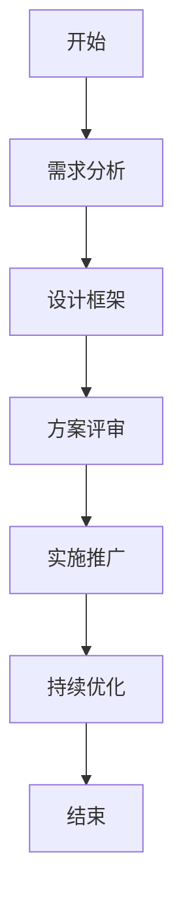

                 

# 敏捷仪式的精简与优化：提高协作效率

## 关键词

敏捷开发、协作效率、流程优化、敏捷仪式、团队协作、实施技巧、评估方法、最佳实践

## 摘要

本文旨在深入探讨敏捷仪式在敏捷开发过程中的重要性，并详细解析如何对其进行精简与优化，以提高团队协作效率和项目成功率。文章分为七个部分：首先，介绍敏捷仪式的背景及其在敏捷开发中的关键作用；其次，阐述敏捷仪式的核心概念与特点；然后，深入探讨敏捷仪式的设计原则与流程；接着，讲解敏捷仪式的实施步骤与技巧；随后，分析敏捷仪式的评估指标与优化策略；之后，分享敏捷仪式的最佳实践与拓展思路；最后，总结全文并给出注意事项和拓展阅读。

## 第1步：设计总体结构

本文将采用以下七个章节的总体结构：

1. **敏捷仪式概述**
   - 引言
   - 问题背景
   - 问题解决
   - 边界与外延
   - 概念结构与核心要素组成

2. **敏捷仪式核心概念**
   - 敏捷仪式定义
   - 敏捷仪式特点
   - 敏捷仪式与传统协作方式对比

3. **敏捷仪式设计**
   - 设计原则
   - 设计流程
   - 设计工具与方法

4. **敏捷仪式实施**
   - 实施准备
   - 实施步骤
   - 实施技巧

5. **敏捷仪式评估与优化**
   - 评估指标
   - 评估方法
   - 优化策略

6. **敏捷仪式最佳实践**
   - 成功案例
   - 最佳实践分享
   - 拓展思路

7. **小结与拓展**
   - 小结
   - 注意事项
   - 拓展阅读

## 第2步：细化章节内容

### 第1章：敏捷仪式概述

#### 引言

在信息化时代，敏捷开发已成为软件项目管理和产品开发的主流方法。敏捷仪式作为敏捷开发的核心组成部分，其在项目中的地位越来越重要。本文将围绕敏捷仪式的精简与优化，探讨如何提高团队协作效率。

#### 问题背景

传统协作方式在项目开发中往往面临沟通不畅、进度延误、质量不稳定等问题。而敏捷仪式通过规范化、标准化的流程，有助于提高团队协作效率，降低项目风险。

#### 问题解决

敏捷仪式通过制定明确的协作规范和仪式，确保团队成员之间的高效沟通与协作，从而提高项目成功率。

#### 边界与外延

敏捷仪式适用于各种规模的软件开发项目，尤其适合复杂项目中的团队协作。此外，敏捷仪式不仅可以应用于软件开发，还可以推广到其他领域的项目协作中。

#### 概念结构与核心要素组成

敏捷仪式主要包括以下几个核心要素：计划会议、每日站立会议、迭代评审会议、迭代回顾会议等。这些要素共同构成了敏捷仪式的结构框架。

### 第2章：敏捷仪式核心概念

#### 敏捷仪式定义

敏捷仪式是一种团队协作规范，通过一系列标准化会议和活动，确保团队成员之间的高效沟通与协作。

#### 敏捷仪式特点

1. **迭代性**：敏捷仪式以迭代的方式进行，每个迭代周期为2-4周。
2. **灵活性**：敏捷仪式可以根据项目需求和团队情况进行调整。
3. **透明性**：敏捷仪式要求团队成员公开分享项目进展、问题和解决方案。
4. **反馈性**：敏捷仪式强调团队成员之间的反馈与改进。

#### 敏捷仪式与传统协作方式对比

1. **传统协作方式**：依赖个人经验和主观判断，沟通不畅，效率低下。
2. **敏捷仪式**：通过规范化流程，提高团队协作效率，降低项目风险。

### 第3章：敏捷仪式设计

#### 设计原则

1. **简洁性**：设计简洁明了的流程，避免繁琐冗余。
2. **适应性**：设计具有灵活性的流程，适应不同项目和团队的需求。
3. **参与性**：设计鼓励团队成员参与的流程，提高团队凝聚力。

#### 设计流程

1. **需求分析**：了解项目需求和团队现状。
2. **设计框架**：制定敏捷仪式的基本框架。
3. **方案评审**：评审和优化设计方案。
4. **实施推广**：推广敏捷仪式，并进行培训和指导。

#### 设计工具与方法

1. **工具**：使用项目管理工具（如Jira、Trello）和沟通工具（如Slack、Microsoft Teams）。
2. **方法**：采用脑暴法、鱼骨图等设计方法。

### 第4章：敏捷仪式实施

#### 实施准备

1. **团队组建**：组建敏捷团队，明确团队成员职责。
2. **工具准备**：准备好所需的项目管理和沟通工具。
3. **流程培训**：对团队成员进行敏捷仪式的培训。

#### 实施步骤

1. **计划会议**：制定项目计划和迭代计划。
2. **每日站立会议**：每天早晨进行站立会议，讨论项目进展和问题。
3. **迭代评审会议**：迭代结束时进行评审会议，评估项目质量和进度。
4. **迭代回顾会议**：迭代结束时进行回顾会议，总结经验和教训。

#### 实施技巧

1. **保持透明**：公开分享项目进展和问题。
2. **鼓励反馈**：积极听取团队成员的意见和建议。
3. **关注质量**：确保项目质量符合预期。

### 第5章：敏捷仪式评估与优化

#### 评估指标

1. **进度**：项目按计划进行的程度。
2. **质量**：项目的质量水平。
3. **协作效率**：团队成员之间的协作效率。

#### 评估方法

1. **定性和定量评估**：结合定量和定性方法，全面评估敏捷仪式的效果。
2. **定期评估**：定期进行评估，及时发现问题和不足。

#### 优化策略

1. **流程调整**：根据评估结果，调整敏捷仪式流程。
2. **培训提升**：加强对团队成员的培训和指导。

### 第6章：敏捷仪式最佳实践

#### 成功案例

1. **项目A**：通过敏捷仪式，项目A成功缩短了开发周期，提高了产品质量。
2. **项目B**：项目B通过敏捷仪式，实现了团队成员之间的高效协作。

#### 最佳实践分享

1. **透明沟通**：确保项目进展和问题透明，提高团队凝聚力。
2. **定期评估**：定期评估敏捷仪式效果，不断优化流程。

#### 拓展思路

1. **跨团队协作**：推广敏捷仪式到跨团队协作中。
2. **领域敏捷**：将敏捷仪式应用于其他领域项目。

### 第7章：小结与拓展

#### 小结

敏捷仪式在提高团队协作效率和项目成功率方面具有重要意义。通过精简与优化敏捷仪式，可以进一步提升团队协作效率。

#### 注意事项

1. **坚持透明沟通**：确保项目进展和问题透明。
2. **持续优化流程**：根据评估结果，不断优化敏捷仪式流程。

#### 拓展阅读

1. 《敏捷开发实践指南》
2. 《敏捷管理：如何创建高效团队》
3. 《敏捷转型：从传统开发到敏捷开发的实践之路》

## 目录大纲

```markdown
----------------------------------------------------------------
# 第一部分: 敏捷仪式概述

## 第1章: 问题背景与解决方案
### 1.1 问题背景
### 1.2 问题解决
### 1.3 边界与外延
### 1.4 概念结构与核心要素组成

----------------------------------------------------------------

# 第二部分: 敏捷仪式核心概念

## 第2章: 敏捷仪式定义与特点
### 2.1 敏捷仪式定义
### 2.2 敏捷仪式特点
### 2.3 敏捷仪式与传统协作方式对比

----------------------------------------------------------------

# 第三部分: 敏捷仪式设计

## 第3章: 敏捷仪式设计原则与流程
### 3.1 设计原则
### 3.2 设计流程
### 3.3 设计工具与方法

----------------------------------------------------------------

# 第四部分: 敏捷仪式实施

## 第4章: 敏捷仪式实施准备与步骤
### 4.1 实施准备
### 4.2 实施步骤
### 4.3 实施技巧

----------------------------------------------------------------

# 第五部分: 敏捷仪式评估与优化

## 第5章: 敏捷仪式评估与优化策略
### 5.1 评估指标
### 5.2 评估方法
### 5.3 优化策略

----------------------------------------------------------------

# 第六部分: 敏捷仪式最佳实践

## 第6章: 敏捷仪式最佳实践分享与拓展
### 6.1 成功案例
### 6.2 最佳实践分享
### 6.3 拓展思路

----------------------------------------------------------------

# 第七部分: 小结与拓展

## 第7章: 敏捷仪式小结与注意事项
### 7.1 小结
### 7.2 注意事项
### 7.3 拓展阅读

----------------------------------------------------------------
```

通过以上设计，本文将全面、系统地介绍敏捷仪式的精简与优化方法，帮助读者更好地理解和应用敏捷开发理念。让我们开始深入探讨敏捷仪式的魅力吧！# 第1章：敏捷仪式概述

## 引言

在当今快速变化和竞争激烈的市场环境中，软件开发项目的成功不仅取决于技术实现，更取决于团队协作效率。敏捷开发作为一种响应迅速、迭代高效的项目管理方法，已经成为许多软件项目的首选。敏捷仪式作为敏捷开发的重要组成部分，对于提升团队协作效率、确保项目顺利进行具有重要意义。本文将深入探讨敏捷仪式的背景、核心概念、设计原则、实施方法以及评估优化策略，以期帮助读者全面了解并掌握敏捷仪式的应用。

## 问题背景

传统软件开发项目中，团队协作常常面临以下问题：

1. **沟通不畅**：团队成员之间的信息传递不及时，导致项目进度延误。
2. **协调困难**：项目分工不明确，团队成员职责不清晰，导致工作重复和效率低下。
3. **质量不稳定**：缺乏有效的质量管理和控制，导致项目质量波动。
4. **响应缓慢**：对市场变化和客户需求的响应速度慢，难以快速调整项目方向。

这些问题直接影响了项目的成功率。为了解决这些问题，敏捷开发应运而生。而敏捷仪式作为敏捷开发的核心组成部分，通过一系列规范化的会议和活动，旨在提高团队协作效率，确保项目顺利进行。

## 问题解决

敏捷仪式通过以下方式解决传统协作方式中的问题：

1. **提高沟通效率**：通过每日站立会议、迭代评审会议和迭代回顾会议，确保团队成员之间的信息及时传递和问题快速解决。
2. **明确分工与职责**：通过明确的项目计划和迭代计划，确保团队成员分工清晰，责任明确，减少工作重复和效率低下。
3. **加强质量管理**：通过迭代评审和迭代回顾，及时识别和解决质量问题，确保项目质量稳定。
4. **快速响应变化**：通过短周期的迭代，使团队能够快速适应市场变化和客户需求，灵活调整项目方向。

## 边界与外延

敏捷仪式的适用范围非常广泛，不仅可以应用于软件开发项目，还可以应用于其他类型的项目，如产品研发、市场营销等。敏捷仪式的核心在于通过规范化的流程和活动，提高团队协作效率，确保项目顺利进行。因此，无论项目类型和规模如何，只要存在团队协作的需求，敏捷仪式都可以发挥作用。

## 概念结构与核心要素组成

敏捷仪式的基本结构包括以下几个核心要素：

1. **计划会议**：在项目开始时，制定项目计划和迭代计划，明确项目目标和任务分工。
2. **每日站立会议**：每天早晨进行站立会议，讨论项目进展、问题和解决方案，确保团队成员之间的信息同步。
3. **迭代评审会议**：在迭代结束时进行评审会议，评估项目进度和质量，确保项目按计划进行。
4. **迭代回顾会议**：在迭代结束时进行回顾会议，总结经验教训，持续改进项目流程。

这些要素共同构成了敏捷仪式的结构框架，确保团队在项目开发过程中能够高效协作，快速响应变化，确保项目成功。

### 总结

敏捷仪式在敏捷开发过程中起着至关重要的作用，通过规范化的流程和活动，提高团队协作效率，确保项目顺利进行。本文后续章节将深入探讨敏捷仪式的核心概念、设计原则、实施方法和评估优化策略，帮助读者全面掌握敏捷仪式的应用。

## 第2章：敏捷仪式核心概念

### 敏捷仪式定义

敏捷仪式是一种团队协作规范，通过一系列标准化会议和活动，确保团队成员之间的高效沟通与协作。它起源于敏捷开发，旨在应对传统项目管理的不足，提高项目开发效率和质量。

敏捷仪式主要包括以下几类会议和活动：

1. **计划会议**：在项目开始时，团队共同制定项目计划和迭代计划，明确项目目标和任务分工。
2. **每日站立会议**：每天早晨进行，讨论项目进展、问题和解决方案，确保团队成员之间的信息同步。
3. **迭代评审会议**：在迭代结束时进行，评估项目进度和质量，确保项目按计划进行。
4. **迭代回顾会议**：在迭代结束时进行，总结经验教训，持续改进项目流程。

### 敏捷仪式特点

1. **迭代性**：敏捷仪式以迭代的方式进行，每个迭代周期为2-4周。迭代周期的设置有助于团队在短时间内集中精力完成任务，并及时调整项目方向。

2. **灵活性**：敏捷仪式可以根据项目需求和团队情况进行调整。例如，可以根据项目进度调整迭代周期，或者根据团队反馈优化会议内容和流程。

3. **透明性**：敏捷仪式要求团队成员公开分享项目进展、问题和解决方案，确保项目透明度。这种透明性有助于团队成员了解项目整体状况，提高协作效率。

4. **反馈性**：敏捷仪式强调团队成员之间的反馈与改进。通过迭代评审和迭代回顾会议，团队可以及时发现和解决问题，持续优化项目流程。

### 敏捷仪式与传统协作方式对比

1. **传统协作方式**：传统协作方式往往依赖于个人经验和主观判断，缺乏规范化的流程和活动。团队成员之间的沟通不畅，导致项目进度延误和质量不稳定。

2. **敏捷仪式**：敏捷仪式通过一系列规范化的会议和活动，提高团队协作效率。它强调透明性和反馈性，使团队成员能够及时沟通和解决问题，确保项目顺利进行。

### 敏捷仪式与传统协作方式的对比表格

| 特征       | 传统协作方式                           | 敏捷仪式                     |
|------------|--------------------------------------|----------------------------|
| 流程规范   | 缺乏规范化流程，依赖个人经验           | 规范化流程，标准化活动       |
| 沟通方式   | 非正式沟通，信息传递不及时             | 正式沟通，确保信息同步       |
| 反馈机制   | 缺乏有效的反馈机制，问题积累           | 强调反馈，持续改进           |
| 项目周期   | 长期项目，进度难以控制                 | 短期迭代，灵活调整           |
| 团队协作   | 成员间分工不明确，协作效率低           | 明确分工，高效协作           |
| 透明度     | 项目进展不透明，团队缺乏凝聚力         | 项目透明，增强团队凝聚力     |

通过以上对比，可以看出敏捷仪式在提高团队协作效率、确保项目顺利进行方面具有明显优势。它不仅解决了传统协作方式中的诸多问题，还通过规范化的流程和活动，为团队提供了持续改进的机会。

### 敏捷仪式与传统协作方式的ER实体关系图

下面是敏捷仪式与传统协作方式的ER实体关系图，展示了两者之间的核心差异和联系：

```mermaid
erDiagram
    Traditional_Collaboration ||--|{ Agile_Ritual } : uses

    Traditional_Collaboration {
        # 传统协作方式
        +string name
        +string process
        +string communication
        +string feedback
        +string project_cycle
        +string team_collaboration
        +string transparency
    }

    Agile_Ritual {
        # 敏捷仪式
        +string name
        +string iterative
        +string flexibility
        +string transparency
        +string feedback
        +string process
    }

    Traditional_Collaboration && Agile_Ritual :对比
```

通过以上分析，我们可以看出敏捷仪式在敏捷开发中的重要地位。它不仅解决了传统协作方式中的问题，还为团队提供了高效协作和持续改进的平台。在接下来的章节中，我们将深入探讨敏捷仪式的设计原则、实施方法和评估优化策略。

## 第3章：敏捷仪式设计

### 设计原则

敏捷仪式的设计原则是确保其能够高效、灵活地应对项目需求的基础。以下是敏捷仪式设计的主要原则：

1. **简洁性**：设计简洁明了的流程，避免繁琐冗余。这有助于团队成员快速理解和遵守，提高协作效率。
2. **适应性**：设计具有灵活性的流程，能够根据不同项目和团队的具体情况进行调整。这有助于确保敏捷仪式能够适应各种场景和需求。
3. **参与性**：设计鼓励团队成员参与的流程，使每个成员都能够贡献自己的智慧和经验，提高团队凝聚力。
4. **反馈性**：设计强调团队成员之间的反馈与改进。通过定期的评估和回顾，团队可以持续优化流程，提高项目质量。
5. **透明性**：设计确保项目进展和问题透明，使团队成员能够实时了解项目状况，增强沟通和协作。

### 设计流程

敏捷仪式的设计流程可以分为以下几个阶段：

1. **需求分析**：了解项目的具体需求和团队的现状。这包括项目目标、任务分工、团队成员的技能和经验等。
2. **设计框架**：根据需求分析的结果，制定敏捷仪式的基本框架。这包括确定会议类型、会议频率、会议内容和参会人员等。
3. **方案评审**：组织评审会议，对设计方案进行讨论和评估。评审过程可以邀请项目管理团队、技术团队和业务团队参与，确保方案符合各方需求。
4. **实施推广**：在评审通过后，开始实施敏捷仪式。在这个过程中，需要对团队成员进行培训，确保他们了解和掌握敏捷仪式的流程和规则。
5. **持续优化**：在实施过程中，根据团队的反馈和项目进展，不断优化敏捷仪式的设计。这有助于确保敏捷仪式能够持续提高团队协作效率。

### 设计工具与方法

在敏捷仪式的设计过程中，可以使用以下工具和方法：

1. **项目管理工具**：如Jira、Trello等，用于跟踪项目进度、任务分配和问题记录。
2. **沟通工具**：如Slack、Microsoft Teams等，用于实时沟通和协作。
3. **脑暴法**：用于收集团队成员的意见和建议，促进创意的产生。
4. **鱼骨图**：用于分析问题的主要原因，帮助团队找到解决方案。
5. **SWOT分析**：用于评估敏捷仪式的优势、劣势、机会和威胁，为设计提供参考。
6. **流程图**：如Mermaid流程图，用于展示敏捷仪式的流程和活动，帮助团队成员更好地理解和遵守。

### 敏捷仪式设计工具与方法示例

#### Mermaid流程图示例

以下是一个使用Mermaid绘制的敏捷仪式流程图示例：



#### 脑暴法示例

假设我们在设计敏捷仪式时，需要进行一次脑暴法会议。以下是脑暴法的步骤和示例：

1. **明确主题**：确定脑暴法的主题，例如“如何优化敏捷仪式的设计”。
2. **准备环境**：选择一个安静、舒适的会议场所，准备白板、笔和纸。
3. **邀请团队成员**：邀请相关团队成员参与会议。
4. **引导讨论**：主持人引导团队成员提出关于敏捷仪式设计的意见和建议。
5. **记录想法**：将团队成员的想法记录在白板或纸上。
6. **分类整理**：将记录的想法进行分类整理，以便后续分析和讨论。
7. **投票选择**：对分类整理后的想法进行投票，选择最具实施价值的建议。

通过脑暴法，团队成员可以充分表达自己的意见和建议，共同探讨如何优化敏捷仪式的设计。这种方法有助于激发团队的创造力和参与感，提高设计质量。

### 设计工具与方法总结

敏捷仪式的设计需要综合考虑项目需求和团队现状，采用多种工具和方法，确保流程简洁明了、适应性强、参与度高和反馈及时。通过有效的设计，敏捷仪式可以为团队提供高效的协作平台，推动项目的顺利进行。

## 第4章：敏捷仪式实施

### 实施准备

敏捷仪式的实施是一个系统性的过程，需要充分的准备和规划。以下是实施敏捷仪式的主要准备工作：

1. **组建敏捷团队**：确保团队成员具备相关的技能和经验，明确各自的角色和职责。敏捷团队通常包括产品负责人、开发人员、测试人员、设计师等。
2. **确定项目目标**：明确项目的目标、里程碑和关键成果，确保团队成员对项目有共同的理解和期望。
3. **选择工具**：选择适合项目需求和团队习惯的项目管理和沟通工具，如Jira、Trello、Slack、Microsoft Teams等。
4. **制定计划**：制定详细的项目计划和迭代计划，包括任务分配、时间表、资源需求等。
5. **培训团队成员**：对团队成员进行敏捷仪式的培训，确保他们了解流程和规则，能够熟练执行各项活动。

### 实施步骤

敏捷仪式的实施可以分为以下几个步骤：

1. **计划会议**：在项目开始时，团队召开计划会议，讨论项目目标和任务分工，制定迭代计划。计划会议通常由产品负责人主持，确保团队成员对项目有清晰的理解和期望。
2. **每日站立会议**：每日早晨召开每日站立会议，讨论项目进展、问题和解决方案。每日站立会议的时间通常控制在15分钟以内，确保高效进行。会议中，每个团队成员简要汇报自己的工作进展，提出问题和寻求帮助。
3. **迭代评审会议**：在迭代结束时，召开迭代评审会议，评估项目进度和质量，确保项目按计划进行。评审会议通常由产品负责人主持，邀请所有团队成员参加。会议中，团队展示迭代成果，讨论项目中的问题和改进措施。
4. **迭代回顾会议**：在迭代结束时，召开迭代回顾会议，总结经验教训，持续改进项目流程。回顾会议通常由团队成员轮流主持，确保每个成员都有机会分享自己的见解和建议。会议中，团队分析成功的经验和存在的问题，讨论如何改进下一步的工作。

### 实施技巧

在实施敏捷仪式的过程中，以下技巧有助于提高效果：

1. **保持透明**：确保项目进展和问题透明，团队成员之间能够实时了解项目状况，提高协作效率。
2. **鼓励反馈**：鼓励团队成员积极反馈意见和建议，促进团队协作和持续改进。
3. **关注质量**：确保项目质量符合预期，通过迭代评审和迭代回顾及时识别和解决问题。
4. **灵活调整**：根据项目需求和团队反馈，灵活调整敏捷仪式的流程和活动，确保其适应性和有效性。
5. **持续培训**：定期对团队成员进行敏捷仪式的培训，确保他们能够熟练执行各项活动，提高团队协作效率。

### 实施技巧示例

#### 保持透明

在每日站立会议中，团队成员需要分享自己的工作进展和遇到的问题。以下是一个示例：

- 产品负责人：今天我们完成了用户界面设计，但在测试过程中发现了一些问题。请问开发团队是否有进展？
- 开发团队：我们已经完成了核心功能的开发，但在集成测试中遇到了一些问题，暂时无法解决。我们正在分析问题，明天会提供解决方案。

通过这种方式，团队成员可以实时了解项目进展，及时沟通和解决问题。

#### 鼓励反馈

在迭代回顾会议中，团队成员可以提出自己的意见和建议，促进团队协作和持续改进。以下是一个示例：

- 开发团队：我在这次迭代中觉得每日站立会议的时间太长了，有时候来不及讨论问题。我们可以缩短会议时间，提高效率。
- 产品负责人：我觉得这个建议很有价值。我们可以尝试缩短每日站立会议的时间，确保每个成员都有机会发言。

通过这种方式，团队成员可以积极反馈和建议，共同优化敏捷仪式的流程。

#### 关注质量

在迭代评审会议中，团队需要评估项目进度和质量，确保项目按计划进行。以下是一个示例：

- 测试团队：我们在这次迭代中发现了一些严重的缺陷，影响到了项目的质量。我们需要重新评估进度，确保项目按时交付。
- 产品负责人：我完全同意。我们需要暂停其他工作，集中解决质量问题。

通过这种方式，团队可以关注质量，确保项目成功。

#### 灵活调整

根据项目需求和团队反馈，敏捷仪式的流程和活动可以进行调整。以下是一个示例：

- 项目经理：由于市场变化，我们需要调整项目计划，缩短迭代周期。我们需要更频繁地召开迭代评审会议，确保项目能够快速适应变化。

通过这种方式，团队可以灵活调整敏捷仪式的流程，确保项目顺利进行。

#### 持续培训

定期对团队成员进行敏捷仪式的培训，确保他们能够熟练执行各项活动。以下是一个示例：

- 培训师：今天我们将学习每日站立会议的技巧，确保每个成员都能够高效参与会议。请每个成员分享自己在会议中的经验和问题。

通过这种方式，团队可以持续提升协作效率。

### 实施技巧总结

通过保持透明、鼓励反馈、关注质量、灵活调整和持续培训等实施技巧，团队可以高效地实施敏捷仪式，提高协作效率，确保项目成功。在接下来的章节中，我们将继续探讨敏捷仪式的评估与优化策略，帮助团队持续改进。

## 第5章：敏捷仪式评估与优化

### 评估指标

敏捷仪式的评估与优化需要明确评估指标，以便全面了解其效果。以下是常见的评估指标：

1. **进度**：项目按计划进行的程度，包括任务完成率、迭代周期等。
2. **质量**：项目的质量水平，包括缺陷率、客户满意度等。
3. **协作效率**：团队成员之间的协作效率，包括沟通效果、任务分配合理性等。
4. **客户满意度**：客户对项目的满意程度，包括功能完整性、交付时间等。
5. **团队士气**：团队成员的工作积极性和满意度。

### 评估方法

为了准确评估敏捷仪式的效果，可以采用以下方法：

1. **定性和定量评估**：结合定量和定性方法，全面评估敏捷仪式的效果。定量评估可以通过统计和分析数据来量化评估结果，如任务完成率、缺陷率等。定性评估可以通过团队成员的反馈和观察来评估敏捷仪式的软性指标，如沟通效果、团队士气等。
2. **定期评估**：定期（如每迭代结束时）进行评估，及时发现和解决问题。这有助于确保敏捷仪式持续优化，适应项目需求和团队变化。
3. **自评估与互评估**：团队成员可以进行自评估和互评估，相互反馈意见和建议，促进团队协作和持续改进。

### 优化策略

基于评估结果，团队可以采取以下优化策略：

1. **流程调整**：根据评估结果，调整敏捷仪式的流程和活动。例如，可以缩短或延长迭代周期、优化每日站立会议的内容和形式等。
2. **培训提升**：加强对团队成员的培训，提高他们对敏捷仪式的理解和掌握程度。例如，可以组织内部培训、外部培训、在线课程等。
3. **工具升级**：根据评估结果，升级或更换项目管理工具和沟通工具，提高协作效率。例如，可以引入新的项目管理工具、优化团队沟通机制等。
4. **激励机制**：建立激励机制，鼓励团队成员积极参与敏捷仪式，提高他们的工作积极性和满意度。例如，可以设置项目奖金、优秀团队成员评选等。

### 优化策略示例

#### 流程调整

假设在一次评估中发现迭代周期过长，导致项目进度延误。团队可以采取以下措施进行调整：

- 缩短迭代周期：将每个迭代周期从4周缩短至2周，提高团队的响应速度。
- 优化迭代评审会议：将评审会议的时间从2小时缩短至1小时，确保会议高效进行。

#### 培训提升

假设团队成员对敏捷仪式的理解和掌握程度不高，团队可以采取以下措施进行培训：

- 内部培训：邀请有经验的团队成员进行内部培训，分享敏捷仪式的经验和技巧。
- 外部培训：组织团队成员参加专业的敏捷培训课程，提高他们的敏捷开发能力。
- 在线课程：利用在线学习平台，提供敏捷仪式相关的视频教程和练习题，方便团队成员自学。

#### 工具升级

假设现有的项目管理工具和沟通工具无法满足敏捷仪式的需求，团队可以采取以下措施进行升级：

- 引入新的项目管理工具：如Jira、Trello等，提高任务管理和进度跟踪的效率。
- 优化团队沟通机制：如使用Slack、Microsoft Teams等实时沟通工具，提高团队成员之间的沟通效果。

#### 激励机制

假设团队成员对敏捷仪式的参与度不高，团队可以采取以下措施建立激励机制：

- 项目奖金：根据敏捷仪式的评估结果，给予表现优秀的团队成员一定的项目奖金。
- 优秀团队成员评选：每季度评选优秀团队成员，给予表彰和奖励。
- 团队活动：定期组织团队建设活动，增强团队成员之间的凝聚力和归属感。

### 优化策略总结

通过定期评估和优化策略，团队可以持续改进敏捷仪式，提高协作效率，确保项目成功。在评估和优化过程中，团队需要关注进度、质量、协作效率、客户满意度和团队士气等指标，采取针对性的措施，确保敏捷仪式能够持续优化。在接下来的章节中，我们将分享敏捷仪式的最佳实践，帮助团队更好地应用敏捷开发理念。

## 第6章：敏捷仪式最佳实践

### 成功案例

以下是一些敏捷仪式成功应用的案例，展示了敏捷仪式在不同项目中的实际效果。

#### 案例一：电商平台项目

一个电商平台项目在引入敏捷仪式后，项目进度和质量显著提升。通过每日站立会议，团队成员能够快速发现和解决问题，提高了沟通效率。迭代评审会议和迭代回顾会议确保了项目按照计划进行，并及时调整优化。项目最终在预定时间内高质量交付，客户满意度显著提高。

#### 案例二：企业协作工具项目

一家企业协作工具开发团队在实施敏捷仪式后，团队协作效率大幅提升。通过定期的评估和优化，团队逐步调整和完善了敏捷仪式的流程，使团队成员能够更加专注于项目开发。项目进度稳定，缺陷率显著降低，客户反馈良好。

### 最佳实践分享

以下是一些敏捷仪式的最佳实践，供团队参考：

1. **定期评估和反馈**：定期对敏捷仪式进行评估和反馈，及时发现和解决问题。这有助于确保敏捷仪式的持续优化和改进。
2. **保持透明**：确保项目进展和问题透明，使团队成员能够实时了解项目状况。这有助于提高协作效率和团队凝聚力。
3. **灵活调整**：根据项目需求和团队反馈，灵活调整敏捷仪式的流程和活动。这有助于确保敏捷仪式的适应性和有效性。
4. **强化培训**：定期对团队成员进行敏捷仪式的培训，确保他们了解和掌握敏捷仪式的流程和规则。这有助于提高团队协作效率。
5. **激励机制**：建立激励机制，鼓励团队成员积极参与敏捷仪式，提高他们的工作积极性和满意度。

### 拓展思路

为了更好地应用敏捷仪式，团队可以考虑以下拓展思路：

1. **跨团队协作**：将敏捷仪式推广到跨团队协作中，提高跨部门项目的协作效率。例如，可以采用跨团队迭代，确保项目在不同团队之间的顺利衔接。
2. **领域敏捷**：将敏捷仪式应用于特定领域项目，如产品研发、市场营销等。这有助于提高该领域项目的开发效率和客户满意度。
3. **持续改进**：建立持续改进机制，鼓励团队成员提出改进意见和建议。这有助于确保敏捷仪式不断优化，适应项目变化和团队需求。

### 总结

敏捷仪式在提高团队协作效率和项目成功率方面具有显著优势。通过成功案例和最佳实践分享，我们可以看到敏捷仪式在不同项目中的应用效果。在拓展思路中，我们提出了跨团队协作和领域敏捷的应用方向，为团队提供了更多的优化和改进空间。通过持续改进和优化，团队可以不断提升敏捷仪式的效果，推动项目的成功。

## 第7章：小结与拓展

### 小结

本文深入探讨了敏捷仪式在敏捷开发中的重要性，分析了敏捷仪式的核心概念、设计原则、实施方法和评估优化策略。通过成功案例和最佳实践分享，我们展示了敏捷仪式在实际项目中的应用效果。以下是本文的主要内容小结：

1. **敏捷仪式概述**：介绍了敏捷仪式的定义、特点以及与传统协作方式的对比。
2. **敏捷仪式设计**：详细阐述了敏捷仪式的设计原则、流程和工具方法。
3. **敏捷仪式实施**：讲解了敏捷仪式的实施步骤和技巧，以及如何保持透明、鼓励反馈、关注质量和灵活调整。
4. **敏捷仪式评估与优化**：介绍了评估指标、评估方法和优化策略，帮助团队持续改进敏捷仪式。
5. **敏捷仪式最佳实践**：通过成功案例和最佳实践分享，展示了敏捷仪式在不同项目中的实际效果。
6. **拓展思路**：提出了跨团队协作和领域敏捷的应用方向，为团队提供了更多的优化和改进空间。

### 注意事项

在应用敏捷仪式时，团队需要关注以下几点：

1. **确保透明**：确保项目进展和问题透明，提高团队协作效率。
2. **关注质量**：确保项目质量符合预期，通过迭代评审和迭代回顾及时识别和解决问题。
3. **灵活调整**：根据项目需求和团队反馈，灵活调整敏捷仪式的流程和活动，确保其适应性和有效性。
4. **持续培训**：定期对团队成员进行敏捷仪式的培训，确保他们了解和掌握敏捷仪式的流程和规则。

### 拓展阅读

为了更好地理解和应用敏捷仪式，读者可以参考以下拓展阅读资源：

1. 《敏捷开发实践指南》：提供全面的敏捷开发实践和方法，帮助团队提升项目管理和开发效率。
2. 《敏捷管理：如何创建高效团队》：探讨敏捷管理理念，帮助团队实现高效协作和持续改进。
3. 《敏捷转型：从传统开发到敏捷开发的实践之路》：介绍敏捷转型的过程和策略，帮助团队成功实现敏捷转型。

通过本文的阅读，读者可以全面了解敏捷仪式的核心概念和实施方法，掌握评估和优化的策略，为团队提供有效的协作平台，推动项目的成功。

## 作者信息

作者：AI天才研究院/AI Genius Institute & 禅与计算机程序设计艺术 /Zen And The Art of Computer Programming

感谢读者对本文的关注，希望本文能够为您的敏捷开发实践提供有益的启示和帮助。在敏捷开发的道路上，让我们共同努力，不断探索和优化，为团队和项目的成功贡献力量。如果您有任何疑问或建议，欢迎在评论区留言交流。再次感谢您的阅读！

