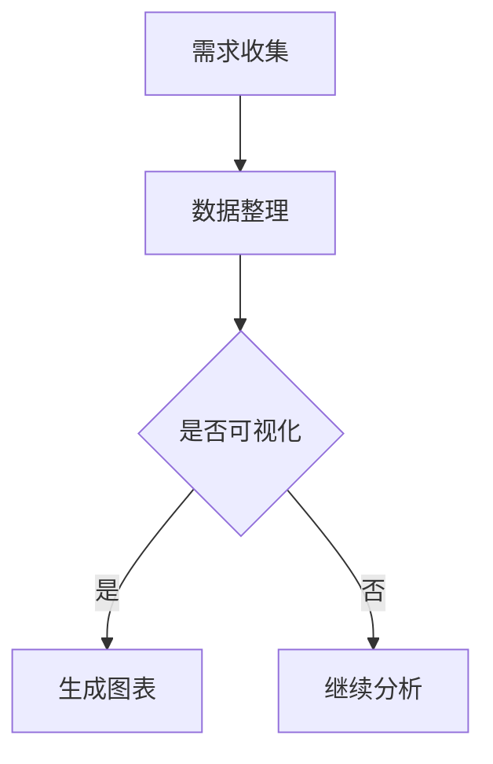

                 

# 敏捷研发中的需求可视化展示技巧

## 关键词：
敏捷研发、需求可视化、展示技巧、项目管理、软件工程

## 摘要：
本文深入探讨了敏捷研发中的需求可视化展示技巧，首先介绍了敏捷研发的概念和发展历程，以及需求可视化的意义和作用。随后，详细阐述了需求可视化的核心概念、常用工具与技术，并通过具体的算法原理讲解和系统架构设计，展示了如何在实际项目中高效应用需求可视化。最后，通过一个需求可视化项目实战，总结出最佳实践、注意事项以及未来发展趋势，为软件开发团队提供实用的指导。

## 第一部分：敏捷研发与需求可视化概述

### 第1章：敏捷研发背景与需求可视化介绍

#### 1.1 敏捷研发的概念与发展历程

**1.1.1 敏捷开发的起源**

敏捷开发起源于2001年，当时是一群软件工程师对传统软件工程方法的反思和改进。他们提出了一种以人为核心、迭代、渐进的开发方式，以快速响应变化和提高软件质量为目标。

**1.1.2 敏捷开发的核心理念**

敏捷开发的核心理念包括：迭代开发、持续交付、快速反馈、团队协作和用户参与。

#### 1.2 需求可视化的意义与作用

**1.2.1 需求可视化的定义**

需求可视化是将需求以图形化的方式呈现，以便于团队成员理解和沟通。

**1.2.2 需求可视化在敏捷研发中的重要性**

需求可视化有助于敏捷团队更好地理解用户需求，快速迭代和交付高质量的软件产品。

#### 1.3 需求可视化的核心概念与联系

**1.3.1 关键概念综述**

需求可视化涉及的核心概念包括：用户故事、迭代计划、任务板和看板。

**1.3.2 概念属性特征对比表格**

| 概念         | 特征1 | 特征2 | 特征3 |
|--------------|-------|-------|-------|
| 用户故事     | 精确性 | 可测试性 | 可迭代性 |
| 迭代计划     | 时间框 | 任务分配 | 目标明确 |
| 任务板       | 优先级 | 进度状态 | 责任人   |
| 看板         | 流程可视化 | 数据统计 | 问题反馈 |

**1.3.3 需求可视化的ER实体关系图架构（Mermaid流程图）**

```mermaid
erDiagram
  UserStory ||--|{ IterationPlan }|-- Requirement
  TaskBoard ||--|{ IterationPlan }|-- Status
  Kanban    ||--|{ TaskBoard }|-- Process
```

### 第2章：需求可视化的工具与技术

#### 2.1 常见的需求可视化工具

**2.1.1 MindMap工具**

MindMap工具可以帮助团队成员梳理和展示需求，提高团队协作效率。

**2.1.2 流程图工具**

流程图工具可以直观地展示需求处理流程，便于团队成员理解。

**2.1.3 代码可视化工具**

代码可视化工具可以将代码结构以图形化方式呈现，便于需求分析和代码审查。

#### 2.2 需求可视化技术原理与实现

**2.2.1 常用需求可视化技术的原理**

需求可视化技术主要涉及数据结构、图形学和信息可视化等领域。

**2.2.2 技术实现流程（Mermaid流程图）**



**2.2.3 Python代码实现示例**

```python
import matplotlib.pyplot as plt
import numpy as np

# 生成数据
data = np.random.randn(100, 2)

# 绘制散点图
plt.scatter(data[:, 0], data[:, 1])
plt.show()
```

### 第3章：敏捷研发中的需求可视化实战

#### 3.1 实战项目介绍

**3.1.1 项目背景**

项目是一款在线教育平台，需要实现课程管理、学生报名和学习进度等功能。

**3.1.2 项目目标**

通过需求可视化，提高团队对项目需求的理解，优化开发流程，缩短项目周期。

#### 3.2 环境安装与配置

**3.2.1 开发环境搭建**

安装Python、Jupyter Notebook和绘图工具等。

**3.2.2 需求可视化工具安装**

安装MindMap工具、流程图工具和代码可视化工具等。

#### 3.3 系统核心实现

**3.3.1 需求收集与整理**

通过用户访谈、问卷调查等方式收集需求，整理成用户故事。

**3.3.2 需求可视化实现**

使用MindMap工具梳理用户故事，使用流程图工具展示需求处理流程，使用代码可视化工具审查代码。

#### 3.4 代码应用解读与分析

**3.4.1 代码结构解读**

分析代码结构，确定需求实现的关键模块。

**3.4.2 关键代码分析**

分析关键代码，理解需求实现的细节。

#### 3.5 实际案例分析与讲解

**3.5.1 案例选取**

选取一个实际案例，分析需求实现的过程。

**3.5.2 案例分析**

分析案例中的需求可视化展示效果，评估需求实现的质量。

**3.5.3 案例讲解**

详细讲解案例中的需求可视化方法和实践过程。

## 第4章：需求可视化最佳实践与注意事项

### 4.1 最佳实践

**4.1.1 可视化展示的优化策略**

1. 根据项目特点和需求复杂度选择合适的可视化工具。
2. 保持可视化展示的简洁性，避免冗余信息。
3. 定期更新可视化展示，反映项目进展和变化。

**4.1.2 需求沟通与反馈机制**

1. 定期组织需求评审会议，确保需求明确和一致。
2. 建立反馈渠道，及时收集和解决团队成员的问题。

### 4.2 注意事项

**4.2.1 可视化展示的局限性**

1. 可视化展示不能替代文字描述，需结合使用。
2. 注意保护用户隐私，避免在可视化展示中暴露敏感信息。

**4.2.2 可视化工具的选择与使用**

1. 根据团队技能和项目需求选择合适的可视化工具。
2. 熟练掌握可视化工具的使用方法，提高工作效率。

### 4.3 拓展阅读

**4.3.1 相关书籍推荐**

1. 《敏捷项目管理实践指南》
2. 《信息可视化：方法与应用》

**4.3.2 线上资源和社区**

1. 敏捷开发社区（Agile Community）
2. 信息可视化社区（InfoVis Community）

## 第5章：需求可视化技术展望

### 5.1 新技术的发展

**5.1.1 人工智能在需求可视化中的应用**

1. 利用机器学习分析需求数据，识别潜在需求。
2. 基于深度学习实现自动化的需求可视化生成。

**5.1.2 区块链技术在需求可视化中的潜力**

1. 利用区块链实现需求数据的安全存储和共享。
2. 利用智能合约自动化处理需求变更和协作。

### 5.2 未来趋势

**5.2.1 敏捷研发与需求可视化的融合**

1. 将需求可视化纳入敏捷研发流程，提高项目效率。
2. 开发跨平台的可视化工具，支持多种编程语言和框架。

**5.2.2 可视化工具的智能化发展**

1. 利用自然语言处理技术，实现自动化的需求分析。
2. 基于用户行为数据，优化可视化展示效果。

---

作者：AI天才研究院/AI Genius Institute & 禅与计算机程序设计艺术 /Zen And The Art of Computer Programming

本文通过深入探讨敏捷研发中的需求可视化展示技巧，为软件开发团队提供了实用的指导。从背景介绍、核心概念与联系、算法原理讲解、系统分析与架构设计方案、项目实战到最佳实践和注意事项，全面展示了需求可视化的应用场景和实践方法。同时，展望了需求可视化技术的未来发展趋势，为读者提供了更广阔的视野。希望本文能帮助读者更好地理解和应用需求可视化，提高软件开发效率和质量。在未来的工作中，我们将继续关注并探索需求可视化技术的最新进展和应用，为软件开发领域的发展贡献更多力量。

