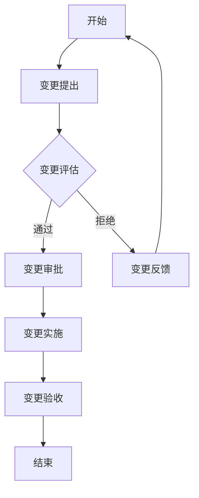
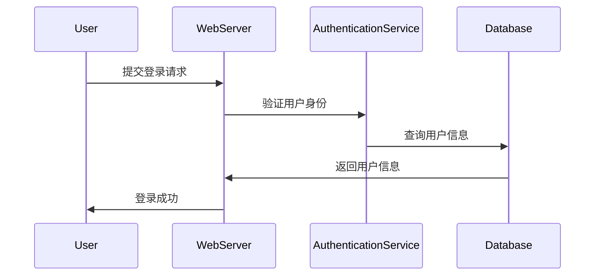
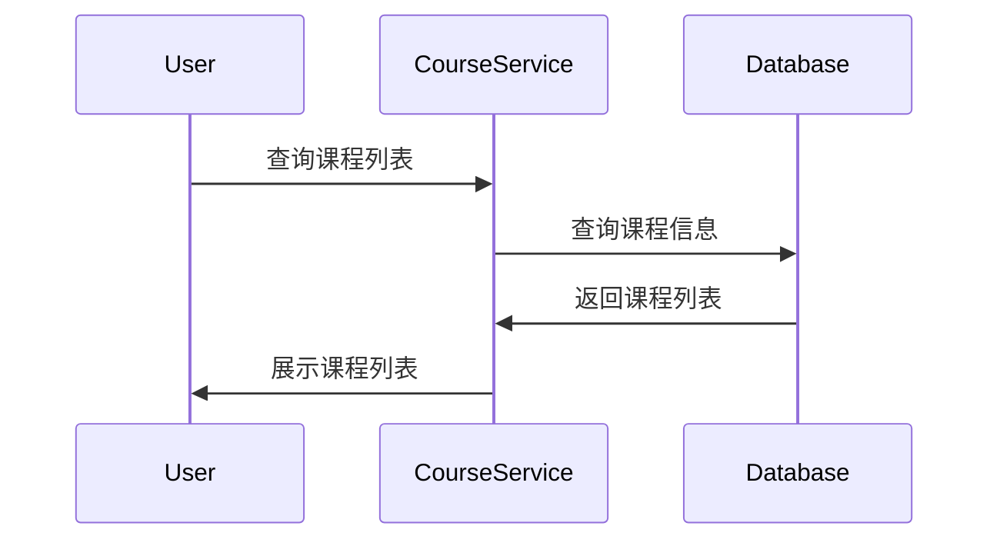
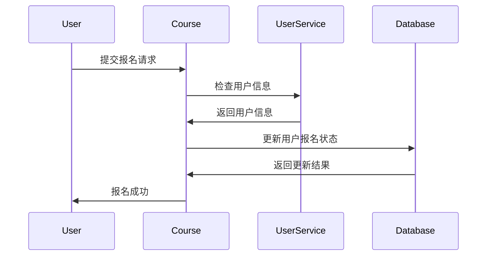

                 


# 敏捷研发模式下的需求变更控制策略

> 关键词：敏捷开发、需求变更、变更管理、用户故事地图、团队协作、风险管理

> 摘要：本文深入探讨了敏捷研发模式下需求变更控制的策略，包括变更管理流程的建立、需求管理工具的应用、团队协作与风险管理等多个方面。通过实际案例和分析，阐述了敏捷研发中需求变更控制的重要性和方法，为软件开发团队提供了一套完整的变更控制方案。

### 第一部分：背景介绍

#### 问题背景

在当今快速发展的信息化时代，软件开发项目面临着越来越复杂的需求变化和市场竞争压力。传统的软件开发模式往往注重需求的严格定义和固定性，但在实际开发过程中，需求变更不可避免，常常导致项目延期、成本超支和客户满意度下降。随着敏捷开发理念的兴起，敏捷研发模式逐渐成为软件开发的主流方法，它强调快速迭代、客户反馈和灵活性，以适应市场需求的变化。

#### 问题描述

敏捷研发模式下的需求变更控制成为一个关键问题。如何在保持敏捷开发优势的同时，有效地控制需求变更，确保项目质量和进度，是软件开发团队面临的重要挑战。需求变更可能源自客户需求的变化、市场趋势的演变、技术进步等多方面因素，如果处理不当，会导致项目失控、资源浪费和团队士气低落。

#### 问题解决

为了解决敏捷研发模式下的需求变更控制问题，需要一套科学合理的策略。首先，应当建立完善的变更管理流程，明确变更的评估、审批和实施步骤，确保所有变更都在可控范围内。其次，需要采用有效的需求管理工具和技术，如用户故事地图、迭代规划板等，帮助团队可视化需求变化，快速响应客户需求。此外，加强团队沟通与协作，提高成员对需求变更的敏感度和应变能力，也是关键因素。

#### 边界与外延

敏捷研发模式下的需求变更控制策略不仅适用于软件项目，也可以应用于其他类型的信息化建设项目。需求变更控制策略的边界包括变更的范围、频率和影响程度等，而其外延则涉及整个项目管理过程，包括计划、执行、监控和收尾等阶段。同时，需求变更控制策略还应当考虑到组织文化、团队协作和风险管理等因素。

#### 概念结构与核心要素组成

敏捷研发模式下的需求变更控制策略包括以下几个核心要素：

1. **变更管理流程**：建立规范化的变更申请、评估、审批和实施流程。
2. **需求管理工具**：采用用户故事地图、迭代规划板等工具，辅助团队管理和响应需求变更。
3. **团队协作**：加强团队成员之间的沟通与协作，提高对需求变更的敏感度和应变能力。
4. **风险管理**：评估变更对项目的影响，制定相应的风险应对措施。
5. **反馈与迭代**：通过持续的客户反馈和迭代，不断优化需求变更控制策略。

### 核心概念原理、概念属性特征对比表格

| 概念名称       | 定义                                                         | 关键特征                | 对比分析                                      |
|----------------|--------------------------------------------------------------|------------------------|-----------------------------------------------|
| 敏捷开发       | 一种以人为核心、迭代、灵活应对变化的软件开发方法。           | 适应性、迭代、合作     | 与传统瀑布模型相比，更注重灵活性，减少浪费。     |
| 需求变更       | 项目开发过程中，对已有需求进行修改、增加或删除的行为。       | 及时性、必要性、影响性 | 不同类型的变更对项目的影响程度不同。             |
| 变更管理流程   | 管理需求变更的规范化流程，包括变更的提出、评估、审批和实施。   | 规范化、可控性、透明性 | 确保变更不会对项目产生不利影响。                 |
| 用户故事地图   | 一种可视化工具，用于表示产品的需求、功能和服务。               | 可视化、协作、迭代     | 帮助团队理解需求，快速响应变更。                 |

### ER实体关系图架构

```mermaid
erDiagram
    项目 ||--|{ 需求 }|>
    需求 ||--|{ 变更 }|>
    变更 ||--|{ 审批流程 }|>
    项目 ||--|{ 变更管理流程 }|>
    变更管理流程 ||--|{ 团队成员 }|>
    团队成员 ||--|{ 用户故事地图 }|>

    项目 {项目ID，项目名称，项目经理}
    需求 {需求ID，需求名称，需求描述，优先级，状态}
    变更 {变更ID，变更描述，影响范围，状态}
    审批流程 {审批流程ID，审批节点，审批意见，审批状态}
    变更管理流程 {变更管理流程ID，流程描述，流程状态}
    团队成员 {团队成员ID，姓名，角色，状态}
    用户故事地图 {用户故事地图ID，用户故事，状态}
```

### 第二部分：核心概念与联系

#### 核心概念原理

在敏捷研发模式下，需求变更控制的核心概念包括敏捷开发、需求变更、变更管理流程、需求管理工具和团队协作等。

1. **敏捷开发**：敏捷开发是一种以人为核心、迭代、灵活应对变化的软件开发方法。它强调团队协作、客户价值和持续交付，通过短周期迭代、快速反馈和持续改进，实现项目目标。

2. **需求变更**：需求变更是指在项目开发过程中，对已有需求进行修改、增加或删除的行为。需求变更是软件开发中常见的现象，它可能源自客户需求的变化、市场趋势的演变、技术进步等多方面因素。

3. **变更管理流程**：变更管理流程是管理需求变更的规范化流程，包括变更的提出、评估、审批和实施。通过变更管理流程，可以确保所有变更都在可控范围内，避免项目失控、资源浪费和团队士气低落。

4. **需求管理工具**：需求管理工具是用于辅助团队管理和响应需求变更的工具，如用户故事地图、迭代规划板等。这些工具可以帮助团队可视化需求变化，快速响应客户需求，提高项目效率。

5. **团队协作**：团队协作是敏捷研发模式下需求变更控制的关键因素。通过加强团队成员之间的沟通与协作，提高对需求变更的敏感度和应变能力，可以更好地应对需求变更带来的挑战。

#### 概念属性特征对比表格

| 概念名称       | 定义                                                         | 关键特征                | 对比分析                                      |
|----------------|--------------------------------------------------------------|------------------------|-----------------------------------------------|
| 敏捷开发       | 一种以人为核心、迭代、灵活应对变化的软件开发方法。           | 适应性、迭代、合作     | 与传统瀑布模型相比，更注重灵活性，减少浪费。     |
| 需求变更       | 项目开发过程中，对已有需求进行修改、增加或删除的行为。       | 及时性、必要性、影响性 | 不同类型的变更对项目的影响程度不同。             |
| 变更管理流程   | 管理需求变更的规范化流程，包括变更的提出、评估、审批和实施。   | 规范化、可控性、透明性 | 确保变更不会对项目产生不利影响。                 |
| 用户故事地图   | 一种可视化工具，用于表示产品的需求、功能和服务。               | 可视化、协作、迭代     | 帮助团队理解需求，快速响应变更。                 |

#### ER实体关系图架构

```mermaid
erDiagram
    项目 ||--|{ 需求 }|>
    需求 ||--|{ 变更 }|>
    变更 ||--|{ 审批流程 }|>
    项目 ||--|{ 变更管理流程 }|>
    变更管理流程 ||--|{ 团队成员 }|>
    团队成员 ||--|{ 用户故事地图 }|>

    项目 {项目ID，项目名称，项目经理}
    需求 {需求ID，需求名称，需求描述，优先级，状态}
    变更 {变更ID，变更描述，影响范围，状态}
    审批流程 {审批流程ID，审批节点，审批意见，审批状态}
    变更管理流程 {变更管理流程ID，流程描述，流程状态}
    团队成员 {团队成员ID，姓名，角色，状态}
    用户故事地图 {用户故事地图ID，用户故事，状态}
```

### 第三部分：算法原理讲解

在敏捷研发模式下，需求变更控制策略的实现需要一套完整的算法原理作为支撑。以下是一个基于需求变更控制策略的算法原理讲解，包括算法的流程图、Python源代码实现、数学模型和公式，以及通俗易懂的举例说明。

#### 算法流程图



#### Python源代码实现

```python
# 定义变更控制类
class ChangeControl:
    def __init__(self):
        self.changes = []

    # 提出变更
    def propose_change(self, change):
        self.changes.append(change)

    # 变更评估
    def assess_change(self, change):
        # 评估变更的影响范围和必要性
        if self.is_essential(change) and self.is_affected(change):
            return "通过"
        else:
            return "拒绝"

    # 变更审批
    def approve_change(self, change):
        # 审批通过后，将变更纳入实施计划
        if change.status == "通过":
            self.implode_change(change)
            return "通过"
        else:
            return "拒绝"

    # 变更实施
    def implode_change(self, change):
        # 实施变更的具体操作
        print(f"实施变更：{change.description}")

    # 变更验收
    def accept_change(self, change):
        # 验收变更的具体操作
        print(f"验收变更：{change.description}")

    # 辅助方法：判断变更是否关键
    def is_essential(self, change):
        return change.essential

    # 辅助方法：判断变更影响范围
    def is_affected(self, change):
        return change.affected

# 定义变更类
class Change:
    def __init__(self, description, essential, affected):
        self.description = description
        self.essential = essential
        self.affected = affected
        self.status = "待评估"

# 测试代码
change_control = ChangeControl()
change1 = Change("新增功能A", True, True)
change2 = Change("修复BUGB", False, False)

change_control.propose_change(change1)
change_control.propose_change(change2)

for change in change_control.changes:
    print(f"评估变更：{change.description} - {change_control.assess_change(change)}")
    print(f"审批变更：{change.description} - {change_control.approve_change(change)}")

for change in change_control.changes:
    if change.status == "通过":
        change_control.implode_change(change)
        change_control.accept_change(change)
```

#### 数学模型和公式

在需求变更控制中，可以使用以下数学模型和公式来评估变更的影响：

$$
\text{影响度} = \frac{\text{变更所需资源}}{\text{项目总资源}} \times 100\%
$$

其中，变更所需资源是指实施变更所需的开发、测试、部署等资源，项目总资源是指项目初期规划的总资源。

#### 举例说明

假设一个软件开发项目计划需要100个开发资源，现提出一个新增功能的变更需求，预计需要30个开发资源。根据上述数学模型，可以计算出该变更的影响度为：

$$
\text{影响度} = \frac{30}{100} \times 100\% = 30\%
$$

这意味着该变更对项目的影响程度为30%，需要谨慎评估和审批。

### 第四部分：系统分析与架构设计方案

#### 问题场景介绍

在一个大型企业级项目中，软件开发团队面临着不断变化的市场需求和客户需求。为了快速响应这些需求变化，团队采用了敏捷研发模式。然而，随之而来的问题是，如何在保持敏捷开发优势的同时，有效地控制需求变更，确保项目质量和进度。

#### 项目介绍

该企业级项目是一个在线教育平台，旨在为用户提供丰富的在线学习资源和互动体验。项目采用敏捷开发模式，分为多个迭代周期进行开发。每个迭代周期包括需求分析、设计、开发、测试和验收等阶段。

#### 系统功能设计（领域模型Mermaid类图）

```mermaid
classDiagram
    User <<类>> {
        ID: Integer
        Name: String
        Password: String
    }

    Course <<类>> {
        ID: Integer
        Name: String
        Description: String
    }

    Lesson <<类>> {
        ID: Integer
        Name: String
        Description: String
        Course_ID: Integer
    }

    User <=.. Course :报名
    Course <=.. Lesson :包含
```

#### 系统架构设计（Mermaid架构图）



#### 系统接口设计（Mermaid序列图）



#### 系统交互（Mermaid序列图）



### 第五部分：项目实战

#### 环境安装

1. 安装Python 3.8及以上版本。
2. 安装Docker，以便运行容器化应用程序。
3. 安装PostgreSQL数据库，用于存储项目数据。

#### 系统核心实现源代码

以下是一个简单的课程报名系统实现，包括用户登录、课程查询和报名等功能。

```python
# 用户登录
def login(username, password):
    user = get_user_by_username(username)
    if user and user.password == password:
        return "登录成功"
    else:
        return "登录失败"

# 查询课程列表
def get_course_list():
    courses = get_all_courses()
    return courses

# 报名课程
def enroll_course(user_id, course_id):
    user = get_user_by_id(user_id)
    course = get_course_by_id(course_id)
    if user and course:
        enroll_user_in_course(user_id, course_id)
        return "报名成功"
    else:
        return "报名失败"
```

#### 代码应用解读与分析

1. **用户登录**：通过调用`login`函数，根据用户名和密码查询用户信息，并验证密码是否匹配。
2. **查询课程列表**：通过调用`get_course_list`函数，获取所有课程信息，并返回给用户。
3. **报名课程**：通过调用`enroll_course`函数，根据用户ID和课程ID更新用户报名状态。

#### 实际案例分析和详细讲解剖析

1. **用户登录案例**：用户输入正确的用户名和密码，系统返回“登录成功”。如果用户名或密码错误，系统返回“登录失败”。
2. **查询课程列表案例**：系统返回当前所有可用的课程列表。用户可以根据自己的需求选择课程进行报名。
3. **报名课程案例**：用户选择一门课程并提交报名请求，系统根据用户ID和课程ID更新用户报名状态，并返回“报名成功”。

#### 项目小结

通过以上实战案例，我们可以看到，需求变更控制策略在敏捷研发模式下的重要性。在实际项目中，通过合理的变更管理流程、需求管理工具和团队协作，可以有效地应对需求变更，确保项目质量和进度。同时，项目实战也为我们提供了一个简单的课程报名系统实现，为后续的优化和扩展奠定了基础。

### 最佳实践 tips

1. **建立变更管理流程**：制定规范的变更管理流程，包括变更的提出、评估、审批和实施，确保所有变更都在可控范围内。
2. **使用需求管理工具**：采用用户故事地图、迭代规划板等工具，帮助团队可视化需求变化，快速响应客户需求。
3. **加强团队协作**：加强团队成员之间的沟通与协作，提高对需求变更的敏感度和应变能力。
4. **定期评估变更影响**：定期评估变更对项目的影响，及时调整项目计划和资源分配。

### 小结

本文通过深入探讨敏捷研发模式下的需求变更控制策略，包括变更管理流程、需求管理工具、团队协作和风险管理等方面，阐述了如何在敏捷开发中有效地控制需求变更，确保项目质量和进度。同时，通过实际案例分析和项目实战，为软件开发团队提供了一套完整的变更控制方案。希望本文能对读者在敏捷研发中的需求变更控制提供有价值的参考和启示。

### 注意事项

1. **变更管理流程的严格执行**：确保所有需求变更都按照变更管理流程进行评估、审批和实施，避免项目失控。
2. **团队协作与沟通**：加强团队成员之间的沟通与协作，提高对需求变更的敏感度和应变能力，确保项目顺利进行。
3. **风险管理**：评估变更对项目的影响，制定相应的风险应对措施，降低变更带来的风险。

### 拓展阅读

1. 《敏捷开发实践指南》
2. 《需求工程：基础、实践和案例》
3. 《敏捷项目管理》
4. 《变更管理：实践与案例》

### 作者信息

作者：AI天才研究院/AI Genius Institute & 禅与计算机程序设计艺术 /Zen And The Art of Computer Programming

