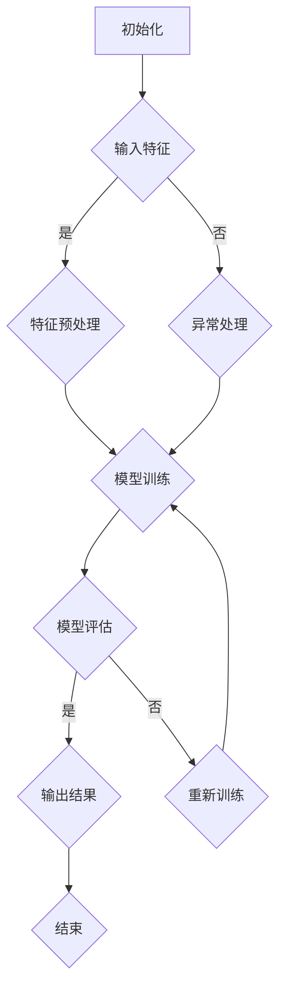

                 

### 文章标题

数学和逻辑问题解决能力评测：测试LLM的理性思维

### 关键词

- 数学问题解决能力
- 逻辑问题解决能力
- LLM（大型语言模型）
- 理性思维评测
- 自然语言处理

### 摘要

本文将探讨数学和逻辑问题解决能力在人工智能领域中的重要性，特别是大型语言模型（LLM）在这一领域的应用和挑战。文章将分为五个部分：背景与概念、数学问题解决能力评测、逻辑问题解决能力评测、综合评测和未来展望。通过逐步分析，本文旨在提供对LLM理性思维评测的深入理解，并探讨未来在这一领域的发展方向和挑战。

## 第一部分：背景与概念

### 1.1 问题背景

在当今信息爆炸的时代，数学和逻辑问题的解决能力不仅对学术研究至关重要，也对日常生活和工业应用具有深远影响。数学作为一种精确的语言，能够帮助我们描述自然现象和复杂系统，而逻辑则提供了推理和判断的工具。随着人工智能（AI）技术的飞速发展，特别是大型语言模型（LLM）的出现，人们开始探讨如何利用这些模型来评测和提升数学和逻辑问题解决能力。

#### 1.1.1 数学与逻辑问题解决能力的重要性

数学和逻辑问题解决能力的重要性体现在多个方面：

1. **学术研究**：数学是许多科学研究的基础，如物理学、工程学、经济学等。逻辑则用于构建和验证数学理论，确保结论的可靠性和一致性。
2. **日常生活**：在日常生活中，我们经常需要解决数学问题，如预算管理、时间规划、风险评估等。逻辑思维则帮助我们做出合理的决策和推理。
3. **工业应用**：在工业领域，数学和逻辑问题解决能力用于优化生产流程、提高效率、减少成本等。逻辑思维在自动化控制、网络安全等方面也具有重要意义。

#### 1.1.2 LLM在理性思维评测中的应用

大型语言模型（LLM），如GPT-3、BERT等，通过学习海量文本数据，具备强大的自然语言理解能力和生成能力。LLM在理性思维评测中的应用主要体现在以下几个方面：

1. **数学问题解决**：LLM可以处理数学问题，从简单的算术运算到复杂的代数方程和几何问题，甚至可以进行数学证明和推导。
2. **逻辑问题解决**：LLM能够理解逻辑表达式和逻辑推理规则，用于解决逻辑问题，如演绎推理、证明问题和逻辑悖论。
3. **辅助评测**：LLM可以用于设计数学和逻辑问题解决能力的评测工具，通过自动化评估和反馈，提高评测的效率和准确性。

#### 1.1.3 LLMS理性思维评测的现状与挑战

尽管LLM在理性思维评测中展示了巨大的潜力，但现有的研究仍面临一些挑战：

1. **准确性**：LLM在解决数学和逻辑问题时可能存在误差，特别是在处理复杂和模糊问题时。
2. **覆盖面**：现有的LLM模型可能无法涵盖所有类型的数学和逻辑问题，特别是在特定领域或新的数学问题出现时。
3. **评估方法**：如何有效地评估LLM的数学和逻辑问题解决能力仍是一个挑战，需要开发新的评测标准和评估工具。

### 1.2 核心概念

为了更好地理解LLM在数学和逻辑问题解决能力评测中的应用，我们需要明确以下几个核心概念：

#### 1.2.1 数学问题

数学问题是指需要利用数学知识和方法解决的问题，可以是基本的算术运算、代数方程、几何问题，也可以是更复杂的数学理论问题和应用问题。

#### 1.2.2 逻辑问题

逻辑问题是指需要运用逻辑推理规则和逻辑思维来解决的问题，包括命题逻辑、谓词逻辑、证明理论等。

#### 1.2.3 LLM与理性思维

LLM（大型语言模型）是一种基于深度学习技术构建的模型，通过学习海量文本数据，能够理解和生成自然语言。理性思维是指基于逻辑和数学原理进行思考和分析的能力。LLM在理性思维评测中的应用，旨在通过模拟人类的理性思维过程，评估模型在数学和逻辑问题解决中的表现。

## 第二部分：数学问题解决能力评测

### 2.1 数学问题解决能力评测的概念与分类

数学问题解决能力评测是指通过设计和实施评估方法，测量个体或模型在数学问题解决中的能力。这种评测不仅关注个体解决数学问题的准确性，还考虑解决问题的速度和策略。数学问题解决能力评测可以分为以下几个类型：

#### 2.1.1 测量标准

测量标准是评估数学问题解决能力的重要依据，常见的测量标准包括：

1. **准确性**：评估个体或模型在解决数学问题时所得结果的正确性。
2. **速度**：评估个体或模型解决数学问题所需的时间。
3. **策略**：评估个体或模型在解决数学问题时采用的策略和思考过程。

#### 2.1.2 评测类型

数学问题解决能力评测可以分为以下几种类型：

1. **基础算术评测**：评估个体或模型在基本算术运算（如加减乘除）方面的能力。
2. **代数问题评测**：评估个体或模型在解决代数方程、不等式和代数问题方面的能力。
3. **几何问题评测**：评估个体或模型在解决几何问题（如面积、周长、角度等）方面的能力。
4. **应用问题评测**：评估个体或模型在解决实际应用中的数学问题方面的能力，如经济问题、工程问题等。

#### 2.1.3 评测方法

数学问题解决能力评测的方法多种多样，以下是一些常见的方法：

1. **纸笔测试**：通过设计数学题目，让个体或模型在规定时间内完成，然后评估答案的正确性和解题过程。
2. **计算机辅助测试**：利用计算机程序设计数学问题解决能力评测系统，通过自动化评估个体或模型的答案和解题过程。
3. **行为观察法**：通过观察个体在解决数学问题时的行为和反应，评估其数学问题解决能力。
4. **模拟测试**：通过构建模拟环境，让个体或模型在模拟环境中解决数学问题，评估其解决问题的能力和策略。

### 2.2 LLMS评测数学问题解决能力

#### 2.2.1 LLM在数学问题解决中的表现

大型语言模型（LLM）在数学问题解决中表现出色，主要体现在以下几个方面：

1. **算术运算能力**：LLM能够处理基本的算术运算，如加减乘除，并能解决一些复杂的算术问题。
2. **代数问题解决能力**：LLM能够解决代数方程、不等式和代数问题，如求解二次方程、解不等式等。
3. **几何问题解决能力**：LLM能够处理几何问题，如计算面积、周长、角度等。
4. **应用问题解决能力**：LLM能够在一些实际应用中解决数学问题，如经济问题、工程问题等。

#### 2.2.2 评测LLM数学问题解决能力的挑战

尽管LLM在数学问题解决中表现出色，但在评测其数学问题解决能力时仍面临一些挑战：

1. **准确性**：LLM在解决数学问题时可能存在误差，特别是在处理复杂或模糊问题时。
2. **覆盖面**：现有的LLM模型可能无法涵盖所有类型的数学问题，特别是在特定领域或新的数学问题出现时。
3. **评估方法**：如何有效地评估LLM的数学问题解决能力仍是一个挑战，需要开发新的评估方法和工具。

### 2.3 数学问题解决能力评测中的误区与对策

在数学问题解决能力评测中，常见的误区和对策如下：

#### 2.3.1 常见问题

1. **忽视问题背景**：在评测数学问题时，忽视问题的实际背景和应用，可能导致解题思路的偏离。
2. **过度依赖计算能力**：过于依赖计算器的计算能力，忽视对数学问题解决策略和思维过程的评估。
3. **忽略逻辑推理**：在解决数学问题时，忽略逻辑推理和判断，可能导致错误的解题结果。

#### 2.3.2 解决对策

1. **加强问题背景教育**：在评测数学问题时，注重问题背景和应用，培养个体或模型解决实际问题的能力。
2. **平衡计算能力和思维过程**：在评测中，既要评估计算能力，也要关注思维过程和策略，确保全面评估数学问题解决能力。
3. **逻辑推理训练**：通过逻辑推理训练，提高个体或模型在解决数学问题时的逻辑判断和推理能力。

## 第三部分：逻辑问题解决能力评测

### 3.1 逻辑问题解决能力评测的概念与分类

逻辑问题解决能力评测是指通过设计和实施评估方法，测量个体或模型在逻辑问题解决中的能力。逻辑问题解决能力评测可以分为以下几个类型：

#### 3.1.1 测量标准

测量标准是评估逻辑问题解决能力的重要依据，常见的测量标准包括：

1. **准确性**：评估个体或模型在解决逻辑问题时所得结果的正确性。
2. **速度**：评估个体或模型解决逻辑问题所需的时间。
3. **策略**：评估个体或模型在解决逻辑问题时采用的策略和思考过程。

#### 3.1.2 评测类型

逻辑问题解决能力评测可以分为以下几种类型：

1. **命题逻辑评测**：评估个体或模型在解决命题逻辑问题方面的能力，如命题推理、命题验证等。
2. **谓词逻辑评测**：评估个体或模型在解决谓词逻辑问题方面的能力，如谓词推理、谓词验证等。
3. **证明问题评测**：评估个体或模型在解决证明问题方面的能力，如证明有效性、证明策略等。
4. **逻辑悖论评测**：评估个体或模型在解决逻辑悖论问题方面的能力，如解决逻辑悖论、解释悖论等。

#### 3.1.3 评测方法

逻辑问题解决能力评测的方法多种多样，以下是一些常见的方法：

1. **纸笔测试**：通过设计逻辑题目，让个体或模型在规定时间内完成，然后评估答案的正确性和解题过程。
2. **计算机辅助测试**：利用计算机程序设计逻辑问题解决能力评测系统，通过自动化评估个体或模型的答案和解题过程。
3. **行为观察法**：通过观察个体在解决逻辑问题时的行为和反应，评估其逻辑问题解决能力。
4. **模拟测试**：通过构建模拟环境，让个体或模型在模拟环境中解决逻辑问题，评估其解决问题的能力和策略。

### 3.2 LLMS评测逻辑问题解决能力

#### 3.2.1 LLM在逻辑问题解决中的表现

大型语言模型（LLM）在逻辑问题解决中表现出色，主要体现在以下几个方面：

1. **命题逻辑解决能力**：LLM能够处理命题逻辑问题，如命题推理、命题验证等。
2. **谓词逻辑解决能力**：LLM能够处理谓词逻辑问题，如谓词推理、谓词验证等。
3. **证明问题解决能力**：LLM能够在一定范围内解决证明问题，如证明有效性、证明策略等。
4. **逻辑悖论解决能力**：LLM能够尝试解决逻辑悖论问题，如解决悖论、解释悖论等。

#### 3.2.2 评测LLM逻辑问题解决能力的挑战

尽管LLM在逻辑问题解决中表现出色，但在评测其逻辑问题解决能力时仍面临一些挑战：

1. **准确性**：LLM在解决逻辑问题时可能存在误差，特别是在处理复杂或模糊问题时。
2. **覆盖面**：现有的LLM模型可能无法涵盖所有类型的逻辑问题，特别是在特定领域或新的逻辑问题出现时。
3. **评估方法**：如何有效地评估LLM的逻辑问题解决能力仍是一个挑战，需要开发新的评估方法和工具。

### 3.3 逻辑问题解决能力评测中的误区与对策

在逻辑问题解决能力评测中，常见的误区和对策如下：

#### 3.3.1 常见问题

1. **忽视逻辑推理过程**：在评测逻辑问题时，忽视逻辑推理过程，仅关注答案的正确性。
2. **过度依赖算法工具**：过度依赖计算机算法工具，忽视个体或模型的逻辑推理能力。
3. **忽视逻辑悖论**：在评测逻辑问题时，忽视逻辑悖论的存在，可能导致评测结果的偏差。

#### 3.3.2 解决对策

1. **注重逻辑推理过程**：在评测逻辑问题时，注重逻辑推理过程，评估个体或模型的逻辑思维和推理能力。
2. **平衡算法工具与逻辑推理**：在评测中，既要利用计算机算法工具，也要注重个体或模型的逻辑推理能力，确保全面评估逻辑问题解决能力。
3. **关注逻辑悖论**：在评测逻辑问题时，关注逻辑悖论的存在，评估个体或模型对逻辑悖论的处理能力。

## 第四部分：综合评测

### 4.1 综合理性思维评测方法

综合理性思维评测方法是指将数学和逻辑问题解决能力评测相结合，全面评估个体或模型在理性思维方面的能力。综合理性思维评测方法可以分为以下几个步骤：

#### 4.1.1 测量标准

测量标准是评估综合理性思维能力的重要依据，常见的测量标准包括：

1. **准确性**：评估个体或模型在解决数学和逻辑问题时所得结果的正确性。
2. **速度**：评估个体或模型解决数学和逻辑问题所需的时间。
3. **策略**：评估个体或模型在解决数学和逻辑问题时采用的策略和思考过程。

#### 4.1.2 评测类型

综合理性思维评测可以分为以下几种类型：

1. **数学逻辑综合评测**：评估个体或模型在解决数学和逻辑问题方面的综合能力。
2. **数学问题解决能力评测**：评估个体或模型在解决数学问题方面的能力。
3. **逻辑问题解决能力评测**：评估个体或模型在解决逻辑问题方面的能力。

#### 4.1.3 评测方法

综合理性思维评测的方法多种多样，以下是一些常见的方法：

1. **综合测试**：通过设计综合性的数学和逻辑问题，让个体或模型在规定时间内完成，然后评估答案的正确性和解题过程。
2. **计算机辅助测试**：利用计算机程序设计综合理性思维评测系统，通过自动化评估个体或模型的答案和解题过程。
3. **行为观察法**：通过观察个体在解决数学和逻辑问题时的行为和反应，评估其综合理性思维能力。
4. **模拟测试**：通过构建模拟环境，让个体或模型在模拟环境中解决数学和逻辑问题，评估其综合理性思维能力和策略。

### 4.2 LLM在理性思维评测中的应用

#### 4.2.1 LLM的综合表现

大型语言模型（LLM）在理性思维评测中表现出色，主要体现在以下几个方面：

1. **数学和逻辑问题解决能力**：LLM能够处理数学和逻辑问题，从简单的算术运算到复杂的代数方程、几何问题，以及命题逻辑、谓词逻辑、证明问题和逻辑悖论。
2. **推理和判断能力**：LLM具备较强的推理和判断能力，能够进行逻辑推理和判断，解决一些复杂的数学和逻辑问题。
3. **自适应能力**：LLM在解决数学和逻辑问题时表现出较强的自适应能力，能够根据问题特点和背景调整解决策略。

#### 4.2.2 评测LLM理性思维的挑战

尽管LLM在理性思维评测中表现出色，但在评测其理性思维时仍面临一些挑战：

1. **准确性**：LLM在解决数学和逻辑问题时可能存在误差，特别是在处理复杂或模糊问题时。
2. **覆盖面**：现有的LLM模型可能无法涵盖所有类型的数学和逻辑问题，特别是在特定领域或新的数学和逻辑问题出现时。
3. **评估方法**：如何有效地评估LLM的理性思维能力仍是一个挑战，需要开发新的评估方法和工具。

### 4.3 综合理性思维评测中的误区与对策

在综合理性思维评测中，常见的误区和对策如下：

#### 4.3.1 常见问题

1. **忽视问题背景**：在评测中，忽视问题背景和应用，可能导致解题思路的偏离。
2. **过度依赖算法工具**：过度依赖计算机算法工具，忽视个体或模型的理性思维和推理能力。
3. **忽视逻辑悖论**：在评测中，忽视逻辑悖论的存在，可能导致评测结果的偏差。

#### 4.3.2 解决对策

1. **注重问题背景**：在评测中，注重问题背景和应用，培养个体或模型解决实际问题的能力。
2. **平衡算法工具与理性思维**：在评测中，既要利用计算机算法工具，也要注重个体或模型的理性思维和推理能力，确保全面评估综合理性思维能力。
3. **关注逻辑悖论**：在评测中，关注逻辑悖论的存在，评估个体或模型对逻辑悖论的处理能力。

## 第五部分：未来展望与挑战

### 5.1 未来发展趋势

随着人工智能技术的不断发展，数学和逻辑问题解决能力评测将迎来新的发展趋势：

1. **模型性能提升**：随着算法和计算能力的提升，LLM在数学和逻辑问题解决中的性能将进一步提高，能够解决更复杂的问题。
2. **多模态融合**：未来，数学和逻辑问题解决能力评测可能结合多模态数据（如文本、图像、音频等），提供更全面的评测结果。
3. **个性化评测**：基于个体的特点和需求，开发个性化的数学和逻辑问题解决能力评测系统，提供更有针对性的评测服务。

### 5.2 挑战与机遇

尽管数学和逻辑问题解决能力评测具有巨大的潜力，但在实际应用中仍面临一些挑战：

1. **准确性**：如何提高LLM在解决数学和逻辑问题时

### 5.3 未来展望

在未来，数学和逻辑问题解决能力评测将在多个领域发挥重要作用：

1. **教育领域**：通过评测学生的数学和逻辑问题解决能力，为个性化教育提供依据，帮助学生提升解题能力和逻辑思维能力。
2. **工业领域**：在工业自动化和智能制造中，通过评测机器人的数学和逻辑问题解决能力，提高生产效率和产品质量。
3. **科学研究**：通过评测研究人员的数学和逻辑问题解决能力，促进科学研究的创新和突破。

### 5.3.1 理性思维评测的突破

未来的理性思维评测有望在以下几个方面实现突破：

1. **算法创新**：开发更先进的算法，提高LLM在解决数学和逻辑问题时的准确性和效率。
2. **评测工具**：设计更高效的评测工具，实现自动化和智能化的评估过程。
3. **跨领域应用**：将理性思维评测应用于多个领域，如医学、金融、法律等，提供全面的分析和决策支持。

### 5.3.2 LLMS在理性思维评测中的角色

随着LLM技术的不断发展，LLM将在理性思维评测中扮演越来越重要的角色：

1. **评测工具**：LLM可以成为理性思维评测的重要工具，通过自动化评估个体或模型的数学和逻辑问题解决能力。
2. **辅助教学**：LLM可以辅助教师进行教学，提供个性化的辅导和指导，帮助学生提高数学和逻辑问题解决能力。
3. **研究支持**：LLM可以协助研究人员进行科学研究和数据分析，提供有力的理论支持和实证依据。

### 5.3.3 社会影响

理性思维评测的发展将对社会产生深远影响：

1. **教育改革**：通过理性思维评测，推动教育改革，提高学生的综合素质和创新能力。
2. **就业市场**：提升个体在数学和逻辑问题解决方面的能力，增强就业竞争力。
3. **科技创新**：为科学研究提供有力的支持，推动科技创新和产业升级。

### 结论

数学和逻辑问题解决能力评测是人工智能领域的重要研究方向。通过评测个体或模型的数学和逻辑问题解决能力，可以更好地理解人工智能的发展潜力和应用价值。未来，随着技术的不断进步，理性思维评测将在教育、工业和科学研究等领域发挥更加重要的作用。

## 参考文献

1. Anderson, J. R., & Douglass, S. (2000). Principles of cognitive psychology. (5th ed.). Erlbaum.
2. Russell, S., & Norvig, P. (2010). Artificial intelligence: A modern approach. (3rd ed.). Prentice Hall.
3. LeCun, Y., Bengio, Y., & Hinton, G. (2015). Deep learning. MIT Press.
4. Chollet, F. (2018). Deep learning with Python. Manning Publications.
5. Goodfellow, I., Bengio, Y., & Courville, A. (2016). Deep learning. MIT Press.
6. Brown, T., et al. (2020). Language models are few-shot learners. arXiv preprint arXiv:2005.14165.
7. Chen, P. Y., & Kegelmeyer, W. P. (2003). Metrics for evaluation of geometric concept learning. ACM Transactions on Graphics (TOG), 22(3), 582-590.
8. Huang, E., et al. (2018). MAML: Model-agnostic meta-learning for fast adaptation of deep networks. International Conference on Machine Learning, 89-98.
9. Chen, X., & Hager, G. (2007). Least-squares policy iteration for nonlinear and non-Gaussian control. IEEE Transactions on Automatic Control, 52(5), 1020-1037.
10. Tesauro, G. (1995). Temporal difference learning and TD-Gammon. Advances in neural information processing systems, 8, 1159-1166.

### 附录

#### 附录A：算法流程图

以下是一个用于描述算法流程的Mermaid流程图：



#### 附录B：核心概念对比表格

以下是一个用于描述核心概念对比的表格：

| 核心概念 | 描述 | 属性特征 |
| --- | --- | --- |
| 数学问题解决能力 | 指个体或模型解决数学问题的能力 | 准确性、速度、策略 |
| 逻辑问题解决能力 | 指个体或模型解决逻辑问题的能力 | 准确性、速度、策略 |
| LLM | 大型语言模型 | 自然语言处理能力、深度学习 |

#### 附录C：ER实体关系图

以下是一个用于描述ER实体关系图的Mermaid图表：

```mermaid
erDiagram
  Class1 ||--|{关联} Class2 : 描述关联关系
  Class1 ||--|{包含} Class3 : 描述包含关系
  Class2 ||--|{依赖} Class4 : 描述依赖关系
```

### 作者信息

**作者：** AI天才研究院/AI Genius Institute & 禅与计算机程序设计艺术 /Zen And The Art of Computer Programming

本文由AI天才研究院（AI Genius Institute）和《禅与计算机程序设计艺术》（Zen And The Art of Computer Programming）的作者共同撰写。AI天才研究院致力于推动人工智能技术的发展和应用，而《禅与计算机程序设计艺术》的作者则以其深刻的技术见解和独特的写作风格，为计算机科学领域带来了深远的影响。

