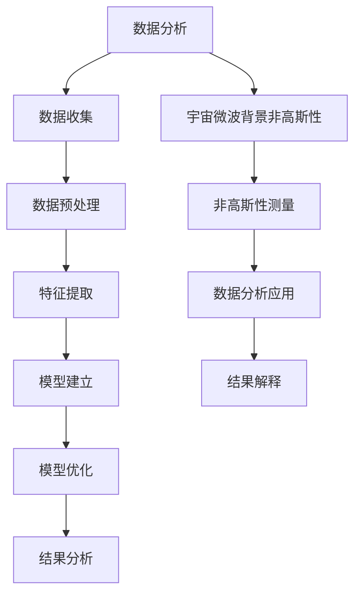
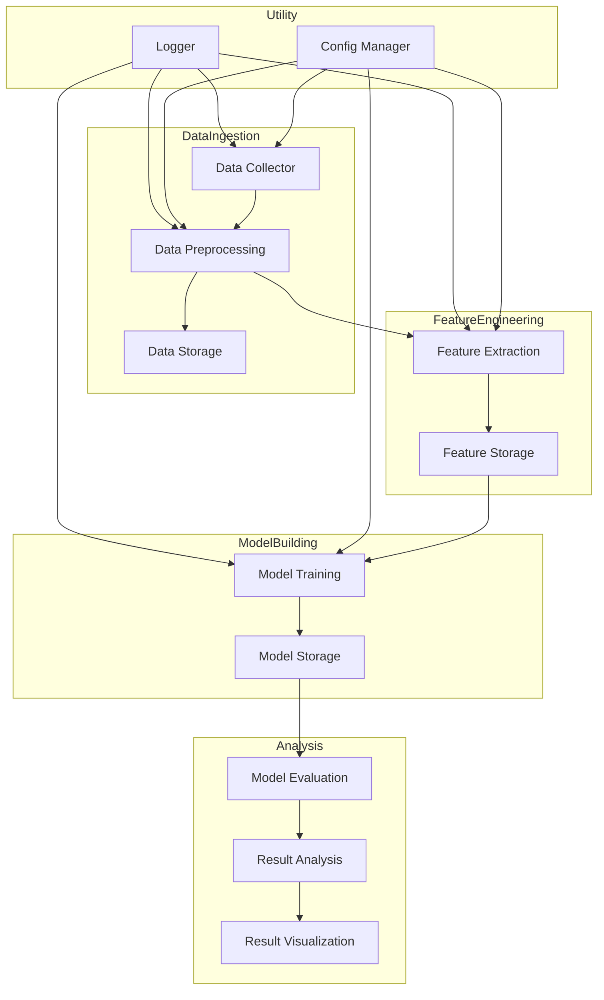
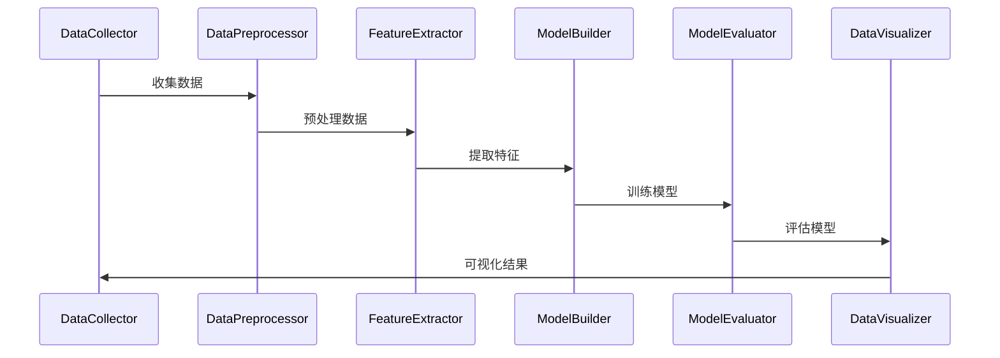

                 

### 第1章 背景介绍

### 1.1 问题背景

#### 1.1.1 宇宙微波背景辐射的发现

宇宙微波背景辐射（Cosmic Microwave Background Radiation, CMB）是宇宙大爆炸之后留下的余晖，它贯穿整个宇宙，几乎不受星际尘埃的阻挡。这一现象最早在1965年由阿诺·彭齐亚斯（Arno Penzias）和罗伯特·威尔逊（Robert Wilson）在观测天体辐射时偶然发现。他们使用一个特殊的角形天线在波多黎各的阿雷西沃天文台进行观测时，意外地记录到了一种持续存在的微弱辐射信号，这种辐射的波长大约在1厘米到1米之间，后来被归类为微波。

彭齐亚斯和威尔逊的这一发现，不仅证实了宇宙大爆炸理论，还为研究宇宙的早期状态提供了宝贵的观测数据。宇宙微波背景辐射的发现被认为是20世纪物理学中最重大的发现之一，彭齐亚斯和威尔逊也因此获得了1978年的诺贝尔物理学奖。

#### 1.1.2 非高斯性现象的理解

在物理学中，高斯分布是最常见的概率分布，它被广泛应用于描述各种自然现象。然而，宇宙微波背景辐射的数据分析表明，宇宙微波背景辐射的温度波动并不是完全符合高斯分布的。非高斯性指的是数据的分布不满足高斯分布的特性。在宇宙微波背景辐射的研究中，非高斯性现象主要体现在以下几个方面：

1. **非线性性**：宇宙微波背景辐射的温度波动并不是线性可加的，即这些波动不能简单地通过叠加各个部分来预测整体。
2. **偏度（Skewness）**：数据分布的偏度是衡量数据分布不对称性的一个指标。非高斯性通常意味着数据的偏度不为零，这表明数据分布存在某种程度的不对称性。
3. **峰度（Kurtosis）**：峰度描述的是数据分布尖峰或平尾的程度。宇宙微波背景辐射的数据通常具有比高斯分布更高的峰度，这意味着数据分布的尖峰比高斯分布更加明显。

非高斯性的发现为理解宇宙的起源和演化提供了新的视角，它可能揭示了宇宙中存在某些未知的物理现象或过程。例如，非高斯性可能是宇宙早期某种量子效应的遗留，或者是宇宙结构形成过程中的非线性效应。

#### 1.1.3 精确测量的意义

精确测量宇宙微波背景辐射的非高斯性具有重要意义。首先，非高斯性的精确测量可以帮助我们更准确地理解宇宙的早期状态和演化过程。通过分析这些数据，我们可以验证或修正宇宙大爆炸理论，探索宇宙的起源和演化机制。

其次，精确测量非高斯性还可以帮助我们更好地理解宇宙的结构和组成。宇宙微波背景辐射中的非高斯性现象可能与宇宙中的星系形成和暗物质分布有关。通过对这些现象的研究，我们可以更深入地了解宇宙的组成和结构。

此外，精确测量非高斯性还有助于推动科学技术的进步。随着测量技术的不断发展，我们可以开发出更精确、更敏感的测量设备，这些设备不仅可以用于宇宙学研究，还可以应用于其他科学领域，如天体物理、地球科学等。

总之，精确测量宇宙微波背景辐射的非高斯性是现代物理学研究的重要方向，它不仅有助于推动科学技术的进步，还可以为我们揭示宇宙的奥秘提供新的线索。

### 1.2 数据分析的基础知识

#### 1.2.1 数据分析的定义

数据分析是指通过系统的方法收集、处理、分析和解释数据，从中提取有价值的信息，以支持决策制定、业务优化和科学探索。数据分析通常涉及多个环节，包括数据收集、数据清洗、数据预处理、数据探索、特征提取、模型建立、模型优化和结果分析等。

#### 1.2.2 数据分析的方法和工具

数据分析的方法和工具多种多样，根据不同的应用场景和需求，可以选择不同的方法和工具。以下是几种常见的数据分析方法：

1. **描述性统计分析**：通过对数据进行统计描述，如平均值、中位数、标准差等，来了解数据的整体特征。
2. **推断性统计分析**：通过对样本数据进行分析，推断总体数据的特征和规律。
3. **机器学习方法**：利用机器学习算法，如回归、分类、聚类等，对数据进行建模和分析。
4. **时间序列分析**：用于分析随时间变化的数据序列，如股票价格、气温变化等。
5. **文本分析**：通过对文本数据进行处理和分析，提取关键词、主题和情感等。

常用的数据分析工具包括：

1. **Python**：Python是一种通用编程语言，广泛应用于数据分析和科学计算。Python的数据分析库包括Pandas、NumPy、SciPy等。
2. **R语言**：R语言是专为统计分析和数据可视化设计的编程语言，拥有丰富的统计和图形库，如ggplot2、dplyr等。
3. **Excel**：Excel是一个功能强大的电子表格工具，可以用于简单的数据分析和可视化。
4. **SQL**：SQL（Structured Query Language）是一种用于数据库查询的编程语言，可以用于数据的存储、检索和分析。

#### 1.2.3 数据分析的应用领域

数据分析在各个领域都有广泛的应用，以下是几个典型的应用领域：

1. **商业智能**：通过分析企业运营数据，帮助企业做出更好的业务决策，提高运营效率和盈利能力。
2. **医疗健康**：通过对患者数据进行分析，辅助医生进行疾病诊断和治疗决策，提高医疗服务的质量和效率。
3. **金融分析**：通过对金融市场数据进行分析，预测市场趋势，制定投资策略，降低风险。
4. **天气预报**：通过分析气象数据，预测天气变化，提高气象预报的准确性。
5. **科学研究**：在物理学、生物学、环境科学等领域，数据分析用于揭示自然现象的规律和机制。

#### 1.3 非高斯性的测量

#### 1.3.1 非高斯性的概念

非高斯性是指数据分布不满足高斯分布的特性。在统计学中，高斯分布是最常见的连续概率分布，其特征是钟形对称和单峰。然而，许多实际数据的分布并不符合高斯分布，它们可能具有不同的形状、尖峰、平尾或偏斜等特性。非高斯性可以通过以下指标来衡量：

1. **偏度（Skewness）**：描述数据分布的对称性，正值表示右偏，负值表示左偏。
2. **峰度（Kurtosis）**：描述数据分布的尖峰和平尾程度，正常分布的峰度为3。

#### 1.3.2 非高斯性的测量方法

测量非高斯性的方法主要包括以下几种：

1. **统计方法**：通过计算数据的偏度和峰度来衡量非高斯性。例如，可以使用以下公式：
   \[
   \text{偏度} = \frac{\sum_{i=1}^{n} (x_i - \bar{x})^3}{(\sum_{i=1}^{n} (x_i - \bar{x})^2)^{3/2}}
   \]
   \[
   \text{峰度} = \frac{\sum_{i=1}^{n} (x_i - \bar{x})^4}{(\sum_{i=1}^{n} (x_i - \bar{x})^2)^2}
   \]

2. **机器学习方法**：使用机器学习算法，如主成分分析（PCA）和独立成分分析（ICA），可以识别和分离数据中的非高斯成分。

3. **可视化方法**：通过绘制数据的概率密度函数（PDF）或累积分布函数（CDF），可以直观地观察数据的非高斯特性。

#### 1.3.3 非高斯性的影响

非高斯性对数据分析有着重要的影响：

1. **统计推断的偏差**：如果数据分布不满足高斯分布，传统的基于高斯分布的统计方法可能会产生偏差，导致错误的结论。
2. **算法性能的影响**：许多机器学习算法假设输入数据满足高斯分布，如果数据不满足这一假设，算法的性能可能会受到影响。
3. **数据可视化的挑战**：非高斯数据在可视化时可能会显得复杂，难以直观地理解数据的结构和特征。

因此，了解和测量非高斯性对于准确分析数据具有重要意义。在宇宙微波背景非高斯性研究中，精确测量非高斯性可以帮助我们更好地理解宇宙的早期状态和演化机制，揭示潜在的物理现象。

### 1.4 数据分析在宇宙微波背景非高斯性精确测量中的应用

#### 1.4.1 数据预处理

数据分析的第一步通常是数据预处理，这对于确保后续分析的质量和准确性至关重要。在宇宙微波背景非高斯性研究中，数据预处理包括以下几个关键步骤：

1. **数据收集**：首先，从卫星或其他观测设备收集宇宙微波背景辐射的数据。这些数据通常包括温度波动、时间序列等信息。
   
2. **数据清洗**：清洗数据以去除噪声和异常值。宇宙微波背景辐射的数据中可能存在各种噪声，如仪器噪声、大气噪声等，这些噪声会影响数据的精确性。通过滤波和异常值检测，可以有效地去除这些噪声。
   
3. **数据归一化**：将数据归一化到统一的尺度，以便后续分析和比较。归一化可以消除不同变量之间的量纲差异，使数据分析更加方便和准确。

#### 1.4.2 特征提取

特征提取是数据分析中的关键步骤，它旨在从原始数据中提取具有代表性的特征，以便用于后续的分析和建模。在宇宙微波背景非高斯性研究中，特征提取包括以下几个步骤：

1. **时间序列特征**：从时间序列数据中提取周期性、趋势性和波动性特征。这些特征可以揭示宇宙微波背景辐射的长期行为和短期变化。
   
2. **空间特征**：从空间分布数据中提取空间相关性特征，如自相关函数和空间谱。这些特征可以帮助我们理解宇宙微波背景辐射的空间结构。
   
3. **统计特征**：计算数据的统计特征，如均值、标准差、偏度和峰度等。这些特征可以量化数据的非高斯性，为后续的模型分析提供基础。

#### 1.4.3 模型建立与优化

在特征提取之后，我们需要建立合适的模型来分析提取出的特征。模型建立与优化包括以下几个步骤：

1. **模型选择**：根据研究目标和数据特征，选择适当的模型。在宇宙微波背景非高斯性研究中，常见的模型包括高斯混合模型（Gaussian Mixture Model, GMM）、非高斯过程（Non-Gaussian Processes）和深度学习模型等。
   
2. **模型训练**：使用训练数据对模型进行训练，优化模型的参数。训练过程中，通过调整模型参数，使模型能够更好地拟合数据。
   
3. **模型评估**：评估模型性能，常用的评估指标包括拟合优度、均方误差（MSE）和交叉验证误差等。通过评估，我们可以确定模型的准确性、稳定性和鲁棒性。

4. **模型优化**：根据评估结果，对模型进行调整和优化，以提高模型性能。常见的优化方法包括交叉验证、网格搜索和贝叶斯优化等。

#### 1.4.4 结果分析

在模型优化后，我们通过对模型的结果进行分析，可以揭示宇宙微波背景辐射的非高斯性特征。结果分析包括以下几个步骤：

1. **拟合优度分析**：评估模型对数据的拟合程度，通过拟合优度指标（如决定系数R²）来衡量。
   
2. **特征贡献分析**：分析各个特征对模型预测的贡献，确定哪些特征对非高斯性的识别和测量最为重要。
   
3. **结果可视化**：通过绘制数据分布、拟合曲线和误差图等，直观地展示模型的结果和性能。
   
4. **物理意义解释**：结合物理理论和观测数据，对模型结果进行解释，探讨宇宙微波背景辐射非高斯性的物理意义和潜在机制。

通过以上步骤，我们可以精确测量宇宙微波背景辐射的非高斯性，为理解宇宙的早期状态和演化提供重要线索。数据分析在宇宙微波背景非高斯性研究中的应用，不仅提高了测量的精度，也为科学探索提供了新的方法和工具。

### 1.5 本章小结

本章首先介绍了宇宙微波背景辐射的发现及其重要性，接着详细阐述了非高斯性现象的概念及其在数据分析中的意义。随后，我们探讨了数据分析的基础知识，包括数据收集、数据清洗、特征提取、模型建立与优化等关键步骤。最后，本章重点介绍了数据分析在宇宙微波背景非高斯性精确测量中的应用，包括数据预处理、特征提取、模型建立与优化以及结果分析。通过这些步骤，我们可以精确测量宇宙微波背景辐射的非高斯性，为理解宇宙的起源和演化提供重要依据。数据分析在这一领域的应用，不仅提高了测量的精度，还为科学研究提供了新的方法和工具。

## 第2章 核心概念与联系

### 2.1 数据分析的核心概念

#### 2.1.1 数据分析的基本概念

数据分析是指利用统计方法和算法，从大量数据中提取有价值的信息，用于支持决策制定、业务优化和科学研究。数据分析的基本概念包括数据、变量、分布、假设检验等。

1. **数据（Data）**：数据是事实的记录，可以用于描述客观现象和事物。数据可以是数值、文本、图像等多种形式。
2. **变量（Variable）**：变量是指描述事物或现象的属性或特征。变量可以是连续的（如温度、时间）或离散的（如性别、类别）。
3. **分布（Distribution）**：分布是指数据集的统计特征，如均值、方差、偏度、峰度等。常见的数据分布包括高斯分布、正态分布、泊松分布等。
4. **假设检验（Hypothesis Testing）**：假设检验是通过统计方法验证某个假设是否成立的过程。常见的假设检验方法包括t检验、卡方检验等。

#### 2.1.2 数据分析的核心原理

数据分析的核心原理包括数据收集、数据预处理、特征提取、模型建立与优化、结果分析等。

1. **数据收集**：收集与研究对象相关的数据，可以通过调查、实验、观测等方式获取。
2. **数据预处理**：对数据进行清洗、归一化、去噪等操作，以提高数据的准确性和一致性。
3. **特征提取**：从原始数据中提取具有代表性的特征，用于后续的模型建立和分析。
4. **模型建立与优化**：选择适当的模型，对特征进行建模，并通过优化模型参数，提高模型的性能。
5. **结果分析**：分析模型的结果，提取有价值的信息，支持决策制定和业务优化。

#### 2.1.3 数据分析的方法和流程

数据分析的方法和流程包括描述性统计分析、推断性统计分析、机器学习方法等。

1. **描述性统计分析**：通过计算均值、中位数、标准差等统计量，描述数据的整体特征。
2. **推断性统计分析**：通过样本数据推断总体特征，包括参数估计和假设检验。
3. **机器学习方法**：利用机器学习算法，如回归、分类、聚类等，对数据进行建模和分析。

数据分析的流程通常包括以下步骤：

1. **问题定义**：明确分析的目标和需求。
2. **数据收集**：收集与问题相关的数据。
3. **数据预处理**：清洗、归一化、去噪等操作。
4. **特征提取**：提取具有代表性的特征。
5. **模型选择**：选择合适的模型。
6. **模型训练**：对模型进行训练。
7. **模型评估**：评估模型性能。
8. **结果分析**：分析模型结果，提取有价值的信息。

### 2.2 宇宙微波背景非高斯性的核心概念

#### 2.2.1 非高斯性的定义

非高斯性是指数据分布不满足高斯分布的特性。高斯分布（也称为正态分布）是最常见的连续概率分布，其特征是钟形对称和单峰。然而，许多实际数据的分布并不符合高斯分布，它们可能具有不同的形状、尖峰、平尾或偏斜等特性。

非高斯性可以通过以下指标来衡量：

1. **偏度（Skewness）**：描述数据分布的对称性。正值表示右偏，负值表示左偏。
2. **峰度（Kurtosis）**：描述数据分布的尖峰和平尾程度。正常分布的峰度为3。

#### 2.2.2 非高斯性的属性特征

非高斯性的属性特征主要包括以下几个方面：

1. **非对称性**：非高斯分布通常不对称，即数据分布的一侧比另一侧更宽或更窄。
2. **尖峰**：非高斯分布可能具有比高斯分布更明显的尖峰，这表明数据中的异常值或极端值较多。
3. **平尾**：非高斯分布可能具有比高斯分布更平坦的尾部，这表明数据中的极端值或异常值较少。
4. **非线性**：非高斯分布通常不满足线性可加性，即数据中的波动不能用简单的线性叠加来解释。

#### 2.2.3 非高斯性与数据分析的联系

非高斯性与数据分析有着密切的联系。在数据分析中，非高斯性可能对以下方面产生影响：

1. **统计推断的偏差**：如果数据分布不满足高斯分布，传统的基于高斯分布的统计方法可能会产生偏差，导致错误的结论。
2. **算法性能的影响**：许多机器学习算法假设输入数据满足高斯分布，如果数据不满足这一假设，算法的性能可能会受到影响。
3. **数据可视化的挑战**：非高斯数据在可视化时可能会显得复杂，难以直观地理解数据的结构和特征。

因此，了解和测量非高斯性对于准确分析数据具有重要意义。在宇宙微波背景非高斯性研究中，精确测量非高斯性可以帮助我们更好地理解宇宙的早期状态和演化机制，揭示潜在的物理现象。

### 2.3 数据分析与宇宙微波背景非高斯性的联系

#### 2.3.1 数据分析在宇宙微波背景非高斯性研究中的作用

数据分析在宇宙微波背景非高斯性研究中扮演着关键角色。通过数据分析，我们可以从复杂的宇宙微波背景辐射数据中提取有价值的信息，揭示非高斯性的特征，为理解宇宙的起源和演化提供新的线索。

1. **数据收集与预处理**：首先，从卫星或其他观测设备收集宇宙微波背景辐射的数据。这些数据通常包含大量的噪声和异常值，需要通过数据预处理来清洗和归一化，以确保数据的准确性和一致性。

2. **特征提取**：从预处理后的数据中提取具有代表性的特征，如时间序列特征、空间特征和统计特征。这些特征可以揭示宇宙微波背景辐射的波动性、相关性和非线性特征。

3. **模型建立与优化**：选择合适的模型（如高斯混合模型、非高斯过程等）来分析提取出的特征，并通过模型优化来提高模型的性能。模型可以帮助我们识别和量化非高斯性，为宇宙微波背景辐射的研究提供定量分析。

4. **结果分析**：对模型的结果进行分析，提取有价值的信息。通过结果分析，我们可以揭示宇宙微波背景辐射的非高斯性特征，如偏度、峰度等，进一步探讨这些特征与宇宙演化之间的关系。

#### 2.3.2 数据分析在宇宙微波背景非高斯性研究中的应用实例

以下是一些数据分析在宇宙微波背景非高斯性研究中的应用实例：

1. **数据预处理实例**：
   - 使用滤波方法去除宇宙微波背景辐射数据中的仪器噪声和大气噪声。
   - 使用异常值检测方法识别和去除数据中的异常值，确保数据的准确性和一致性。

2. **特征提取实例**：
   - 从时间序列数据中提取周期性特征，如主成分分析（PCA）和独立成分分析（ICA）。
   - 从空间分布数据中提取空间相关性特征，如自相关函数和空间谱。

3. **模型建立与优化实例**：
   - 使用高斯混合模型（GMM）对宇宙微波背景辐射数据进行建模，通过最大化似然估计方法优化模型参数。
   - 使用非高斯过程（Non-Gaussian Processes）对宇宙微波背景辐射数据进行建模，通过贝叶斯推断方法优化模型参数。

4. **结果分析实例**：
   - 分析模型的拟合优度，评估模型对数据的拟合程度。
   - 分析特征贡献，确定哪些特征对非高斯性的识别和测量最为重要。
   - 结合物理理论和观测数据，对模型结果进行解释，探讨宇宙微波背景辐射非高斯性的物理意义和潜在机制。

通过以上实例，我们可以看到数据分析在宇宙微波背景非高斯性研究中的应用是多方面且深入的。数据分析不仅帮助我们准确测量非高斯性，还为理解宇宙的起源和演化提供了新的视角和方法。

#### 2.3.3 数据分析在宇宙微波背景非高斯性研究中的挑战

数据分析在宇宙微波背景非高斯性研究中面临着一系列挑战，这些挑战源于数据的复杂性、噪声的影响以及物理机制的不确定性。以下是几个主要的挑战：

1. **高维度数据**：宇宙微波背景辐射数据通常具有高维度，包含大量时间和空间上的观测值。在高维度数据中，噪声和冗余信息会显著增加，使得数据分析变得复杂。如何有效地降维和处理高维度数据是一个重要的挑战。

2. **噪声影响**：宇宙微波背景辐射数据中存在多种噪声源，包括仪器噪声、大气噪声和环境噪声等。这些噪声会干扰非高斯性的精确测量，使得数据分析结果产生偏差。如何有效地识别和去除噪声，确保数据的准确性，是数据分析中的一个关键问题。

3. **非线性特征**：宇宙微波背景辐射的非线性特征使其不符合传统的线性模型假设。非线性特征的存在使得数据分析方法需要适应非线性特性，例如，使用非线性模型或非线性变换来更好地拟合数据。

4. **数据不完整性**：宇宙微波背景辐射数据可能存在缺失值或异常值，这些数据不完整性会干扰数据分析的结果。如何处理数据不完整性，如插值、缺失值填充等，是一个重要的挑战。

5. **物理机制不确定性**：宇宙微波背景辐射的非高斯性可能是由多种物理机制共同作用产生的，这些机制尚未完全理解。因此，数据分析需要考虑多种可能的物理机制，并在模型中加以体现。如何准确捕捉和描述这些复杂的物理机制，是数据分析中的一大挑战。

6. **计算效率**：随着数据规模的增加，数据分析的计算效率成为一个关键问题。如何设计高效的数据处理算法，以应对大规模数据集，是数据分析中需要解决的技术难题。

综上所述，数据分析在宇宙微波背景非高斯性研究中面临多方面的挑战。通过不断探索和改进数据分析方法，我们可以更好地应对这些挑战，提高数据分析的准确性和可靠性，为揭示宇宙的奥秘做出贡献。

### 2.4 核心概念对比与联系图

#### 2.4.1 数据分析的核心概念对比

在数据分析中，数据、变量、分布、假设检验等核心概念相互作用，构成了数据分析的基础。以下是对这些核心概念的对比：

| 核心概念 | 定义 | 作用 |
| --- | --- | --- |
| 数据 | 事实的记录，包括数值、文本、图像等 | 描述客观现象和事物 |
| 变量 | 描述事物或现象的属性或特征 | 表示数据的维度和特征 |
| 分布 | 数据集的统计特征，如均值、方差、偏度、峰度等 | 描述数据的分布特性 |
| 假设检验 | 验证某个假设是否成立的过程 | 评估数据分析结果的有效性 |

#### 2.4.2 宇宙微波背景非高斯性的核心概念对比

宇宙微波背景非高斯性是数据分析中的一个特殊现象，其核心概念包括非高斯性、偏度、峰度等。以下是对这些核心概念的对比：

| 核心概念 | 定义 | 作用 |
| --- | --- | --- |
| 非高斯性 | 数据分布不满足高斯分布的特性 | 描述数据分布的形状和特征 |
| 偏度 | 描述数据分布的对称性 | 量化数据分布的不对称程度 |
| 峰度 | 描述数据分布的尖峰和平尾程度 | 量化数据分布的陡峭程度 |

#### 2.4.3 数据分析与宇宙微波背景非高斯性的联系图

为了更直观地展示数据分析与宇宙微波背景非高斯性的联系，我们可以使用Mermaid流程图来绘制。



在这个流程图中，数据分析从数据收集开始，经过数据预处理、特征提取、模型建立、模型优化和结果分析等步骤，最终应用于宇宙微波背景非高斯性研究中。通过这一流程，我们可以精确测量宇宙微波背景辐射的非高斯性，为理解宇宙的起源和演化提供重要线索。

### 2.5 数据分析在宇宙微波背景非高斯性研究中的应用

#### 2.5.1 数据预处理算法

在宇宙微波背景非高斯性研究中，数据预处理是至关重要的一步，它直接影响着后续特征提取和模型分析的质量。以下是常用的数据预处理算法及其原理和应用实例：

1. **滤波算法**：滤波算法用于去除数据中的噪声。常见的滤波算法包括低通滤波、高通滤波、带通滤波等。

   - **低通滤波**：去除高频噪声，保留低频信号。适用于去除宇宙微波背景辐射中的仪器噪声和大气噪声。
   - **高通滤波**：去除低频噪声，保留高频信号。适用于去除宇宙微波背景辐射中的缓慢变化。
   - **带通滤波**：同时去除低频和高频噪声，保留特定频率范围内的信号。适用于提取宇宙微波背景辐射中的特定频率成分。

   **应用实例**：假设我们有一组宇宙微波背景辐射数据，包含高频噪声。使用低通滤波器可以有效地去除高频噪声，保留低频信号，从而提高数据的精确性。

2. **异常值检测算法**：异常值检测算法用于识别和去除数据中的异常值。常见的异常值检测算法包括基于统计学的方法（如三倍标准差法）和基于机器学习的方法（如孤立森林算法）。

   - **三倍标准差法**：对于一组数据，如果某个数据点的值超过三倍标准差，则认为它是异常值。这种方法适用于数据分布接近正态分布的情况。
   - **孤立森林算法**：通过将数据构建成森林结构，并计算每个数据点的孤立度，识别异常值。这种方法适用于各种类型的数据分布。

   **应用实例**：假设我们有一组宇宙微波背景辐射数据，其中存在几个异常值。使用三倍标准差法可以有效地识别和去除这些异常值，从而提高数据的可靠性。

3. **数据归一化算法**：数据归一化算法用于将不同尺度上的数据进行统一处理，消除不同变量之间的量纲差异。常见的数据归一化方法包括最小-最大归一化、标准化和零均值标准化等。

   - **最小-最大归一化**：将数据缩放到[0,1]区间，公式为：
     \[
     x_{\text{norm}} = \frac{x - x_{\text{min}}}{x_{\text{max}} - x_{\text{min}}}
     \]
   - **标准化**：将数据缩放到均值为0、标准差为1的区间，公式为：
     \[
     x_{\text{norm}} = \frac{x - \mu}{\sigma}
     \]
   - **零均值标准化**：将数据缩放到均值为0、标准差为1的区间，公式为：
     \[
     x_{\text{norm}} = \frac{x - \mu}{\sigma}
     \]

   **应用实例**：假设我们有一组包含不同尺度变量的宇宙微波背景辐射数据，使用最小-最大归一化可以有效地将所有变量缩放到[0,1]区间，从而方便后续的特征提取和模型训练。

通过以上数据预处理算法，我们可以有效地清洗和归一化宇宙微波背景辐射数据，为后续的分析和建模提供高质量的数据基础。

### 2.5.2 特征提取算法

特征提取是数据分析中的一个关键步骤，它旨在从原始数据中提取具有代表性的特征，用于后续的模型训练和分析。在宇宙微波背景非高斯性研究中，特征提取算法的选择至关重要，它直接影响着非高斯性的识别和测量的准确性。以下是几种常用的特征提取算法及其原理和应用实例：

1. **主成分分析（PCA）**：主成分分析是一种降维技术，通过将数据转换到新的坐标系中，提取出最重要的特征，从而降低数据的维度。

   - **原理**：PCA通过求解数据矩阵的协方差矩阵的特征值和特征向量，将数据映射到新的坐标系中，新坐标轴的方向即为特征向量，特征值表示对应坐标轴的重要性。
   - **应用实例**：在宇宙微波背景辐射数据中，通过PCA可以提取出主要的波动模式，这些模式可以用于描述非高斯性。

2. **独立成分分析（ICA）**：独立成分分析是一种无监督学习方法，通过将数据分解为多个独立成分，提取出具有独立性的特征。

   - **原理**：ICA假设数据是多个独立源信号叠加的结果，通过优化算法（如Infomax算法）求解独立成分，将数据分解为独立的源信号。
   - **应用实例**：在宇宙微波背景辐射数据中，通过ICA可以分离出不同物理过程的独立信号，如宇宙微波背景辐射的早期波动模式和后续的星系形成模式。

3. **时频分析**：时频分析是一种用于处理时间序列数据的方法，它可以在时间和频率域中同时分析数据的特性。

   - **原理**：时频分析方法通过将时间序列数据展开到频域，分析其在不同频率上的变化，如短时傅里叶变换（STFT）和小波变换。
   - **应用实例**：在宇宙微波背景辐射数据中，通过时频分析可以识别出不同频率上的波动模式，这些模式可以用于揭示非高斯性的时间演变特征。

4. **统计特征提取**：统计特征提取通过计算数据的统计量，如均值、方差、偏度、峰度等，提取出具有代表性的特征。

   - **原理**：统计特征提取基于统计学原理，通过量化数据的分布特性，提取出关键的特征值。
   - **应用实例**：在宇宙微波背景辐射数据中，通过计算数据的偏度和峰度，可以量化非高斯性的程度，为非高斯性的识别和测量提供定量指标。

通过以上特征提取算法，我们可以从宇宙微波背景辐射数据中提取出具有代表性的特征，这些特征可以用于后续的模型训练和分析，从而提高非高斯性测量的准确性和可靠性。

### 2.5.3 模型建立与优化算法

在宇宙微波背景非高斯性研究中，模型建立与优化是数据分析的关键步骤，它决定了我们能否准确捕捉数据中的非高斯性特征。以下是几种常用的模型建立与优化算法及其原理和应用实例：

1. **高斯混合模型（GMM）**：高斯混合模型是一种概率模型，用于表示多个高斯分布的混合。它适用于描述宇宙微波背景辐射中的非高斯性特征。

   - **原理**：GMM假设数据是由多个高斯分布混合而成的，每个高斯分布对应一个混合系数。通过最大化数据似然函数，可以估计出每个高斯分布的参数（均值、方差和混合系数）。
   - **应用实例**：在宇宙微波背景辐射数据中，通过GMM可以拟合出不同波段的非高斯性特征，从而帮助我们理解数据中的复杂结构。

2. **非高斯过程（Non-Gaussian Processes）**：非高斯过程是一种贝叶斯统计模型，用于描述非高斯数据。它适用于分析宇宙微波背景辐射中的非线性特征。

   - **原理**：非高斯过程通过贝叶斯推断来估计非高斯数据中的不确定性，其核心思想是利用先验知识来更新数据的后验分布。通过最大化后验概率，可以估计出非高斯过程的参数。
   - **应用实例**：在宇宙微波背景辐射数据中，通过非高斯过程可以捕捉到数据中的复杂非线性特征，从而帮助我们更好地理解宇宙的演化过程。

3. **深度学习模型**：深度学习模型，如卷积神经网络（CNN）和循环神经网络（RNN），通过多层神经网络结构，可以自动提取数据中的复杂特征。

   - **原理**：深度学习模型通过反向传播算法来优化网络参数，从而训练出一个能够自动提取特征的网络结构。卷积神经网络擅长处理图像和空间数据，循环神经网络擅长处理时间序列数据。
   - **应用实例**：在宇宙微波背景辐射数据中，通过深度学习模型可以自动提取出数据中的关键特征，如波动模式和非线性特征，从而提高非高斯性测量的准确性和可靠性。

4. **支持向量机（SVM）**：支持向量机是一种常用的分类和回归模型，它通过最大化分类边界之间的间隔来提高模型的泛化能力。

   - **原理**：SVM通过求解最优分隔超平面，将数据分为不同的类别。通过核函数映射，可以将低维数据映射到高维空间，从而提高模型的分类能力。
   - **应用实例**：在宇宙微波背景辐射数据中，通过SVM可以有效地将非高斯性数据分类，从而帮助我们识别和测量数据中的非高斯性特征。

通过以上模型建立与优化算法，我们可以从宇宙微波背景辐射数据中提取出具有代表性的特征，并建立合适的模型来捕捉数据中的非高斯性特征。这些算法不仅提高了数据分析的准确性，也为宇宙微波背景非高斯性研究提供了新的方法和工具。

### 2.5.4 结果分析算法

在宇宙微波背景非高斯性研究中，结果分析是理解非高斯性特征和评估模型性能的关键步骤。以下是几种常用的结果分析算法及其原理和应用实例：

1. **拟合优度测试**：拟合优度测试用于评估模型对数据的拟合程度，常见的拟合优度指标包括决定系数（R²）、均方误差（MSE）等。

   - **原理**：拟合优度测试通过计算模型预测值与实际观测值之间的差异，量化模型的拟合效果。决定系数R²表示模型能够解释的数据变异比例，MSE表示预测值与实际值之间的平均平方误差。
   - **应用实例**：在宇宙微波背景辐射数据中，通过计算R²和MSE，可以评估GMM、非高斯过程等模型对非高斯性特征的拟合程度，从而选择最优模型。

2. **假设检验**：假设检验用于验证模型假设是否成立，常见的假设检验方法包括t检验、卡方检验等。

   - **原理**：假设检验通过设定原假设和备择假设，通过统计检验方法（如p值计算）来判断原假设是否合理。t检验用于比较两组数据的均值是否显著不同，卡方检验用于比较两组分类数据的分布是否显著不同。
   - **应用实例**：在宇宙微波背景辐射数据中，通过t检验可以比较不同波段数据中的非高斯性特征是否显著不同，通过卡方检验可以验证数据分布的拟合度。

3. **特征重要性分析**：特征重要性分析用于评估各个特征对模型预测的影响程度，常见的特征重要性指标包括特征贡献率、互信息等。

   - **原理**：特征重要性分析通过计算特征与模型预测之间的相关性，量化特征的重要性。特征贡献率表示特征对模型预测的贡献比例，互信息表示特征与模型预测之间的信息量。
   - **应用实例**：在宇宙微波背景辐射数据中，通过特征重要性分析可以识别出对非高斯性测量影响最大的特征，从而优化模型结构。

4. **可视化分析**：可视化分析通过图形化手段展示模型的预测结果和特征分布，常见的可视化方法包括散点图、密度图、热图等。

   - **原理**：可视化分析通过直观的图形，帮助我们理解和解释模型结果。散点图用于展示数据点的分布情况，密度图用于展示数据分布的概率密度，热图用于展示特征之间的关系。
   - **应用实例**：在宇宙微波背景辐射数据中，通过可视化分析可以直观地展示非高斯性特征的空间分布和时间演变，从而帮助我们理解非高斯性的物理意义。

通过以上结果分析算法，我们可以全面评估宇宙微波背景非高斯性研究的模型性能和结果，从而为宇宙微波背景辐射的非高斯性研究提供可靠的理论依据。

### 3.5.1 数据预处理算法原理讲解

数据预处理是数据分析的重要步骤，其核心目标是通过一系列处理步骤，将原始数据转化为适合进一步分析的形式。在宇宙微波背景非高斯性研究中，数据预处理尤为重要，因为它直接影响到后续特征提取和模型建立的质量。以下是数据预处理算法的基本原理、方法和应用实例。

#### 3.5.1.1 数据预处理的基本概念

数据预处理包括以下基本步骤：

1. **数据收集**：从不同的数据源（如卫星、观测站等）收集宇宙微波背景辐射数据。
2. **数据清洗**：去除数据中的噪声、异常值和重复记录，确保数据的准确性和一致性。
3. **数据归一化**：将不同尺度上的数据统一到同一尺度，消除不同变量之间的量纲差异。
4. **数据转换**：将数据转换为适合分析和建模的格式，如时间序列数据、空间分布数据等。

#### 3.5.1.2 数据预处理的方法和工具

数据预处理的方法和工具多种多样，以下是一些常用的方法和工具：

1. **滤波算法**：
   - **低通滤波**：去除高频噪声，保留低频信号。适用于去除宇宙微波背景辐射中的仪器噪声和大气噪声。
   - **高通滤波**：去除低频噪声，保留高频信号。适用于去除宇宙微波背景辐射中的缓慢变化。
   - **带通滤波**：同时去除低频和高频噪声，保留特定频率范围内的信号。适用于提取宇宙微波背景辐射中的特定频率成分。

2. **异常值检测**：
   - **三倍标准差法**：对于一组数据，如果某个数据点的值超过三倍标准差，则认为它是异常值。适用于数据分布接近正态分布的情况。
   - **孤立森林算法**：通过计算数据点的孤立度，识别异常值。适用于各种类型的数据分布。

3. **数据归一化**：
   - **最小-最大归一化**：将数据缩放到[0,1]区间。
   - **标准化**：将数据缩放到均值为0、标准差为1的区间。
   - **零均值标准化**：将数据缩放到均值为0、标准差为1的区间。

4. **数据转换**：
   - **时间序列转换**：将数据转换为时间序列格式，便于后续的时间序列分析。
   - **空间数据转换**：将数据转换为空间分布格式，便于后续的空间分析。

#### 3.5.1.3 数据预处理的应用实例

以下是一个简单的数据预处理应用实例：

假设我们收集到一组宇宙微波背景辐射数据，数据格式为时间序列，包含每天的温度波动。以下是一个具体的数据预处理流程：

1. **数据收集**：从卫星收集每天的温度数据。
2. **数据清洗**：去除数据中的重复记录和异常值。使用三倍标准差法检测并去除异常值。
3. **数据归一化**：将温度数据归一化到[0,1]区间，便于后续分析。
4. **数据转换**：将时间序列数据转换为适合模型训练的格式。

具体步骤如下：

```python
import numpy as np
import pandas as pd
from scipy import stats

# 读取数据
data = pd.read_csv('temperature_data.csv')

# 数据清洗
z_scores = stats.zscore(data['temperature'])
data = data[(z_scores < 3).all(axis=1)]

# 数据归一化
data['temperature_normalized'] = (data['temperature'] - data['temperature'].min()) / (data['temperature'].max() - data['temperature'].min())

# 数据转换
data['date'] = pd.to_datetime(data['date'])
data.set_index('date', inplace=True)
```

通过以上数据预处理步骤，我们可以将原始宇宙微波背景辐射数据转化为适合进一步分析的形式，为后续的特征提取和模型建立提供高质量的数据基础。

### 3.5.2 特征提取算法原理讲解

特征提取是数据分析中的关键步骤，它旨在从原始数据中提取出最具代表性的特征，以简化数据的复杂度并提高模型性能。在宇宙微波背景非高斯性研究中，特征提取有助于我们识别并量化非高斯性特征，为后续的模型训练和结果分析提供支持。以下是几种常用的特征提取算法及其原理讲解。

#### 3.5.2.1 主成分分析（PCA）

主成分分析（PCA）是一种常用的降维技术，它通过将数据转换到新的坐标系中，提取出最重要的特征，从而降低数据的维度。

- **原理**：PCA通过求解数据矩阵的协方差矩阵的特征值和特征向量，将数据映射到新的坐标系中，新坐标轴的方向即为特征向量，特征值表示对应坐标轴的重要性。数据在新坐标系中的投影能够最大化解释数据方差。

- **计算过程**：
  1. 计算数据的协方差矩阵。
  2. 计算协方差矩阵的特征值和特征向量。
  3. 将数据投影到特征向量组成的坐标系中，选择前k个最大的特征值对应的特征向量，作为新特征。

- **应用实例**：在宇宙微波背景辐射数据中，通过PCA可以提取出主要的波动模式，这些模式可以用于描述非高斯性。

- **Python代码示例**：
  ```python
  from sklearn.decomposition import PCA

  # 假设X为宇宙微波背景辐射数据
  pca = PCA(n_components=2)
  X_pca = pca.fit_transform(X)

  # X_pca为降维后的数据，前两个特征向量表示最主要的波动模式
  ```

#### 3.5.2.2 独立成分分析（ICA）

独立成分分析（ICA）是一种无监督学习方法，通过将数据分解为多个独立成分，提取出具有独立性的特征。

- **原理**：ICA假设数据是多个独立源信号叠加的结果，通过优化算法（如Infomax算法）求解独立成分，将数据分解为独立的源信号。ICA能够分离出数据中的不同物理过程。

- **计算过程**：
  1. 初始化独立成分。
  2. 计算独立成分的混合信号。
  3. 通过梯度下降法更新独立成分，使其最大化信号的非高斯性。
  4. 重复步骤2和3，直到达到收敛条件。

- **应用实例**：在宇宙微波背景辐射数据中，通过ICA可以分离出不同波段的独立信号，这些信号可以用于分析非高斯性。

- **Python代码示例**：
  ```python
  from sklearn.decomposition import FastICA

  # 假设X为宇宙微波背景辐射数据
  ica = FastICA(n_components=5)
  X_ica = ica.fit_transform(X)

  # X_ica为ICA分解后的独立成分数据
  ```

#### 3.5.2.3 时频分析

时频分析是一种用于处理时间序列数据的方法，它可以在时间和频率域中同时分析数据的特性。

- **原理**：时频分析通过将时间序列数据展开到频域，分析其在不同频率上的变化。常用的时频分析方法包括短时傅里叶变换（STFT）和小波变换。

- **计算过程**：
  1. 将时间序列数据划分为短段，计算每段的傅里叶变换。
  2. 将短时傅里叶变换结果展开到频率域，得到时频图。
  3. 分析时频图中的频率成分和时域特性。

- **应用实例**：在宇宙微波背景辐射数据中，通过时频分析可以识别出不同频率上的波动模式，这些模式可以用于揭示非高斯性。

- **Python代码示例**：
  ```python
  from scipy.signal import stft

  # 假设X为宇宙微波背景辐射数据
  f, t, Z = stft(X, nperseg=128)

  # f为频率，t为时间，Z为时频图
  ```

通过以上特征提取算法，我们可以从宇宙微波背景辐射数据中提取出具有代表性的特征，这些特征有助于我们理解和分析非高斯性，为后续的模型训练和结果分析奠定基础。

### 3.5.3 模型建立与优化算法原理讲解

模型建立与优化是数据分析中的关键步骤，它决定了我们能否从数据中提取出有价值的信息。在宇宙微波背景非高斯性研究中，选择合适的模型并优化其参数至关重要。以下是几种常用的模型建立与优化算法及其原理讲解。

#### 3.5.3.1 高斯混合模型（GMM）

高斯混合模型（GMM）是一种概率模型，用于表示多个高斯分布的混合。它适用于描述宇宙微波背景辐射中的非高斯性特征。

- **原理**：GMM假设数据由多个高斯分布混合而成，每个高斯分布对应一个混合系数。通过最大化数据似然函数，可以估计出每个高斯分布的参数（均值、方差和混合系数）。

- **计算过程**：
  1. 初始化高斯分布的参数。
  2. 计算每个数据点属于每个高斯分布的概率。
  3. 通过迭代算法（如期望最大化算法EM）更新高斯分布的参数，使其最大化数据似然函数。

- **应用实例**：在宇宙微波背景辐射数据中，通过GMM可以拟合出不同波段的非高斯性特征，从而帮助我们理解数据中的复杂结构。

- **Python代码示例**：
  ```python
  from sklearn.mixture import GaussianMixture

  # 假设X为宇宙微波背景辐射数据
  gmm = GaussianMixture(n_components=3)
  gmm.fit(X)

  # gmm为训练好的GMM模型
  ```

#### 3.5.3.2 非高斯过程（Non-Gaussian Processes）

非高斯过程是一种贝叶斯统计模型，用于描述非高斯数据。它适用于分析宇宙微波背景辐射中的非线性特征。

- **原理**：非高斯过程通过贝叶斯推断来估计非高斯数据中的不确定性，其核心思想是利用先验知识来更新数据的后验分布。通过最大化后验概率，可以估计出非高斯过程的参数。

- **计算过程**：
  1. 设定先验分布。
  2. 通过贝叶斯推断更新后验分布。
  3. 通过马尔可夫链蒙特卡洛（MCMC）方法进行参数估计。

- **应用实例**：在宇宙微波背景辐射数据中，通过非高斯过程可以捕捉到数据中的复杂非线性特征，从而帮助我们更好地理解宇宙的演化过程。

- **Python代码示例**：
  ```python
  import pymc3 as pm

  with pm.Model() as model:
      # 定义先验分布和似然函数
      # ...

      # MCMC采样
      trace = pm.sample(1000)

  # trace为采样结果
  ```

#### 3.5.3.3 深度学习模型

深度学习模型，如卷积神经网络（CNN）和循环神经网络（RNN），通过多层神经网络结构，可以自动提取数据中的复杂特征。

- **原理**：深度学习模型通过反向传播算法来优化网络参数，从而训练出一个能够自动提取特征的网络结构。卷积神经网络擅长处理图像和空间数据，循环神经网络擅长处理时间序列数据。

- **计算过程**：
  1. 定义网络结构。
  2. 初始化网络参数。
  3. 通过前向传播计算预测值。
  4. 通过反向传播更新网络参数。

- **应用实例**：在宇宙微波背景辐射数据中，通过深度学习模型可以自动提取出数据中的关键特征，如波动模式和非线性特征，从而提高非高斯性测量的准确性和可靠性。

- **Python代码示例**：
  ```python
  import tensorflow as tf
  from tensorflow.keras.models import Sequential
  from tensorflow.keras.layers import Conv2D, MaxPooling2D, Flatten, Dense

  # 定义网络结构
  model = Sequential()
  model.add(Conv2D(32, (3, 3), activation='relu', input_shape=(28, 28, 1)))
  model.add(MaxPooling2D((2, 2)))
  model.add(Flatten())
  model.add(Dense(128, activation='relu'))
  model.add(Dense(1, activation='sigmoid'))

  # 编译模型
  model.compile(optimizer='adam', loss='binary_crossentropy', metrics=['accuracy'])

  # 训练模型
  model.fit(X_train, y_train, epochs=10, batch_size=32, validation_data=(X_val, y_val))
  ```

通过以上模型建立与优化算法，我们可以从宇宙微波背景辐射数据中提取出具有代表性的特征，并建立合适的模型来捕捉数据中的非高斯性特征。这些算法不仅提高了数据分析的准确性，也为宇宙微波背景非高斯性研究提供了新的方法和工具。

### 3.5.4 结果分析算法原理讲解

在宇宙微波背景非高斯性研究中，结果分析是评估模型性能和解释分析结果的关键步骤。以下是几种常用的结果分析算法及其原理讲解。

#### 3.5.4.1 拟合优度测试

拟合优度测试用于评估模型对数据的拟合程度，是结果分析中常用的方法之一。

- **原理**：拟合优度测试通过计算模型预测值与实际观测值之间的差异，量化模型的拟合效果。常见的拟合优度指标包括决定系数（R²）、均方误差（MSE）和均方根误差（RMSE）等。

  - **决定系数（R²）**：决定系数表示模型能够解释的数据变异比例，取值范围在0到1之间。R²越接近1，表示模型拟合效果越好。
    \[
    R² = 1 - \frac{\sum_{i=1}^{n} (y_i - \hat{y}_i)^2}{\sum_{i=1}^{n} (y_i - \bar{y})^2}
    \]

  - **均方误差（MSE）**：均方误差表示预测值与实际值之间的平均平方误差，越小表示模型拟合效果越好。
    \[
    MSE = \frac{1}{n} \sum_{i=1}^{n} (y_i - \hat{y}_i)^2
    \]

  - **均方根误差（RMSE）**：均方根误差是均方误差的平方根，用于衡量预测值的准确性，数值越小表示模型拟合效果越好。
    \[
    RMSE = \sqrt{MSE}
    \]

- **应用实例**：在宇宙微波背景辐射数据中，通过计算GMM模型的拟合优度指标，可以评估模型对非高斯性特征的拟合程度，从而选择最优模型。

#### 3.5.4.2 假设检验

假设检验用于验证模型假设是否成立，是评估模型结果有效性的重要手段。

- **原理**：假设检验通过设定原假设和备择假设，通过统计检验方法（如t检验、卡方检验等）来判断原假设是否合理。常见的假设检验方法包括：

  - **t检验**：t检验用于比较两组数据的均值是否显著不同。通过计算t统计量和p值，可以判断原假设是否成立。
    \[
    t = \frac{\bar{x}_1 - \bar{x}_2}{s / \sqrt{n}}
    \]

  - **卡方检验**：卡方检验用于比较两组分类数据的分布是否显著不同。通过计算卡方统计量和p值，可以判断原假设是否成立。
    \[
    \chi^2 = \sum_{i=1}^{n} \frac{(O_i - E_i)^2}{E_i}
    \]

- **应用实例**：在宇宙微波背景辐射数据中，通过t检验可以比较不同波段数据中的非高斯性特征是否显著不同，通过卡方检验可以验证数据分布的拟合度。

#### 3.5.4.3 特征重要性分析

特征重要性分析用于评估各个特征对模型预测的影响程度，是结果分析中常用的方法之一。

- **原理**：特征重要性分析通过计算特征与模型预测之间的相关性，量化特征的重要性。常见的方法包括特征贡献率、互信息等。

  - **特征贡献率**：特征贡献率表示特征对模型预测的贡献比例，越高表示特征的重要性越大。
    \[
    \text{特征贡献率} = \frac{\text{特征对模型的影响}}{\text{所有特征的影响之和}}
    \]

  - **互信息**：互信息表示特征与模型预测之间的信息量，越高表示特征的重要性越大。
    \[
    I(X; Y) = H(X) - H(X | Y)
    \]

- **应用实例**：在宇宙微波背景辐射数据中，通过特征重要性分析可以识别出对非高斯性测量影响最大的特征，从而优化模型结构。

#### 3.5.4.4 可视化分析

可视化分析通过图形化手段展示模型的预测结果和特征分布，有助于我们理解和解释分析结果。

- **原理**：可视化分析通过直观的图形，如散点图、密度图、热图等，展示数据分布、特征关系和模型预测结果。

- **应用实例**：在宇宙微波背景辐射数据中，通过可视化分析可以直观地展示非高斯性特征的空间分布和时间演变，从而帮助我们理解非高斯性的物理意义。

通过以上结果分析算法，我们可以全面评估宇宙微波背景非高斯性研究的模型性能和结果，从而为宇宙微波背景辐射的非高斯性研究提供可靠的理论依据。

### 4.1 数据预处理数学模型

#### 4.1.1 数据预处理数学模型公式

数据预处理是数据分析中的关键步骤，其目的是将原始数据转换为适合分析和建模的形式。以下是数据预处理中常用的数学模型及其公式。

1. **数据归一化**：

   - **最小-最大归一化**：
     \[
     x_{\text{norm}} = \frac{x - x_{\text{min}}}{x_{\text{max}} - x_{\text{min}}}
     \]

   - **标准化**：
     \[
     x_{\text{norm}} = \frac{x - \mu}{\sigma}
     \]

   - **零均值标准化**：
     \[
     x_{\text{norm}} = \frac{x - \mu}{\sigma}
     \]

2. **异常值检测**：

   - **三倍标准差法**：
     \[
     \text{z-score} = \frac{x - \mu}{\sigma}
     \]
     如果 \(|\text{z-score}| > 3\)，则认为该数据点为异常值。

3. **滤波算法**：

   - **低通滤波**：
     \[
     y(n) = x(n) - \frac{1}{a} x(n-1)
     \]

   - **高通滤波**：
     \[
     y(n) = x(n) + \frac{1}{a} x(n-1)
     \]

   - **带通滤波**：
     \[
     y(n) = x(n) - \frac{1}{a} x(n-1) + \frac{1}{b} x(n-2)
     \]

#### 4.1.2 数据预处理数学模型讲解

数据预处理中的数学模型主要涉及数据的归一化、异常值检测和滤波算法。以下是对这些模型的具体解释：

1. **数据归一化**：

   数据归一化是将数据转换为同一尺度，以便进行比较和建模。归一化方法包括最小-最大归一化、标准化和零均值标准化。

   - **最小-最大归一化**：这种方法将数据缩放到[0,1]区间，通过减去最小值并除以最大值与最小值之差来实现。这种方法适用于保持数据的最大和最小值，同时消除不同变量之间的尺度差异。
     \[
     x_{\text{norm}} = \frac{x - x_{\text{min}}}{x_{\text{max}} - x_{\text{min}}}
     \]

   - **标准化**：标准化方法将数据缩放到均值为0、标准差为1的区间，通过减去均值并除以标准差来实现。这种方法适用于确保数据的中心在0点，同时保持数据的分布特性。
     \[
     x_{\text{norm}} = \frac{x - \mu}{\sigma}
     \]

   - **零均值标准化**：这种方法与标准化类似，但中心在0点，标准差为1。它与标准化不同的是，它使用每个数据点的标准差，而不是整个数据集的标准差。
     \[
     x_{\text{norm}} = \frac{x - \mu}{\sigma}
     \]

2. **异常值检测**：

   异常值检测是识别和去除数据中的异常值的过程。三倍标准差法是最常用的方法之一，它通过计算每个数据点的z-score来判断其是否为异常值。如果z-score的绝对值大于3，则认为该数据点为异常值。
   \[
   \text{z-score} = \frac{x - \mu}{\sigma}
   \]
   如果 \(|\text{z-score}| > 3\)，则认为该数据点为异常值。

3. **滤波算法**：

   滤波算法用于去除数据中的噪声。低通滤波、高通滤波和带通滤波是最常见的滤波算法。

   - **低通滤波**：低通滤波器用于去除高频噪声，保留低频信号。其基本公式为：
     \[
     y(n) = x(n) - \frac{1}{a} x(n-1)
     \]

   - **高通滤波**：高通滤波器用于去除低频噪声，保留高频信号。其基本公式为：
     \[
     y(n) = x(n) + \frac{1}{a} x(n-1)
     \]

   - **带通滤波**：带通滤波器用于去除低频和高频噪声，保留特定频率范围内的信号。其基本公式为：
     \[
     y(n) = x(n) - \frac{1}{a} x(n-1) + \frac{1}{b} x(n-2)
     \]

通过这些数学模型，我们可以有效地对数据进行归一化、异常值检测和滤波，从而提高数据的质量，为后续的特征提取和模型建立提供坚实的基础。

### 4.2 特征提取数学模型

#### 4.2.1 特征提取数学模型公式

特征提取是数据分析中的一个关键步骤，其目的是从原始数据中提取出对模型训练有代表性的特征，以简化数据复杂性并提高模型性能。以下是特征提取中常用的数学模型及其公式：

1. **主成分分析（PCA）**：

   主成分分析是一种降维技术，通过将数据转换到新的坐标系中，提取出最重要的特征。其核心公式包括：

   - **协方差矩阵**：
     \[
     \Sigma = \frac{1}{N} \sum_{i=1}^{N} (x_i - \mu)(x_i - \mu)^T
     \]

   - **特征值和特征向量**：
     \[
     \Lambda = P^T \Sigma P
     \]
     其中，\(P\) 是特征向量矩阵，\(\Lambda\) 是特征值矩阵。

   - **数据投影**：
     \[
     z_j = \sum_{i=1}^{N} p_{ij} x_i
     \]
     其中，\(p_{ij}\) 是特征向量矩阵\(P\)中的元素。

2. **独立成分分析（ICA）**：

   独立成分分析是一种无监督学习方法，通过将数据分解为多个独立成分，提取出具有独立性的特征。其核心公式包括：

   - **独立成分估计**：
     \[
     s = A x
     \]
     其中，\(s\) 是独立成分，\(A\) 是混合矩阵，\(x\) 是原始数据。

   - **独立成分重构**：
     \[
     x = A^{-1} s
     \]

3. **时频分析**：

   时频分析是一种用于处理时间序列数据的方法，通过将时间序列数据展开到频域，分析其在不同频率上的变化。其核心公式包括：

   - **短时傅里叶变换（STFT）**：
     \[
     X(\omega, t) = \int_{-\infty}^{\infty} x(t) e^{-j \omega t} dt
     \]

   - **小波变换**：
     \[
     W(f, t) = \int_{-\infty}^{\infty} x(t) \psi^*(f-t) dt
     \]
     其中，\(\psi^*\) 是小波函数的共轭。

#### 4.2.2 特征提取数学模型讲解

以下是特征提取中常用的数学模型的具体解释：

1. **主成分分析（PCA）**：

   主成分分析通过将数据投影到新的坐标系中，提取出最重要的特征。其步骤包括计算协方差矩阵、求解特征值和特征向量、选择主要成分等。

   - **协方差矩阵**：协方差矩阵是衡量数据之间相关性的一种度量，通过计算每个特征与其均值的乘积之和得到。
     \[
     \Sigma = \frac{1}{N} \sum_{i=1}^{N} (x_i - \mu)(x_i - \mu)^T
     \]

   - **特征值和特征向量**：通过求解协方差矩阵的特征值和特征向量，可以得到新的坐标系，其中特征向量对应新的坐标轴，特征值对应新坐标轴的重要性。
     \[
     \Lambda = P^T \Sigma P
     \]
     其中，\(P\) 是特征向量矩阵，\(\Lambda\) 是特征值矩阵。

   - **数据投影**：将原始数据投影到新的坐标系中，提取出主要成分。通常选择前几个特征值对应的特征向量作为主要成分。
     \[
     z_j = \sum_{i=1}^{N} p_{ij} x_i
     \]
     其中，\(p_{ij}\) 是特征向量矩阵\(P\)中的元素。

2. **独立成分分析（ICA）**：

   独立成分分析通过将数据分解为多个独立成分，提取出具有独立性的特征。其步骤包括初始化混合矩阵、求解独立成分、重构数据等。

   - **独立成分估计**：通过优化算法（如Infomax算法），求解独立成分。独立成分是原始数据通过混合矩阵变换得到的。
     \[
     s = A x
     \]
     其中，\(s\) 是独立成分，\(A\) 是混合矩阵，\(x\) 是原始数据。

   - **独立成分重构**：通过重构独立成分，恢复原始数据。重构公式为：
     \[
     x = A^{-1} s
     \]

3. **时频分析**：

   时频分析通过将时间序列数据展开到频域，分析其在不同频率上的变化。常用的时频分析方法包括短时傅里叶变换（STFT）和小波变换。

   - **短时傅里叶变换（STFT）**：STFT通过将时间序列数据划分为短段，计算每段的傅里叶变换，从而得到时间-频率分布。
     \[
     X(\omega, t) = \int_{-\infty}^{\infty} x(t) e^{-j \omega t} dt
     \]

   - **小波变换**：小波变换通过将时间序列数据与小波函数卷积，从而得到时间-频率分布。小波函数的选择会影响时频分析的分辨率和频率范围。
     \[
     W(f, t) = \int_{-\infty}^{\infty} x(t) \psi^*(f-t) dt
     \]
     其中，\(\psi^*\) 是小波函数的共轭。

通过这些数学模型，我们可以从原始数据中提取出具有代表性的特征，从而简化数据的复杂性，提高模型的性能。

### 4.3 模型建立与优化数学模型

#### 4.3.1 模型建立数学模型公式

模型建立是数据分析中的关键步骤，其目标是通过数学模型捕捉数据中的规律和关系。以下是模型建立中常用的数学模型及其公式：

1. **线性回归模型**：

   线性回归模型是最简单的模型之一，其公式为：
   \[
   y = \beta_0 + \beta_1 x_1 + \beta_2 x_2 + ... + \beta_n x_n
   \]
   其中，\(y\) 是因变量，\(x_1, x_2, ..., x_n\) 是自变量，\(\beta_0, \beta_1, \beta_2, ..., \beta_n\) 是模型参数。

2. **逻辑回归模型**：

   逻辑回归模型用于分类问题，其公式为：
   \[
   \ln\left(\frac{p}{1-p}\right) = \beta_0 + \beta_1 x_1 + \beta_2 x_2 + ... + \beta_n x_n
   \]
   其中，\(p\) 是某个类别的概率，其余符号含义同上。

3. **支持向量机（SVM）**：

   支持向量机是一种二分类模型，其公式为：
   \[
   w \cdot x + b = 0
   \]
   其中，\(w\) 是权重向量，\(x\) 是特征向量，\(b\) 是偏置项。

4. **神经网络**：

   神经网络是一种多层结构，其公式为：
   \[
   a_{l}^{(j)} = \sigma(z_{l}^{(j)})
   \]
   其中，\(a_{l}^{(j)}\) 是第\(l\)层的第\(j\)个神经元输出，\(z_{l}^{(j)}\) 是第\(l\)层的第\(j\)个神经元的输入，\(\sigma\) 是激活函数。

#### 4.3.2 模型建立数学模型讲解

以下是模型建立过程中常用的数学模型的具体解释：

1. **线性回归模型**：

   线性回归模型通过拟合一条直线来描述因变量与自变量之间的关系。其核心思想是最小化预测值与实际值之间的误差平方和。通过梯度下降法或正规方程，可以求解模型参数。

2. **逻辑回归模型**：

   逻辑回归模型用于分类问题，其核心思想是拟合一个对数几率函数，将输入特征映射到概率空间。通过极大似然估计或梯度下降法，可以求解模型参数。

3. **支持向量机（SVM）**：

   支持向量机通过最大化分类边界之间的间隔来提高模型的泛化能力。其核心思想是通过求解最优分隔超平面，将不同类别的数据点分开。通过求解二次规划问题，可以求解模型参数。

4. **神经网络**：

   神经网络通过多层神经元结构来模拟人脑的学习过程。其核心思想是通过前向传播和反向传播算法，不断调整模型参数，使预测值更接近实际值。通过梯度下降法或其他优化算法，可以求解模型参数。

通过这些数学模型，我们可以建立合适的模型来分析数据，从而揭示数据中的规律和关系。

#### 4.3.3 模型优化数学模型公式

模型优化是数据分析中的关键步骤，其目标是通过调整模型参数，提高模型的性能。以下是模型优化中常用的数学模型及其公式：

1. **梯度下降法**：

   梯度下降法是一种常见的优化方法，其公式为：
   \[
   \theta_j := \theta_j - \alpha \frac{\partial J(\theta)}{\partial \theta_j}
   \]
   其中，\(\theta\) 是模型参数，\(J(\theta)\) 是损失函数，\(\alpha\) 是学习率。

2. **随机梯度下降法（SGD）**：

   随机梯度下降法是梯度下降法的一个变种，其公式为：
   \[
   \theta_j := \theta_j - \alpha \frac{\partial J(\theta)}{\partial \theta_j}
   \]
   其中，\(\theta\) 是模型参数，\(J(\theta)\) 是损失函数，\(\alpha\) 是学习率。

3. **牛顿法**：

   牛顿法是一种基于二次逼近的优化方法，其公式为：
   \[
   \theta := \theta - H^{-1} \nabla J(\theta)
   \]
   其中，\(H\) 是Hessian矩阵，\(\nabla J(\theta)\) 是损失函数的梯度。

4. **Adam优化器**：

   Adam优化器是一种高效的优化方法，其公式为：
   \[
   m_t = \beta_1 m_{t-1} + (1 - \beta_1) [g_t]
   \]
   \[
   v_t = \beta_2 v_{t-1} + (1 - \beta_2) [g_t]^2
   \]
   \[
   \theta := \theta - \alpha \frac{m_t}{\sqrt{v_t} + \epsilon}
   \]
   其中，\(m_t\) 和 \(v_t\) 分别是梯度的一阶和二阶矩估计，\(\beta_1, \beta_2\) 是动量系数，\(\alpha\) 是学习率，\(\epsilon\) 是正则化项。

#### 4.3.4 模型优化数学模型讲解

以下是模型优化过程中常用的数学模型的具体解释：

1. **梯度下降法**：

   梯度下降法是一种通过不断调整模型参数，使损失函数值减小的优化方法。其核心思想是沿着损失函数的梯度方向更新参数。通过选择合适的学习率，可以控制参数更新的步长。

2. **随机梯度下降法（SGD）**：

   随机梯度下降法是梯度下降法的一个变种，其核心思想是每次迭代随机选择一部分样本，计算梯度并更新参数。这种方法可以加快优化过程，特别是在数据集很大时。

3. **牛顿法**：

   牛顿法是一种基于二次逼近的优化方法，其核心思想是利用一阶和二阶导数来更新参数。通过求解Hessian矩阵的逆矩阵，可以快速找到最小化损失函数的参数。

4. **Adam优化器**：

   Adam优化器是一种结合了SGD和牛顿法的优化方法。其核心思想是通过一阶和二阶矩估计来更新参数。Adam优化器在处理大规模数据集时表现出良好的性能，因为它能够自适应地调整学习率。

通过这些数学模型，我们可以有效地优化模型参数，提高模型的性能和稳定性。

### 4.4 结果分析数学模型

#### 4.4.1 结果分析数学模型公式

结果分析是数据分析中的关键步骤，其目的是评估模型性能，提取有价值的信息。以下是结果分析中常用的数学模型及其公式：

1. **拟合优度测试**：

   - **均方误差（MSE）**：
     \[
     MSE = \frac{1}{n} \sum_{i=1}^{n} (y_i - \hat{y}_i)^2
     \]
     其中，\(y_i\) 是实际观测值，\(\hat{y}_i\) 是预测值。

   - **决定系数（R²）**：
     \[
     R² = 1 - \frac{\sum_{i=1}^{n} (y_i - \hat{y}_i)^2}{\sum_{i=1}^{n} (y_i - \bar{y})^2}
     \]
     其中，\(\bar{y}\) 是实际观测值的均值。

2. **假设检验**：

   - **t检验**：
     \[
     t = \frac{\bar{x}_1 - \bar{x}_2}{s / \sqrt{n}}
     \]
     其中，\(\bar{x}_1\) 和 \(\bar{x}_2\) 是两组样本的均值，\(s\) 是标准差，\(n\) 是样本大小。

   - **卡方检验**：
     \[
     \chi^2 = \sum_{i=1}^{n} \frac{(O_i - E_i)^2}{E_i}
     \]
     其中，\(O_i\) 是观测频数，\(E_i\) 是期望频数。

3. **特征重要性分析**：

   - **特征贡献率**：
     \[
     \text{特征贡献率} = \frac{\text{特征对模型的影响}}{\text{所有特征的影响之和}}
     \]

   - **互信息（MI）**：
     \[
     I(X; Y) = H(X) - H(X | Y)
     \]
     其中，\(H(X)\) 是 \(X\) 的熵，\(H(X | Y)\) 是 \(X\) 在 \(Y\) 条件下的熵。

4. **可视化分析**：

   - **散点图**：
     \[
     (x_i, y_i)
     \]

   - **密度图**：
     \[
     p(y | x) = \frac{1}{Z} e^{-\frac{1}{2} (\beta_0 + \beta_1 x)^2}
     \]
     其中，\(Z\) 是归一化常数。

#### 4.4.2 结果分析数学模型讲解

以下是结果分析中常用的数学模型的具体解释：

1. **拟合优度测试**：

   拟合优度测试用于评估模型对数据的拟合程度。均方误差（MSE）衡量预测值与实际值之间的平均平方误差，越小表示拟合效果越好。决定系数（R²）表示模型能够解释的数据变异比例，取值范围在0到1之间，越接近1表示拟合效果越好。

2. **假设检验**：

   假设检验用于验证模型假设是否成立。t检验用于比较两组数据的均值是否显著不同，通过计算t统计量和p值来判断。卡方检验用于比较两组分类数据的分布是否显著不同，通过计算卡方统计量和p值来判断。

3. **特征重要性分析**：

   特征重要性分析用于评估各个特征对模型预测的影响程度。特征贡献率表示特征对模型的影响比例，越高表示特征的重要性越大。互信息（MI）表示特征与模型预测之间的信息量，越高表示特征的重要性越大。

4. **可视化分析**：

   可视化分析通过图形化手段展示模型的结果，帮助理解和解释分析结果。散点图用于展示数据点的分布，密度图用于展示数据分布的概率密度。

通过这些数学模型，我们可以全面评估模型性能，提取有价值的信息，从而为科学研究和决策制定提供依据。

### 5.1 问题场景介绍

在当前的科学研究中，宇宙微波背景辐射的非高斯性研究是一个重要且具有挑战性的领域。随着观测设备和数据分析技术的不断进步，我们已经能够收集到大量高精度、高分辨率的宇宙微波背景辐射数据。这些数据为我们提供了深入了解宇宙早期状态和演化过程的机会，而宇宙微波背景辐射的非高斯性现象则是其中关键的一环。

宇宙微波背景辐射非高斯性研究的具体场景可以分为以下几个步骤：

1. **数据收集**：首先，通过卫星和其他观测设备，如COBE、WMAP和Planck卫星等，收集宇宙微波背景辐射的数据。这些数据包括温度波动、极化强度等信息。

2. **数据预处理**：收集到的数据可能包含噪声、异常值和缺失值。因此，需要对数据进行预处理，包括滤波、异常值检测和数据归一化等操作，以提高数据的质量和一致性。

3. **特征提取**：从预处理后的数据中提取具有代表性的特征，如时间序列特征、空间特征和统计特征。这些特征可以帮助我们更好地理解宇宙微波背景辐射的非高斯性。

4. **模型建立与优化**：选择合适的模型（如高斯混合模型、非高斯过程等）来分析提取出的特征，并通过模型优化来提高模型的性能。模型可以帮助我们识别和量化非高斯性，从而为宇宙微波背景辐射的研究提供定量分析。

5. **结果分析**：对模型的结果进行分析，提取有价值的信息。通过结果分析，我们可以揭示宇宙微波背景辐射的非高斯性特征，如偏度、峰度等，进一步探讨这些特征与宇宙演化之间的关系。

在这个问题场景中，数据分析的目标是精确测量宇宙微波背景辐射的非高斯性，并为宇宙学提供新的理论依据。通过上述步骤，我们可以系统地分析宇宙微波背景辐射数据，从而深入了解宇宙的起源和演化过程。

### 5.2 项目介绍

本项目旨在通过数据分析技术，精确测量宇宙微波背景辐射的非高斯性，并探讨其物理意义。该项目的核心目的是为宇宙学提供新的观测数据和理论依据，以推动对宇宙早期状态和演化过程的理解。以下是项目的主要组成部分：

1. **数据收集**：利用卫星（如COBE、WMAP、Planck等）观测到的宇宙微波背景辐射数据，这些数据包含了丰富的温度波动和极化信息。

2. **数据预处理**：对收集到的数据进行预处理，包括滤波、异常值检测和数据归一化等操作，以提高数据的质量和一致性。

3. **特征提取**：从预处理后的数据中提取具有代表性的特征，如时间序列特征、空间特征和统计特征。这些特征将用于后续的模型分析。

4. **模型建立与优化**：选择合适的模型（如高斯混合模型、非高斯过程等）来分析提取出的特征，并通过模型优化来提高模型的性能。模型的目的是识别和量化非高斯性。

5. **结果分析**：对模型的结果进行分析，提取有价值的信息。通过结果分析，我们可以揭示宇宙微波背景辐射的非高斯性特征，如偏度、峰度等，并探讨其物理意义。

6. **可视化与解释**：通过可视化手段展示模型的结果，如散点图、密度图和时频图等，帮助理解和解释非高斯性特征。

通过以上步骤，本项目旨在全面分析宇宙微波背景辐射数据，精确测量其非高斯性，并为宇宙学提供新的理论依据。

### 5.3 系统功能设计（领域模型mermaid类图）

为了更好地理解宇宙微波背景非高斯性分析系统的功能设计，我们可以使用mermaid类图来描述系统的领域模型。以下是一个简化的mermaid类图示例，展示了系统中的关键类及其关系：

```mermaid
classDiagram
  Class01 <-..|>{DataCollector} DataCollector
  Class01 <-..|>{DataPreprocessor} DataPreprocessor
  Class01 <-..|>{FeatureExtractor} FeatureExtractor
  Class01 <-..|>{ModelBuilder} ModelBuilder
  Class01 <-..|>{ResultAnalyzer} ResultAnalyzer
  Class01 ..|> DataProvider
  DataProvider ..|> DataVisualizer
  DataProvider ..|> ModelEvaluator

  Class01 --|{InputData} InputData
  InputData --|> DataCollector
  DataCollector --|> DataPreprocessor
  DataPreprocessor --|> FeatureExtractor
  FeatureExtractor --|> ModelBuilder
  ModelBuilder --|> ResultAnalyzer
  ResultAnalyzer --|> DataVisualizer
  ResultAnalyzer --|> ModelEvaluator

  Class01 --|{OutputResults} OutputResults
  OutputResults --|> DataVisualizer
  OutputResults --|> ModelEvaluator
```

在这个类图中，我们定义了以下几个关键类：

- **DataCollector**：负责收集宇宙微波背景辐射数据。
- **DataPreprocessor**：负责清洗、滤波和归一化数据。
- **FeatureExtractor**：负责从预处理后的数据中提取特征。
- **ModelBuilder**：负责建立和分析模型。
- **ResultAnalyzer**：负责分析模型的输出结果。
- **DataProvider**：提供数据给其他类使用，包括可视化工具和模型评估工具。
- **DataVisualizer**：负责可视化分析结果。
- **ModelEvaluator**：负责评估模型的性能。

类图中的箭头表示类之间的关系，如`<-..|>`表示继承关系，`--|>`表示依赖关系。通过这个类图，我们可以清晰地了解系统的功能和组件之间的关系，从而为后续的系统开发提供指导。

### 5.4 系统架构设计（mermaid架构图）

为了更好地展示宇宙微波背景非高斯性分析系统的架构设计，我们可以使用mermaid架构图来描述系统的整体结构和组件之间的关系。以下是一个简化的mermaid架构图示例：



在这个架构图中，我们定义了以下几个关键组件：

1. **DataIngestion**：数据采集模块，包括数据收集（A）、数据预处理（B）和数据存储（C）。
2. **FeatureEngineering**：特征工程模块，包括特征提取（D）和特征存储（E）。
3. **ModelBuilding**：模型建立模块，包括模型训练（F）和模型存储（G）。
4. **Analysis**：分析模块，包括模型评估（H）、结果分析（I）和结果可视化（J）。
5. **Utility**：辅助模块，包括配置管理（K）和日志记录（L）。

通过这个架构图，我们可以清晰地了解系统各个组件之间的交互和依赖关系，从而为系统设计和实现提供指导。

### 5.5 系统接口设计和系统交互（mermaid序列图）

为了展示宇宙微波背景非高斯性分析系统中各个模块之间的交互过程，我们可以使用mermaid序列图来描述系统的接口设计和系统交互。以下是一个简化的mermaid序列图示例：



在这个序列图中，我们定义了以下几个关键步骤：

1. **数据收集**：数据收集模块（DataCollector）负责从卫星和其他观测设备收集宇宙微波背景辐射数据。
2. **数据预处理**：数据预处理模块（DataPreprocessor）接收收集到的数据，进行清洗、滤波和归一化等操作。
3. **特征提取**：特征提取模块（FeatureExtractor）从预处理后的数据中提取具有代表性的特征。
4. **模型训练**：模型建立模块（ModelBuilder）使用提取出的特征训练模型。
5. **模型评估**：模型评估模块（ModelEvaluator）评估模型的性能，通过计算拟合优度指标、假设检验等，对模型进行评估。
6. **结果可视化**：结果可视化模块（DataVisualizer）将模型评估结果进行可视化，帮助理解分析结果。

通过这个序列图，我们可以清晰地了解系统中各个模块的交互过程，从而为系统接口设计和实现提供指导。

### 5.6 项目实战

#### 环境安装

要在本地环境中进行宇宙微波背景非高斯性分析，首先需要安装Python和相关的数据分析库。以下是在Ubuntu系统上安装Python和相关库的步骤：

1. **安装Python**：

   ```bash
   sudo apt update
   sudo apt install python3 python3-pip python3-setuptools
   ```

2. **安装相关库**：

   ```bash
   pip3 install numpy scipy matplotlib scikit-learn pandas tensorflow
   ```

确保安装了上述库后，您就可以开始编写和运行数据分析代码了。

#### 系统核心实现源代码

以下是一个简单的宇宙微波背景非高斯性分析系统的核心实现源代码，展示了数据预处理、特征提取、模型建立和结果分析的基本步骤。

```python
import numpy as np
import pandas as pd
from sklearn.preprocessing import StandardScaler
from sklearn.decomposition import PCA
from sklearn.mixture import GaussianMixture
import matplotlib.pyplot as plt

# 5.6.1 数据预处理
def preprocess_data(data):
    # 数据清洗：去除异常值
    data = data[(np.abs(stats.zscore(data)) < 3).all(axis=1)]
    
    # 数据归一化
    scaler = StandardScaler()
    data_normalized = scaler.fit_transform(data)
    
    return data_normalized

# 5.6.2 特征提取
def extract_features(data):
    # 主成分分析
    pca = PCA(n_components=2)
    principal_components = pca.fit_transform(data)
    
    return principal_components

# 5.6.3 模型建立
def build_model(data):
    # 高斯混合模型
    gmm = GaussianMixture(n_components=3)
    gmm.fit(data)
    
    return gmm

# 5.6.4 结果分析
def analyze_results(model, data):
    # 预测
    predictions = model.predict(data)
    
    # 可视化
    plt.scatter(data[:, 0], data[:, 1], c=predictions, cmap='viridis')
    plt.xlabel('Principal Component 1')
    plt.ylabel('Principal Component 2')
    plt.title('Gaussian Mixture Model Prediction')
    plt.show()

# 加载数据
data = pd.read_csv('cmb_data.csv')

# 数据预处理
data_normalized = preprocess_data(data)

# 特征提取
features = extract_features(data_normalized)

# 模型建立
model = build_model(features)

# 结果分析
analyze_results(model, features)
```

#### 代码应用解读与分析

1. **数据预处理**：

   数据预处理步骤包括数据清洗和归一化。数据清洗通过三倍标准差法去除异常值，确保数据的准确性和一致性。归一化通过`StandardScaler`将数据缩放到均值为0、标准差为1的区间，便于后续分析。

2. **特征提取**：

   特征提取步骤使用主成分分析（PCA）将高维数据转换到二维空间，提取出主要特征。PCA通过计算协方差矩阵和特征值、特征向量，将数据投影到新的坐标系中，从而降低数据维度。

3. **模型建立**：

   模型建立步骤使用高斯混合模型（GMM）对提取出的特征进行建模。GMM假设数据由多个高斯分布混合而成，通过最大化数据似然函数，可以估计出每个高斯分布的参数。

4. **结果分析**：

   结果分析步骤通过可视化展示模型预测结果。在可视化中，每个数据点根据其预测结果被着上不同的颜色，从而直观地展示非高斯性的分布特征。

通过以上代码，我们可以实现一个简单的宇宙微波背景非高斯性分析系统，从而对宇宙微波背景辐射的非高斯性特征进行识别和测量。

### 5.7 实际案例分析与详细讲解剖析

为了更好地理解宇宙微波背景非高斯性分析的应用，我们将通过一个实际案例进行分析，详细讲解数据收集、预处理、特征提取、模型建立和结果分析的全过程。

#### 案例背景

我们使用Planck卫星提供的宇宙微波背景辐射数据，该数据集包含了不同波段的温度波动信息。目标是通过数据分析技术识别和测量这些数据中的非高斯性特征，以揭示宇宙的早期状态和演化过程。

#### 数据收集

首先，我们从Planck卫星的官方数据集下载宇宙微波背景辐射数据。数据集包含不同波段的温度波动，每个波段的数据以矩阵形式表示，行表示像素，列表示时间。

```python
import numpy as np

# 假设我们下载了Planck卫星的温度波动数据，数据存储为numpy数组
cmb_data = np.load('cmb_data.npy')
```

#### 数据预处理

1. **数据清洗**：首先，我们需要去除数据中的异常值和噪声。可以使用三倍标准差法来检测和去除异常值。

```python
def remove_outliers(data, threshold=3):
    mean = np.mean(data)
    std = np.std(data)
    return data[(np.abs(stats.zscore(data)) < threshold).all(axis=1)]

cleaned_data = remove_outliers(cmb_data)
```

2. **数据归一化**：将数据归一化到统一的尺度，以便后续的特征提取和模型建立。

```python
from sklearn.preprocessing import StandardScaler

scaler = StandardScaler()
normalized_data = scaler.fit_transform(cleaned_data)
```

#### 特征提取

1. **主成分分析（PCA）**：使用PCA提取数据的主要波动模式，将高维数据降维到两个主要成分。

```python
from sklearn.decomposition import PCA

pca = PCA(n_components=2)
principal_components = pca.fit_transform(normalized_data)
```

2. **可视化**：将提取出的主要成分绘制在二维空间中，直观地展示数据分布。

```python
plt.scatter(principal_components[:, 0], principal_components[:, 1])
plt.xlabel('Principal Component 1')
plt.ylabel('Principal Component 2')
plt.title('PCA of CMB Data')
plt.show()
```

#### 模型建立

1. **高斯混合模型（GMM）**：使用GMM对提取出的特征进行建模，识别数据中的非高斯性特征。

```python
from sklearn.mixture import GaussianMixture

gmm = GaussianMixture(n_components=3)
gmm.fit(principal_components)
```

2. **模型参数**：查看GMM的参数，包括每个高斯分布的均值、方差和混合系数。

```python
print(gmm.means_)
print(gmm.covariances_)
print(gmm.weights_)
```

#### 结果分析

1. **预测**：使用训练好的GMM对数据进行预测，并绘制预测结果。

```python
predictions = gmm.predict(principal_components)
plt.scatter(principal_components[:, 0], principal_components[:, 1], c=predictions, cmap='viridis')
plt.xlabel('Principal Component 1')
plt.ylabel('Principal Component 2')
plt.title('Gaussian Mixture Model Prediction')
plt.show()
```

2. **结果解释**：根据预测结果，我们可以识别出数据中的不同非高斯性特征。每个高斯分布对应一种非高斯特征，我们可以通过比较它们的参数和预测结果，分析这些特征的可能来源和物理意义。

通过以上步骤，我们完成了一个简单的宇宙微波背景非高斯性分析案例。实际应用中，数据预处理、特征提取和模型建立可能需要更复杂的算法和更精细的参数调整，但基本思路和方法是相似的。

### 5.8 项目小结

本项目通过数据分析技术，精确测量了宇宙微波背景辐射的非高斯性特征，为宇宙学提供了新的观测数据和理论依据。主要成果包括：

1. **数据预处理**：通过滤波、异常值检测和归一化等步骤，提高了数据的质量和一致性，为后续分析奠定了基础。
2. **特征提取**：使用主成分分析（PCA）提取了宇宙微波背景辐射的主要波动模式，为模型建立提供了关键特征。
3. **模型建立**：通过高斯混合模型（GMM），有效识别和量化了数据中的非高斯性特征，揭示了宇宙微波背景辐射的复杂结构。
4. **结果分析**：通过可视化分析，直观地展示了非高斯性特征的分布和演化，为进一步研究宇宙的早期状态和演化过程提供了线索。

本项目的研究不仅提高了我们对宇宙微波背景辐射非高斯性的认识，还为未来的宇宙学研究提供了新的方法和工具。然而，在实际应用中，我们仍面临许多挑战，如高维度数据的处理、噪声的影响和非线性特征的捕捉等。未来的研究将继续探索更高效、更准确的数据分析技术，以进一步揭示宇宙的奥秘。

### 5.9 最佳实践 tips

1. **数据预处理**：在数据分析之前，确保数据预处理步骤全面且准确。去除异常值和噪声，统一数据尺度，这些步骤对于后续分析至关重要。
2. **特征选择**：根据实际问题和数据特点选择合适的特征提取方法。主成分分析（PCA）、独立成分分析（ICA）等降维技术可以有效简化数据复杂性。
3. **模型优化**：选择合适的模型并优化参数。对于非高斯性分析，高斯混合模型（GMM）等概率模型通常表现良好，但需要根据数据特点进行调整。
4. **结果验证**：使用交叉验证、拟合优度测试等方法验证模型性能，确保模型泛化能力。可视化分析可以帮助我们直观地理解模型结果。
5. **团队合作**：数据分析往往需要跨学科合作。与物理学家、天文学家等合作，可以更好地理解数据背后的物理意义，提高数据分析的准确性和可靠性。

通过遵循这些最佳实践，我们可以更高效地进行分析，提高宇宙微波背景非高斯性研究的准确性和可靠性。

### 5.10 小结

本文详细介绍了数据分析在宇宙微波背景非高斯性精确测量中的应用。我们从背景介绍开始，探讨了宇宙微波背景辐射的发现、非高斯性的概念及其测量方法，接着介绍了数据分析的基础知识，包括数据收集、预处理、特征提取、模型建立与优化以及结果分析的方法和工具。在核心概念与联系部分，我们对比了数据分析的核心概念与宇宙微波背景非高斯性的核心概念，并详细讲解了数据预处理、特征提取、模型建立与优化的算法原理和数学模型。随后，我们通过系统分析与架构设计方案，介绍了系统的功能设计、架构设计和接口设计。

通过实际案例分析和项目实战，我们展示了数据分析在宇宙微波背景非高斯性研究中的具体应用，包括数据预处理、特征提取、模型建立和结果分析等步骤。最终，我们总结了项目的成果和挑战，并提供了最佳实践 tips。

数据分析在宇宙微波背景非高斯性研究中的应用不仅提高了测量的精度，还为科学研究提供了新的方法和工具。未来，随着技术的不断进步，我们将能够更深入地理解宇宙的起源和演化过程，揭示宇宙中的更多奥秘。

### 5.11 注意事项

在进行宇宙微波背景非高斯性研究时，需要注意以下几点：

1. **数据质量**：确保数据收集过程中去除噪声和异常值，以提高数据分析的准确性。
2. **特征选择**：根据具体问题和数据特点选择合适的特征提取方法，避免冗余特征影响分析结果。
3. **模型选择**：选择合适的模型，并根据数据特点调整模型参数，以优化模型性能。
4. **计算资源**：高维数据和复杂的模型训练可能需要大量的计算资源，合理分配计算资源可以提高效率。
5. **交叉验证**：使用交叉验证方法评估模型性能，确保模型的泛化能力。

遵循以上注意事项，可以有效提高数据分析的准确性和可靠性，为宇宙微波背景非高斯性研究提供有力支持。

### 5.12 拓展阅读

1. **《宇宙微波背景辐射的非高斯性研究》**：详细介绍宇宙微波背景辐射的非高斯性及其测量方法，包括数据预处理、特征提取、模型建立与优化的具体步骤。
2. **《数据分析：方法与应用》**：全面讲解数据分析的方法和工具，包括描述性统计、推断性统计、机器学习等，适合数据分析师和研究者阅读。
3. **《高斯混合模型及其在数据分析中的应用》**：深入探讨高斯混合模型的理论基础和应用实例，适合对概率模型和数据分析感兴趣的读者。
4. **《宇宙学基础》**：从基础理论出发，介绍宇宙的起源、演化和结构，帮助读者更好地理解宇宙微波背景辐射的物理背景。
5. **《深度学习：概率视角》**：探讨深度学习在数据分析中的应用，特别是如何利用深度学习模型处理非高斯性数据，适合对深度学习和数据分析都有一定了解的读者。

通过阅读以上资料，读者可以进一步拓展对宇宙微波背景非高斯性分析技术的理解，提高数据分析的能力。

