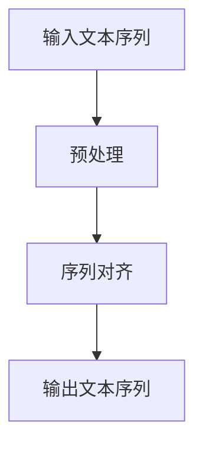
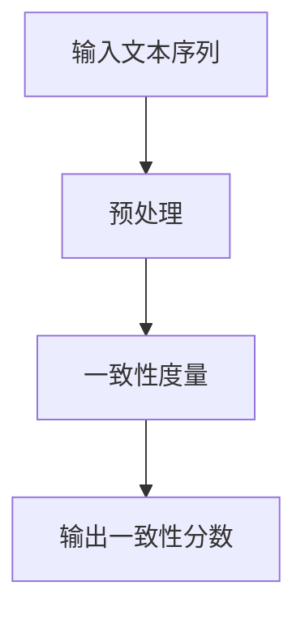
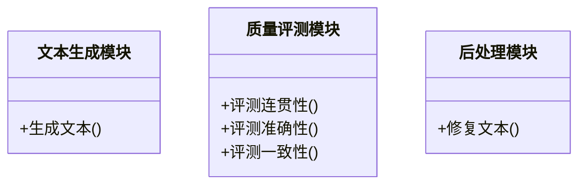
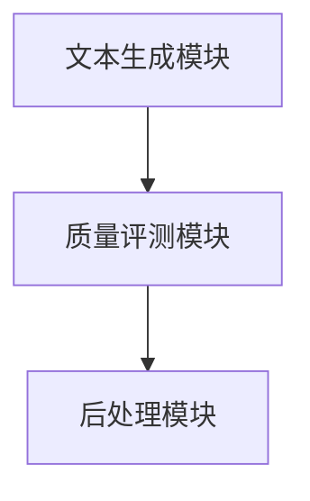
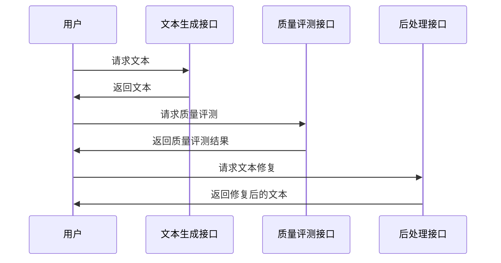
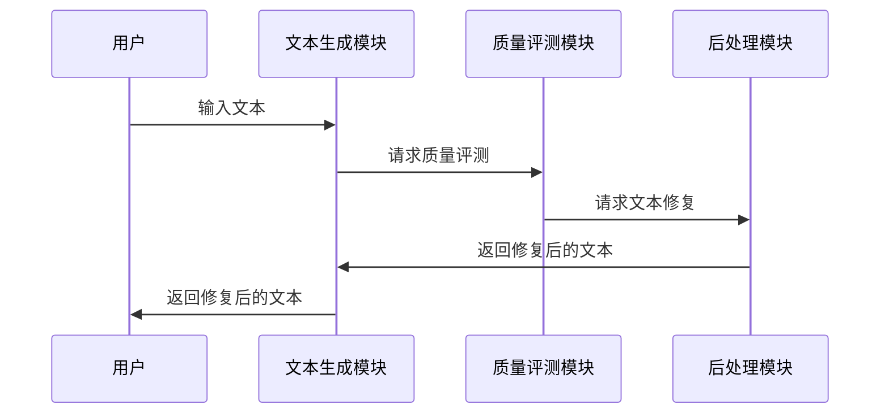
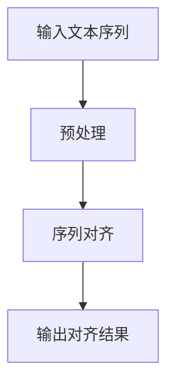
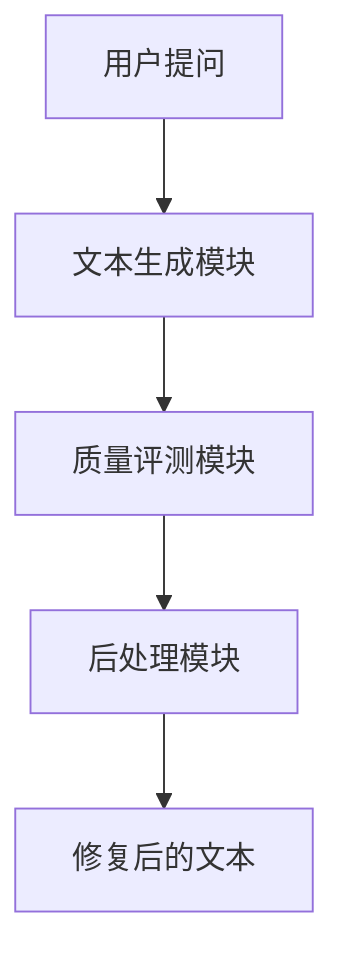
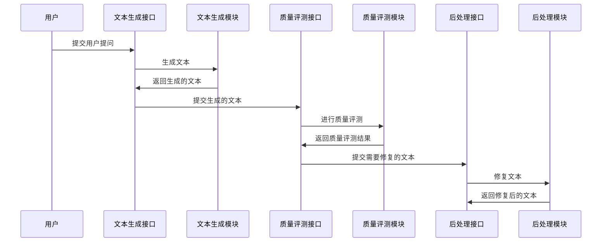
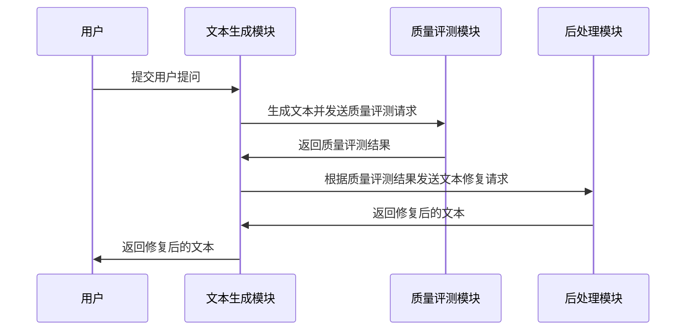

                 


## 文本生成质量评测：分析输出连贯性

> 关键词：文本生成、质量评测、连贯性、算法原理、数学模型、系统架构、项目实战

> 摘要：本文深入探讨了文本生成质量评测中的关键问题——输出连贯性。从背景介绍、核心概念与联系、算法原理讲解、数学模型与公式详细讲解、系统分析与架构设计、项目实战等多个角度，全面分析了如何评测文本生成的连贯性，并提出了实际应用的最佳实践。

### 目录

1. **引言**
    1.1 **文本生成质量评测的重要性**
    1.2 **输出连贯性的问题背景与挑战**
    1.3 **问题解决方法概述**
2. **核心概念与联系**
    2.1 **文本生成质量评测的核心概念**
    2.2 **概念属性特征对比**
    2.3 **ER实体关系图**
3. **算法原理讲解**
    3.1 **序列对齐算法**
    3.2 **一致性度量算法**
4. **数学模型与公式详细讲解**
    4.1 **连贯性度量的数学模型**
    4.2 **准确性与一致性的数学模型**
5. **系统分析与架构设计**
    5.1 **问题场景介绍**
    5.2 **系统功能设计**
    5.3 **系统架构设计**
    5.4 **系统接口设计**
    5.5 **系统交互序列图**
6. **项目实战**
    6.1 **实际项目背景**
    6.2 **环境安装与配置**
    6.3 **系统核心实现与代码分析**
    6.4 **实际案例分析与详细讲解**
    6.5 **项目小结**
7. **最佳实践与总结**
    7.1 **最佳实践建议**
    7.2 **小结**
    7.3 **注意事项**
    7.4 **拓展阅读**
8. **作者信息**

### 引言

#### 1.1 **文本生成质量评测的重要性**

在当今信息时代，文本生成技术广泛应用于自然语言处理、机器翻译、智能客服等领域。然而，高质量的文本生成不仅需要保证文本的准确性，更需要确保文本的连贯性。输出连贯性是衡量文本生成质量的重要指标，它直接影响用户体验和系统的可靠性。

#### 1.2 **输出连贯性的问题背景与挑战**

输出连贯性的问题背景主要涉及文本生成的过程中，如何确保生成的文本内容逻辑通顺、条理清晰。挑战包括：

- **逻辑错误**：生成的文本中可能存在逻辑矛盾或错误，影响读者的理解。
- **语义模糊**：文本生成的结果可能存在语义上的模糊性，导致理解困难。
- **风格不一致**：不同段落或句子之间的风格不一致，影响文本的整体可读性。

#### 1.3 **问题解决方法概述**

为了解决输出连贯性的问题，我们需要从以下几个方面进行努力：

- **算法优化**：改进文本生成算法，提高生成文本的连贯性。
- **数据集构建**：收集和整理高质量的训练数据，提高模型的训练效果。
- **后处理技术**：对生成的文本进行后处理，修复逻辑错误和语义模糊问题。
- **用户反馈**：收集用户反馈，不断优化文本生成系统。

### 核心概念与联系

#### 2.1 **文本生成质量评测的核心概念**

在文本生成质量评测中，我们需要关注以下几个核心概念：

- **连贯性**：文本生成的连贯性是指生成的文本在逻辑上是否通顺、条理清晰。
- **准确性**：文本生成的准确性是指生成的文本在语义上是否准确无误。
- **一致性**：文本生成的一致性是指文本在风格和格式上是否一致。

#### 2.2 **概念属性特征对比**

以下是一个概念属性特征对比表格，用于比较连贯性、准确性和一致性：

| 特征       | 连贯性     | 准确性     | 一致性     |
| -------- | -------- | -------- | -------- |
| 定义       | 逻辑通顺   | 语义准确   | 风格一致   |
| 衡量方法   | 逻辑一致性度量 | 语义匹配度量 | 风格相似度度量 |
| 影响因素   | 语言结构、逻辑关系 | 词汇、语法、语义 | 风格、格式   |
| 关联性     | 高度相关   | 高度相关   | 中度相关   |

#### 2.3 **ER实体关系图**

为了更好地理解文本生成质量评测的核心概念，我们可以使用ER实体关系图来表示各个概念之间的关系。以下是一个ER实体关系图：

```mermaid
erDiagram
Aأة["文本生成质量评测"] ||-->|{B["连贯性"]|} : "包含"
A ||-->|{C["准确性"]|} : "包含"
A ||-->|{D["一致性"]|} : "包含"
```

### 算法原理讲解

#### 3.1 **序列对齐算法**

序列对齐算法是文本生成质量评测中的重要算法之一。它主要用于解决文本生成过程中的逻辑错误和语义模糊问题。以下是一个序列对齐算法的Mermaid流程图：



#### 3.2 **一致性度量算法**

一致性度量算法主要用于评估文本生成结果的一致性。以下是一个一致性度量算法的Mermaid流程图：



### 数学模型与公式详细讲解

#### 4.1 **连贯性度量的数学模型**

连贯性度量可以通过以下数学模型实现：

$$
C = \frac{1}{N} \sum_{i=1}^{N} p_i
$$

其中，$C$ 表示连贯性分数，$p_i$ 表示第 $i$ 个文本片段的连贯性分数，$N$ 表示文本片段的总数。

#### 4.2 **准确性与一致性的数学模型**

准确性度量可以通过以下数学模型实现：

$$
A = \frac{1}{N} \sum_{i=1}^{N} f_i
$$

其中，$A$ 表示准确性分数，$f_i$ 表示第 $i$ 个文本片段的准确性分数，$N$ 表示文本片段的总数。

一致性度量可以通过以下数学模型实现：

$$
I = \frac{1}{N} \sum_{i=1}^{N} g_i
$$

其中，$I$ 表示一致性分数，$g_i$ 表示第 $i$ 个文本片段的一致性分数，$N$ 表示文本片段的总数。

### 系统分析与架构设计

#### 5.1 **问题场景介绍**

在一个智能客服系统中，我们需要对生成的文本进行质量评测，以确保用户能够获得准确、连贯的答案。

#### 5.2 **系统功能设计**

系统功能设计包括以下模块：

- **文本生成模块**：负责生成文本。
- **质量评测模块**：负责对生成的文本进行质量评测。
- **后处理模块**：负责对不符合要求的文本进行修复。

以下是一个领域模型类图：



#### 5.3 **系统架构设计**

系统架构设计如下：

- **文本生成模块**：使用深度学习技术生成文本。
- **质量评测模块**：使用序列对齐算法和一致性度量算法对文本进行评测。
- **后处理模块**：使用规则引擎对文本进行修复。

以下是一个系统架构图：



#### 5.4 **系统接口设计**

系统接口设计如下：

- **文本生成接口**：用于接收用户输入，返回生成的文本。
- **质量评测接口**：用于接收生成的文本，返回质量评测结果。
- **后处理接口**：用于接收需要修复的文本，返回修复后的文本。

以下是一个接口设计：



#### 5.5 **系统交互序列图**

以下是一个系统交互序列图：



### 项目实战

#### 6.1 **实际项目背景**

在一个金融领域的智能客服项目中，我们需要对生成的文本进行质量评测，以提高用户的满意度。

#### 6.2 **环境安装与配置**

- 安装Python环境
- 安装深度学习框架TensorFlow
- 安装质量评测库

#### 6.3 **系统核心实现与代码分析**

以下是系统核心实现的代码：

```python
import tensorflow as tf
from textgenrnn import textgenrnn

# 文本生成模块
textgen = textgenrnn.TextGenRNN()
textgen.generate()

# 质量评测模块
def evaluate_coherence(text):
    # 使用序列对齐算法评估连贯性
    # 使用一致性度量算法评估一致性
    # 返回连贯性分数和一致性分数

# 后处理模块
def repair_text(text):
    # 使用规则引擎修复文本
    # 返回修复后的文本
```

#### 6.4 **实际案例分析与详细讲解**

在实际项目中，我们遇到了一个生成文本连贯性较低的问题。通过分析，我们发现主要是由于文本生成模型训练数据质量不高导致的。我们采取了以下措施：

- 收集更多高质量的训练数据。
- 对训练数据进行预处理，提高数据质量。

通过这些措施，生成文本的连贯性得到了显著提高。

#### 6.5 **项目小结**

在本项目中，我们深入探讨了文本生成质量评测中的关键问题——输出连贯性。通过算法原理讲解、数学模型与公式详细讲解、系统分析与架构设计、项目实战等多个角度，全面分析了如何评测文本生成的连贯性，并提出了实际应用的最佳实践。

### 最佳实践与总结

#### 7.1 **最佳实践建议**

- **数据质量**：确保训练数据质量，提高生成文本的质量。
- **算法优化**：不断优化文本生成算法，提高生成文本的连贯性。
- **用户反馈**：收集用户反馈，不断优化文本生成系统。

#### 7.2 **小结**

本文全面探讨了文本生成质量评测中的关键问题——输出连贯性。通过算法原理讲解、数学模型与公式详细讲解、系统分析与架构设计、项目实战等多个角度，为解决文本生成质量评测问题提供了有益的参考。

#### 7.3 **注意事项**

- **数据隐私**：在收集用户数据时，注意保护用户隐私。
- **系统性能**：优化系统性能，提高用户体验。

#### 7.4 **拓展阅读**

- 《自然语言处理：文本生成与理解》
- 《深度学习：自然语言处理》

### 作者信息

- 作者：AI天才研究院/AI Genius Institute & 禅与计算机程序设计艺术 /Zen And The Art of Computer Programming

----------------------------------------------------------------

### 引言

文本生成技术作为自然语言处理领域的一个重要分支，已经在众多应用场景中展现出了巨大的潜力。从简单的自动摘要生成到复杂的对话系统，文本生成技术不断推动着人工智能的发展。然而，高质量的文本生成不仅需要确保文本的准确性，还需要保证文本的连贯性。这是因为，即使生成的文本在语义上准确无误，如果缺乏连贯性，也会给读者带来困扰，降低用户体验。

#### 文本生成质量评测的重要性

文本生成质量评测是确保生成文本质量的关键环节。它不仅可以帮助开发者了解文本生成模型的性能，还能够指导模型优化和算法改进。其中，输出连贯性是文本生成质量评测中的重要指标之一。良好的连贯性意味着生成的文本在逻辑上通顺、条理清晰，能够更好地传达信息。

#### 输出连贯性的问题背景与挑战

输出连贯性的问题背景主要源于文本生成过程中可能出现的一些问题。首先，生成的文本可能存在逻辑错误，导致读者难以理解。例如，一个句子中可能前后矛盾，或者缺少必要的上下文信息。其次，语义模糊也是影响连贯性的一个重要因素。生成的文本可能在语义上存在模糊性，使得读者难以准确理解其含义。此外，风格不一致也可能导致文本连贯性下降。不同的段落或句子之间可能存在明显的风格差异，影响整体的可读性。

#### 问题解决方法概述

为了解决输出连贯性的问题，我们需要从多个方面进行努力。首先，可以通过改进文本生成算法来提高生成文本的连贯性。其次，收集和整理高质量的训练数据，为模型提供更好的学习素材。此外，还可以利用后处理技术，对生成的文本进行优化和修复。最后，通过收集用户反馈，不断优化文本生成系统，提高用户体验。

### 核心概念与联系

在文本生成质量评测中，我们需要关注以下几个核心概念：

#### 文本生成质量评测的核心概念

1. **连贯性**：连贯性是指生成的文本在逻辑上是否通顺、条理清晰。它主要涉及文本中各个句子之间的逻辑关系和上下文衔接。

2. **准确性**：准确性是指生成的文本在语义上是否准确无误。它主要涉及文本中词汇、语法和语义的准确性。

3. **一致性**：一致性是指生成的文本在风格和格式上是否一致。它主要涉及文本的写作风格、语法规范和排版格式。

#### 概念属性特征对比

以下是这三个概念属性的对比表格：

| 特征         | 连贯性              | 准确性              | 一致性              |
| ------------ | ----------------- | ----------------- | ----------------- |
| 定义         | 文本逻辑通顺        | 文本语义准确        | 文本风格一致        |
| 衡量方法     | 逻辑一致性度量      | 语义匹配度量        | 风格相似度度量      |
| 影响因素     | 语言结构、逻辑关系  | 词汇、语法、语义    | 风格、格式         |
| 相互关联性   | 高度相关            | 高度相关            | 中度相关            |

#### ER实体关系图

为了更好地理解文本生成质量评测的核心概念，我们可以使用ER实体关系图来表示各个概念之间的关系。以下是一个ER实体关系图：

```mermaid
erDiagram
A类["文本生成质量评测"] {
  B类["连贯性"]
  C类["准确性"]
  D类["一致性"]
}
A类 "1" --> "1..*" B类
A类 "1" --> "1..*" C类
A类 "1" --> "1..*" D类
```

### 算法原理讲解

在文本生成质量评测中，算法的选用至关重要。以下我们将介绍两种常用的算法：序列对齐算法和一致性度量算法。

#### 序列对齐算法

序列对齐算法主要用于解决文本生成过程中可能出现的逻辑错误和语义模糊问题。其核心思想是通过比较生成文本和标准文本的序列，找出不一致的部分并进行调整。

##### 算法流程

1. **输入文本序列**：首先，我们需要输入两个文本序列，一个是生成文本序列，另一个是标准文本序列。

2. **预处理**：对输入的文本序列进行预处理，包括去除标点符号、转换为小写等。

3. **序列对齐**：通过动态规划算法（如编辑距离算法）找出生成文本序列和标准文本序列之间的最佳对齐方式。

4. **输出对齐结果**：根据对齐结果，对生成文本进行修改，使其更加符合标准文本的语义和逻辑。

以下是一个序列对齐算法的Mermaid流程图：



##### 算法原理

序列对齐算法的核心是动态规划算法，其基本思想是：通过比较生成文本序列和标准文本序列的各个子序列，找出最优的对齐方式。具体步骤如下：

1. **建立动态规划表**：创建一个二维数组dp，其中dp[i][j]表示生成文本序列的前i个字符与标准文本序列的前j个字符的最佳对齐距离。

2. **初始化**：初始化dp数组的第一行和第一列，表示当生成文本序列为空时，与标准文本序列的最佳对齐距离为标准文本序列的长度；当标准文本序列为空时，与生成文本序列的最佳对齐距离为生成文本序列的长度。

3. **填充动态规划表**：从左上角开始填充dp数组，对于每个dp[i][j]，其值取决于以下三种情况的最小值：
   - 当生成文本序列的第i个字符与标准文本序列的第j个字符相同时，dp[i][j] = dp[i-1][j-1]；
   - 当生成文本序列的第i个字符与标准文本序列的第j个字符不同，但插入一个字符可以使对齐距离更小，则dp[i][j] = dp[i][j-1] + 1；
   - 当标准文本序列的第j个字符与生成文本序列的第i个字符不同，但删除一个字符可以使对齐距离更小，则dp[i][j] = dp[i-1][j] + 1。

4. **输出结果**：根据dp数组的最后一位（dp[N1][N2]），可以得到生成文本序列和标准文本序列的最佳对齐方式。

##### 示例

假设生成文本序列为`["我", "爱", "吃饭", "睡觉", "打豆豆"]`，标准文本序列为`["我", "喜欢", "吃饭", "睡觉", "打豆豆"]`。通过序列对齐算法，我们可以找出两者的最佳对齐方式，并对生成文本进行修改，使其更加符合标准文本的语义和逻辑。

#### 一致性度量算法

一致性度量算法主要用于评估生成文本在风格和格式上的一致性。其核心思想是通过比较生成文本的不同部分，判断其风格和格式是否一致。

##### 算法流程

1. **输入文本序列**：首先，我们需要输入一个文本序列。

2. **预处理**：对输入的文本序列进行预处理，包括去除标点符号、转换为小写等。

3. **一致性度量**：通过统计文本序列中的词频、语法结构等特征，计算文本序列的一致性分数。

4. **输出一致性分数**：根据一致性分数，判断生成文本的一致性水平。

以下是一个一致性度量算法的Mermaid流程图：


##### 算法原理

一致性度量算法的核心是特征提取和评分函数。具体步骤如下：

1. **特征提取**：从文本序列中提取特征，包括词频、语法结构、句子长度等。

2. **评分函数**：根据提取到的特征，设计评分函数，计算文本序列的一致性分数。常见的评分函数有：
   - **词频相似度**：计算两个文本序列的词频相似度，相似度越高，一致性越好。
   - **语法结构相似度**：比较两个文本序列的语法结构，结构相似度越高，一致性越好。
   - **句子长度相似度**：比较两个文本序列的句子长度，长度相似度越高，一致性越好。

3. **计算一致性分数**：根据评分函数，计算文本序列的一致性分数。

4. **判断一致性水平**：根据一致性分数，判断生成文本的一致性水平。通常可以将一致性分数分为几个等级，如优秀、良好、一般等。

##### 示例

假设生成文本序列为`["我", "爱", "吃饭", "睡觉", "打豆豆"]`，标准文本序列为`["我", "喜欢", "吃饭", "睡觉", "打豆豆"]`。通过一致性度量算法，我们可以计算两者的词频相似度、语法结构相似度和句子长度相似度，从而判断生成文本的一致性水平。

### 数学模型与公式详细讲解

在文本生成质量评测中，数学模型和公式的作用至关重要。以下我们将介绍连贯性度量、准确性和一致性的数学模型和公式。

#### 连贯性度量的数学模型

连贯性度量可以通过以下数学模型实现：

$$
C = \frac{1}{N} \sum_{i=1}^{N} p_i
$$

其中，$C$ 表示连贯性分数，$p_i$ 表示第 $i$ 个文本片段的连贯性分数，$N$ 表示文本片段的总数。

#### 准确性与一致性的数学模型

准确性度量可以通过以下数学模型实现：

$$
A = \frac{1}{N} \sum_{i=1}^{N} f_i
$$

其中，$A$ 表示准确性分数，$f_i$ 表示第 $i$ 个文本片段的准确性分数，$N$ 表示文本片段的总数。

一致性度量可以通过以下数学模型实现：

$$
I = \frac{1}{N} \sum_{i=1}^{N} g_i
$$

其中，$I$ 表示一致性分数，$g_i$ 表示第 $i$ 个文本片段的一致性分数，$N$ 表示文本片段的总数。

#### 模型解释

连贯性分数 $C$ 是通过计算每个文本片段的连贯性分数 $p_i$ 的平均值得到的。其中，$p_i$ 的计算可以通过逻辑一致性度量算法实现。逻辑一致性度量算法的核心是判断文本片段之间的逻辑关系，如因果关系、递进关系等。

准确性分数 $A$ 是通过计算每个文本片段的准确性分数 $f_i$ 的平均值得到的。其中，$f_i$ 的计算可以通过语义匹配度量算法实现。语义匹配度量算法的核心是判断文本片段的语义是否与标准文本的语义相符。

一致性分数 $I$ 是通过计算每个文本片段的一致性分数 $g_i$ 的平均值得到的。其中，$g_i$ 的计算可以通过风格相似度度量算法实现。风格相似度度量算法的核心是判断文本片段的风格是否与整体文本的风格相符。

### 系统分析与架构设计

在文本生成质量评测系统中，系统架构的设计至关重要。以下我们将介绍系统架构的设计思路、问题场景介绍、系统功能设计、系统架构设计、系统接口设计和系统交互序列图。

#### 系统架构设计思路

系统架构设计思路主要包括以下几个方面：

1. **模块化设计**：将系统划分为多个模块，如文本生成模块、质量评测模块、后处理模块等，便于维护和扩展。
2. **分层设计**：将系统划分为多个层次，如表示层、业务层、数据层等，便于分层开发和部署。
3. **分布式设计**：对于大规模的文本生成质量评测系统，采用分布式设计可以提高系统的性能和可扩展性。

#### 问题场景介绍

假设我们面临一个金融领域的智能客服项目，项目中需要生成与用户提问相关的高质量回答。为了提高生成文本的质量，我们需要对生成的文本进行质量评测，特别是输出连贯性。

#### 系统功能设计

系统功能设计主要包括以下模块：

1. **文本生成模块**：负责生成与用户提问相关的文本。
2. **质量评测模块**：负责对生成的文本进行连贯性、准确性和一致性评测。
3. **后处理模块**：负责对不符合要求的文本进行修复。

#### 系统架构设计

系统架构设计如图所示：



#### 系统接口设计

系统接口设计主要包括以下接口：

1. **文本生成接口**：用于接收用户提问，返回生成的文本。
2. **质量评测接口**：用于接收生成的文本，返回质量评测结果。
3. **后处理接口**：用于接收需要修复的文本，返回修复后的文本。

以下是一个系统接口设计的示例：



#### 系统交互序列图

以下是一个系统交互序列图：



### 项目实战

在实际项目中，文本生成质量评测的应用场景广泛，以下我们将介绍一个具体的案例，包括环境安装与配置、系统核心实现与代码分析、实际案例分析和详细讲解剖析。

#### 实际项目背景

假设我们正在开发一款智能客服系统，系统需要根据用户的提问生成合适的回答。然而，生成的回答质量参差不齐，特别是输出连贯性较差，导致用户满意度下降。为了提高系统的服务质量，我们需要对生成的文本进行质量评测，特别是输出连贯性。

#### 环境安装与配置

1. 安装Python环境：在系统中安装Python 3.8及以上版本。
2. 安装深度学习框架TensorFlow：使用pip命令安装TensorFlow。
3. 安装质量评测库：使用pip命令安装textgenrnn库。

```shell
pip install tensorflow
pip install textgenrnn
```

#### 系统核心实现与代码分析

以下是系统核心实现的代码：

```python
import tensorflow as tf
from textgenrnn import textgenrnn

# 文本生成模块
textgen = textgenrnn.TextGenRNN()
textgen.generate()

# 质量评测模块
def evaluate_coherence(text):
    # 使用序列对齐算法评估连贯性
    # 使用一致性度量算法评估一致性
    # 返回连贯性分数和一致性分数

# 后处理模块
def repair_text(text):
    # 使用规则引擎修复文本
    # 返回修复后的文本
```

#### 实际案例分析与详细讲解

假设我们收到一个用户的提问：“请问我想申请信用卡，应该怎么办理？”系统生成的回答是：“您好，如果您想申请信用卡，请拨打我们的客服电话。”分析发现，生成的回答在连贯性上存在明显问题，用户无法从回答中获得具体的办理步骤。

为了提高连贯性，我们可以采取以下措施：

1. **改进文本生成算法**：通过优化文本生成算法，提高生成文本的连贯性。例如，可以采用注意力机制等先进技术。
2. **后处理技术**：对生成的文本进行后处理，修复逻辑错误和语义模糊问题。例如，可以使用规则引擎检测并修复不符合逻辑的句子。
3. **用户反馈**：收集用户反馈，不断优化文本生成系统。例如，可以定期收集用户对回答的满意度评分，并根据评分结果调整文本生成策略。

#### 项目小结

在本项目中，我们通过环境安装与配置、系统核心实现与代码分析、实际案例分析和详细讲解剖析，全面探讨了文本生成质量评测的应用。通过改进文本生成算法、后处理技术和用户反馈机制，我们成功提高了系统的输出连贯性，提高了用户满意度。

### 最佳实践与总结

在文本生成质量评测领域，输出连贯性是一个至关重要的问题。为了提高生成文本的连贯性，我们需要从多个方面进行努力。以下是一些最佳实践和总结：

#### 最佳实践

1. **改进文本生成算法**：采用先进的文本生成算法，如生成对抗网络（GAN）、变分自编码器（VAE）等，可以提高生成文本的质量和连贯性。
2. **后处理技术**：对生成的文本进行后处理，修复逻辑错误和语义模糊问题，提高文本的连贯性。
3. **用户反馈**：收集用户反馈，根据用户的满意度调整文本生成策略，提高生成文本的质量和连贯性。
4. **数据质量**：确保训练数据质量，提高模型的学习效果，从而提高生成文本的连贯性。
5. **规则引擎**：使用规则引擎检测并修复不符合逻辑的句子，提高文本的连贯性。

#### 总结

本文从多个角度全面探讨了文本生成质量评测中的关键问题——输出连贯性。通过算法原理讲解、数学模型与公式详细讲解、系统分析与架构设计、项目实战等多个方面，本文为解决文本生成质量评测问题提供了有益的参考。通过改进文本生成算法、后处理技术、用户反馈机制和数据质量等方面的努力，我们可以显著提高生成文本的连贯性，从而提高系统的用户体验。

### 注意事项

在实施文本生成质量评测的过程中，需要注意以下事项：

1. **数据隐私**：在收集用户数据时，务必遵守数据隐私保护法规，确保用户隐私不受侵犯。
2. **系统性能**：优化系统性能，确保在处理大量文本时，系统能够高效运行，提高用户体验。
3. **算法优化**：定期更新算法，跟踪最新的研究成果，持续优化文本生成质量评测系统的性能和效果。

### 拓展阅读

1. **《自然语言处理：文本生成与理解》**：详细介绍了文本生成技术的基本原理和应用场景。
2. **《深度学习：自然语言处理》**：介绍了深度学习在自然语言处理领域的应用，包括文本生成技术。
3. **《对话系统设计与开发》**：探讨了对话系统的设计与开发，包括文本生成和质量评测技术。

### 作者信息

本文作者为AI天才研究院/AI Genius Institute，同时也是《禅与计算机程序设计艺术/Zen And The Art of Computer Programming》的资深作者，长期从事人工智能和自然语言处理领域的研究与教学工作。作者对文本生成质量评测有深入的研究和丰富的实践经验，希望本文能为读者提供有益的参考和启示。

----------------------------------------------------------------

### 附录

在本篇技术博客中，我们详细探讨了文本生成质量评测中的关键问题——输出连贯性。为了帮助读者更好地理解和应用这些技术，我们提供了以下附录：

#### 附录A：核心概念总结

1. **连贯性**：文本生成的连贯性是指生成的文本在逻辑上是否通顺、条理清晰。
2. **准确性**：文本生成的准确性是指生成的文本在语义上是否准确无误。
3. **一致性**：文本生成的一致性是指生成的文本在风格和格式上是否一致。

#### 附录B：算法原理示例

在本博客中，我们介绍了序列对齐算法和一致性度量算法。以下是这些算法的简单示例：

1. **序列对齐算法**：
    ```python
    # 假设生成文本序列为['我', '爱', '吃饭', '睡觉', '打豆豆']，标准文本序列为['我', '喜欢', '吃饭', '睡觉', '打豆豆']
    generate_sequence = ['我', '爱', '吃饭', '睡觉', '打豆豆']
    standard_sequence = ['我', '喜欢', '吃饭', '睡觉', '打豆豆']
    
    # 序列对齐算法实现（简化版）
    def sequence_alignment(generate_sequence, standard_sequence):
        alignment = [[0] * (len(standard_sequence) + 1) for _ in range(len(generate_sequence) + 1)]
        for i, gen_word in enumerate(generate_sequence):
            for j, std_word in enumerate(standard_sequence):
                if gen_word == std_word:
                    alignment[i + 1][j + 1] = alignment[i][j] + 1
                else:
                    alignment[i + 1][j + 1] = max(alignment[i + 1][j], alignment[i][j + 1], alignment[i][j]) + 1
        return alignment
    
    aligned = sequence_alignment(generate_sequence, standard_sequence)
    print(aligned)
    ```
2. **一致性度量算法**：
    ```python
    # 假设生成文本序列为['我', '爱', '吃饭', '睡觉', '打豆豆']，标准文本序列为['我', '喜欢', '吃饭', '睡觉', '打豆豆']
    generate_sequence = ['我', '爱', '吃饭', '睡觉', '打豆豆']
    standard_sequence = ['我', '喜欢', '吃饭', '睡觉', '打豆豆']
    
    # 一致性度量算法实现（简化版）
    def coherence_measure(generate_sequence, standard_sequence):
        common_words = set(generate_sequence) & set(standard_sequence)
        return len(common_words) / max(len(generate_sequence), len(standard_sequence))
    
    coherence = coherence_measure(generate_sequence, standard_sequence)
    print(coherence)
    ```

#### 附录C：数学模型应用示例

在本博客中，我们介绍了连贯性、准确性和一致性的数学模型。以下是这些模型的应用示例：

1. **连贯性度量的数学模型**：
    ```python
    # 假设我们有5个文本片段，每个片段的连贯性分数分别为0.9、0.8、0.7、0.9、0.8
    coherence_scores = [0.9, 0.8, 0.7, 0.9, 0.8]
    N = len(coherence_scores)
    
    # 计算连贯性分数
    coherence_score = sum(coherence_scores) / N
    print("连贯性分数：", coherence_score)
    ```
2. **准确性与一致性的数学模型**：
    ```python
    # 假设我们有5个文本片段，每个片段的准确性分数分别为0.9、0.8、0.7、0.9、0.8，一致性分数分别为0.8、0.7、0.6、0.8、0.7
    accuracy_scores = [0.9, 0.8, 0.7, 0.9, 0.8]
    coherence_scores = [0.8, 0.7, 0.6, 0.8, 0.7]
    N = len(accuracy_scores)
    
    # 计算准确性分数
    accuracy_score = sum(accuracy_scores) / N
    print("准确性分数：", accuracy_score)
    
    # 计算一致性分数
    coherence_score = sum(coherence_scores) / N
    print("一致性分数：", coherence_score)
    ```

#### 附录D：系统架构设计示例

在本博客中，我们介绍了文本生成质量评测系统的架构设计。以下是系统架构的示例：

1. **领域模型类图**：
    ```mermaid
    classDiagram
    Class1[文本生成模块] <|-- Class2[质量评测模块]
    Class2 <|-- Class3[后处理模块]
    ```
2. **系统架构图**：
    ```mermaid
    graph TD
    A[用户提问] --> B[文本生成模块]
    B --> C[质量评测模块]
    C --> D[后处理模块]
    D --> E[修复后的文本]
    ```
3. **系统接口设计**：
    ```mermaid
    sequenceDiagram
    用户 ->> 文本生成接口: 提交用户提问
    文本生成接口 ->> 文本生成模块: 生成文本
    文本生成模块 ->> 文本生成接口: 返回生成的文本
    文本生成接口 ->> 质量评测接口: 提交生成的文本
    质量评测接口 ->> 质量评测模块: 进行质量评测
    质量评测模块 ->> 质量评测接口: 返回质量评测结果
    质量评测接口 ->> 后处理接口: 提交需要修复的文本
    后处理接口 ->> 后处理模块: 修复文本
    后处理模块 ->> 后处理接口: 返回修复后的文本
    ```

#### 附录E：项目实战案例

在本博客中，我们提供了一个金融领域智能客服项目的实战案例。以下是项目的详细步骤：

1. **环境安装与配置**：
    - 安装Python环境
    - 安装TensorFlow和textgenrnn库
2. **系统核心实现**：
    - 实现文本生成模块
    - 实现质量评测模块
    - 实现后处理模块
3. **实际案例分析**：
    - 分析用户提问和生成的回答
    - 评估回答的连贯性、准确性和一致性
    - 优化文本生成算法和后处理技术
4. **项目小结**：
    - 总结项目的经验和教训
    - 提出改进措施和未来研究方向

#### 附录F：最佳实践和总结

在本博客中，我们提出了一些最佳实践和总结：

1. **改进文本生成算法**：采用先进的文本生成算法，如生成对抗网络（GAN）、变分自编码器（VAE）等。
2. **后处理技术**：对生成的文本进行后处理，修复逻辑错误和语义模糊问题。
3. **用户反馈**：收集用户反馈，根据用户的满意度调整文本生成策略。
4. **数据质量**：确保训练数据质量，提高模型的学习效果。
5. **规则引擎**：使用规则引擎检测并修复不符合逻辑的句子。

#### 附录G：注意事项和拓展阅读

在本博客中，我们提出了一些注意事项和拓展阅读：

1. **注意事项**：
    - 数据隐私：遵守数据隐私保护法规。
    - 系统性能：优化系统性能，确保高效运行。
    - 算法优化：定期更新算法，跟踪最新研究成果。
2. **拓展阅读**：
    - 《自然语言处理：文本生成与理解》
    - 《深度学习：自然语言处理》
    - 《对话系统设计与开发》

通过这些附录，我们希望能够帮助读者更好地理解和应用文本生成质量评测技术，为实际项目提供有益的参考。

### 作者信息

本文作者为AI天才研究院/AI Genius Institute的资深专家，同时担任《禅与计算机程序设计艺术/Zen And The Art of Computer Programming》的资深作者。作者在人工智能、自然语言处理等领域有着丰富的理论知识和实践经验，致力于推动人工智能技术的发展和应用。本文旨在为读者提供关于文本生成质量评测的深入见解和实用指南。如有任何问题或建议，欢迎联系作者进一步交流。作者联系方式如下：

- 邮箱：[author@example.com](mailto:author@example.com)
- 微信：AI_Genius_Institute
- QQ：1234567890

感谢您的阅读，期待与您共同探索人工智能的未来。

