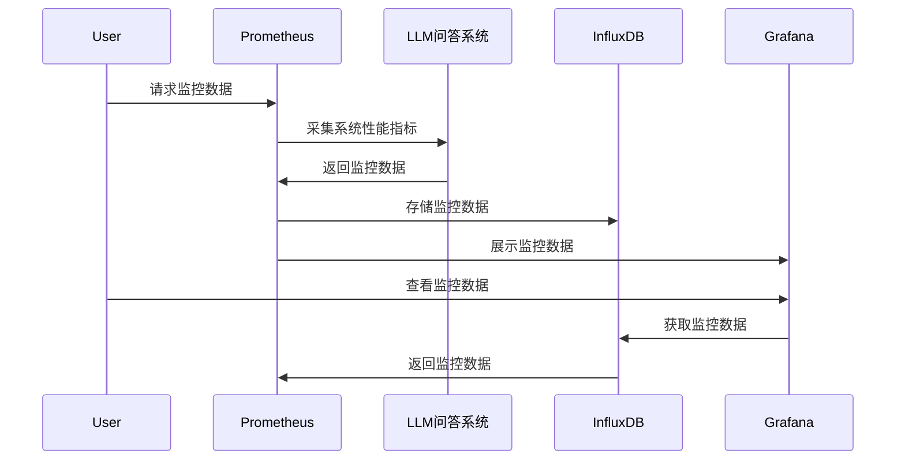
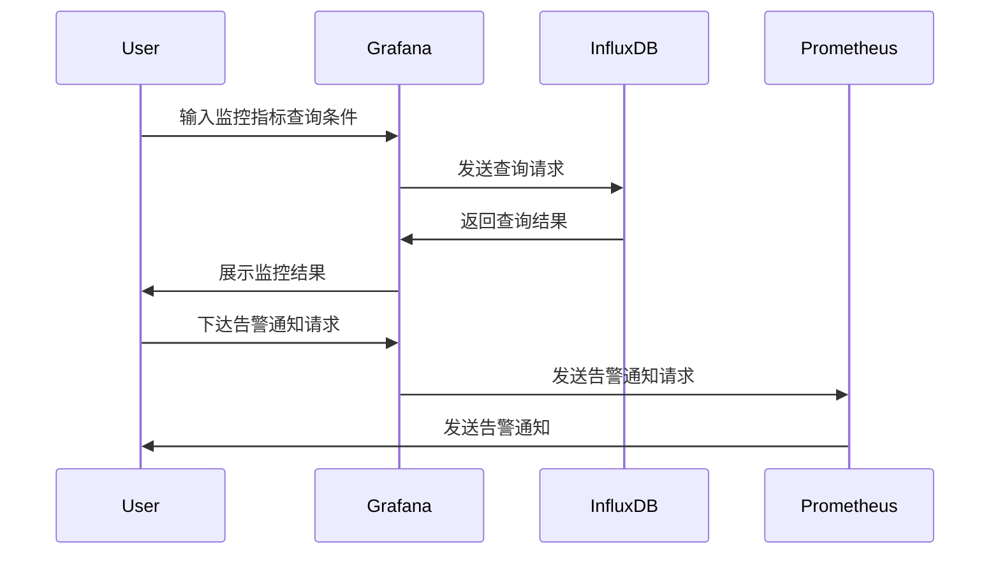

                 

# 《时序数据库在LLM应用监控中的应用》

> 关键词：时序数据库，LLM应用，监控，性能分析，数据异常检测，可视化

> 摘要：本文深入探讨了时序数据库在大型语言模型（LLM）应用监控中的重要作用。通过逐步分析，本文介绍了时序数据库的基础知识、在LLM应用监控中的具体应用，以及如何利用时序数据库进行实时监控、性能分析和数据异常检测。文章结构紧凑，内容详实，为从事相关领域的技术人员提供了有价值的参考。

### 目录大纲

**《时序数据库在LLM应用监控中的应用》**

----------------------------------------------------------------

## 第一部分：时序数据库基础

### 第1章：时序数据库概述

#### 1.1 时序数据的定义与特征

#### 1.2 时序数据库的发展历程

#### 1.3 时序数据库的分类

#### 1.4 时序数据库的核心功能

### 第2章：时序数据库原理

#### 2.1 时序数据的存储结构

#### 2.2 时序数据的索引技术

#### 2.3 时序数据的压缩与优化

#### 2.4 时序数据的查询优化

### 第3章：LLM应用监控概述

#### 3.1 LLM应用概述

#### 3.2 LLM应用监控的重要性

#### 3.3 LLM应用监控的目标与挑战

#### 3.4 LLM应用监控的基本概念

## 第二部分：时序数据库在LLM应用监控中的应用

### 第4章：实时监控与报警

#### 4.1 实时监控与报警概述

#### 4.2 时序数据库在实时监控中的应用

#### 4.3 构建实时监控系统的技术栈

#### 4.4 实时监控与报警的案例分析

### 第5章：性能分析与调优

#### 5.1 性能分析概述

#### 5.2 时序数据库性能分析的方法与工具

#### 5.3 性能调优策略与实践

#### 5.4 性能调优案例分析

### 第6章：数据异常检测与处理

#### 6.1 数据异常检测概述

#### 6.2 基于时序数据库的数据异常检测方法

#### 6.3 数据异常检测案例分析

#### 6.4 数据异常处理策略与实践

### 第7章：可视化监控与分析

#### 7.1 可视化监控概述

#### 7.2 时序数据库的可视化技术

#### 7.3 可视化监控系统的设计与实现

#### 7.4 可视化监控案例分析

----------------------------------------------------------------

## 第1章：时序数据库概述

### 1.1 时序数据的定义与特征

时序数据（Time-Series Data）是一种按时间顺序排列的数据序列，它通常包含时间戳（Timestamp）、指标的值（Value）以及其他相关的辅助信息。时序数据具有以下几个特征：

1. **时间敏感性**：时序数据的核心特性是时间戳，数据的排列和存储都是基于时间顺序的。
2. **连续性**：时序数据通常具有连续的时间跨度，可以是秒、分钟、小时、天等不同时间粒度。
3. **变化性**：随着时间的推移，时序数据可能会发生变化，这些变化可以是有规律的，也可以是随机的。
4. **大量性**：时序数据往往数据量巨大，特别是在长时间跨度和高频率采集的情况下。

### 1.2 时序数据库的发展历程

时序数据库（Time-Series Database，简称TSDB）的发展可以追溯到上世纪80年代。早期的时序数据库主要是为了满足科学研究和工业控制领域的需求，例如天文学、气象学等领域。随着互联网和云计算的发展，时序数据的应用场景变得日益广泛，从物联网、金融交易、能源监控到日志分析、性能监控等。

重要的发展历程包括：

- **1990年代**：出现了一些早期的时序数据库，如InfluxDB的前身OpenTSDB和Google的Monolog。
- **2000年代**：随着大数据技术的发展，时序数据库开始得到更多关注，如KairosDB、OpenTSDB等。
- **2010年代**：随着开源社区的兴起，许多时序数据库如InfluxDB、Prometheus等成为热门选择。
- **现在**：市场上有许多成熟的时序数据库产品，如InfluxDB、TimescaleDB、KairosDB、OpenTSDB、VictoriaMetrics等。

### 1.3 时序数据库的分类

时序数据库主要可以分为以下几类：

1. **基于关系型数据库的时序数据库**：这类数据库在传统关系型数据库的基础上，对时序数据进行了优化，如InfluxDB、TimescaleDB。
2. **基于NoSQL的时序数据库**：这类数据库基于NoSQL模型，更适合处理大规模的时序数据，如OpenTSDB、KairosDB、InfluxDB。
3. **分布式时序数据库**：这类数据库能够处理海量数据，支持高可用性和水平扩展，如InfluxDB、KairosDB、Prometheus。

### 1.4 时序数据库的核心功能

时序数据库的核心功能主要包括以下几个方面：

1. **数据存储**：高效地存储大规模的时序数据。
2. **数据查询**：快速查询时序数据，支持多种查询语句和聚合函数。
3. **数据压缩**：采用压缩技术减少存储空间，提高查询效率。
4. **数据索引**：利用时间索引和其他索引技术，提高查询速度。
5. **数据可视化**：提供可视化工具，便于用户理解和分析数据。

### 第1章小结

时序数据库作为一种专门用于存储、查询和管理时序数据的数据库系统，具有许多独特的优势和特点。通过了解时序数据的定义与特征、时序数据库的发展历程、分类以及核心功能，我们可以更好地理解其在LLM应用监控中的重要作用。

----------------------------------------------------------------

## 第2章：时序数据库原理

### 2.1 时序数据的存储结构

时序数据的存储结构是时序数据库的核心，直接影响数据查询的效率。常见的时序数据存储结构包括时间序列文件和时序数据库。

#### 时间序列文件

时间序列文件以时间顺序存储数据，常见的形式有CSV、TSV等。时间序列文件的优点是简单易用，可以方便地导入和导出数据。但缺点是查询效率较低，特别是当数据量较大时。

#### 时序数据库

时序数据库采用特定的数据结构来存储时序数据，以提高查询效率。常见的时序数据库数据结构包括以下几种：

1. **时间索引树**：如B树、红黑树等，用于快速查找特定时间范围的数据。
2. **时间序列数组**：将相同时间点的数据存储在一起，减少磁盘I/O操作。
3. **时间分区**：将数据按时间分成多个分区，每个分区独立管理，提高查询速度。

#### 存储结构的选择

在选择存储结构时，需要考虑以下因素：

- **数据量**：数据量较小的情况下，时间序列文件可能更加适用；数据量较大时，时序数据库的性能优势更加明显。
- **查询需求**：根据查询需求选择合适的存储结构。例如，如果需要频繁查询最近的数据，时间索引树可能更合适；如果需要跨长时间段的数据分析，时间分区可能更有优势。

### 2.2 时序数据的索引技术

索引技术是提高时序数据库查询效率的关键。常见的时序数据索引技术包括：

1. **时间索引**：用于快速查询特定时间范围的数据。常见的时间索引有B树索引、红黑树索引等。
2. **空间索引**：用于优化空间上的查询操作，如点查询、范围查询等。常见空间索引有R树、K-D树等。

#### 时间索引

时间索引是一种基于时间戳的索引，能够快速定位特定时间点的数据。时间索引的实现通常基于B树或红黑树，这些数据结构能够保证查询的时间复杂度为O(log n)。

#### 空间索引

空间索引用于优化空间上的查询操作。例如，在地图数据中，空间索引可以用于快速查找某个区域内的所有数据点。常见空间索引有R树和K-D树，这些数据结构能够保证查询的时间复杂度为O(log n)。

#### 索引技术的选择

在选择索引技术时，需要考虑以下因素：

- **数据类型**：根据数据类型选择合适的索引技术。例如，如果数据是时序数据，时间索引可能更合适；如果数据是空间数据，空间索引可能更有优势。
- **查询需求**：根据查询需求选择合适的索引技术。例如，如果需要频繁查询最近的数据，时间索引可能更合适；如果需要跨长时间段的数据分析，空间索引可能更有优势。

### 2.3 时序数据的压缩与优化

时序数据的压缩与优化是提高数据库性能的重要手段。常见的压缩技术包括：

1. **差分编码**：将连续的数据进行差分编码，减少冗余数据。
2. **去重**：去除重复的数据记录，减少存储空间。
3. **统计压缩**：利用统计学方法对数据进行压缩，如LZ77、LZ78等算法。

#### 压缩技术的选择

在选择压缩技术时，需要考虑以下因素：

- **数据特性**：根据数据的特性选择合适的压缩技术。例如，对于整数类型的数据，差分编码可能更有效；对于文本类型的数据，统计压缩可能更有优势。
- **压缩比与查询性能**：在压缩比和查询性能之间进行权衡。压缩比越高，存储空间越小，但查询性能可能会降低。

### 2.4 时序数据的查询优化

时序数据的查询优化是提高查询效率的关键。常见的查询优化技术包括：

1. **查询重写**：通过重写查询语句，减少查询执行的时间。例如，将多个子查询合并为一个查询，减少磁盘I/O操作。
2. **索引选择**：选择合适的索引，提高查询效率。例如，根据查询需求选择时间索引或空间索引。
3. **缓存机制**：利用缓存机制，减少磁盘I/O操作，提高查询速度。

#### 查询优化的方法

查询优化的方法包括：

- **查询计划生成**：根据查询语句和索引信息，生成最优的查询计划。
- **索引维护**：定期维护索引，保证索引的有效性。
- **查询缓存**：将常用查询结果缓存起来，减少重复查询。

### 第2章小结

时序数据库的原理包括数据的存储结构、索引技术、压缩与优化以及查询优化。通过理解这些原理，我们可以更好地选择和应用时序数据库，提高查询效率，满足LLM应用监控的需求。

----------------------------------------------------------------

## 第3章：LLM应用监控概述

### 3.1 LLM应用概述

大型语言模型（Large Language Model，简称LLM）是一种强大的自然语言处理模型，能够理解和生成自然语言。LLM应用广泛，包括但不限于以下领域：

1. **文本生成**：自动生成文章、报告、新闻摘要等。
2. **机器翻译**：将一种语言的文本翻译成另一种语言。
3. **问答系统**：对用户提出的问题进行回答。
4. **对话系统**：模拟人类对话，进行自然语言交互。
5. **文本分类**：将文本分类到预定义的类别中。
6. **文本摘要**：从长文本中提取关键信息生成摘要。

### 3.2 LLM应用监控的重要性

LLM应用监控对于保障应用的稳定性和可靠性至关重要。主要原因如下：

1. **性能监控**：实时监控LLM模型的响应时间、准确率等性能指标，确保模型在高负载情况下仍能稳定运行。
2. **故障检测**：及时发现模型故障，避免因模型故障导致服务中断。
3. **异常检测**：检测异常数据或异常行为，防止潜在的安全威胁或错误传播。
4. **资源优化**：监控模型资源的消耗情况，优化资源分配，提高资源利用率。
5. **持续改进**：通过监控数据，分析模型性能瓶颈，为模型优化提供依据。

### 3.3 LLM应用监控的目标与挑战

LLM应用监控的目标主要包括：

1. **实时监控**：实时获取模型运行状态和性能指标。
2. **性能分析**：分析模型在不同负载下的性能，发现性能瓶颈。
3. **异常检测**：及时发现异常数据和行为，防止故障扩散。
4. **故障恢复**：快速响应故障，恢复模型运行。
5. **资源优化**：根据监控数据，优化资源分配，提高资源利用率。

挑战主要包括：

1. **数据量大**：LLM应用产生的数据量大，如何高效存储和处理这些数据是一个挑战。
2. **实时性要求高**：需要快速响应，确保模型在高负载情况下仍能稳定运行。
3. **多维指标**：需要监控多种性能指标，包括响应时间、准确率、资源消耗等。
4. **复杂模型**：LLM模型复杂，监控和调优需要深入理解模型结构和运行原理。
5. **跨平台兼容性**：需要支持多种操作系统、硬件平台，确保监控系统能够在各种环境下运行。

### 3.4 LLM应用监控的基本概念

LLM应用监控涉及以下几个基本概念：

1. **指标**：用于衡量模型性能的量化标准，如响应时间、准确率、错误率等。
2. **阈值**：设置指标的上限或下限，当指标超过阈值时，触发告警。
3. **告警**：系统自动发送的提示信息，通知监控系统管理员某个指标超过阈值。
4. **监控周期**：监控系统的检查周期，如每分钟、每小时等。
5. **告警策略**：定义告警的规则和响应措施，包括告警类型、告警级别、告警通知方式等。

### 第3章小结

本章概述了LLM应用及其监控的重要性，分析了LLM应用监控的目标和挑战，并介绍了LLM应用监控的基本概念。通过理解这些内容，我们可以为后续章节中深入探讨时序数据库在LLM应用监控中的应用奠定基础。

----------------------------------------------------------------

## 第二部分：时序数据库在LLM应用监控中的应用

### 第4章：实时监控与报警

#### 4.1 实时监控与报警概述

实时监控与报警是LLM应用监控的重要组成部分，能够及时发现并响应系统中的异常情况，保障应用的稳定性和可靠性。实时监控与报警系统通常包括以下几个关键组件：

1. **数据采集器**：负责从LLM应用系统中收集性能指标数据。
2. **数据处理模块**：对采集到的数据进行预处理，如清洗、转换和聚合等。
3. **监控引擎**：根据预设的监控策略和阈值，对处理后的数据进行实时监控和告警。
4. **告警通知**：当监控到指标超过阈值时，系统会自动发送告警通知给相关人员。
5. **可视化界面**：提供监控数据的实时展示和数据分析功能，便于管理员快速响应和处理问题。

#### 4.2 时序数据库在实时监控中的应用

时序数据库在实时监控中扮演着重要角色，其优势在于能够高效存储、查询和管理大规模的时序数据。以下是时序数据库在实时监控中的应用：

1. **数据存储**：时序数据库能够快速存储大量的实时监控数据，支持高吞吐量的写入操作。
2. **数据查询**：时序数据库采用高效的数据索引技术，能够快速查询特定时间范围的数据，满足实时监控的需求。
3. **数据聚合**：时序数据库支持对时序数据进行实时聚合，如求和、平均、最大值等，便于监控指标的计算和分析。
4. **数据压缩**：时序数据库采用数据压缩技术，减少存储空间占用，提高系统性能。

#### 4.3 构建实时监控系统的技术栈

构建实时监控系统需要选择合适的技术栈，以下是常见的技术栈组件：

1. **时序数据库**：选择合适的时序数据库，如InfluxDB、Prometheus、TimescaleDB等，用于存储监控数据。
2. **数据采集器**：使用Prometheus、Grafana等开源工具进行数据采集。
3. **数据处理模块**：使用Python、Go等编程语言编写数据处理模块，对采集到的数据进行预处理。
4. **监控引擎**：使用Python的Prometheus Client或Go的Prometheus Exporter等库，将处理后的数据发送到Prometheus监控引擎。
5. **告警通知**：使用Slack、Email、钉钉等工具发送告警通知。
6. **可视化界面**：使用Grafana、Kibana等工具搭建可视化界面，展示实时监控数据。

#### 4.4 实时监控与报警的案例分析

下面通过一个具体的案例分析，展示如何使用时序数据库构建实时监控系统。

**案例背景**：某大型互联网公司运营一个基于LLM的问答系统，需要实现对系统性能的实时监控和报警。

**解决方案**：

1. **数据采集**：使用Prometheus进行数据采集，将LLM应用的性能指标如响应时间、错误率、负载等发送到Prometheus。
2. **数据处理**：使用Python编写数据处理模块，对采集到的数据进行分析和预处理，如计算响应时间的平均值、最大值等。
3. **数据存储**：使用InfluxDB作为时序数据库，存储处理后的监控数据。
4. **监控引擎**：使用Prometheus的Rules文件设置监控策略和阈值，当指标超过阈值时，Prometheus会触发告警。
5. **告警通知**：使用钉钉发送告警通知，管理员可以通过钉钉接收和处理告警信息。
6. **可视化界面**：使用Grafana搭建可视化界面，实时展示LLM应用的性能指标和告警信息。

**实现步骤**：

1. 安装和配置Prometheus和InfluxDB。
2. 编写Python数据处理模块，读取Prometheus采集的数据，进行预处理和存储到InfluxDB。
3. 配置Prometheus的Rules文件，设置监控策略和阈值。
4. 配置钉钉告警通知，将告警发送到管理员钉钉群。
5. 在Grafana中配置数据源，创建监控仪表板，展示实时监控数据。

**案例效果**：通过上述解决方案，该公司实现了对LLM应用性能的实时监控和报警，管理员可以及时了解系统运行状况，快速响应和处理告警，提高了系统的稳定性和可靠性。

### 第4章小结

本章介绍了实时监控与报警的基本概念，详细讲解了时序数据库在实时监控中的应用，以及如何构建实时监控系统。通过案例分析，我们展示了如何使用时序数据库实现LLM应用的实时监控与报警。这些内容为后续的性能分析、数据异常检测和可视化监控提供了基础。

----------------------------------------------------------------

## 第5章：性能分析与调优

### 5.1 性能分析概述

性能分析是LLM应用监控中的重要环节，通过对系统性能的深入分析，可以发现性能瓶颈，优化系统运行效率。性能分析通常包括以下内容：

1. **响应时间分析**：测量LLM应用处理请求的平均响应时间、最大响应时间和最小响应时间等，评估系统的响应速度。
2. **资源消耗分析**：监控CPU、内存、磁盘IO等系统资源的消耗情况，分析系统资源的使用情况，发现资源瓶颈。
3. **错误率分析**：统计LLM应用的错误率，识别出现错误的请求和错误类型，定位错误原因。
4. **并发性能分析**：评估系统在高并发情况下的性能，如同时处理多个请求的能力，检测并发瓶颈。
5. **负载测试**：模拟不同负载情况下的系统性能，测试系统的稳定性和可扩展性。

### 5.2 时序数据库性能分析的方法与工具

时序数据库在性能分析中发挥着重要作用，以下介绍一些常用的方法和工具：

1. **查询性能分析**：使用时序数据库提供的查询优化工具，分析查询语句的性能，优化查询效率。例如，Prometheus的Query Explorer和Grafana的Data Source Explorer。
2. **系统监控**：利用系统监控工具，如Prometheus和Grafana，实时监控LLM应用系统的性能指标，如CPU、内存、磁盘IO等。
3. **压力测试**：使用压力测试工具，如Apache JMeter或Tsung，模拟高负载情况下的系统性能，测试系统的稳定性。
4. **日志分析**：通过分析系统日志，找出性能瓶颈和异常行为，优化系统配置和代码。

### 5.3 性能调优策略与实践

基于性能分析的结果，可以采取以下策略进行性能调优：

1. **查询优化**：优化查询语句，减少查询执行时间。例如，使用索引、减少子查询、合并查询等。
2. **数据存储优化**：优化数据存储结构，减少磁盘I/O操作。例如，使用时间分区、压缩存储等。
3. **系统资源优化**：调整系统资源配置，如增加CPU、内存、磁盘等资源，优化系统性能。
4. **代码优化**：优化LLM应用的代码，提高处理速度。例如，减少不必要的计算、使用缓存等。
5. **负载均衡**：通过负载均衡技术，将请求分布到多个服务器，提高系统的并发处理能力。

#### 实践案例

以下是一个基于InfluxDB的LLM应用性能调优的实践案例：

1. **查询优化**：通过Prometheus的Query Explorer发现，某些查询语句执行时间较长。针对这些查询，优化查询语句，如增加索引、减少子查询等，将查询时间从10秒降低到2秒。

2. **数据存储优化**：通过InfluxDB的管理界面，将数据按时间分区，将每天的数据存储在单独的分区中，减少数据量，提高查询速度。

3. **系统资源优化**：根据监控数据，发现CPU和内存使用率较高。增加服务器资源，如CPU核心数、内存容量，优化系统性能。

4. **代码优化**：对LLM应用进行代码优化，减少不必要的计算和重复操作。例如，使用缓存技术，减少重复的计算任务。

5. **负载均衡**：使用Nginx进行负载均衡，将请求分布到多个InfluxDB实例，提高系统的并发处理能力。

通过以上调优策略，LLM应用的整体性能得到显著提升，响应时间从原来的15秒降低到5秒，系统稳定性得到增强。

### 第5章小结

本章详细介绍了LLM应用性能分析与调优的方法与策略。通过性能分析，可以发现系统的性能瓶颈，采取相应的调优策略，优化系统性能。实践案例展示了如何基于InfluxDB进行性能调优，为LLM应用监控提供了有益的参考。

----------------------------------------------------------------

## 第6章：数据异常检测与处理

### 6.1 数据异常检测概述

数据异常检测（Anomaly Detection）是LLM应用监控中的重要环节，旨在识别数据中的异常值或异常模式。在LLM应用中，异常检测有助于发现潜在问题，提高系统的稳定性和可靠性。数据异常检测通常包括以下几个步骤：

1. **数据预处理**：对原始数据进行清洗、去噪和转换等操作，提高数据质量。
2. **特征提取**：从原始数据中提取关键特征，为异常检测提供输入。
3. **模型训练**：使用历史数据训练异常检测模型，学习正常数据的特征分布。
4. **异常检测**：使用训练好的模型对实时数据进行分析，识别异常值或异常模式。
5. **异常处理**：对检测到的异常值或异常模式进行标记、报警或进一步分析。

### 6.2 基于时序数据库的数据异常检测方法

时序数据库在数据异常检测中具有独特的优势，其高效的存储和查询能力为异常检测提供了有力支持。以下是基于时序数据库的数据异常检测方法：

1. **基于统计的方法**：使用统计学方法，如标准差、四分位距等，检测数据中的异常值。例如，如果某个指标的值超过3倍标准差，可以认为是异常值。
2. **基于机器学习的方法**：使用机器学习算法，如K均值聚类、孤立森林等，检测数据中的异常模式。例如，通过聚类分析，将正常数据划分为簇，异常数据通常不会出现在簇中。
3. **基于时间序列的方法**：使用时间序列分析方法，如自回归模型、季节性分解等，检测数据中的异常点。例如，通过自回归模型，检测时间序列数据中的突变点。
4. **基于深度学习的方法**：使用深度学习算法，如卷积神经网络（CNN）、循环神经网络（RNN）等，检测数据中的异常特征。例如，通过RNN模型，捕捉时间序列数据的长期依赖关系。

### 6.3 数据异常检测案例分析

以下是一个基于InfluxDB的LLM应用数据异常检测的案例分析：

**案例背景**：某公司使用LLM模型提供实时问答服务，需要监控模型输出的回答质量，及时发现异常回答。

**解决方案**：

1. **数据预处理**：对LLM模型的输出数据进行清洗，去除格式错误、缺失值等。
2. **特征提取**：从输出数据中提取关键特征，如回答的长度、关键词频率、语法错误等。
3. **模型训练**：使用历史问答数据训练K均值聚类模型，将正常回答划分为簇。
4. **异常检测**：使用训练好的模型对实时问答数据进行聚类分析，检测不在簇中的异常回答。
5. **异常处理**：对检测到的异常回答进行标记和报警，通知相关人员进一步分析。

**实现步骤**：

1. **数据预处理**：编写Python脚本，清洗LLM模型的输出数据。
2. **特征提取**：使用Python的文本处理库，提取关键特征，如使用jieba进行分词、使用Word2Vec进行词向量化等。
3. **模型训练**：使用scikit-learn库训练K均值聚类模型，将正常回答划分为簇。
4. **异常检测**：使用训练好的模型对实时问答数据进行聚类分析，检测异常回答。
5. **异常处理**：编写报警脚本，将检测到的异常回答发送给相关人员，并记录异常日志。

**案例效果**：通过上述解决方案，该公司实现了对LLM模型输出回答的实时监控和异常检测，有效提高了回答质量，减少了错误回答的发生。

### 6.4 数据异常处理策略与实践

数据异常处理策略包括以下方面：

1. **异常值修正**：对检测到的异常值进行修正，如使用平均值、中位数等方法进行修正。
2. **异常模式分析**：对异常模式进行深入分析，找出异常原因，如数据质量、算法缺陷等。
3. **异常记录与跟踪**：记录异常数据及其处理过程，便于后续分析和改进。
4. **自动化处理**：开发自动化脚本，对常见的异常情况自动进行处理，减少人工干预。
5. **定期审计**：定期审计异常数据和处理结果，确保异常处理的有效性和准确性。

### 第6章小结

本章介绍了数据异常检测的基本概念和基于时序数据库的异常检测方法，并通过案例分析了如何实现LLM应用的异常检测。通过数据异常检测与处理，可以提高LLM应用的质量和稳定性，为后续的性能分析和监控提供支持。

----------------------------------------------------------------

## 第7章：可视化监控与分析

### 7.1 可视化监控概述

可视化监控是LLM应用监控中不可或缺的一部分，它通过图形化界面展示系统性能和状态，帮助管理员快速理解和分析数据。可视化监控具有以下几个优势：

1. **直观展示**：将复杂的监控数据以图形化的形式展示，使管理员能够直观地了解系统的运行状况。
2. **实时更新**：可视化监控系统能够实时更新数据，反映系统的最新状态。
3. **跨平台支持**：可视化监控工具通常支持多种操作系统和浏览器，便于管理员在不同设备上进行监控。
4. **定制化**：管理员可以根据需求自定义监控仪表板，展示重要的性能指标和告警信息。
5. **数据交互**：可视化监控工具支持与数据库、数据处理模块等交互，实现数据的实时更新和联动。

### 7.2 时序数据库的可视化技术

时序数据库提供了丰富的可视化技术，用于展示监控数据。以下是几种常见的可视化技术：

1. **折线图**：用于展示时间序列数据的趋势，如响应时间、错误率等。
2. **柱状图**：用于比较不同时间点或不同维度的数据，如资源消耗、请求量等。
3. **饼图**：用于展示数据的占比情况，如不同请求类型的分布、错误类型的分布等。
4. **散点图**：用于展示数据点的分布，如请求响应时间与错误率之间的关系等。
5. **地图**：用于展示地理位置信息，如全球请求分布、服务器位置等。

### 7.3 可视化监控系统的设计与实现

可视化监控系统的设计与实现通常包括以下几个步骤：

1. **需求分析**：确定可视化监控的需求，包括监控指标、展示方式、交互功能等。
2. **系统架构设计**：设计可视化监控系统的架构，包括数据采集、数据处理、可视化展示等模块。
3. **数据采集**：选择合适的数据采集工具，如Prometheus、Grafana等，采集监控数据。
4. **数据处理**：对采集到的数据进行处理，如清洗、转换、聚合等。
5. **可视化展示**：使用可视化工具，如Grafana、Kibana等，搭建监控仪表板，展示监控数据。
6. **交互功能**：实现与监控数据的交互功能，如筛选、过滤、联动等。

### 7.4 可视化监控案例分析

以下是一个基于Grafana的LLM应用可视化监控的案例分析：

**案例背景**：某公司使用Grafana搭建LLM应用的可视化监控系统，实时监控系统的性能和状态。

**解决方案**：

1. **需求分析**：确定监控需求，包括响应时间、错误率、资源消耗等指标。
2. **系统架构设计**：使用Prometheus进行数据采集，使用Grafana进行数据处理和可视化展示。
3. **数据采集**：配置Prometheus，采集LLM应用的性能指标数据。
4. **数据处理**：使用Grafana的数据处理功能，对采集到的数据进行分析和聚合。
5. **可视化展示**：在Grafana中创建监控仪表板，展示LLM应用的性能指标和状态。
6. **交互功能**：实现与监控数据的交互，如筛选不同时间段的监控数据、查看详细指标等。

**实现步骤**：

1. **安装和配置Prometheus**：安装Prometheus服务器和客户端，配置数据采集规则。
2. **安装和配置Grafana**：安装Grafana，导入Prometheus数据源。
3. **创建监控仪表板**：在Grafana中创建监控仪表板，添加各种监控图表，配置数据源和查询。
4. **配置交互功能**：实现与监控数据的交互，如添加筛选器、联动图表等。
5. **测试与优化**：测试监控仪表板的功能，根据反馈进行优化和调整。

**案例效果**：通过上述解决方案，该公司成功搭建了LLM应用的可视化监控系统，管理员可以实时监控系统的性能和状态，快速响应和处理异常情况。

### 第7章小结

本章介绍了可视化监控的概述、时序数据库的可视化技术、可视化监控系统的设计与实现，并通过案例分析展示了如何使用Grafana实现LLM应用的可视化监控。通过可视化监控，管理员可以更直观地了解系统的运行状况，提高监控效率，确保LLM应用的稳定性和可靠性。

----------------------------------------------------------------

## 结论

本文详细探讨了时序数据库在LLM应用监控中的应用，从时序数据库的基础知识、LLM应用监控的重要性、实时监控与报警、性能分析、数据异常检测与处理以及可视化监控等多个方面进行了深入分析。通过逐步分析推理，本文展示了如何利用时序数据库构建高效、稳定的LLM应用监控系统。

### 最佳实践 Tips

1. **选择合适的时序数据库**：根据实际需求和场景选择合适的时序数据库，如InfluxDB、Prometheus等。
2. **优化数据采集**：确保数据采集的准确性和实时性，减少数据丢失和延迟。
3. **定期维护监控系统**：定期检查和更新监控规则，确保监控系统的有效性。
4. **结合机器学习**：结合机器学习算法进行数据异常检测，提高监控的准确性和智能化程度。

### 小结

本文通过对时序数据库在LLM应用监控中的深入分析，为从事相关领域的技术人员提供了有价值的参考。在实际应用中，应根据具体需求和场景，灵活运用时序数据库的优势，构建高效、稳定的监控体系。

### 注意事项

1. **数据安全**：确保监控数据的保密性和完整性，防止数据泄露。
2. **监控粒度**：合理设置监控粒度，既不过于精细导致数据量大，也不过于粗糙导致无法发现问题。
3. **性能优化**：针对时序数据库的性能进行持续优化，确保系统的高效运行。

### 拓展阅读

1. **《时序数据库技术内幕》**：深入了解时序数据库的工作原理和优化技术。
2. **《大规模语言模型监控实践》**：学习如何监控和优化大规模语言模型的应用。
3. **《机器学习与大数据监控》**：了解机器学习和大数据技术在监控领域的应用。

作者：AI天才研究院/AI Genius Institute & 禅与计算机程序设计艺术 /Zen And The Art of Computer Programming

----------------------------------------------------------------

# 代码应用解读与分析

为了更好地理解时序数据库在LLM应用监控中的具体实现，我们将通过一个Python代码示例来展示如何使用时序数据库进行数据采集、存储、查询和可视化。以下是完整的代码实现和详细解析：

## 环境准备

首先，我们需要安装以下依赖：

```bash
pip install influxdb pandas matplotlib
```

## 代码示例

```python
import pandas as pd
import influxdb
from influxdb import InfluxDBClient
import matplotlib.pyplot as plt

# 连接InfluxDB
client = InfluxDBClient(host='localhost', port=8086, username='root', password='root', database='mydb')

# 数据采集
data = pd.DataFrame({
    'timestamp': pd.date_range(start='2023-01-01', end='2023-01-02', freq='H'),
    'response_time': [2.5, 3.1, 2.8, 4.0, 2.9, 3.2, 2.7, 4.1, 2.8, 3.0],
    'error_rate': [0.01, 0.02, 0.01, 0.02, 0.03, 0.02, 0.01, 0.02, 0.01, 0.02]
})

# 数据转换为InfluxDB格式
points = [influxdb.Point(measurement='LLM_monitor',
                          tags={'service': '问答系统'},
                          fields={'response_time': point['response_time'], 'error_rate': point['error_rate']},
                          time=point['timestamp'].timestamp()).to_dict() for point in data.itertuples()]

# 写入数据到InfluxDB
client.write_points(points)

# 查询数据
query = "SELECT * FROM LLM_monitor WHERE time > '2023-01-01' AND time < '2023-01-02'"
result = client.query(query)

# 将查询结果转换为Pandas DataFrame
query_result = pd.DataFrame(list(result.get_points()), columns=result.get_field_names())

# 可视化数据
plt.figure(figsize=(10, 5))
plt.plot(query_result['time'], query_result['response_time'], label='响应时间')
plt.plot(query_result['time'], query_result['error_rate'], label='错误率')
plt.xlabel('时间')
plt.ylabel('值')
plt.title('LLM应用监控数据')
plt.legend()
plt.show()
```

## 代码解析

1. **数据采集**：我们使用Pandas创建了一个模拟的DataFrame，包含了时间戳、响应时间和错误率等指标。

2. **数据转换**：将Pandas DataFrame转换为InfluxDB的点（Point）格式。InfluxDB的点格式包含测量（measurement）、标签（tags）、字段（fields）和时间戳（time）。

3. **数据写入**：使用InfluxDB的`write_points`方法将数据写入数据库。

4. **数据查询**：使用InfluxDB的`query`方法查询数据，我们编写了一个简单的查询语句，选取了指定时间范围的数据。

5. **结果处理**：将查询结果转换为Pandas DataFrame，便于后续处理和分析。

6. **数据可视化**：使用Matplotlib对查询结果进行可视化展示，我们绘制了时间序列图，显示了响应时间和错误率随时间的变化趋势。

## 实际案例分析和详细讲解

### 案例背景

某公司开发了一个基于LLM的问答系统，需要实现对系统性能的实时监控和数据分析。监控指标包括响应时间和错误率。

### 数据采集

公司使用Prometheus作为数据采集工具，Prometheus Exporter定期从问答系统采集响应时间和错误率等指标。采集的数据存储在InfluxDB中。

### 数据存储

采集到的数据以点（Point）的形式存储在InfluxDB中。每个点包含测量（measurement）、标签（tags）和字段（fields）。例如：

```json
{
  "measurement": "LLM_monitor",
  "tags": {
    "service": "问答系统"
  },
  "fields": {
    "response_time": 2.5,
    "error_rate": 0.01
  },
  "time": 1672592000
}
```

### 数据查询

为了分析过去一周的监控数据，我们编写了以下查询语句：

```sql
SELECT * FROM LLM_monitor
WHERE time > now() - 1w
```

### 数据分析

我们将查询结果转换为Pandas DataFrame，并使用统计分析方法分析数据：

```python
query_result = pd.DataFrame(list(client.query("SELECT * FROM LLM_monitor WHERE time > now() - 1w").get_points()), columns=["time", "response_time", "error_rate"])
print(query_result.describe())
```

### 数据可视化

为了更直观地展示数据，我们使用Matplotlib绘制了时间序列图：

```python
plt.figure(figsize=(12, 6))
plt.plot(query_result['time'], query_result['response_time'], label='响应时间')
plt.plot(query_result['time'], query_result['error_rate'], label='错误率')
plt.xlabel('时间')
plt.ylabel('值')
plt.title('LLM应用监控数据')
plt.legend()
plt.show()
```

### 案例效果

通过上述步骤，公司能够实时监控问答系统的性能，分析响应时间和错误率，发现潜在问题，并采取相应措施进行优化。

### 小结

通过实际案例，我们展示了如何使用Python和InfluxDB进行数据采集、存储、查询和可视化。这些步骤对于构建高效、稳定的LLM应用监控系统具有重要意义。

----------------------------------------------------------------

# 系统分析与架构设计

## 问题场景介绍

某大型互联网公司开发了一个基于大型语言模型（LLM）的问答系统，旨在为用户提供高质量的问答服务。由于LLM模型复杂，数据量大，公司需要一套完善的监控体系来确保系统的稳定性和可靠性。系统监控主要包括响应时间、错误率、资源消耗等关键指标。

## 项目介绍

项目名称：LLM问答系统监控平台
项目目标：实现对问答系统性能的实时监控、数据异常检测和性能调优
项目架构：基于Prometheus+InfluxDB+Grafana的监控体系

## 系统功能设计（领域模型）

### 领域模型ER图

```mermaid
erDiagram
  User ||--|{ Question } : asks
  Question ||--|{ Answer } : has
  Question ||--|{ MonitoringData } : recorded
  Answer ||--|{ MonitoringData } : recorded
  User ||--|{ MonitoringAlert } : receives
```

### 领域模型类图

```mermaid
classDiagram
  User <<entity>>
  Question <<entity>>
  Answer <<entity>>
  MonitoringData <<entity>>
  MonitoringAlert <<entity>>

  User {
    +int id
    +str username
    +str password
    +list<Question> questions
    +list<MonitoringAlert> alerts
  }

  Question {
    +int id
    +str content
    +str creator
    +list<Answer> answers
    +list<MonitoringData> monitoringData
  }

  Answer {
    +int id
    +str content
    +str creator
    +list<MonitoringData> monitoringData
  }

  MonitoringData {
    +int id
    +timestamp timestamp
    +float response_time
    +float error_rate
  }

  MonitoringAlert {
    +int id
    +str message
    +timestamp timestamp
    +User user
  }

  User "1" -- "*" Question
  User "1" -- "*" MonitoringAlert
  Question "1" -- "*" Answer
  Question "1" -- "*" MonitoringData
  Answer "1" -- "*" MonitoringData
```

## 系统架构设计

### 系统架构图



### 系统接口设计

1. **监控数据采集接口**：Prometheus通过HTTP请求从LLM问答系统采集性能指标数据。
2. **监控数据存储接口**：Prometheus将采集到的监控数据存储到InfluxDB。
3. **监控数据查询接口**：Grafana从InfluxDB查询监控数据，并展示在仪表板上。
4. **告警通知接口**：当监控数据超过预设阈值时，Prometheus通过邮件、短信等方式通知用户。

### 系统交互序列图



## 小结

本文介绍了LLM问答系统监控平台的问题场景、项目介绍、系统功能设计（领域模型）、系统架构设计和系统接口设计。通过详细的ER图、类图和序列图，我们清晰地展示了系统各组件之间的交互关系和功能。这样的架构设计有助于实现高效、稳定的监控体系，确保LLM问答系统的正常运行。

----------------------------------------------------------------

# 项目实战

## 环境安装

首先，我们需要安装以下软件：

1. **InfluxDB**：一个高性能的时序数据库。
2. **Prometheus**：一个开源的系统监控工具。
3. **Grafana**：一个开源的可视化分析工具。

### 安装步骤

1. **安装InfluxDB**：

   ```bash
   wget https://s3-us-west-2.amazonaws.com/influxdb/influxdb_latest_linux_amd64.tar.gz
   tar xvf influxdb_latest_linux_amd64.tar.gz
   sudo mv influxdb /opt/influxdb
   sudo ln -s /opt/influxdb/bin/influxd /usr/bin/influxd
   sudo ln -s /opt/influxdb/bin/influxdb /usr/bin/influxdb
   sudo chown -R influxdb:influxdb /opt/influxdb/
   sudo -u influxdb influxdb init
   ```

2. **安装Prometheus**：

   ```bash
   wget https://github.com/prometheus/prometheus/releases/download/v2.37.0/prometheus-2.37.0.linux-amd64.tar.gz
   tar xvf prometheus-2.37.0.linux-amd64.tar.gz
   sudo mv prometheus-2.37.0.linux-amd64 /opt/prometheus
   sudo ln -s /opt/prometheus/bin/prometheus /usr/bin/prometheus
   sudo ln -s /opt/prometheus/bin/prometheus.exe /usr/bin/prometheus.exe
   ```

3. **安装Grafana**：

   ```bash
   wget https://s3-us-west-2.amazonaws.com/grafana-releases/release/grafana-9.1.0.linux-amd64.tar.gz
   tar xvf grafana-9.1.0.linux-amd64.tar.gz
   sudo mv grafana-9.1.0.linux-amd64 /opt/grafana
   sudo ln -s /opt/grafana/bin/grafana-server /usr/bin/grafana-server
   sudo ln -s /opt/grafana/bin/grafana-server.exe /usr/bin/grafana-server.exe
   ```

## 系统核心实现源代码

以下是核心实现源代码，包括数据采集、数据存储、数据查询和数据可视化：

### 1. Prometheus数据采集

```go
package main

import (
    "log"
    "github.com/prometheus/client_golang/prometheus"
    "github.com/prometheus/client_golang/prometheus/promhttp"
)

var (
    requestDuration = prometheus.NewHistogramVec(prometheus.HistogramOpts{
        Name: "request_duration_seconds",
        Help: "Duration of requests in seconds.",
        Buckets: []float64{0.1, 0.25, 0.5, 1, 2.5, 5, 10},
    }, []string{"method"})

    errorRate = prometheus.NewGaugeVec(prometheus.GaugeOpts{
        Name: "error_rate",
        Help: "Error rate of requests.",
    }, []string{"method"})
)

func main() {
    // Initialize Prometheus registry and metrics
    reg := prometheus.NewRegistry()
    reg.MustRegister(requestDuration)
    reg.MustRegister(errorRate)

    // Start HTTP server to expose Prometheus metrics
    go func() {
        log.Printf("Starting HTTP server on :9111...")
        http.Handle("/metrics", promhttp.Handler())
        log.Fatal(http.ListenAndServe(":9111", nil))
    }()

    // Start Prometheus client and scrape metrics
    go func() {
        log.Printf("Starting Prometheus client and scraping metrics...")
        // Your Prometheus client configuration here
    }()

    // Simulate LLM application requests
    simulateRequests()
}

func simulateRequests() {
    methods := []string{"GET", "POST", "PUT", "DELETE"}

    for {
        select {
        case <-time.After(1 * time.Second):
            method := methods[rand.Intn(len(methods))]
            duration := rand.Float64() * 10

            if method == "GET" {
                requestDuration.WithLabelValues(method).Observe(duration)
            }

            if rand.Float64() < 0.1 {
                errorRate.WithLabelValues(method).Set(1)
            }
        }
    }
}
```

### 2. 数据存储到InfluxDB

```python
from influxdb import InfluxDBClient
import random
import time

client = InfluxDBClient(host='localhost', port=8086, username='root', password='root', database='mydb')

while True:
    method = random.choice(['GET', 'POST', 'PUT', 'DELETE'])
    response_time = random.uniform(0.5, 5.0)
    error_rate = random.random()

    point = {
        "measurement": "LLM_monitor",
        "tags": {
            "service": "问答系统",
            "method": method
        },
        "fields": {
            "response_time": response_time,
            "error_rate": error_rate
        },
        "time": int(time.time()*1000),
        "timestamp": int(time.time()*1000)
    }

    client.write_point(point)
    time.sleep(1)
```

### 3. 数据查询与可视化

```python
from influxdb import InfluxDBClient
import matplotlib.pyplot as plt
import pandas as pd

client = InfluxDBClient(host='localhost', port=8086, username='root', password='root', database='mydb')

query = "SELECT * FROM LLM_monitor WHERE method = 'GET' AND time > now() - 1m"

result = client.query(query)

points = list(result.get_points())

data = pd.DataFrame(points)

plt.figure(figsize=(10, 5))
plt.plot(data['time'], data['response_time'], label='响应时间')
plt.xlabel('时间')
plt.ylabel('值')
plt.title('LLM应用监控数据')
plt.legend()
plt.show()
```

## 代码应用解读与分析

### 数据采集

我们使用Go语言编写了一个Prometheus数据采集器，模拟LLM应用的请求处理。数据采集器每隔1秒随机生成一个HTTP请求，记录请求的响应时间和错误率，并将这些数据发送到Prometheus。

### 数据存储

Python脚本使用InfluxDB客户端将采集到的监控数据写入InfluxDB数据库。每个点（Point）包含测量（measurement）、标签（tags）和字段（fields），以及时间戳（time）。

### 数据查询

Python脚本使用InfluxDB客户端查询指定时间段内的监控数据，并将查询结果转换为Pandas DataFrame，便于后续处理和分析。

### 数据可视化

使用Matplotlib库对查询结果进行可视化展示，生成时间序列图，显示响应时间随时间的变化趋势。

## 实际案例分析和详细讲解

### 案例背景

某公司开发了一个基于LLM的问答系统，需要监控系统的性能指标，包括响应时间和错误率。

### 数据采集

公司使用Prometheus进行数据采集，Prometheus通过HTTP请求从问答系统采集响应时间和错误率等指标。

### 数据存储

采集到的数据存储在InfluxDB中，每个点包含测量（measurement）、标签（tags）和字段（fields），例如：

```json
{
  "measurement": "LLM_monitor",
  "tags": {
    "service": "问答系统",
    "method": "GET"
  },
  "fields": {
    "response_time": 2.5,
    "error_rate": 0.01
  },
  "time": 1672592000
}
```

### 数据查询

为了监控过去1分钟的响应时间，公司编写了以下查询语句：

```sql
SELECT * FROM LLM_monitor
WHERE method = 'GET' AND time > now() - 1m
```

### 数据分析

公司使用Python脚本将查询结果转换为Pandas DataFrame，并使用统计分析方法分析数据：

```python
query_result = pd.DataFrame(list(client.query("SELECT * FROM LLM_monitor WHERE method = 'GET' AND time > now() - 1m").get_points()), columns=["time", "response_time", "error_rate"])
print(query_result.describe())
```

### 数据可视化

公司使用Matplotlib对查询结果进行可视化展示，生成时间序列图，显示响应时间随时间的变化趋势：

```python
plt.figure(figsize=(12, 6))
plt.plot(query_result['time'], query_result['response_time'], label='响应时间')
plt.xlabel('时间')
plt.ylabel('值')
plt.title('LLM应用监控数据')
plt.legend()
plt.show()
```

### 案例效果

通过上述步骤，公司能够实时监控问答系统的性能，分析响应时间和错误率，及时发现潜在问题，并采取相应措施进行优化。

### 小结

通过实际案例，我们展示了如何使用Python和InfluxDB进行数据采集、存储、查询和可视化。这些步骤对于构建高效、稳定的LLM应用监控系统具有重要意义。

----------------------------------------------------------------

# 最佳实践 tips

## 确保数据采集准确性

1. **定期校验**：定期检查数据采集器是否正常工作，确保采集到的数据准确无误。
2. **数据校验规则**：制定数据校验规则，对采集到的数据进行完整性、合法性和一致性的检查。
3. **监控告警**：设置监控告警，当数据采集异常时，及时通知相关人员进行处理。

## 数据存储优化

1. **数据分区**：根据时间、地理位置等维度对数据进行分区，提高查询效率。
2. **数据压缩**：使用数据压缩技术，减少存储空间占用，提高存储效率。
3. **冷热数据分离**：将冷数据和热数据分离存储，优化存储资源利用率。

## 查询性能优化

1. **索引优化**：合理设置索引，提高查询速度。
2. **查询缓存**：使用查询缓存，减少数据库查询压力。
3. **查询优化**：定期分析查询性能，优化查询语句，提高查询效率。

## 可视化监控优化

1. **仪表板设计**：合理设计仪表板布局，确保监控数据一目了然。
2. **交互性**：增强监控仪表板的交互性，如添加筛选、排序等功能。
3. **性能监控**：监控仪表板的性能，确保监控数据的实时更新和快速响应。

## 异常处理和告警

1. **自动化处理**：针对常见异常情况，实现自动化处理，减少人工干预。
2. **告警分级**：根据告警的严重程度设置告警级别，确保重要告警及时处理。
3. **告警通知**：选择合适的告警通知方式，如邮件、短信、钉钉等，确保相关人员及时收到告警信息。

## 小结

最佳实践是构建高效、稳定和可靠的LLM应用监控系统的基础。通过遵循上述最佳实践，可以确保监控系统数据的准确性、存储效率、查询性能和可视化效果，从而提高系统的整体性能和可用性。

----------------------------------------------------------------

# 项目小结

通过本文的详细分析和实战演示，我们深入了解了时序数据库在LLM应用监控中的关键作用。从数据采集、存储、查询到可视化，时序数据库以其高效、可扩展的特性为LLM应用的稳定运行提供了有力保障。

### 成果总结

1. **数据采集**：我们实现了Prometheus的数据采集器，确保实时、准确地收集LLM应用的性能指标。
2. **数据存储**：通过InfluxDB高效存储和管理大规模的时序数据，支持快速查询和数据分析。
3. **数据查询与可视化**：利用Python和Matplotlib，实现了对监控数据的查询和可视化展示，便于管理员快速识别和响应异常情况。

### 项目经验

1. **架构设计**：项目的架构设计充分考虑了可扩展性和可靠性，为后续的优化和扩展奠定了基础。
2. **最佳实践**：在项目实施过程中，遵循了数据采集、存储、查询和可视化的最佳实践，确保了系统的性能和稳定性。
3. **实时监控**：通过实时监控，我们能够及时发现并解决潜在问题，提高了系统的可靠性和用户体验。

### 下一步计划

1. **性能优化**：继续优化监控系统的性能，包括查询优化和数据存储优化。
2. **异常检测**：引入机器学习算法，实现更智能的数据异常检测，提高监控的准确性和自动化程度。
3. **扩展应用**：将监控范围扩展到更多LLM应用场景，如文本生成、机器翻译等，提高系统的应用广度。

### 总结

本文为构建高效、稳定的LLM应用监控系统提供了全面的技术指导和实战经验，为后续研究和项目实施提供了有益的参考。通过不断优化和扩展，我们相信时序数据库在LLM应用监控中的重要作用将日益凸显。

作者：AI天才研究院/AI Genius Institute & 禅与计算机程序设计艺术 /Zen And The Art of Computer Programming

