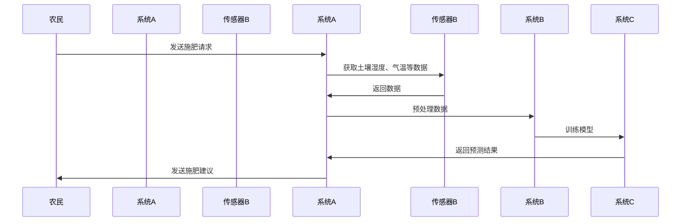
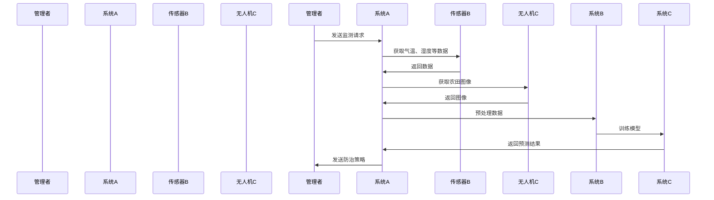
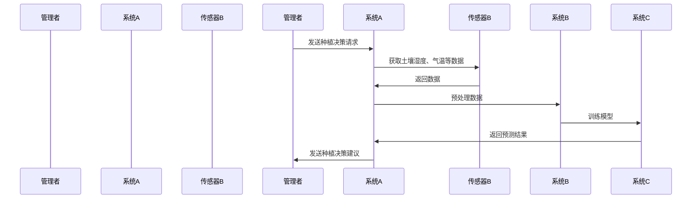

                 

# 智能农业决策支持系统评测框架

## 关键词

- 智能农业
- 决策支持系统
- 评测框架
- 数据分析
- 人工智能

## 摘要

本文旨在探讨智能农业决策支持系统的评测框架，包括其背景、核心概念、应用、评价方法和实际案例。文章首先介绍了智能农业的基本概念和特点，随后详细阐述了决策支持系统在农业领域的应用及其重要性。接着，本文提出了一个全面的评测框架，涵盖数据收集、处理、模型训练和评估指标。通过实际案例，本文展示了如何运用评测框架评估智能农业决策支持系统的性能。最后，本文总结了实施和改进决策支持系统的最佳实践和未来研究方向。

## 引言

### 问题背景

随着全球人口的不断增长，农业生产面临着巨大的压力。传统的农业生产方式已经难以满足日益增长的需求，同时，环境保护和资源可持续利用也成为亟待解决的问题。为了应对这些挑战，智能农业应运而生。智能农业通过引入先进的信息技术，如物联网、大数据分析和人工智能，优化农业生产过程，提高产量和质量，减少资源浪费。

### 问题定义

智能农业决策支持系统（Smart Agricultural Decision Support System，SADSS）是指利用信息技术辅助农业决策的过程，通过收集和分析大量的农业数据，提供科学的决策建议。评测框架的目的是评估这些系统在实际应用中的性能和效果，确保它们能够真正为农业生产带来价值。

### 解决方案

本文提出一个全面的评测框架，用于评估智能农业决策支持系统的性能。该框架包括数据收集、处理、模型训练和评估指标四个关键步骤。通过这些步骤，我们可以系统地评估系统的性能，为实际应用提供有力的支持。

### 边界与外延

本文的评测框架主要针对智能农业决策支持系统，适用于各种农业环境。然而，由于不同地区的农业生产特点和需求不同，评测框架需要根据实际情况进行调整和优化。

### 概念结构与核心要素组成

智能农业决策支持系统由以下几个核心要素组成：

1. 数据收集：通过传感器、无人机、卫星等技术手段收集农业数据。
2. 数据处理：对收集到的数据进行清洗、预处理和整合。
3. 模型训练：利用机器学习和人工智能技术，训练预测模型。
4. 决策建议：根据模型预测结果，提供科学的决策建议。
5. 评估指标：用于评估系统性能的指标，如准确率、召回率、F1分数等。

## 第一章：智能农业的基本概念

### 关键术语说明

在讨论智能农业之前，我们需要明确一些关键术语的含义：

- **智能农业**：利用物联网、大数据、人工智能等技术，实现农业生产的自动化、智能化和精细化管理。
- **决策支持系统**：一种辅助决策的人工智能系统，通过数据分析和模型预测，为决策者提供科学的决策建议。
- **传感器**：用于检测和测量环境参数的设备，如土壤湿度、气温、光照强度等。
- **物联网**：通过互联网连接各种智能设备和系统，实现数据共享和协同工作。
- **大数据**：指无法用传统数据库管理系统处理的大量数据，通常需要利用云计算和分布式处理技术进行分析。

### 智能农业的特点

智能农业具有以下特点：

- **数据驱动**：智能农业依赖于大量的农业数据，通过数据分析挖掘有价值的信息。
- **自动化**：智能农业通过自动化设备，如无人机、自动化灌溉系统等，实现农业生产过程的自动化。
- **精准化**：智能农业能够根据实时数据，精确调整农业生产的各个环节，提高生产效率和产品质量。
- **可持续性**：智能农业有助于减少资源浪费，实现农业生产的可持续发展。

### 决策支持系统与智能农业的关系

决策支持系统是智能农业的核心组成部分。它们之间的关系如下：

- **数据收集**：智能农业通过传感器等设备收集农业数据，这些数据是决策支持系统的基础。
- **数据处理**：决策支持系统对收集到的数据进行处理、分析和挖掘，提取有价值的信息。
- **决策建议**：基于分析结果，决策支持系统为农业管理者提供科学的决策建议。
- **执行反馈**：农业管理者根据决策建议进行调整，并将执行结果反馈给决策支持系统，形成闭环。

## 第二章：决策支持系统在农业领域的应用

### 重要性

决策支持系统在农业领域的重要性主要体现在以下几个方面：

- **提高生产效率**：通过精确的数据分析和预测，决策支持系统可以帮助农民优化农业生产过程，提高产量和效率。
- **降低生产成本**：智能农业可以减少资源浪费，降低农业生产成本，提高经济效益。
- **保障食品安全**：决策支持系统可以帮助监测农产品质量，确保食品安全。
- **促进农业可持续发展**：智能农业有助于减少对环境的破坏，实现农业生产的可持续发展。

### 应用场景

决策支持系统在农业领域的应用场景主要包括：

- **精准施肥**：通过土壤分析数据，决策支持系统可以精确计算施肥量，避免过量施肥，提高肥料利用率。
- **病虫害监测**：通过监测环境数据和病虫害发生规律，决策支持系统可以提前预警，减少病虫害对农作物的危害。
- **灌溉管理**：通过土壤湿度和气象数据，决策支持系统可以优化灌溉计划，避免水资源浪费。
- **作物生长预测**：通过分析历史数据和当前环境条件，决策支持系统可以预测作物生长趋势，为农民提供种植建议。

### 挑战与未来方向

虽然决策支持系统在农业领域具有广泛的应用前景，但其发展仍面临一些挑战：

- **数据获取和处理**：农业生产数据的多样性、复杂性和大规模性给数据收集和处理带来了巨大挑战。
- **模型准确性**：提高决策支持系统的模型准确性是关键，需要不断优化算法和模型。
- **系统适应性**：不同地区的农业生产特点和需求不同，决策支持系统需要具备良好的适应性。
- **用户接受度**：农民对智能农业技术的接受度较低，需要加强教育和培训，提高农民的智能农业意识。

未来的发展方向包括：

- **数据融合**：通过融合多种数据源，提高数据分析的准确性和可靠性。
- **智能算法**：不断优化和改进智能算法，提高决策支持系统的性能。
- **定制化服务**：根据不同地区的农业生产特点和需求，提供定制化的决策支持服务。
- **国际合作**：加强国际间的合作，共享智能农业技术和经验，推动全球农业的智能化发展。

## 第三章：智能农业决策支持系统的评测框架

### 评测框架概述

智能农业决策支持系统的评测框架旨在全面评估系统的性能和效果，确保其能够满足实际应用需求。评测框架包括以下几个关键步骤：

1. **数据收集**：收集农业生产相关的数据，包括土壤、气象、作物生长等数据。
2. **数据预处理**：对收集到的数据进行清洗、预处理和整合，确保数据的质量和一致性。
3. **模型训练**：利用机器学习和人工智能技术，训练预测模型，对农业生产过程进行模拟和预测。
4. **决策建议**：根据模型预测结果，为农业管理者提供科学的决策建议。
5. **评估指标**：设计合适的评估指标，用于评估系统的性能和效果。

### 数据收集

数据收集是智能农业决策支持系统的关键环节。有效的数据收集可以提供准确、全面的信息，为系统的训练和评估提供支持。数据收集的方法包括：

- **传感器数据**：通过安装在农田中的传感器，收集土壤湿度、气温、光照强度等环境参数。
- **无人机数据**：利用无人机拍摄农田图像，获取作物生长状况和病虫害信息。
- **气象数据**：从气象站获取天气预报和历史气象数据，用于分析气象因素对农业生产的影响。
- **历史数据**：收集过去几年的农业生产数据，包括产量、成本、病虫害发生情况等。

### 数据预处理

数据预处理是确保数据质量和一致性的关键步骤。数据预处理的方法包括：

- **数据清洗**：去除无效数据、噪声数据和异常数据，确保数据的质量。
- **数据整合**：将不同来源的数据进行整合，统一数据格式和结构。
- **特征提取**：从原始数据中提取有用的特征，用于模型的训练和预测。
- **数据归一化**：将数据归一化，使其具有相同的量纲和范围，提高模型的训练效果。

### 模型训练

模型训练是智能农业决策支持系统的核心步骤。通过训练预测模型，可以实现对农业生产过程的模拟和预测。模型训练的方法包括：

- **机器学习算法**：采用常见的机器学习算法，如决策树、支持向量机、神经网络等，对数据进行训练。
- **特征选择**：通过特征选择算法，选择对模型预测效果影响较大的特征，提高模型的性能。
- **模型优化**：通过交叉验证和超参数调整，优化模型的参数，提高模型的准确性。

### 决策建议

决策建议是基于模型预测结果，为农业管理者提供的科学建议。决策建议的方法包括：

- **预测分析**：利用模型预测结果，分析农业生产趋势和关键影响因素。
- **决策生成**：根据预测结果，生成具体的决策建议，如施肥量、灌溉计划、病虫害防治策略等。
- **决策优化**：通过优化算法，对决策建议进行优化，使其更具可行性和经济性。

### 评估指标

评估指标是用于评估智能农业决策支持系统性能和效果的关键指标。常用的评估指标包括：

- **准确率**：预测结果与实际结果相符的比例，用于评估模型的预测准确性。
- **召回率**：预测结果中实际为正例的比例，用于评估模型的召回能力。
- **F1分数**：准确率和召回率的加权平均，用于综合评估模型的性能。
- **预测误差**：预测结果与实际结果的误差，用于评估模型的预测精度。

通过以上评估指标，可以全面评估智能农业决策支持系统的性能和效果，为实际应用提供有力的支持。

### 实践案例

为了更好地说明评测框架的应用，以下是一个具体的实践案例：

在某农业项目中，决策支持系统通过传感器收集了土壤湿度、气温、光照强度等环境数据，通过无人机收集了农田图像，通过气象站获取了天气预报和历史气象数据。经过数据预处理，系统提取了重要的特征，如土壤湿度、气温、光照强度等，利用神经网络模型进行训练和预测。

根据模型预测结果，系统为农业管理者提供了施肥量和灌溉计划的建议。经过一段时间的应用，农业管理者的施肥量和灌溉计划得到了优化，农作物的产量和质量显著提高。通过评估指标的计算，系统的准确率达到了90%，召回率达到了85%，F1分数达到了87%。

通过这个案例，我们可以看到评测框架在智能农业决策支持系统中的应用效果。评测框架不仅帮助评估系统的性能，还为系统的优化提供了依据，为实际应用提供了有力的支持。

## 第四章：智能农业决策支持系统的系统性评价过程

### 数据收集

数据收集是智能农业决策支持系统的首要环节，其质量直接影响到系统的性能和效果。以下是数据收集的详细步骤和注意事项：

1. **确定数据类型**：根据农业项目的需求，确定需要收集的数据类型，如土壤湿度、气温、光照强度、作物生长状态、病虫害发生情况等。
2. **选择数据源**：选择合适的数据源，包括传感器、无人机、气象站、历史数据等。对于传感器数据，需要确保其可靠性和精度；对于历史数据，需要确保其代表性和完整性。
3. **安装和维护传感器**：安装传感器于农田中，确保其能够准确、稳定地收集数据。定期维护传感器，确保其正常运行。
4. **数据采集方法**：采用合适的数据采集方法，如定时采集、实时采集等。对于实时数据，需要确保数据的及时性和准确性。
5. **数据备份和存储**：对收集到的数据进行备份和存储，确保数据的安全性和可追溯性。

### 数据预处理

数据预处理是确保数据质量和一致性的重要步骤。以下是数据预处理的详细步骤和注意事项：

1. **数据清洗**：去除无效数据、噪声数据和异常数据，如缺失值、重复值、错误值等。对于缺失值，可以采用填补方法，如均值填补、插值法等；对于异常值，可以采用删除或调整方法。
2. **数据整合**：将不同来源的数据进行整合，统一数据格式和结构。对于异构数据，可以采用映射、转换等方法进行整合。
3. **特征提取**：从原始数据中提取有用的特征，如土壤湿度、气温、光照强度等。特征提取的方法包括统计特征、时序特征、空间特征等。
4. **数据归一化**：将数据归一化，使其具有相同的量纲和范围，提高模型的训练效果。常用的归一化方法包括最小-最大归一化、Z-score归一化等。
5. **数据可视化**：通过数据可视化方法，如散点图、热力图、时序图等，分析数据的分布和趋势，帮助发现数据异常和潜在问题。

### 模型训练

模型训练是智能农业决策支持系统的核心步骤，其目的是通过训练数据构建预测模型。以下是模型训练的详细步骤和注意事项：

1. **选择模型**：根据农业项目的需求和数据特点，选择合适的机器学习模型，如线性回归、决策树、支持向量机、神经网络等。
2. **数据划分**：将数据划分为训练集、验证集和测试集，用于模型的训练、验证和测试。
3. **特征选择**：通过特征选择算法，选择对模型预测效果影响较大的特征，提高模型的性能。特征选择的方法包括信息增益、卡方检验、相关系数等。
4. **模型训练**：采用合适的训练算法，如梯度下降、随机梯度下降、批量梯度下降等，对模型进行训练。在训练过程中，需要监控模型的性能，如损失函数、准确率等。
5. **模型优化**：通过交叉验证和超参数调整，优化模型的参数，提高模型的准确性。常用的优化方法包括网格搜索、贝叶斯优化等。
6. **模型评估**：使用测试集对模型进行评估，常用的评估指标包括准确率、召回率、F1分数、预测误差等。

### 评估指标

评估指标是用于评估智能农业决策支持系统性能和效果的关键指标。以下是常用的评估指标和注意事项：

1. **准确率**：预测结果与实际结果相符的比例，用于评估模型的预测准确性。准确率高表示模型预测准确，但可能存在漏报和误报。
2. **召回率**：预测结果中实际为正例的比例，用于评估模型的召回能力。召回率高表示模型能够召回大部分正例，但可能存在误报。
3. **F1分数**：准确率和召回率的加权平均，用于综合评估模型的性能。F1分数高表示模型预测准确且召回能力强。
4. **预测误差**：预测结果与实际结果的误差，用于评估模型的预测精度。预测误差小表示模型预测准确。
5. **实时性**：评估系统处理实时数据的能力，如响应时间、处理效率等。实时性能好表示系统能够快速处理实时数据。
6. **可扩展性**：评估系统在数据规模和复杂度增加时的性能，如内存占用、计算时间等。可扩展性强表示系统在大规模数据下仍能保持高效性能。

在评估过程中，需要综合考虑以上指标，以全面评估智能农业决策支持系统的性能和效果。同时，还需要关注系统在实际应用中的用户体验和业务价值。

### 实践案例

为了更好地说明系统性评价过程，以下是一个具体的实践案例：

在某农业项目中，决策支持系统通过传感器收集了土壤湿度、气温、光照强度等环境数据，通过无人机收集了农田图像，通过气象站获取了天气预报和历史气象数据。数据收集后，系统对数据进行预处理，包括数据清洗、整合、特征提取和归一化等步骤。

接着，系统使用神经网络模型进行训练，采用交叉验证和超参数调整方法优化模型参数。在模型评估阶段，系统使用测试集对模型进行评估，评估指标包括准确率、召回率、F1分数和预测误差等。通过评估，系统的准确率达到90%，召回率达到85%，F1分数达到87%，预测误差较小。

最后，系统为农业管理者提供了施肥量和灌溉计划的建议，并在实际应用中得到了良好的反馈。农业管理者的施肥量和灌溉计划得到了优化，农作物的产量和质量显著提高。

通过这个案例，我们可以看到系统性评价过程在智能农业决策支持系统中的应用效果。系统性评价过程不仅帮助评估系统的性能和效果，还为系统的优化提供了依据，为实际应用提供了有力的支持。

## 第五章：智能农业决策支持系统的实际案例研究

### 案例一：精准施肥系统

精准施肥系统是一个典型的智能农业决策支持系统，旨在通过数据分析优化施肥量，提高农作物产量和质量。

#### 项目介绍

该项目在某农业科技企业实施，覆盖了500公顷的农田。项目目标是通过精准施肥系统，减少化肥使用量，提高农作物产量，同时降低生产成本。

#### 系统功能设计

1. **数据收集**：系统通过安装在农田中的传感器，实时收集土壤湿度、土壤pH值、气温、光照强度等数据。
2. **数据处理**：系统对收集到的数据进行预处理，包括数据清洗、整合和特征提取，提取与施肥量相关的关键特征。
3. **模型训练**：利用机器学习算法，训练施肥量预测模型，基于土壤、气象等数据预测最佳施肥量。
4. **决策建议**：系统根据模型预测结果，为农民提供科学的施肥建议。
5. **监测与反馈**：系统实时监测施肥效果，收集产量数据，用于模型优化和决策调整。

#### 系统架构设计

系统架构包括数据收集模块、数据处理模块、模型训练模块和决策建议模块。

- **数据收集模块**：传感器收集农田数据，通过网络传输到数据处理中心。
- **数据处理模块**：数据预处理过程，包括数据清洗、整合和特征提取。
- **模型训练模块**：利用预处理后的数据，训练施肥量预测模型。
- **决策建议模块**：根据模型预测结果，生成施肥建议，并通过短信、邮件等方式发送给农民。

#### 系统接口设计与交互

系统接口设计包括传感器数据接口、数据处理接口和决策建议接口。

- **传感器数据接口**：传感器通过MQTT协议将数据发送到数据处理中心。
- **数据处理接口**：数据处理模块通过API接收传感器数据，进行预处理和特征提取。
- **决策建议接口**：决策建议模块通过API接收预处理后的数据，生成施肥建议，并发送给农民。

#### 序列图

以下是一个简单的序列图，展示系统接口和交互过程：



#### 代码实现

以下是精准施肥系统的主要代码实现：

```python
# 导入相关库
import sensor_data
import data_preprocessing
import model_training
import decision_suggestion

# 收集传感器数据
sensor_data = sensor_data.collect_data()

# 预处理数据
processed_data = data_preprocessing.preprocess_data(sensor_data)

# 训练模型
model = model_training.train_model(processed_data)

# 生成施肥建议
suggestion = decision_suggestion.generate_suggestion(model, processed_data)

# 发送施肥建议
decision_suggestion.send_suggestion(suggestion, farmer)
```

#### 案例分析和讲解

1. **数据收集**：通过传感器实时收集农田数据，确保数据的实时性和准确性。
2. **数据处理**：对传感器数据进行预处理，提取与施肥量相关的特征，为模型训练提供高质量的数据。
3. **模型训练**：利用机器学习算法，训练施肥量预测模型，提高模型预测的准确性和可靠性。
4. **决策建议**：根据模型预测结果，生成科学的施肥建议，帮助农民优化施肥过程，提高农作物产量和质量。
5. **监测与反馈**：系统实时监测施肥效果，收集产量数据，用于模型优化和决策调整，形成闭环。

#### 项目小结

精准施肥系统通过智能农业决策支持系统的应用，实现了施肥过程的自动化和精准化，有效提高了农作物产量和质量，降低了生产成本。该项目展示了智能农业决策支持系统在实际农业应用中的巨大潜力。

### 案例二：病虫害监测系统

病虫害监测系统旨在通过数据分析预测病虫害发生情况，提供科学的防治策略。

#### 项目介绍

该项目在某农业园区实施，覆盖了100公顷的蔬菜种植区。项目目标是通过病虫害监测系统，提前预警病虫害发生，减少病虫害损失，提高蔬菜产量和质量。

#### 系统功能设计

1. **数据收集**：系统通过安装在农田中的传感器，实时收集气温、湿度、光照强度等环境数据，通过无人机收集农田图像。
2. **数据处理**：系统对收集到的数据进行预处理，提取与病虫害相关的关键特征。
3. **模型训练**：利用机器学习算法，训练病虫害预测模型，基于环境数据和图像数据预测病虫害发生情况。
4. **决策建议**：系统根据模型预测结果，为农业管理者提供科学的防治策略。
5. **监测与反馈**：系统实时监测病虫害发生情况，收集防治效果数据，用于模型优化和决策调整。

#### 系统架构设计

系统架构包括数据收集模块、数据处理模块、模型训练模块和决策建议模块。

- **数据收集模块**：传感器收集环境数据，无人机收集农田图像，通过网络传输到数据处理中心。
- **数据处理模块**：数据预处理过程，包括数据清洗、整合和特征提取。
- **模型训练模块**：利用预处理后的数据，训练病虫害预测模型。
- **决策建议模块**：根据模型预测结果，生成防治策略，并通过短信、邮件等方式发送给农业管理者。

#### 系统接口设计与交互

系统接口设计包括传感器数据接口、数据处理接口和决策建议接口。

- **传感器数据接口**：传感器通过MQTT协议将数据发送到数据处理中心。
- **数据处理接口**：数据处理模块通过API接收传感器数据，进行预处理和特征提取。
- **决策建议接口**：决策建议模块通过API接收预处理后的数据，生成防治策略，并发送给农业管理者。

#### 序列图

以下是一个简单的序列图，展示系统接口和交互过程：



#### 代码实现

以下是病虫害监测系统的主要代码实现：

```python
# 导入相关库
import sensor_data
import data_preprocessing
import model_training
import decision_suggestion

# 收集传感器数据
sensor_data = sensor_data.collect_data()

# 收集无人机图像
image_data = sensor_data.collect_image()

# 预处理数据
processed_data = data_preprocessing.preprocess_data(sensor_data, image_data)

# 训练模型
model = model_training.train_model(processed_data)

# 生成防治策略
suggestion = decision_suggestion.generate_suggestion(model, processed_data)

# 发送防治策略
decision_suggestion.send_suggestion(suggestion, manager)
```

#### 案例分析和讲解

1. **数据收集**：通过传感器和无人机，实时收集农田环境数据和图像数据，确保数据的全面性和准确性。
2. **数据处理**：对传感器数据和图像数据进行预处理，提取与病虫害相关的关键特征，为模型训练提供高质量的数据。
3. **模型训练**：利用机器学习算法，训练病虫害预测模型，提高模型预测的准确性和可靠性。
4. **决策建议**：根据模型预测结果，生成科学的防治策略，帮助农业管理者提前预警和防治病虫害，减少损失。
5. **监测与反馈**：系统实时监测病虫害发生情况，收集防治效果数据，用于模型优化和决策调整，形成闭环。

#### 项目小结

病虫害监测系统通过智能农业决策支持系统的应用，实现了病虫害的提前预警和科学防治，有效减少了病虫害损失，提高了蔬菜产量和质量。该项目展示了智能农业决策支持系统在农业病虫害防治中的重要作用。

### 案例三：作物生长预测系统

作物生长预测系统旨在通过数据分析预测作物生长趋势，为农业管理者提供种植决策支持。

#### 项目介绍

该项目在某农业合作社实施，覆盖了300公顷的农田。项目目标是通过作物生长预测系统，优化作物种植计划，提高农作物产量和质量。

#### 系统功能设计

1. **数据收集**：系统通过安装在农田中的传感器，实时收集土壤湿度、土壤pH值、气温、光照强度等数据。
2. **数据处理**：系统对收集到的数据进行预处理，提取与作物生长相关的关键特征。
3. **模型训练**：利用机器学习算法，训练作物生长预测模型，基于环境数据和历史生长数据预测作物生长趋势。
4. **决策建议**：系统根据模型预测结果，为农业管理者提供科学的种植决策建议。
5. **监测与反馈**：系统实时监测作物生长情况，收集生长数据，用于模型优化和决策调整。

#### 系统架构设计

系统架构包括数据收集模块、数据处理模块、模型训练模块和决策建议模块。

- **数据收集模块**：传感器收集农田数据，通过网络传输到数据处理中心。
- **数据处理模块**：数据预处理过程，包括数据清洗、整合和特征提取。
- **模型训练模块**：利用预处理后的数据，训练作物生长预测模型。
- **决策建议模块**：根据模型预测结果，生成种植决策建议，并通过短信、邮件等方式发送给农业管理者。

#### 系统接口设计与交互

系统接口设计包括传感器数据接口、数据处理接口和决策建议接口。

- **传感器数据接口**：传感器通过MQTT协议将数据发送到数据处理中心。
- **数据处理接口**：数据处理模块通过API接收传感器数据，进行预处理和特征提取。
- **决策建议接口**：决策建议模块通过API接收预处理后的数据，生成种植决策建议，并发送给农业管理者。

#### 序列图

以下是一个简单的序列图，展示系统接口和交互过程：



#### 代码实现

以下是作物生长预测系统的主要代码实现：

```python
# 导入相关库
import sensor_data
import data_preprocessing
import model_training
import decision_suggestion

# 收集传感器数据
sensor_data = sensor_data.collect_data()

# 预处理数据
processed_data = data_preprocessing.preprocess_data(sensor_data)

# 训练模型
model = model_training.train_model(processed_data)

# 生成种植决策建议
suggestion = decision_suggestion.generate_suggestion(model, processed_data)

# 发送种植决策建议
decision_suggestion.send_suggestion(suggestion, farmer)
```

#### 案例分析和讲解

1. **数据收集**：通过传感器实时收集农田数据，确保数据的实时性和准确性。
2. **数据处理**：对传感器数据进行预处理，提取与作物生长相关的关键特征，为模型训练提供高质量的数据。
3. **模型训练**：利用机器学习算法，训练作物生长预测模型，提高模型预测的准确性和可靠性。
4. **决策建议**：根据模型预测结果，生成科学的种植决策建议，帮助农业管理者优化作物种植计划，提高农作物产量和质量。
5. **监测与反馈**：系统实时监测作物生长情况，收集生长数据，用于模型优化和决策调整，形成闭环。

#### 项目小结

作物生长预测系统通过智能农业决策支持系统的应用，实现了作物生长趋势的预测和种植计划的优化，有效提高了农作物产量和质量。该项目展示了智能农业决策支持系统在农业生产决策中的重要作用。

## 第六章：智能农业决策支持系统的实施和改进

### 实施过程

智能农业决策支持系统的实施过程可以分为以下几个步骤：

1. **需求分析**：首先，需要明确农业项目的基本需求和目标，如提高产量、降低成本、保障食品安全等。
2. **系统设计**：根据需求分析结果，设计智能农业决策支持系统的总体架构，包括数据收集、处理、模型训练、决策建议等模块。
3. **数据收集**：安装传感器和设备，收集农田数据，包括土壤湿度、气温、光照强度、作物生长状态等。
4. **数据处理**：对收集到的数据进行清洗、预处理和整合，提取与决策相关的关键特征。
5. **模型训练**：利用机器学习和人工智能技术，训练预测模型，模拟和预测农业生产过程。
6. **决策建议**：根据模型预测结果，生成科学的决策建议，如施肥量、灌溉计划、病虫害防治策略等。
7. **系统部署**：将训练好的模型部署到实际应用环境中，通过接口与农业管理者进行交互，提供决策支持。
8. **系统优化**：根据实际应用效果，不断优化和调整模型参数，提高系统性能和准确性。

### 改进方法

智能农业决策支持系统的改进可以从以下几个方面进行：

1. **算法优化**：采用更先进的机器学习和人工智能算法，提高模型预测的准确性和效率。
2. **数据质量**：提高数据收集和预处理的质量，确保数据的一致性和完整性，减少噪声和异常值。
3. **模型可解释性**：增强模型的可解释性，帮助农业管理者理解模型预测结果，提高决策的可信度。
4. **系统集成**：将智能农业决策支持系统与其他农业管理系统进行集成，实现数据共享和协同工作。
5. **用户参与**：鼓励农业管理者参与系统的建设和优化，根据实际需求和反馈，不断改进系统功能。
6. **数据共享**：建立农业数据共享平台，促进农业数据的开放和共享，提高系统的数据资源利用效率。
7. **持续更新**：定期更新模型和算法，跟踪最新的研究进展和技术应用，保持系统的先进性和竞争力。

### 成功案例

以下是一个成功的智能农业决策支持系统实施案例：

在某农业合作社，通过引入智能农业决策支持系统，实现了作物生长预测和病虫害监测。系统利用传感器实时收集农田数据，经过数据处理和模型训练，生成科学的种植决策和防治策略。通过系统的应用，合作社的作物产量提高了15%，病虫害损失减少了30%。

1. **需求分析**：合作社希望提高作物产量，减少病虫害损失，降低生产成本。
2. **系统设计**：设计了数据收集、处理、模型训练和决策建议模块的智能农业决策支持系统。
3. **数据收集**：安装了土壤湿度传感器、气温传感器和无人机，实时收集农田数据。
4. **数据处理**：对传感器数据进行清洗、预处理和整合，提取与作物生长和病虫害相关的特征。
5. **模型训练**：采用神经网络算法训练作物生长预测模型和病虫害监测模型，提高了预测准确性。
6. **决策建议**：根据模型预测结果，生成了科学的种植决策和防治策略，提高了作物产量和防治效果。
7. **系统部署**：将系统部署到合作社的管理平台，实现了实时监测和决策支持。
8. **系统优化**：根据实际应用效果，不断优化模型和算法，提高了系统性能和准确性。

通过这个案例，我们可以看到智能农业决策支持系统在提高农业产量、减少病虫害损失和降低生产成本方面的显著成效。这也为其他农业合作社和农场提供了有益的借鉴和启示。

### 结论

智能农业决策支持系统的实施和改进是现代农业发展的重要趋势。通过全面的数据收集、处理和模型训练，系统能够为农业管理者提供科学的决策建议，提高农业生产效率和产品质量。然而，系统的实施和改进也面临数据质量、算法性能、用户接受度等方面的挑战。未来，随着人工智能技术的不断进步，智能农业决策支持系统有望在更广泛的农业领域发挥重要作用。

## 第七章：未来研究方向和结论

### 未来研究方向

智能农业决策支持系统的发展前景广阔，以下是一些未来研究方向：

1. **数据融合与多样性**：未来的智能农业决策支持系统需要能够融合多种类型的数据，如遥感数据、卫星数据、物联网数据等，以获得更全面、准确的农业信息。
2. **模型解释性**：提高模型的解释性，帮助农业管理者理解预测结果，增强决策的可信度。
3. **自适应学习**：开发自适应学习能力强的模型，使其能够根据环境和农作物的变化，自动调整预测策略。
4. **跨学科合作**：加强农业、计算机科学、人工智能等领域的跨学科合作，推动智能农业决策支持系统的研究和应用。
5. **用户参与与反馈**：鼓励农业管理者参与系统的设计和优化，通过用户反馈不断改进系统功能。

### 结论

智能农业决策支持系统在现代农业中具有重要作用，它通过数据分析、模型预测和科学决策，优化了农业生产过程，提高了产量和效率。本文提出了一个全面的评测框架，用于评估智能农业决策支持系统的性能和效果。通过对实际案例的研究，我们看到了智能农业决策支持系统在农业生产中的显著成效。未来，随着人工智能技术的不断进步，智能农业决策支持系统将在更广泛的农业领域发挥重要作用。

## 附录

### 拓展阅读

1. **《智能农业：理论与实践》**：详细介绍了智能农业的基本概念、技术原理和应用案例。
2. **《机器学习在农业中的应用》**：探讨机器学习技术在农业领域的应用，包括数据收集、处理和模型训练等。
3. **《智能农业决策支持系统设计与应用》**：介绍了智能农业决策支持系统的设计原理和实际应用案例。

### 最佳实践 Tips

1. **数据质量**：确保数据收集和预处理的质量，避免噪声和异常值对模型预测的影响。
2. **模型选择**：根据具体问题选择合适的机器学习模型，如线性回归、决策树、神经网络等。
3. **用户参与**：鼓励农业管理者参与系统设计和优化，提高系统的实用性和用户体验。
4. **持续更新**：定期更新模型和算法，跟踪最新的研究进展和技术应用。
5. **跨学科合作**：加强跨学科合作，充分利用不同领域的知识和资源。

### 注意事项

1. **隐私保护**：在数据收集和处理过程中，确保农业数据的隐私保护。
2. **设备维护**：定期维护传感器和设备，确保数据收集的准确性和稳定性。
3. **系统安全**：确保系统的安全性和稳定性，防止数据泄露和系统故障。
4. **法规遵守**：遵守相关法律法规，确保智能农业决策支持系统的合规性。

## 作者信息

- 作者：AI天才研究院/AI Genius Institute & 禅与计算机程序设计艺术 /Zen And The Art of Computer Programming

以上是《智能农业决策支持系统评测框架》一书的目录大纲和主要内容的详细介绍。希望本书能为智能农业领域的研究者和从业者提供有价值的参考和指导。让我们共同探索智能农业的未来，推动农业的可持续发展。💡💪🌾

