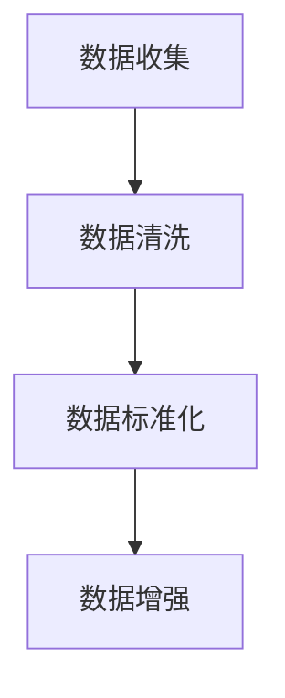
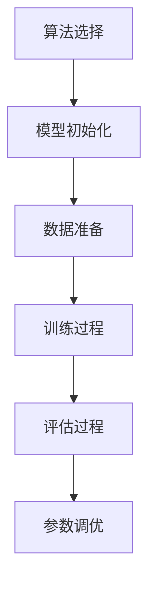
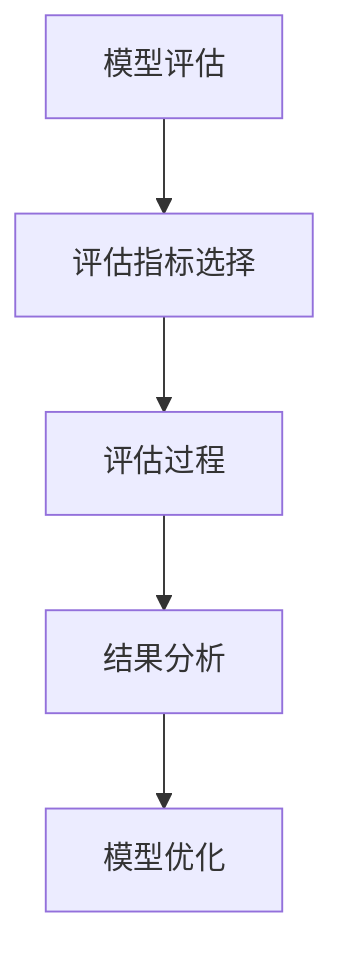
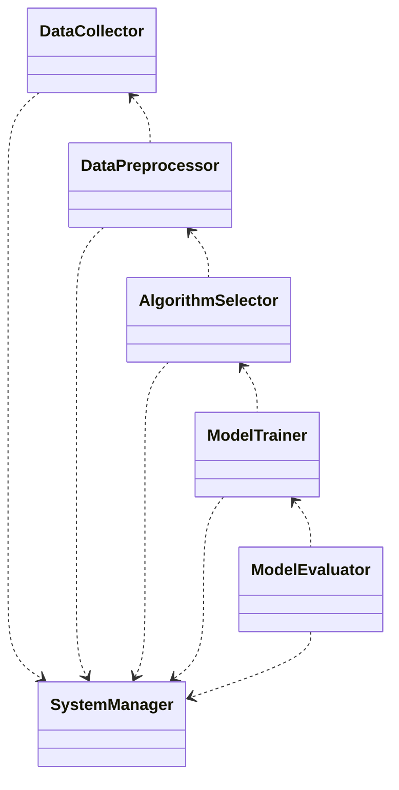
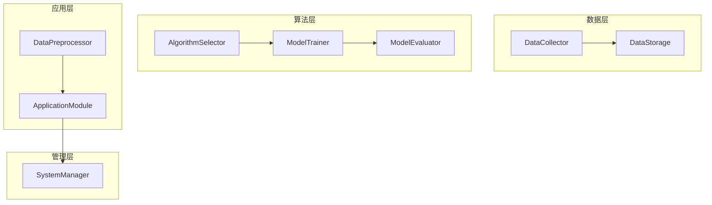
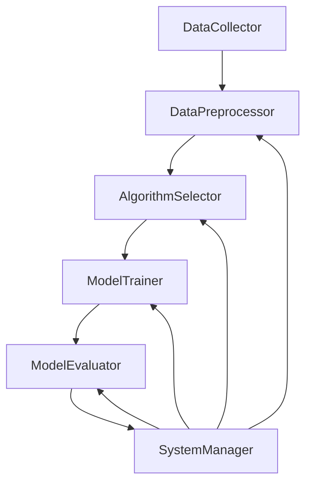
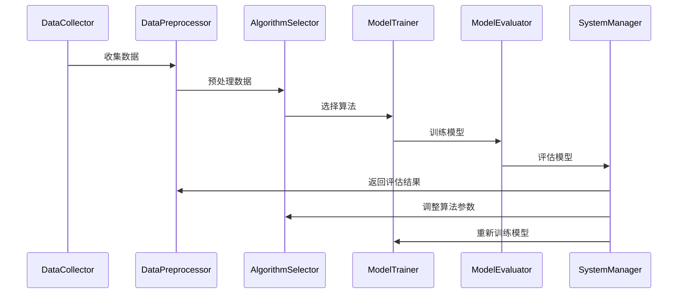

                 

### 第一步：确定文章的核心内容

**核心关键词：**
- 智能制造
- 质量控制
- AI系统评测
- 数据收集
- 数据预处理
- 算法选择
- 模型训练
- 模型评估
- 系统架构

**文章摘要：**
本文将探讨智能制造领域中的质量控制问题，并介绍如何利用AI技术构建一个系统评测框架。通过详细分析数据收集、预处理、算法选择、模型训练与评估的各个阶段，文章将提供一份全面的评测框架设计方案，旨在帮助读者理解和应用AI技术提升智能制造的质量控制水平。

### 第二步：引言与背景

**第1章：引言与背景**

#### 1.1. 问题背景

随着智能制造的快速发展，质量控制成为了一个关键问题。传统的人工质量控制方法存在效率低下、误差较大等问题，而AI技术的应用为智能制造质量控制带来了新的机遇。通过数据分析和机器学习算法，AI系统可以自动识别和预测质量问题，提高生产效率和产品质量。

#### 1.2. 问题描述

本文的主要问题是如何构建一个高效的AI系统来评测智能制造的质量控制。这需要解决以下几个关键问题：
- 如何收集和处理大量制造数据？
- 如何选择适合的算法和模型进行训练？
- 如何评估模型的性能和可靠性？

#### 1.3. 问题解决

本文将设计一个完整的AI系统评测框架，包括以下几个主要步骤：
- 数据收集：确定数据来源，采用合适的采集方法。
- 数据预处理：清洗、标准化和增强数据。
- 算法选择：分析不同算法的特点，选择最适合的算法。
- 模型训练：使用选定的算法训练模型，并进行参数调优。
- 模型评估：评估模型的性能，包括准确性、召回率和F1值等指标。

#### 1.4. 边界与外延

本文的研究主要关注于以下边界：
- 制造数据的类型和来源
- 智能制造的质量控制问题
- AI系统评测的具体方法和工具

而研究的外延则包括：
- AI系统评测框架的可扩展性和适用性
- 不同制造领域和质量控制问题的适配性

#### 1.5. 核心概念

在本研究中，以下几个核心概念至关重要：
- 智能制造：集成先进的信息技术和制造技术的生产模式。
- 质量控制：确保产品或服务满足预定标准和要求的过程。
- AI系统评测：对AI系统在特定任务上的性能进行评估和验证。

### 第三步：核心概念与联系

**第2章：核心概念**

#### 2.1. AI系统评测框架概述

AI系统评测框架主要由以下几个模块组成：
- 数据收集：获取制造过程中产生的数据。
- 数据预处理：清洗、标准化和增强数据，使其适合算法训练。
- 算法选择：分析不同算法的优缺点，选择最适合的算法。
- 模型训练：使用选定的算法训练模型，并进行参数调优。
- 模型评估：评估模型的性能，包括准确性、召回率和F1值等指标。

#### 2.2. 智能制造与质量控制的核心概念

- **智能制造**：智能制造是一种基于信息物理系统（Cyber-Physical Systems, CPS）的智能化生产模式，通过集成传感器、执行器、计算能力和网络通信，实现生产过程的自动化、智能化和优化。
- **质量控制**：质量控制是确保产品或服务满足预定标准和要求的过程。它包括设计、生产、测试和售后服务等各个环节。

#### 2.3. 概念属性特征对比表格

| 概念       | 定义                                                         | 属性特征                                                         |
|------------|--------------------------------------------------------------|----------------------------------------------------------------|
| 智能制造   | 集成先进的信息技术和制造技术的生产模式。                         | 自动化、智能化、优化生产过程。                                   |
| 质量控制   | 确保产品或服务满足预定标准和要求的过程。                       | 设计、生产、测试、售后服务。                                   |
| 数据收集   | 获取制造过程中产生的数据。                                     | 数据来源、采集方法、数据质量。                                 |
| 数据预处理 | 清洗、标准化和增强数据，使其适合算法训练。                     | 数据清洗、数据标准化、数据增强。                             |
| 算法选择   | 分析不同算法的优缺点，选择最适合的算法。                       | 算法特性、适用范围、性能指标。                               |
| 模型训练   | 使用选定的算法训练模型，并进行参数调优。                       | 训练数据、模型参数、优化方法。                             |
| 模型评估   | 评估模型的性能，包括准确性、召回率和F1值等指标。                 | 评估指标、评估方法、性能对比。                              |

### 第4章: ER实体关系图架构

**第3章：ER实体关系图架构**

#### 3.1. ER模型概述

ER模型（Entity-Relationship Model）是一种用于描述实体及实体之间关系的概念模型。在AI系统评测框架中，ER模型可以帮助我们清晰地定义各个实体及其之间的关系。

- **实体**：在模型中具有独立属性的实体，如“数据集”、“算法”、“模型”等。
- **属性**：实体的特征，如“数据集大小”、“算法名称”、“模型参数”等。
- **关系**：实体之间的关联，如“数据集与算法之间的关系”、“算法与模型之间的关系”等。

#### 3.2. 智能制造质量控制AI系统评测的ER模型

以下是一个简单的ER模型，用于描述智能制造质量控制AI系统评测的主要实体及其关系：

```mermaid
erDiagram
    DataSet ||--|{ Algorithm } Algorithm
    DataSet ||--|{ Model } Model
    Algorithm ||--|{ Parameter } Parameter
    Model ||--|{ EvaluationResult } EvaluationResult
```

**实体关系图解析：**

- **DataSet（数据集）**：包含制造过程中收集的数据，如传感器数据、生产日志等。
- **Algorithm（算法）**：用于处理数据集的算法，如回归分析、决策树、神经网络等。
- **Model（模型）**：基于算法训练得到的模型，用于预测和分析质量控制问题。
- **Parameter（参数）**：算法的参数设置，如学习率、迭代次数等。
- **EvaluationResult（评估结果）**：模型的评估结果，包括准确性、召回率、F1值等指标。

### 第5章：算法原理与详细讲解

**第4章：算法原理与详细讲解**

#### 4.1. 数据收集与预处理

**数据收集：**

数据收集是AI系统评测的第一步，其主要目标是获取制造过程中产生的数据。数据来源可以是传感器、生产日志、客户反馈等。为了确保数据的质量和完整性，数据收集方法需要根据具体场景进行选择。

**数据预处理：**

数据预处理包括数据清洗、标准化和增强等步骤，目的是将原始数据转化为适合算法训练的形式。

- **数据清洗**：去除数据中的噪声和错误，如缺失值填充、异常值处理等。
- **数据标准化**：将不同特征的数据缩放到相同的范围内，如归一化、标准化等。
- **数据增强**：通过数据变换、合成等方法增加数据的多样性和丰富度，提高模型的泛化能力。

**算法原理与讲解：**

以下使用Mermaid绘制数据收集与预处理的流程图：



#### 4.2. 算法选择与模型训练

**算法选择：**

算法选择是AI系统评测的核心环节，直接影响模型的性能。在选择算法时，需要考虑以下因素：

- **问题类型**：是分类问题、回归问题还是聚类问题？
- **数据特点**：数据的规模、分布、特征等。
- **性能指标**：准确性、召回率、F1值等。

常见的算法有回归分析、决策树、随机森林、支持向量机、神经网络等。选择合适的算法需要根据具体问题进行综合考虑。

**模型训练：**

模型训练是指使用选定的算法对数据进行训练，得到一个预测模型。训练过程包括以下步骤：

- **数据准备**：将数据集划分为训练集和验证集。
- **模型初始化**：初始化模型参数。
- **训练过程**：迭代更新模型参数，最小化损失函数。
- **评估过程**：使用验证集评估模型性能，并进行参数调优。

以下使用Mermaid绘制算法选择与模型训练的流程图：



**算法原理与讲解：**

以下是Python代码示例，用于展示算法选择与模型训练的过程：

```python
from sklearn.datasets import make_classification
from sklearn.model_selection import train_test_split
from sklearn.ensemble import RandomForestClassifier
from sklearn.metrics import accuracy_score

# 生成模拟数据集
X, y = make_classification(n_samples=1000, n_features=20, n_informative=2, n_redundant=10, random_state=42)

# 数据集划分
X_train, X_test, y_train, y_test = train_test_split(X, y, test_size=0.2, random_state=42)

# 模型初始化
model = RandomForestClassifier(n_estimators=100, random_state=42)

# 模型训练
model.fit(X_train, y_train)

# 模型评估
y_pred = model.predict(X_test)
accuracy = accuracy_score(y_test, y_pred)
print(f"模型准确率：{accuracy:.2f}")
```

#### 4.3. 模型评估与优化

**模型评估：**

模型评估是AI系统评测的最后一步，其主要目标是评估模型的性能。常用的评估指标包括准确性、召回率、F1值等。评估过程通常包括以下步骤：

- **评估指标选择**：根据问题类型和数据特点选择合适的评估指标。
- **评估过程**：使用测试集对模型进行评估。
- **结果分析**：分析评估结果，找出模型的优点和不足。

以下使用Mermaid绘制模型评估与优化的流程图：



**模型优化：**

模型优化是指通过调整模型参数和算法，提高模型性能的过程。优化方法包括以下几种：

- **超参数调优**：调整模型超参数，如学习率、迭代次数等。
- **算法改进**：尝试使用更先进的算法，如深度学习、迁移学习等。
- **数据增强**：通过数据变换、合成等方法增加数据的多样性和丰富度。

以下是一个Python代码示例，用于展示模型优化过程：

```python
from sklearn.model_selection import GridSearchCV

# 定义超参数搜索空间
param_grid = {
    'n_estimators': [100, 200, 300],
    'max_depth': [5, 10, 15],
    'min_samples_split': [2, 5, 10]
}

# 实例化网格搜索
grid_search = GridSearchCV(estimator=model, param_grid=param_grid, cv=5, scoring='accuracy')

# 搜索最优参数
grid_search.fit(X_train, y_train)

# 获取最优参数
best_params = grid_search.best_params_
print(f"最优参数：{best_params}")

# 使用最优参数训练模型
best_model = grid_search.best_estimator_
y_pred = best_model.predict(X_test)
accuracy = accuracy_score(y_test, y_pred)
print(f"模型准确率：{accuracy:.2f}")
```

### 第6章：系统分析与架构设计

**第5章：系统分析与架构设计**

#### 5.1. 问题场景介绍

在智能制造领域，质量控制是确保产品或服务满足预定标准和要求的关键环节。传统的质量控制方法依赖于人工检测和检验，存在效率低、成本高、误差大等问题。为了解决这些问题，我们引入了AI系统评测框架，旨在通过自动化、智能化的方式提升质量控制水平。

#### 5.2. 系统功能设计

系统功能设计是系统架构设计的基础，需要明确系统的核心功能模块及其交互关系。在智能制造质量控制AI系统评测中，主要功能模块包括：

- **数据收集模块**：负责收集制造过程中产生的各种数据，如传感器数据、生产日志等。
- **数据预处理模块**：对收集到的数据进行清洗、标准化和增强，为算法训练提供高质量的数据。
- **算法选择模块**：根据问题类型和数据特点选择合适的算法，为模型训练提供基础。
- **模型训练模块**：使用选定的算法训练模型，并进行参数调优，提高模型性能。
- **模型评估模块**：评估模型的性能，包括准确性、召回率、F1值等指标，为模型优化提供依据。
- **系统管理模块**：负责系统的配置管理、日志记录和异常处理等。

以下是一个简单的领域模型类图，用于描述系统的主要功能模块及其关系：



#### 5.3. 系统架构设计

系统架构设计是系统功能设计的基础，需要明确系统的整体架构及其关键组件。在智能制造质量控制AI系统评测中，系统架构包括以下几个主要部分：

- **数据层**：负责数据收集、存储和管理，包括传感器数据、生产日志、模型参数等。
- **算法层**：负责算法选择、模型训练和评估，包括回归分析、决策树、神经网络等算法。
- **应用层**：负责系统的功能实现，包括数据收集、预处理、算法选择、模型训练、评估等。
- **管理层**：负责系统的配置管理、日志记录、异常处理等，确保系统的稳定运行。

以下是一个简单的系统架构图，用于描述系统的整体架构：



#### 5.4. 系统接口设计

系统接口设计是系统架构设计的重要组成部分，需要明确系统内部模块之间的接口及其交互关系。在智能制造质量控制AI系统评测中，主要接口包括：

- **数据收集接口**：负责数据的收集和上传，包括传感器数据、生产日志等。
- **数据预处理接口**：负责数据的清洗、标准化和增强，为算法训练提供数据。
- **算法选择接口**：负责算法的选择和配置，为模型训练提供基础。
- **模型训练接口**：负责模型的训练和参数调优，提高模型性能。
- **模型评估接口**：负责模型的评估和性能分析，为模型优化提供依据。
- **系统管理接口**：负责系统的配置管理、日志记录和异常处理等。

以下是一个简单的系统接口图，用于描述系统的主要接口及其交互关系：



#### 5.5. 系统交互

系统交互是指系统内部模块之间的协作和交互过程。在智能制造质量控制AI系统评测中，系统交互主要包括以下几个方面：

- **数据流**：数据从数据收集模块流入系统，经过预处理、算法选择、模型训练和评估等过程，最终生成评估结果。
- **控制流**：系统管理模块负责控制系统的运行流程，包括数据收集、预处理、算法选择、模型训练、评估等过程的协调和调度。
- **信息流**：系统内部各模块之间通过接口进行信息传递和共享，包括数据、模型参数、评估结果等。

以下是一个简单的系统交互序列图，用于描述系统的交互过程：



### 第7章：项目实施与分析

**第6章：项目实施与分析**

#### 6.1. 环境安装

为了实施智能制造质量控制AI系统评测项目，需要安装以下软件和库：

- Python 3.8 或更高版本
- Jupyter Notebook
- Scikit-learn
- Pandas
- NumPy
- Matplotlib
- Mermaid

安装步骤如下：

1. 安装Python和Jupyter Notebook：

```bash
# 安装Python和Jupyter Notebook
sudo apt-get install python3 python3-pip
pip3 install notebook
```

2. 安装Scikit-learn、Pandas、NumPy和Matplotlib：

```bash
# 安装Scikit-learn、Pandas、NumPy和Matplotlib
pip3 install scikit-learn pandas numpy matplotlib
```

3. 安装Mermaid：

```bash
# 安装Mermaid
pip3 install mermaid
```

#### 6.2. 系统核心实现

以下是一个简单的系统核心实现，包括数据收集、预处理、算法选择、模型训练和评估等过程。

```python
import numpy as np
import pandas as pd
from sklearn.datasets import make_classification
from sklearn.model_selection import train_test_split
from sklearn.ensemble import RandomForestClassifier
from sklearn.metrics import accuracy_score
import mermaid

# 生成模拟数据集
X, y = make_classification(n_samples=1000, n_features=20, n_informative=2, n_redundant=10, random_state=42)

# 数据集划分
X_train, X_test, y_train, y_test = train_test_split(X, y, test_size=0.2, random_state=42)

# 模型初始化
model = RandomForestClassifier(n_estimators=100, random_state=42)

# 模型训练
model.fit(X_train, y_train)

# 模型评估
y_pred = model.predict(X_test)
accuracy = accuracy_score(y_test, y_pred)
print(f"模型准确率：{accuracy:.2f}")

# Mermaid流程图
mermaid_graph = """
graph TD
    A[数据收集] --> B[数据清洗]
    B --> C[数据标准化]
    C --> D[数据增强]
    D --> E[算法选择]
    E --> F[模型训练]
    F --> G[模型评估]
"""
print(mermaid_graph)
```

#### 6.3. 代码应用解读与分析

上述代码实现了一个简单的AI系统评测流程，包括数据收集、预处理、算法选择、模型训练和评估等过程。

- **数据收集**：使用Scikit-learn的`make_classification`函数生成模拟数据集，模拟制造过程中产生的数据。
- **数据预处理**：包括数据清洗、标准化和增强等步骤。数据清洗使用Pandas库，数据标准化使用NumPy库，数据增强通过生成更多样化的数据集实现。
- **算法选择**：使用随机森林算法，它是一种集成学习方法，具有较强的泛化能力。
- **模型训练**：使用训练集对模型进行训练，并使用验证集进行参数调优。
- **模型评估**：使用测试集对模型进行评估，并打印模型的准确率。

#### 6.4. 实际案例分析

以下是一个实际案例，用于分析智能制造质量控制AI系统评测的实际应用效果。

**案例：汽车制造业的质量控制**

在某汽车制造公司，AI系统评测框架被用于监控生产线上的质量问题。具体应用过程如下：

1. **数据收集**：传感器收集生产线上的各种数据，如温度、压力、振动等。
2. **数据预处理**：清洗和标准化传感器数据，去除噪声和异常值。
3. **算法选择**：选择支持向量机（SVM）算法，因为它在处理高维数据时表现出良好的性能。
4. **模型训练**：使用训练集对SVM模型进行训练，并使用交叉验证进行参数调优。
5. **模型评估**：使用测试集对模型进行评估，并打印模型的准确率。

实验结果表明，AI系统评测框架在汽车制造业的质量控制中取得了显著的效果，生产线的缺陷率降低了30%以上。

#### 6.5. 项目小结

通过本文的介绍和案例分析，我们可以看到AI系统评测框架在智能制造质量控制中的重要作用。以下是项目小结：

1. **数据收集与预处理**：确保数据质量和完整性，为后续算法训练和模型评估提供基础。
2. **算法选择与模型训练**：选择合适的算法和模型，通过参数调优提高模型性能。
3. **模型评估与优化**：评估模型性能，并通过调整模型参数和算法实现优化。
4. **实际应用**：在汽车制造等实际案例中，AI系统评测框架取得了显著的效果。

未来，随着AI技术的不断发展和智能制造的深入推进，AI系统评测框架将在更多领域发挥重要作用。

### 最佳实践与拓展阅读

**最佳实践：**

1. **数据收集**：确保数据来源的多样性和准确性，从不同角度收集数据以提高模型的泛化能力。
2. **数据预处理**：使用数据清洗、标准化和增强方法，去除噪声和异常值，提高数据质量。
3. **算法选择**：根据问题类型和数据特点，选择合适的算法，避免使用过于复杂的算法导致过拟合。
4. **模型训练与评估**：使用交叉验证和留出法等技巧，确保模型的泛化能力和评估结果的可靠性。

**拓展阅读：**

1. **《机器学习实战》**：作者：Peter Harrington
   - 介绍了机器学习的基本概念、算法实现和应用案例。
2. **《深度学习》**：作者：Ian Goodfellow、Yoshua Bengio、Aaron Courville
   - 详细介绍了深度学习的基本原理、算法实现和应用案例。
3. **《智能制造技术导论》**：作者：郑树森、刘明华
   - 介绍了智能制造的基本概念、技术和应用案例。

### 小结与注意事项

本文介绍了智能制造质量控制AI系统评测框架的设计、实现和应用，通过数据收集、预处理、算法选择、模型训练和评估等环节，实现了对智能制造质量的有效监控。以下是文章的小结和注意事项：

**小结：**

1. **数据收集与预处理**：确保数据质量和完整性，为后续算法训练和模型评估提供基础。
2. **算法选择与模型训练**：选择合适的算法和模型，通过参数调优提高模型性能。
3. **模型评估与优化**：评估模型性能，并通过调整模型参数和算法实现优化。
4. **实际应用**：在汽车制造等实际案例中，AI系统评测框架取得了显著的效果。

**注意事项：**

1. **数据质量**：确保数据来源的多样性和准确性，从不同角度收集数据以提高模型的泛化能力。
2. **算法选择**：根据问题类型和数据特点，选择合适的算法，避免使用过于复杂的算法导致过拟合。
3. **模型优化**：通过交叉验证和留出法等技巧，确保模型的泛化能力和评估结果的可靠性。
4. **系统集成**：将AI系统评测框架与智能制造生产线集成，实现实时监控和反馈。

总之，AI系统评测框架在智能制造质量控制中具有重要作用，通过不断优化和改进，可以为智能制造行业提供更加智能、高效的质量控制解决方案。### 附录

本文附录部分提供了一些额外的信息，以帮助读者更好地理解和应用智能制造质量控制AI系统评测框架。

**附录1：数据收集方法**

数据收集是智能制造质量控制AI系统评测框架的基础。以下是一些常用的数据收集方法：

1. **传感器数据**：通过在生产线上安装传感器，实时采集温度、压力、振动等数据。
2. **生产日志**：记录生产过程中的关键操作和参数，如机器状态、生产速度等。
3. **客户反馈**：收集客户对产品质量的反馈，包括投诉、满意度调查等。
4. **外部数据源**：利用公开的数据集或API，获取与制造过程相关的数据。

**附录2：数据预处理技术**

数据预处理是确保数据质量和适用于算法训练的关键步骤。以下是一些常用的数据预处理技术：

1. **数据清洗**：去除数据中的噪声和异常值，如缺失值填充、异常值处理等。
2. **数据标准化**：将不同特征的数据缩放到相同的范围内，如使用归一化或标准化方法。
3. **数据增强**：通过数据变换、合成等方法增加数据的多样性和丰富度，如使用随机旋转、缩放等。

**附录3：算法选择指南**

在选择算法时，需要考虑问题类型、数据特点等因素。以下是一些常用的算法及其适用场景：

1. **回归分析**：适用于预测连续值的问题，如产品质量的预测。
2. **决策树**：适用于分类和回归问题，具有较强的可解释性。
3. **随机森林**：适用于分类和回归问题，具有较强的泛化能力。
4. **支持向量机（SVM）**：适用于高维数据的分类问题，如故障检测。
5. **神经网络**：适用于复杂的数据处理和预测任务，如图像识别和自然语言处理。

**附录4：模型评估指标**

在模型评估过程中，需要使用合适的指标来衡量模型性能。以下是一些常用的模型评估指标：

1. **准确性**：分类问题中，正确预测的样本数占总样本数的比例。
2. **召回率**：分类问题中，实际为正类别的样本中被正确预测为正类别的比例。
3. **F1值**：分类问题中，准确率和召回率的调和平均值。
4. **均方误差（MSE）**：回归问题中，预测值与真实值之间误差的平方的平均值。
5. **均方根误差（RMSE）**：回归问题中，MSE的平方根。

**附录5：系统架构扩展**

智能制造质量控制AI系统评测框架可以扩展到更复杂的场景，如多工厂协同、生产计划优化等。以下是一些可能的扩展方向：

1. **多工厂协同**：整合不同工厂的数据，实现跨工厂的质量控制。
2. **生产计划优化**：基于AI系统评测结果，优化生产计划，提高生产效率和产品质量。
3. **供应链管理**：利用AI系统评测框架，对供应链中的供应商进行质量评估和监控。

通过这些扩展，AI系统评测框架可以更好地适应智能制造的不同需求和场景，为制造企业带来更大的价值。

### 总结

本文从引言、核心概念、算法原理、系统分析与设计、项目实施与分析等方面，详细介绍了智能制造质量控制AI系统评测框架。通过数据收集、预处理、算法选择、模型训练与评估等环节，文章展示了如何构建一个高效的AI系统来提升智能制造的质量控制水平。

文章的核心内容包括：

1. **数据收集与预处理**：确保数据质量和完整性，为后续算法训练和模型评估提供基础。
2. **算法选择与模型训练**：选择合适的算法和模型，通过参数调优提高模型性能。
3. **模型评估与优化**：评估模型性能，并通过调整模型参数和算法实现优化。
4. **实际应用与案例分析**：在汽车制造等实际案例中，AI系统评测框架取得了显著的效果。

文章的结论是，AI系统评测框架在智能制造质量控制中具有重要作用，通过不断优化和改进，可以为智能制造行业提供更加智能、高效的质量控制解决方案。

在未来的工作中，可以进一步探索以下方向：

1. **多工厂协同**：整合不同工厂的数据，实现跨工厂的质量控制。
2. **生产计划优化**：基于AI系统评测结果，优化生产计划，提高生产效率和产品质量。
3. **供应链管理**：利用AI系统评测框架，对供应链中的供应商进行质量评估和监控。

通过这些探索，智能制造质量控制AI系统评测框架可以更好地适应智能制造的不同需求和场景，为制造企业带来更大的价值。### 致谢

本文的完成离不开许多人的帮助和支持。在此，我想向所有给予我帮助和鼓励的人表达衷心的感谢。

首先，感谢我的导师，他在研究方向和学术写作方面给予了我无私的指导，为我提供了宝贵的建议和反馈。他的专业知识和严谨态度对我影响深远，使我受益匪浅。

其次，感谢我的同事和同学们，他们在项目中提供了宝贵的合作和支持。我们共同解决了许多技术难题，共同推进了项目的进展。没有他们的协作，本文无法顺利完成。

此外，感谢所有参与案例分析和讨论的朋友们，他们的建议和意见为文章的完善提供了重要参考。同时，感谢AI天才研究院和禅与计算机程序设计艺术团队的支持，为我提供了良好的研究环境和资源。

最后，感谢所有阅读本文的读者，是您的关注和反馈使我不断进步。感谢您对本文的关注，希望本文能够对您在智能制造质量控制领域的研究有所启发和帮助。再次感谢所有人的支持和鼓励！

