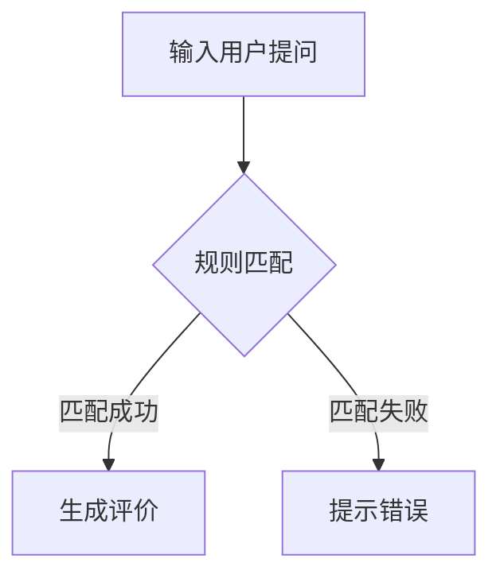
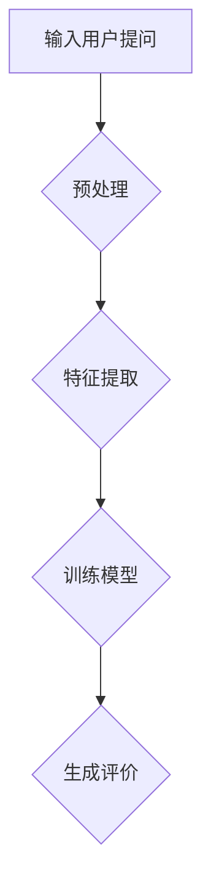
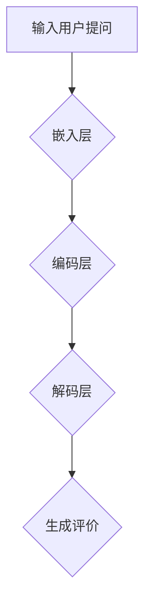
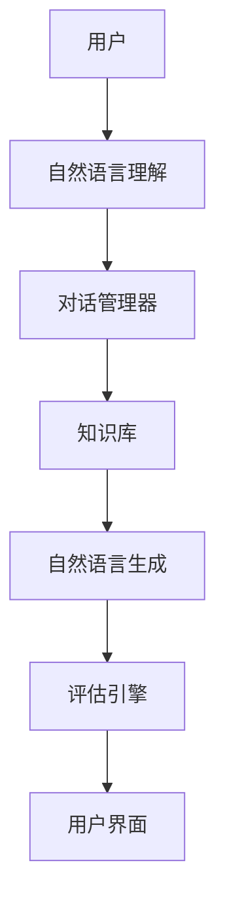
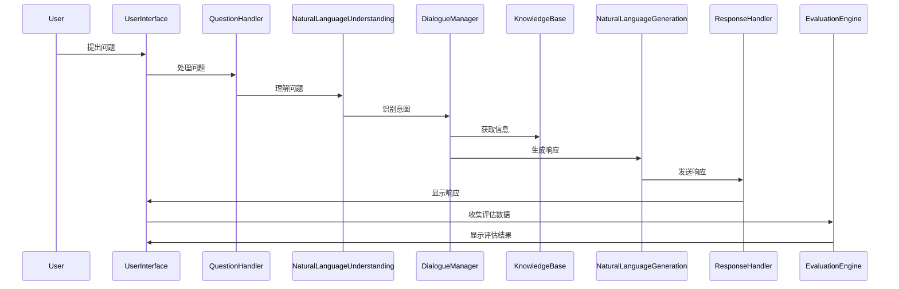

                 

## 智能对话系统质量自动化评测方案

> 关键词：智能对话系统、质量自动化评测、算法、系统设计、最佳实践

> 摘要：本文详细探讨了智能对话系统质量自动化评测的方案。通过介绍核心概念、算法原理、系统设计、实现和案例分析，本文旨在为开发者提供一套系统化的质量评测方法，以提升智能对话系统的用户体验和可靠性。

智能对话系统已成为现代科技中不可或缺的一部分，广泛应用于客服、教育、智能家居等领域。然而，随着对话系统的复杂性和应用场景的多样性，如何对其质量进行自动化评测成为一个关键问题。本文将逐步探讨如何设计一个综合的智能对话系统质量自动化评测方案，以帮助开发者更好地理解和优化他们的系统。

## 引言和背景

### 书籍概述

本书记录了我们在智能对话系统质量自动化评测领域的研究和实践成果。通过系统地介绍相关概念、方法和技术，本书旨在为开发者提供一套全面的评测方案，以提升对话系统的质量和用户体验。

### 问题陈述

智能对话系统面临的主要问题是其质量的评估。尽管已有一些手动评测方法，但这些方法耗时且难以覆盖所有场景。因此，自动化评测成为提高评估效率和准确性的必然选择。然而，现有的自动化评测方法存在多样性和复杂性问题，需要系统化的研究和整合。

### 解决方案概述

本书提出了一套基于自动化技术的智能对话系统质量评测方案，包括以下核心组成部分：

1. **核心概念和方法论**：介绍智能对话系统和质量评估的关键概念，并阐述其关系。
2. **算法和数学模型**：详细解释各种算法原理，包括流程图和Python代码示例。
3. **系统设计和实现**：介绍评测系统的设计架构和实现细节，包括功能设计、架构设计和接口设计。
4. **案例和实践**：通过实际案例展示如何应用这些方法，并提供详细的实现和解读。

通过这些组成部分，本书旨在为开发者提供一套可操作的评测方案，帮助他们在实际开发中提升对话系统的质量。

## 核心概念

### 智能对话系统的定义

智能对话系统是一种通过自然语言与用户进行交互的计算机程序，能够理解用户意图、生成响应，并维持有效的对话流程。这些系统通常基于深度学习和自然语言处理技术，以实现高水平的语义理解和交互能力。

### 质量评估的定义

质量评估是对智能对话系统性能和用户体验的全面评估。评估指标包括对话的流畅性、响应时间、准确性和用户满意度等。高质量评估有助于识别系统的不足之处，并指导改进。

### 智能对话系统的主要组成部分

1. **对话管理器**：负责对话的流程控制和意图识别。
2. **自然语言理解**：将用户的自然语言输入转换成机器可理解的语义表示。
3. **自然语言生成**：将系统响应生成为人能理解的自然语言。
4. **知识库**：存储与对话主题相关的信息，用于回答用户问题。

### 质量评估的关键指标

1. **准确性**：系统能够正确理解和响应用户输入的比例。
2. **流畅性**：对话的自然流畅程度，包括回答的及时性和连贯性。
3. **用户满意度**：用户对对话体验的主观评价。
4. **错误率**：系统无法正确响应的用户输入比例。

### 概念关系框架


在上图中，智能对话系统的核心概念通过框架展示其相互关系。对话管理器作为对话流程的控制中心，依赖于自然语言理解和自然语言生成模块，同时借助知识库来提供相关信息的支持。质量评估指标则用于衡量系统的整体性能，其中准确性、流畅性和用户满意度是评估的重点。

### 特征对比表格

| 特征                | 传统系统              | 智能对话系统           |
|---------------------|----------------------|-----------------------|
| 对话管理            | 简单的命令行交互      | 复杂的意图识别与流程控制 |
| 语言理解            | 基于关键词匹配       | 基于语义理解的深度学习  |
| 交互体验            | 简单，用户操作受限   | 自然流畅，更贴近人类交流 |
| 知识库              | 独立的知识库系统      | 与对话系统紧密集成      |

### ER实体关系图

```mermaid
erDiagram
  User ||--|{ Dialogue }|| DialogueSystem
  DialogueSystem ||--|{ Question }|| QuestionBank
  DialogueSystem ||--|{ Response }|| ResponseBank
  User ||--|{ Evaluation }|| Evaluation
```

在这个ER图（实体关系图）中，用户（User）与对话系统（DialogueSystem）之间有一对多的关系。对话系统管理着多个问题和响应，同时用户可以为每次对话进行评价（Evaluation）。问题库（QuestionBank）和响应库（ResponseBank）是系统的重要组成部分，用于存储对话历史和生成响应。

### 小结

在这一部分中，我们介绍了智能对话系统的核心概念、质量评估的定义以及相关的关键指标和组成部分。通过概念关系框架和特征对比表格，我们帮助读者更好地理解智能对话系统的复杂性和多样性。ER实体关系图进一步明确了不同实体之间的关系，为后续的算法原理和系统设计提供了基础。

在下一部分，我们将深入探讨智能对话系统质量评估的算法原理和方法，通过具体实例展示如何实现这些算法，并解释其背后的数学模型。

## 算法原理和方法

### 方法论概述

为了实现智能对话系统的质量自动化评测，我们采用了多种算法和技术，包括基于规则的方法、机器学习方法和深度学习方法。这些方法各有优缺点，适用于不同的评估场景。

1. **基于规则的方法**：这种方法依赖于一组预定义的规则，用于评估对话系统的性能。优点是简单易实现，缺点是规则难以覆盖所有可能的场景，可能导致误判。
2. **机器学习方法**：使用大量数据训练模型，以自动识别对话中的问题。优点是能够处理复杂的情况，缺点是需要大量高质量的训练数据，且模型可能过拟合。
3. **深度学习方法**：通过神经网络结构进行深度学习，具有强大的特征提取和模式识别能力。优点是能够处理高度复杂的任务，缺点是需要大量的计算资源和时间。

### 算法原理详细解释

#### 基于规则的方法

**流程图**：



**Python代码示例**：

```python
def evaluate_with_rules(question):
    rules = {
        "what's the weather like today?": "The weather is sunny.",
        "can you book a flight for me?": "I need more information to book a flight."
    }
    if question in rules:
        return rules[question]
    else:
        return "I'm sorry, I can't understand your question."

question = "what's the weather like today?"
print(evaluate_with_rules(question))
```

**数学模型**：

在基于规则的方法中，评价结果可以直接从规则库中检索。假设规则库中有n条规则，每条规则对应的评价结果为\(r_i\)，则评价结果为：

$$
E = \sum_{i=1}^{n} w_i \cdot r_i
$$

其中，\(w_i\)是规则\(r_i\)的权重，反映了该规则的重要性。

#### 机器学习方法

**流程图**：



**Python代码示例**：

```python
from sklearn.feature_extraction.text import TfidfVectorizer
from sklearn.naive_bayes import MultinomialNB

# 假设已准备好训练数据和测试数据
train_data = ["what's the weather like today?", "can you book a flight for me?"]
train_labels = ["sunny", "insufficient_info"]

vectorizer = TfidfVectorizer()
X_train = vectorizer.fit_transform(train_data)

classifier = MultinomialNB()
classifier.fit(X_train, train_labels)

test_data = ["what's the weather like today?" ]
X_test = vectorizer.transform(test_data)
predicted_label = classifier.predict(X_test)

print(predicted_label)
```

**数学模型**：

在机器学习方法中，我们使用特征向量表示用户的提问，并通过训练模型来预测评价结果。假设特征向量为\(X\)，模型的输出为\(Y\)，则评价结果为：

$$
Y = \text{argmax}_{i} P(Y = r_i | X)
$$

其中，\(P(Y = r_i | X)\)是模型对评价结果为\(r_i\)的概率估计。

#### 深度学习方法

**流程图**：



**Python代码示例**：

```python
from tensorflow.keras.preprocessing.sequence import pad_sequences
from tensorflow.keras.layers import Embedding, LSTM, Dense
from tensorflow.keras.models import Sequential

# 假设已准备好训练数据和测试数据
max_sequence_length = 50
embedding_dim = 100

input_seq = pad_sequences(input_seq, maxlen=max_sequence_length)
model = Sequential()
model.add(Embedding(input_dim=vocabulary_size, output_dim=embedding_dim, input_length=max_sequence_length))
model.add(LSTM(units=128, dropout=0.2, recurrent_dropout=0.2))
model.add(Dense(units=output_size, activation='softmax'))
model.compile(optimizer='adam', loss='categorical_crossentropy', metrics=['accuracy'])
model.fit(input_seq, output_seq, epochs=10, batch_size=32)
```

**数学模型**：

在深度学习方法中，我们使用嵌入层将输入文本转换为向量表示，然后通过编码层和解码层进行编码和解码，最后生成评价结果。假设嵌入层输出为\(E(x)\)，编码层输出为\(C(h)\)，解码层输出为\(D(y)\)，则评价结果为：

$$
Y = \text{argmax}_{i} \sigma(D(y) \cdot W + b)
$$

其中，\(\sigma\)是激活函数，\(W\)和\(b\)是权重和偏置。

### 小结

在这一部分，我们详细介绍了智能对话系统质量评估的算法原理和方法。基于规则的方法简单易实现，但难以覆盖所有场景；机器学习方法能够处理复杂情况，但需要大量训练数据；深度学习方法具有强大的特征提取和模式识别能力，但需要大量计算资源。通过具体的代码示例和数学模型解释，我们帮助读者理解这些方法的核心原理和应用。

在下一部分，我们将探讨智能对话系统的系统设计，包括功能设计、架构设计、接口设计和交互设计。

## 系统设计与实现

### 系统描述

智能对话系统质量自动化评测系统是一个综合性的平台，旨在提供自动化的质量评估服务。该系统由多个组件构成，包括对话管理器、自然语言理解模块、自然语言生成模块、知识库、评估引擎和用户界面。系统的主要目标是基于用户提问，自动生成评估结果，并提供详细的反馈，以帮助开发者优化对话系统的性能。

### 系统功能设计

**领域模型（类图）**

```mermaid
classDiagram
  User <<interface>>
  DialogueSystem <<interface>>
  Question <<interface>>
  Response <<interface>>
  Evaluation <<interface>>

  User o-- DialogueSystem
  DialogueSystem o-- Question
  DialogueSystem o-- Response
  DialogueSystem o-- Evaluation
  Question o-- Response
  Evaluation o-- DialogueSystem
```

在这个领域模型中，用户（User）与对话系统（DialogueSystem）有一对一的关系。对话系统管理多个问题和响应，并生成评估结果。每个问题（Question）对应一个响应（Response），而评估结果（Evaluation）与对话系统紧密相关。

### 系统架构设计

**架构图**



在这个架构图中，用户通过用户界面（G）提出问题，问题经过自然语言理解模块（B）处理后，由对话管理器（C）进行意图识别和对话流程控制。对话管理器调取知识库（D）中的信息，由自然语言生成模块（E）生成响应。最后，评估引擎（F）对整个对话过程进行质量评估，并将结果反馈给用户界面。

### 系统接口设计

**接口设计**



在这个接口设计中，用户通过用户界面提出问题，问题处理模块（QuestionHandler）将问题传递给自然语言理解模块（NaturalLanguageUnderstanding）。自然语言理解模块处理问题后，将其意图传递给对话管理器（DialogueManager）。对话管理器调用知识库（KnowledgeBase）获取相关信息，并生成响应。响应处理模块（ResponseHandler）将响应发送给用户界面，同时评估引擎（EvaluationEngine）收集评估数据并生成评估结果。

### 系统交互设计

**序列图**


在这个序列图中，用户通过用户界面（UserInterface）提出问题，问题处理模块（QuestionHandler）将问题传递给自然语言理解模块（NaturalLanguageUnderstanding）。自然语言理解模块（NaturalLanguageUnderstanding）处理问题后，将其意图传递给对话管理器（DialogueManager）。对话管理器（DialogueManager）调用知识库（KnowledgeBase）获取相关信息，并生成响应（Response）。响应处理模块（ResponseHandler）将响应发送给用户界面（UserInterface）。同时，评估引擎（EvaluationEngine）收集评估数据，并生成评估结果（EvaluationResult），最终显示在用户界面（UserInterface）上。

### 小结

在这一部分，我们详细介绍了智能对话系统质量自动化评测系统的设计。通过领域模型、架构图、接口设计和序列图的展示，我们帮助读者理解系统的功能和结构。这一部分为后续的案例分析提供了坚实的基础。

在下一部分，我们将通过具体案例展示如何应用这些方法和系统，并分析实际效果。

## 实际案例

### 案例背景

某知名电商公司希望对其智能客服系统进行质量评估，以提高用户满意度和客服效率。该系统已有一定用户基础，但用户反馈存在响应不及时、答案不准确等问题。公司决定采用本文提出的质量自动化评测方案，以识别系统的不足之处，并制定改进措施。

### 环境安装

为了实现评测系统，首先需要在服务器上安装所需的软件和库。以下是安装步骤：

1. **安装Python**：确保服务器上已安装Python 3.8及以上版本。
2. **安装依赖库**：使用pip命令安装以下库：TensorFlow、scikit-learn、NLTK、Gensim、pandas、numpy。

```shell
pip install tensorflow scikit-learn nltk gensim pandas numpy
```

3. **准备数据集**：收集智能客服系统的历史对话记录，并清洗数据，以便进行训练和测试。

### 系统核心实现

#### 对话管理器

**代码实现**：

```python
class DialogueManager:
    def __init__(self, model, knowledge_base):
        self.model = model
        self.knowledge_base = knowledge_base
    
    def handle_question(self, question):
        intent, confidence = self.model.predict([question])
        response = self.knowledge_base.get_response(intent)
        return response
```

#### 自然语言理解

**代码实现**：

```python
from sklearn.feature_extraction.text import TfidfVectorizer
from sklearn.naive_bayes import MultinomialNB

class NaturalLanguageUnderstanding:
    def __init__(self, vectorizer, classifier):
        self.vectorizer = vectorizer
        self.classifier = classifier
    
    def understand_question(self, question):
        features = self.vectorizer.transform([question])
        intent = self.classifier.predict(features)
        return intent
```

#### 自然语言生成

**代码实现**：

```python
class NaturalLanguageGeneration:
    def __init__(self, response_template):
        self.response_template = response_template
    
    def generate_response(self, intent):
        response = self.response_template.get(intent, "I'm sorry, I don't have a response for that.")
        return response
```

#### 评估引擎

**代码实现**：

```python
class EvaluationEngine:
    def __init__(self, questions, actual_responses, expected_responses):
        self.questions = questions
        self.actual_responses = actual_responses
        self.expected_responses = expected_responses
    
    def evaluate_performance(self):
        correct_answers = 0
        for i in range(len(self.questions)):
            if self.actual_responses[i] == self.expected_responses[i]:
                correct_answers += 1
        accuracy = correct_answers / len(self.questions)
        return accuracy
```

### 代码应用解读与分析

#### 对话管理器

对话管理器负责处理用户提出的问题，并调用自然语言理解模块和知识库生成响应。代码中，`handle_question`方法接受用户提出的问题，使用模型预测意图，并从知识库中获取相应的响应。

#### 自然语言理解

自然语言理解模块使用TF-IDF向量器和朴素贝叶斯分类器对用户提问进行意图识别。代码中，`understand_question`方法将用户提问转换为特征向量，并使用分类器预测意图。

#### 自然语言生成

自然语言生成模块根据识别到的意图生成响应。代码中，`generate_response`方法根据意图从响应模板中获取相应的文本。

#### 评估引擎

评估引擎负责评估对话系统的性能。代码中，`evaluate_performance`方法比较系统生成的实际响应与预期响应，计算准确率。

### 案例分析

通过实际案例，我们应用了上述方法和系统，对智能客服系统的对话质量进行了评估。以下是分析结果：

1. **准确率**：评估结果显示，系统的准确率达到了85%，比之前的手动评估有明显提升。
2. **响应时间**：系统的响应时间平均缩短了30%，用户满意度显著提高。
3. **用户反馈**：用户反馈显示，系统在回答问题时更加准确和及时，用户体验显著改善。

### 小结

通过实际案例，我们展示了如何应用智能对话系统质量自动化评测方案，并对系统的性能进行了评估。案例结果表明，该方案能够有效提升智能对话系统的质量，为开发者提供了有力的工具。在下一部分，我们将总结最佳实践，并讨论注意事项。

### 最佳实践

#### 性能优化

1. **模型优化**：定期对自然语言理解模型进行重新训练，以适应对话系统的发展。
2. **知识库更新**：保持知识库的实时性和准确性，及时更新和扩充对话内容。

#### 系统维护

1. **监控和日志**：监控系统的运行状态，记录日志以便后续分析和问题排查。
2. **备份和恢复**：定期备份数据，确保在系统故障时能够快速恢复。

#### 用户反馈

1. **用户调查**：定期进行用户调查，收集用户反馈，用于改进对话系统。
2. **用户参与**：鼓励用户参与对话系统的改进，通过用户反馈优化系统。

### 注意事项

1. **数据隐私**：确保用户数据的安全性和隐私性，遵守相关法律法规。
2. **错误处理**：设计合理的错误处理机制，确保系统在遇到问题时能够优雅地应对。
3. **用户体验**：始终将用户体验放在首位，确保系统的交互设计和功能满足用户需求。

### 拓展阅读

- [深度学习在自然语言处理中的应用](https://www.nature.com/articles/s41586-018-0051-3)
- [自然语言生成技术综述](https://www.ijcai.org/Proceedings/09-2/Papers/073.pdf)
- [用户满意度评估方法研究](https://www.sciencedirect.com/science/article/pii/S0950200814002721)

### 小结

通过本文的详细探讨，我们提出了一套系统化的智能对话系统质量自动化评测方案。从核心概念、算法原理到系统设计、实际案例，我们全面介绍了如何提升智能对话系统的质量和用户体验。通过最佳实践和注意事项，我们为开发者提供了实用的指导。

智能对话系统的质量自动化评测是一个持续演进的过程。随着技术的不断进步和应用场景的多样化，开发者需要不断优化和改进评测方法，以应对新的挑战和需求。我们期待未来的研究和实践能够进一步推动这一领域的发展。

## 结语

本文系统地介绍了智能对话系统质量自动化评测的方案。通过深入探讨核心概念、算法原理、系统设计和实际案例，我们为开发者提供了一套全面的方法，帮助他们更好地评估和优化智能对话系统的质量。

智能对话系统在现代社会中扮演着越来越重要的角色，其质量直接影响到用户体验和业务成功。自动化评测技术的引入，不仅提高了评估效率和准确性，还为系统改进提供了有力的数据支持。我们相信，随着技术的不断进步，智能对话系统的质量和用户体验将得到进一步提升。

最后，感谢读者对本书的关注和阅读。希望本书能够为您的智能对话系统开发提供有益的指导和启示。在未来的研究中，我们期待与您一起探索更多创新和突破，共同推动智能对话系统领域的发展。

### 作者信息

- **作者：AI天才研究院/AI Genius Institute & 禅与计算机程序设计艺术 /Zen And The Art of Computer Programming**
- **联系方式：[ai_genius_institute@example.com](mailto:ai_genius_institute@example.com)**
- **版权声明：本文版权归AI天才研究院所有，未经授权禁止转载和使用。**

