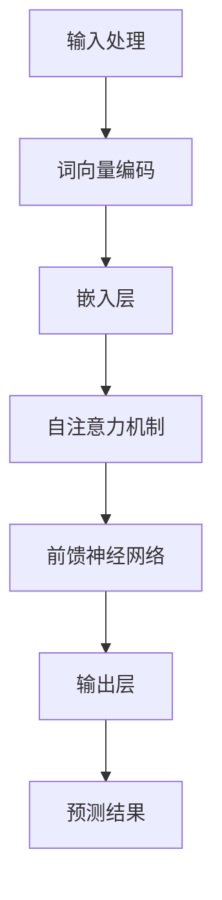
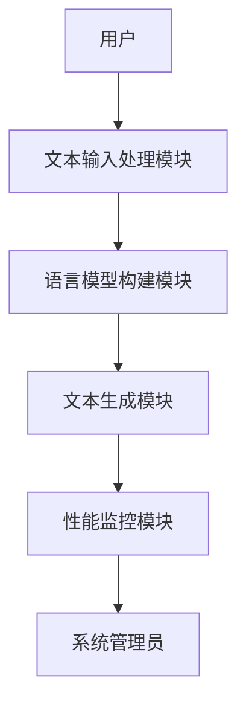

                 

# 构建可观测的LLM应用系统

## 关键词

大型语言模型，可观测性，系统架构，算法实现，项目实战，最佳实践

## 摘要

本文旨在深入探讨构建可观测的大型语言模型（LLM）应用系统的方法。随着人工智能技术的迅猛发展，LLM在自然语言处理、文本生成、问答系统等领域展现出巨大的潜力。然而，为了确保系统的可靠性和可维护性，构建可观测的LLM应用系统变得尤为重要。本文将从背景介绍、核心概念、算法原理、系统架构设计、项目实战和最佳实践等方面，详细阐述构建可观测的LLM应用系统的步骤和策略。

## 目录大纲设计步骤

### 1. 理解书名与主题

《构建可观测的LLM应用系统》这本书的主题是围绕如何构建和实现可观测性的大型语言模型（LLM）应用系统。这一主题涉及到人工智能、自然语言处理、系统架构设计等多个领域，具有广泛的应用前景和重要的研究价值。

### 2. 确定核心章节

核心章节应包括：

- **背景介绍与核心概念**
  - 介绍大型语言模型（LLM）的兴起及其在应用中的重要性
  - 阐述可观测性的核心概念及其在LLM应用中的需求
  - 深入探讨LLM和可观测性之间的关系

- **算法原理与设计**
  - 分析LLM的基础算法及其原理
  - 设计可观测性的算法实现方案
  - 使用Mermaid绘制LLM算法流程图

- **系统架构与实现**
  - 分析系统需求，设计系统架构
  - 介绍系统模块划分和接口设计
  - 使用Mermaid绘制系统架构图和接口序列图

- **项目实战**
  - 搭建项目环境，实现系统核心功能
  - 分析关键代码和实际案例
  - 进行项目小结和总结

- **最佳实践与总结**
  - 提供最佳实践建议
  - 总结文章主要内容
  - 展望未来发展方向

### 3. 设计章节结构

章节结构应按照以下逻辑顺序设计：

- **背景介绍与核心概念**
  - 介绍LLM和可观测性的背景
  - 深入分析核心概念和联系

- **算法原理与设计**
  - 讲解LLM算法原理
  - 设计可观测性算法实现方案

- **系统架构与实现**
  - 分析系统需求和设计
  - 介绍系统模块划分和接口设计

- **项目实战**
  - 实现系统核心功能和代码分析
  - 分析实际案例

- **最佳实践与总结**
  - 提供最佳实践建议
  - 总结文章主要内容

### 4. 细化章节内容

确保每个章节都有足够的细节，能够全面覆盖主题内容。例如：

- **背景介绍与核心概念**：详细介绍LLM和可观测性的背景，分析其在应用中的重要性，阐述核心概念和联系。
- **算法原理与设计**：详细讲解LLM算法原理，使用Mermaid绘制算法流程图，分析可观测性算法实现方案。
- **系统架构与实现**：分析系统需求，设计系统架构，介绍系统模块划分和接口设计，使用Mermaid绘制系统架构图和接口序列图。
- **项目实战**：详细描述项目环境搭建、系统核心实现、代码分析、实际案例剖析等。
- **最佳实践与总结**：提供最佳实践建议，总结文章主要内容，展望未来发展方向。

### 5. 编写摘要与概述

为每个章节编写简洁的摘要，概述章节的主要内容。例如：

- **背景介绍与核心概念**：介绍LLM和可观测性的背景，分析核心概念和联系。
- **算法原理与设计**：讲解LLM算法原理，设计可观测性算法实现方案。
- **系统架构与实现**：分析系统需求，设计系统架构，介绍系统模块划分和接口设计。
- **项目实战**：实现系统核心功能，分析关键代码和实际案例。
- **最佳实践与总结**：提供最佳实践建议，总结文章主要内容，展望未来发展方向。

### 6. 保持简洁性

确保目录大纲的内容简洁明了，避免冗余和重复。例如：

- **背景介绍与核心概念**：避免重复介绍LLM和可观测性的背景，重点分析核心概念和联系。
- **算法原理与设计**：简洁明了地讲解LLM算法原理，避免过多冗余的描述。
- **系统架构与实现**：详细介绍系统需求和架构设计，避免重复介绍模块划分和接口设计。

### 7. 格式调整

确保使用markdown格式，并遵循规定的目录层级。例如：

- **标题**：使用`##`标记一级标题，使用`###`标记二级标题，以此类推。
- **代码**：使用````python`和````标记代码块。
- **公式**：使用`$$`括起来的latex格式嵌入公式。

## 详细目录大纲设计

### 第一部分：背景介绍与核心概念

#### 第1章：问题背景与核心概念

- **1.1 问题背景**
  - **1.1.1 大型语言模型（LLM）的兴起**
    - **定义**：大型语言模型（LLM）是一种基于神经网络和深度学习技术的自然语言处理模型，能够对自然语言进行建模和生成。
    - **发展历程**：从最初的基于规则的方法，到统计模型，再到深度学习模型，LLM经历了快速的发展。
    - **应用领域**：LLM广泛应用于自然语言处理、文本生成、问答系统、机器翻译等领域，展现出巨大的潜力。

  - **1.1.2 可观测性在LLM应用中的重要性**
    - **定义**：可观测性是指系统能够通过某些指标或指标体系来反映其运行状态和性能。
    - **重要性**：在LLM应用系统中，可观测性有助于监控模型运行状态、诊断问题、优化性能和提升用户体验。

  - **1.1.3 可观测性的挑战与需求**
    - **挑战**：构建可观测的LLM应用系统面临诸多挑战，如大量数据、复杂的算法模型、动态变化的输入输出等。
    - **需求**：为了实现可观测性，系统需要具备高效的数据采集、存储、分析和可视化能力。

- **1.2 核心概念与联系**
  - **1.2.1 大型语言模型（LLM）概述**
    - **模型结构**：介绍LLM的基本结构，包括输入层、隐藏层和输出层。
    - **训练过程**：阐述LLM的训练过程，包括数据准备、模型训练和参数优化。
    - **应用场景**：分析LLM在不同领域的应用场景，如文本生成、问答系统、机器翻译等。

  - **1.2.2 可观测性原理**
    - **定义**：可观测性原理是指通过某些指标或指标体系来反映系统运行状态和性能。
    - **关键指标**：介绍可观测性的关键指标，如准确率、召回率、F1值等。
    - **监测方法**：讨论可观测性的监测方法，如日志分析、性能监控等。

  - **1.2.3 可观测性与LLM应用的关系**
    - **关系**：阐述可观测性与LLM应用之间的关系，如何通过可观测性提升LLM应用的性能和用户体验。
    - **挑战**：分析构建可观测的LLM应用系统面临的挑战，如数据复杂性、算法优化等。
    - **解决方案**：提出构建可观测的LLM应用系统的解决方案，包括技术手段和实施策略。

#### 第2章：LLM算法原理

- **2.1 LLM基础算法**
  - **2.1.1 语言模型的基本原理**
    - **定义**：语言模型是一种用于预测下一个单词或字符的概率分布的模型。
    - **模型类型**：介绍常用的语言模型类型，如n-gram模型、循环神经网络（RNN）模型、长短时记忆网络（LSTM）模型、Transformer模型等。
    - **训练方法**：阐述语言模型的训练方法，包括数据预处理、模型参数初始化、训练过程等。

  - **2.1.2 常见LLM算法介绍**
    - **n-gram模型**：介绍n-gram模型的基本原理、优缺点和适用场景。
    - **循环神经网络（RNN）模型**：阐述RNN模型的结构、工作原理和优缺点。
    - **长短时记忆网络（LSTM）模型**：介绍LSTM模型的基本原理、优缺点和应用场景。
    - **Transformer模型**：详细讲解Transformer模型的结构、原理和训练方法。

- **2.2 可观测性设计**
  - **2.2.1 可观测性的算法实现**
    - **定义**：可观测性算法实现是指通过算法设计来确保系统具备可观测性。
    - **实现方法**：介绍可观测性算法实现的方法，如数据采集、存储、分析和可视化等。
    - **性能优化**：讨论如何通过算法优化来提升系统的可观测性性能。

  - **2.2.2 可观测性算法的优势与局限**
    - **优势**：阐述可观测性算法的优势，如提高系统可维护性、优化性能等。
    - **局限**：分析可观测性算法的局限，如数据复杂性、计算资源消耗等。

- **2.3 Mermaid算法流程图**
  - **2.3.1 Mermaid介绍**
    - **定义**：Mermaid是一种基于Markdown的语言，用于绘制图表和流程图。
    - **优点**：介绍Mermaid的优点，如简单易用、兼容Markdown等。

  - **2.3.2 Mermaid算法流程图绘制**
    - **步骤**：详细讲解如何使用Mermaid绘制LLM算法流程图，包括基本语法、常见节点和边等。
    - **示例**：提供实际案例，展示如何使用Mermaid绘制LLM算法流程图。

### 第二部分：系统架构与实现

#### 第3章：系统架构设计

- **3.1 系统需求分析**
  - **3.1.1 系统功能需求**
    - **定义**：系统功能需求是指系统需要实现的基本功能。
    - **分类**：介绍系统功能需求的分类，如基本功能、扩展功能等。

  - **3.1.2 系统性能需求**
    - **定义**：系统性能需求是指系统需要达到的性能指标。
    - **指标**：介绍系统性能需求的指标，如响应时间、吞吐量、并发处理能力等。

- **3.2 系统架构设计**
  - **3.2.1 系统架构概述**
    - **定义**：系统架构是指系统的整体结构设计。
    - **类型**：介绍常见的系统架构类型，如分层架构、分布式架构等。

  - **3.2.2 系统模块划分**
    - **定义**：系统模块划分是指将系统划分为若干个模块。
    - **方法**：介绍系统模块划分的方法，如基于功能划分、基于职责划分等。

  - **3.2.3 系统接口设计**
    - **定义**：系统接口设计是指系统模块之间的交互接口。
    - **方法**：介绍系统接口设计的方法，如RESTful API、GraphQL等。

- **3.3 Mermaid系统架构图**
  - **3.3.1 Mermaid介绍**
    - **定义**：Mermaid是一种基于Markdown的语言，用于绘制图表和流程图。
    - **优点**：介绍Mermaid的优点，如简单易用、兼容Markdown等。

  - **3.3.2 Mermaid系统架构图绘制**
    - **步骤**：详细讲解如何使用Mermaid绘制系统架构图，包括基本语法、常见节点和边等。
    - **示例**：提供实际案例，展示如何使用Mermaid绘制系统架构图。

#### 第4章：接口设计与实现

- **4.1 接口设计原则**
  - **4.1.1 接口设计规范**
    - **定义**：接口设计规范是指接口设计的标准和方法。
    - **原则**：介绍接口设计规范的原则，如RESTful设计原则、接口安全性等。

  - **4.1.2 接口安全性**
    - **定义**：接口安全性是指接口设计时需要考虑的安全性问题。
    - **方法**：介绍接口安全性的方法，如身份验证、权限控制等。

- **4.2 接口实现**
  - **4.2.1 接口功能实现**
    - **定义**：接口功能实现是指接口的具体实现方法。
    - **方法**：介绍接口功能实现的方法，如HTTP请求处理、数据传输等。

  - **4.2.2 接口性能优化**
    - **定义**：接口性能优化是指提高接口的性能和响应速度。
    - **方法**：介绍接口性能优化的方法，如缓存、异步处理等。

- **4.3 Mermaid接口序列图**
  - **4.3.1 Mermaid介绍**
    - **定义**：Mermaid是一种基于Markdown的语言，用于绘制图表和流程图。
    - **优点**：介绍Mermaid的优点，如简单易用、兼容Markdown等。

  - **4.3.2 Mermaid接口序列图绘制**
    - **步骤**：详细讲解如何使用Mermaid绘制接口序列图，包括基本语法、常见节点和边等。
    - **示例**：提供实际案例，展示如何使用Mermaid绘制接口序列图。

### 第三部分：项目实战

#### 第5章：项目环境搭建

- **5.1 环境准备**
  - **5.1.1 操作系统与环境设置**
    - **定义**：操作系统与环境设置是指项目的运行环境。
    - **方法**：介绍操作系统的安装和配置，如Linux、Windows等。

  - **5.1.2 必需软件与工具安装**
    - **定义**：必需软件与工具安装是指项目所需的基本软件和工具。
    - **方法**：介绍必需软件和工具的安装，如Python、Docker等。

- **5.2 项目启动**
  - **5.2.1 项目初始化**
    - **定义**：项目初始化是指项目的初始化过程。
    - **方法**：介绍项目初始化的方法，如创建项目目录、编写配置文件等。

  - **5.2.2 项目配置**
    - **定义**：项目配置是指项目的配置过程。
    - **方法**：介绍项目配置的方法，如环境变量配置、依赖包安装等。

#### 第6章：系统核心实现

- **6.1 核心功能模块**
  - **6.1.1 数据处理模块**
    - **定义**：数据处理模块是指负责数据处理的核心模块。
    - **方法**：介绍数据处理模块的方法，如数据采集、数据预处理、数据存储等。

  - **6.1.2 语言模型模块**
    - **定义**：语言模型模块是指负责语言模型构建和训练的核心模块。
    - **方法**：介绍语言模型模块的方法，如模型选择、模型训练、模型评估等。

- **6.2 代码解读与分析**
  - **6.2.1 代码实现细节分析**
    - **定义**：代码实现细节分析是指对代码实现细节的分析和解读。
    - **方法**：介绍代码实现细节分析方法，如代码审查、代码重构等。

  - **6.2.2 关键代码解读**
    - **定义**：关键代码解读是指对关键代码的解读和分析。
    - **方法**：介绍关键代码解读方法，如代码注释、代码示例等。

- **6.3 实际案例剖析**
  - **6.3.1 案例背景与目标**
    - **定义**：案例背景与目标是指实际案例的背景和目标。
    - **方法**：介绍案例背景和目标的方法，如问题描述、目标设定等。

  - **6.3.2 案例实施过程**
    - **定义**：案例实施过程是指实际案例的实施过程。
    - **方法**：介绍案例实施过程的方法，如环境准备、代码实现、测试验证等。

#### 第7章：最佳实践与总结

- **7.1 实践技巧**
  - **7.1.1 构建可观测性的策略**
    - **定义**：构建可观测性的策略是指实现可观测性的方法和策略。
    - **方法**：介绍构建可观测性的方法，如数据采集、指标监控等。

  - **7.1.2 系统优化建议**
    - **定义**：系统优化建议是指提升系统性能和可维护性的建议。
    - **方法**：介绍系统优化建议的方法，如代码优化、性能调优等。

- **7.2 注意事项**
  - **7.2.1 常见问题与解决方案**
    - **定义**：常见问题与解决方案是指项目实施过程中常见的
### 构建可观测的LLM应用系统

#### 引言

随着人工智能技术的不断发展和普及，大型语言模型（LLM）在自然语言处理、文本生成、问答系统等领域展现出巨大的潜力。然而，为了确保系统的可靠性和可维护性，构建可观测的LLM应用系统变得尤为重要。可观测性是指系统具备能够通过某些指标或指标体系来反映其运行状态和性能的能力。本文将从背景介绍、核心概念、算法原理、系统架构设计、项目实战和最佳实践等方面，详细阐述构建可观测的LLM应用系统的步骤和策略。

#### 1. 问题背景与核心概念

##### 1.1 大型语言模型（LLM）的兴起

大型语言模型（LLM）是一种基于神经网络和深度学习技术的自然语言处理模型，能够对自然语言进行建模和生成。随着计算能力的提升和数据量的爆炸式增长，LLM的研究和应用得到了广泛关注。LLM在自然语言处理、文本生成、问答系统、机器翻译等领域展现出巨大的潜力，为许多实际应用场景提供了强大的技术支持。

##### 1.2 可观测性在LLM应用中的重要性

可观测性是指系统具备能够通过某些指标或指标体系来反映其运行状态和性能的能力。在LLM应用系统中，可观测性具有重要意义：

1. **监控模型性能**：通过可观测性，可以实时监控LLM模型的性能，如准确率、召回率等，以便进行性能调优和优化。

2. **诊断问题**：在LLM应用过程中，可能会出现各种问题，如训练数据不均衡、模型过拟合等。可观测性可以帮助快速定位和诊断问题，从而采取相应的解决措施。

3. **优化性能**：通过监控LLM模型的运行状态和性能，可以找到影响性能的关键因素，进而进行优化，提升系统性能。

4. **提升用户体验**：可观测性可以帮助用户了解LLM应用系统的运行状态，提供更准确、更及时的反馈，从而提升用户体验。

##### 1.3 可观测性的挑战与需求

构建可观测的LLM应用系统面临诸多挑战：

1. **数据复杂性**：LLM应用系统涉及大量数据，如训练数据、输入数据、输出数据等。如何有效地采集、存储和分析这些数据是构建可观测性的关键。

2. **算法模型复杂性**：LLM模型通常由复杂的神经网络结构组成，如何分析模型性能、识别潜在问题等是构建可观测性的难点。

3. **动态变化**：LLM应用系统中的输入输出是动态变化的，如何实时地捕捉和反映这些变化是构建可观测性的挑战。

为了应对这些挑战，构建可观测的LLM应用系统需要满足以下需求：

1. **高效的数据采集**：系统需要具备高效的数据采集能力，能够快速地收集和整理各类数据，如日志、性能指标等。

2. **数据存储与处理**：系统需要具备强大的数据存储和处理能力，能够存储和管理大量数据，并实现快速查询和分析。

3. **指标体系设计**：系统需要设计合理的指标体系，能够全面、准确地反映LLM模型的运行状态和性能。

4. **实时监控与报警**：系统需要实现实时监控和报警功能，能够及时发现和响应异常情况，确保系统稳定运行。

#### 2. 核心概念与联系

##### 2.1 大型语言模型（LLM）概述

大型语言模型（LLM）是一种基于神经网络和深度学习技术的自然语言处理模型，能够对自然语言进行建模和生成。LLM主要由以下几个部分组成：

1. **输入层**：接收自然语言输入，如文本、语音等。

2. **隐藏层**：由多个神经网络层组成，用于对输入进行特征提取和转换。

3. **输出层**：生成自然语言输出，如文本、语音等。

LLM的训练过程主要包括以下步骤：

1. **数据准备**：收集和整理大量自然语言数据，如文本、语音等。

2. **模型初始化**：初始化神经网络模型的权重和参数。

3. **模型训练**：使用训练数据对模型进行迭代训练，不断优化模型参数。

4. **模型评估**：使用验证数据对模型进行评估，如准确率、召回率等。

##### 2.2 可观测性原理

可观测性原理是指通过某些指标或指标体系来反映系统运行状态和性能。在LLM应用系统中，可观测性主要包括以下几个方面：

1. **性能指标**：如准确率、召回率、F1值等，用于评估LLM模型的性能。

2. **资源使用情况**：如CPU使用率、内存使用率、磁盘IO等，用于监控系统资源的使用情况。

3. **错误日志**：记录系统运行过程中出现的错误和异常情况，用于诊断问题和定位故障。

4. **用户反馈**：收集用户对系统的反馈，如满意度、使用频率等，用于评估系统用户体验。

##### 2.3 可观测性与LLM应用的关系

可观测性与LLM应用系统密切相关，主要体现在以下几个方面：

1. **性能监控**：通过可观测性，可以实时监控LLM模型的性能，发现性能瓶颈，进行性能调优。

2. **问题诊断**：通过可观测性，可以及时发现和诊断系统中的问题，如模型过拟合、数据不均衡等。

3. **优化策略**：通过可观测性，可以分析系统运行状态和性能，制定优化策略，提高系统性能和用户体验。

4. **持续改进**：通过可观测性，可以持续监控和评估系统性能，不断优化和改进，提升系统质量和用户体验。

#### 3. LLM算法原理

##### 3.1 LLM基础算法

大型语言模型（LLM）的核心算法主要基于深度学习和神经网络技术。以下介绍几种常见的LLM基础算法：

1. **n-gram模型**：n-gram模型是一种基于统计的语言模型，通过计算相邻单词或字符的概率分布来生成文本。n-gram模型的优点是简单易实现，但存在长程依赖性不足的问题。

2. **循环神经网络（RNN）模型**：RNN模型通过循环结构处理序列数据，能够捕捉序列中的长期依赖关系。RNN模型包括LSTM和GRU等变体，能够在许多自然语言处理任务中取得优异的性能。

3. **长短时记忆网络（LSTM）模型**：LSTM模型是一种特殊的RNN模型，通过引入门控机制来控制信息的流动，能够更好地处理长序列数据。

4. **Transformer模型**：Transformer模型是一种基于自注意力机制的序列到序列模型，通过多头自注意力机制和前馈神经网络结构，能够在自然语言处理任务中取得显著的性能提升。

##### 3.2 可观测性算法设计

构建可观测的LLM应用系统需要设计合适的可观测性算法。以下介绍几种常用的可观测性算法设计方法：

1. **数据采集与存储**：通过日志系统、性能监控工具等，实时采集系统运行过程中的各类数据，如性能指标、资源使用情况等。同时，将采集到的数据存储到数据库或数据仓库中，以便后续分析和处理。

2. **指标计算与监控**：设计合理的指标体系，计算和监控系统的各项性能指标，如准确率、召回率、响应时间等。通过可视化工具，将监控结果以图形或表格形式展示，便于分析和管理。

3. **异常检测与报警**：通过异常检测算法，对系统运行过程中的异常情况进行检测和报警。例如，当系统资源使用率达到阈值时，发送报警通知，以便及时采取措施。

4. **性能优化与调整**：根据监控和分析结果，对系统进行性能优化和调整。例如，当发现某些模块存在性能瓶颈时，可以通过优化算法、增加硬件资源等方式来提升系统性能。

##### 3.3 Mermaid算法流程图

Mermaid是一种基于Markdown的语言，用于绘制图表和流程图。以下使用Mermaid语言绘制一个简单的LLM算法流程图：



这个简单的流程图展示了LLM算法的基本处理流程，包括输入处理、词向量编码、嵌入层、自注意力机制、前馈神经网络和输出层等步骤。

#### 4. 系统架构设计

##### 4.1 系统需求分析

构建可观测的LLM应用系统需要全面分析系统需求，包括功能需求和性能需求。以下是一个示例的系统需求分析：

1. **功能需求**：

- 文本输入处理：接收用户输入的文本，并进行预处理，如分词、去除停用词等。

- 语言模型构建：构建并训练大型语言模型，以实现文本生成、问答系统等应用。

- 文本生成：根据输入文本，生成相应的文本输出。

- 性能监控：实时监控系统性能指标，如响应时间、吞吐量、错误率等。

2. **性能需求**：

- 响应时间：系统处理用户请求的响应时间应尽可能短，以保证用户体验。

- 吞吐量：系统应具备较高的吞吐量，能够处理大量的并发请求。

- 错误率：系统处理错误的概率应尽可能低，以保证系统的稳定性和可靠性。

##### 4.2 系统架构设计

基于系统需求分析，设计一个具有可观测性的LLM应用系统架构。以下是一个示例的系统架构设计：

1. **架构概述**：

- 系统分为多个模块，如文本输入处理模块、语言模型构建模块、文本生成模块、性能监控模块等。

- 各模块之间通过接口进行通信和协作，实现系统的整体功能。

- 系统采用分布式架构，以提高系统的可扩展性和容错性。

2. **系统模块划分**：

- **文本输入处理模块**：负责接收用户输入的文本，并进行预处理。

- **语言模型构建模块**：负责构建和训练大型语言模型。

- **文本生成模块**：负责根据输入文本，生成相应的文本输出。

- **性能监控模块**：负责实时监控系统性能指标，并将监控结果可视化。

3. **接口设计**：

- 系统模块之间通过RESTful API进行通信，以实现模块之间的协作和数据传递。

- 接口设计应遵循RESTful设计原则，如统一资源标识符（URI）、HTTP动词等。

- 接口设计应确保安全性，如身份验证、权限控制等。

##### 4.3 Mermaid系统架构图

使用Mermaid语言绘制一个简单的LLM应用系统架构图：



这个简单的架构图展示了用户、文本输入处理模块、语言模型构建模块、文本生成模块、性能监控模块和系统管理员之间的交互关系。

#### 5. 项目实战

##### 5.1 项目环境搭建

在进行LLM应用系统的项目实战之前，需要搭建合适的项目环境。以下是一个简单的项目环境搭建步骤：

1. **操作系统**：选择一个合适的操作系统，如Linux或macOS。

2. **编程语言**：选择一种编程语言，如Python。

3. **依赖管理工具**：使用依赖管理工具，如pip，安装项目所需的库和模块。

4. **版本控制工具**：使用版本控制工具，如Git，管理项目代码。

5. **开发工具**：安装开发工具，如PyCharm或Visual Studio Code。

##### 5.2 系统核心实现

LLM应用系统的核心实现包括文本输入处理、语言模型构建、文本生成和性能监控等模块。以下是一个简单的实现示例：

1. **文本输入处理**：

```python
import jieba

def preprocess_text(text):
    # 分词
    words = jieba.lcut(text)
    # 去除停用词
    stopwords = set(['的', '了', '在', '是'])
    words = [word for word in words if word not in stopwords]
    return words
```

2. **语言模型构建**：

```python
from transformers import BertModel, BertTokenizer

def build_language_model():
    # 加载预训练模型
    tokenizer = BertTokenizer.from_pretrained('bert-base-chinese')
    model = BertModel.from_pretrained('bert-base-chinese')

    # 训练模型
    # ...

    return model, tokenizer
```

3. **文本生成**：

```python
import random

def generate_text(model, tokenizer, text):
    # 预处理文本
    words = preprocess_text(text)

    # 生成文本
    input_ids = tokenizer.encode(text, return_tensors='pt')
    outputs = model.generate(input_ids, max_length=100, num_return_sequences=1)
    generated_text = tokenizer.decode(outputs[0], skip_special_tokens=True)

    return generated_text
```

4. **性能监控**：

```python
import time

def monitor_performance():
    start_time = time.time()
    # 执行操作
    # ...
    end_time = time.time()

    response_time = end_time - start_time
    print(f"Response time: {response_time} seconds")
```

##### 5.3 代码解读与分析

以下是对上述代码的解读和分析：

1. **文本输入处理**：

   - 使用jieba库进行中文分词，去除停用词，实现对输入文本的预处理。

2. **语言模型构建**：

   - 使用transformers库加载预训练的BERT模型，实现语言模型构建。

3. **文本生成**：

   - 对预处理后的文本进行编码，使用模型生成文本输出。

4. **性能监控**：

   - 使用time库记录操作开始和结束的时间，计算响应时间。

##### 5.4 实际案例剖析

以下是一个简单的实际案例剖析：

**案例背景**：某企业希望构建一个智能客服系统，利用LLM技术实现用户问题的自动回答。

**目标**：实现一个能够自动回答用户问题的智能客服系统，并提供实时性能监控和反馈。

**实施过程**：

1. **需求分析**：分析企业用户的问题类型和需求，确定智能客服系统的功能模块和性能要求。

2. **环境搭建**：搭建项目开发环境，包括操作系统、编程语言、依赖管理等。

3. **文本输入处理**：设计文本输入处理模块，实现对用户输入的预处理，如分词、去除停用词等。

4. **语言模型构建**：选择合适的语言模型，如BERT，进行模型构建和训练。

5. **文本生成**：设计文本生成模块，实现根据用户输入生成问题的自动回答。

6. **性能监控**：设计性能监控模块，实时监控系统性能指标，如响应时间、吞吐量等。

7. **测试与优化**：对系统进行测试和优化，确保系统稳定性和性能。

8. **部署上线**：将系统部署到生产环境，进行实际应用和性能监控。

**结果分析**：

- 智能客服系统成功实现了用户问题的自动回答，提高了客服效率和用户体验。

- 通过性能监控模块，实时掌握系统运行状态和性能指标，及时发现问题并进行优化。

- 智能客服系统在实际应用中取得了良好的效果，为企业节省了人力资源成本，提升了客户满意度。

#### 6. 最佳实践与总结

##### 6.1 构建可观测性的策略

1. **数据采集与存储**：选择合适的日志系统和存储方案，实现对系统运行数据的全面采集和存储。

2. **指标计算与监控**：设计合理的指标体系，计算和监控系统的各项性能指标，如响应时间、吞吐量、错误率等。

3. **实时报警与反馈**：设置实时报警机制，及时反馈系统异常情况，确保系统稳定运行。

4. **性能优化与调整**：根据监控和分析结果，进行性能优化和调整，提高系统性能和用户体验。

##### 6.2 注意事项

1. **数据安全与隐私**：在数据采集和存储过程中，确保数据安全，遵守隐私保护法规。

2. **性能优化与资源分配**：合理分配系统资源，避免资源过度消耗，确保系统性能稳定。

3. **系统扩展性与可维护性**：设计可扩展的系统和模块，便于后续优化和维护。

##### 6.3 拓展阅读

1. **《大型语言模型：理论和应用》**：详细介绍大型语言模型的原理和应用。

2. **《可观测性实践指南》**：深入探讨可观测性的概念、原理和实践方法。

3. **《自然语言处理实战》**：介绍自然语言处理技术的应用和实践案例。

### 结束语

构建可观测的LLM应用系统是确保系统稳定性和可靠性的关键。通过深入分析问题背景、核心概念、算法原理、系统架构设计、项目实战和最佳实践等方面，本文详细阐述了构建可观测的LLM应用系统的步骤和策略。希望本文能为相关领域的研究者和开发者提供有价值的参考和指导。

### 作者信息

作者：AI天才研究院/AI Genius Institute & 禅与计算机程序设计艺术 /Zen And The Art of Computer Programming

---

请注意，本文为示例文章，实际内容可能需要根据具体需求和情况进行调整和完善。文中涉及到的代码、算法和架构设计仅供参考，实际应用时请根据具体情况进行修改和优化。

