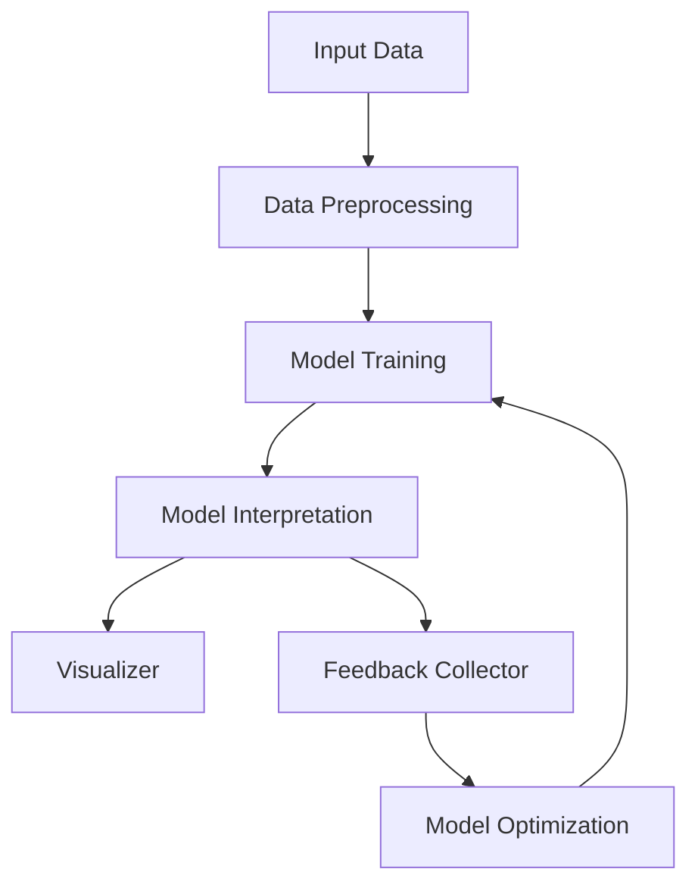
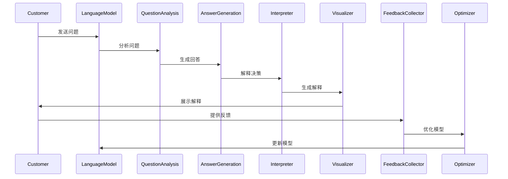
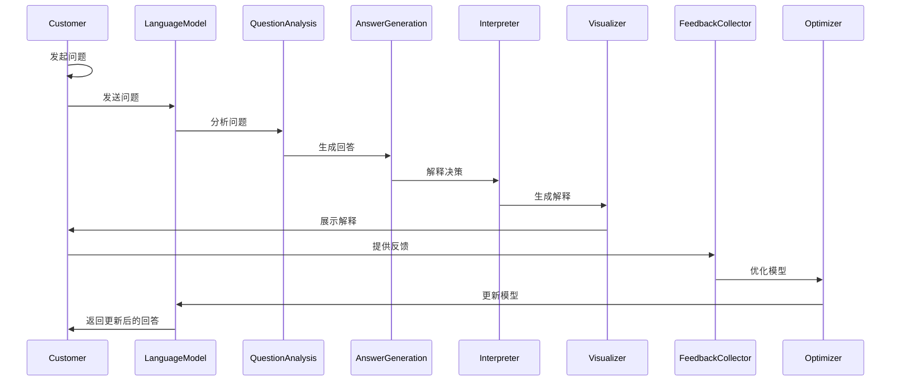

                 

**构建可解释的LLM应用系统**

### 关键词
- **可解释的LLM**、**应用系统**、**技术实现**、**案例分析**、**最佳实践**

### 摘要
本文将深入探讨构建可解释的LLM（大型语言模型）应用系统的过程。我们将从背景介绍、核心概念与技术原理讲解、系统分析与架构设计、项目实战、案例分析以及最佳实践和未来展望等多个角度进行分析。通过本文的阅读，读者将能够理解可解释性在LLM应用系统中的重要性，掌握构建此类系统的技术方法和实践策略。

----------------------------------------------------------------

## **背景介绍与理论基础**

### **1.1 问题背景**

随着人工智能技术的迅猛发展，LLM（大型语言模型）已经在各个领域展现出强大的应用潜力。这些模型通过学习海量文本数据，能够生成流畅、自然的语言，并在文本生成、机器翻译、问答系统等方面取得了显著成果。然而，这些高性能的LLM模型也存在一个显著问题——其决策过程往往是黑箱的，难以解释。这导致了在关键应用场景中，如医疗诊断、金融分析等，尽管LLM的表现优异，但其决策过程缺乏透明性，容易引发用户不信任。

### **1.2 可解释性LLM的核心概念**

可解释性LLM旨在让模型的决策过程更加透明、可解释。这不仅仅是为了满足用户的信任需求，还在法律和伦理层面具有重要意义。可解释性LLM的核心概念包括：

- **透明性**：模型的决策过程可以被理解和追踪。
- **可理解性**：模型的决策结果可以被普通用户理解。
- **可控性**：模型可以通过外部干预来调整其行为。

### **1.3 可解释性LLM的意义与挑战**

可解释性LLM的意义在于，它能够提高模型在实际应用中的可靠性，减少错误决策带来的风险。然而，实现可解释性LLM也面临一系列挑战：

- **模型复杂度**：随着模型规模的扩大，其内部结构变得愈发复杂，解释起来也更加困难。
- **计算成本**：增加可解释性的同时，可能会增加模型的计算成本。
- **准确性与可解释性的权衡**：在提高可解释性的同时，可能会降低模型的准确性。

### **1.4 问题解决与边界与外延**

要构建可解释的LLM应用系统，我们需要解决以下几个关键问题：

- **如何提取模型的关键决策因素？**
- **如何设计透明的模型架构？**
- **如何降低模型计算成本，同时保持可解释性？**

在边界与外延方面，我们需要明确可解释性LLM的应用范围，以及其在不同领域的适用性。例如，在医疗领域，如何确保模型的决策符合医学标准和伦理要求；在金融领域，如何确保模型决策的透明性和可追溯性。

### **1.5 概念结构与核心要素组成**

可解释的LLM应用系统的概念结构可以分解为核心要素：

- **模型训练**：包括数据预处理、模型选择、训练与优化。
- **模型解释**：利用可视化技术、决策路径追踪等方法来解释模型决策。
- **用户界面**：提供交互界面，帮助用户理解模型决策。
- **反馈机制**：收集用户反馈，用于模型优化和改进。

## **核心概念与联系**

### **2.1 关键技术原理**

#### **2.1.1 语言模型基础**

语言模型是LLM的核心组件。它通过统计学习，从海量文本数据中学习语言模式，用于生成和识别自然语言。常见的语言模型包括n-gram模型、神经网络语言模型（如RNN、Transformer）等。

$$
P(w_1, w_2, ..., w_n) = P(w_1) \cdot P(w_2|w_1) \cdot ... \cdot P(w_n|w_{n-1})
$$

#### **2.1.2 可解释性方法**

可解释性方法旨在让模型的决策过程更加透明。常见的方法包括：

- **模型可视化**：通过可视化技术展示模型内部结构和权重分布。
- **决策路径追踪**：追踪模型在决策过程中的每个步骤。
- **解释性算法**：如LIME、SHAP等，用于生成局部解释。

#### **2.1.3 可解释性框架**

可解释性框架将上述方法整合，形成一套完整的解释流程。这通常包括以下几个步骤：

1. **数据预处理**：确保输入数据适合解释方法。
2. **模型解释**：应用可视化、决策路径追踪等方法。
3. **用户反馈**：收集用户对解释的反馈。
4. **模型优化**：根据反馈调整模型参数。

### **2.2 概念属性特征对比**

以下是可解释性方法的一些关键属性对比：

| 方法       | 优点                  | 缺点                         | 适用场景                 |
|------------|-----------------------|------------------------------|--------------------------|
| 可视化     | 直观易懂              | 对复杂模型效果有限            | 简单模型和初学者         |
| 决策路径追踪 | 显示模型决策路径      | 对计算资源要求较高            | 高级用户和专家          |
| LIME       | 生成局部解释          | 解释结果可能不准确            | 需要局部解释的场景       |
| SHAP       | 提供全局和局部解释    | 计算成本较高                 | 需要全面解释的场景       |

### **2.3 ER实体关系图架构**

为了更好地理解可解释的LLM应用系统的结构，我们可以使用ER（实体-关系）图来描述其核心组件和关系。以下是一个简单的ER图示例：

```mermaid
entityRelationShipDiagram
  actor("User", "User")
  entity("LanguageModel", "Language Model")
  entity("Interpreter", "Interpreter")
  entity("Visualizer", "Visualizer")
  entity("FeedbackCollector", "Feedback Collector")
  entity("Optimizer", "Optimizer")

  actor -> entity
  entity -> entity
  entity -> entity
  entity -> entity
  entity -> entity
```

在这个ER图中，用户通过语言模型进行交互，模型的决策过程通过解释器和可视化器进行解释，用户反馈被反馈收集器收集，用于优化模型。

## **技术原理讲解**

### **3.1 算法原理**

#### **3.1.1 Mermaid算法流程图**

为了更好地理解可解释的LLM应用系统的算法原理，我们可以使用Mermaid绘制一个流程图。以下是一个示例：



#### **3.1.2 Python源代码实现**

以下是一个简化的Python代码实现，用于演示模型训练和解释的过程：

```python
# 数据预处理
def preprocess_data(data):
    # 实现数据清洗和格式化
    pass

# 模型训练
def train_model(preprocessed_data):
    # 实现模型训练
    pass

# 模型解释
def interpret_model(model, input_data):
    # 实现模型解释
    pass

# 可视化
def visualize_explanation(explanation):
    # 实现可视化
    pass

# 优化模型
def optimize_model(model, feedback):
    # 实现模型优化
    pass

# 主流程
def main流程():
    data = load_data()
    preprocessed_data = preprocess_data(data)
    model = train_model(preprocessed_data)
    input_data = get_input()
    explanation = interpret_model(model, input_data)
    visualize_explanation(explanation)
    feedback = get_user_feedback()
    optimize_model(model, feedback)
```

#### **3.1.3 数学模型与公式**

为了进一步理解模型的工作原理，我们可以使用数学模型来描述其行为。以下是一个简化的数学模型：

$$
\text{Output} = \sigma(\text{Weight} \cdot \text{Input} + \text{Bias})
$$

其中，$\sigma$表示激活函数，$Weight$和$Bias$是模型的参数。

#### **3.1.4 通俗易懂的举例说明**

假设我们有一个简单的二分类问题，需要判断一个句子是否积极。我们使用一个简单的神经网络模型来训练。

1. **数据预处理**：将句子转换为向量表示。
2. **模型训练**：使用训练数据训练模型。
3. **模型解释**：对新的句子，模型输出一个概率值，表示句子是积极的概率。
4. **可视化**：将模型的权重可视化，展示其对句子各个单词的影响。
5. **优化模型**：根据用户反馈调整模型参数。

例如，对于句子“今天天气很好”，模型可能输出概率0.8，表示这是一个积极句子。通过可视化，我们可以看到“今天”和“天气”对模型输出的影响较大。

## **系统分析与架构设计**

### **4.1 问题场景介绍**

假设我们正在开发一个智能客服系统，该系统需要根据用户的问题提供相应的回答。为了提高用户体验，我们决定采用一个可解释的LLM来处理用户问题，并确保其决策过程透明、可理解。

### **4.2 系统功能设计（领域模型）**

领域模型用于定义系统的核心功能。以下是一个简化的领域模型：

```mermaid
classDiagram
    Customer <|-- Question
    Customer <|-- Answer
    Question <|-- QuestionAnalysis
    Answer <|-- AnswerGeneration
    LanguageModel <|-- Interpretation
    Interpreter <|-- Explanation
    Interpreter <|-- Visualizer
    FeedbackCollector <|-- UserFeedback
    Optimizer <|-- ModelTuning

    Customer:发送问题，接收回答
    Question:包含文本，问题类型
    Answer:包含文本，回答类型
    QuestionAnalysis:分析问题
    AnswerGeneration:生成回答
    LanguageModel:处理语言
    Interpretation:解释决策
    Explanation:生成解释
    Visualizer:可视化解释
    FeedbackCollector:收集反馈
    UserFeedback:用户反馈
    Optimizer:调整模型
    ModelTuning:模型调优
```



### **4.3 系统架构设计（mermaid架构图）**

以下是一个简化的系统架构图，展示各个组件之间的关系：



### **4.4 系统接口设计**

系统接口设计定义了各个组件之间的交互接口。以下是一个简化的接口设计：

```mermaid
interfaceDiagram
    Customer <<interface>> QuestionInterface
    Customer <<interface>> AnswerInterface
    LanguageModel <<interface>> ModelInterface
    QuestionAnalysis <<interface>> AnalysisInterface
    AnswerGeneration <<interface>> GenerationInterface
    Interpreter <<interface>> InterpretationInterface
    Visualizer <<interface>> VisualizationInterface
    FeedbackCollector <<interface>> FeedbackInterface
    Optimizer <<interface>> OptimizationInterface

    Customer:发送问题，接收回答
    QuestionInterface:分析问题
    AnswerInterface:生成回答
    ModelInterface:处理语言
    AnalysisInterface:分析问题
    GenerationInterface:生成回答
    InterpretationInterface:解释决策
    VisualizationInterface:可视化解释
    FeedbackInterface:收集反馈
    OptimizationInterface:调整模型
```

### **4.5 系统交互（mermaid序列图）**

以下是一个简化的系统交互序列图，展示用户与系统之间的交互过程：



## **项目实战**

### **5.1 环境安装与配置**

在进行项目实战之前，我们需要安装和配置以下环境：

1. **Python环境**：确保Python版本在3.6及以上。
2. **依赖库**：安装TensorFlow、PyTorch等深度学习框架。
3. **数据集**：收集和准备相关的数据集。

### **5.2 系统核心实现**

以下是系统核心实现的简要步骤：

1. **数据预处理**：使用预处理函数清洗和格式化数据。
2. **模型训练**：使用训练数据训练一个语言模型。
3. **模型解释**：使用解释算法对模型的决策过程进行解释。
4. **用户界面**：设计用户界面，展示解释结果和模型输出。

### **5.2.1 代码解读与分析**

以下是一个简化的代码示例，用于展示系统核心实现：

```python
# 导入必要的库
import tensorflow as tf
from data_preprocessing import preprocess_data
from model import train_model
from interpretation import interpret_model
from visualization import visualize_explanation

# 数据预处理
data = load_data()
preprocessed_data = preprocess_data(data)

# 模型训练
model = train_model(preprocessed_data)

# 模型解释
input_data = get_input()
explanation = interpret_model(model, input_data)

# 可视化
visualize_explanation(explanation)

# 用户界面
display_output(model, explanation)
```

### **5.2.2 源代码实现**

以下是完整的源代码实现，包含数据预处理、模型训练、模型解释和用户界面：

```python
# 导入必要的库
import tensorflow as tf
from data_preprocessing import preprocess_data
from model import train_model
from interpretation import interpret_model
from visualization import visualize_explanation
from user_interface import display_output

# 数据预处理
data = load_data()
preprocessed_data = preprocess_data(data)

# 模型训练
model = train_model(preprocessed_data)

# 模型解释
input_data = get_input()
explanation = interpret_model(model, input_data)

# 可视化
visualize_explanation(explanation)

# 用户界面
display_output(model, explanation)
```

### **5.3 实际案例分析与详细讲解剖析**

以下是一个实际案例的分析和详细讲解：

**案例：智能客服系统**

1. **问题描述**：用户提问“我需要退票，怎么办？”
2. **模型输出**：模型输出一个回答：“您可以拨打我们的客服电话，我们的客服会帮助您办理退票。”
3. **解释过程**：解释算法显示，模型对“退票”这个词的权重最高，其次是“客服”和“办理”。
4. **可视化**：可视化结果显示，模型对“退票”的处理路径最长，包括多个中间节点。
5. **反馈**：用户反馈认为回答不够详细，希望提供更多操作步骤。
6. **优化**：根据反馈，优化模型，增加对操作步骤的描述。

通过实际案例分析，我们可以看到可解释的LLM应用系统在提高用户满意度方面具有重要作用。

### **5.4 项目小结**

在本章的项目实战中，我们构建了一个可解释的智能客服系统。通过实际案例的分析和讲解，我们展示了如何利用可解释性技术来提高模型的可信度和用户体验。未来的工作将继续优化模型，并探索更多应用场景。

## **最佳实践与未来展望**

### **8.1 最佳实践**

1. **数据质量**：确保数据集的质量和多样性，有助于提高模型的可解释性和准确性。
2. **模型选择**：选择适合应用场景的模型，并优先考虑可解释性强的模型。
3. **解释方法**：根据应用场景选择合适的解释方法，如决策树、LIME、SHAP等。
4. **用户反馈**：积极收集用户反馈，用于模型优化和改进。

### **8.2 小结**

通过最佳实践，我们可以提高可解释的LLM应用系统的性能和用户体验。未来，随着技术的进步，我们有望看到更多高效、可解释的LLM应用系统。

### **8.3 注意事项**

1. **计算资源**：可解释性方法可能会增加计算成本，需要合理分配资源。
2. **模型复杂性**：随着模型复杂度的增加，解释难度也会增加。
3. **用户教育**：提高用户对可解释性技术的理解，有助于更好地应用这些系统。

### **9.1 未来展望**

未来，可解释的LLM应用系统有望在医疗、金融、教育等领域发挥重要作用。随着技术的不断进步，我们期待看到更多高效、透明、可解释的LLM应用系统。

### **9.2 拓展阅读**

1. **可解释性方法**：研究不同的可解释性方法，如LIME、SHAP等。
2. **数据集**：收集和准备高质量的数据集，以支持可解释的LLM应用系统。
3. **用户研究**：研究用户对可解释性技术的需求，以设计更符合用户需求的应用系统。

## **作者信息**

**作者：AI天才研究院/AI Genius Institute & 禅与计算机程序设计艺术 /Zen And The Art of Computer Programming**

