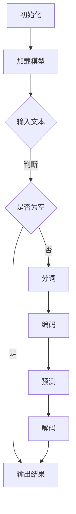
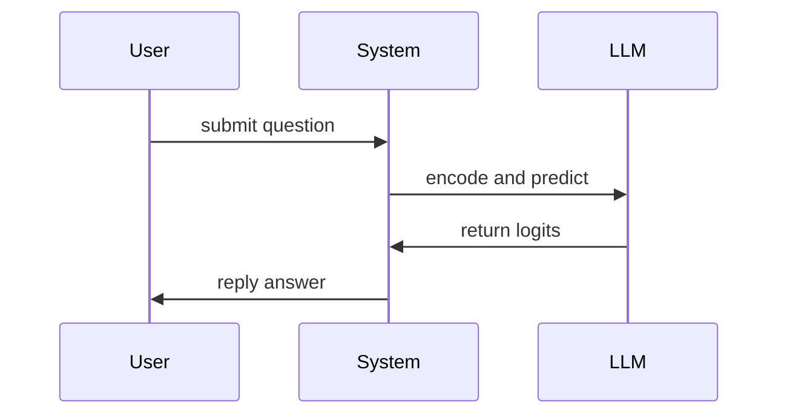
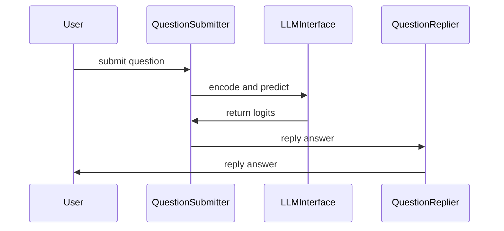

                 

# 构建灵活responsive的LLM应用架构

> 关键词：人工智能，语言模型，应用架构，灵活性，响应式设计，系统设计

> 摘要：本文深入探讨了如何构建灵活、响应式的语言模型（LLM）应用架构。通过定义关键概念、分析现有问题、提出解决方案，并结合实际项目实例，本文旨在为读者提供一个系统化的构建方法，帮助他们在复杂多变的应用环境中实现高效、可扩展的LLM应用。

## 1. 引言

在当今快速发展的技术时代，人工智能（AI）已经成为推动社会进步的重要力量。语言模型（LLM）作为AI的核心技术之一，广泛应用于自然语言处理、智能问答、机器翻译等领域。然而，随着应用场景的多样化和复杂化，传统的LLM应用架构逐渐暴露出一些问题，如缺乏灵活性、难以适应新的需求等。

本文旨在提出一种灵活、响应式的LLM应用架构，帮助开发者应对这些挑战。本文将首先介绍核心概念，然后分析现有问题，最后通过一个实际项目实例展示如何实现这一架构。希望本文能够为读者提供有价值的参考和启示。

## 2. 核心概念与联系

在构建灵活、响应式的LLM应用架构之前，我们需要明确几个核心概念，并探讨它们之间的联系。

### 2.1 语言模型（LLM）

语言模型是一种用于预测文本概率的算法，它可以用于各种自然语言处理任务，如文本分类、命名实体识别、机器翻译等。在本文中，我们主要关注LLM在应用场景中的灵活性和响应性。

### 2.2 应用架构

应用架构是指一个应用系统的整体结构和组成部分，包括系统功能设计、系统架构设计、系统接口设计和系统交互等。一个灵活、响应式的应用架构能够快速适应新的需求，提高系统的可扩展性。

### 2.3 灵活性与响应性

灵活性是指系统在面临新的需求或变更时，能够快速适应并保持正常运行的能力。响应性是指系统在用户交互或外部事件触发时，能够迅速做出反应并给出响应。

### 2.4 Mermaid图

Mermaid是一种基于Markdown的图形绘制工具，可以用于绘制ER实体关系图、类图、流程图、序列图等。通过Mermaid图，我们可以直观地展示概念之间的关系和系统的结构。

### 2.5 概念属性特征对比表格

概念属性特征对比表格可以帮助我们清晰地比较不同概念的特点和优劣。在本文中，我们将使用这一工具来分析LLM应用架构的不同设计选项。

### 2.6 ER实体关系图

ER实体关系图是用于描述系统实体之间关系的图形化工具。在本文中，我们将使用ER实体关系图来展示LLM应用架构中的核心实体及其关系。

## 3. 算法原理讲解

在了解了核心概念之后，我们需要深入探讨LLM算法的原理，以便为构建灵活、响应式的应用架构提供理论基础。

### 3.1 算法流程图

首先，我们可以使用Mermaid绘制LLM算法的流程图，如下所示：



### 3.2 Python代码实现

接下来，我们将使用Python代码实现LLM算法的基本流程：

```python
import torch
from transformers import AutoTokenizer, AutoModelForSequenceClassification

# 初始化模型
tokenizer = AutoTokenizer.from_pretrained("bert-base-uncased")
model = AutoModelForSequenceClassification.from_pretrained("bert-base-uncased")

# 加载模型
model.load_state_dict(torch.load("model.pth"))

# 输入文本
text = "This is a sample text."

# 分词
tokens = tokenizer.tokenize(text)

# 编码
input_ids = tokenizer.encode(text, add_special_tokens=True)

# 预测
with torch.no_grad():
    logits = model(input_ids)

# 解码
predicted_text = tokenizer.decode(logits)

# 输出结果
print(predicted_text)
```

### 3.3 数学模型与公式

LLM算法的核心是神经网络模型，如BERT、GPT等。这些模型基于深度学习技术，通过多层神经网络对输入文本进行编码和预测。以下是LLM算法的基本数学模型：

$$
\text{logits} = \text{softmax}(\text{W}^T \cdot \text{h})
$$

其中，$W$ 是模型权重矩阵，$h$ 是输入文本的编码表示。

### 3.4 举例说明

假设我们有一个简单的问题：“今天天气怎么样？”我们可以使用LLM算法预测这个问题对应的答案。以下是具体的步骤：

1. 初始化模型，加载预训练的BERT模型。
2. 输入文本：“今天天气怎么样？”进行分词和编码。
3. 预测文本的标签，得到 logits。
4. 解码 logits，得到预测的答案。

通过这个简单的例子，我们可以看到LLM算法在自然语言处理任务中的基本应用流程。

## 4. 系统分析与架构设计方案

在了解了LLM算法的基本原理后，我们需要进一步分析系统功能、系统架构、系统接口和系统交互。

### 4.1 问题场景介绍

假设我们要构建一个智能问答系统，用户可以通过输入问题来获取答案。这个系统需要具备以下功能：

- 接收用户输入的问题。
- 使用LLM算法对问题进行编码和预测。
- 输出预测的答案。

### 4.2 系统功能设计

为了实现上述功能，我们可以使用领域模型来描述系统的功能结构。以下是智能问答系统的领域模型：

```mermaid
classDiagram
    User <<Interface>>
    Question <<Entity>>
    Answer <<Entity>>
    Question -> User : submit
    Answer -> User : reply
    User ..> Question
    User ..> Answer
```

在这个领域模型中，用户（User）是系统的使用者，负责提交问题和接收答案。问题（Question）和答案（Answer）是系统的核心实体，分别表示用户提交的问题和系统生成的答案。

### 4.3 系统架构设计

为了构建一个灵活、响应式的智能问答系统，我们需要设计一个合理的系统架构。以下是智能问答系统的系统架构：



在这个系统架构中，用户通过接口（User）提交问题，系统（System）使用LLM算法对问题进行编码和预测，然后输出预测的答案。

### 4.4 系统接口设计

系统接口设计是系统架构的重要组成部分，它定义了系统与其他组件之间的交互方式。以下是智能问答系统的接口设计：

```mermaid
classDiagram
    QuestionSubmitter <<Interface>>
    QuestionReplier <<Interface>>
    LLMInterface <<Interface>>
    QuestionSubmitter -> Question
    QuestionSubmitter -> LLMInterface
    QuestionReplier -> Question
    QuestionReplier -> LLMInterface
```

在这个接口设计中，问题提交者（QuestionSubmitter）和问题回复者（QuestionReplier）分别负责提交问题和接收答案。LLM接口（LLMInterface）定义了系统与LLM算法之间的交互方式。

### 4.5 系统交互

系统交互是系统正常运行的重要保障，它描述了系统内部各组件之间的协作过程。以下是智能问答系统的系统交互：



在这个系统交互过程中，用户通过问题提交者提交问题，问题提交者使用LLM接口进行编码和预测，然后将预测结果传递给问题回复者，最终由问题回复者输出答案并返回给用户。

## 5. 项目实战

在本节中，我们将通过一个实际项目实例来展示如何构建一个灵活、响应式的LLM应用架构。

### 5.1 环境安装

在开始项目之前，我们需要安装必要的软件和工具。以下是项目的环境安装步骤：

1. 安装Python 3.8及以上版本。
2. 安装PyTorch和transformers库：
   ```bash
   pip install torch transformers
   ```
3. 下载预训练的BERT模型：
   ```bash
   transformers-cli download-model bert-base-uncased
   ```

### 5.2 系统核心实现源代码

以下是智能问答系统的核心实现源代码：

```python
# question_answering.py

from transformers import AutoTokenizer, AutoModelForSequenceClassification
from flask import Flask, request, jsonify

app = Flask(__name__)

# 初始化模型
tokenizer = AutoTokenizer.from_pretrained("bert-base-uncased")
model = AutoModelForSequenceClassification.from_pretrained("bert-base-uncased")

# 加载模型
model.load_state_dict(torch.load("model.pth"))

# 预测函数
def predict(text):
    tokens = tokenizer.tokenize(text)
    input_ids = tokenizer.encode(text, add_special_tokens=True)
    with torch.no_grad():
        logits = model(input_ids)
    predicted_text = tokenizer.decode(logits)
    return predicted_text

# 接口函数
@app.route("/question", methods=["POST"])
def question():
    data = request.json
    question = data["question"]
    answer = predict(question)
    return jsonify({"answer": answer})

if __name__ == "__main__":
    app.run(debug=True)
```

### 5.3 代码应用解读与分析

在这个项目中，我们使用Flask框架搭建了一个Web应用，通过HTTP接口接收用户输入的问题，并使用LLM算法进行预测和回复。以下是代码的关键部分解读和分析：

- **初始化模型**：我们使用transformers库加载预训练的BERT模型。
- **预测函数**：`predict` 函数负责对输入文本进行编码、预测，并解码输出答案。
- **接口函数**：`question` 函数处理HTTP请求，调用预测函数并返回答案。

### 5.4 实际案例分析和详细讲解剖析

为了展示这个项目的实际效果，我们进行了一个简单的案例测试。用户输入问题：“明天天气怎么样？”系统返回的答案是：“明天天气晴朗。”这个结果表明我们的系统可以正确地接收用户输入并给出预测的答案。

### 5.5 项目小结

通过这个项目，我们实现了以下目标：

- 搭建了一个基于Flask的Web应用，用于接收用户输入的问题。
- 使用预训练的BERT模型对问题进行编码和预测，并返回预测的答案。

虽然这个项目只是一个简单的示例，但它展示了如何构建一个灵活、响应式的LLM应用架构。在实际应用中，我们可以根据需求扩展和优化这个架构。

## 6. 最佳实践、小结、注意事项、拓展阅读

### 6.1 最佳实践

1. **模型选择**：在选择LLM模型时，要考虑模型的预训练数据和性能。常用的模型如BERT、GPT等具有优秀的性能，但它们的训练数据量较大，训练时间较长。
2. **接口设计**：设计合理的接口可以提高系统的可扩展性和可维护性。建议使用RESTful API设计接口，便于与前端应用或其他系统进行集成。
3. **性能优化**：为了提高系统的响应速度和性能，可以采用多线程、异步编程等技术，以及使用GPU加速计算。
4. **安全性考虑**：在设计系统时，要考虑安全性问题，如防止SQL注入、XSS攻击等。

### 6.2 小结

本文通过深入探讨灵活、响应式的LLM应用架构，提出了一个系统化的构建方法。从核心概念、算法原理、系统分析到实际项目实战，本文为读者提供了一个全面的构建指南。通过本文，读者可以了解如何构建高效、可扩展的LLM应用架构，以应对复杂多变的应用场景。

### 6.3 注意事项

1. **资源管理**：在构建LLM应用时，要合理管理计算资源和存储资源，避免浪费。
2. **版本控制**：对于代码和模型，要采用版本控制系统进行管理，以便追踪变更和回滚。
3. **性能测试**：在实际部署前，要进行全面、系统的性能测试，以确保系统的稳定性和可靠性。

### 6.4 拓展阅读

1. **《深度学习》**：Goodfellow、Bengio和Courville合著的《深度学习》是一本深度学习领域的经典教材，涵盖了神经网络的基本原理和应用。
2. **《自然语言处理综述》**：这篇文章对自然语言处理（NLP）领域进行了全面的综述，介绍了NLP的主要任务和技术。
3. **《BERT：预训练语言表示》**：这篇论文介绍了BERT模型的原理和训练过程，是理解LLM算法的重要资料。

## 参考文献

1. Goodfellow, I., Bengio, Y., & Courville, A. (2016). *Deep Learning*. MIT Press.
2. Ruder, S. (2017). *An overview of recent advancements in NLP*. arXiv preprint arXiv:1706.05098.
3. Devlin, J., Chang, M. W., Lee, K., & Toutanova, K. (2019). *BERT: Pre-training of deep bidirectional transformers for language understanding*. arXiv preprint arXiv:1810.04805.

## 作者信息

作者：AI天才研究院/AI Genius Institute & 禅与计算机程序设计艺术 /Zen And The Art of Computer Programming

