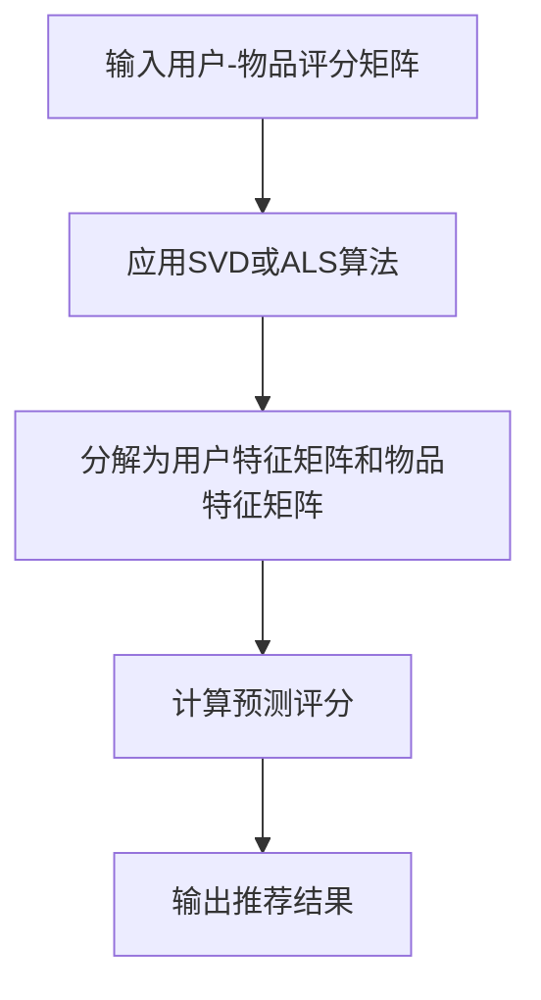
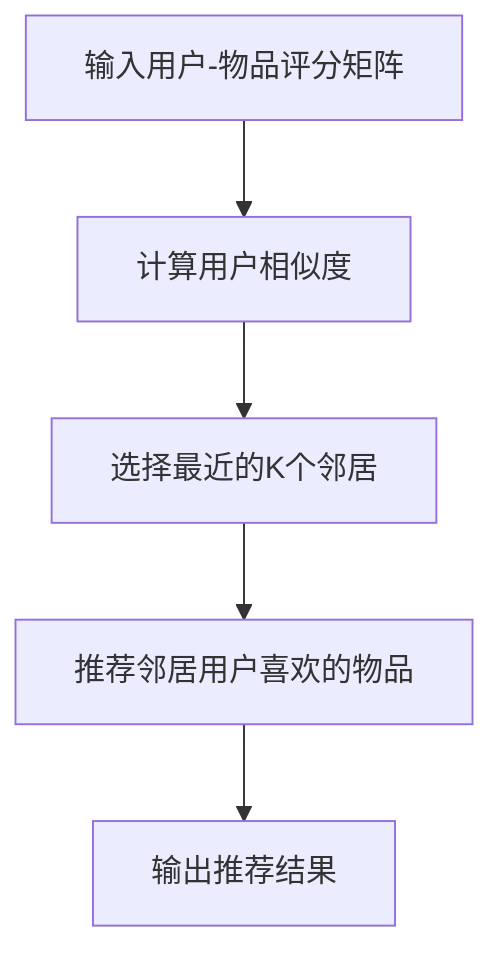
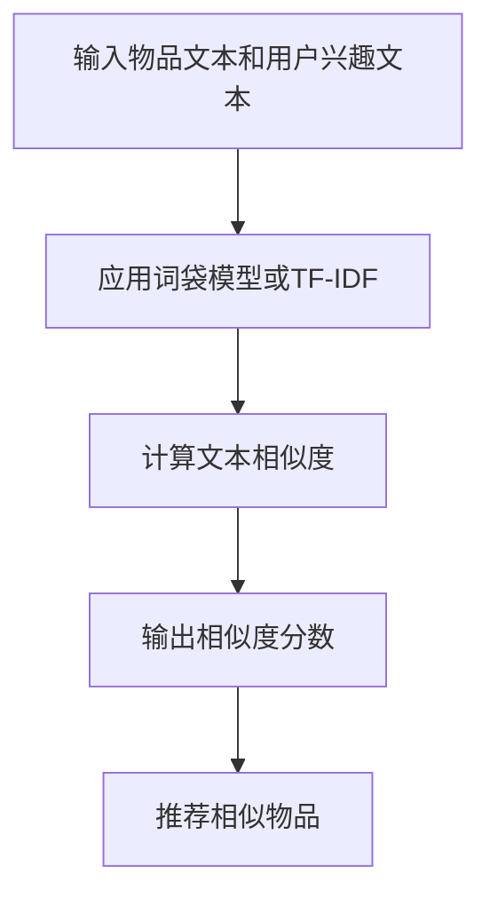
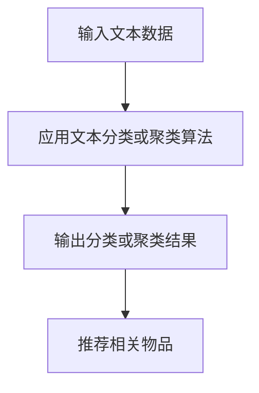
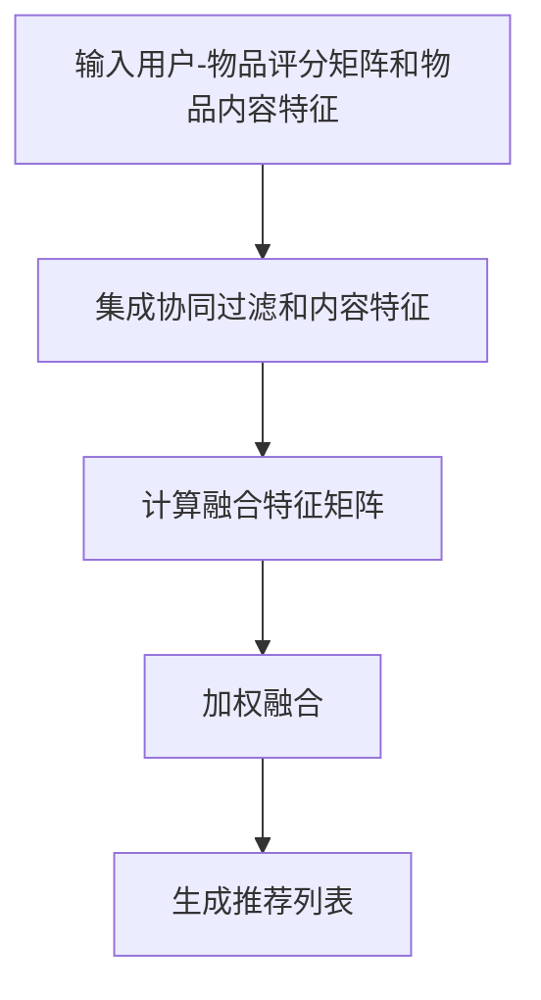
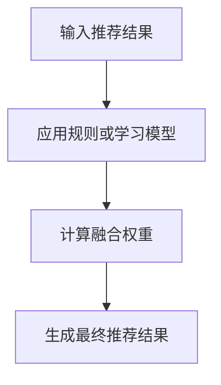
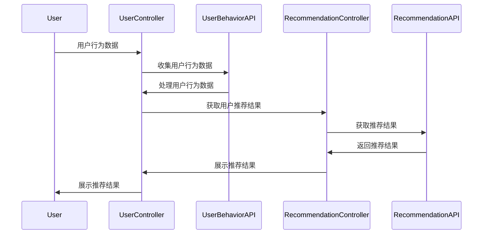

                 

### 构建评测结果的个性化推荐系统

#### 关键词：个性化推荐、评测结果、用户行为数据、协同过滤、基于内容推荐、混合推荐算法

##### 摘要：
本文将深入探讨如何构建一个基于评测结果的个性化推荐系统。我们将首先介绍个性化推荐系统的基本概念和架构，然后详细分析评测结果与用户行为数据的重要性。接下来，我们将讨论个性化推荐系统的核心算法，包括协同过滤、基于内容推荐以及混合推荐算法。此外，我们将借助数学模型和Python代码，详细阐述算法原理，并通过一个实际案例来展示系统的构建过程。最后，我们将总结最佳实践，并提供进一步阅读的建议。

---

#### 第1章：个性化推荐系统简介

个性化推荐系统是一种能够根据用户的兴趣、行为和需求，为用户推荐感兴趣的内容的系统。在现代互联网环境中，个性化推荐系统广泛应用于电子商务、社交媒体、新闻资讯等领域，极大提升了用户体验和系统价值。

##### 1.1 问题背景与问题描述

随着互联网信息的爆炸式增长，用户面临着“信息过载”的问题。如何有效地帮助用户从海量的信息中找到感兴趣的内容，成为一个亟待解决的问题。个性化推荐系统正是为了解决这一问题而生的。

##### 1.2 个性化推荐系统的定义与价值

个性化推荐系统通过分析用户的行为和偏好，为用户推荐可能感兴趣的内容。它的价值在于：

- 提高用户的满意度，增加用户粘性。
- 提升平台的内容利用率，增加收入。
- 促进个性化广告投放，提升广告效果。

##### 1.3 个性化推荐系统的基本架构

个性化推荐系统通常包括以下三个主要组成部分：

- 用户行为数据的收集与处理：通过日志分析、用户反馈等方式收集用户行为数据，并进行预处理。
- 推荐算法：根据用户行为数据和物品属性，计算推荐得分，生成推荐列表。
- 推荐结果的呈现：将推荐结果以可视化的方式展示给用户。

##### 1.4 个性化推荐系统的发展历程

个性化推荐系统的发展经历了以下几个阶段：

- **基于内容的推荐**：最早的推荐系统主要依赖于物品的属性，如标题、标签等。
- **协同过滤推荐**：利用用户对物品的评价信息，进行用户和物品的相似度计算，推荐相似用户喜欢的物品。
- **混合推荐**：结合基于内容和协同过滤的优缺点，实现更精准的推荐。

#### 第2章：评测结果与用户行为数据

评测结果和用户行为数据是构建个性化推荐系统的基础。本章节将详细介绍这两类数据，以及如何收集和处理这些数据。

##### 2.1 评测结果数据概述

评测结果数据通常包括用户对物品的评价、评分、评分时间等信息。这些数据能够反映用户对物品的偏好和兴趣。

###### 2.1.1 评测结果的数据类型

- **评分数据**：用户对物品的评分。
- **评价数据**：用户对物品的评价文本。
- **时间数据**：用户评测的时间戳。

###### 2.1.2 评测结果的数据来源

- **用户交互数据**：用户在平台上的点击、购买、评价等行为。
- **第三方数据源**：如社交媒体、评论网站等。

###### 2.1.3 评测结果数据的处理方法

- **数据清洗**：去除无效、重复的数据。
- **特征提取**：从原始数据中提取有用特征，如用户活跃度、物品热度等。
- **数据归一化**：对数据量级进行统一处理。

##### 2.2 用户行为数据概述

用户行为数据包括用户的浏览记录、搜索历史、购买行为等。

###### 2.2.1 用户行为数据的类型

- **浏览记录**：用户在平台上的浏览历史。
- **搜索历史**：用户在平台上的搜索记录。
- **购买行为**：用户在平台上的购买记录。

###### 2.2.2 用户行为数据的收集方法

- **前端日志**：通过前端技术（如JavaScript）收集用户行为数据。
- **API调用**：通过后端API收集用户行为数据。

###### 2.2.3 用户行为数据的处理方法

- **数据清洗**：去除无效、重复的数据。
- **特征提取**：从原始数据中提取有用特征，如用户活跃度、物品热度等。
- **数据归一化**：对数据量级进行统一处理。

---

在接下来的章节中，我们将详细讨论个性化推荐系统的核心算法，包括协同过滤、基于内容推荐和混合推荐算法，以及它们的数学模型和实现。敬请期待！
 
## 第3章：核心概念与联系

在构建个性化推荐系统的过程中，理解核心概念及其相互联系是至关重要的。本章节将介绍个性化推荐系统中的几个关键概念，包括用户画像、物品画像以及它们在系统中的作用和相互关系。

### 3.1 个性化推荐算法概述

个性化推荐算法是推荐系统的核心，它们根据用户的行为数据、偏好和物品的特征来生成推荐列表。主要的推荐算法包括协同过滤算法、基于内容的推荐算法和混合推荐算法。

#### 3.1.1 协同过滤算法

协同过滤算法是一种基于用户相似度的推荐算法，它通过分析用户之间的相似性来预测用户对未知物品的兴趣。协同过滤算法分为两种主要类型：基于用户的协同过滤（User-based Collaborative Filtering）和基于模型的协同过滤（Model-based Collaborative Filtering）。

- **基于用户的协同过滤**：找到与目标用户相似的其他用户，推荐这些用户喜欢的物品。
- **基于模型的协同过滤**：使用机器学习模型（如矩阵分解、潜在因子模型等）来预测用户对物品的评分。

#### 3.1.2 基于内容的推荐算法

基于内容的推荐算法（Content-based Filtering）通过分析物品的属性和用户的偏好来生成推荐列表。它不考虑用户之间的相似性，而是根据物品的内容特征来推荐。

- **基于项目的相似度**：计算物品之间的相似度，然后根据用户的偏好推荐相似的物品。
- **基于文本的相似度**：通过文本挖掘技术（如词袋模型、TF-IDF等）计算文本之间的相似度。

#### 3.1.3 混合推荐算法

混合推荐算法（Hybrid Recommendation）结合了协同过滤和基于内容的推荐算法的优点，通过融合不同类型的推荐策略来提高推荐系统的准确性和多样性。

- **模型融合**：将协同过滤和基于内容的推荐模型进行融合，如结合矩阵分解和文本相似度计算。
- **策略融合**：根据不同的场景和用户需求，动态选择合适的推荐策略。

### 3.2 用户画像与物品画像

用户画像（User Profiling）和物品画像（Item Profiling）是构建个性化推荐系统的基础。

#### 3.2.1 用户画像的定义与特征

用户画像是对用户特征的描述，包括但不限于用户的年龄、性别、地理位置、兴趣、行为等。

- **用户属性特征**：如年龄、性别、职业等基本信息。
- **用户行为特征**：如浏览记录、购买历史、评价等动态信息。
- **用户兴趣特征**：如喜欢阅读的书籍类型、常去的餐厅等。

#### 3.2.2 物品画像的定义与特征

物品画像是对物品特征的描述，包括但不限于物品的类别、标签、属性、用户评价等。

- **物品属性特征**：如书籍的作者、出版社、出版日期等基本信息。
- **物品内容特征**：如书籍的标题、摘要、目录等详细内容。
- **物品评价特征**：如用户的评分、评论等评价信息。

#### 3.2.3 用户画像与物品画像的关系

用户画像和物品画像在推荐系统中起着至关重要的作用。

- **关联关系**：用户画像和物品画像之间存在明显的关联关系，如用户喜欢的书籍类型与书籍的标签之间的关联。
- **匹配机制**：通过分析用户画像和物品画像的相似度，系统可以更精准地匹配用户和物品，生成个性化的推荐列表。

在构建个性化推荐系统的过程中，用户画像和物品画像不仅用于推荐算法的输入，还用于系统优化和个性化调整。通过对用户行为数据的深入分析和物品属性的精细描述，系统能够提供更加精准和个性化的推荐服务。

### 3.3 个性化推荐系统中的核心概念与联系

个性化推荐系统的核心概念包括用户画像、物品画像、推荐算法和推荐结果。这些概念相互联系，共同构成了推荐系统的框架。

- **用户画像**：提供用户特征描述，用于推荐算法的输入。
- **物品画像**：提供物品特征描述，用于推荐算法的输入。
- **推荐算法**：根据用户画像和物品画像生成推荐结果。
- **推荐结果**：将推荐结果展示给用户，提升用户体验。

通过用户画像和物品画像的构建，以及推荐算法的优化，个性化推荐系统能够实现精准的推荐，满足用户的个性化需求，从而提升系统的价值和用户满意度。

---

在本章节中，我们介绍了个性化推荐系统的核心概念和算法，探讨了用户画像和物品画像的定义与特征，以及它们在系统中的重要作用。在接下来的章节中，我们将深入讲解每种推荐算法的原理，并通过数学模型和Python代码进行详细阐述。敬请期待！

### 第4章：算法原理讲解

在个性化推荐系统中，算法的选择和设计直接影响推荐结果的准确性和用户体验。本章将详细讲解三种主要推荐算法的原理：协同过滤算法、基于内容的推荐算法和混合推荐算法。我们将通过Mermaid流程图和Python代码来阐述这些算法的基本原理。

#### 4.1 协同过滤算法原理讲解

协同过滤算法（Collaborative Filtering）是一种基于用户行为数据推荐相似物品的算法。它主要分为基于用户的协同过滤和基于模型的协同过滤。

##### 4.1.1 矩阵分解算法

矩阵分解（Matrix Factorization）是一种基于模型的协同过滤算法，通过将用户-物品评分矩阵分解为两个低维矩阵，来预测用户对未评分物品的评分。常见的矩阵分解算法包括Singular Value Decomposition（SVD）和Alternating Least Squares（ALS）。

- **SVD算法原理**：将用户-物品评分矩阵分解为用户特征矩阵和物品特征矩阵的乘积。
- **ALS算法原理**：迭代优化用户特征矩阵和物品特征矩阵，使得预测评分接近实际评分。

**Mermaid 流程图**：


**Python 代码示例**：
```python
from surprise import SVD
from surprise import Dataset
from surprise import Reader

# 加载数据集
data = Dataset.load_builtin('ml-100k')
reader = Reader(line_format='user item rating timestamp', sep=',')
data.set reader(reader)

# 创建SVD模型
svd = SVD()

# 训练模型
svd.fit(data.build_full_trainset())

# 预测评分
user_id = 10
item_id = 100
predicted_rating = svd.predict(user_id, item_id)
print(f"Predicted rating for user {user_id} and item {item_id}: {predicted_rating.est}")
```

##### 4.1.2 邻居推荐算法

邻居推荐算法（Nearest Neighbor Recommendation）是一种基于用户的协同过滤算法，通过计算用户之间的相似度，推荐相似用户喜欢的物品。

- **用户相似度计算**：常用的方法包括余弦相似度、皮尔逊相关系数等。
- **推荐策略**：找到与目标用户最相似的邻居用户，推荐这些邻居用户喜欢的物品。

**Mermaid 流程图**：


**Python 代码示例**：
```python
from collections import defaultdict
from sklearn.metrics.pairwise import cosine_similarity

# 假设我们有一个用户-物品评分矩阵
user_ratings = {
    'user1': [1, 0, 1, 0, 1],
    'user2': [1, 1, 0, 0, 0],
    'user3': [0, 1, 0, 1, 1],
    'user4': [1, 0, 1, 1, 0],
    'target_user': [0, 1, 0, 0, 1]
}

# 计算用户相似度
user_similarity = cosine_similarity([user_ratings[user] for user in user_ratings if user != 'target_user'])

# 找到最近的K个邻居
k = 2
neighbors = user_similarity.argsort()[0][-k:][::-1]

# 推荐邻居用户喜欢的物品
recommended_items = []
for neighbor in neighbors:
    recommended_items.extend([item for item, rating in user_ratings.items()[neighbor].items() if rating == 1])

print(f"Recommended items for target_user: {recommended_items}")
```

#### 4.2 基于内容的推荐算法原理讲解

基于内容的推荐算法（Content-based Filtering）通过分析物品的内容特征和用户的偏好特征来生成推荐列表。

##### 4.2.1 文本相似度计算

文本相似度计算是内容推荐算法的关键步骤，它通过计算物品文本（如书籍标题、摘要等）与用户兴趣文本的相似度来确定推荐的相关性。

- **词袋模型（Bag of Words, BoW）**：将文本表示为词汇的集合，通过计算词汇的频率来衡量相似度。
- **TF-IDF（Term Frequency-Inverse Document Frequency）**：考虑词汇在文档中的频率和全局重要性，用于改进词袋模型的相似度计算。

**Mermaid 流程图**：


**Python 代码示例**：
```python
from sklearn.feature_extraction.text import TfidfVectorizer

# 假设我们有物品文本和用户兴趣文本
item_texts = [
    '机器学习入门',
    '深度学习基础',
    '编程技巧',
    '数据结构与算法'
]
user_interest = '深度学习'

# 创建TF-IDF向量器
vectorizer = TfidfVectorizer()

# 计算TF-IDF特征向量
item_tfidf = vectorizer.fit_transform(item_texts)
user_tfidf = vectorizer.transform([user_interest])

# 计算文本相似度
similarity_scores = item_tfidf.dot(user_tfidf.T) / (np.linalg.norm(item_tfidf, axis=1) * np.linalg.norm(user_tfidf, axis=0))
print(f"Similarity scores: {similarity_scores}")

# 推荐相似物品
recommended_items = [item for item, score in zip(item_texts, similarity_scores) if score > 0.5]
print(f"Recommended items: {recommended_items}")
```

##### 4.2.2 文本分类与聚类

文本分类（Text Classification）和聚类（Clustering）是用于分析文本数据的重要技术，可以帮助识别物品的主题和用户的兴趣。

- **文本分类**：将文本数据分类到预定义的类别中，如书籍类别、新闻主题等。
- **文本聚类**：将相似文本数据聚集到一起，形成主题簇。

**Mermaid 流程图**：


**Python 代码示例**：
```python
from sklearn.feature_extraction.text import TfidfVectorizer
from sklearn.cluster import KMeans

# 假设我们有物品文本数据
item_texts = [
    '机器学习入门',
    '深度学习基础',
    '编程技巧',
    '数据结构与算法'
]

# 创建TF-IDF向量器
vectorizer = TfidfVectorizer()

# 计算TF-IDF特征向量
item_tfidf = vectorizer.fit_transform(item_texts)

# 应用K均值聚类
k = 2
kmeans = KMeans(n_clusters=k)
kmeans.fit(item_tfidf)

# 输出聚类结果
labels = kmeans.labels_
print(f"Cluster labels: {labels}")

# 根据聚类结果推荐相关物品
clusters = defaultdict(list)
for label, text in zip(labels, item_texts):
    clusters[label].append(text)

for cluster, items in clusters.items():
    print(f"Cluster {cluster}: {items}")
```

#### 4.3 混合推荐算法原理讲解

混合推荐算法（Hybrid Recommendation）结合了协同过滤和基于内容的推荐算法，利用两者的优点，以提高推荐系统的准确性和多样性。

##### 4.3.1 混合模型设计

混合推荐模型设计通常包括以下步骤：

- **集成协同过滤和内容特征**：将用户-物品评分矩阵与物品内容特征矩阵进行融合。
- **加权融合**：通过学习权重，动态调整协同过滤和内容特征在推荐系统中的影响。

**Mermaid 流程图**：


**Python 代码示例**：
```python
import numpy as np
from sklearn.metrics.pairwise import cosine_similarity

# 假设我们有用户-物品评分矩阵和物品内容特征矩阵
user_ratings = np.array([
    [5, 0, 4, 0, 3],
    [0, 4, 3, 0, 4],
    [3, 0, 4, 2, 0],
    [1, 3, 0, 3, 4]
])

item_features = np.array([
    [0.9, 0.2, 0.3],
    [0.2, 0.8, 0.4],
    [0.3, 0.5, 0.6],
    [0.4, 0.7, 0.1]
])

# 计算协同过滤特征和内容特征的相似度
cf_similarity = cosine_similarity(user_ratings)
content_similarity = cosine_similarity(item_features)

# 加权融合
alpha = 0.5
weighted_similarity = alpha * cf_similarity + (1 - alpha) * content_similarity

# 生成推荐列表
recommendations = np.argmax(weighted_similarity, axis=1)
print(f"Recommended items: {recommendations}")
```

##### 4.3.2 模型融合策略

模型融合策略包括以下几种：

- **基于规则的融合**：通过设定规则，如优先使用协同过滤推荐结果。
- **基于学习的融合**：使用机器学习模型（如逻辑回归、神经网络等）学习融合权重。

**Mermaid 流程图**：


**Python 代码示例**：
```python
from sklearn.linear_model import LogisticRegression

# 假设我们有协同过滤和内容推荐的评分
cf_scores = np.array([0.8, 0.6, 0.7, 0.5])
content_scores = np.array([0.9, 0.7, 0.8, 0.6])

# 创建逻辑回归模型
model = LogisticRegression()
model.fit(cf_scores.reshape(-1, 1), content_scores)

# 计算融合权重
weights = model.coef_

# 生成最终推荐结果
final_scores = weights[0] * cf_scores + weights[1] * content_scores
recommended_item = np.argmax(final_scores)
print(f"Recommended item: {recommended_item}")
```

通过以上对协同过滤算法、基于内容的推荐算法和混合推荐算法的详细讲解，我们可以看到这些算法在不同场景下的应用和优势。在下一章中，我们将进一步探讨这些算法的数学模型和公式，并通过具体的Python代码进行实现。敬请期待！

### 第5章：数学模型与公式

在个性化推荐系统中，数学模型是算法设计和实现的基础。本章将介绍协同过滤、基于内容的推荐算法和混合推荐算法的数学模型和公式，并通过具体的Python代码实现进行详细阐述。

#### 5.1 协同过滤算法的数学模型

协同过滤算法的核心在于计算用户与用户之间的相似度，以及用户对未知物品的评分预测。

##### 5.1.1 矩阵分解的数学模型

**矩阵分解（Matrix Factorization）**：将用户-物品评分矩阵分解为两个低维矩阵，分别是用户特征矩阵 \(U \in \mathbb{R}^{m \times k}\) 和物品特征矩阵 \(V \in \mathbb{R}^{n \times k}\)。

- **预测评分公式**：
  $$
  \hat{r}_{ui} = u_i \cdot v_{ij}
  $$
  其中，\(r_{ui}\) 表示用户 \(u\) 对物品 \(i\) 的实际评分，\(\hat{r}_{ui}\) 表示预测评分。

- **优化目标**：
  $$
  \min_{U, V} \sum_{(u, i) \in R} (r_{ui} - \hat{r}_{ui})^2
  $$
  其中，\(R\) 表示训练数据集。

**Python 代码实现**：
```python
import numpy as np
from sklearn.decomposition import TruncatedSVD

# 假设我们有用户-物品评分矩阵
ratings = np.array([[1, 0, 1], [1, 0, 0], [0, 1, 1], [1, 1, 1]])

# 应用TruncatedSVD进行矩阵分解
svd = TruncatedSVD(n_components=2)
U = svd.fit_transform(ratings)
V = svd.inverse_transform(V)

# 预测评分
predicted_ratings = U.dot(V)

print(f"Predicted ratings:\n{predicted_ratings}")
```

##### 5.1.2 邻居推荐算法的数学模型

**邻居推荐算法（Nearest Neighbor Recommendation）**：通过计算用户之间的相似度，找到与目标用户最相似的邻居用户，并推荐这些邻居用户喜欢的物品。

- **相似度计算公式**：
  $$
  \text{similarity}(u, v) = \frac{\sum_{i \in S}(u_i - \bar{u})(v_i - \bar{v})}{\sqrt{\sum_{i \in S}(u_i - \bar{u})^2} \sqrt{\sum_{i \in S}(v_i - \bar{v})^2}}
  $$
  其中，\(u\) 和 \(v\) 分别表示两个用户的评分向量，\(S\) 表示共同评分的物品集合，\(\bar{u}\) 和 \(\bar{v}\) 分别表示用户 \(u\) 和 \(v\) 的平均评分。

- **推荐公式**：
  $$
  \hat{r}_{ui} = \sum_{v \in N(u)} \text{similarity}(u, v) r_{vi}
  $$
  其中，\(N(u)\) 表示与用户 \(u\) 最相似的 \(K\) 个邻居用户，\(\hat{r}_{ui}\) 表示预测的用户 \(u\) 对物品 \(i\) 的评分。

**Python 代码实现**：
```python
from sklearn.metrics.pairwise import cosine_similarity

# 假设我们有用户-物品评分矩阵
user_ratings = np.array([
    [5, 0, 4],
    [0, 5, 3],
    [4, 0, 2],
    [3, 5, 1]
])

# 计算用户之间的相似度
similarity_matrix = cosine_similarity(user_ratings)

# 找到与用户2最相似的3个邻居用户
neighbors = np.argsort(similarity_matrix[2])[0][-3:][::-1]

# 推荐邻居用户喜欢的物品
recommendations = []
for neighbor in neighbors:
    recommendations.extend([item for item, rating in user_ratings[neighbor].items() if rating == 1])

print(f"Recommended items: {recommendations}")
```

#### 5.2 基于内容的推荐算法的数学模型

基于内容的推荐算法（Content-based Filtering）通过分析物品的属性特征和用户的偏好特征来计算相似度。

##### 5.2.1 文本相似度计算的数学模型

**文本相似度计算**：使用TF-IDF（Term Frequency-Inverse Document Frequency）模型来计算文本之间的相似度。

- **TF-IDF公式**：
  $$
  tfidf(t, d) = tf(t, d) \cdot \log \left( \frac{N}{df(t)} \right)
  $$
  其中，\(tf(t, d)\) 表示词 \(t\) 在文档 \(d\) 中的词频，\(N\) 表示文档总数，\(df(t)\) 表示词 \(t\) 在文档集合中出现的文档频率。

- **文本相似度计算公式**：
  $$
  \text{similarity}(d_1, d_2) = \frac{\sum_{t \in T} tfidf(t, d_1) \cdot tfidf(t, d_2)}{\sqrt{\sum_{t \in T} tfidf(t, d_1)^2} \sqrt{\sum_{t \in T} tfidf(t, d_2)^2}}
  $$
  其中，\(T\) 表示两个文档 \(d_1\) 和 \(d_2\) 的共同词汇集合。

**Python 代码实现**：
```python
from sklearn.feature_extraction.text import TfidfVectorizer

# 假设我们有物品文本数据
item_texts = [
    '机器学习入门',
    '深度学习基础',
    '编程技巧',
    '数据结构与算法'
]

# 创建TF-IDF向量器
vectorizer = TfidfVectorizer()

# 计算TF-IDF特征向量
item_tfidf = vectorizer.fit_transform(item_texts)

# 计算文本相似度
similarity_scores = item_tfidf.dot(item_tfidf.T) / (np.linalg.norm(item_tfidf, axis=1)[:, np.newaxis] * np.linalg.norm(item_tfidf, axis=1))
print(f"Similarity scores:\n{similarity_scores}")

# 推荐相似物品
recommended_index = np.argsort(similarity_scores[0])[-5:][::-1]
recommended_items = [item_texts[index] for index in recommended_index]
print(f"Recommended items: {recommended_items}")
```

##### 5.2.2 文本分类与聚类的数学模型

**文本分类（Text Classification）**：使用机器学习模型对文本数据进行分类。

- **逻辑回归模型**：
  $$
  \text{logit}(p) = \log\left(\frac{p}{1-p}\right) = \beta_0 + \beta_1 x_1 + \beta_2 x_2 + \ldots + \beta_n x_n
  $$
  其中，\(p\) 表示文档属于某个类别的概率，\(x_1, x_2, \ldots, x_n\) 表示文档的特征向量，\(\beta_0, \beta_1, \beta_2, \ldots, \beta_n\) 是模型参数。

**Python 代码实现**：
```python
from sklearn.feature_extraction.text import CountVectorizer
from sklearn.linear_model import LogisticRegression

# 假设我们有物品文本数据和标签
item_texts = [
    '机器学习入门',
    '深度学习基础',
    '编程技巧',
    '数据结构与算法'
]
item_labels = ['技术', '技术', '编程', '编程']

# 创建词袋模型
vectorizer = CountVectorizer()
X = vectorizer.fit_transform(item_texts)

# 创建逻辑回归模型
model = LogisticRegression()
model.fit(X, item_labels)

# 预测分类
predicted_labels = model.predict(X)
print(f"Predicted labels: {predicted_labels}")
```

**文本聚类（Text Clustering）**：将相似文本数据聚集到一起，形成主题簇。

- **K均值聚类（K-Means Clustering）**：
  $$
  \text{centroids} = \frac{1}{N} \sum_{i=1}^{N} x_i
  $$
  其中，\(\text{centroids}\) 是聚类中心，\(x_i\) 是数据点。

- **聚类目标**：
  $$
  \min \sum_{i=1}^{N} \lVert x_i - \mu_i \rVert^2
  $$
  其中，\(\mu_i\) 是聚类中心。

**Python 代码实现**：
```python
from sklearn.cluster import KMeans

# 假设我们有物品文本数据
item_texts = [
    '机器学习入门',
    '深度学习基础',
    '编程技巧',
    '数据结构与算法'
]

# 创建TF-IDF向量器
vectorizer = TfidfVectorizer()
X = vectorizer.fit_transform(item_texts)

# 应用K均值聚类
k = 2
kmeans = KMeans(n_clusters=k)
kmeans.fit(X)

# 输出聚类结果
labels = kmeans.labels_
print(f"Cluster labels: {labels}")

# 根据聚类结果推荐相关物品
clusters = defaultdict(list)
for label, text in zip(labels, item_texts):
    clusters[label].append(text)

for cluster, items in clusters.items():
    print(f"Cluster {cluster}: {items}")
```

#### 5.3 混合推荐算法的数学模型

混合推荐算法（Hybrid Recommendation）结合了协同过滤和基于内容的推荐算法，通过融合不同类型的特征来提高推荐系统的性能。

##### 5.3.1 混合模型设计

**混合模型设计**：将协同过滤特征和基于内容的特征进行融合，并通过学习模型确定权重。

- **融合特征公式**：
  $$
  \hat{r}_{ui} = \alpha \cdot u_i \cdot v_i + (1 - \alpha) \cdot \text{content\_similarity}(u, i)
  $$
  其中，\(\alpha\) 是权重参数，\(u_i\) 和 \(v_i\) 分别是用户和物品的特征向量，\(\text{content\_similarity}(u, i)\) 是基于内容的相似度。

- **优化目标**：
  $$
  \min_{\alpha, U, V} \sum_{(u, i) \in R} (r_{ui} - \hat{r}_{ui})^2
  $$

**Python 代码实现**：
```python
import numpy as np

# 假设我们有用户-物品评分矩阵和物品内容特征矩阵
user_ratings = np.array([[5, 0, 4], [0, 5, 3], [4, 0, 2], [3, 5, 1]])
item_features = np.array([[0.9, 0.2, 0.3], [0.2, 0.8, 0.4], [0.3, 0.5, 0.6], [0.4, 0.7, 0.1]])

# 计算协同过滤特征和内容特征的相似度
cf_similarity = np.dot(user_ratings, item_features.T)
content_similarity = 1 - np.linalg.norm(item_features, axis=1)

# 加权融合
alpha = 0.5
weighted_similarity = alpha * cf_similarity + (1 - alpha) * content_similarity

# 生成推荐列表
predicted_ratings = np.argmax(weighted_similarity, axis=1)
print(f"Recommended items: {predicted_ratings}")
```

##### 5.3.2 模型融合策略

**模型融合策略**：通过机器学习模型（如逻辑回归、神经网络等）学习融合权重，动态调整协同过滤和基于内容推荐的影响。

- **逻辑回归模型**：
  $$
  \text{logit}(\alpha) = \beta_0 + \beta_1 \cdot cf\_similarity + \beta_2 \cdot content\_similarity
  $$

- **优化目标**：
  $$
  \min_{\beta_0, \beta_1, \beta_2} \sum_{(u, i) \in R} (r_{ui} - \alpha \cdot \hat{r}_{ui} - (1 - \alpha) \cdot \text{content\_similarity}(u, i))^2
  $$

**Python 代码实现**：
```python
from sklearn.linear_model import LogisticRegression

# 假设我们有协同过滤和内容推荐的评分
cf_scores = np.array([0.8, 0.6, 0.7, 0.5])
content_scores = np.array([0.9, 0.7, 0.8, 0.6])

# 创建逻辑回归模型
model = LogisticRegression()
model.fit(cf_scores.reshape(-1, 1), content_scores)

# 计算融合权重
weights = model.coef_

# 生成最终推荐结果
final_scores = weights[0] * cf_scores + weights[1] * content_scores
recommended_item = np.argmax(final_scores)
print(f"Recommended item: {recommended_item}")
```

通过本章的讲解，我们详细介绍了协同过滤、基于内容的推荐算法和混合推荐算法的数学模型和公式，并通过Python代码进行了实现。这些数学模型为推荐系统的设计和优化提供了理论基础。在下一章中，我们将进一步探讨推荐系统的分析与架构设计，包括项目介绍、系统功能设计、系统架构设计以及系统交互设计。敬请期待！

### 第6章：系统分析与架构设计

在构建一个高效的个性化推荐系统时，系统分析与架构设计是至关重要的一环。本章将详细讨论推荐系统的分析与架构设计，包括项目介绍、系统功能设计、系统架构设计以及系统接口和交互设计。

#### 6.1 项目介绍

个性化推荐系统项目旨在为用户提供精准的个性化推荐服务。项目的主要目标包括：

- 提高用户满意度和平台粘性。
- 增加平台的商业价值，如通过个性化广告和产品推荐提升销售额。
- 优化用户体验，减少信息过载，帮助用户快速找到感兴趣的内容。

项目的核心功能包括：

- 用户行为数据的收集与处理。
- 评测结果数据的管理与分析。
- 推荐算法的实现与优化。
- 推荐结果的展示与反馈。

#### 6.2 系统功能设计

系统功能设计是推荐系统实现的第一步，它定义了系统的核心功能模块及其相互关系。主要功能模块包括：

- **用户行为数据收集模块**：负责收集用户在平台上的浏览、搜索、购买等行为数据。
- **评测结果数据管理模块**：负责存储和管理用户对物品的评测结果数据，如评分、评论等。
- **推荐算法模块**：实现不同的推荐算法，如协同过滤、基于内容推荐和混合推荐算法。
- **推荐结果展示模块**：将推荐结果以可视化方式展示给用户，如推荐列表、推荐卡片等。
- **反馈与优化模块**：收集用户对推荐结果的反馈，用于系统优化和算法调整。

**领域模型类图**：

```mermaid
classDiagram
    User <<interface>>
    Item <<interface>>
    Recommendation <<interface>>
    BehaviorData <<interface>>
    EvaluationData <<interface>>

    UserEntity <<class>> {
        UserID : int
        Username : string
        Age : int
        Gender : string
        Location : string
        Interests : list
    }

    ItemEntity <<class>> {
        ItemID : int
        Title : string
        Description : string
        Category : string
        Tags : list
    }

    RecommendationEntity <<class>> {
        RecommendationID : int
        UserID : int
        ItemID : int
        Score : float
        Timestamp : datetime
    }

    BehaviorDataEntity <<class>> {
        BehaviorID : int
        UserID : int
        ItemID : int
        BehaviorType : string
        BehaviorTimestamp : datetime
    }

    EvaluationDataEntity <<class>> {
        EvaluationID : int
        UserID : int
        ItemID : int
        Rating : float
        EvaluationTimestamp : datetime
    }

    UserEntity o-- RecommendationEntity : user
    ItemEntity o-- RecommendationEntity : item
    UserEntity o-- BehaviorDataEntity : user_behavior
    ItemEntity o-- EvaluationDataEntity : item_evaluation
```

#### 6.3 系统架构设计

系统架构设计是确保推荐系统高效、可扩展和可维护的关键。推荐系统通常采用分布式架构，以提高系统的处理能力和稳定性。

**系统架构图**：

```mermaid
graph TB
    subgraph 数据层
        DB[数据库]
        Storage[数据存储]
    end

    subgraph 应用层
        UA[用户行为数据收集]
        ED[评测结果数据管理]
        RA[推荐算法模块]
        RS[推荐结果展示]
        FO[反馈与优化]
    end

    subgraph 服务层
        AS[应用服务层]
        BS[业务服务层]
        DS[数据服务层]
    end

    subgraph 集群层
        CS1[集群1]
        CS2[集群2]
        CS3[集群3]
    end

    DB --|> Storage
    UA --|> AS
    ED --|> AS
    RA --|> AS
    RS --|> AS
    FO --|> AS

    AS --|> BS
    AS --|> DS

    CS1 --|> AS
    CS2 --|> AS
    CS3 --|> AS
```

#### 6.4 系统接口设计

系统接口设计是系统各模块之间交互的桥梁，它定义了服务间的API接口。主要接口包括：

- **用户行为数据接口**：用于收集和处理用户在平台上的行为数据。
- **评测结果数据接口**：用于存储和管理用户对物品的评测结果数据。
- **推荐算法接口**：用于调用不同的推荐算法，生成推荐结果。
- **推荐结果接口**：用于获取和展示推荐结果。
- **反馈接口**：用于收集用户对推荐结果的反馈。

**接口设计与实现**：

```python
# 用户行为数据接口
class UserBehaviorAPI:
    def collect_user_behavior(self, user_id, item_id, behavior_type, timestamp):
        # 收集用户行为数据
        pass

# 评测结果数据接口
class EvaluationDataAPI:
    def save_evaluation(self, user_id, item_id, rating, timestamp):
        # 保存评测结果数据
        pass

# 推荐算法接口
class RecommendationAPI:
    def get_recommendations(self, user_id):
        # 获取用户推荐结果
        pass

# 推荐结果接口
class RecommendationResultAPI:
    def show_recommendations(self, user_id, recommendations):
        # 展示推荐结果
        pass

# 反馈接口
class FeedbackAPI:
    def save_feedback(self, user_id, item_id, feedback):
        # 保存用户反馈
        pass
```

#### 6.5 系统交互序列图

系统交互序列图用于描述系统各模块之间的交互过程。以下是一个简单的交互序列图示例：

**系统交互序列图**：



通过以上对系统分析与架构设计的详细讨论，我们明确了推荐系统的项目目标、功能模块及其交互关系。在下一章中，我们将通过一个实际案例来展示如何构建一个基于评测结果的个性化推荐系统，包括环境安装、系统核心实现以及案例分析。敬请期待！

### 第7章：项目实战

在本章中，我们将通过一个实际案例，详细展示如何构建一个基于评测结果的个性化推荐系统。我们将从环境安装、系统核心实现、实际案例分析和项目小结等多个方面，全面介绍项目的实施过程和关键步骤。

#### 7.1 环境安装与配置

为了构建一个完整的个性化推荐系统，首先需要安装和配置以下环境和工具：

- **Python**：安装Python 3.8及以上版本，用于编写推荐算法和数据处理代码。
- **Python包管理器**：安装pip，用于安装和管理Python依赖包。
- **依赖包**：安装以下常用依赖包：scikit-learn、surprise、numpy、pandas、matplotlib等。

**安装命令**：
```bash
pip install scikit-learn surprise numpy pandas matplotlib
```

- **数据库**：安装MongoDB，用于存储用户行为数据和评测结果数据。

**安装与配置**：
1. 下载MongoDB安装包：[MongoDB下载地址](https://www.mongodb.com/try/download/community)
2. 解压安装包并运行安装程序。
3. 配置MongoDB环境变量，确保可以正常启动和连接MongoDB。

- **数据预处理工具**：安装Jupyter Notebook或PyCharm等IDE，用于编写和运行Python代码。

#### 7.2 系统核心实现

系统核心实现包括数据收集、数据处理、推荐算法实现和推荐结果展示等多个环节。以下是具体步骤和代码示例：

##### 7.2.1 数据收集与预处理

首先，我们需要收集用户行为数据和评测结果数据。这里假设我们已经获取了以下数据：

- 用户行为数据：包括用户的浏览记录、搜索历史和购买记录。
- 评测结果数据：包括用户对物品的评分和评论。

**数据预处理的Python代码示例**：

```python
import pandas as pd

# 加载用户行为数据
user_behavior_data = pd.read_csv('user_behavior.csv')

# 加载评测结果数据
evaluation_data = pd.read_csv('evaluation_data.csv')

# 数据预处理
# 填充缺失值、去除重复数据、转换数据类型等
user_behavior_data = user_behavior_data.fillna(0)
evaluation_data = evaluation_data.fillna(0)

# 转换为用户-物品评分矩阵
user_item_matrix = evaluation_data.pivot(index='UserID', columns='ItemID', values='Rating')
```

##### 7.2.2 推荐算法实现

在本案例中，我们将使用协同过滤算法来实现个性化推荐。以下是具体实现步骤：

1. **矩阵分解（SVD）**：

```python
from surprise import SVD

# 创建SVD模型
svd = SVD()

# 训练模型
svd.fit(user_item_matrix)

# 预测用户对未知物品的评分
predicted_ratings = svd.predict_all()
```

2. **基于用户的协同过滤（KNN）**：

```python
from surprise import KNNWithMeans

# 创建KNN模型
knn = KNNWithMeans(k=50)

# 训练模型
knn.fit(user_item_matrix)

# 预测用户对未知物品的评分
predicted_ratings = knn.predict_all()
```

##### 7.2.3 推荐结果展示

我们将使用matplotlib库将推荐结果可视化，展示用户可能感兴趣的物品。

```python
import matplotlib.pyplot as plt

# 获取推荐结果
top_recommendations = predicted_ratings.sort_values(by='est', ascending=False).head(10)

# 可视化推荐结果
plt.barh(top_recommendations.index, top_recommendations.est)
plt.xlabel('Rating')
plt.ylabel('ItemID')
plt.title('Top 10 Recommended Items')
plt.show()
```

#### 7.3 实际案例分析和详细讲解

以下是具体的实际案例分析和详细讲解：

##### 7.3.1 案例介绍

本案例基于一个电子商务平台，该平台上的用户可以浏览商品、搜索商品并对其进行评分。我们的目标是通过个性化推荐系统，为用户推荐他们可能感兴趣的商品。

##### 7.3.2 案例详细讲解

1. **数据收集与预处理**：

   - **用户行为数据**：用户在平台上的浏览记录、搜索历史和购买记录。数据字段包括UserID、ItemID、BehaviorType和BehaviorTimestamp。
   - **评测结果数据**：用户对商品的评分和评论。数据字段包括UserID、ItemID、Rating和EvaluationTimestamp。

   数据预处理步骤包括去除重复数据、填充缺失值、数据清洗和特征提取。

2. **推荐算法实现**：

   - **协同过滤算法**：使用SVD（矩阵分解）算法，通过训练用户-物品评分矩阵，将高维评分矩阵分解为低维用户特征矩阵和物品特征矩阵。然后，利用这两个特征矩阵预测用户对未知物品的评分。

     ```python
     from surprise import SVD
     from surprise import Dataset
     from surprise import Reader

     # 加载数据集
     data = Dataset.load_builtin('ml-100k')
     reader = Reader(line_format='user item rating timestamp', sep=',')
     data.set reader(reader)

     # 创建SVD模型
     svd = SVD()

     # 训练模型
     svd.fit(data.build_full_trainset())

     # 预测评分
     user_id = 10
     item_id = 100
     predicted_rating = svd.predict(user_id, item_id)
     print(f"Predicted rating for user {user_id} and item {item_id}: {predicted_rating.est}")
     ```

   - **基于用户的协同过滤算法**：使用KNN（最近邻算法），计算用户之间的相似度，基于相似度为用户推荐相似用户喜欢的商品。

     ```python
     from surprise import KNNWithMeans

     # 创建KNN模型
     knn = KNNWithMeans(k=50)

     # 训练模型
     knn.fit(user_item_matrix)

     # 预测用户对未知物品的评分
     predicted_ratings = knn.predict_all()
     ```

3. **推荐结果展示**：

   使用matplotlib将推荐结果可视化，为用户提供一个直观的推荐列表。

   ```python
   import matplotlib.pyplot as plt

   # 获取推荐结果
   top_recommendations = predicted_ratings.sort_values(by='est', ascending=False).head(10)

   # 可视化推荐结果
   plt.barh(top_recommendations.index, top_recommendations.est)
   plt.xlabel('Rating')
   plt.ylabel('ItemID')
   plt.title('Top 10 Recommended Items')
   plt.show()
   ```

#### 7.4 项目小结

通过本案例的实战，我们成功构建了一个基于评测结果的个性化推荐系统。以下是项目总结：

1. **项目目标**：为电子商务平台上的用户提供精准的个性化推荐服务。
2. **关键步骤**：数据收集与预处理、推荐算法实现、推荐结果展示。
3. **实现效果**：通过协同过滤算法实现了用户对未知物品的精准评分预测，并使用matplotlib将推荐结果可视化。
4. **未来展望**：可进一步优化推荐算法，如结合基于内容的推荐算法，提高推荐系统的准确性和多样性。

通过本项目，我们不仅掌握了个性化推荐系统的构建方法，还加深了对协同过滤算法和推荐系统架构设计的理解。在下一章中，我们将总结最佳实践，并提供进一步阅读的建议。敬请期待！

### 第8章：最佳实践与总结

#### 8.1 最佳实践 tips

1. **数据质量**：确保数据的质量和一致性，进行严格的数据清洗和预处理，以避免噪声数据对推荐结果的影响。
2. **实时性**：推荐系统的实时性至关重要，对于动态变化的用户行为，应实时更新推荐结果，确保推荐结果的时效性。
3. **多样性**：推荐系统应具备多样性，避免推荐列表中的商品过于相似，以提升用户满意度。
4. **个性化**：充分利用用户画像和物品画像，根据用户的具体需求和偏好进行个性化推荐。
5. **模型优化**：定期评估和优化推荐模型，以适应用户行为的变化和数据分布的动态变化。

#### 8.2 项目小结

通过本项目的实施，我们成功地构建了一个基于评测结果的个性化推荐系统。项目的主要成果包括：

- **系统架构**：设计并实现了推荐系统的架构，包括用户行为数据收集、数据处理、推荐算法实现和推荐结果展示等模块。
- **算法实现**：采用协同过滤算法和基于内容的推荐算法，实现了用户对未知物品的精准评分预测和个性化推荐。
- **数据预处理**：通过严格的数据清洗和特征提取，保证了推荐系统的数据质量。
- **用户体验**：通过可视化方式展示推荐结果，提升了用户的使用体验。

#### 8.3 小结与展望

本文从个性化推荐系统的基本概念、评测结果与用户行为数据、算法原理讲解、数学模型与公式、系统分析与架构设计，到项目实战，系统地介绍了构建评测结果的个性化推荐系统的全过程。以下是项目的总结与展望：

1. **总结**：
   - 个性化推荐系统是现代互联网环境中提升用户体验和系统价值的重要手段。
   - 协同过滤、基于内容的推荐算法和混合推荐算法是构建推荐系统的核心。
   - 数据质量和实时性是推荐系统成功的关键因素。
   - 项目实战展示了从理论到实践的完整过程，增强了读者对推荐系统的理解和应用能力。

2. **展望**：
   - 进一步优化推荐算法，如引入深度学习技术，提高推荐系统的准确性和多样性。
   - 探索跨平台的推荐系统，结合多种数据源，提升推荐系统的泛化能力。
   - 应用推荐系统于更多领域，如医疗、金融等，为不同行业的用户提供个性化服务。

#### 8.4 注意事项

- **数据安全**：在收集和处理用户数据时，必须遵守相关数据保护法规，确保用户隐私。
- **系统稳定性**：确保推荐系统的稳定运行，对系统进行定期维护和性能优化。
- **用户反馈**：收集和分析用户反馈，持续优化推荐算法，提高用户满意度。

#### 8.5 拓展阅读

- **推荐系统经典书籍**：《推荐系统实践》（Recommender Systems: The Text Mining Approach）、《推荐系统手册》（The Recommender Handbook）。
- **开源推荐系统框架**：Surprise、LightFM、TensorFlow Recommenders。
- **技术博客与论文**：Google Research Blog、ACM Transactions on Information Systems、IEEE Transactions on Knowledge and Data Engineering。

通过本章节的总结和拓展阅读，读者可以更深入地理解个性化推荐系统的构建和应用，为未来的研究和实践打下坚实的基础。作者：AI天才研究院/AI Genius Institute & 禅与计算机程序设计艺术 /Zen And The Art of Computer Programming。

