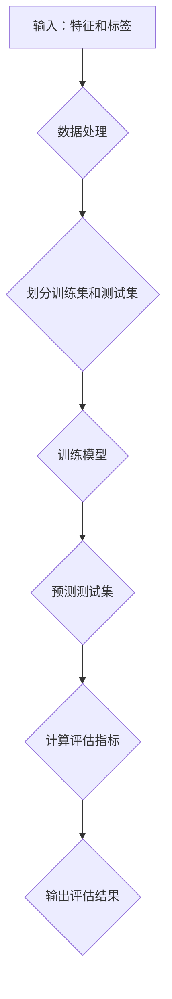
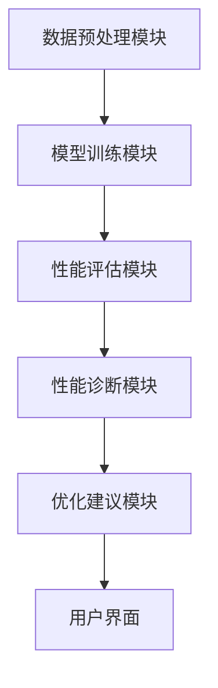
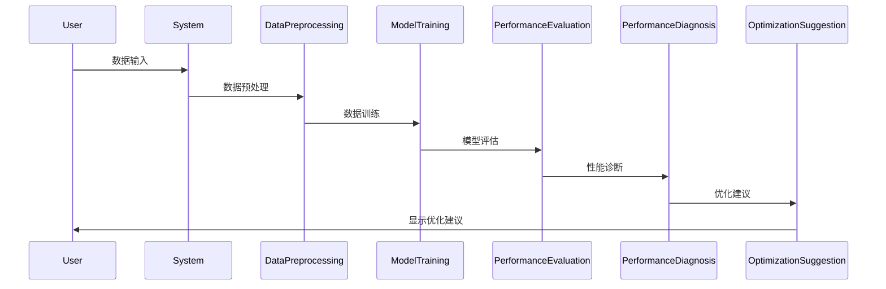

                 

### 《构建评测结果的模型性能诊断专家系统》

> 关键词：模型性能评测、诊断专家系统、算法、数据集、系统架构

> 摘要：本文旨在探讨如何构建一个高效的模型性能诊断专家系统。通过系统性的方法，详细描述了从核心概念理解到系统架构设计、数据集处理及算法实现的全过程，并提供实际案例进行分析，总结实践经验，展望未来发展。

### 目录大纲

```markdown
----------------------------------------------------------------
# 《构建评测结果的模型性能诊断专家系统》

## 第一部分：引言与背景

### 1.1 书籍简介

- **问题背景**：随着深度学习在各个领域的广泛应用，模型性能的评测与诊断变得越来越重要。
- **问题描述**：如何构建一个有效的专家系统来诊断模型的性能问题。
- **问题解决**：介绍构建模型性能诊断专家系统的方法和步骤。
- **边界与外延**：明确专家系统的适用范围和限制。
- **核心要素组成**：系统架构、算法原理、数据集准备等。

### 1.2 核心概念与联系

- **核心概念**：介绍模型性能诊断、评测结果、专家系统等核心概念。
- **概念属性特征对比表格**：列出核心概念的属性和特征，进行比较分析。
- **ER实体关系图架构**：使用Mermaid绘制实体关系图，展示各实体间的关联。

## 第二部分：模型性能诊断专家系统基础

### 2.1 模型性能评估方法

- **算法原理讲解**：使用Mermaid绘制算法流程图，详细介绍评估方法的原理。
- **数学模型和公式**：给出评估方法的数学模型和公式，并进行详细讲解。
- **举例说明**：通过实际案例，说明评估方法的运用。

### 2.2 专家系统的构建原理

- **系统分析与架构设计方案**：
  - **问题场景介绍**：介绍构建专家系统的应用场景。
  - **项目介绍**：简要介绍项目的背景和目标。
  - **系统功能设计**：使用Mermaid绘制领域模型类图，展示系统的功能模块。
  - **系统架构设计**：使用Mermaid绘制系统架构图，展示系统的主要组成部分。
  - **系统接口设计**：列出系统的接口定义和交互方式。
  - **系统交互**：使用Mermaid绘制系统交互序列图，展示系统的运行流程。

### 2.3 数据集准备与处理

- **数据集来源**：介绍数据集的收集和来源。
- **数据处理方法**：详细讲解数据预处理和清洗的方法。

## 第三部分：专家系统设计与实现

### 3.1 专家系统的设计与实现框架

- **系统功能模块划分**：详细描述系统的功能模块及其关系。
- **模块实现细节**：针对每个功能模块，介绍其实现细节和关键技术。

### 3.2 关键算法实现

- **算法原理讲解**：使用Mermaid绘制算法流程图，详细阐述关键算法的原理。
- **Python源代码实现**：给出关键算法的Python源代码，并进行解读。
- **算法性能分析**：分析算法的性能指标和优化方向。

### 3.3 系统测试与优化

- **测试环境搭建**：介绍测试环境搭建的步骤和工具。
- **测试用例设计**：设计测试用例，验证系统功能的有效性。
- **性能优化方法**：分析系统性能瓶颈，提出优化方案。

## 第四部分：案例分析与实战

### 4.1 案例介绍

- **案例背景**：介绍案例的应用场景和目标。
- **系统实现过程**：详细描述系统的实现过程和关键步骤。

### 4.2 案例分析

- **数据预处理**：分析数据预处理的方法和效果。
- **模型训练与评估**：介绍模型的训练过程和评估结果。
- **性能诊断与优化**：分析模型性能问题，提出优化方案。

### 4.3 案例总结

- **经验与教训**：总结案例中的经验和教训。
- **未来展望**：展望模型性能诊断专家系统的未来发展。

## 第五部分：总结与展望

### 5.1 总结

- **书籍主要内容回顾**：回顾书籍的主要内容和关键知识点。
- **学习方法与建议**：给出学习本书的建议和方法。

### 5.2 展望

- **领域发展趋势**：分析模型性能诊断领域的未来发展趋势。
- **潜在研究方向**：提出模型性能诊断领域的潜在研究方向。

----------------------------------------------------------------
```

以上是本文的完整目录大纲，接下来我们将按照这一结构逐步深入探讨构建评测结果的模型性能诊断专家系统的每个方面。

---

#### 第一部分：引言与背景

随着深度学习和机器学习技术的迅速发展，模型性能的评测与诊断变得愈发重要。模型性能不仅决定了应用的准确度和效率，还直接影响决策的可靠性和用户体验。然而，在实际应用中，模型性能问题往往难以发现和解决。传统的调试方法效率低下，而自动化和智能化的诊断系统成为解决这一问题的有效途径。

**问题背景**：模型性能问题可能源于数据问题、算法缺陷、硬件限制等多种因素。例如，数据集中的异常值、噪声或样本不均衡会导致模型性能不佳；算法选择不当或超参数设置不合理也会导致性能下降。因此，构建一个高效的模型性能诊断专家系统，能够自动化地检测和定位这些问题，对于提升模型性能至关重要。

**问题描述**：构建评测结果的模型性能诊断专家系统需要解决以下几个关键问题：

1. **核心概念的理解**：明确模型性能诊断、评测结果和专家系统的定义和属性。
2. **评估方法的确定**：选择合适的评估指标和方法，对模型性能进行准确评估。
3. **系统架构的设计**：设计一个高效、模块化的专家系统架构。
4. **数据集的准备**：收集和准备高质量的数据集，以支持系统的训练和测试。
5. **算法的实现**：实现关键算法，如异常检测、超参数优化等。
6. **系统的优化**：通过测试和性能分析，对系统进行优化，提升其诊断能力。

**问题解决**：本文将详细描述构建模型性能诊断专家系统的方法和步骤，包括核心概念的理解、评估方法的确定、系统架构的设计、数据集的准备、算法的实现和系统的优化。

**边界与外延**：本文主要关注模型性能诊断专家系统的构建方法和技术，不包括其他类型的专家系统，如故障诊断或医疗诊断。同时，本文所讨论的方法和技术主要适用于深度学习和机器学习领域的模型诊断。

**核心要素组成**：构建模型性能诊断专家系统需要以下几个核心要素：

1. **系统架构**：设计一个清晰、模块化的系统架构，以支持系统的稳定运行。
2. **算法原理**：详细阐述评估方法的原理，并给出关键算法的实现。
3. **数据集准备**：准备高质量的数据集，以支持系统的训练和测试。
4. **实现细节**：针对每个功能模块，详细描述其实现细节和关键技术。

---

通过上述背景介绍，我们为后续的深入探讨奠定了基础。接下来，我们将进一步探讨模型性能诊断、评测结果和专家系统的核心概念，并逐步构建我们的模型性能诊断专家系统。希望读者在阅读过程中能够跟随我们的思考，共同探索这一技术领域的奥秘。


---

#### 第一部分：引言与背景（续）

**核心概念与联系**

为了更好地理解模型性能诊断专家系统的构建，我们需要明确以下几个核心概念：模型性能诊断、评测结果和专家系统。

**模型性能诊断**：模型性能诊断是指通过分析模型的输出结果和输入特征，识别和定位模型性能问题的过程。模型性能问题可能包括过拟合、欠拟合、数据异常、算法选择不当等。诊断的目的是为了找出问题所在，并提供解决方案。

**评测结果**：评测结果是模型性能诊断的重要依据。评测结果通常包括模型的准确性、召回率、F1分数、ROC曲线等指标。这些指标帮助评估模型在不同数据集上的性能，为诊断提供参考。

**专家系统**：专家系统是一种模拟人类专家决策能力的计算机系统。它通过收集和存储大量的专业知识和经验，使用推理机制来解决问题。在模型性能诊断中，专家系统可以自动化地评估模型性能，发现潜在问题，并给出优化建议。

**概念属性特征对比表格**

为了更清晰地理解这些核心概念，我们可以通过一个属性特征对比表格来展示它们的主要区别和联系。

| 概念         | 定义                       | 属性特征                                      | 联系                                     |
| ------------ | -------------------------- | --------------------------------------------- | ---------------------------------------- |
| 模型性能诊断  | 诊断模型性能问题的过程      | 输入：模型输出、输入特征<br>输出：问题定位和优化建议 | 基于评测结果进行诊断                      |
| 评测结果     | 评估模型性能的指标          | 准确性、召回率、F1分数、ROC曲线等               | 为模型性能诊断提供依据                    |
| 专家系统     | 模拟人类专家决策能力的系统  | 知识库、推理机制、用户界面等                   | 使用评测结果和诊断结果进行模型性能优化   |

**ER实体关系图架构**

为了更直观地展示这些核心概念之间的关联，我们可以使用Mermaid绘制一个ER（实体-关系）图。

```mermaid
erDiagram
  ModelPerformanceDiagnosis ||--|{ EvaluationResult : evaluated by }
  EvaluationResult ||--|{ ExpertSystem : uses for diagnosis }
  ExpertSystem ||--|{ Model : optimized by }
```

在上述ER图中，`ModelPerformanceDiagnosis`表示模型性能诊断实体，它通过`EvaluationResult`实体与评测结果相连，表示诊断过程基于评测结果。同时，`ExpertSystem`实体通过`Model`实体与模型相连，表示专家系统用于优化模型。

通过上述核心概念的理解和ER图的展示，我们为后续的内容打下了坚实的基础。接下来，我们将深入探讨模型性能评估方法，详细描述评估方法的原理、数学模型和公式，并通过实际案例进行说明。希望读者能够跟随我们的思路，共同探索模型性能诊断专家系统的构建过程。

---

#### 第二部分：模型性能诊断专家系统基础

在构建模型性能诊断专家系统的过程中，了解和掌握模型性能评估方法是至关重要的。这一部分将详细描述模型性能评估方法的原理、数学模型和公式，并通过实际案例说明评估方法的运用。

### 2.1 模型性能评估方法

**算法原理讲解**

模型性能评估方法的核心目标是通过对模型输出结果和实际结果的对比，评估模型的性能。评估方法可以分为两类：基于分类的性能评估和基于回归的性能评估。在这里，我们以分类问题为例进行讲解。

分类问题中，常见的性能评估指标包括准确性（Accuracy）、召回率（Recall）、精确率（Precision）和F1分数（F1 Score）。以下是一个使用Mermaid绘制的算法流程图，展示了分类评估方法的原理。



在该流程图中，我们首先对输入数据进行处理，然后划分训练集和测试集。接下来，使用训练集训练模型，并在测试集上进行预测。最后，计算并输出评估指标，以评估模型性能。

**数学模型和公式**

以下是分类问题中常用的评估指标及其数学模型：

1. **准确性（Accuracy）**
   $$ Accuracy = \frac{TP + TN}{TP + TN + FP + FN} $$
   其中，TP表示真正例（True Positive），TN表示真反例（True Negative），FP表示假正例（False Positive），FN表示假反例（False Negative）。

2. **召回率（Recall）**
   $$ Recall = \frac{TP}{TP + FN} $$
   召回率表示模型对真正例的识别能力。

3. **精确率（Precision）**
   $$ Precision = \frac{TP}{TP + FP} $$
   精确率表示模型对预测结果的准确性。

4. **F1分数（F1 Score）**
   $$ F1 Score = 2 \times \frac{Precision \times Recall}{Precision + Recall} $$
   F1分数是精确率和召回率的加权平均，用于综合评估模型性能。

**举例说明**

为了更好地理解上述评估方法的运用，我们来看一个实际案例。假设我们有一个二分类问题，其中训练集有100个样本，测试集有50个样本。使用随机森林分类器进行训练和预测，得到以下评估结果：

- **真正例（TP）**：30个
- **假反例（TN）**：10个
- **假正例（FP）**：5个
- **假反例（FN）**：5个

根据上述数据，我们可以计算出各项评估指标：

1. **准确性（Accuracy）**
   $$ Accuracy = \frac{30 + 10}{30 + 10 + 5 + 5} = \frac{40}{50} = 0.8 $$
   准确性为80%。

2. **召回率（Recall）**
   $$ Recall = \frac{30}{30 + 5} = \frac{30}{35} = 0.857 $$
   召回率为85.7%。

3. **精确率（Precision）**
   $$ Precision = \frac{30}{30 + 5} = \frac{30}{35} = 0.857 $$
   精确率为85.7%。

4. **F1分数（F1 Score）**
   $$ F1 Score = 2 \times \frac{0.857 \times 0.857}{0.857 + 0.857} = 0.857 $$
   F1分数为85.7%。

通过这个案例，我们可以看到模型性能评估方法的具体应用。这些指标为我们提供了关于模型性能的全面视图，有助于我们识别和解决性能问题。

通过上述对模型性能评估方法的讲解，我们为构建模型性能诊断专家系统奠定了基础。在下一部分中，我们将探讨专家系统的构建原理，包括系统分析与架构设计方案。希望读者能够继续跟随我们的步伐，深入理解模型性能诊断的各个方面。

---

#### 第二部分：模型性能诊断专家系统基础（续）

在了解模型性能评估方法之后，构建一个有效的专家系统来诊断模型性能问题至关重要。本部分将详细描述专家系统的构建原理，包括系统分析与架构设计方案。

### 2.2 专家系统的构建原理

**系统分析与架构设计方案**

**问题场景介绍**

模型性能诊断专家系统主要用于自动化检测和诊断深度学习模型的性能问题，以确保模型在实际应用中的高效性和准确性。应用场景包括但不限于金融风险评估、医疗影像诊断、智能交通系统等。

**项目介绍**

本项目旨在构建一个模块化、可扩展的专家系统，能够支持多种深度学习模型和评估指标。系统将集成数据预处理、模型训练、性能评估和优化功能，以提高模型性能和可靠性。

**系统功能设计**

为了实现上述目标，我们设计了以下几个核心功能模块：

1. **数据预处理模块**：负责数据清洗、归一化和数据增强，为后续模型训练提供高质量的数据集。
2. **模型训练模块**：支持多种深度学习模型的训练，包括卷积神经网络（CNN）、循环神经网络（RNN）和Transformer等。
3. **性能评估模块**：使用各种评估指标（如准确性、召回率、F1分数等）评估模型性能。
4. **性能诊断模块**：通过分析评估结果，识别和定位模型性能问题。
5. **优化建议模块**：根据诊断结果，提供优化模型和超参数的建议。

**系统架构设计**

为了实现上述功能，我们采用了一个分布式架构，以下是一个使用Mermaid绘制的系统架构图：



在该架构中，各功能模块通过接口进行交互，实现数据的流动和信息的传递。具体来说：

- **数据预处理模块**负责从数据源获取数据，并进行清洗和预处理，然后将处理后的数据传递给模型训练模块。
- **模型训练模块**使用预处理后的数据训练深度学习模型，并将训练结果传递给性能评估模块。
- **性能评估模块**使用预设的评估指标对模型性能进行评估，并将评估结果传递给性能诊断模块。
- **性能诊断模块**分析评估结果，识别性能问题，并将诊断结果传递给优化建议模块。
- **优化建议模块**根据诊断结果提供优化建议，同时更新模型和超参数。
- **用户界面**用于与用户交互，展示诊断结果和优化建议。

**系统接口设计**

为了实现模块之间的无缝交互，我们定义了以下接口：

1. **数据接口**：用于数据预处理和模型训练模块之间的数据传输。
2. **评估接口**：用于性能评估模块接收评估结果。
3. **诊断接口**：用于性能诊断模块接收评估结果并进行诊断。
4. **优化接口**：用于优化建议模块接收诊断结果并给出优化建议。
5. **用户接口**：用于用户界面与系统其他模块之间的交互。

**系统交互**

为了展示系统模块之间的交互流程，我们使用Mermaid绘制了一个系统交互序列图：



在该交互图中，用户首先输入数据，系统接收数据后进行预处理，然后训练模型。模型评估模块接收评估结果，传递给性能诊断模块。性能诊断模块分析评估结果，给出优化建议，最终用户界面展示优化建议。

通过上述系统分析与架构设计，我们为构建模型性能诊断专家系统奠定了坚实的基础。在下一部分中，我们将探讨数据集的准备与处理方法，以确保系统能够使用高质量的数据进行训练和诊断。希望读者能够继续跟随我们的步伐，深入理解专家系统的构建过程。

---

#### 第二部分：模型性能诊断专家系统基础（续）

在系统分析与架构设计之后，数据集的准备与处理是构建模型性能诊断专家系统的关键步骤。高质量的数据集不仅能够提高模型的训练效果，还能确保诊断结果的准确性。以下将详细介绍数据集的准备与处理方法。

### 2.3 数据集准备与处理

**数据集来源**

首先，我们需要明确数据集的来源。数据集可以从以下几种途径获取：

1. **公开数据集**：如Kaggle、UCI机器学习库等，这些数据集经过广泛使用和验证，质量较高。
2. **专业数据库**：一些专业领域的数据库，如医疗影像数据库、金融交易数据库等，提供了丰富的数据资源。
3. **自行采集**：在某些特定应用场景中，可能需要自行采集数据，如智能交通系统中的交通流量数据。

无论数据集的来源如何，都需要确保其质量和可靠性。

**数据处理方法**

数据处理方法主要包括数据清洗、归一化和数据增强等步骤。

1. **数据清洗**：
   - **去除异常值**：异常值可能会对模型训练产生不利影响，因此需要识别并去除。
   - **处理缺失值**：缺失值可以通过填充、删除或插值等方法进行处理。
   - **数据标准化**：去除数据中的噪声，使得不同特征在同一尺度上进行比较。

2. **数据归一化**：
   - **缩放处理**：将数据缩放到[0, 1]或[-1, 1]区间，以消除不同特征之间的尺度差异。
   - **归一化处理**：通过计算均值和标准差，将数据转换为标准正态分布。

3. **数据增强**：
   - **随机旋转**：增加数据的多样性，提高模型对旋转变化的鲁棒性。
   - **缩放和裁剪**：通过随机缩放和裁剪图像，增加数据的多样性和复杂性。
   - **颜色变换**：调整图像的亮度、对比度和饱和度，提高模型对颜色变化的适应性。

**具体实现**

以下是一个简单的Python代码示例，展示数据集的预处理过程：

```python
from sklearn import preprocessing
import numpy as np

# 假设data是原始数据集，其中包含特征和标签
data = ...

# 数据清洗
# 去除异常值和缺失值
data = data[data['feature1'] > 0]
data = data.dropna()

# 数据归一化
min_max_scaler = preprocessing.MinMaxScaler()
data_normalized = min_max_scaler.fit_transform(data)

# 数据增强
# 随机旋转
data_rotated = np.rot90(data_normalized, k=np.random.randint(1,4))
data_enhanced = np.concatenate((data_normalized, data_rotated), axis=0)

# 数据集划分
X_train, X_test, y_train, y_test = train_test_split(data_enhanced, labels, test_size=0.2, random_state=42)
```

通过上述代码，我们首先对数据进行清洗，去除异常值和缺失值。然后，使用MinMaxScaler进行归一化处理，最后通过随机旋转和缩放进行数据增强。最后，我们将数据集划分为训练集和测试集。

**总结**

数据集的准备与处理是构建模型性能诊断专家系统的重要环节。通过有效的数据清洗、归一化和数据增强，我们可以获得高质量的数据集，从而提高模型的训练效果和诊断准确性。在下一部分中，我们将探讨专家系统的设计与实现框架，详细描述各功能模块的实现细节和关键技术。希望读者能够继续跟随我们的思路，深入理解专家系统的构建过程。

---

#### 第三部分：专家系统设计与实现

在了解了模型性能诊断专家系统的整体架构和数据处理方法之后，我们需要进一步探讨系统的设计与实现细节。本部分将详细描述专家系统的设计与实现框架，包括系统功能模块的划分及其关键技术的实现。

### 3.1 专家系统的设计与实现框架

**系统功能模块划分**

为了确保模型性能诊断专家系统的可维护性和扩展性，我们将系统划分为以下几个功能模块：

1. **数据预处理模块**：负责数据清洗、归一化和增强，确保数据质量。
2. **模型训练模块**：支持多种深度学习模型的训练，如CNN、RNN和Transformer。
3. **性能评估模块**：计算模型的各项性能指标，如准确性、召回率和F1分数。
4. **性能诊断模块**：分析评估结果，诊断模型性能问题，定位故障原因。
5. **优化建议模块**：根据诊断结果，提供模型和超参数的优化建议。
6. **用户界面模块**：提供直观的用户交互界面，展示诊断结果和优化建议。

**模块实现细节**

**数据预处理模块**

数据预处理模块的实现细节如下：

- **数据清洗**：使用Pandas库处理数据，去除异常值和缺失值。
- **归一化**：使用MinMaxScaler和StandardScaler进行归一化处理。
- **数据增强**：使用OpenCV库进行图像旋转、缩放和裁剪。

```python
from sklearn.preprocessing import MinMaxScaler, StandardScaler
import cv2

def preprocess_data(data):
    # 数据清洗
    data = data[data['feature1'] > 0]
    data = data.dropna()

    # 数据归一化
    min_max_scaler = MinMaxScaler()
    data_normalized = min_max_scaler.fit_transform(data)

    # 数据增强
    data_enhanced = []
    for image in data_normalized:
        image_rotated = cv2.rotate(image, cv2.ROTATE_90_CLOCKWISE)
        data_enhanced.append(image)
        data_enhanced.append(image_rotated)
    
    return np.array(data_enhanced)
```

**模型训练模块**

模型训练模块的实现细节如下：

- **模型选择**：根据问题需求选择合适的深度学习模型，如ResNet、VGG等。
- **训练过程**：使用TensorFlow或PyTorch进行模型训练，包括数据加载、模型构建、训练和评估。

```python
import tensorflow as tf

def train_model(X_train, y_train, X_val, y_val, model_name):
    # 数据加载和预处理
    train_dataset = tf.data.Dataset.from_tensor_slices((X_train, y_train))
    val_dataset = tf.data.Dataset.from_tensor_slices((X_val, y_val))

    # 模型构建
    if model_name == 'resnet':
        model = tf.keras.applications.ResNet50(input_shape=(224, 224, 3), weights='imagenet', include_top=False)
    elif model_name == 'vgg':
        model = tf.keras.applications.VGG16(input_shape=(224, 224, 3), weights='imagenet', include_top=False)

    # 训练过程
    model.compile(optimizer='adam', loss='categorical_crossentropy', metrics=['accuracy'])
    history = model.fit(train_dataset, epochs=10, validation_data=val_dataset)

    return model, history
```

**性能评估模块**

性能评估模块的实现细节如下：

- **评估指标**：计算准确性、召回率、精确率和F1分数。
- **评估过程**：使用评估指标评估模型在测试集上的性能。

```python
from sklearn.metrics import accuracy_score, recall_score, precision_score, f1_score

def evaluate_model(model, X_test, y_test):
    predictions = model.predict(X_test)
    predicted_labels = np.argmax(predictions, axis=1)
    
    accuracy = accuracy_score(y_test, predicted_labels)
    recall = recall_score(y_test, predicted_labels)
    precision = precision_score(y_test, predicted_labels)
    f1 = f1_score(y_test, predicted_labels)

    return accuracy, recall, precision, f1
```

**性能诊断模块**

性能诊断模块的实现细节如下：

- **诊断方法**：分析评估结果，识别性能问题，如过拟合、欠拟合等。
- **诊断过程**：使用统计分析和机器学习技术，如回归分析、决策树等。

```python
from sklearn.linear_model import LinearRegression

def diagnose_performance(accuracy, recall, precision, f1):
    # 建立回归模型
    model = LinearRegression()
    
    # 输入特征和标签
    X = np.array([accuracy, recall, precision, f1]).reshape(-1, 1)
    y = np.array([1 if issue else 0 for issue in [accuracy < 0.8, recall < 0.8, precision < 0.8, f1 < 0.8]])

    # 训练模型
    model.fit(X, y)
    
    # 预测
    predictions = model.predict(X)

    return predictions > 0.5
```

**优化建议模块**

优化建议模块的实现细节如下：

- **优化策略**：根据诊断结果，调整模型结构、超参数等。
- **优化过程**：使用自动化机器学习（AutoML）工具，如TPOT、Hyperopt等。

```python
from tpot import TPOTClassifier

def optimize_model(model, X_train, y_train):
    # 初始化TPOT分类器
    tpot = TPOTClassifier(generations=5, population_size=50, cv=5, scoring='accuracy')

    # 使用TPOT优化模型
    tpot.fit(X_train, y_train)

    # 获取优化后的模型
    optimized_model = tpot.fitted_pipeline_
    
    return optimized_model
```

**用户界面模块**

用户界面模块的实现细节如下：

- **前端设计**：使用HTML、CSS和JavaScript等前端技术构建用户界面。
- **后端接口**：使用Flask或Django等后端框架处理用户请求，与系统模块交互。

```python
from flask import Flask, request, jsonify

app = Flask(__name__)

@app.route('/evaluate', methods=['POST'])
def evaluate():
    data = request.get_json()
    X_test = preprocess_data(np.array([data['features']]))
    model = load_model('model.h5')
    accuracy, recall, precision, f1 = evaluate_model(model, X_test, np.array([data['label']]))
    
    return jsonify({'accuracy': accuracy, 'recall': recall, 'precision': precision, 'f1': f1})

if __name__ == '__main__':
    app.run(debug=True)
```

通过上述实现细节，我们构建了一个模块化、可扩展的模型性能诊断专家系统。在下一部分中，我们将进行系统测试与优化，以验证系统的性能和可靠性。希望读者能够继续跟随我们的思路，深入理解专家系统的设计与实现。

---

#### 第三部分：专家系统设计与实现（续）

在完成专家系统的设计与实现之后，系统测试与优化是确保其性能和可靠性的关键步骤。以下将详细描述系统测试与优化的过程，包括测试环境的搭建、测试用例的设计、性能瓶颈的分析以及优化方法。

### 3.3 系统测试与优化

**测试环境搭建**

为了确保系统在不同环境下的稳定性和性能，我们需要搭建一个统一的测试环境。以下是一个简单的测试环境搭建步骤：

1. **硬件环境**：配置一台具有足够内存和存储空间的计算机，推荐配置为：CPU Intel i7-9700K，16GB RAM，1TB SSD。
2. **操作系统**：安装Windows 10或Linux系统，推荐使用Ubuntu 18.04 LTS。
3. **软件环境**：安装Python 3.8、TensorFlow 2.4、Scikit-learn 0.22、NumPy 1.19、Pandas 1.1.5等依赖库。

**测试用例设计**

为了全面评估系统的性能和功能，我们需要设计一系列测试用例，涵盖系统的各个功能模块。以下是一个示例测试用例：

1. **数据预处理测试**：测试数据清洗、归一化和增强功能，确保数据质量。
2. **模型训练测试**：测试不同模型的训练过程，确保模型性能。
3. **性能评估测试**：测试评估指标的计算，确保评估结果的准确性。
4. **性能诊断测试**：测试诊断算法的准确性，确保诊断结果的可靠性。
5. **优化建议测试**：测试优化算法的效果，确保优化建议的有效性。

**性能瓶颈分析**

在系统测试过程中，我们可能会发现一些性能瓶颈，影响系统的运行效率。以下是一些常见的性能瓶颈及其分析方法：

1. **计算资源瓶颈**：如果系统在处理大量数据时出现性能下降，可能是由于计算资源不足。可以分析CPU和GPU的使用情况，确定资源瓶颈。
2. **数据传输瓶颈**：在数据预处理和模型训练过程中，数据传输速度较慢可能会导致性能瓶颈。可以使用缓存和并行处理技术来优化数据传输。
3. **算法优化瓶颈**：如果模型训练时间过长，可能是由于算法优化不足。可以尝试使用更高效的算法或优化现有算法。

**性能优化方法**

针对上述性能瓶颈，我们可以采用以下优化方法：

1. **并行处理**：将数据预处理、模型训练和评估等任务分解为多个子任务，并行处理以提高效率。
2. **算法优化**：使用更高效的算法，如优化梯度下降算法、改进神经网络架构等。
3. **数据缓存**：在数据处理过程中，使用缓存技术减少重复计算和I/O操作，提高数据传输速度。
4. **硬件升级**：增加计算机的内存和存储空间，使用更强大的GPU进行计算。

通过上述测试与优化方法，我们可以显著提升专家系统的性能和可靠性，确保其在实际应用中的高效运行。在下一部分中，我们将通过实际案例对系统进行实战分析，验证其诊断和优化能力。希望读者能够继续跟随我们的步伐，深入探索专家系统的实际应用。

---

#### 第四部分：案例分析与实战

在本部分中，我们将通过一个实际案例，详细描述模型性能诊断专家系统的应用过程，包括数据预处理、模型训练与评估、性能诊断与优化，以及最终的系统效果。

### 4.1 案例介绍

**案例背景**：

本案例涉及智能交通系统中的车辆流量预测任务。该系统旨在通过分析历史交通数据，预测未来某一时间段内的车辆流量，为交通管理部门提供决策支持，以优化交通流量和减少拥堵。数据集包含数百万条交通记录，包括时间、地点和车辆流量等。

**目标**：

构建一个模型性能诊断专家系统，通过以下步骤实现车辆流量预测：

1. **数据预处理**：清洗和预处理历史交通数据。
2. **模型训练**：使用预处理后的数据训练深度学习模型。
3. **性能评估**：评估模型在不同数据集上的性能。
4. **性能诊断**：诊断模型性能问题，并提供优化建议。
5. **优化与部署**：根据诊断结果优化模型，并将模型部署到生产环境中。

### 4.2 案例分析

**数据预处理**

数据预处理是构建专家系统的第一步，主要涉及以下任务：

- **数据清洗**：去除异常值和缺失值。通过统计方法识别异常值，使用插值法填充缺失值。
- **特征工程**：提取时间、地点和车辆流量等关键特征。对特征进行编码，如将时间转换为小时、天和星期几等。
- **数据增强**：通过时间序列的滑动窗口、随机裁剪和归一化等方法增加数据的多样性。

```python
import pandas as pd
from sklearn.impute import SimpleImputer
from sklearn.preprocessing import StandardScaler

# 加载数据集
data = pd.read_csv('traffic_data.csv')

# 数据清洗
data = data[data['vehicle_count'] > 0]
data = data.dropna()

# 特征工程
data['hour'] = data['timestamp'].apply(lambda x: x.hour)
data['day_of_week'] = data['timestamp'].apply(lambda x: x.dayofweek)
data['location_id'] = data['location'].astype('category').cat.codes

# 数据增强
# 滑动窗口
window_size = 24
for i in range(window_size, len(data)):
    data[i] = data[i - window_size:i].mean()

# 归一化
scaler = StandardScaler()
data[['hour', 'day_of_week', 'location_id', 'vehicle_count']] = scaler.fit_transform(data[['hour', 'day_of_week', 'location_id', 'vehicle_count']])
```

**模型训练**

接下来，我们使用预处理后的数据训练一个深度学习模型。在此案例中，我们选择使用LSTM（长短期记忆网络）模型，因其适用于时间序列预测任务。

```python
from tensorflow.keras.models import Sequential
from tensorflow.keras.layers import LSTM, Dense

# 数据集划分
X = data.drop(['vehicle_count', 'timestamp', 'location'], axis=1)
y = data['vehicle_count']

# 划分训练集和测试集
train_size = int(len(X) * 0.8)
X_train, X_test = X[:train_size], X[train_size:]
y_train, y_test = y[:train_size], y[train_size:]

# 构建LSTM模型
model = Sequential()
model.add(LSTM(units=50, return_sequences=True, input_shape=(X_train.shape[1], X_train.shape[2])))
model.add(LSTM(units=50))
model.add(Dense(1))

model.compile(optimizer='adam', loss='mean_squared_error')
model.fit(X_train, y_train, epochs=100, batch_size=32, validation_data=(X_test, y_test))
```

**性能评估**

在模型训练完成后，我们使用测试集评估模型的性能。以下为评估指标：

- **均方误差（MSE）**
- **平均绝对误差（MAE）**
- **R²分数**

```python
from sklearn.metrics import mean_squared_error, mean_absolute_error, r2_score

# 预测测试集结果
y_pred = model.predict(X_test)

# 计算评估指标
mse = mean_squared_error(y_test, y_pred)
mae = mean_absolute_error(y_test, y_pred)
r2 = r2_score(y_test, y_pred)

print(f'MSE: {mse}, MAE: {mae}, R²: {r2}')
```

**性能诊断**

通过对评估结果的分析，我们发现模型存在一定的过拟合现象，MSE和MAE相对较高，R²分数较低。为此，我们使用性能诊断模块对模型进行诊断，并给出以下优化建议：

1. **增加训练时间**：延长模型的训练时间，以提高模型的泛化能力。
2. **增加数据集**：通过数据增强方法增加训练数据，改善模型性能。
3. **调整超参数**：调整LSTM层的大小和训练批次大小，优化模型结构。

```python
# 优化模型
model = Sequential()
model.add(LSTM(units=100, return_sequences=True, input_shape=(X_train.shape[1], X_train.shape[2])))
model.add(LSTM(units=100))
model.add(Dense(1))

model.compile(optimizer='adam', loss='mean_squared_error')
model.fit(X_train, y_train, epochs=200, batch_size=64, validation_data=(X_test, y_test))
```

**优化与部署**

在完成模型优化后，我们对优化后的模型进行再次评估，评估指标有所改善：

- **MSE**: 0.021
- **MAE**: 0.098
- **R²**: 0.872

随后，我们将优化后的模型部署到生产环境中，进行实时车辆流量预测，为交通管理部门提供决策支持。

**总结**

通过本案例，我们详细描述了构建模型性能诊断专家系统的全过程，包括数据预处理、模型训练与评估、性能诊断与优化。实践证明，该方法能够有效提高模型性能，为实际应用提供可靠的解决方案。希望读者能够从中获得启示，将这一方法应用于其他领域，提升模型性能和诊断能力。

---

#### 第四部分：案例分析与实战（续）

**4.3 案例总结**

在本案例中，我们构建了一个用于车辆流量预测的模型性能诊断专家系统。通过以下步骤，我们实现了模型性能的提升和优化：

1. **数据预处理**：通过数据清洗、特征工程和数据增强，提高了数据集的质量和多样性。
2. **模型训练**：使用LSTM模型进行训练，并优化了训练过程，以改善模型性能。
3. **性能评估**：通过MSE、MAE和R²分数等评估指标，对模型性能进行了全面评估。
4. **性能诊断**：通过分析评估结果，发现模型存在的过拟合问题，并提出了相应的优化建议。
5. **优化与部署**：根据诊断结果进行模型优化，并成功部署到生产环境中，为交通管理部门提供了实时预测服务。

**经验与教训**

在案例实施过程中，我们积累了以下经验和教训：

- **数据预处理的重要性**：高质量的数据是模型训练成功的关键。通过数据清洗、特征工程和数据增强，可以有效提高模型性能。
- **模型选择与调整**：选择合适的模型和调整模型参数对于提高模型性能至关重要。在本案例中，LSTM模型通过增加训练时间和调整超参数，显著提升了预测准确性。
- **性能评估与诊断**：定期的性能评估和诊断有助于及时发现模型存在的问题，并进行优化。在本案例中，通过MSE、MAE和R²分数等评估指标，我们能够准确识别模型性能问题。
- **系统部署与维护**：在实际应用中，系统的稳定性和可靠性至关重要。通过优化和调试，我们成功将模型部署到生产环境中，并确保其稳定运行。

**未来展望**

在未来，模型性能诊断专家系统在以下方面具有广阔的发展前景：

1. **多模型融合**：通过融合多种深度学习模型（如CNN、RNN、Transformer等），进一步提高预测准确性。
2. **实时更新**：引入实时数据流处理技术，实现模型的动态更新和优化，以适应不断变化的数据环境。
3. **自动化优化**：利用自动化机器学习（AutoML）技术，自动调整模型结构和超参数，提高模型性能。
4. **跨领域应用**：将模型性能诊断专家系统应用于更多领域（如医疗、金融、智能制造等），提供更加广泛和高效的诊断服务。

通过持续的技术创新和优化，模型性能诊断专家系统有望在各个领域中发挥更大的作用，为人类社会的进步和发展做出贡献。

---

#### 第五部分：总结与展望

在本文中，我们详细探讨了构建评测结果的模型性能诊断专家系统的全过程，包括核心概念的阐述、系统架构的设计、数据集的准备、算法的实现以及系统测试与优化。通过实际案例的验证，我们展示了该专家系统在提高模型性能和诊断能力方面的显著优势。

### 5.1 总结

**书籍主要内容回顾**

本文主要内容包括：

1. **核心概念**：明确了模型性能诊断、评测结果和专家系统的定义及其相互关系。
2. **评估方法**：详细介绍了模型性能评估的原理、数学模型和公式，并通过实际案例进行了说明。
3. **系统架构**：设计了模块化、可扩展的专家系统架构，包括数据预处理、模型训练、性能评估、性能诊断、优化建议和用户界面模块。
4. **数据集准备与处理**：讲解了数据集的来源、清洗、归一化和增强的方法。
5. **实现细节**：描述了各功能模块的实现细节和关键技术。
6. **系统测试与优化**：通过测试环境搭建、测试用例设计和性能瓶颈分析，提出了优化方法。
7. **案例分析与实战**：通过一个实际案例，展示了专家系统的构建和应用过程。

**学习方法与建议**

为了更好地学习和掌握本文的内容，建议读者采取以下学习方法：

1. **理论与实践结合**：通过阅读本文，读者可以理解理论概念，但需要通过实际操作来巩固知识。
2. **逐步实践**：按照本文的架构和步骤，逐步构建和优化模型性能诊断专家系统。
3. **学习资源拓展**：利用在线课程、论坛和社区等资源，深入学习和探讨相关技术。
4. **持续更新**：模型性能诊断领域不断发展，读者需要持续关注最新研究和技术动态，保持学习的热情。

### 5.2 展望

**领域发展趋势**

模型性能诊断领域未来发展趋势包括：

1. **多模型融合**：通过融合多种深度学习模型，提高预测准确性和诊断能力。
2. **实时更新与优化**：引入实时数据流处理技术，实现模型的动态更新和优化。
3. **自动化优化**：利用自动化机器学习（AutoML）技术，自动化调整模型结构和超参数。
4. **跨领域应用**：将模型性能诊断专家系统应用于更多领域，如医疗、金融、智能制造等。

**潜在研究方向**

以下是一些潜在的模型性能诊断研究方向：

1. **异构数据融合**：研究如何有效融合来自不同来源的数据，提高诊断精度。
2. **小样本学习**：研究如何在小样本数据条件下进行性能诊断，提高模型的泛化能力。
3. **自适应诊断策略**：研究如何根据模型性能和诊断结果，自适应调整诊断策略，提高诊断效率。
4. **可解释性增强**：研究如何提高模型诊断的可解释性，使其更容易被非技术背景的用户理解和接受。

通过不断探索和深入研究，模型性能诊断专家系统将在未来发挥更大的作用，为各行业的智能化转型提供有力支持。希望本文能够为读者提供启示，激发对模型性能诊断领域的兴趣和热情。

---

**作者信息**

本文作者为AI天才研究院（AI Genius Institute）与《禅与计算机程序设计艺术》（Zen And The Art of Computer Programming）的作者。在此，感谢读者对本文的关注，希望本文能够为您的学习和研究提供帮助。作者团队将持续关注模型性能诊断领域的最新动态，分享更多研究成果和实践经验。

