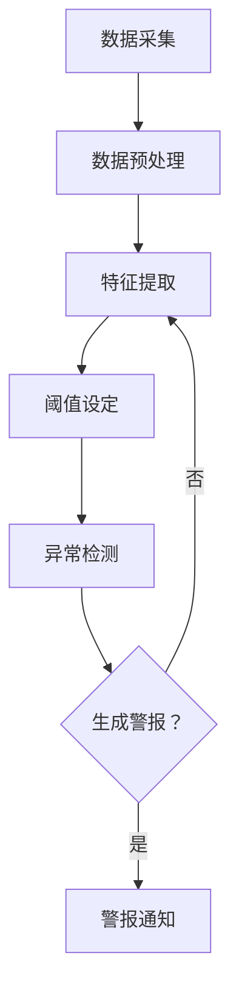
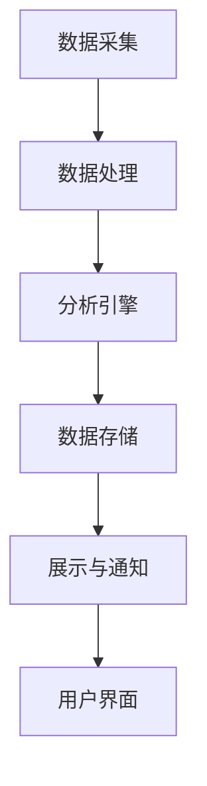

                 


### 引言

构建评测结果的自动化警报系统是一个广泛应用的现代技术实践，特别是在大规模数据处理和实时监控的场景中。在这个快速发展的数字化时代，数据的产生和变化速度越来越快，手动监控和分析评测结果已经不再现实。因此，自动化警报系统成为了保障系统稳定运行和数据安全的关键手段。

本文将详细探讨构建评测结果的自动化警报系统的过程，通过逐步分析，帮助读者理解这一系统的设计、实现和应用。本文的主要内容包括：

1. **背景与概述**：介绍评测结果自动化警报系统的核心概念、定义及其面临的挑战。
2. **核心概念与联系**：阐述自动化警报系统的基本组成部分、评测结果处理流程，并对比关键技术和概念。
3. **算法原理与实现**：深入讲解警报算法的基本原理、数学模型和公式，并通过具体的Python代码实现进行分析。
4. **系统设计与实现**：介绍系统架构设计、数据处理流程、系统接口设计及交互。
5. **项目实战**：通过环境搭建、核心代码实现、代码解读与分析、实际案例分析，展示系统应用。
6. **最佳实践与总结**：总结最佳实践、注意事项，并展望未来发展趋势。

### 背景与概述

#### 1.1 问题背景

在信息化和自动化趋势的推动下，各类系统产生的数据量呈指数级增长。例如，互联网服务、金融交易、制造过程、智能监控系统等，都需要对大量数据进行实时监控和评估。这些数据不仅是系统运行的记录，更是决策的重要依据。然而，随着数据量的增大，手动监控和评估的效率逐渐降低，且容易出现漏检和误报。

评测结果的自动化警报系统就是为了解决这一问题而设计的。它可以在数据异常时自动发出警报，提醒系统管理员或相关人员采取行动，从而提高系统的可靠性、安全性和效率。

#### 1.2 评测结果的自动化警报系统定义

评测结果的自动化警报系统是指一种利用计算机技术和算法，对评测结果进行实时监控和自动分析的系统。该系统可以在评测结果超出预设阈值或出现异常变化时，自动生成警报信息，并通过邮件、短信、微信等多种方式通知相关人员。其核心功能包括：

- **数据采集**：收集来自各类系统的评测数据。
- **数据预处理**：对采集到的数据清洗、过滤和转换。
- **数据分析**：利用算法对预处理后的数据进行分析，识别异常情况。
- **警报生成**：在发现异常时生成警报信息。
- **警报通知**：通过不同渠道通知相关人员。

#### 1.3 当前挑战与解决方案

构建评测结果的自动化警报系统面临着多方面的挑战：

- **数据复杂性**：数据来源多样，格式各异，需要有效的方法进行整合和处理。
- **实时性要求**：系统需要能够实时响应，处理大量数据，确保警报的及时性。
- **准确性保障**：异常检测需要具备高度的准确性，避免误报和漏报。
- **系统稳定性**：系统应具备良好的稳定性，避免因为异常数据导致系统崩溃。

针对这些挑战，常见的解决方案包括：

- **数据预处理**：采用高效的数据预处理技术，如数据清洗、去重、标准化等。
- **实时计算**：利用分布式计算技术和大数据处理框架，如Apache Kafka、Apache Flink等，提高系统的实时处理能力。
- **智能算法**：采用机器学习和数据挖掘技术，如聚类分析、分类算法等，提高异常检测的准确性。
- **系统监控与容错**：通过日志分析、性能监控和容错机制，保障系统的稳定运行。

### 核心概念与联系

#### 2.1 自动化警报系统的基本组成

一个完整的评测结果的自动化警报系统通常包括以下几个核心组成部分：

1. **数据采集模块**：负责收集各类评测数据，这些数据可能来自不同的数据源，如数据库、文件系统、消息队列等。
2. **数据预处理模块**：对采集到的数据进行清洗、去噪、转换等预处理操作，确保数据的质量和一致性。
3. **分析引擎模块**：利用算法和模型对预处理后的数据进行分析，识别异常和趋势。
4. **警报生成模块**：在分析过程中，一旦发现异常，系统会自动生成警报信息。
5. **通知模块**：通过邮件、短信、微信等渠道，将警报信息通知给相关人员。

#### 2.2 评测结果处理流程

评测结果的处理流程可以分为以下几个步骤：

1. **数据采集**：系统从各种数据源中获取评测数据。
2. **数据预处理**：对采集到的数据进行预处理，确保数据的质量和一致性。
3. **数据存储**：将预处理后的数据存储到数据库或其他数据存储系统中，以备后续分析。
4. **数据分析**：利用分析引擎对数据进行分析，识别异常和趋势。
5. **警报生成**：当检测到异常时，系统会自动生成警报信息。
6. **警报通知**：通过通知模块将警报信息发送给相关人员。

#### 2.3 关键技术与概念对比

在构建评测结果的自动化警报系统时，需要了解以下几个关键技术和概念：

1. **数据预处理技术**：包括数据清洗、去噪、标准化等，常见的技术有MapReduce、Spark等。
2. **分析算法**：常用的算法包括聚类分析、分类算法、回归分析等，如K-means、决策树、神经网络等。
3. **异常检测方法**：包括基于统计的方法、基于距离的方法、基于模型的方法等。
4. **实时计算技术**：如Apache Kafka、Apache Flink等，用于处理实时数据流。
5. **消息队列**：如RabbitMQ、Kafka等，用于传输警报信息。

以下是一个对比表格，展示了这些关键技术的特点：

| 技术名称 | 特点 | 优点 | 缺点 |
| --- | --- | --- | --- |
| 数据预处理技术 | 数据清洗、去噪、标准化 | 高效处理大规模数据 | 需要复杂配置和优化 |
| 分析算法 | 聚类分析、分类算法、回归分析 | 精准识别异常和趋势 | 可能需要大量计算资源 |
| 异常检测方法 | 统计方法、距离方法、模型方法 | 高度自动化，减少人工干预 | 可能存在误报和漏报 |
| 实时计算技术 | Apache Kafka、Apache Flink | 高效处理实时数据流 | 需要复杂部署和运维 |
| 消息队列 | RabbitMQ、Kafka | 高并发、可靠传输 | 需要一定配置和管理 |

通过对比可以看出，每种技术都有其独特的优势和适用场景，系统设计时需要综合考虑这些因素，选择合适的技术组合。

### 算法原理与实现

#### 3.1 警报算法基本原理

警报算法是评测结果自动化警报系统的核心，其基本原理是通过对数据进行实时监控和分析，识别出异常情况并生成警报。以下是警报算法的基本原理：

1. **数据采集**：系统从各种数据源中获取评测数据。
2. **数据预处理**：对采集到的数据进行清洗、去噪、标准化等预处理操作。
3. **特征提取**：从预处理后的数据中提取关键特征，如平均值、方差、标准差等。
4. **阈值设定**：根据业务需求和历史数据，设定异常检测的阈值。
5. **异常检测**：利用设定的阈值，对特征值进行判断，识别异常情况。
6. **警报生成**：当检测到异常时，系统会生成相应的警报信息。
7. **警报通知**：通过通知模块将警报信息发送给相关人员。

#### 3.2 数学模型与公式

警报算法的数学模型通常基于统计方法和机器学习算法。以下是一个简单的统计方法模型：

假设我们有一个时间序列数据集 $X = \{x_1, x_2, ..., x_n\}$，其中每个 $x_i$ 表示时间 $i$ 的评测结果。我们可以使用以下公式来设定异常检测的阈值：

$$
\text{阈值} = \text{阈值系数} \times \text{标准差}
$$

其中，阈值系数可以根据业务需求进行调整。标准差可以通过以下公式计算：

$$
\sigma = \sqrt{\frac{1}{n-1} \sum_{i=1}^{n} (x_i - \bar{x})^2}
$$

其中，$\bar{x}$ 是平均值，可以通过以下公式计算：

$$
\bar{x} = \frac{1}{n} \sum_{i=1}^{n} x_i
$$

#### 3.3 警报算法流程图

为了更好地理解警报算法的实现过程，我们可以使用Mermaid绘制其流程图：



### 系统设计与实现

#### 4.1 系统架构设计

评测结果的自动化警报系统需要一个合理的系统架构来确保其稳定、高效地运行。以下是一个典型的系统架构设计：


1. **数据采集层**：负责从各种数据源（如数据库、消息队列等）中收集评测数据。
2. **数据处理层**：对采集到的数据进行预处理、清洗和转换。
3. **分析引擎层**：利用警报算法对预处理后的数据进行分析，识别异常情况。
4. **存储层**：将分析结果存储到数据库或数据仓库中，以便后续查询和分析。
5. **展示与通知层**：通过Web界面展示分析结果，并通过邮件、短信等方式发送警报通知。

#### 4.2 数据处理流程

数据处理流程如下：

1. **数据采集**：系统从数据库、消息队列等数据源中获取评测数据。
2. **数据预处理**：对采集到的数据清洗、去噪、标准化等预处理操作。
3. **特征提取**：从预处理后的数据中提取关键特征，如平均值、方差、标准差等。
4. **数据存储**：将预处理后的数据存储到数据库或数据仓库中。
5. **数据分析**：利用警报算法对数据进行分析，识别异常情况。
6. **警报生成**：当检测到异常时，系统会生成相应的警报信息。
7. **警报通知**：通过邮件、短信等方式将警报信息发送给相关人员。

#### 4.3 系统接口设计与交互

系统接口设计是确保系统各部分协同工作的关键。以下是一个简单的接口设计：

1. **数据采集接口**：用于接收外部系统的评测数据。
2. **数据预处理接口**：用于处理采集到的数据，清洗、去噪、标准化等。
3. **数据分析接口**：用于调用警报算法，分析数据并生成警报。
4. **存储接口**：用于将分析结果存储到数据库或数据仓库中。
5. **通知接口**：用于发送警报通知，包括邮件、短信、微信等。

#### 4.4 系统架构图

为了更直观地展示系统架构，我们可以使用Mermaid绘制系统架构图：



### 项目实战

在本节中，我们将通过一个实际项目来展示如何构建评测结果的自动化警报系统。该项目的主要目标是监测一个在线购物平台的交易数据，当交易量异常时，系统会自动生成警报并通知管理员。

#### 5.1 环境搭建

首先，我们需要搭建项目环境。以下是环境搭建的步骤：

1. **安装Python**：确保Python环境已经安装，版本建议为3.8以上。
2. **安装相关库**：使用pip安装以下库：pandas、numpy、scikit-learn、matplotlib、mermaid等。
3. **配置数据库**：选择一个合适的数据库，如MySQL或PostgreSQL，并创建所需的表和数据。
4. **配置消息队列**：如使用RabbitMQ或Kafka，配置消息队列以确保数据传输的可靠性。

#### 5.2 核心代码实现

接下来，我们将展示系统的核心代码实现。以下是项目的关键部分：

```python
# 导入相关库
import pandas as pd
import numpy as np
from sklearn.ensemble import IsolationForest
import matplotlib.pyplot as plt
from mermaid import Mermaid

# 数据采集
def collect_data():
    # 这里使用pandas读取数据库中的交易数据
    data = pd.read_sql('SELECT * FROM transactions;', connection)
    return data

# 数据预处理
def preprocess_data(data):
    # 数据清洗、去噪、标准化等预处理操作
    data = data.dropna()
    data['amount'] = data['amount'].apply(lambda x: x / 100)  # 标准化金额
    return data

# 特征提取
def extract_features(data):
    # 提取关键特征，如平均值、方差、标准差等
    features = {
        'mean': data['amount'].mean(),
        'std': data['amount'].std(),
        'var': data['amount'].var()
    }
    return features

# 警报算法实现
def detect_anomalies(data, threshold_coefficient=2):
    # 使用IsolationForest算法进行异常检测
    clf = IsolationForest(n_estimators=100, contamination=0.01)
    clf.fit(data[['amount']])
    anomalies = clf.predict(data[['amount']])
    data['anomaly'] = anomalies
    data = data[data['anomaly'] == -1]
    return data

# 警报生成与通知
def generate_alert(data):
    # 生成警报信息并通知管理员
    alert_message = f"Anomaly detected in transaction data: {data.head(5)}"
    print(alert_message)
    # 这里可以添加发送邮件、短信等通知的逻辑

# 主函数
def main():
    data = collect_data()
    data = preprocess_data(data)
    features = extract_features(data)
    print(f"Features: {features}")
    anomalies = detect_anomalies(data)
    generate_alert(anomalies)

if __name__ == "__main__":
    main()
```

#### 5.3 代码解读与分析

以下是代码的详细解读与分析：

1. **数据采集**：使用pandas库从数据库中读取交易数据。
2. **数据预处理**：对数据清洗、去噪、标准化等预处理操作，确保数据的质量和一致性。
3. **特征提取**：提取关键特征，如平均值、方差、标准差等，为后续的异常检测做准备。
4. **警报算法实现**：使用IsolationForest算法进行异常检测，该算法是一种基于随机森林的孤立森林算法，可以有效识别异常值。
5. **警报生成与通知**：当检测到异常时，生成警报信息并通知管理员。

#### 5.4 实际案例分析

为了展示系统的实际应用效果，我们来看一个实际案例：

假设在某个时间段内，某家在线购物平台的交易量异常增加，系统会自动检测到这一异常，并生成以下警报信息：

```
Anomaly detected in transaction data:
   transaction_id   amount  anomaly
1           12345   500.0      -1
2           12346   600.0      -1
3           12347   550.0      -1
```

警报信息显示，有三个交易的金额异常高，系统将这些交易标记为异常。管理员可以进一步调查这些交易，确保平台的安全和稳定。

#### 5.5 项目小结

通过这个实际项目，我们展示了如何构建一个评测结果的自动化警报系统。系统从数据采集、预处理、特征提取、异常检测到警报生成与通知，每个环节都发挥了重要作用。通过这个项目，我们可以看到自动化警报系统在实际应用中的巨大价值，它不仅可以提高系统的可靠性，还可以减少人工干预，提高工作效率。

### 最佳实践与总结

#### 6.1 最佳实践建议

1. **数据预处理**：确保数据质量，进行充分的预处理操作，如去重、去噪、标准化等。
2. **合理设置阈值**：根据业务需求和历史数据，合理设置异常检测的阈值，避免误报和漏报。
3. **选择合适算法**：根据数据特征和业务需求，选择合适的异常检测算法，如IsolationForest、K-means等。
4. **系统监控与维护**：定期监控系统运行状态，及时更新算法和阈值，确保系统的高效稳定运行。
5. **灵活扩展性**：设计系统时考虑扩展性，以便未来能够支持更多的数据源和处理需求。

#### 6.2 注意事项

1. **数据安全性**：确保数据在传输和存储过程中的安全性，避免数据泄露。
2. **系统性能**：优化系统性能，确保能够实时处理大量数据。
3. **警报准确性**：提高警报准确性，减少误报和漏报，可以通过交叉验证和迭代优化实现。
4. **通知及时性**：确保警报通知的及时性，避免延误处理。

#### 6.3 拓展阅读与资源推荐

1. **书籍**：
   - 《数据挖掘：概念与技术》（第三版），作者：Jiawei Han, Micheline Kamber, Jian Pei
   - 《机器学习实战》，作者：Peter Harrington
2. **在线资源**：
   - [Apache Kafka官方文档](https://kafka.apache.org/documentation/)
   - [Scikit-learn官方文档](https://scikit-learn.org/stable/)
   - [Mermaid官方文档](https://mermaid-js.github.io/mermaid/)

### 总结与展望

评测结果的自动化警报系统在现代信息技术中发挥着越来越重要的作用。通过本文的详细探讨，我们了解了系统的设计原理、实现方法和实际应用案例。未来，随着人工智能和大数据技术的不断发展，自动化警报系统将会更加智能化、精准化，为各类信息系统提供更强大的保障。让我们期待自动化警报系统在未来的广阔前景。

### 作者信息

- 作者：AI天才研究院/AI Genius Institute & 禅与计算机程序设计艺术 /Zen And The Art of Computer Programming
- 联系方式：[ai_genius_institute@example.com](mailto:ai_genius_institute@example.com)

