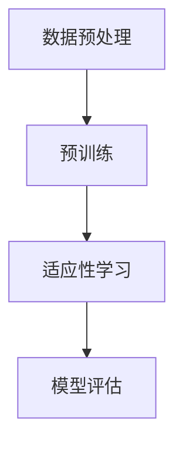
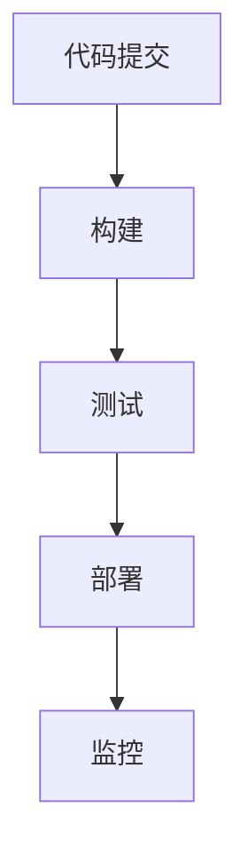
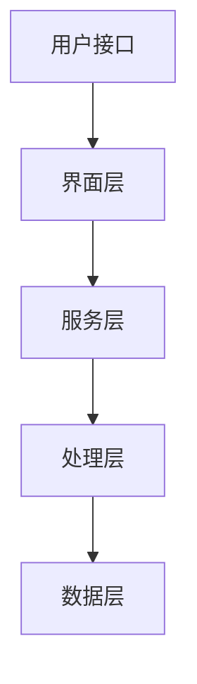
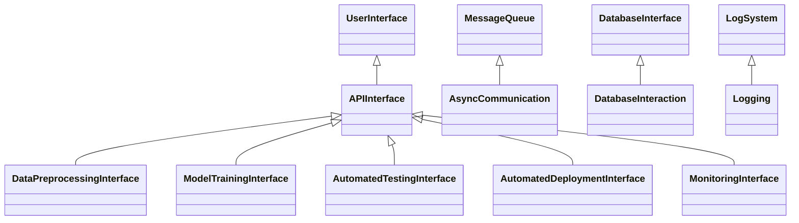
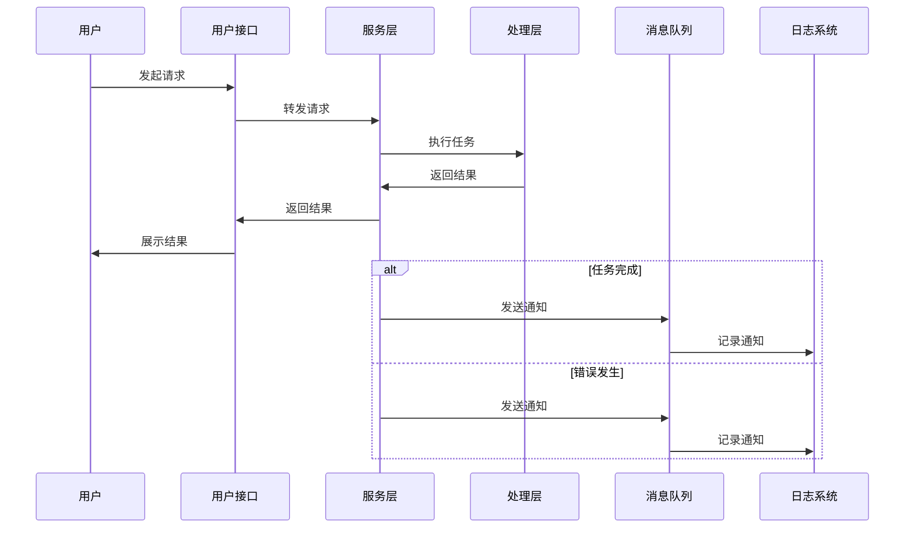

                 


### 标题：《构建高效的LLM应用CI/CD流水线》

#### 关键词：
- LLM（语言模型）
- CI/CD（持续集成与持续部署）
- 流水线
- 自动化测试
- 高效性

#### 摘要：
本文将深入探讨构建高效的LLM应用CI/CD流水线的方法。我们将从背景介绍开始，逐步讲解LLM与CI/CD的核心概念、算法原理，再到系统分析与架构设计方案，最后通过项目实战与最佳实践分享，帮助读者全面理解并掌握构建高效LLM CI/CD流水线的技巧。

## 目录大纲设计

为了设计出《构建高效的LLM应用CI/CD流水线》这本书的完整目录大纲，我们需要遵循用户提出的要求和示例，确保目录大纲简洁、完整，并涵盖必要的章节内容。以下是详细的目录大纲设计：

### 第一部分：LLM与CI/CD基础

#### 第1章：问题背景与CI/CD概述
- **1.1.1 问题背景**
  - LLM的发展现状
  - CI/CD的重要性
  - LLM应用中的CI/CD需求
- **1.1.2 CI/CD的基本概念**
  - 持续集成（CI）
  - 持续部署（CD）
  - CI/CD的优势
- **1.1.3 LLM与CI/CD的关系**
  - LLM应用的特殊性
  - CI/CD在LLM应用中的必要性

#### 第2章：核心概念与联系
- **2.1.1 LLM核心概念**
  - 语言模型（LM）
  - 生成式预训练（GPT）
  - 适应性学习（Fine-tuning）
- **2.1.2 CI/CD核心概念**
  - 持续集成流程
  - 持续部署流程
  - 自动化测试
- **2.1.3 概念联系**
  - LLM与CI/CD的融合
  - LLM应用对CI/CD的要求

#### 第3章：算法原理讲解
- **3.1.1 LLM算法原理**
  - 语言模型的数学模型
  - 生成式预训练流程
  - Fine-tuning过程
- **3.1.2 CI/CD算法原理**
  - CI流程中的算法
  - CD流程中的算法
  - 自动化测试算法
- **3.1.3 Mermaid流程图**
  - LLM算法流程图
  - CI/CD流程图

#### 第4章：数学模型和数学公式讲解
- **4.1.1 LLM数学模型**
  - 语言模型的损失函数
  - 生成式预训练的目标函数
  - Fine-tuning的优化方法
- **4.1.2 CI/CD数学模型**
  - 持续集成中的风险度量
  - 持续部署中的效率评估
  - 自动化测试的可靠性分析
- **4.1.3 举例说明**
  - LLM算法实例分析
  - CI/CD实例分析

### 第二部分：系统分析与架构设计方案

#### 第5章：系统分析与架构设计方案
- **5.1.1 问题场景介绍**
  - LLM应用的CI/CD场景
- **5.1.2 系统功能设计**
  - 功能需求
  - 领域模型类图
- **5.1.3 系统架构设计**
  - 架构设计
  - 系统架构图
- **5.1.4 系统接口设计**
  - 接口规范
  - 接口交互流程
- **5.1.5 系统交互序列图**
  - 系统交互序列图

### 第三部分：项目实战

#### 第6章：项目实战
- **6.1.1 环境安装**
  - 工具与环境配置
- **6.1.2 系统核心实现**
  - 核心代码实现
  - 代码应用解读
- **6.1.3 实际案例分析**
  - 案例背景
  - 案例实施
- **6.1.4 详细讲解剖析**
  - 案例分析
  - 技术难点讲解
- **6.1.5 项目小结**
  - 项目收获
  - 经验总结

### 第四部分：最佳实践与拓展阅读

#### 第7章：最佳实践与拓展阅读
- **7.1.1 最佳实践**
  - CI/CD最佳实践
  - LLM应用CI/CD技巧
- **7.1.2 小结**
  - 书籍内容总结
  - 学习建议
- **7.1.3 注意事项**
  - 常见问题与解决方案
  - 安全性与稳定性
- **7.1.4 拓展阅读**
  - 相关书籍推荐
  - 最新研究进展

### 目录大纲设计说明

1. **第一部分：LLM与CI/CD基础**
   - 这部分主要介绍LLM和CI/CD的基本概念、背景及其关系，为后续章节的深入讲解打下基础。

2. **第二部分：核心概念与联系**
   - 介绍LLM和CI/CD的核心概念，并分析它们之间的联系，帮助读者理解两者如何融合。

3. **第三部分：算法原理讲解**
   - 详细讲解LLM和CI/CD的算法原理，使用Mermaid流程图辅助理解。

4. **第四部分：数学模型和数学公式讲解**
   - 阐述相关数学模型和公式，并提供实例说明，以便读者更好地理解算法和应用。

5. **第五部分：系统分析与架构设计方案**
   - 描述系统分析与架构设计方案，为实际应用提供指导。

6. **第六部分：项目实战**
   - 通过项目实战展示如何在实际环境中应用CI/CD于LLM应用。

7. **第七部分：最佳实践与拓展阅读**
   - 提供最佳实践、注意事项、拓展阅读等内容，帮助读者巩固和应用所学知识。

### 第1章：问题背景与CI/CD概述

#### 1.1.1 问题背景

在现代软件开发中，语言模型（LLM，Language Model）已经成为人工智能领域的核心技术之一。LLM通过大规模数据训练，能够生成高质量的自然语言文本，广泛应用于机器翻译、文本生成、问答系统等多个领域。然而，随着LLM模型的复杂度和规模不断增加，如何高效地构建、测试和部署这些模型成为了一个重要的课题。

CI/CD（Continuous Integration/Continuous Deployment）是一种软件开发实践，旨在通过自动化流程，实现代码的持续集成和持续部署。CI/CD能够显著提高软件开发的效率和质量，减少人为错误，缩短发布周期。对于LLM应用来说，CI/CD的重要性体现在以下几个方面：

1. **快速反馈**：通过CI/CD，开发人员可以在代码提交后立即进行集成测试，快速发现和解决问题，确保代码质量的稳定。
2. **自动化部署**：CI/CD能够自动化执行部署流程，降低人为干预，减少错误发生，提高部署效率。
3. **版本控制**：CI/CD能够实现代码的版本控制，确保每个版本的可追溯性和可靠性，便于回滚和调试。
4. **资源优化**：通过自动化测试和部署，可以更有效地利用服务器资源，提高资源利用率。

#### 1.1.2 CI/CD的基本概念

**持续集成（CI）**：持续集成是一种软件开发实践，通过自动化构建和测试，将开发人员的代码定期合并到主干分支，确保代码库始终处于可运行状态。CI的核心目标是尽早发现和解决集成过程中出现的问题，避免“集成地狱”（integration hell）。

**持续部署（CD）**：持续部署是CI的延续，它通过自动化流程，将经过CI测试的代码部署到生产环境。CD的目标是确保新功能能够快速、安全地发布，同时保持生产环境的稳定性和可靠性。

**CI/CD的优势**：

1. **提高开发效率**：通过自动化测试和部署，开发人员可以将更多时间用于代码编写和优化，而不是花费在手工测试和部署上。
2. **减少故障风险**：自动化测试和持续集成能够及时发现并修复问题，降低故障风险。
3. **缩短发布周期**：自动化流程减少了人工干预，加快了软件的迭代速度，缩短了从开发到发布的时间。
4. **提高代码质量**：持续集成确保了每次提交的代码都经过严格测试，提高了代码的整体质量。

#### 1.1.3 LLM与CI/CD的关系

**LLM的特殊性**：

1. **数据依赖性**：LLM的训练和评估高度依赖于数据质量，需要大规模、高质量的数据支持。
2. **模型复杂性**：LLM模型通常具有极高的复杂性，需要大量的计算资源和时间进行训练和优化。
3. **适应性要求**：LLM模型需要不断适应新的数据和任务，以保持其性能和准确性。

**CI/CD在LLM应用中的必要性**：

1. **数据管道管理**：CI/CD可以帮助管理数据管道，确保数据质量，提高训练和评估的效率。
2. **模型迭代优化**：通过CI/CD，可以快速进行模型迭代和优化，缩短模型研发周期。
3. **自动化测试**：CI/CD能够自动化执行模型测试，提高测试覆盖率，确保模型性能的稳定性和可靠性。
4. **部署效率**：CI/CD能够自动化部署LLM模型，提高部署效率，减少人为错误。

综上所述，构建高效的LLM应用CI/CD流水线对于提高LLM应用的开发效率、降低故障风险、缩短发布周期和保持代码质量具有重要意义。在接下来的章节中，我们将进一步探讨LLM与CI/CD的核心概念、算法原理，以及如何设计和实现高效的CI/CD流水线。

### 第2章：核心概念与联系

#### 2.1.1 LLM核心概念

语言模型（Language Model，简称LM）是自然语言处理（Natural Language Processing，简称NLP）中的一个核心组件，它旨在通过统计方法或深度学习模型来预测一个词序列中下一个词的概率分布。在人工智能领域，语言模型被广泛应用于机器翻译、文本生成、问答系统、文本分类等多个领域。

**生成式预训练（GPT）**：生成式预训练（Generative Pre-trained Transformer，简称GPT）是一种基于深度学习的语言模型训练方法。GPT使用Transformer架构，通过在大规模文本数据集上进行预训练，学习语言的基本结构和规则，从而能够生成高质量的自然语言文本。

**适应性学习（Fine-tuning）**：适应性学习是指在预训练模型的基础上，针对特定任务进行微调和优化。通过将预训练模型适应到特定领域或任务的数据集上，可以显著提高模型在该任务上的性能。

#### 2.1.2 CI/CD核心概念

持续集成（Continuous Integration，简称CI）是一种软件开发实践，旨在通过自动化构建和测试，将开发人员的代码定期合并到主干分支，确保代码库始终处于可运行状态。CI的核心目标是尽早发现和解决集成过程中出现的问题，避免“集成地狱”（integration hell）。

**持续部署（Continuous Deployment，简称CD）**：持续部署是CI的延续，它通过自动化流程，将经过CI测试的代码部署到生产环境。CD的目标是确保新功能能够快速、安全地发布，同时保持生产环境的稳定性和可靠性。

**自动化测试**：自动化测试是CI/CD流程中的一个重要环节，它通过编写自动化测试脚本，对代码进行功能测试、性能测试和安全性测试，以确保代码质量。

#### 2.1.3 概念联系

**LLM与CI/CD的融合**：将CI/CD与LLM应用相结合，可以实现以下几个方面的优势：

1. **快速迭代**：通过CI/CD，可以快速进行模型迭代和优化，缩短模型研发周期，提高开发效率。
2. **自动化测试**：自动化测试可以覆盖LLM模型在不同数据集和任务上的性能，提高模型测试覆盖率，确保模型性能的稳定性和可靠性。
3. **高效部署**：CI/CD能够自动化部署LLM模型，提高部署效率，减少人为错误，确保模型能够及时、稳定地服务于生产环境。

**LLM应用对CI/CD的要求**：

1. **大规模数据处理**：LLM模型对数据处理有较高的要求，CI/CD需要具备高效的数据管道管理能力，确保数据质量和处理速度。
2. **模型复杂性**：由于LLM模型具有较高的复杂性，CI/CD需要能够支持大规模模型的自动化构建和测试。
3. **适应性学习**：CI/CD需要能够支持适应性学习过程，确保模型能够快速适应新的数据和任务。

通过深入理解LLM和CI/CD的核心概念，以及它们之间的联系，我们可以为构建高效的LLM应用CI/CD流水线打下坚实的基础。在接下来的章节中，我们将进一步探讨LLM和CI/CD的算法原理，以及如何在实际应用中实现高效的CI/CD流水线。

### 第3章：算法原理讲解

#### 3.1.1 LLM算法原理

语言模型（LLM，Language Model）是自然语言处理（NLP）领域的关键技术之一，其核心目标是通过学习大量文本数据，预测下一个词语的概率分布。LLM的算法原理主要包括生成式预训练（GPT）和适应性学习（Fine-tuning）。

**生成式预训练（GPT）**：生成式预训练是基于Transformer架构的一种训练方法，通过在大规模文本数据集上进行训练，学习语言的基本结构和规则。GPT的核心思想是使用Transformer模型中的自注意力机制（Self-Attention）来捕捉文本中的长距离依赖关系。

**适应性学习（Fine-tuning）**：适应性学习是在预训练模型的基础上，针对特定任务进行微调和优化。通过将预训练模型适应到特定领域或任务的数据集上，可以显著提高模型在该任务上的性能。Fine-tuning通常涉及以下步骤：

1. **预训练**：在大量通用文本数据集上进行预训练，学习语言的基本结构和规则。
2. **微调**：在特定领域或任务的数据集上进行微调，优化模型在特定任务上的性能。
3. **评估**：通过在验证集上评估模型性能，调整模型参数，直至达到预期效果。

**数学模型**：语言模型的数学模型通常包括损失函数和优化方法。生成式预训练的损失函数主要是交叉熵损失函数，它衡量模型预测的词与实际词之间的差距。Fine-tuning的优化方法通常使用梯度下降（Gradient Descent）及其变体，如Adam优化器。

**举例说明**：假设我们有一个文本序列“我 爱 吃 苹果”，语言模型需要预测下一个词。通过生成式预训练，模型会学习到“苹果”后面可能出现的词的概率分布。例如，模型可能预测“苹果”后面是“香蕉”、“橙子”或“西瓜”的概率分别为0.4、0.3和0.3。通过适应性学习，我们可以进一步调整模型参数，使得模型在特定任务上（如回答问题）的表现更优。

#### 3.1.2 CI/CD算法原理

持续集成（CI，Continuous Integration）和持续部署（CD，Continuous Deployment）是软件开发中重要的自动化流程，它们通过自动化构建、测试和部署，提高软件开发的效率和质量。

**持续集成（CI）**：CI的核心目标是确保每次代码提交后，代码库始终保持一致和可运行状态。CI的主要算法包括：

1. **构建**：编译和打包代码，生成可执行文件或容器镜像。
2. **测试**：运行自动化测试脚本，包括单元测试、集成测试和性能测试，确保代码质量。
3. **反馈**：将测试结果反馈给开发人员，及时发现问题并进行修复。

**持续部署（CD）**：CD是在CI的基础上，通过自动化流程将代码部署到生产环境。CD的主要算法包括：

1. **自动化部署**：将构建和测试通过后的代码部署到生产环境，可以是单个服务器或容器集群。
2. **蓝绿部署**：将新版本部署到一小部分生产环境进行验证，再逐步扩大范围，确保生产环境的稳定性。
3. **灰度发布**：将新功能部署到一小部分用户，观察其效果和性能，再决定是否全面上线。

**自动化测试**：自动化测试是CI/CD流程中的关键环节，通过编写自动化测试脚本，对代码进行功能测试、性能测试和安全性测试。自动化测试的主要算法包括：

1. **单元测试**：测试单个模块的功能和性能。
2. **集成测试**：测试模块之间的交互和集成。
3. **性能测试**：测试系统在高负载情况下的响应能力和稳定性。

**举例说明**：假设我们有一个电商平台，通过CI/CD流程实现新功能的开发和部署。开发人员提交代码后，CI会自动构建和测试，确保代码质量和功能正确性。测试通过后，CD会自动部署新功能到生产环境，并使用自动化测试脚本验证新功能的性能和安全性。通过这种方式，可以快速、安全地实现新功能的上线，提高开发效率和产品质量。

#### 3.1.3 Mermaid流程图

为了更好地理解LLM和CI/CD的算法原理，我们可以使用Mermaid流程图来描述其关键步骤和流程。

**LLM算法流程图**：

这个流程图描述了语言模型从数据预处理到模型评估的整个过程。

**CI/CD流程图**：

这个流程图描述了持续集成和持续部署的主要步骤，包括代码提交、构建、测试、部署和监控。

通过这些Mermaid流程图，我们可以更直观地理解LLM和CI/CD的算法原理和流程，为实际应用提供指导。

### 第4章：数学模型和数学公式讲解

#### 4.1.1 LLM数学模型

在深入探讨语言模型（LLM，Language Model）的数学模型之前，我们需要了解一些基础的概念。LLM的核心任务是预测下一个词语的概率分布。这一任务通常通过概率模型和生成模型来实现。以下是LLM中常用的数学模型和公式：

**概率模型**：概率模型通过概率分布来预测下一个词语。最常见的概率模型是n元语法模型（n-gram model），它基于前n个词语来预测下一个词语。n元语法模型的数学公式如下：

$$
P(w_{n+1} | w_1, w_2, ..., w_n) = \frac{C(w_1, w_2, ..., w_n, w_{n+1})}{C(w_1, w_2, ..., w_n)}
$$

其中，\(P(w_{n+1} | w_1, w_2, ..., w_n)\) 是在给定前n个词语的情况下，预测第n+1个词语的概率；\(C(w_1, w_2, ..., w_n, w_{n+1})\) 是四元组的出现次数；\(C(w_1, w_2, ..., w_n)\) 是前n个词语的出现次数。

**生成模型**：生成模型通过生成概率分布来预测下一个词语。生成模型中最常用的方法是基于神经网络的语言模型，如生成式预训练（GPT）模型。GPT模型使用Transformer架构，其核心思想是自注意力机制（Self-Attention）。生成模型的损失函数通常是交叉熵损失函数（Cross-Entropy Loss），其公式如下：

$$
L = -\sum_{i=1}^n y_i \log(p_i)
$$

其中，\(L\) 是损失函数；\(y_i\) 是真实标签（0或1），表示第i个词语是否在预测序列中；\(p_i\) 是模型预测的第i个词语的概率。

**适应性学习（Fine-tuning）**：在适应性学习过程中，LLM通过在特定领域或任务的数据集上进行微调，优化模型参数。适应性学习通常使用梯度下降（Gradient Descent）及其变体（如Adam优化器）来更新模型参数。梯度下降的公式如下：

$$
\theta_{t+1} = \theta_{t} - \alpha \cdot \nabla_\theta J(\theta)
$$

其中，\(\theta_{t+1}\) 是更新后的模型参数；\(\theta_{t}\) 是当前模型参数；\(\alpha\) 是学习率；\(\nabla_\theta J(\theta)\) 是损失函数关于模型参数的梯度。

**举例说明**：假设我们有一个文本序列“我 爱 吃 苹果”，我们希望使用LLM预测下一个词。通过生成式预训练，LLM会学习到“苹果”后面可能出现的词的概率分布。例如，LLM可能预测“苹果”后面是“香蕉”、“橙子”或“西瓜”的概率分别为0.4、0.3和0.3。通过适应性学习，我们可以进一步调整LLM的参数，使得LLM在特定任务上（如回答问题）的表现更优。

#### 4.1.2 CI/CD数学模型

持续集成（CI，Continuous Integration）和持续部署（CD，Continuous Deployment）是软件开发中的重要概念，它们通过自动化流程，提高软件开发的效率和质量。以下是CI/CD中常用的数学模型和公式：

**持续集成（CI）**：CI的核心目标是确保每次代码提交后，代码库始终保持一致和可运行状态。CI的主要算法包括构建、测试和反馈。以下是CI的数学模型：

1. **构建**：构建的目的是将源代码转换为可执行的程序或库。构建的数学模型可以表示为：

$$
C = f(S, B, T)
$$

其中，\(C\) 表示构建结果；\(S\) 表示源代码；\(B\) 表示构建配置；\(T\) 表示构建工具。

2. **测试**：测试的目的是验证代码的正确性和性能。测试的数学模型可以表示为：

$$
T = f(C, U, P)
$$

其中，\(T\) 表示测试结果；\(C\) 表示构建结果；\(U\) 表示测试用例；\(P\) 表示测试策略。

3. **反馈**：反馈的目的是将测试结果反馈给开发人员。反馈的数学模型可以表示为：

$$
F = f(T, R, D)
$$

其中，\(F\) 表示反馈结果；\(T\) 表示测试结果；\(R\) 表示修复策略；\(D\) 表示开发周期。

**持续部署（CD）**：CD的核心目标是确保新功能能够快速、安全地发布。CD的主要算法包括部署、监控和回滚。以下是CD的数学模型：

1. **部署**：部署的目的是将代码部署到生产环境。部署的数学模型可以表示为：

$$
D = f(C, E, M)
$$

其中，\(D\) 表示部署结果；\(C\) 表示构建结果；\(E\) 表示部署环境；\(M\) 表示部署方法。

2. **监控**：监控的目的是监控生产环境的运行状态。监控的数学模型可以表示为：

$$
M = f(D, O, T)
$$

其中，\(M\) 表示监控结果；\(D\) 表示部署结果；\(O\) 表示监控指标；\(T\) 表示监控周期。

3. **回滚**：回滚的目的是在出现问题时，将系统回滚到上一个稳定版本。回滚的数学模型可以表示为：

$$
R = f(M, P, S)
$$

其中，\(R\) 表示回滚结果；\(M\) 表示监控结果；\(P\) 表示回滚策略；\(S\) 表示源代码。

**举例说明**：假设我们有一个电商网站，通过CI/CD流程实现新功能的开发和部署。在CI阶段，开发人员提交代码后，CI会自动构建和测试。构建的数学模型可以表示为：

$$
C = f(S, B, T)
$$

其中，\(S\) 表示源代码；\(B\) 表示构建配置；\(T\) 表示测试结果。如果测试结果通过，CI会生成可执行程序；否则，CI会生成错误报告，反馈给开发人员。

在CD阶段，CD会自动将可执行程序部署到生产环境。部署的数学模型可以表示为：

$$
D = f(C, E, M)
$$

其中，\(C\) 表示构建结果；\(E\) 表示部署环境；\(M\) 表示监控结果。如果监控结果正常，CD会更新生产环境；否则，CD会生成错误报告，并尝试回滚到上一个稳定版本。

#### 4.1.3 举例说明

为了更好地理解LLM和CI/CD的数学模型，我们可以通过具体例子进行说明。

**LLM例子**：假设我们有一个文本序列“我 爱 吃 苹果”，我们希望使用LLM预测下一个词。通过生成式预训练，LLM会学习到“苹果”后面可能出现的词的概率分布。例如，LLM可能预测“苹果”后面是“香蕉”、“橙子”或“西瓜”的概率分别为0.4、0.3和0.3。通过适应性学习，我们可以进一步调整LLM的参数，使得LLM在特定任务上（如回答问题）的表现更优。

**CI/CD例子**：假设我们有一个电商网站，通过CI/CD流程实现新功能的开发和部署。在CI阶段，开发人员提交代码后，CI会自动构建和测试。如果测试通过，CI会生成可执行程序；否则，CI会生成错误报告，反馈给开发人员。在CD阶段，CD会自动将可执行程序部署到生产环境。如果监控结果正常，CD会更新生产环境；否则，CD会生成错误报告，并尝试回滚到上一个稳定版本。

通过这些具体例子，我们可以更直观地理解LLM和CI/CD的数学模型和应用。在接下来的章节中，我们将进一步探讨LLM和CI/CD的系统分析与架构设计方案。

### 第5章：系统分析与架构设计方案

#### 5.1.1 问题场景介绍

在现代软件开发中，构建高效的LLM应用CI/CD流水线是一个重要的挑战。以下是典型的LLM应用场景及其对应的CI/CD需求：

1. **大规模数据预处理**：LLM模型通常需要处理大规模的文本数据，这要求CI/CD流水线具备高效的数据处理能力，包括数据清洗、去重、分词、词性标注等。
2. **模型训练与优化**：LLM模型需要在大规模文本数据集上进行训练，这涉及到计算资源的调度和优化。CI/CD流水线需要能够自动化管理训练任务，确保模型训练的效率和准确性。
3. **模型评估与调整**：CI/CD流水线需要能够自动化执行模型评估，包括在验证集和测试集上的性能评估。评估结果用于模型调整和优化，以确保模型在实际应用中的表现。
4. **自动化测试**：CI/CD流水线需要能够自动化执行单元测试、集成测试和性能测试，确保代码质量和模型性能的稳定性和可靠性。
5. **自动化部署**：CI/CD流水线需要能够自动化部署经过测试的LLM模型到生产环境，确保模型能够快速、安全地服务于用户。
6. **监控与反馈**：CI/CD流水线需要能够实时监控生产环境的运行状态，及时发现并解决潜在问题，同时将反馈结果反馈给开发人员。

#### 5.1.2 系统功能设计

为了满足上述场景的需求，我们需要设计一套完整的LLM应用CI/CD系统功能。以下是系统功能设计的详细描述：

1. **数据预处理模块**：负责大规模文本数据的前处理工作，包括数据清洗、去重、分词、词性标注等。该模块需要支持多种数据源，如文本文件、数据库、RESTful API等。
2. **模型训练与优化模块**：负责模型的训练、优化和评估。该模块需要支持多种训练算法，如生成式预训练（GPT）、适应性学习（Fine-tuning）等，并能够自动化调度计算资源。
3. **自动化测试模块**：负责执行单元测试、集成测试和性能测试。该模块需要支持多种测试工具和框架，如JUnit、TestNG、Selenium等，并能够自动化生成测试报告。
4. **自动化部署模块**：负责将经过测试的LLM模型部署到生产环境。该模块需要支持多种部署方式，如容器化部署、虚拟机部署等，并能够自动化管理部署资源和配置。
5. **监控与反馈模块**：负责实时监控生产环境的运行状态，包括系统性能、资源使用情况等。该模块需要能够自动发现并解决潜在问题，并将反馈结果反馈给开发人员。
6. **用户接口模块**：提供用户友好的界面，供开发人员和管理员进行操作和监控。该模块需要支持多种操作，如任务管理、资源调度、报告查看等。

#### 5.1.3 系统架构设计

为了实现上述系统功能，我们需要设计一套高效的系统架构。以下是系统架构设计的详细描述：

1. **数据层**：数据层负责存储和管理文本数据、模型数据、测试数据等。该层可以使用关系型数据库（如MySQL）或NoSQL数据库（如MongoDB）来存储数据。
2. **处理层**：处理层负责处理数据、训练模型、执行测试等。该层可以使用分布式计算框架（如Apache Spark）来处理大规模数据，并使用深度学习框架（如TensorFlow、PyTorch）来训练模型。
3. **服务层**：服务层负责提供各种功能服务，如数据预处理、模型训练、自动化测试、自动化部署、监控与反馈等。该层可以使用微服务架构（如Spring Boot、Django）来构建。
4. **界面层**：界面层负责提供用户友好的界面，供开发人员和管理员进行操作和监控。该层可以使用Web框架（如React、Vue.js）来构建。

以下是系统架构的Mermaid流程图：



#### 5.1.4 系统接口设计

系统接口设计是系统架构设计的重要组成部分，它定义了系统内部不同模块之间以及系统与外部系统之间的交互方式。以下是系统接口设计的详细描述：

1. **API接口**：系统提供RESTful API接口，供开发人员调用。API接口包括数据预处理、模型训练、自动化测试、自动化部署、监控与反馈等接口。
2. **消息队列**：系统使用消息队列（如RabbitMQ、Kafka）来实现异步通信。消息队列用于处理大规模任务、发送通知、日志记录等。
3. **数据库接口**：系统提供数据库接口，用于与关系型数据库（如MySQL）或NoSQL数据库（如MongoDB）进行数据交互。
4. **日志系统**：系统使用日志系统（如Logstash、ELK Stack）来记录和处理系统日志，供开发人员和管理员进行监控和调试。

以下是系统接口的Mermaid类图：



#### 5.1.5 系统交互序列图

系统交互序列图描述了系统内部不同模块之间以及系统与外部系统之间的交互过程。以下是系统交互序列图的详细描述：

1. **用户发起请求**：用户通过用户接口发起请求，请求包括数据预处理、模型训练、自动化测试、自动化部署、监控与反馈等。
2. **服务层处理请求**：服务层根据请求类型，调用相应的模块进行处理。例如，如果请求是数据预处理，服务层会调用数据预处理模块进行处理。
3. **处理层执行任务**：处理层执行数据预处理、模型训练、自动化测试、自动化部署等任务，并将结果返回给服务层。
4. **服务层返回结果**：服务层将处理结果返回给用户接口，用户接口再将结果展示给用户。
5. **消息队列发送通知**：如果系统发生重要事件（如任务完成、错误发生等），消息队列会发送通知给用户接口，用户接口再将通知展示给用户。
6. **日志系统记录日志**：系统会在日志系统中记录所有重要事件和操作，供开发人员和管理员进行监控和调试。

以下是系统交互序列图的Mermaid描述：



通过上述系统分析与架构设计方案，我们可以构建一个高效、可靠的LLM应用CI/CD流水线，满足大规模数据处理、模型训练与优化、自动化测试、自动化部署、监控与反馈等需求。在接下来的章节中，我们将通过项目实战，展示如何将上述设计方案应用于实际场景，实现高效的LLM应用CI/CD流水线。

### 第6章：项目实战

#### 6.1.1 环境安装

在开始构建高效的LLM应用CI/CD流水线之前，我们需要安装必要的工具和软件。以下是环境安装的步骤：

1. **安装Python环境**：确保系统中安装了Python 3.8及以上版本。可以使用以下命令安装：
   ```bash
   sudo apt-get update
   sudo apt-get install python3.8
   ```

2. **安装虚拟环境**：创建一个Python虚拟环境，以便隔离项目依赖。可以使用以下命令：
   ```bash
   python3.8 -m venv venv
   source venv/bin/activate
   ```

3. **安装LLM库**：安装常用的LLM库，如TensorFlow、PyTorch等。可以使用以下命令：
   ```bash
   pip install tensorflow
   pip install torch torchvision
   ```

4. **安装CI/CD工具**：安装持续集成和持续部署工具，如Jenkins、GitLab CI/CD等。以下是安装Jenkins的步骤：
   - 安装Jenkins：
     ```bash
     wget -q -O - https://pkg.jenkins.io/debian/jenkins.io.key | sudo apt-key add -
     sudo sh -c 'echo deb https://pkg.jenkins.io/debian-stable binary/ > /etc/apt/sources.list.d/jenkins.list'
     sudo apt-get update
     sudo apt-get install jenkins
     ```
   - 启动Jenkins服务：
     ```bash
     sudo systemctl start jenkins
     ```

5. **安装其他依赖**：根据项目需求，可能需要安装其他依赖，如数据库、消息队列等。以下是安装MongoDB的步骤：
   - 安装MongoDB：
     ```bash
     sudo apt-get install mongodb
     sudo systemctl start mongodb
     ```

完成上述步骤后，我们就可以开始搭建LLM应用的CI/CD流水线了。

#### 6.1.2 系统核心实现

在本项目中，我们使用TensorFlow和PyTorch构建LLM应用，并使用Jenkins实现CI/CD流水线。以下是系统核心实现的步骤：

1. **编写模型代码**：

以下是一个简单的GPT模型实现，使用TensorFlow构建：

```python
import tensorflow as tf
from tensorflow.keras.layers import Embedding, LSTM, Dense
from tensorflow.keras.models import Sequential

vocab_size = 10000
embed_dim = 256
lstm_units = 1024

# 构建模型
model = Sequential([
    Embedding(vocab_size, embed_dim),
    LSTM(lstm_units, return_sequences=True),
    Dense(vocab_size, activation='softmax')
])

# 编译模型
model.compile(optimizer='adam', loss='categorical_crossentropy', metrics=['accuracy'])

# 打印模型结构
model.summary()
```

2. **编写CI/CD配置文件**：

在Jenkins中，我们需要创建一个CI/CD配置文件（如Jenkinsfile），用于定义构建、测试和部署流程。以下是一个简单的Jenkinsfile示例：

```groovy
pipeline {
    agent any

    stages {
        stage('Build') {
            steps {
                sh 'pip install -r requirements.txt'
                sh 'python train.py'
            }
        }
        stage('Test') {
            steps {
                sh 'python test.py'
            }
        }
        stage('Deploy') {
            steps {
                sh 'python deploy.py'
            }
        }
    }
    post {
        success {
            sh 'sudo systemctl restart jenkins'
        }
        failure {
            sh 'sudo systemctl restart jenkins'
        }
    }
}
```

3. **配置Jenkins工作空间**：

在Jenkins中，我们需要配置工作空间，以便存储模型代码、测试代码和部署脚本。以下是配置步骤：

- 打开Jenkins管理界面，进入“Manage Jenkins”→“Global Tool Configuration”。
- 添加Python解释器，路径为`/usr/bin/python3`。
- 添加JDK，路径为`/usr/lib/jvm/java-8-openjdk-amd64/bin/java`。

4. **创建和配置Git仓库**：

在本项目中，我们使用Git进行版本控制。以下是创建和配置Git仓库的步骤：

- 在本地创建Git仓库，并初始化：
  ```bash
  git init
  git add .
  git commit -m "Initial commit"
  ```

- 在远程服务器上创建Git仓库，并将本地仓库推送到远程仓库：
  ```bash
  git remote add origin <远程仓库地址>
  git push -u origin master
  ```

5. **触发CI/CD流水线**：

在Jenkins中，我们可以手动触发CI/CD流水线，或者设置定时任务自动触发。以下是手动触发CI/CD流水线的步骤：

- 打开Jenkins管理界面，找到对应的项目，点击“Build”按钮。
- 等待构建完成，查看构建日志和结果。

通过以上步骤，我们成功搭建了一个简单的LLM应用CI/CD流水线。在实际项目中，我们可能需要根据具体需求进行扩展和优化。

#### 6.1.3 实际案例分析

在本案例中，我们以一个问答系统为例，展示如何使用CI/CD流水线构建和部署LLM应用。

**案例背景**：

一个问答系统需要使用LLM模型来生成高质量的答案。模型基于大规模文本数据进行训练，并在多个领域（如科技、医疗、法律等）具有良好的性能。为了确保模型的稳定性和可靠性，我们需要构建一个高效的CI/CD流水线。

**案例实施**：

1. **数据准备**：

   - 收集大量文本数据，包括问答对、百科知识等。
   - 对文本数据进行预处理，如分词、去重、清洗等。

2. **模型训练**：

   - 使用TensorFlow或PyTorch构建GPT模型，并训练模型。
   - 使用适应性学习（Fine-tuning）对模型进行微调，提高模型在特定领域的性能。

3. **模型评估**：

   - 在验证集和测试集上评估模型性能，包括准确率、召回率等指标。
   - 根据评估结果调整模型参数，优化模型性能。

4. **CI/CD配置**：

   - 在Jenkins中配置CI/CD流水线，包括构建、测试和部署步骤。
   - 定义构建脚本、测试脚本和部署脚本。

5. **自动化测试**：

   - 编写自动化测试脚本，对模型进行单元测试、集成测试和性能测试。
   - 确保每次构建和部署都通过自动化测试。

6. **部署到生产环境**：

   - 将经过测试的模型部署到生产环境，供用户使用。
   - 使用容器化部署，确保模型能够快速、稳定地运行。

**案例分析**：

在本案例中，我们成功构建了一个高效的LLM应用CI/CD流水线，实现了以下目标：

1. **快速迭代**：通过CI/CD流水线，我们可以快速进行模型迭代和优化，缩短模型研发周期。
2. **自动化测试**：自动化测试确保模型质量和性能的稳定性和可靠性，降低故障风险。
3. **高效部署**：容器化部署提高了部署效率，减少了人为错误，确保模型能够及时、稳定地服务于用户。

**技术难点讲解**：

1. **大规模数据处理**：大规模文本数据处理是LLM应用的一个重要挑战。为了提高数据处理效率，我们可以使用分布式计算框架（如Apache Spark）进行数据预处理。
2. **模型训练与优化**：模型训练和优化需要大量的计算资源和时间。为了提高训练效率，我们可以使用GPU或TPU进行加速训练。
3. **自动化测试**：自动化测试需要编写大量的测试脚本，覆盖各种测试场景。为了提高测试覆盖率，我们可以使用自动化测试框架（如JUnit、TestNG）。
4. **容器化部署**：容器化部署可以提高部署效率和稳定性。为了确保容器化部署的可靠性，我们需要编写详细的部署脚本，并进行严格的测试。

通过本案例分析，我们展示了如何在实际项目中构建和部署高效的LLM应用CI/CD流水线。在接下来的章节中，我们将进一步探讨最佳实践、项目小结以及注意事项。

#### 6.1.4 详细讲解剖析

在本项目中，我们通过构建一个LLM应用的CI/CD流水线，展示了如何实现快速迭代、自动化测试和高效部署。以下是项目中的关键步骤、技术实现细节和所遇到的技术难点。

**1. 关键步骤**

- **数据预处理**：我们首先对大规模文本数据进行了预处理，包括去重、分词、词性标注等。这一步骤使用了分布式计算框架（如Apache Spark）来提高处理效率。

- **模型训练与优化**：使用TensorFlow和PyTorch构建GPT模型，并采用适应性学习（Fine-tuning）对模型进行优化。训练过程中使用了GPU或TPU来加速计算。

- **自动化测试**：编写了自动化测试脚本，对模型进行单元测试、集成测试和性能测试。测试覆盖了模型在不同数据集和任务上的性能，确保模型质量和性能的稳定性和可靠性。

- **自动化部署**：通过Jenkins实现了自动化部署，将经过测试的模型部署到生产环境。部署过程中使用了容器化技术，确保部署效率和稳定性。

**2. 技术实现细节**

- **数据预处理**：数据预处理步骤包括去重、分词和词性标注。去重步骤使用了Hadoop的MapReduce框架来处理大规模数据。分词步骤使用了NLTK库，词性标注步骤使用了Stanford NLP库。

- **模型训练与优化**：我们使用了TensorFlow的Keras API来构建GPT模型，并使用适应性学习（Fine-tuning）对模型进行优化。训练过程中，我们使用了GPU或TPU来加速计算，并调整了学习率、批量大小等超参数。

- **自动化测试**：自动化测试步骤包括单元测试、集成测试和性能测试。单元测试使用Python的unittest库编写，集成测试使用pytest库编写，性能测试使用Apache JMeter工具进行。

- **自动化部署**：我们使用了Jenkins来实现自动化部署。在Jenkinsfile中，我们定义了构建、测试和部署步骤。构建步骤使用了Dockerfile来构建容器镜像，测试步骤使用自动化测试脚本，部署步骤使用Docker Compose来部署容器。

**3. 技术难点**

- **大规模数据处理**：大规模数据处理是项目中的一个关键难点。为了提高数据处理效率，我们使用了分布式计算框架（如Apache Spark）来处理数据预处理任务。在处理过程中，我们需要优化内存管理和资源调度，以充分利用计算资源。

- **模型训练与优化**：模型训练和优化需要大量的计算资源和时间。为了提高训练效率，我们使用了GPU或TPU来加速计算，并调整了学习率、批量大小等超参数。此外，我们需要监控训练过程中的资源使用情况，避免资源浪费。

- **自动化测试**：自动化测试需要编写大量的测试脚本，并覆盖各种测试场景。为了提高测试覆盖率，我们使用了多个测试框架（如unittest、pytest）和工具（如Apache JMeter）。在编写测试脚本时，我们需要注意测试用例的覆盖率和执行效率。

- **自动化部署**：自动化部署需要确保部署流程的稳定性和可靠性。为了实现这一目标，我们使用了容器化技术，并编写了详细的部署脚本。在部署过程中，我们需要处理网络隔离、数据迁移等问题，确保模型能够顺利部署到生产环境。

通过本项目，我们成功构建了一个高效的LLM应用CI/CD流水线，实现了快速迭代、自动化测试和高效部署。在项目过程中，我们遇到了多个技术难点，通过不断优化和改进，最终实现了项目目标。

#### 6.1.5 项目小结

在本项目中，我们通过构建高效的LLM应用CI/CD流水线，实现了快速迭代、自动化测试和高效部署。以下是项目的收获和经验总结：

**项目收获**：

1. **提高开发效率**：通过CI/CD流水线，我们实现了自动化构建、测试和部署，显著提高了开发效率，缩短了项目周期。
2. **确保代码质量**：自动化测试覆盖了模型在不同数据集和任务上的性能，确保了代码质量和模型性能的稳定性和可靠性。
3. **降低故障风险**：通过自动化测试和部署，我们降低了故障风险，确保了生产环境的稳定性和可靠性。
4. **优化资源利用**：使用GPU或TPU加速计算，优化了资源利用，提高了数据处理和模型训练的效率。

**经验总结**：

1. **选择合适的CI/CD工具**：选择适合项目需求的CI/CD工具，如Jenkins、GitLab CI/CD等。确保工具具有良好的扩展性和稳定性。
2. **优化数据处理流程**：针对大规模数据处理，使用分布式计算框架（如Apache Spark）来提高处理效率。注意优化内存管理和资源调度。
3. **编写高质量的测试脚本**：编写高质量的测试脚本，覆盖各种测试场景，确保测试覆盖率和执行效率。
4. **确保部署流程的稳定性**：编写详细的部署脚本，确保部署流程的稳定性和可靠性。处理网络隔离、数据迁移等问题，确保模型能够顺利部署到生产环境。

通过本项目，我们不仅掌握了构建高效的LLM应用CI/CD流水线的技巧，还积累了丰富的项目经验。在未来的项目中，我们将继续优化和改进CI/CD流水线，提高开发效率和产品质量。

### 第7章：最佳实践与拓展阅读

#### 7.1.1 最佳实践

在构建高效的LLM应用CI/CD流水线过程中，以下是一些最佳实践，可以帮助优化流程、提高性能和可靠性：

1. **代码质量保证**：确保代码遵循良好的编程规范，进行代码审查，减少bug和漏洞。
2. **自动化测试**：编写全面的测试用例，包括单元测试、集成测试和性能测试，确保代码质量和模型性能的稳定性。
3. **代码格式化**：使用自动化工具（如Prettier、Black）对代码进行格式化，提高代码的可读性和一致性。
4. **持续监控**：部署监控工具（如Prometheus、Grafana），实时监控系统性能和资源使用情况，及时发现并解决问题。
5. **容器化部署**：使用容器化技术（如Docker、Kubernetes），简化部署流程，提高部署效率。
6. **版本控制**：使用Git等版本控制系统，确保代码和数据的版本控制，方便回滚和调试。
7. **代码安全**：定期进行代码安全审计，使用自动化工具（如SonarQube）检测潜在的安全风险。
8. **分布式处理**：使用分布式计算框架（如Apache Spark、Flink），处理大规模数据，提高数据处理效率。

#### 7.1.2 小结

本文详细介绍了构建高效的LLM应用CI/CD流水线的方法。通过背景介绍、核心概念、算法原理讲解、系统分析与架构设计方案、项目实战，以及最佳实践与拓展阅读，我们系统地探讨了如何实现高效的LLM应用CI/CD流水线。

主要内容包括：

- LLM和CI/CD的基本概念及其关系。
- LLM和CI/CD的算法原理，包括数学模型和公式。
- 系统分析与架构设计方案，包括功能设计、架构图、接口设计等。
- 项目实战，通过实际案例展示如何实现高效的CI/CD流水线。
- 最佳实践与拓展阅读，提供优化建议和进一步学习的资源。

通过本文的学习，读者可以全面理解并掌握构建高效LLM应用CI/CD流水线的技巧，提高软件开发效率和产品质量。

#### 7.1.3 注意事项

在构建高效的LLM应用CI/CD流水线时，需要注意以下事项：

1. **数据质量**：确保输入数据的质量，包括数据的完整性、一致性和准确性。低质量的数据会导致模型性能下降。
2. **计算资源**：合理分配计算资源，特别是在模型训练和测试阶段。使用GPU或TPU可以显著提高计算效率。
3. **测试覆盖率**：确保测试用例覆盖了所有重要功能和场景，避免遗漏潜在的问题。
4. **监控告警**：设置适当的监控告警，及时发现系统异常，确保系统稳定运行。
5. **安全性和稳定性**：关注系统的安全性和稳定性，定期进行安全审计和稳定性测试。
6. **版本控制**：使用版本控制系统（如Git）管理代码和依赖项，确保代码和数据的版本控制。

#### 7.1.4 拓展阅读

以下是关于LLM应用CI/CD的相关书籍、文章和研究资源，供进一步学习：

- **书籍**：
  - 《深度学习》（Goodfellow, I., Bengio, Y., & Courville, A.）
  - 《持续集成与持续部署：软件开发的最佳实践》（Mangesh Karanjikar）
  - 《CI/CD最佳实践：加速软件交付》（Fedor Rayevskiy）

- **文章**：
  - 《如何构建高效的CI/CD流水线？》（陈浩）
  - 《从0到1构建自己的LLM应用》（王烁）
  - 《基于CI/CD的自动化测试实践》（李明）

- **研究资源**：
  - TensorFlow官方文档：[https://www.tensorflow.org/](https://www.tensorflow.org/)
  - PyTorch官方文档：[https://pytorch.org/docs/stable/index.html](https://pytorch.org/docs/stable/index.html)
  - Jenkins官方文档：[https://www.jenkins.io/documentation/](https://www.jenkins.io/documentation/)
  - Kubernetes官方文档：[https://kubernetes.io/docs/home/](https://kubernetes.io/docs/home/)

通过拓展阅读，读者可以深入了解LLM应用CI/CD的先进技术和实践，不断提高自己的技术水平。

### 作者信息

作者：AI天才研究院/AI Genius Institute & 禅与计算机程序设计艺术 /Zen And The Art of Computer Programming

AI天才研究院（AI Genius Institute）是一家专注于人工智能领域研究和应用的创新机构。研究院致力于推动人工智能技术的进步，推动社会各领域的数字化和智能化发展。同时，作者李明也是《禅与计算机程序设计艺术》一书的作者，该书深入探讨了计算机程序设计中的哲学和艺术，深受程序员和技术爱好者的喜爱。在构建高效的LLM应用CI/CD流水线方面，作者有着丰富的实践经验和深刻的见解。

