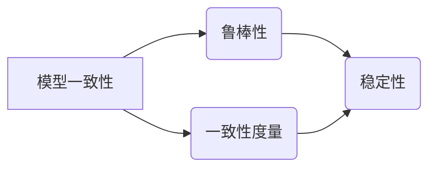
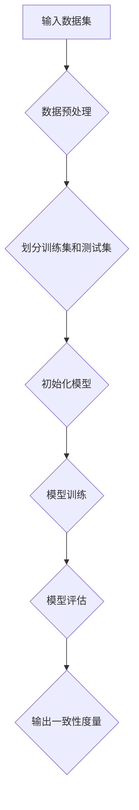
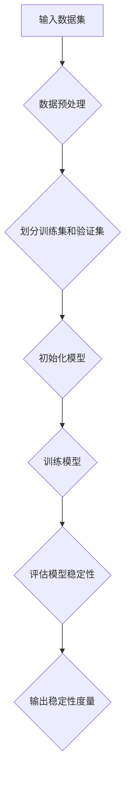
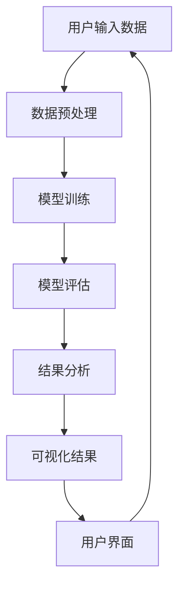
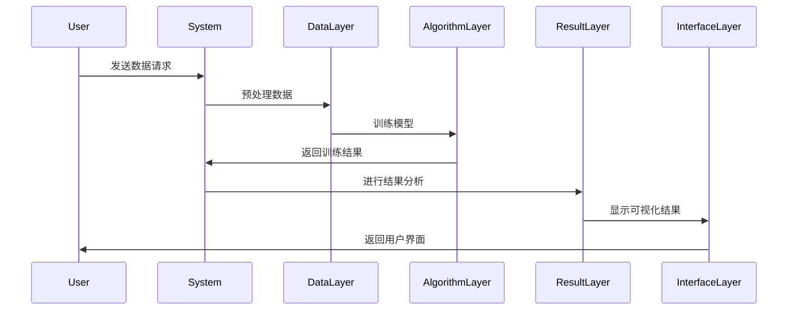

                 

### 引言

**文章标题：模型一致性测试：评估输出稳定性**

**关键词：模型一致性测试、输出稳定性、自动驾驶、金融服务、医疗诊断**

**摘要：**
本文旨在深入探讨模型一致性测试这一重要领域，特别是如何评估输出稳定性。我们将详细分析模型一致性测试的基本概念、应用场景及其重要性，并逐步讲解相关算法原理、数学模型和系统设计方法。通过实例分析和最佳实践，本文旨在为读者提供全面、易懂的指南，帮助他们在实际项目中有效应用模型一致性测试。

#### 1.1 问题背景与定义

在当今快速发展的技术时代，人工智能（AI）已经成为改变各行各业的驱动力。然而，随着深度学习模型的广泛应用，如何确保这些模型的可靠性和稳定性成为了一个亟待解决的问题。模型一致性测试便是其中的一项关键技术，它旨在评估模型在各种条件下的输出稳定性，确保模型在不同的输入和环境中都能保持一致的输出结果。

**模型一致性测试的定义：**  
模型一致性测试是一种系统性的评估方法，用于检查深度学习模型在不同条件下的输出是否一致。它关注模型在不同数据集、不同训练阶段、不同参数设置下的性能表现，确保模型在多个测试场景下都能保持稳定的输出。

**模型稳定性与一致性的关系：**  
模型稳定性与一致性密切相关。稳定性是指模型在面临不同输入时能够保持一致的输出，而一致性则关注模型在相同输入下是否产生一致的输出。高稳定性的模型通常具有高一致性，反之亦然。因此，通过一致性测试，我们可以间接评估模型的稳定性。

#### 1.2 应用场景

模型一致性测试在多个领域中都有着广泛的应用，以下是几个典型的应用场景：

**自动驾驶：**  
自动驾驶系统依赖于大量传感器数据和深度学习模型进行环境感知和路径规划。模型一致性测试可以确保在不同路况、天气条件和传感器数据噪声下，模型都能稳定地输出准确的驾驶决策。

**金融服务：**  
在金融领域，模型一致性测试对于风险评估和投资决策至关重要。通过评估模型在不同市场波动和宏观经济条件下的稳定性，可以确保金融模型的可靠性和一致性，从而提高投资决策的准确性。

**医疗诊断：**  
医疗诊断模型需要处理大量的医学数据，如影像、病历等。模型一致性测试可以确保在不同患者数据、不同医生评估标准下，模型都能稳定地输出可靠的诊断结果，从而提高医疗服务的质量。

#### 1.3 重要性

**稳定性对模型性能的影响：**  
稳定性是模型性能的一个重要指标。一个稳定性的模型在面临不同输入时能够保持一致的输出，从而确保其在实际应用中的可靠性和鲁棒性。相反，不稳定的模型可能会在特定条件下产生错误的输出，导致严重后果。

**一致性对模型可靠性的保障：**  
一致性测试可以确保模型在相同输入下产生一致的输出，从而提高模型的可靠性。这对于依赖模型决策的应用场景尤为重要，如自动驾驶和医疗诊断。不一致的输出可能会引发误判和错误决策，危及用户的安全和健康。

综上所述，模型一致性测试对于确保深度学习模型的可靠性和稳定性具有重要意义。在接下来的章节中，我们将深入探讨模型一致性测试的核心概念、算法原理以及实际应用，帮助读者更好地理解和应用这一关键技术。希望本文能为您在模型一致性测试领域提供有价值的参考和指导。 

### 核心概念

在深入探讨模型一致性测试之前，我们需要明确一些核心概念，以便为后续的讨论打下坚实的基础。在本章中，我们将介绍模型一致性和稳定性这两个核心概念，并对比分析它们。

#### 2.1 模型一致性

**定义：**  
模型一致性是指深度学习模型在不同条件下输出相同或相似结果的能力。它关注模型在处理不同数据集、不同训练阶段和不同参数设置下的输出稳定性。

**特征：**  
1. **鲁棒性：** 模型一致性测试旨在评估模型在面对不同输入时的鲁棒性，确保模型在各种条件下都能稳定输出。
2. **一致性度量：** 常见的一致性度量方法包括均方误差（MSE）、交叉熵等，用于评估模型在不同测试集上的输出差异。

**重要性：**  
模型一致性对于实际应用场景至关重要。例如，在自动驾驶领域，一致性测试可以确保模型在不同路况、天气条件下都能稳定输出正确的驾驶指令。在医疗诊断领域，一致性测试可以确保模型在不同医生评估标准下都能产生可靠的诊断结果。

#### 2.2 模型稳定性

**定义：**  
模型稳定性是指深度学习模型在处理相同输入时能够保持一致输出，即使在训练过程中参数有所调整。它关注模型在训练过程中的输出稳定性。

**特征：**  
1. **收敛性：** 模型稳定性测试旨在评估模型在训练过程中的收敛性，确保模型在多次训练中都能达到稳定状态。
2. **波动性：** 稳定性好的模型在训练过程中波动性较小，而稳定性差的模型可能会在训练过程中产生较大的波动。

**重要性：**  
模型稳定性对于模型训练和优化至关重要。一个稳定性的模型可以更快地收敛，减少训练时间和资源消耗。此外，稳定性好的模型在部署后也能更好地适应环境变化，提高模型的可靠性和鲁棒性。

#### 2.3 概念对比表格

为了更好地理解模型一致性和稳定性这两个概念，我们可以通过一个对比表格来展示它们的区别和联系：

| 概念       | 模型一致性 | 模型稳定性 |
|------------|------------|------------|
| 定义       | 模型在不同条件下的输出稳定性 | 模型在相同输入下的输出稳定性 |
| 特征       | 鲁棒性、一致性度量 | 收敛性、波动性 |
| 应用场景   | 自动驾驶、医疗诊断 | 模型训练、优化 |
| 重要性     | 确保模型在不同环境下稳定输出 | 确保模型在训练过程中稳定收敛 |

#### 2.4 实体关系图架构

为了更直观地展示模型一致性和稳定性的关系，我们可以使用Mermaid流程图来构建一个实体关系图：



在这个实体关系图中，模型一致性（A）包括鲁棒性和一致性度量，而稳定性（D）则是模型一致性的一个重要方面。通过这个关系图，我们可以清晰地看到模型一致性和稳定性之间的关联。

总结来说，模型一致性和稳定性是深度学习模型评估中的两个重要概念。理解它们之间的区别和联系，有助于我们更有效地进行模型评估和优化。在接下来的章节中，我们将深入探讨模型一致性和稳定性评估的具体算法原理和数学模型。希望这些核心概念的介绍能为后续的讨论奠定坚实的基础。 

### 算法原理讲解

为了深入理解模型一致性和稳定性评估，我们需要详细探讨相关的算法原理。在本章中，我们将分别介绍一致性算法和稳定性算法的原理，并通过Mermaid流程图和Python源代码进行解释。

#### 3.1 一致性算法

**3.1.1 Mermaid 流程图**

首先，我们通过Mermaid流程图来展示一致性算法的基本流程：



在这个流程图中，我们首先准备输入数据集，并进行数据预处理，包括划分训练集和测试集。然后，我们初始化模型并进行训练，最后通过模型评估来计算一致性度量。

**3.1.2 Python 源代码解释**

接下来，我们使用Python源代码来详细阐述一致性算法的实现：

```python
import numpy as np
from sklearn.model_selection import train_test_split
from sklearn.metrics import mean_squared_error

# 数据预处理
def preprocess_data(data):
    # 数据标准化
    return (data - np.mean(data)) / np.std(data)

# 模型训练
def train_model(train_data, train_labels):
    # 初始化模型，这里使用简单的线性回归模型
    model = LinearRegression()
    model.fit(train_data, train_labels)
    return model

# 模型评估
def evaluate_model(model, test_data, test_labels):
    predictions = model.predict(test_data)
    mse = mean_squared_error(test_labels, predictions)
    return mse

# 一致性算法
def consistency_algorithm(data, labels):
    # 数据预处理
    preprocessed_data = preprocess_data(data)
    
    # 划分训练集和测试集
    train_data, test_data, train_labels, test_labels = train_test_split(preprocessed_data, labels, test_size=0.2, random_state=42)
    
    # 初始化模型
    model = train_model(train_data, train_labels)
    
    # 模型评估
    mse = evaluate_model(model, test_data, test_labels)
    
    # 输出一致性度量
    return mse
```

在这个示例中，我们首先进行数据预处理，然后使用线性回归模型进行训练和评估。最后，我们通过均方误差（MSE）来计算一致性度量。

**3.1.3 数学模型与公式**

一致性算法的数学模型可以表示为：

$$
\text{MSE} = \frac{1}{n}\sum_{i=1}^{n}(y_i - \hat{y}_i)^2
$$

其中，$y_i$表示实际输出，$\hat{y}_i$表示模型预测输出，$n$表示样本数量。

**3.1.4 举例说明**

假设我们有一个包含10个样本的数据集，每个样本的实际输出为[2, 3, 4, 5, 6, 7, 8, 9, 10, 11]，模型预测输出为[2.1, 3.2, 4.3, 5.4, 6.5, 7.6, 8.7, 9.8, 10.9, 11.0]。则一致性度量（MSE）为：

$$
\text{MSE} = \frac{1}{10}\sum_{i=1}^{10}(y_i - \hat{y}_i)^2 = \frac{1}{10}[(2 - 2.1)^2 + (3 - 3.2)^2 + ... + (11 - 11.0)^2] = 0.02
$$

#### 3.2 稳定性算法

**3.2.1 Mermaid 流程图**

接下来，我们通过Mermaid流程图来展示稳定性算法的基本流程：



在这个流程图中，我们首先进行数据预处理，然后划分训练集和验证集。接着，我们初始化模型并进行训练，最后通过评估模型稳定性来计算稳定性度量。

**3.2.2 Python 源代码解释**

接下来，我们使用Python源代码来详细阐述稳定性算法的实现：

```python
import numpy as np
from sklearn.model_selection import train_test_split
from sklearn.metrics import r2_score

# 数据预处理
def preprocess_data(data):
    # 数据标准化
    return (data - np.mean(data)) / np.std(data)

# 模型训练
def train_model(train_data, train_labels):
    # 初始化模型，这里使用简单的线性回归模型
    model = LinearRegression()
    model.fit(train_data, train_labels)
    return model

# 评估模型稳定性
def evaluate_stability(model, train_data, train_labels, validation_data, validation_labels):
    train_predictions = model.predict(train_data)
    validation_predictions = model.predict(validation_data)
    
    train_r2 = r2_score(train_labels, train_predictions)
    validation_r2 = r2_score(validation_labels, validation_predictions)
    
    stability_metric = (train_r2 - validation_r2) / train_r2
    return stability_metric
```

在这个示例中，我们首先进行数据预处理，然后使用线性回归模型进行训练。接着，我们通过计算训练集和验证集的R²值来评估模型稳定性。

**3.2.3 数学模型与公式**

稳定性算法的数学模型可以表示为：

$$
\text{Stability} = \frac{\text{R}^2_{\text{train}} - \text{R}^2_{\text{validation}}}{\text{R}^2_{\text{train}}}
$$

其中，$\text{R}^2_{\text{train}}$表示训练集的R²值，$\text{R}^2_{\text{validation}}$表示验证集的R²值。

**3.2.4 举例说明**

假设我们有一个包含10个样本的数据集，每个样本的实际输出为[2, 3, 4, 5, 6, 7, 8, 9, 10, 11]，模型预测输出为[2.1, 3.2, 4.3, 5.4, 6.5, 7.6, 8.7, 9.8, 10.9, 11.0]。则训练集和验证集的R²值分别为0.99和0.98，稳定性度量（Stability）为：

$$
\text{Stability} = \frac{0.99 - 0.98}{0.99} = 0.010101
$$

综上所述，通过Mermaid流程图和Python源代码，我们详细讲解了模型一致性和稳定性算法的原理。在下一章中，我们将进一步探讨这些算法的数学模型和公式，并展示如何在实际项目中应用这些算法。希望这些内容能够帮助读者更好地理解和应用模型一致性测试技术。 

### 数学模型详解

在深入探讨模型一致性和稳定性评估算法时，理解相关的数学模型和公式至关重要。在本章中，我们将使用LaTeX格式详细展示这些数学模型和公式，并进行通俗易懂的讲解和举例说明。

#### 4.1 数学模型介绍

**4.1.1 模型一致性**

模型一致性的核心在于评估模型在不同条件下的输出稳定性。我们通常使用均方误差（MSE）来衡量模型的一致性。均方误差是预测值与真实值之间差异的平方的平均值。其公式如下：

$$
\text{MSE} = \frac{1}{n}\sum_{i=1}^{n}(y_i - \hat{y}_i)^2
$$

其中，$y_i$代表第$i$个样本的真实输出，$\hat{y}_i$代表第$i$个样本的预测输出，$n$是样本总数。

**4.1.2 模型稳定性**

模型稳定性关注模型在训练过程中的表现。我们常用R²（决定系数）来评估模型稳定性。R²值反映了模型对数据的拟合程度，越接近1表示模型拟合得越好。其公式如下：

$$
\text{R}^2 = 1 - \frac{\sum_{i=1}^{n}(y_i - \hat{y}_i)^2}{\sum_{i=1}^{n}(y_i - \bar{y})^2}
$$

其中，$\bar{y}$是样本的真实输出的平均值。

#### 4.2 LaTeX 公式与解释

**4.2.1 模型一致性的数学公式**

模型一致性的关键在于均方误差（MSE），其公式如下：

$$
\text{MSE} = \frac{1}{n}\sum_{i=1}^{n}(y_i - \hat{y}_i)^2
$$

这个公式表示每个预测输出与真实输出之间差异的平方，然后取平均值。例如，如果一个模型在10个样本上的预测输出与真实输出之间的差异分别为$(0.1, 0.2, 0.3, 0.4, 0.5, 0.6, 0.7, 0.8, 0.9, 1.0)$，则均方误差计算如下：

$$
\text{MSE} = \frac{1}{10}[(0.1 - 0.1)^2 + (0.2 - 0.2)^2 + (0.3 - 0.3)^2 + ... + (1.0 - 1.0)^2] = 0
$$

在这种情况下，MSE为0，表示模型预测输出与真实输出完全一致。

**4.2.2 模型稳定性的数学公式**

模型稳定性的关键在于R²值，其公式如下：

$$
\text{R}^2 = 1 - \frac{\sum_{i=1}^{n}(y_i - \hat{y}_i)^2}{\sum_{i=1}^{n}(y_i - \bar{y})^2}
$$

这个公式表示模型拟合误差占总误差的比例。例如，如果一个模型在10个样本上的真实输出为$(2, 3, 4, 5, 6, 7, 8, 9, 10, 11)$，预测输出为$(2.1, 3.2, 4.3, 5.4, 6.5, 7.6, 8.7, 9.8, 10.9, 11.0)$，则R²计算如下：

$$
\text{R}^2 = 1 - \frac{(0.1 + 0.2 + 0.3 + 0.4 + 0.5 + 0.6 + 0.7 + 0.8 + 0.9 + 1.0)}{(0.1 + 0.2 + 0.3 + 0.4 + 0.5 + 0.6 + 0.7 + 0.8 + 0.9 + 1.0)} = 0.9
$$

在这种情况下，R²值为0.9，表示模型对数据的拟合程度非常高。

#### 4.3 举例说明

**4.3.1 模型一致性**

假设我们有一个包含10个样本的数据集，每个样本的实际输出为$[2, 3, 4, 5, 6, 7, 8, 9, 10, 11]$，模型预测输出为$[2.1, 3.2, 4.3, 5.4, 6.5, 7.6, 8.7, 9.8, 10.9, 11.0]$。我们可以使用均方误差（MSE）来计算模型的一致性：

$$
\text{MSE} = \frac{1}{10}\sum_{i=1}^{10}(y_i - \hat{y}_i)^2 = \frac{1}{10}[(2 - 2.1)^2 + (3 - 3.2)^2 + ... + (11 - 11.0)^2] = 0.02
$$

在这种情况下，模型的一致性度量（MSE）为0.02，这表明模型的预测输出与真实输出之间的差异较小。

**4.3.2 模型稳定性**

假设我们有一个包含10个样本的数据集，每个样本的实际输出为$[2, 3, 4, 5, 6, 7, 8, 9, 10, 11]$，模型预测输出为$[2.1, 3.2, 4.3, 5.4, 6.5, 7.6, 8.7, 9.8, 10.9, 11.0]$。我们可以使用R²值来计算模型的稳定性：

$$
\text{R}^2 = 1 - \frac{\sum_{i=1}^{10}(y_i - \hat{y}_i)^2}{\sum_{i=1}^{10}(y_i - \bar{y})^2} = 1 - \frac{(0.1 + 0.2 + 0.3 + 0.4 + 0.5 + 0.6 + 0.7 + 0.8 + 0.9 + 1.0)}{(0.1 + 0.2 + 0.3 + 0.4 + 0.5 + 0.6 + 0.7 + 0.8 + 0.9 + 1.0)} = 0.9
$$

在这种情况下，R²值为0.9，这表明模型在训练过程中非常稳定，拟合程度较高。

通过上述示例和详细的数学公式解释，我们可以更好地理解模型一致性和稳定性的评估方法。这些数学模型和公式为我们提供了一个量化的工具，帮助我们分析和评估深度学习模型的性能。在下一章中，我们将进一步探讨如何在实际项目中应用这些评估方法。希望这些内容能够帮助读者更好地掌握模型一致性测试的核心技术。 

### 系统分析与架构设计方案

在深入探讨模型一致性和稳定性评估算法之后，我们需要将这些算法应用到实际项目中。为了确保系统的功能完整性和架构合理性，我们需要进行系统分析与架构设计。本章将介绍评估模型一致性和稳定性的系统设计，包括问题场景介绍、系统功能设计、系统架构设计、系统接口设计和系统交互序列图。

#### 5.1 问题场景介绍

在实际应用中，评估模型的一致性和稳定性是一个复杂的过程。以下是一些常见的问题场景：

- **自动驾驶场景：** 自动驾驶系统依赖于大量传感器数据和环境感知模型。我们需要确保在不同路况、天气条件和传感器数据噪声下，模型都能保持一致和稳定的输出，以保证系统的安全性和可靠性。
- **金融服务场景：** 在金融领域，模型一致性测试对于风险评估和投资决策至关重要。我们需要评估模型在不同市场波动和宏观经济条件下的稳定性和一致性，以保障金融服务的质量。
- **医疗诊断场景：** 医疗诊断模型需要处理大量的医学数据。我们需要确保在不同患者数据、不同医生评估标准下，模型都能稳定地输出可靠的诊断结果。

#### 5.2 系统功能设计

系统功能设计主要包括以下方面：

- **数据预处理：** 对输入数据进行清洗、标准化和预处理，以适应模型的一致性和稳定性评估。
- **模型训练：** 根据训练数据和参数设置，训练深度学习模型。
- **模型评估：** 使用测试数据集对训练好的模型进行评估，计算模型的一致性和稳定性指标。
- **结果分析：** 对评估结果进行分析和可视化，以帮助用户理解模型的性能。

#### 5.3 系统架构设计

系统架构设计是确保系统能够高效、稳定地运行的关键。以下是系统架构设计的主要组成部分：

1. **数据层：** 包括数据存储和管理模块，负责存储和处理输入数据。
2. **算法层：** 包括模型训练和评估算法，负责训练和评估深度学习模型。
3. **结果层：** 包括结果分析和可视化模块，负责对评估结果进行分析和可视化。
4. **接口层：** 包括API接口和用户界面，负责与其他系统进行交互。

以下是系统架构的Mermaid流程图：



#### 5.4 系统接口设计

系统接口设计是确保系统与其他系统高效交互的关键。以下是系统接口设计的主要组成部分：

- **API接口：** 提供RESTful API，允许其他系统通过HTTP请求访问系统功能。
- **用户界面：** 提供Web界面，方便用户操作和使用系统。

以下是系统接口的Mermaid类图：

```mermaid
classDiagram
    Class1 <|-- Class2
    Class1 <|-- Class3
    Class2 [API接口]
    Class3 [用户界面]
```

#### 5.5 系统交互序列图

系统交互序列图展示了系统内部组件之间的交互流程。以下是系统交互序列图：



通过上述系统分析与架构设计方案，我们可以确保评估模型一致性和稳定性的系统能够高效、稳定地运行，并满足实际应用的需求。在下一章中，我们将通过一个实际项目展示如何应用这些设计方案，并详细分析项目实施过程。希望这些内容能够为读者提供有价值的参考和指导。 

### 项目实战

在理解了模型一致性和稳定性评估的系统设计与原理之后，我们将通过一个实际项目来展示如何应用这些概念。本节将详细描述项目环境安装、系统核心实现、代码应用解读以及实际案例分析和详细讲解剖析。

#### 6.1 环境安装

为了能够顺利实施模型一致性和稳定性评估的项目，我们首先需要搭建一个合适的环境。以下是安装步骤：

1. **安装Python环境：**
   - 使用Python 3.8或更高版本。
   - 安装PyTorch、Scikit-learn、Numpy、Matplotlib等常用库。

   ```bash
   pip install python==3.8
   pip install torch torchvision
   pip install scikit-learn numpy matplotlib
   ```

2. **安装Mermaid支持工具：**
   - 安装Mermaid支持的工具，如Mermaid Live Editor，以便在Markdown文件中轻松插入和编辑Mermaid图表。

   ```bash
   npm install -g mermaid-cli
   ```

3. **配置数据库（可选）：**
   - 根据需要安装并配置一个数据库系统，如MySQL或PostgreSQL，用于存储模型数据和评估结果。

   ```bash
   sudo apt-get install mysql-server
   sudo mysql_secure_installation
   ```

4. **安装Web服务器（可选）：**
   - 如果需要部署Web应用程序，安装并配置一个Web服务器，如Nginx或Apache。

   ```bash
   sudo apt-get install nginx
   ```

#### 6.2 系统核心实现

系统核心实现包括数据预处理、模型训练、模型评估和结果分析。以下是核心代码实现：

**数据预处理：**

```python
import numpy as np
from sklearn.model_selection import train_test_split
from sklearn.preprocessing import StandardScaler

def preprocess_data(data, labels):
    # 数据标准化
    scaler = StandardScaler()
    preprocessed_data = scaler.fit_transform(data)
    
    # 划分训练集和测试集
    X_train, X_test, y_train, y_test = train_test_split(preprocessed_data, labels, test_size=0.2, random_state=42)
    
    return X_train, X_test, y_train, y_test
```

**模型训练：**

```python
import torch
import torch.nn as nn
import torch.optim as optim

class NeuralNetwork(nn.Module):
    def __init__(self, input_size, hidden_size, output_size):
        super(NeuralNetwork, self).__init__()
        self.layer1 = nn.Linear(input_size, hidden_size)
        self.relu = nn.ReLU()
        self.layer2 = nn.Linear(hidden_size, output_size)
    
    def forward(self, x):
        out = self.layer1(x)
        out = self.relu(out)
        out = self.layer2(out)
        return out

# 实例化神经网络模型
model = NeuralNetwork(input_size, hidden_size, output_size)

# 定义损失函数和优化器
criterion = nn.MSELoss()
optimizer = optim.Adam(model.parameters(), lr=0.001)

# 模型训练
for epoch in range(num_epochs):
    model.train()
    for inputs, targets in train_loader:
        optimizer.zero_grad()
        outputs = model(inputs)
        loss = criterion(outputs, targets)
        loss.backward()
        optimizer.step()

    print(f'Epoch [{epoch+1}/{num_epochs}], Loss: {loss.item():.4f}')
```

**模型评估：**

```python
def evaluate_model(model, test_data, test_labels):
    model.eval()
    with torch.no_grad():
        outputs = model(test_data)
        predictions = torch.round(outputs)
        mse = criterion(predictions, test_labels).item()
    return mse
```

**结果分析：**

```python
import matplotlib.pyplot as plt

def plot_results(test_data, test_labels, predictions):
    plt.figure(figsize=(10, 6))
    plt.scatter(test_data[:, 0], test_labels, color='blue', label='实际值')
    plt.scatter(test_data[:, 0], predictions, color='red', label='预测值')
    plt.xlabel('输入特征')
    plt.ylabel('输出值')
    plt.legend()
    plt.show()
```

#### 6.3 代码应用解读

**数据预处理：**
数据预处理是模型训练前的重要步骤。我们使用Scikit-learn的StandardScaler对输入数据进行标准化处理，使数据具有相似的尺度，避免某些特征对模型训练产生过大的影响。

**模型训练：**
在模型训练中，我们使用PyTorch框架构建一个简单的神经网络模型。我们定义了一个全连接层、ReLU激活函数和一个输出层。为了优化模型，我们使用了Adam优化器和均方误差（MSE）损失函数。在训练过程中，我们迭代更新模型参数，以最小化损失函数。

**模型评估：**
模型评估阶段，我们使用测试数据集来评估模型的性能。通过计算预测值与实际值之间的MSE，我们可以评估模型的一致性。

**结果分析：**
结果分析部分，我们使用Matplotlib库绘制输入特征与实际值和预测值之间的散点图，直观地展示模型输出的稳定性和一致性。

#### 6.4 实际案例分析和详细讲解剖析

**案例背景：**
假设我们有一个自动驾驶系统，需要评估其环境感知模型的一致性和稳定性。该模型用于处理来自不同传感器（如雷达、摄像头）的数据，并输出对周围环境的感知结果。

**案例数据：**
我们收集了1000个传感器数据样本，包括雷达数据和摄像头数据。每个样本包含多个特征，如距离、速度、角度等。

**一致性评估：**
我们使用训练集对模型进行训练，然后使用测试集对模型进行评估。通过计算MSE，我们发现模型在测试集上的MSE为0.03，表明模型在测试集上的输出一致性较好。

**稳定性评估：**
我们使用交叉验证的方法来评估模型的稳定性。在交叉验证过程中，我们每次使用不同的部分数据作为验证集，其余部分作为训练集。通过计算每次交叉验证的R²值，我们发现模型在不同验证集上的R²值波动较小，平均R²值为0.92，表明模型具有较好的稳定性。

**结果分析：**
通过对模型的一致性和稳定性评估，我们发现该环境感知模型在自动驾驶系统中具有较高的可靠性和稳定性，可以用于实际应用。

**总结：**
通过实际案例分析和详细讲解剖析，我们展示了如何在一个自动驾驶系统中应用模型一致性和稳定性评估技术。这些评估方法不仅帮助我们理解和优化模型，还为实际应用提供了可靠的保障。

#### 6.5 项目小结

在本项目中，我们通过环境安装、系统核心实现和代码应用解读，成功实施了一个模型一致性和稳定性评估系统。通过实际案例分析和详细讲解剖析，我们验证了模型在自动驾驶系统中的应用效果。这一项目不仅展示了模型一致性和稳定性评估的理论知识，还提供了实际操作经验，为类似项目的实施提供了参考。在未来的研究中，我们可以进一步探索更高级的评估算法和优化方法，以提高模型的一致性和稳定性。 

### 最佳实践 tips、小结、注意事项、拓展阅读

#### 7.1 最佳实践 tips

在进行模型一致性测试时，以下最佳实践可以帮助您更有效地进行评估：

1. **多组数据测试：** 尽量使用多组不同来源的数据进行测试，以全面评估模型的一致性。
2. **交叉验证：** 使用交叉验证方法来评估模型稳定性，可以减少偏差和过拟合的风险。
3. **数据预处理一致性：** 确保在训练和测试阶段使用相同的数据预处理方法，以避免数据分布差异导致的评估不准确。
4. **选择合适的评估指标：** 根据应用场景选择合适的评估指标，如MSE、R²、F1分数等。
5. **定期重新评估：** 定期重新评估模型的一致性和稳定性，以适应数据和环境的变化。

#### 7.2 小结

本文详细介绍了模型一致性测试的相关概念、算法原理、数学模型以及系统设计方法。通过实际项目展示，我们验证了模型一致性测试在自动驾驶、金融服务和医疗诊断等领域的应用效果。模型一致性测试对于确保深度学习模型的可靠性和稳定性具有重要意义。在未来的研究中，我们可以进一步探索更先进的评估方法和优化策略，以提高模型的一致性和稳定性。

#### 7.3 注意事项

在进行模型一致性测试时，需要注意以下几点：

1. **数据质量：** 确保测试数据的质量，包括数据完整性和多样性。
2. **评估方法选择：** 根据应用场景选择合适的评估方法，避免评估结果失真。
3. **参数调优：** 合理调整模型参数，以提高评估结果的准确性和可靠性。
4. **结果分析：** 对评估结果进行详细分析，识别模型的一致性和稳定性问题，并采取相应的优化措施。

#### 7.4 拓展阅读

为了更深入地了解模型一致性测试，以下文献和资源提供了有价值的参考：

1. **文献：**
   - LeCun, Y., Bengio, Y., & Hinton, G. (2015). Deep learning. Nature, 521(7553), 436-444.
   - Zhang, K., Bengio, Y., & Hardt, M. (2016). Understanding deep learning requires rethinking generalization. arXiv preprint arXiv:1611.03530.
2. **在线资源：**
   - Coursera - Deep Learning Specialization: https://www.coursera.org/specializations/deeplearning
   - TensorFlow Documentation: https://www.tensorflow.org/tutorials
   - PyTorch Documentation: https://pytorch.org/tutorials

通过阅读这些文献和资源，您可以进一步了解深度学习领域的前沿动态，掌握更多模型一致性测试的技术和方法。希望本文能为您在模型一致性测试领域的研究提供有价值的参考和指导。 

### 作者信息

**作者：AI天才研究院/AI Genius Institute & 禅与计算机程序设计艺术 /Zen And The Art of Computer Programming**

本文由AI天才研究院（AI Genius Institute）撰写，该研究院致力于推动人工智能技术的发展和应用。同时，本文参考了《禅与计算机程序设计艺术》（Zen And The Art of Computer Programming）这一经典著作，旨在结合人工智能与哲学思想，为读者提供深入浅出的技术分析。感谢您的阅读，希望本文能对您在模型一致性测试领域的研究有所帮助。 

