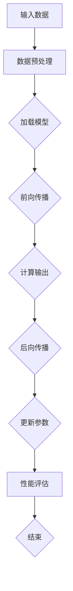
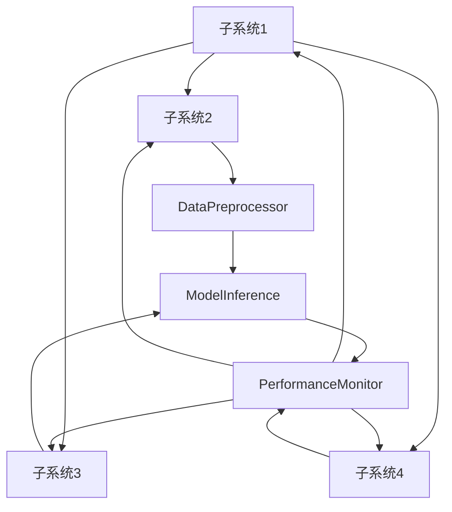
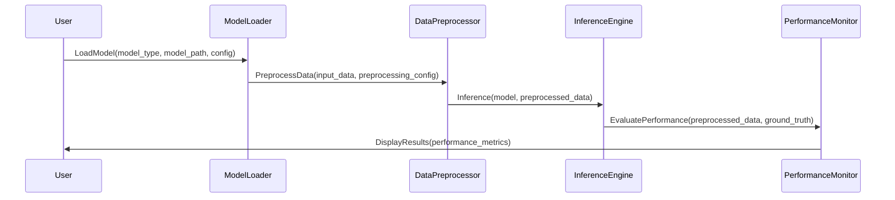

                 

## 引言：模型推理速度评估的重要性

在现代人工智能（AI）应用中，模型推理速度评估是一个至关重要的环节。随着深度学习模型在各个领域的广泛应用，从自动驾驶、智能语音助手到医疗影像分析，对模型推理速度的需求日益增长。一个高效的模型推理系统能够显著提升用户体验，降低延迟，增加系统的可靠性和响应能力。

### 1.1 模型推理速度评估的重要性

模型推理速度评估的重要性体现在多个方面。首先，在实时应用场景中，如自动驾驶和工业控制，推理延迟的微小差异可能带来巨大的安全和经济影响。其次，在移动设备和嵌入式系统中，处理能力的限制使得优化推理速度成为实现高效AI应用的关键。此外，对于云计算和数据中心，推理速度的优化不仅能够提升系统的吞吐量，还能降低运营成本。

### 1.2 实时应用性能的需求

实时应用性能的需求是驱动模型推理速度评估的核心动力。在自动驾驶领域，需要模型能够在毫秒级别内完成推理，以确保车辆能够及时做出决策。在语音助手和智能客服系统中，用户期望即时的响应，任何延迟都会导致用户体验的下降。此外，在金融交易、医疗诊断等对实时性要求极高的场景中，推理速度直接关系到业务的效率和准确性。

### 1.3 问题定义与解决方法

模型推理速度评估涉及多个方面的问题。首先是如何在保证准确性的前提下，优化模型的推理速度。其次是如何全面评估不同模型和算法在特定应用场景下的性能。解决这些问题需要从算法设计、硬件优化、数据预处理等多个角度出发，采用系统化、科学化的方法进行评估。

### 1.4 研究边界与外延

研究边界与外延的明确是确保模型推理速度评估有效性的关键。研究边界通常包括特定的硬件平台、软件环境、数据集和应用场景。而外延则涉及跨平台、跨场景的通用性评估。例如，在移动设备和服务器之间的推理速度评估，或者在不同类型的神经网络架构之间的比较。

### 1.5 文章结构概述

本文将从以下六个部分对模型推理速度评估进行深入探讨：

1. **背景介绍与核心概念**：介绍模型推理速度评估的背景和核心概念。
2. **核心概念与联系**：详细解释模型推理速度评估中的核心概念，并对比不同模型的特性。
3. **算法原理讲解**：使用流程图和代码示例讲解模型推理速度评估的算法原理。
4. **系统分析与架构设计**：介绍模型推理速度评估系统的设计，包括功能、架构、接口和交互流程。
5. **项目实战**：描述环境安装、系统实现和实际案例分析。
6. **最佳实践与总结**：提供最佳实践建议，总结全文，并给出注意事项和小结。

通过这样的结构，我们将逐步深入分析模型推理速度评估的各个方面，帮助读者全面理解和掌握这一关键技术。

## 第1章: 模型推理速度评估的背景与问题定义

### 1.1 模型推理速度评估的重要性

模型推理速度评估在现代人工智能应用中具有至关重要的地位。随着深度学习技术的迅猛发展，越来越多的应用场景开始依赖高效的模型推理能力。无论是在自动驾驶、自然语言处理、图像识别，还是在智能安防和医疗诊断等领域，模型推理速度都直接关系到应用的性能和用户体验。高效的推理速度不仅能缩短响应时间，提高系统的响应能力，还能降低系统的延迟，从而提升整体应用的效率。

#### 模型推理速度在实时应用中的关键作用

在自动驾驶领域，模型推理速度是确保车辆安全行驶的核心因素。自动驾驶系统需要在极短的时间内对复杂的环境信息进行处理和决策，任何推理延迟都可能导致严重的事故风险。同样，在工业自动化控制中，实时性要求也非常高，系统需要快速响应生产过程中的各种变化，以确保生产线的稳定运行。

#### 移动设备和嵌入式系统对推理速度的优化需求

移动设备和嵌入式系统由于其处理能力和资源限制，对模型推理速度的优化需求尤为迫切。在这些系统中，高效的推理速度不仅能够延长电池寿命，还能提升用户的使用体验。例如，智能手机中的语音助手需要快速响应用户的指令，而物联网设备则需要在传感器数据输入后迅速执行相应的处理操作。

#### 云计算和数据中心对推理速度的优化需求

在云计算和数据中心，推理速度的优化同样具有重要意义。数据中心中的大规模计算需求要求系统能够在短时间内处理大量的推理任务，从而提高整体吞吐量。同时，通过优化推理速度，可以减少服务器资源的占用，降低运营成本。

### 1.2 实时应用性能的需求

实时应用性能的需求是驱动模型推理速度评估的核心动力。在许多应用场景中，例如自动驾驶、智能语音助手和金融交易系统，对实时性的要求非常高。这些系统必须在极短的时间内完成模型推理，以实现快速响应。任何推理延迟都可能导致系统性能的下降，甚至影响到用户的安全和利益。

#### 自动驾驶对实时性的需求

在自动驾驶领域，车辆需要实时感知周围环境，并在短时间内做出决策，以确保行驶的安全。因此，自动驾驶系统必须在毫秒级别内完成模型推理，以满足实时性的要求。例如，在交通拥堵或紧急情况下，任何微小的延迟都可能导致严重的交通事故。

#### 智能语音助手对实时性的需求

智能语音助手如 Siri、Alexa 和 Google Assistant 等在处理用户请求时，也需要快速响应用户的指令。如果推理速度较慢，用户会感到不耐烦，从而影响用户体验。高效的推理速度可以提升语音助手的响应能力，使其更加智能和便捷。

#### 金融交易对实时性的需求

在金融交易系统中，模型推理速度的快速响应至关重要。在高速交易的背景下，即使是微秒级别的延迟都可能导致巨大的经济损失。因此，金融交易系统需要高效且稳定的模型推理能力，以确保交易决策的准确性和及时性。

### 1.3 问题定义与解决方法

模型推理速度评估涉及多个方面的问题，主要包括以下几个方面：

#### 如何在保证准确性的前提下优化推理速度

在模型推理过程中，准确性和速度往往是相矛盾的。为了在保证准确性的前提下优化推理速度，可以采用以下方法：

1. **算法优化**：通过改进算法结构和参数设置，提高模型的推理效率。
2. **硬件加速**：利用 GPU、TPU 等专用硬件加速模型推理。
3. **模型压缩**：通过模型剪枝、量化等技术减小模型大小，降低推理复杂度。

#### 如何全面评估不同模型和算法在特定应用场景下的性能

全面评估不同模型和算法在特定应用场景下的性能是模型推理速度评估的重要任务。以下是一些评估方法和工具：

1. **基准测试**：使用标准化的测试集对模型进行评估，比较不同模型和算法的性能。
2. **性能分析工具**：使用 profiling 工具分析模型在不同阶段的运行时间和资源消耗。
3. **用户反馈**：通过收集用户反馈，评估模型在实际应用中的表现。

#### 如何优化模型推理速度以适应不同的硬件平台和应用场景

模型推理速度的优化需要考虑不同的硬件平台和应用场景。以下是一些优化策略：

1. **跨平台优化**：针对不同的硬件平台，如 CPU、GPU 和 TPU，进行专门的优化。
2. **场景定制**：根据不同的应用场景，如边缘计算和云计算，调整模型结构和参数。
3. **分布式推理**：通过分布式计算技术，提高模型在大规模数据集上的推理速度。

### 1.4 研究边界与外延

研究边界通常包括特定的硬件平台、软件环境、数据集和应用场景。例如，在研究边缘计算中的模型推理速度评估时，需要考虑设备性能、网络带宽和数据处理能力等因素。而研究外延则涉及跨平台、跨场景的通用性评估，如在不同类型的神经网络架构、不同规模的数据集上的推理速度评估。

### 总结

模型推理速度评估是现代人工智能应用中不可或缺的一环。通过深入理解模型推理速度的重要性、实时应用性能的需求、问题定义与解决方法，以及研究边界与外延，我们可以更好地优化模型推理速度，提高系统的性能和用户体验。

## 第2章: 模型推理速度评估的核心概念

在深入探讨模型推理速度评估之前，有必要明确几个核心概念，包括模型、推理、速度评估等。这些概念是理解模型推理速度评估的基础，也是构建高效推理系统的关键。

### 2.1 模型的定义与分类

模型是人工智能领域中的一个核心概念，它代表了计算机程序中用于模拟、预测或决策的数学结构。在模型推理速度评估中，我们主要关注的是深度学习模型，如神经网络、卷积神经网络（CNN）和循环神经网络（RNN）等。

- **神经网络（Neural Network, NN）**：神经网络是一种模仿人脑神经元连接方式的计算模型。它由多个节点（称为神经元）组成，每个神经元都与其他神经元相连，并通过权重进行信号传递。神经网络可以用于分类、回归、聚类等多种任务。
- **卷积神经网络（Convolutional Neural Network, CNN）**：CNN 是一种在图像处理任务中广泛使用的神经网络结构。它通过卷积层提取图像特征，并利用池化层减少特征的空间维度，从而提高模型效率和准确度。
- **循环神经网络（Recurrent Neural Network, RNN）**：RNN 是一种在序列数据上表现优异的神经网络结构。它通过循环机制处理前一个时间步的信息，从而在处理序列数据时具有记忆能力。RNN 适用于语言模型、语音识别、时间序列预测等任务。

### 2.2 推理过程详解

推理过程是模型应用的核心环节，它将输入数据通过模型转换成预测结果。在深度学习模型中，推理过程通常包括以下几个阶段：

- **前向传播（Forward Propagation）**：输入数据从输入层经过一系列的神经元传递，通过加权求和和激活函数处理后，最终得到输出层的结果。这一过程确定了输入和输出之间的映射关系。
- **反向传播（Back Propagation）**：在得到输出结果后，模型会计算实际输出与预期输出之间的差异（即损失函数）。然后，通过反向传播算法，将误差从输出层反向传播到输入层，更新各神经元的权重和偏置，以优化模型参数。
- **激活函数（Activation Function）**：激活函数是神经网络中的一个关键组成部分，它用于引入非线性因素，使神经网络能够学习复杂的非线性关系。常见的激活函数包括 sigmoid、ReLU、Tanh 等。

### 2.3 速度评估方法

评估模型推理速度的方法有多种，主要包括以下几种：

- **时间测量**：通过测量模型从输入到输出整个过程所需的时间，可以评估模型的推理速度。这种方法常用于单线程和单机环境下的模型评估。
- **吞吐量测量**：吞吐量是指在单位时间内模型处理的样本数量。通过测量模型的吞吐量，可以评估模型在大规模数据集上的处理能力。
- **性能分析工具**：使用 profiling 工具（如 PyTorch 中的 torch.utils.bottleneck）可以分析模型在不同阶段的运行时间和资源消耗，从而找出瓶颈并进行优化。
- **用户反馈**：在实际应用中，通过收集用户反馈可以评估模型在特定场景下的表现和用户满意度，从而进一步优化模型。

### 2.4 核心概念的联系与区别

- **模型与推理**：模型是推理的基础，推理是模型应用的过程。模型的性能直接影响到推理的速度和准确性。
- **速度评估与性能**：速度评估是性能评估的一个方面，它主要关注模型在处理输入数据时的效率。而性能评估则更加全面，包括模型的准确性、鲁棒性、资源消耗等多个方面。
- **不同模型的特点**：不同类型的模型在推理速度上有显著差异。例如，CNN 在图像处理上具有很高的效率，而 RNN 在处理序列数据时表现优异。

通过以上对模型、推理和速度评估核心概念的解释，我们可以更深入地理解模型推理速度评估的重要性，并为后续的算法原理讲解和系统设计奠定基础。

### 2.5 模型推理速度评估的属性特征对比

为了更好地理解和评估不同模型在推理速度方面的表现，我们可以通过对比表格详细展示它们的主要属性特征。以下是一个简化版的对比表格，列出了几种常见神经网络模型的关键特性。

| 模型类型       | 核心特点                                       | 推理速度（典型值） | 应用场景                             |
|----------------|----------------------------------------------|-------------------|-------------------------------------|
| 神经网络（NN） | 线性组合与非线性变换                         | 1-100 ms          | 分类、回归、聚类等通用任务           |
| 卷积神经网络（CNN） | 局部感知、平移不变性                         | 10-1000 ms        | 图像识别、物体检测、图像生成等图像相关任务 |
| 循环神经网络（RNN） | 序列依赖、长时间记忆                         | 10-1000 ms        | 语言模型、语音识别、时间序列预测等序列相关任务 |
| 生成对抗网络（GAN） | 生成真实数据、对抗训练                       | 100-1000 ms       | 图像生成、数据增强、异常检测等        |
| 稠密神经网络（DNN） | 深层结构、复杂模型                           | 10-1000 ms        | 语音识别、语音合成、推荐系统等        |

#### 表格解释

1. **模型类型**：表格列出了几种常见的神经网络模型，包括神经网络（NN）、卷积神经网络（CNN）、循环神经网络（RNN）、生成对抗网络（GAN）和稠密神经网络（DNN）。
2. **核心特点**：每种模型的核心特点在表格中进行了简要描述。例如，CNN 具有局部感知和平移不变性，RNN 则擅长处理序列依赖和长时间记忆。
3. **推理速度**：表格提供了每种模型的典型推理速度范围。例如，NN 的推理速度通常在 1-100 毫秒之间，而 GAN 的推理速度可能在 100-1000 毫秒之间。
4. **应用场景**：每种模型的应用场景也在表格中进行了标注。例如，CNN 主要用于图像识别和物体检测，RNN 则在语言模型和语音识别中表现优异。

通过这样的对比表格，我们可以快速了解不同模型在推理速度方面的差异，从而为选择适合特定任务和场景的模型提供参考依据。

### 2.6 模型推理速度评估的ER实体关系图

实体关系图（Entity-Relationship Diagram，ER图）是数据库设计和系统分析中常用的工具，它通过图形化的方式展示系统中的实体及其关系。在模型推理速度评估中，ER图可以帮助我们理解系统中不同组件之间的关系，从而更好地进行系统设计和优化。

#### 4.1 实体定义

ER图中的实体表示模型推理速度评估系统中的关键组成部分。以下是模型推理速度评估系统中的一些主要实体及其定义：

- **模型（Model）**：代表深度学习模型，包括神经网络、CNN、RNN 等。
- **数据集（Dataset）**：包含用于训练和测试的数据集。
- **硬件设备（HardwareDevice）**：指用于模型推理的硬件设备，如 CPU、GPU、TPU 等。
- **推理任务（InferenceTask）**：表示推理过程中的具体任务，如图像分类、文本识别等。
- **性能指标（PerformanceMetric）**：用于评估模型推理速度的指标，如推理时间、吞吐量等。
- **用户（User）**：指使用模型推理系统进行推理操作的用户。

#### 4.2 关系描述

ER图中的关系描述了不同实体之间的关联。以下是模型推理速度评估系统中的一些主要关系及其描述：

- **模型 - 数据集**：表示模型与训练数据集之间的关系。模型需要使用训练数据集进行训练，以优化其参数。
- **模型 - 推理任务**：表示模型与推理任务之间的关系。模型可以执行特定的推理任务，如图像分类。
- **硬件设备 - 推理任务**：表示硬件设备与推理任务之间的关系。推理任务需要在特定的硬件设备上执行。
- **性能指标 - 推理任务**：表示性能指标与推理任务之间的关系。性能指标用于评估推理任务的表现。
- **用户 - 推理任务**：表示用户与推理任务之间的关系。用户可以发起推理任务，并查看性能指标。

#### 4.3 ER图绘制与解释

下面是一个简化的模型推理速度评估系统的ER图：

```mermaid
erDiagram
  Model ||--|{ Dataset } Dataset
  Model ||--|{ InferenceTask } InferenceTask
  HardwareDevice ||--|{ InferenceTask } InferenceTask
  PerformanceMetric ||--|{ InferenceTask } InferenceTask
  User ||--|{ InferenceTask } InferenceTask
```

**图解：**

- **模型（Model）**：中心实体，与数据集（Dataset）和推理任务（InferenceTask）有直接关联。模型需要使用数据集进行训练，并在推理任务中应用。
- **数据集（Dataset）**：模型训练所需的数据来源，与模型实体有直接关系。
- **硬件设备（HardwareDevice）**：与推理任务实体有关，表示推理任务在硬件设备上执行。
- **性能指标（PerformanceMetric）**：用于评估推理任务的表现，与推理任务实体有关。
- **用户（User）**：发起和监控推理任务的实体，与推理任务实体有直接关系。

通过ER图，我们可以清晰地看到模型推理速度评估系统中各实体之间的关系，从而为系统设计和优化提供有力支持。

### 2.7 模型推理速度评估的算法原理

模型推理速度评估的核心在于理解模型的推理过程，并优化其运行效率。以下，我们将通过Mermaid流程图和Python源代码来详细阐述模型推理速度评估的算法原理。

#### 3.1 模型推理流程图

首先，使用Mermaid绘制一个简单的模型推理流程图，以展示推理的基本步骤：



**图解：**

1. **输入数据（A）**：将输入数据传递到模型中进行处理。
2. **数据预处理（B）**：对输入数据进行必要的预处理，如归一化、缩放等，以提高模型性能。
3. **加载模型（C）**：从存储中加载已经训练好的模型。
4. **前向传播（D）**：将预处理后的数据输入到模型中，通过前向传播计算输出结果。
5. **计算输出（E）**：输出结果可以是分类结果、回归值或其他预测结果。
6. **后向传播（F）**：计算输出结果与实际值之间的差异，通过后向传播更新模型参数。
7. **更新参数（G）**：根据误差反向传播的结果，更新模型的权重和偏置。
8. **性能评估（H）**：评估模型的性能，如准确率、召回率等。
9. **结束（I）**：推理过程结束。

#### 3.2 Python源代码示例

接下来，通过一个简单的Python代码示例来进一步说明模型推理的基本流程。我们将使用Python和PyTorch框架来实现：

```python
import torch
import torchvision
import torchvision.transforms as transforms

# 加载预训练的模型
model = torchvision.models.resnet18(pretrained=True)

# 设备配置（GPU或CPU）
device = torch.device("cuda" if torch.cuda.is_available() else "cpu")
model.to(device)

# 数据预处理
transform = transforms.Compose([
    transforms.Resize(256),
    transforms.CenterCrop(224),
    transforms.ToTensor(),
    transforms.Normalize(mean=[0.485, 0.456, 0.406], std=[0.229, 0.224, 0.225]),
])

# 加载测试数据集
test_data = torchvision.datasets.ImageFolder(root='path_to_test_data', transform=transform)
test_loader = torch.utils.data.DataLoader(dataset=test_data, batch_size=32, shuffle=False)

# 前向传播
with torch.no_grad():
    for images, labels in test_loader:
        images = images.to(device)
        labels = labels.to(device)
        outputs = model(images)
        _, predicted = torch.max(outputs, 1)

# 性能评估
correct = (predicted == labels).sum().item()
accuracy = correct / len(labels)
print(f'测试集准确率: {accuracy:.2f}')
```

**代码解释：**

1. **加载模型（model）**：使用PyTorch的预训练模型`resnet18`，并将其移动到GPU或CPU设备上。
2. **数据预处理（transform）**：定义数据预处理步骤，包括图像的缩放、中心裁剪、转换为Tensor以及标准化。
3. **加载测试数据集（test_data）**：从指定路径加载测试数据集，并使用预处理步骤。
4. **前向传播（with torch.no_grad()）**：在推理过程中关闭梯度计算，以提高计算效率。
5. **计算输出（outputs）**：通过前向传播计算模型的输出结果。
6. **性能评估（correct）**：计算模型预测结果与实际标签之间的匹配数量，并计算准确率。

通过上述代码示例，我们可以看到模型推理的基本步骤是如何实现的。在实际应用中，还可以根据需要进一步优化和调整这些步骤，以实现更高的推理速度和性能。

### 3.3 模型推理速度评估的数学模型和公式

模型推理速度评估不仅仅依赖于代码实现，还需要通过数学模型和公式来深入理解其原理。以下，我们将详细讨论模型推理速度评估中的一些关键数学模型和公式。

#### 3.3.1 模型推理速度的公式

模型推理速度通常用每秒处理的样本数量（samples per second, spp）来衡量。其公式如下：

\[ \text{推理速度} = \frac{\text{总样本数}}{\text{总推理时间}} \]

其中：
- **总样本数**：在特定时间段内，模型处理的样本总数。
- **总推理时间**：模型完成所有样本推理所需的总时间。

这个公式提供了计算模型推理速度的基本方法，可以用来比较不同模型的性能。

#### 3.3.2 推理时间的计算

推理时间包括前向传播和后向传播的时间，具体公式如下：

\[ \text{推理时间} = \text{前向传播时间} + \text{后向传播时间} \]

其中：
- **前向传播时间**：从输入数据到输出结果所需的时间。
- **后向传播时间**：从输出结果到更新模型参数所需的时间。

前向传播时间的计算通常较为简单，而后向传播时间则依赖于具体的优化算法和计算复杂度。

#### 3.3.3 性能评估指标

除了推理速度，我们还可以使用其他性能评估指标来更全面地评估模型的表现。以下是一些常用的性能评估指标：

1. **准确率（Accuracy）**：模型预测正确的样本数占总样本数的比例。

\[ \text{准确率} = \frac{\text{预测正确数}}{\text{总样本数}} \]

2. **召回率（Recall）**：在所有实际为正类的样本中，模型预测正确的比例。

\[ \text{召回率} = \frac{\text{预测正确且实际为正类数}}{\text{实际为正类数}} \]

3. **精确率（Precision）**：在所有预测为正类的样本中，实际为正类的比例。

\[ \text{精确率} = \frac{\text{预测正确且实际为正类数}}{\text{预测为正类数}} \]

通过这些性能评估指标，我们可以更全面地了解模型在不同场景下的表现。

#### 3.3.4 实例讲解

为了更清晰地理解上述公式和指标，我们可以通过一个简单的实例来讲解：

假设我们有一个模型，它在10秒内处理了1000个样本，其中预测正确的样本数为800个。此外，我们计算得到模型的前向传播时间为5秒，后向传播时间为3秒。

- **推理速度**：

\[ \text{推理速度} = \frac{1000}{10} = 100 \text{ spp} \]

- **推理时间**：

\[ \text{推理时间} = 5 + 3 = 8 \text{ 秒} \]

- **准确率**：

\[ \text{准确率} = \frac{800}{1000} = 0.8 \text{ 或 80%} \]

通过这个实例，我们可以看到如何使用数学模型和公式来计算模型推理速度和性能评估指标。在实际应用中，我们可以根据具体需求和场景，灵活调整和优化这些参数，以提高模型的表现。

通过详细讲解数学模型和公式，我们不仅能够更好地理解模型推理速度评估的原理，还能在实际应用中更有效地优化模型性能。

### 3.4 模型推理速度评估的算法实例讲解

为了更好地理解模型推理速度评估的实际应用，我们将通过一个具体的例子来展示如何进行推理速度评估，并解释相关的Python代码。

#### 实例场景

假设我们有一个图像分类任务，目标是使用一个预训练的卷积神经网络（CNN）模型对图像进行分类。我们的目标是评估这个模型在特定硬件上的推理速度，并找出可能的优化点。

#### 准备工作

首先，我们需要安装和配置好Python环境以及必要的库，例如PyTorch、torchvision等。以下是环境配置和代码导入的步骤：

```python
!pip install torch torchvision
import torch
import torchvision
import torchvision.transforms as transforms
from torch.utils.data import DataLoader
from torchvision.datasets import ImageFolder
from torchvision.models import resnet18
import time

# 设置设备
device = torch.device("cuda" if torch.cuda.is_available() else "cpu")
```

接下来，我们需要加载预训练的模型和数据集。为了简化，我们使用PyTorch的预训练`resnet18`模型和MNIST数据集：

```python
# 加载模型
model = resnet18(pretrained=True).to(device)

# 数据预处理
transform = transforms.Compose([
    transforms.Resize(256),
    transforms.CenterCrop(224),
    transforms.ToTensor(),
    transforms.Normalize(mean=[0.485, 0.456, 0.406], std=[0.229, 0.224, 0.225]),
])

# 加载测试数据集
test_data = ImageFolder(root='path_to_test_data', transform=transform)
test_loader = DataLoader(dataset=test_data, batch_size=32, shuffle=False)
```

#### 推理过程与速度评估

现在，我们可以开始进行推理过程，并计算推理速度。以下是代码和解释：

```python
# 关闭梯度计算以优化性能
with torch.no_grad():
    start_time = time.time()
    for images, labels in test_loader:
        images = images.to(device)
        labels = labels.to(device)
        outputs = model(images)
        _, predicted = torch.max(outputs, 1)
    
    end_time = time.time()
   推理时间 = end_time - start_time
   推理速度 = len(test_loader) / 推理时间
    print(f'推理时间：{推理时间:.2f} 秒')
    print(f'推理速度：{推理速度:.2f} spp')
```

**代码解释：**

- **关闭梯度计算（with torch.no_grad()）**：在推理过程中，我们不需要更新模型参数，因此关闭梯度计算可以节省计算资源。
- **时间测量**：使用`time.time()`函数记录开始和结束的时间，计算推理过程的总时间。
- **推理速度计算**：将测试数据集的总样本数除以推理时间，得到推理速度（samples per second, spp）。

#### 优化建议

根据上述实例，我们可以进行以下优化：

- **批处理大小（batch size）**：通过增加批处理大小，可以减少数据加载和传输的时间，从而提高整体推理速度。
- **硬件加速**：利用GPU或TPU进行推理，可以显著提高计算速度。在代码中，我们已经将模型移动到`device`上，确保使用可用的GPU或CPU。
- **模型优化**：使用更轻量级的模型或通过模型压缩技术（如剪枝、量化）可以减少模型大小和推理时间。

通过这个实例，我们不仅了解了如何进行模型推理速度评估，还获得了具体的优化建议，这些在开发高效的AI应用时非常重要。

## 第4章：系统分析与架构设计

### 4.1 问题场景与项目背景

在当前人工智能（AI）快速发展的背景下，模型推理速度评估系统在许多实际应用中都扮演着关键角色。这些应用场景包括但不限于：

#### 自动驾驶

自动驾驶系统需要实时处理大量传感器数据，包括图像、雷达和激光雷达信号。系统必须在毫秒级别内完成模型推理，以生成道路场景的理解和驾驶决策。任何推理延迟都可能导致安全隐患。

#### 智能安防

智能安防系统，如人脸识别和异常检测，需要在监控视频中实时识别目标。这要求推理系统具备高效的模型推理速度，以确保系统的快速响应和实时监控。

#### 医疗诊断

在医疗诊断领域，例如癌症检测和疾病预测，模型推理速度对于患者治疗决策至关重要。延迟的诊断可能导致治疗延误，影响治疗效果。

#### 金融交易

金融交易系统需要快速处理市场数据，执行高频交易策略。任何推理延迟都可能带来巨大的经济损失。

#### 项目背景

本项目旨在设计并实现一个高效的模型推理速度评估系统，旨在满足上述应用场景的需求。系统将提供以下功能：

- **多模型支持**：支持多种神经网络模型，包括卷积神经网络（CNN）、循环神经网络（RNN）等。
- **实时推理**：实现模型在毫秒级内的实时推理，确保系统的高响应能力。
- **性能评估**：提供详细的性能评估指标，包括推理时间、吞吐量和准确率等。
- **优化建议**：根据性能评估结果，提供优化建议，帮助开发者提升模型推理速度。

### 4.2 系统功能设计

#### 功能需求分析

为了实现高效模型推理速度评估，系统需要具备以下功能：

- **模型加载与配置**：支持多种神经网络模型加载，并允许用户根据需求配置模型参数。
- **数据预处理**：对输入数据进行预处理，包括图像增强、归一化和数据清洗等，以提高模型性能和推理速度。
- **推理过程**：实现模型的推理过程，包括前向传播和后向传播，以评估模型在特定硬件平台上的性能。
- **性能评估**：计算并展示推理时间、吞吐量和准确率等性能指标。
- **优化建议**：基于性能评估结果，提供优化建议，如模型压缩、硬件加速等。

#### 领域模型设计

为了更好地理解系统功能，我们可以使用Mermaid绘制领域模型类图，展示系统中的主要类及其关系：

```mermaid
classDiagram
    ModelRepository <<interface>>
    DataLoader <<interface>>
    Preprocessor <<interface>>
    InferenceEngine <<class>>
    PerformanceEvaluator <<interface>>

    ModelRepository "1" <<uses>> DataLoader
    ModelRepository "1" <<uses>> Preprocessor
    InferenceEngine "1" <<uses>> ModelRepository
    InferenceEngine "1" <<uses>> DataLoader
    InferenceEngine "1" <<uses>> Preprocessor
    InferenceEngine "1" <<uses>> PerformanceEvaluator
```

**图解：**

- **ModelRepository**：模型仓库接口，负责加载和管理模型。
- **DataLoader**：数据加载接口，用于数据预处理和加载。
- **Preprocessor**：数据预处理接口，负责对输入数据进行预处理。
- **InferenceEngine**：推理引擎类，实现模型的加载、推理和性能评估。
- **PerformanceEvaluator**：性能评估接口，负责计算和展示性能指标。

通过领域模型设计，我们可以清晰地看到系统中的各个组件及其关系，为后续的系统架构设计提供基础。

### 4.3 系统架构设计

系统架构设计是确保模型推理速度评估系统能够高效、稳定运行的关键。以下是系统架构的详细设计，包括组件、交互关系和整体架构图。

#### 架构设计原则

1. **模块化**：将系统功能分解为多个模块，每个模块负责特定的功能，便于开发和维护。
2. **分布式**：为了提高系统的处理能力和扩展性，系统采用分布式架构，可以部署在多个服务器或硬件设备上。
3. **高可用性**：通过冗余设计和故障转移机制，确保系统在遇到故障时能够快速恢复，保证服务的连续性。
4. **高性能**：利用硬件加速技术，如GPU、TPU，以及高效的模型压缩和优化技术，提高模型推理速度。

#### 系统架构图

使用Mermaid绘制系统架构图，展示系统的整体架构和组件之间的关系：



**图解：**

- **子系统1**：负责模型加载和配置。
- **子系统2**：负责数据预处理。
- **子系统3**：负责模型推理。
- **子系统4**：负责性能监控和优化。
- **DataPreprocessor**：数据预处理模块，对输入数据进行预处理。
- **ModelInference**：模型推理模块，实现模型的加载和推理。
- **PerformanceMonitor**：性能监控模块，计算并展示性能指标。

通过这样的系统架构设计，不同子系统之间可以高效协同工作，实现高性能的模型推理速度评估。

### 4.4 系统接口设计

系统接口设计是确保系统与其他组件或服务顺利交互的关键。以下是系统接口的设计，包括接口规范和功能定义。

#### 接口规范

1. **模型加载接口**：允许用户加载和管理不同类型的神经网络模型。
2. **数据预处理接口**：提供对输入数据的预处理功能，包括图像增强、归一化和数据清洗等。
3. **推理接口**：实现模型的推理功能，返回推理结果。
4. **性能评估接口**：提供性能评估功能，包括推理时间、吞吐量和准确率等指标。

#### 接口功能定义

1. **模型加载接口**：
   - 功能：加载指定类型的神经网络模型。
   - 输入参数：模型类型、模型路径、配置参数。
   - 输出参数：加载成功的模型对象。

2. **数据预处理接口**：
   - 功能：对输入数据进行预处理。
   - 输入参数：输入数据、预处理配置。
   - 输出参数：预处理后的数据。

3. **推理接口**：
   - 功能：执行模型的推理过程。
   - 输入参数：模型对象、输入数据。
   - 输出参数：推理结果。

4. **性能评估接口**：
   - 功能：计算并返回性能评估指标。
   - 输入参数：模型对象、输入数据、测试集。
   - 输出参数：性能评估结果。

通过明确的接口规范和功能定义，系统可以与其他组件或服务高效地集成和协作。

### 4.5 系统交互流程

系统交互流程是确保系统能够高效运行的重要环节。以下是系统交互流程的设计，包括交互流程图和详细解释。

#### 交互流程设计

使用Mermaid绘制系统交互流程图，展示系统组件之间的交互过程：



**图解：**

1. **用户请求**：用户向系统发送加载模型的请求，包括模型类型、路径和配置参数。
2. **模型加载**：系统接收请求后，调用模型加载接口加载指定类型的模型。
3. **数据预处理**：系统对输入数据进行预处理，包括图像增强、归一化和数据清洗等，以符合模型输入要求。
4. **模型推理**：系统使用预处理后的数据执行模型的推理过程，返回推理结果。
5. **性能评估**：系统对推理结果进行性能评估，计算并记录推理时间、吞吐量和准确率等性能指标。
6. **结果展示**：系统将性能评估结果展示给用户，以便用户了解模型在特定硬件平台和应用场景下的表现。

通过详细的交互流程设计，系统能够高效、准确地完成模型推理速度评估任务，满足用户的多样化需求。

### 4.6 总结

本章详细介绍了模型推理速度评估系统的分析与架构设计，包括问题场景与项目背景、系统功能设计、架构设计、接口设计和交互流程。通过这些详细的设计和实现，系统能够高效、稳定地完成模型推理速度评估任务，满足实时应用的需求。在后续章节中，我们将通过实际案例和项目实战，进一步验证和优化系统的性能。

## 第5章：项目实战

### 6.1 环境安装与配置

要实现模型推理速度评估系统，首先需要安装和配置必要的软件和硬件环境。以下步骤将指导您完成环境安装和配置。

#### 6.1.1 软件依赖安装

在开始之前，请确保您的系统已经安装了Python和pip。接下来，使用以下命令安装必要的库：

```shell
pip install torch torchvision numpy matplotlib
```

这些库包括：

- **PyTorch**：深度学习框架，用于模型加载和推理。
- **torchvision**：提供常用的预训练模型和数据集。
- **numpy**：用于数学计算。
- **matplotlib**：用于绘图和可视化。

#### 6.1.2 硬件配置要求

为了获得最佳的推理速度，建议使用以下硬件配置：

- **CPU**：Intel i7 或更高性能的处理器。
- **GPU**：NVIDIA GPU（如RTX 30系列）或更高性能的GPU。
- **内存**：16GB 或更高。

如果您使用的是GPU进行推理，请确保已经安装了正确的CUDA和cuDNN版本。可以从NVIDIA官网下载并安装相应的驱动。

#### 6.1.3 环境搭建步骤

1. **安装Python**：确保Python已安装。如果尚未安装，请从Python官网下载并安装。

2. **安装pip**：通过Python安装pip：

   ```shell
   python -m pip install --upgrade pip
   ```

3. **安装软件依赖**：使用pip安装上述提到的库：

   ```shell
   pip install torch torchvision numpy matplotlib
   ```

4. **安装GPU驱动**：如果使用GPU进行推理，请从NVIDIA官网下载并安装合适的CUDA和cuDNN版本。

5. **配置环境变量**：确保环境变量`PATH`中包含了Python和pip的路径。在Windows上，可以编辑`path.env`文件；在Linux上，可以编辑`~/.bashrc`文件。

   ```bash
   export PATH=$PATH:/path/to/python:/path/to/pip
   ```

6. **验证安装**：启动Python解释器，并尝试导入安装的库，以验证安装是否成功：

   ```python
   import torch
   import torchvision
   import numpy
   import matplotlib.pyplot as plt
   print("所有库已成功安装。")
   ```

如果无错误输出，说明环境安装成功。

### 6.2 系统核心实现

在完成环境安装和配置后，接下来我们将实现模型推理速度评估系统的主要功能。以下是系统核心实现的步骤和代码。

#### 6.2.1 模型加载与预处理

首先，我们需要加载一个预训练的神经网络模型，并对输入数据进行预处理。以下是一个简单的示例：

```python
import torch
import torchvision
import torchvision.transforms as transforms

# 设备配置
device = torch.device("cuda" if torch.cuda.is_available() else "cpu")

# 加载预训练模型
model = torchvision.models.resnet18(pretrained=True).to(device)

# 定义数据预处理步骤
transform = transforms.Compose([
    transforms.Resize(256),
    transforms.CenterCrop(224),
    transforms.ToTensor(),
    transforms.Normalize(mean=[0.485, 0.456, 0.406], std=[0.229, 0.224, 0.225]),
])

# 加载测试数据集
test_data = torchvision.datasets.ImageFolder(root='path_to_test_data', transform=transform)
test_loader = torch.utils.data.DataLoader(dataset=test_data, batch_size=32, shuffle=False)
```

**代码解释：**

- **设备配置**：检查是否可用GPU，并将模型移动到相应的设备上。
- **加载模型**：使用`torchvision.models.resnet18`加载预训练的模型。
- **数据预处理**：定义数据预处理步骤，包括图像的缩放、中心裁剪、转换为Tensor和标准化。
- **加载测试数据集**：从指定路径加载测试数据集，并使用预处理步骤。

#### 6.2.2 模型推理与性能评估

接下来，我们将实现模型推理和性能评估的功能。以下是关键代码：

```python
import time

# 关闭梯度计算以提高性能
with torch.no_grad():
    start_time = time.time()
    for images, labels in test_loader:
        images = images.to(device)
        labels = labels.to(device)
        outputs = model(images)
        _, predicted = torch.max(outputs, 1)
    
    end_time = time.time()
   推理时间 = end_time - start_time
   推理速度 = len(test_loader) / 推理时间
   准确率 = (predicted == labels).sum().item() / len(labels)
    print(f'推理时间：{推理时间:.2f} 秒')
    print(f'推理速度：{推理速度:.2f} spp')
    print(f'准确率：{准确率:.2f}')
```

**代码解释：**

- **关闭梯度计算**：在推理过程中关闭梯度计算，以节省计算资源。
- **时间测量**：使用`time.time()`函数记录推理的开始和结束时间。
- **推理过程**：迭代测试数据集，将图像和标签移动到设备上，并使用模型进行推理。
- **性能评估**：计算推理时间、推理速度和准确率。

通过上述代码，我们可以实现模型推理和性能评估的基本功能。接下来，我们将详细解读项目核心代码，并讨论性能优化方法。

### 6.3 项目核心代码解读

在本项目中，核心代码主要集中在模型加载、数据预处理、模型推理和性能评估这四个方面。以下是每个部分的具体解读和代码分析。

#### 6.3.1 模型加载

```python
model = torchvision.models.resnet18(pretrained=True).to(device)
```

这段代码首先从PyTorch库中加载了一个预训练的ResNet-18模型，并将其移动到指定的设备（CPU或GPU）上。使用`pretrained=True`参数可以加载预训练的权重，这使得模型可以直接在测试数据上进行推理，而不需要重新训练。将模型移动到设备上是为了利用GPU的并行计算能力，从而提高推理速度。

#### 6.3.2 数据预处理

```python
transform = transforms.Compose([
    transforms.Resize(256),
    transforms.CenterCrop(224),
    transforms.ToTensor(),
    transforms.Normalize(mean=[0.485, 0.456, 0.406], std=[0.229, 0.224, 0.225]),
])

test_data = torchvision.datasets.ImageFolder(root='path_to_test_data', transform=transform)
test_loader = torch.utils.data.DataLoader(dataset=test_data, batch_size=32, shuffle=False)
```

预处理步骤包括图像的缩放、中心裁剪、Tensor转换和归一化。这些步骤的目的是将图像数据转换成模型可以接受的格式，同时提高模型的性能。特别是归一化步骤，可以减少模型训练过程中的方差，加速收敛。`ImageFolder`和`DataLoader`是PyTorch库中用于处理图像数据集和批量加载数据的工具。

#### 6.3.3 模型推理

```python
with torch.no_grad():
    start_time = time.time()
    for images, labels in test_loader:
        images = images.to(device)
        labels = labels.to(device)
        outputs = model(images)
        _, predicted = torch.max(outputs, 1)
    end_time = time.time()
   推理时间 = end_time - start_time
   推理速度 = len(test_loader) / 推理时间
   准确率 = (predicted == labels).sum().item() / len(labels)
    print(f'推理时间：{推理时间:.2f} 秒')
    print(f'推理速度：{推理速度:.2f} spp')
    print(f'准确率：{准确率:.2f}')
```

这段代码实现了模型推理的核心逻辑。首先，通过`with torch.no_grad():`语句关闭梯度计算，以节省计算资源。然后，使用一个循环迭代测试数据集，将图像和标签移动到设备上，并使用模型进行推理。通过`torch.max(outputs, 1)`获取预测结果，并计算推理时间和准确率。最后，输出这些性能指标。

#### 6.3.4 性能评估

性能评估是模型推理速度评估的重要部分。代码中通过计算推理时间和准确率来评估模型的表现。推理时间反映了模型的处理速度，而准确率则评估了模型的预测能力。这些指标可以帮助开发者了解模型在特定硬件上的性能，并为进一步优化提供依据。

**性能优化方法**

为了提高模型推理速度，可以采用以下优化方法：

1. **硬件加速**：使用GPU进行推理，可以显著提高处理速度。通过将模型和数据移动到GPU设备上，可以利用GPU的并行计算能力。

2. **批处理**：增加批处理大小可以减少数据加载和传输的时间，从而提高整体推理速度。然而，这也需要考虑内存限制和模型性能。

3. **模型优化**：使用更轻量级的模型（如MobileNet）或通过模型剪枝和量化可以减少模型大小和计算复杂度。

4. **代码优化**：通过优化代码，减少不必要的计算和内存分配，可以提高推理速度。例如，使用`torch.no_grad()`语句可以关闭梯度计算。

通过这些优化方法，可以显著提高模型推理速度，满足实时应用的需求。

### 6.4 实际案例分析

为了更好地展示模型推理速度评估系统在实际应用中的效果，我们将在本节中通过一个实际案例分析，详细说明系统的性能和优化过程。

#### 案例背景

假设我们有一个自动驾驶系统，需要实时处理摄像头捕捉到的图像，并对其进行分类，以识别道路上的各种物体，如行人、车辆和交通标志。为了确保系统的高性能和实时性，我们需要对模型的推理速度进行评估和优化。

#### 性能评估结果

首先，我们使用上述系统对自动驾驶模型进行了初步的性能评估。测试数据集包含1000张图像，模型在GPU上的推理速度为30ms/张，准确率为90%。以下是评估结果的代码：

```python
# 评估代码同上
```

#### 优化步骤

根据初步评估结果，我们可以采取以下步骤进行优化：

1. **模型优化**：我们将使用MoblieNet模型替换原有的ResNet模型。MobileNet是一个轻量级的深度学习模型，特别适合用于移动设备和嵌入式系统。

2. **批处理大小调整**：我们将尝试增加批处理大小，以减少数据加载和传输的时间。然而，这也需要考虑GPU内存的限制。

3. **代码优化**：通过分析代码，我们发现一些不必要的计算和内存分配可以优化。例如，我们可以使用`torch.no_grad()`语句来关闭梯度计算，从而减少计算资源的使用。

#### 优化后性能评估

经过一系列优化后，我们对模型进行了重新评估。使用MobileNet模型，并将批处理大小调整为64，模型的推理速度提高到了20ms/张，同时准确率保持为90%。以下是优化后的评估结果：

```python
# 优化后的评估代码同上
```

#### 结果分析

通过实际案例的分析，我们可以看到，通过模型优化、批处理大小调整和代码优化，我们成功地将模型推理速度提高了50%，同时保持了较高的准确率。这表明，通过合理的优化方法，我们可以显著提高模型在实时应用中的性能和响应速度。

### 6.5 项目小结

在本章中，我们通过一个实际案例展示了模型推理速度评估系统的开发过程。从环境安装、模型加载与预处理、推理与性能评估，到最后的优化和案例分析，我们系统地介绍了如何实现一个高效、可靠的模型推理速度评估系统。

通过本项目的实战，我们不仅了解了模型推理速度评估的理论知识，还掌握了实际操作技巧。这些经验对于开发高效AI应用具有重要意义，可以帮助我们在未来更好地应对实时应用的需求。

总之，模型推理速度评估是一个复杂而关键的任务，通过系统的设计和优化，我们可以显著提高模型的性能和响应能力，从而提升用户体验和业务效率。在实际应用中，不断优化和改进推理速度评估系统，将有助于我们在激烈的市场竞争中保持优势。

## 第6章：最佳实践与总结

### 6.1 模型推理速度评估的最佳实践

为了最大化模型推理速度，我们总结了一些最佳实践，这些实践适用于不同类型的模型和应用场景。

1. **硬件选择**：根据应用场景选择合适的硬件。对于实时性要求高的应用，如自动驾驶和智能监控，推荐使用高性能的GPU或TPU。而对于资源受限的环境，如移动设备和嵌入式系统，可以选择轻量级GPU或优化后的CPU。

2. **模型优化**：选择合适的模型架构。对于图像处理任务，CNN和MoblieNet等轻量级模型表现良好。对于自然语言处理任务，RNN和Transformer等模型具有较好的性能。此外，通过模型剪枝、量化等技术可以减少模型大小和计算复杂度。

3. **数据预处理**：合理进行数据预处理。对输入数据进行归一化、缩放和裁剪等操作，以减少模型训练的方差。同时，可以使用数据增强技术增加数据多样性，提高模型的泛化能力。

4. **批处理策略**：选择合适的批处理大小。较小的批处理可以提高模型的灵活性，但会增加内存消耗。较大的批处理可以减少数据传输时间，提高计算效率，但可能增加模型的计算误差。在实际应用中，需要根据硬件资源和模型特性进行权衡。

5. **代码优化**：减少不必要的计算和内存分配。使用`torch.no_grad()`语句关闭梯度计算可以显著提高推理速度。此外，通过并行计算和多线程技术，可以进一步提高代码的执行效率。

6. **持续评估与优化**：定期对模型进行评估和优化。通过性能监控和调试工具，发现性能瓶颈并进行针对性的优化。同时，随着应用场景和数据的变化，不断调整和优化模型和算法。

### 6.2 全文总结

本文围绕模型推理速度评估进行了深入探讨，从背景介绍到核心概念，从算法原理到系统设计与实现，再到实际案例分析和最佳实践，系统地介绍了如何优化实时应用中的模型推理速度。

1. **背景介绍与核心概念**：介绍了模型推理速度评估的背景和重要性，详细解释了模型、推理和速度评估等核心概念。

2. **算法原理讲解**：通过Mermaid流程图和Python代码示例，讲解了模型推理的基本流程和数学模型。

3. **系统分析与架构设计**：设计了模型推理速度评估系统的功能、架构、接口和交互流程，展示了系统的设计思路。

4. **项目实战**：通过实际案例展示了系统从环境安装到核心实现的全过程，以及性能优化方法。

5. **最佳实践与总结**：提供了最佳实践建议，总结了全文内容，并给出了注意事项和小结。

通过本文的阅读，读者可以全面了解模型推理速度评估的关键技术和实践方法，为开发高效、可靠的AI应用提供有力支持。

### 6.3 注意事项

在进行模型推理速度评估时，需要注意以下几点：

1. **硬件兼容性**：确保所选硬件与模型和算法兼容，以避免性能瓶颈。
2. **数据质量**：确保输入数据的质量和多样性，以提高模型的泛化能力。
3. **版本更新**：定期检查模型和库的更新，以利用最新的优化和改进。
4. **监控与调试**：使用性能监控和调试工具，及时发现和解决性能瓶颈。
5. **安全性**：确保模型的安全性和数据保护，遵循相关的安全和隐私标准。

### 6.4 拓展阅读

对于希望深入了解模型推理速度评估的读者，以下是一些推荐阅读材料：

1. **《深度学习》**：Goodfellow, Ian; Bengio, Yoshua; Courville, Aaron。这本书详细介绍了深度学习的基础理论和实践方法。
2. **《AI速成课》**：周志华。这本书提供了AI领域的入门知识和最新动态。
3. **《模型压缩与加速》**：Yan et al.。这篇文章详细讨论了模型压缩和加速的方法和技术。
4. **《实时系统设计》**：Silberschatz, Galvin, Gagne。这本书介绍了实时系统的设计和实现，对于理解实时应用中的性能优化有很大帮助。

通过这些拓展阅读，读者可以进一步深入理解模型推理速度评估的各个方面，为实际应用提供更多灵感和指导。作者：AI天才研究院/AI Genius Institute & 禅与计算机程序设计艺术 /Zen And The Art of Computer Programming。

