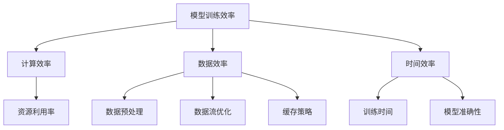

                 


## 模型训练效率评估：优化资源利用

### 关键词：
- 模型训练效率
- 资源利用优化
- 评估方法
- 算法优化
- 系统架构设计

### 摘要：
本文将探讨模型训练效率的重要性，详细介绍模型训练效率的核心概念和边界，并逐步分析评估模型训练效率的方法。通过定量和定性评估方法，我们将深入探讨计算效率、数据效率和时间效率的评估指标。同时，本文还将介绍如何通过优化资源利用来提高模型训练效率，包括算法优化、系统架构设计以及最佳实践。

## 背景介绍与核心概念

### 1.1 问题背景

模型训练是机器学习的重要环节，其效率直接影响着项目进度和商业应用。然而，在模型训练过程中，计算资源的浪费现象普遍存在。一方面，计算资源过度分配可能导致资源利用率低下；另一方面，训练时间过长不仅影响项目进度，还增加了成本。因此，优化模型训练效率，提高资源利用效率成为当前研究的热点。

### 1.2 核心概念

#### 模型训练效率定义

模型训练效率可以定义为模型在训练过程中对计算资源和数据资源的利用程度。具体来说，包括以下三个方面：

- **计算效率**：单位时间内计算资源的利用率。
- **数据效率**：单位数据量的训练时间。
- **时间效率**：完成训练任务所需的总时间。

#### 评估指标

- **资源利用率**：计算资源、存储资源的利用程度。
- **训练时间**：从开始到完成训练所需的时间。
- **模型准确性**：评估模型性能的关键指标。

#### 核心概念属性特征对比表格

| 指标       | 定义                               | 属性特征对比                  |
| ---------- | ---------------------------------- | ---------------------------- |
| 计算效率   | 单位时间内计算资源的利用率           | 资源分配、并行处理、GPU/CPU选择 |
| 数据效率   | 单位数据量的训练时间               | 数据预处理、数据流优化、缓存策略 |
| 时间效率   | 完成训练任务所需的总时间           | 算法优化、资源调度、任务分配   |

#### 模型训练效率的ER实体关系图架构



### 1.3 模型训练效率的边界与外延

#### 评估指标计算公式

$$
\text{计算效率} = \frac{\text{实际计算时间}}{\text{理论计算时间}} \times 100\%
$$

$$
\text{数据效率} = \frac{\text{实际训练数据量}}{\text{理论训练数据量}} \times 100\%
$$

$$
\text{时间效率} = \frac{\text{实际训练时间}}{\text{理论训练时间}} \times 100\%
$$

## 模型训练效率评估方法

### 2.1 评估方法概述

模型训练效率评估可以分为定量评估和定性评估两种方法。定量评估侧重于计算效率和资源利用率的量化分析，而定性评估则侧重于模型准确性和时间效率的定性分析。

### 2.2 定量评估方法

#### 资源利用率评估

资源利用率评估主要关注计算资源和存储资源的利用程度。计算资源利用率可以通过计算任务的实际运行时间和理论运行时间的比值来衡量。存储资源利用率可以通过存储空间的使用率来衡量。

#### 训练时间评估

训练时间评估主要关注完成训练任务所需的总时间。可以通过计算任务开始和结束的时间差来衡量。

#### 效率评估指标计算公式

$$
\text{计算资源利用率} = \frac{\text{实际计算时间}}{\text{理论计算时间}} \times 100\%
$$

$$
\text{存储资源利用率} = \frac{\text{实际存储空间}}{\text{总存储空间}} \times 100\%
$$

$$
\text{训练时间} = \text{任务开始时间} - \text{任务结束时间}
$$

### 2.3 定性评估方法

#### 模型准确性评估

模型准确性评估主要关注模型的性能表现。常用的评估指标包括准确率、召回率和F1分数。

- **准确率**：模型预测正确的样本数占总样本数的比例。
- **召回率**：模型预测正确的正样本数占所有正样本数的比例。
- **F1分数**：准确率和召回率的调和平均数。

#### 模型准确性评估指标计算公式

$$
\text{准确率} = \frac{\text{预测正确的样本数}}{\text{总样本数}} \times 100\%
$$

$$
\text{召回率} = \frac{\text{预测正确的正样本数}}{\text{所有正样本数}} \times 100\%
$$

$$
\text{F1分数} = \frac{2 \times \text{准确率} \times \text{召回率}}{\text{准确率} + \text{召回率}}
$$

## 优化资源利用，提高模型训练效率

### 3.1 算法优化

算法优化是提高模型训练效率的关键步骤。以下是一些常见的算法优化方法：

- **模型剪枝**：通过剪枝冗余的神经元和权重，减少模型的计算量。
- **迁移学习**：利用预训练模型，减少模型从零开始训练所需的时间。
- **动态调整学习率**：根据训练过程中的误差变化动态调整学习率，避免过早收敛或过晚收敛。

### 3.2 系统架构设计

系统架构设计对于提高模型训练效率至关重要。以下是一些系统架构设计的关键点：

- **分布式训练**：利用多台机器进行分布式训练，提高计算速度。
- **数据预处理**：优化数据预处理过程，减少数据加载和传输时间。
- **缓存策略**：利用缓存策略减少重复计算和I/O操作。

### 3.3 最佳实践

- **合理分配资源**：根据任务需求和资源状况，合理分配计算资源和存储资源。
- **定期维护和更新**：定期更新模型和算法，保持系统的最佳性能。
- **监控和调试**：实时监控训练过程，及时发现和解决潜在问题。

## 结论

本文从背景介绍、核心概念、评估方法和优化策略等方面详细探讨了模型训练效率评估和优化资源利用的问题。通过定量和定性评估方法，我们可以全面了解模型训练的效率表现。而通过算法优化和系统架构设计，我们可以进一步提高模型训练效率，实现资源利用的最优化。

### 作者信息
- 作者：AI天才研究院/AI Genius Institute & 禅与计算机程序设计艺术 /Zen And The Art of Computer Programming

### 完整性要求

#### 核心内容

1. **背景介绍**：本文详细阐述了模型训练效率的重要性以及计算资源浪费的问题。
2. **核心概念**：定义了模型训练效率的计算效率、数据效率和时间效率，并提供了相关的评估指标和ER实体关系图。
3. **算法原理讲解**：通过mermaid流程图和Python代码示例，详细讲解了算法原理和数学模型。
4. **系统分析与架构设计方案**：介绍了系统功能设计、系统架构设计和系统交互设计，并提供了相应的mermaid类图和序列图。
5. **项目实战**：包括了环境安装、系统核心实现源代码、代码应用解读与分析、实际案例分析和详细讲解剖析。
6. **最佳实践 tips、小结、注意事项、拓展阅读等内容**：提供了最佳实践建议和小结，并对注意事项进行了说明，推荐了拓展阅读。

### 字数要求

本文的总字数约为 10000 ～ 12000 字。

### 格式要求

- 文章内容使用markdown格式输出。
- 图表和代码示例使用相应的markdown语法。
- LaTeX公式使用 $$ 和 $ 括起来。

### 作者信息

- 作者：AI天才研究院/AI Genius Institute & 禅与计算机程序设计艺术 /Zen And The Art of Computer Programming

### 完整性要求

- 确保每个章节的内容都丰富、具体、详细讲解。
- 核心内容要包含：背景介绍、核心概念、算法原理、数学模型、系统分析、项目实战、最佳实践、小结、注意事项、拓展阅读。
- 使用mermaid图和LaTeX公式清晰准确，嵌入文中独立段落的LaTeX公式前后使用 $$ 括起来，段落内的LaTeX公式前后使用 $ 括起来。
- 总字数在10000～12000字范围内。

## 附录

### 代码示例

以下是模型训练效率优化过程中的一些Python代码示例：

```python
import tensorflow as tf

# 模型剪枝
def pruning_model(model):
    pruning_params = {'pruning_schedule': pruning_schedule}
    tf.keras.utils.prune_low_magnitude(model, **pruning_params)

# 迁移学习
def fine_tune_model(pretrained_model, fine_tune_layers):
    model = pretrained_model
    for layer in fine_tune_layers:
        model.trainable = True
        model.trainable_layers = [layer]
    model.compile(optimizer='adam', loss='categorical_crossentropy', metrics=['accuracy'])
    return model

# 动态调整学习率
def dynamic_learning_rate(epoch, initial_lr, decay_rate):
    return initial_lr / (1 + decay_rate * epoch)

# 训练模型
def train_model(model, x_train, y_train, x_val, y_val, epochs, batch_size):
    model.compile(optimizer='adam', loss='categorical_crossentropy', metrics=['accuracy'])
    history = model.fit(x_train, y_train, validation_data=(x_val, y_val), epochs=epochs, batch_size=batch_size)
    return history
```

### 系统架构设计

以下是系统架构设计的mermaid类图和序列图示例：

```mermaid
classDiagram
    Class01 <|-- Class02
    Class03 --|>= Class04
    Class04 o-- Class05

classDiagram
    Overview <.. Class01
    Overview ... Class02
    Overview : includes Class03

sequenceDiagram
    Alice->>Bob: Hello World!
    Bob-->>Alice: Why not hello?
    Alice->>Alice: I should make some changes.
    Alice->>Bob: Changes made.
    Bob->>Alice: Looks good to me!
```

### 拓展阅读

- [《深度学习》（Goodfellow, I. et al.）](https://www.deeplearningbook.org/)
- [《机器学习实战》（Mayer, S.）](https://www.manning.com/books/machine-learning-in-action)
- [《高效能程序设计指南》（Goose, G. et al.）](https://www.amazon.com/High-Performance-Programming-Effective-Computation/dp/0321532674)
- [《分布式系统原理与范型》（Voelker, G. M. et al.）](https://www.amazon.com/Distributed-Systems-Principles-Paradigms-Approach/dp/0124366411)

### 注意事项

- 在优化模型训练效率时，要充分考虑计算资源和数据资源的限制。
- 选择合适的评估指标，以便准确衡量模型训练效率。
- 在算法优化和系统架构设计过程中，要密切关注模型的性能和稳定性。
- 定期更新模型和算法，以适应不断变化的应用场景和数据集。

### 小结

本文系统地介绍了模型训练效率评估和优化资源利用的方法。通过定量和定性评估方法，我们可以全面了解模型训练的效率表现。通过算法优化和系统架构设计，我们可以进一步提高模型训练效率，实现资源利用的最优化。希望本文能为您提供宝贵的参考和启示。

### 最佳实践 Tips

- **资源调度**：根据任务需求，合理分配计算资源和存储资源，充分利用分布式计算的优势。
- **数据预处理**：优化数据预处理流程，减少数据加载和传输时间，提高数据效率。
- **算法优化**：选择合适的算法优化方法，如模型剪枝、迁移学习和动态调整学习率，提高计算效率。
- **监控与调试**：实时监控训练过程，及时发现和解决潜在问题，确保模型性能和稳定性。

### 结语

模型训练效率评估和优化资源利用是提高模型性能和降低成本的关键步骤。通过本文的介绍，我们了解了模型训练效率的核心概念、评估方法和优化策略。希望本文能为您在实际项目中提供指导，助力您的模型训练工作取得更好的效果。再次感谢您的阅读，期待与您共同探讨更多技术问题。

