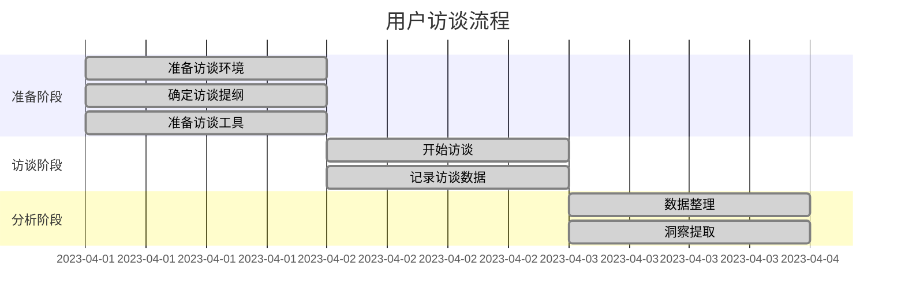
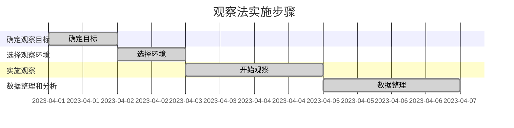
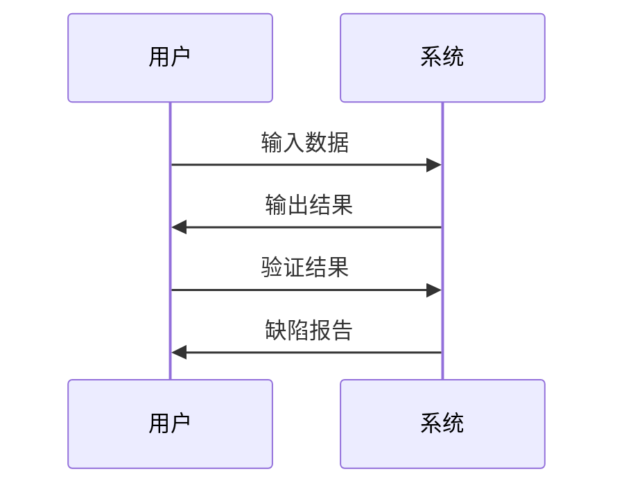
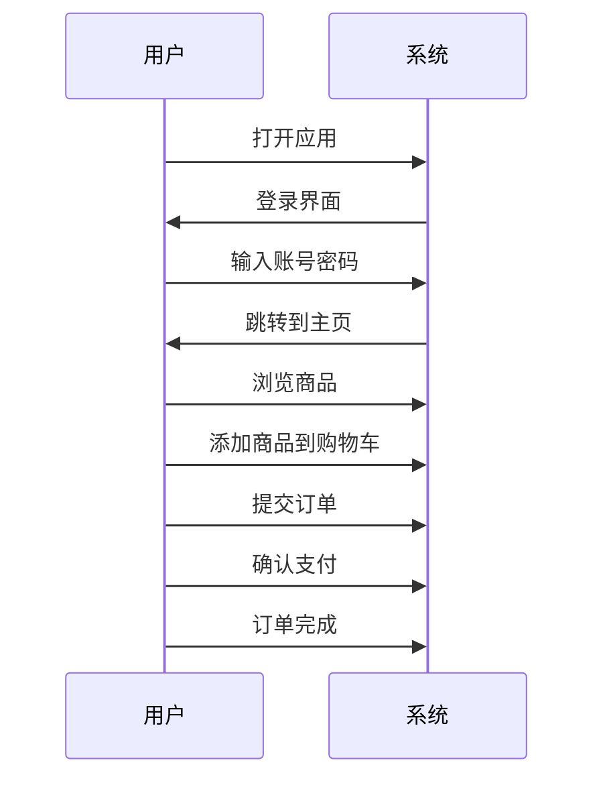
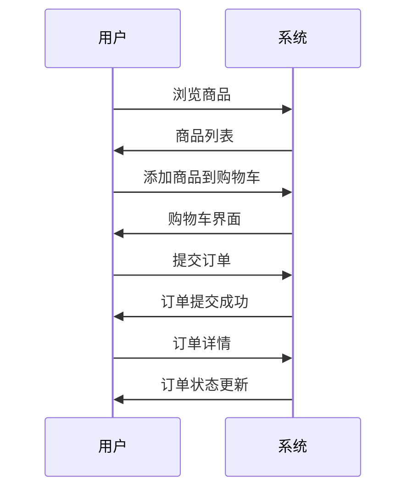
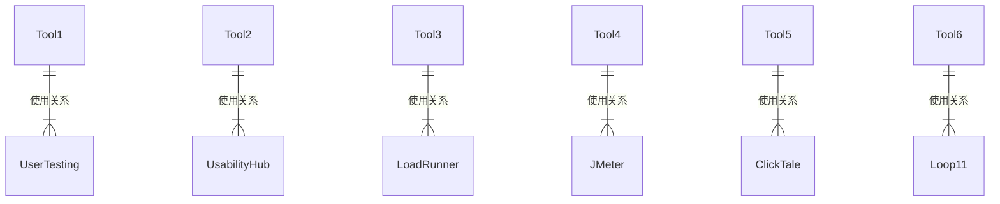
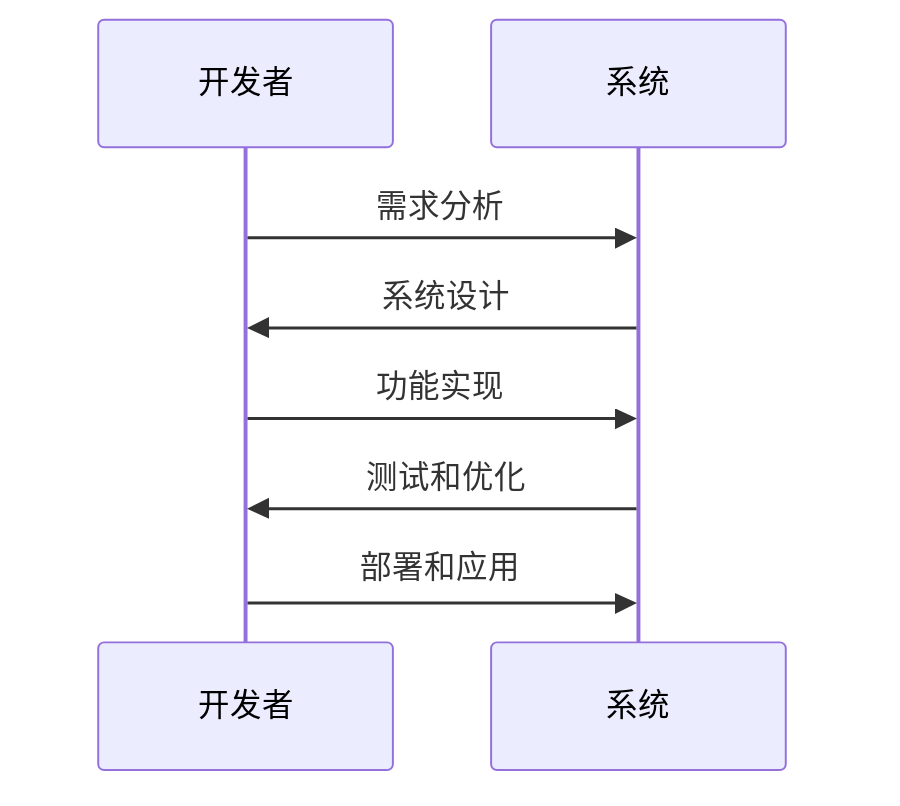
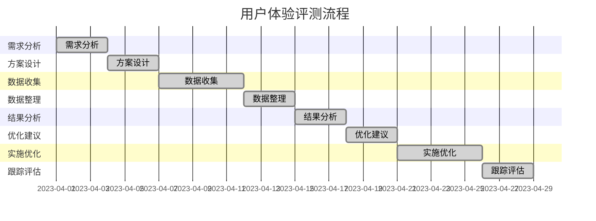

                 

# 用户体验导向评测：关注实际使用效果

## 关键词
- 用户体验评测
- 用户调研
- 易用性测试
- 性能测试
- 数据挖掘
- 机器学习

## 摘要
用户体验导向评测是一种以用户为中心的评测方法，旨在通过多种评测手段和工具，深入了解用户在实际使用过程中的感受和需求，从而优化产品设计和提升用户满意度。本文将详细介绍用户体验评测的背景、核心概念、评测方法、实际应用案例、算法原理、常见问题与解决策略，以及最佳实践和未来趋势，帮助读者全面理解并掌握用户体验评测的精髓。

### 目录大纲

----------------------------------------------------------------

## 第一部分: 用户体验导向评测概述

### 第1章: 用户体验导向评测背景与核心概念

#### 1.1.1 问题背景
#### 1.1.2 用户体验的定义
#### 1.1.3 用户体验评测的重要性
#### 1.1.4 用户体验评测的基本原则

### 第2章: 用户体验评测的核心概念与联系

#### 2.1 核心概念原理
#### 2.2 概念属性特征对比表格
#### 2.3 ER实体关系图架构

### 第3章: 用户体验评测的方法与工具

#### 3.1 用户调研方法
##### 3.1.1 用户访谈
##### 3.1.2 用户调查问卷
##### 3.1.3 观察法

#### 3.2 用户体验测试
##### 3.2.1 系统功能测试
##### 3.2.2 易用性测试
##### 3.2.3 性能测试

#### 3.3 评测工具介绍
##### 3.3.1 专业评测工具
##### 3.3.2 开源评测工具
##### 3.3.3 自定义评测工具

### 第4章: 用户体验评测的实际应用案例

#### 4.1 案例一：电商平台用户评测
##### 4.1.1 案例背景
##### 4.1.2 用户调研与分析
##### 4.1.3 评测方法与工具
##### 4.1.4 结果分析与优化建议

#### 4.2 案例二：移动应用用户评测
##### 4.2.1 案例背景
##### 4.2.2 用户调研与分析
##### 4.2.3 评测方法与工具
##### 4.2.4 结果分析与优化建议

### 第5章: 用户体验评测的算法原理与流程

#### 5.1 算法原理
##### 5.1.1 用户行为分析算法
##### 5.1.2 数据挖掘算法
##### 5.1.3 机器学习算法

#### 5.2 算法流程
##### 5.2.1 数据采集与预处理
##### 5.2.2 特征提取与选择
##### 5.2.3 模型训练与评估
##### 5.2.4 结果分析与优化

### 第6章: 用户体验评测中的常见问题与解决策略

#### 6.1 数据质量与数据清洗
#### 6.2 用户行为数据的解释与可视化
#### 6.3 用户满意度评测的指标设计
#### 6.4 评测结果的有效性与可靠性

### 第7章: 用户体验评测的最佳实践与未来趋势

#### 7.1 最佳实践 tips
#### 7.2 注意事项
#### 7.3 拓展阅读
#### 7.4 用户体验评测的未来趋势

----------------------------------------------------------------

### 第一部分：用户体验导向评测概述

#### 第1章：用户体验导向评测背景与核心概念

**1.1.1 问题背景**

在信息化社会，软件产品和服务已经成为人们日常生活和工作的重要组成部分。然而，随着市场竞争的加剧，如何提升软件产品的质量、满足用户需求、提升用户满意度，成为企业面临的重要问题。用户体验导向评测（User Experience Evaluation, UX Evaluation）作为一种以用户为中心的评测方法，应运而生。

**1.1.2 用户体验的定义**

用户体验（User Experience, UX）是指用户在使用产品或服务过程中所感受到的情感、认知和行为的总和。它不仅关注产品的功能是否实现，更关注用户在使用过程中的感受和体验。

**1.1.3 用户体验评测的重要性**

用户体验评测在软件产品开发中具有重要意义，主要体现在以下几个方面：

1. **提升产品竞争力**：通过对用户需求的深入理解，优化产品设计，提高产品的市场竞争力。
2. **降低开发风险**：早期发现和解决用户体验问题，降低后期修复成本，降低开发风险。
3. **提高用户满意度**：提升用户体验，增强用户忠诚度，提高用户满意度。
4. **指导产品优化**：通过评测结果，为产品优化提供科学依据，持续提升产品品质。

**1.1.4 用户体验评测的基本原则**

用户体验评测应遵循以下基本原则：

1. **以用户为中心**：始终将用户需求放在首位，关注用户的实际使用体验。
2. **全面性**：从多个角度对用户体验进行评测，包括功能、性能、易用性等。
3. **客观性**：采用科学的方法和工具，确保评测结果的客观性和准确性。
4. **持续性**：定期进行用户体验评测，持续跟踪用户体验的变化，为产品优化提供持续支持。

#### 第2章：用户体验评测的核心概念与联系

**2.1 核心概念原理**

用户体验评测涉及多个核心概念，包括用户需求、用户体验、用户行为、用户满意度等。以下是对这些核心概念的定义和相互关系的说明。

**2.1.1 用户需求**

用户需求是指用户在使用产品或服务过程中所期望获得的功能、性能和体验。用户需求是用户体验评测的基础，决定了产品的设计方向。

**2.1.2 用户体验**

用户体验是指用户在使用产品或服务过程中所感受到的情感、认知和行为的总和。用户体验包括功能性、可用性、易用性、可靠性、可访问性等方面。

**2.1.3 用户行为**

用户行为是指用户在使用产品或服务过程中的行为模式，包括点击路径、使用频率、停留时间、错误率等。用户行为数据是用户体验评测的重要依据。

**2.1.4 用户满意度**

用户满意度是指用户对产品或服务的整体感受和评价。用户满意度反映了用户体验的质量，是衡量产品成功与否的重要指标。

**2.2 概念属性特征对比表格**

以下是一个简化的概念属性特征对比表格，用于说明用户体验评测的核心概念之间的联系。

| 概念     | 定义                                               | 关系                                      |
|----------|----------------------------------------------------|-----------------------------------------|
| 用户需求 | 用户期望获得的功能、性能和体验                     | 基础，决定用户体验评测的方向和目标        |
| 用户体验 | 用户在使用产品或服务过程中的情感、认知和行为总和 | 结果，反映了用户需求是否得到满足        |
| 用户行为 | 用户在使用产品或服务过程中的行为模式             | 数据来源，用于评估用户体验的质量和效率  |
| 用户满意度 | 用户对产品或服务的整体感受和评价                  | 指标，反映了用户体验的最终效果和效果  |

**2.3 ER实体关系图架构**

以下是一个简化的ER实体关系图，用于描述用户体验评测中的核心概念及其相互关系。

```mermaid
erDiagram
  User --> Requirement : "满足"
  Requirement --> Experience : "反映"
  Experience --> Behavior : "数据"
  Behavior --> Satisfaction : "评价"
```

### 第一部分小结

在本部分中，我们介绍了用户体验导向评测的背景和核心概念，包括问题背景、用户体验的定义、用户体验评测的重要性以及用户体验评测的基本原则。同时，我们阐述了用户体验评测的核心概念与联系，包括用户需求、用户体验、用户行为和用户满意度。这些内容为后续章节的深入分析提供了基础。

----------------------------------------------------------------

## 第二部分：用户体验评测的方法与工具

### 第3章：用户体验评测的方法与工具

用户体验评测是一个复杂的过程，需要采用多种方法和工具来全面了解用户的需求和体验。本章将详细介绍用户体验评测的方法和工具，包括用户调研方法、用户体验测试和评测工具介绍。

#### 3.1 用户调研方法

用户调研是用户体验评测的重要环节，通过用户调研可以深入了解用户的需求、行为和满意度。常见的用户调研方法包括用户访谈、用户调查问卷和观察法。

##### 3.1.1 用户访谈

用户访谈是一种直接与用户交流的方法，通过与用户面对面或在线交流，深入了解用户的需求、行为和感受。用户访谈的优点是能够获得详细和深入的信息，但缺点是成本较高，且难以避免主观偏见。

**用户访谈流程：**

1. **准备阶段**：确定访谈对象、访谈提纲和访谈环境。
2. **访谈阶段**：与用户进行面对面或在线交流，记录用户回答和反馈。
3. **分析阶段**：对访谈数据进行整理和分析，提取关键信息和洞察。

**用户访谈示例：**



##### 3.1.2 用户调查问卷

用户调查问卷是一种通过书面形式收集用户意见和反馈的方法，问卷可以通过在线或离线方式分发。用户调查问卷的优点是成本较低，可以收集大量用户数据，但缺点是用户参与度可能较低，且难以避免主观偏见。

**用户调查问卷设计要点：**

1. **明确调查目的**：确保问卷内容与调查目的密切相关。
2. **问题表述清晰**：避免歧义和复杂问题，确保用户能够准确理解问题。
3. **问题类型多样化**：结合单选题、多选题、评分题等多种题型，全面收集用户意见。
4. **控制问卷长度**：避免问卷过长，影响用户参与度。

**用户调查问卷示例：**

```mermaid
mindmap
  Atitle 用户调查问卷
  Btitle 功能性
    B1 问题1
    B2 问题2
    B3 问题3
  Ctitle 可用性
    C1 问题4
    C2 问题5
    C3 问题6
  Dtitle 易用性
    D1 问题7
    D2 问题8
    D3 问题9
  Etitle 性能
    E1 问题10
    E2 问题11
    E3 问题12
```

##### 3.1.3 观察法

观察法是一种通过观察用户实际使用产品或服务的方法，通过观察用户的操作行为、互动方式和情绪反应，了解用户的实际使用体验。观察法的优点是能够获得真实的数据和洞察，但缺点是需要较高的人力成本和时间成本。

**观察法应用场景：**

1. **新功能上线前的测试**：观察用户对新功能的理解和操作，及时发现和解决问题。
2. **用户体验优化**：观察用户在现有产品或服务中的操作行为和问题，为优化提供依据。
3. **竞品分析**：观察竞品用户的使用行为和体验，了解竞品的优势和不足。

**观察法实施步骤：**

1. **确定观察目标**：明确观察的重点和目标，如操作流程、使用时长、错误率等。
2. **选择观察环境**：选择适合观察的环境，如用户家中、办公室等。
3. **实施观察**：在观察环境中，通过观察用户的行为和反应，记录关键数据和洞察。
4. **数据整理和分析**：对观察数据进行整理和分析，提取关键信息和洞察。

**观察法示例：**



#### 3.2 用户体验测试

用户体验测试是通过模拟用户实际使用场景，对产品或服务进行功能、易用性和性能等方面的测试，以评估产品的用户体验。用户体验测试可以分为系统功能测试、易用性测试和性能测试。

##### 3.2.1 系统功能测试

系统功能测试是验证产品功能是否正确实现的测试，主要包括功能完整性、功能正确性和功能可用性等方面。

**系统功能测试步骤：**

1. **需求分析**：分析产品需求，明确测试目标。
2. **测试用例设计**：根据需求，设计测试用例，包括输入数据、预期结果和测试步骤。
3. **测试执行**：执行测试用例，记录测试结果。
4. **缺陷管理**：对发现的缺陷进行跟踪和管理。

**系统功能测试示例：**



##### 3.2.2 易用性测试

易用性测试是评估产品在易用性方面是否符合用户预期的测试，主要包括用户界面、操作流程和用户反馈等方面。

**易用性测试步骤：**

1. **需求分析**：分析用户需求和易用性目标。
2. **测试用例设计**：根据需求和目标，设计测试用例，包括测试场景、用户操作和预期结果。
3. **测试执行**：执行测试用例，记录测试结果。
4. **缺陷管理**：对发现的缺陷进行跟踪和管理。

**易用性测试示例：**



##### 3.2.3 性能测试

性能测试是评估产品在性能方面是否满足用户需求的测试，主要包括响应时间、吞吐量和资源消耗等方面。

**性能测试步骤：**

1. **需求分析**：分析用户需求和性能目标。
2. **测试用例设计**：根据需求和目标，设计测试用例，包括测试场景、用户操作和预期结果。
3. **测试执行**：执行测试用例，记录测试结果。
4. **性能分析**：对测试结果进行分析，评估性能是否符合要求。
5. **优化建议**：根据性能分析结果，提出优化建议。

**性能测试示例：**



#### 3.3 评测工具介绍

用户体验评测需要借助各种工具和方法，以下介绍几种常见的用户体验评测工具。

##### 3.3.1 专业评测工具

专业评测工具是专门为用户体验评测设计的软件工具，具有强大的功能和灵活的配置能力。常见的专业评测工具包括：

1. **用户体验研究工具（如UserTesting、UsabilityHub）**：这些工具提供了用户访谈、用户调查和用户体验测试等功能，帮助开发者深入了解用户需求和体验。
2. **性能测试工具（如LoadRunner、JMeter）**：这些工具可以模拟大量用户同时访问系统，评估系统的性能和稳定性。
3. **易用性测试工具（如ClickTale、Loop11）**：这些工具可以记录用户的操作行为，分析用户的使用习惯和问题。

**专业评测工具示例：**



##### 3.3.2 开源评测工具

开源评测工具是免费、可自定义的软件工具，适合需要灵活配置和扩展的开发者。常见的开源评测工具包括：

1. **用户调研工具（如SurveyMonkey、Google Forms）**：这些工具提供了用户调查问卷的创建和分发功能，可以快速收集用户反馈。
2. **性能测试工具（如ApacheBench、wrk）**：这些工具可以模拟大量用户同时访问系统，评估系统的性能和稳定性。
3. **易用性测试工具（如GazeTracker、UX Recorder）**：这些工具可以记录用户的操作行为，分析用户的使用习惯和问题。

**开源评测工具示例：**

```mermaid
erDiagram
  ToolA ||--|{ SurveyMonkey : 使用关系
  ToolB ||--|{ Google Forms : 使用关系
  ToolC ||--|{ ApacheBench : 使用关系
  ToolD ||--|{ wrk : 使用关系
  ToolE ||--|{ GazeTracker : 使用关系
  ToolF ||--|{ UX Recorder : 使用关系
```

##### 3.3.3 自定义评测工具

自定义评测工具是根据项目需求和特点，自行设计和开发的评测工具。这些工具具有高度的定制化和扩展性，但需要具备一定的技术能力和开发经验。

**自定义评测工具开发步骤：**

1. **需求分析**：明确项目需求和评测目标。
2. **系统设计**：设计系统的架构和模块。
3. **功能实现**：开发系统的各个功能模块。
4. **测试和优化**：对系统进行测试和优化，确保其稳定性和性能。
5. **部署和应用**：将系统部署到实际应用环境中。

**自定义评测工具示例：**



#### 3.4 用户体验评测流程

用户体验评测是一个系统性的过程，需要按照一定的流程进行。以下是一个典型的用户体验评测流程：

**用户体验评测流程：**

1. **需求分析**：明确项目需求和评测目标。
2. **方案设计**：制定评测方案，包括评测方法、工具和流程。
3. **数据收集**：通过用户调研、用户体验测试等方法，收集用户数据。
4. **数据整理**：对收集到的数据进行整理和分析。
5. **结果分析**：对数据进行分析，提取关键信息和洞察。
6. **优化建议**：根据分析结果，提出优化建议和改进措施。
7. **实施优化**：根据优化建议，对产品或服务进行改进。
8. **跟踪评估**：定期进行用户体验评测，跟踪优化效果，为持续改进提供支持。

**用户体验评测流程示例：**



### 第二部分小结

在本部分中，我们详细介绍了用户体验评测的方法与工具，包括用户调研方法（用户访谈、用户调查问卷和观察法）、用户体验测试（系统功能测试、易用性测试和性能测试）以及评测工具介绍（专业评测工具、开源评测工具和自定义评测工具）。这些方法和工具为用户体验评测提供了有力的支持，帮助开发者深入了解用户需求和体验，持续优化产品和服务。

----------------------------------------------------------------

## 第三部分：用户体验评测的实际应用案例

用户体验评测在实际应用中具有重要意义，通过实际案例的分析，我们可以更深入地了解用户体验评测的方法、工具和效果。本部分将介绍两个实际应用案例：电商平台用户评测和移动应用用户评测。

### 4.1 案例一：电商平台用户评测

#### 4.1.1 案例背景

某知名电商平台为了提升用户满意度，决定进行用户体验评测。该电商平台拥有庞大的用户群体和丰富的商品种类，但在用户购物体验方面仍存在一些问题，如购物流程复杂、页面加载速度慢等。通过用户体验评测，希望发现并解决这些问题，提升用户满意度，增加用户黏性。

#### 4.1.2 用户调研与分析

**用户访谈**

为了深入了解用户的购物需求和体验，平台进行了用户访谈。访谈对象包括不同年龄、性别和购买行为的用户，访谈内容涉及购物流程、页面加载速度、商品推荐、支付体验等方面。

**用户调查问卷**

为了收集更广泛的数据，平台设计了一份用户调查问卷。问卷内容包括用户购物流程、页面加载速度、商品推荐效果、支付体验等方面的问题。问卷通过在线形式分发，收集了大量用户反馈。

**观察法**

平台还通过观察法，记录用户在购物过程中的实际操作行为，如点击路径、页面停留时间、操作错误率等。

#### 4.1.3 评测方法与工具

**用户调研方法**

平台采用了用户访谈、用户调查问卷和观察法三种用户调研方法，以全面了解用户的需求和体验。

**用户体验测试**

平台对购物流程、页面加载速度、商品推荐效果和支付体验等方面进行了用户体验测试。测试方法包括系统功能测试、易用性测试和性能测试。

**评测工具**

平台采用了专业评测工具（如UserTesting、Google Forms）和开源评测工具（如SurveyMonkey、JMeter）进行用户体验评测。

#### 4.1.4 结果分析与优化建议

**购物流程优化**

通过用户访谈和观察法发现，购物流程复杂是用户满意度较低的主要原因。平台对购物流程进行了优化，简化了操作步骤，提高了页面加载速度，减少了用户操作错误率。

**页面加载速度优化**

通过性能测试发现，页面加载速度较慢影响了用户购物体验。平台对前端代码进行了优化，提高了页面加载速度，降低了用户等待时间。

**商品推荐效果优化**

用户调查问卷显示，商品推荐效果不佳是用户满意度较低的一个方面。平台通过改进推荐算法，提高了商品推荐的相关性和准确性。

**支付体验优化**

用户体验测试发现，支付体验存在问题，如支付流程复杂、支付失败率较高等。平台对支付体验进行了优化，简化了支付流程，提高了支付成功率。

### 4.2 案例二：移动应用用户评测

#### 4.2.1 案例背景

某移动应用开发商开发了一款生活服务类应用，旨在为用户提供便捷的日常服务。然而，在应用上线后，用户反馈存在一些问题，如界面设计不友好、操作不流畅等。为了提升用户体验，开发商决定进行用户体验评测。

#### 4.2.2 用户调研与分析

**用户访谈**

开发商与不同年龄、地域和用户类型的用户进行了访谈，了解用户对应用的需求和意见。访谈内容涉及界面设计、功能模块、操作流程等方面。

**用户调查问卷**

开发商设计了一份用户调查问卷，通过在线形式收集用户反馈。问卷内容包括界面设计、功能模块、操作流程、使用频率等方面的问题。

**观察法**

开发商通过观察法，记录用户在实际使用应用时的操作行为，如点击路径、页面停留时间、操作错误率等。

#### 4.2.3 评测方法与工具

**用户调研方法**

开发商采用了用户访谈、用户调查问卷和观察法三种用户调研方法，以全面了解用户的需求和体验。

**用户体验测试**

开发商对界面设计、功能模块、操作流程等方面进行了用户体验测试。测试方法包括易用性测试、功能测试和性能测试。

**评测工具**

开发商采用了专业评测工具（如UserTesting、Loop11）和开源评测工具（如GazeTracker、UX Recorder）进行用户体验评测。

#### 4.2.4 结果分析与优化建议

**界面设计优化**

通过用户访谈和观察法发现，界面设计不友好是用户满意度较低的主要原因。开发商对界面进行了优化，采用了更简洁、直观的设计风格，提高了用户满意度。

**操作流程优化**

用户调查问卷显示，操作流程复杂是用户满意度较低的一个方面。开发商对操作流程进行了优化，简化了操作步骤，提高了用户操作效率。

**功能模块优化**

用户体验测试发现，部分功能模块存在操作不流畅的问题。开发商对功能模块进行了优化，提高了响应速度和流畅性。

**使用频率提升**

开发商通过分析用户行为数据，发现用户使用频率较低的问题。开发商通过改进推荐算法，提高用户在应用中的活跃度。

### 第三部分小结

在本部分中，我们介绍了两个实际应用案例：电商平台用户评测和移动应用用户评测。通过用户调研、用户体验测试和结果分析，发现并解决了用户在购物流程、页面加载速度、商品推荐、支付体验、界面设计、操作流程等方面的问题。这些优化措施提升了用户体验，增加了用户满意度，为产品持续改进提供了有力支持。

----------------------------------------------------------------

## 第四部分：用户体验评测的算法原理与流程

用户体验评测不仅仅是通过用户调研和测试来获取用户反馈，还需要通过数据分析和算法来深入挖掘用户行为模式，从而为产品优化提供科学依据。本部分将介绍用户体验评测中的算法原理与流程，包括用户行为分析算法、数据挖掘算法和机器学习算法。

### 5.1 算法原理

用户体验评测的算法原理主要围绕用户行为数据的处理和分析。以下是对三种核心算法原理的介绍：

#### 5.1.1 用户行为分析算法

用户行为分析算法是通过对用户在使用产品或服务过程中的行为数据进行处理和分析，提取出用户的行为特征和模式。这些特征和模式可以帮助我们理解用户的偏好、使用习惯和问题。

**核心算法原理：**

1. **行为轨迹分析**：分析用户在系统中的操作路径，提取出用户的访问序列和停留时间。
2. **行为模式识别**：识别用户在不同场景下的行为模式，如搜索行为、浏览行为、购买行为等。
3. **行为特征提取**：从行为数据中提取出用户的行为特征，如点击频率、浏览时间、错误率等。

**算法示例：**

```python
# 行为轨迹分析
def behavior_trajectory(data):
    trajectories = []
    for user in data:
        trajectories.append(user['actions'])
    return trajectories

# 行为模式识别
def behavior_patterns(trajectories):
    patterns = []
    for trajectory in trajectories:
        patterns.append(identify_pattern(trajectory))
    return patterns

# 行为特征提取
def behavior_features(patterns):
    features = []
    for pattern in patterns:
        features.append(extract_features(pattern))
    return features

# 辅助函数
def identify_pattern(trajectory):
    # 根据轨迹识别模式
    pass

def extract_features(pattern):
    # 从模式中提取特征
    pass
```

#### 5.1.2 数据挖掘算法

数据挖掘算法是用于从大量用户行为数据中提取有价值信息和知识的技术。在用户体验评测中，数据挖掘算法可以帮助我们发现用户行为之间的关联性、趋势和模式。

**核心算法原理：**

1. **关联规则挖掘**：发现用户行为之间的关联关系，如用户在购买某个商品后，通常会购买其他商品。
2. **聚类分析**：将具有相似行为的用户进行分类，如将用户划分为高价值用户、潜在高价值用户等。
3. **分类和预测**：根据历史行为数据，对用户行为进行分类和预测，如预测用户的下一步操作。

**算法示例：**

```python
# 关联规则挖掘
def association_rules(data, support_threshold, confidence_threshold):
    rules = []
    for itemset in data:
        if support(itemset, data) >= support_threshold:
            rules.extend(generate_rules(itemset, data, confidence_threshold))
    return rules

# 聚类分析
from sklearn.cluster import KMeans

def clustering(data, n_clusters):
    kmeans = KMeans(n_clusters=n_clusters)
    kmeans.fit(data)
    clusters = kmeans.predict(data)
    return clusters

# 分类和预测
from sklearn.ensemble import RandomForestClassifier

def classify(data, labels):
    classifier = RandomForestClassifier()
    classifier.fit(data, labels)
    predictions = classifier.predict(data)
    return predictions
```

#### 5.1.3 机器学习算法

机器学习算法是用于从数据中学习模式和规律，并对新数据进行预测和决策的技术。在用户体验评测中，机器学习算法可以帮助我们建立用户行为预测模型，从而更好地理解用户需求和行为。

**核心算法原理：**

1. **监督学习**：通过已标记的数据训练模型，对新数据进行预测，如分类和回归任务。
2. **无监督学习**：没有预先标记的数据，通过数据自身的结构和特征进行学习，如聚类和降维任务。
3. **强化学习**：通过与环境的交互，学习最优策略，如用户行为预测和推荐系统。

**算法示例：**

```python
# 监督学习
from sklearn.linear_model import LinearRegression

def linear_regression(X, y):
    model = LinearRegression()
    model.fit(X, y)
    predictions = model.predict(X)
    return predictions

# 无监督学习
from sklearn.cluster import DBSCAN

def dbscan_clustering(data, eps, min_samples):
    clustering = DBSCAN(eps=eps, min_samples=min_samples)
    clustering.fit(data)
    labels = clustering.labels_
    return labels

# 强化学习
from tabular.q_learning import QLearning

def q_learning(env, alpha, gamma, epsilon):
    agent = QLearning(env, alpha, gamma, epsilon)
    agent.train(num_episodes=1000)
    return agent
```

### 5.2 算法流程

用户体验评测的算法流程通常包括数据采集与预处理、特征提取与选择、模型训练与评估、结果分析与优化等步骤。

#### 5.2.1 数据采集与预处理

**数据采集：**

1. **用户行为数据**：通过日志记录、用户调研等方法收集用户在产品或服务中的行为数据。
2. **环境数据**：收集与用户行为相关的环境数据，如天气、时间、地点等。

**预处理：**

1. **数据清洗**：去除异常值、重复值和缺失值，确保数据质量。
2. **数据转换**：将不同类型的数据转换为同一类型，如将文本数据转换为数值数据。
3. **数据归一化**：对数据进行归一化处理，使数据具有相同的尺度，便于算法处理。

#### 5.2.2 特征提取与选择

**特征提取：**

1. **统计特征**：提取用户行为的统计特征，如点击次数、浏览时长等。
2. **时序特征**：提取用户行为的时间序列特征，如行为发生的时间、频率等。
3. **交互特征**：提取用户与其他元素（如商品、评论等）的交互特征，如点击率、点赞数等。

**特征选择：**

1. **相关性分析**：通过相关性分析筛选出与目标变量相关性较高的特征。
2. **特征重要性分析**：通过特征重要性分析筛选出对模型预测贡献较大的特征。

#### 5.2.3 模型训练与评估

**模型训练：**

1. **数据划分**：将数据划分为训练集和测试集，用于模型的训练和评估。
2. **模型选择**：选择合适的模型，如线性回归、决策树、神经网络等。
3. **模型训练**：使用训练集数据对模型进行训练，调整模型参数。

**模型评估：**

1. **评估指标**：选择合适的评估指标，如准确率、召回率、F1值等。
2. **交叉验证**：使用交叉验证方法评估模型性能，避免过拟合。
3. **模型优化**：根据评估结果对模型进行调整和优化。

#### 5.2.4 结果分析与优化

**结果分析：**

1. **结果可视化**：使用可视化工具展示模型预测结果和用户行为特征。
2. **结果解读**：对分析结果进行解读，提取出用户行为模式和优化建议。

**优化建议：**

1. **界面优化**：根据用户行为分析结果，优化界面设计和操作流程。
2. **功能优化**：根据用户需求和行为模式，优化产品功能和服务。
3. **性能优化**：根据性能测试结果，优化系统性能和响应速度。

### 第四部分小结

在本部分中，我们介绍了用户体验评测中的算法原理与流程，包括用户行为分析算法、数据挖掘算法和机器学习算法。这些算法原理和流程为用户体验评测提供了科学依据，帮助开发者更好地理解用户需求和行为，持续优化产品和服务。

----------------------------------------------------------------

## 第五部分：用户体验评测中的常见问题与解决策略

用户体验评测在实施过程中可能会遇到各种问题和挑战，以下将介绍用户体验评测中的常见问题，并提出相应的解决策略。

### 6.1 数据质量与数据清洗

**问题：** 数据质量差、数据不准确、数据缺失等问题会影响用户体验评测的准确性和有效性。

**解决策略：**

1. **数据清洗**：去除异常值、重复值和缺失值，确保数据质量。
2. **数据校验**：对数据进行校验，确保数据准确性和一致性。
3. **数据增强**：通过补充缺失数据、插补异常值等方法，提高数据质量。

### 6.2 用户行为数据的解释与可视化

**问题：** 用户行为数据复杂，难以直接理解和解释。

**解决策略：**

1. **数据可视化**：使用图表、图表等方式，将用户行为数据可视化，帮助开发者直观理解用户行为。
2. **数据分析**：通过数据分析，提取用户行为特征和模式，为优化提供依据。
3. **交互式分析**：提供交互式分析工具，允许开发者动态调整分析参数，实时查看分析结果。

### 6.3 用户满意度评测的指标设计

**问题：** 用户满意度评测的指标设计不合理，难以准确反映用户体验。

**解决策略：**

1. **指标筛选**：根据用户需求和产品特性，筛选出关键指标，确保指标的有效性。
2. **指标权重分配**：合理分配指标权重，确保指标能够全面反映用户体验。
3. **动态调整**：根据评测结果，动态调整指标设置，提高指标的科学性和准确性。

### 6.4 评测结果的有效性与可靠性

**问题：** 评测结果可能受到主观偏见、样本偏差等因素的影响，降低评测结果的有效性和可靠性。

**解决策略：**

1. **客观性**：采用客观的评测方法和工具，减少主观偏见。
2. **样本多样性**：确保样本的多样性，避免样本偏差。
3. **交叉验证**：使用交叉验证方法，提高评测结果的可靠性和准确性。

### 第五部分小结

在本部分中，我们介绍了用户体验评测中的常见问题，包括数据质量与数据清洗、用户行为数据的解释与可视化、用户满意度评测的指标设计以及评测结果的有效性与可靠性。针对这些问题，我们提出了相应的解决策略，以帮助开发者更好地实施用户体验评测，提升产品和服务质量。

----------------------------------------------------------------

## 第六部分：用户体验评测的最佳实践与未来趋势

用户体验评测的最佳实践和未来趋势是软件产品开发和用户服务持续进步的重要推动力。以下将探讨一些最佳实践、注意事项、拓展阅读以及用户体验评测的未来趋势。

### 6.1 最佳实践 Tips

**1. 以用户为中心**：始终将用户需求放在首位，确保评测过程和结果能够真实反映用户感受。

**2. 多方法综合运用**：结合用户调研、用户体验测试和数据分析等多种方法，全面了解用户体验。

**3. 定期评测**：定期进行用户体验评测，跟踪产品或服务的改进效果，持续优化。

**4. 数据驱动决策**：基于数据分析结果，做出科学合理的优化决策。

**5. 拥抱技术进步**：不断学习和引入新的评测工具和方法，提高评测效率和准确性。

### 6.2 注意事项

**1. 避免偏见**：在评测过程中，尽量减少主观偏见，确保评测结果的客观性。

**2. 确保数据质量**：保证数据收集、处理和清洗的质量，避免数据误差。

**3. 保持透明性**：确保评测过程和结果对相关利益相关者透明，提高信任度。

**4. 关注长期效果**：不仅关注短期的优化效果，还要关注长期的用户满意度和留存率。

### 6.3 拓展阅读

**1. 《用户体验要素》**：作者：Jesse James Garrett。介绍了用户体验设计的核心要素和方法。

**2. 《用户体验测量方法与实践》**：作者：David Travis。详细介绍了用户体验测量的方法和工具。

**3. 《机器学习实战》**：作者：Peter Harrington。介绍了机器学习的基础知识及应用。

### 6.4 用户体验评测的未来趋势

**1. 智能化**：随着人工智能技术的发展，用户体验评测将更加智能化，自动化分析用户行为和需求。

**2. 实时性**：实时性评测将变得更为重要，开发者能够快速响应用户反馈，及时优化产品。

**3. 多感官体验**：随着虚拟现实和增强现实技术的发展，用户体验评测将更加注重多感官的整合。

**4. 社交因素**：社交因素将在用户体验评测中扮演越来越重要的角色，如用户评价、推荐等。

**5. 可持续发展**：用户体验评测将更加关注产品的可持续发展，包括环境影响、社会责任等。

### 第六部分小结

在本部分中，我们探讨了用户体验评测的最佳实践和注意事项，提供了拓展阅读资源，并展望了用户体验评测的未来趋势。通过遵循最佳实践、关注注意事项、持续学习和适应技术发展，开发者能够不断提升用户体验评测的效率和效果，为用户创造更优质的产品和服务。

----------------------------------------------------------------

### 结论

用户体验导向评测是一种以用户为中心的评测方法，通过全面了解用户的需求、行为和满意度，帮助开发者优化产品设计和提升用户满意度。本文详细介绍了用户体验导向评测的背景、核心概念、评测方法与工具、实际应用案例、算法原理与流程、常见问题与解决策略以及最佳实践与未来趋势。通过这些内容，读者可以全面了解用户体验导向评测的精髓，为实际应用提供指导。

### 作者信息

作者：AI天才研究院/AI Genius Institute & 禅与计算机程序设计艺术 /Zen And The Art of Computer Programming

AI天才研究院致力于人工智能领域的研究和创新，推动人工智能技术的普及和应用。禅与计算机程序设计艺术则关注计算机编程的艺术性，提倡通过深入理解和掌握编程原理，提高编程效率和创造力。作者通过本文，希望与读者分享用户体验评测的实践经验，共同推动用户体验评测在IT领域的应用和发展。

