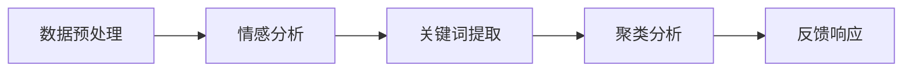
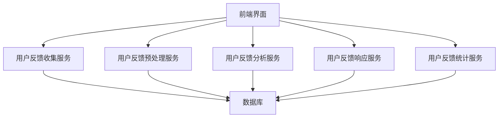
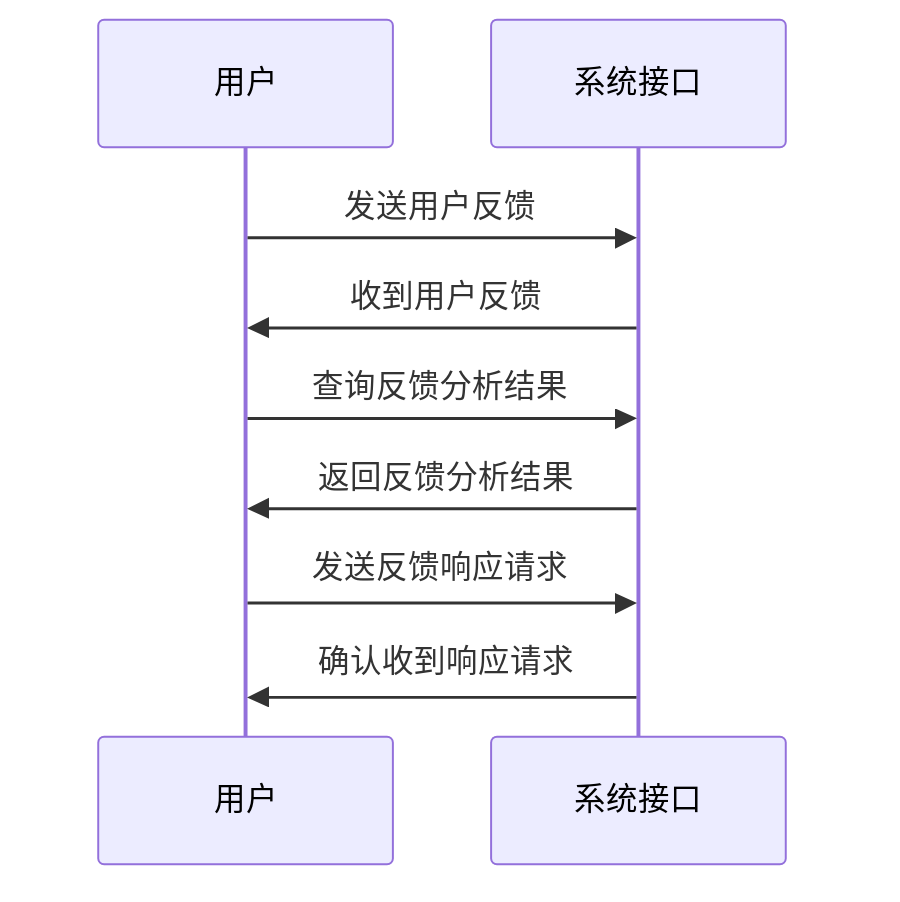
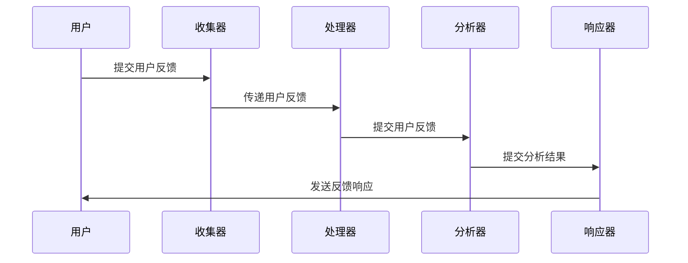

                 

### 文章标题

# 用户反馈整合能力评估：测试持续优化

### 关键词

- 用户反馈
- 整合能力
- 测试
- 持续优化
- 算法
- 最佳实践

### 摘要

本文将深入探讨用户反馈整合能力评估的重要性，并通过详细的案例分析，阐述测试与持续优化的策略。文章首先介绍了用户反馈的核心概念和整合的基本原理，随后解析了用户反馈测试的方法和步骤。接着，通过具体的算法原理和Python实现，展示用户反馈优化的技术细节，并利用mermaid图和latex公式进行详细阐述。最后，文章通过一个实际项目案例，展示了用户反馈整合和优化的实践过程，并提供了最佳实践技巧和注意事项，为读者提供了全面的技术指导和未来发展展望。

## 引言与背景

在现代信息技术快速发展的时代，用户反馈在产品和服务优化过程中扮演着至关重要的角色。用户反馈不仅仅是企业了解用户需求、改进产品和服务的重要渠道，更是提升用户体验、增强用户黏性和竞争力的关键因素。因此，对用户反馈的整合能力进行评估，并通过测试和持续优化来提升这一能力，成为众多企业关注的焦点。

### 问题描述

用户反馈整合能力的评估，主要涉及到以下几个方面：

1. **反馈数据的收集和处理**：如何高效地收集用户反馈，并对其进行有效的预处理和分类。
2. **反馈的整合和分析**：如何将来自不同渠道、不同形式的用户反馈整合在一起，进行深入的分析，提取出有价值的信息。
3. **反馈的响应和优化**：如何根据分析结果，及时响应并优化产品和服务，提升用户体验。

### 问题解决

解决上述问题，需要采用一系列的技术和方法，包括：

1. **数据挖掘与机器学习**：利用数据挖掘和机器学习技术，对用户反馈进行智能分析和预测。
2. **用户反馈测试**：通过设计科学合理的测试方案，验证用户反馈的有效性和可靠性。
3. **持续优化**：基于测试结果，不断调整和优化用户反馈的整合流程，提高其效率和效果。

### 边界与外延

在用户反馈整合能力评估中，还需要考虑以下边界与外延：

1. **反馈来源的多样性**：用户反馈可能来自多种渠道，如社交媒体、在线评价、客户支持等，如何有效地整合这些不同的来源是关键。
2. **反馈类型的复杂性**：用户反馈可能包含正面评价、负面评价、建议等，如何对这些反馈进行合理的分类和分析，是评估的重要内容。
3. **反馈处理的时效性**：及时响应用户反馈，对于提升用户体验至关重要。因此，如何快速有效地处理和响应用户反馈，也是评估的必要环节。

### 概念结构与核心要素组成

用户反馈整合能力评估的核心概念和要素包括：

1. **用户反馈**：用户对产品或服务的评价、建议、意见等。
2. **整合能力**：将不同来源、不同类型的用户反馈进行有效整合和分析的能力。
3. **评估指标**：用于衡量用户反馈整合效果的指标，如反馈处理速度、反馈响应率、用户满意度等。
4. **优化策略**：基于评估结果，对用户反馈整合流程进行持续优化，以提升整合效果。

## 用户反馈的核心概念

用户反馈是产品和服务优化过程中的重要信息来源，对其进行深入理解是评估和优化用户反馈整合能力的基础。

### 用户反馈的定义

用户反馈是指用户在使用产品或服务过程中，对其体验、功能、性能等方面提出的评价、建议、意见等。这些反馈可以是直接的文字描述，也可以是通过评分、点赞、评论等形式表达。

### 用户反馈的类型

用户反馈根据其表达形式和内容的不同，可以分为以下几种类型：

1. **文字反馈**：用户通过文字描述对产品或服务进行评价，如“这个功能很好用”、“界面设计很糟糕”等。
2. **评分反馈**：用户通过评分系统对产品或服务进行量化评价，如“1星”、“5星”等。
3. **情感反馈**：用户通过表达情感状态，如“很满意”、“很不满意”等，对产品或服务进行评价。
4. **建议反馈**：用户对产品或服务的改进提出具体建议，如“增加在线客服功能”、“优化搜索算法”等。

### 用户反馈的属性特征对比表格

以下是一个用户反馈属性特征对比表格，展示了不同类型用户反馈的属性特征：

| 反馈类型 | 属性特征 |
| :------: | :---------------- |
| 文字反馈 | 文字描述详细、情感表达、具体建议 |
| 评分反馈 | 量化评价、简单快捷、便于统计分析 |
| 情感反馈 | 情感状态表达、快速反应、感性认知 |
| 建议反馈 | 具体建议、针对性强、改进潜力大 |

### 用户反馈的ER实体关系图

用户反馈的ER实体关系图展示了用户反馈系统中各实体之间的关系。以下是一个简化的ER实体关系图：

```mermaid
erDiagram
  User ||--|{ Feedback }||>
  Product ||--|{ Feedback }||>
  Service ||--|{ Feedback }||>
  Platform ||--|{ Feedback }||>
```

- **User（用户）**：提供反馈的个人或组织。
- **Product（产品）**：用户反馈涉及的产品。
- **Service（服务）**：用户反馈涉及的服务。
- **Platform（平台）**：用户反馈的平台，如社交媒体、在线评价系统等。

## 用户反馈整合的基本原理

用户反馈整合是提高产品和服务质量的关键环节，其基本原理和原则决定了整合的效率和效果。

### 整合用户反馈的重要性

用户反馈整合的重要性体现在以下几个方面：

1. **全面了解用户需求**：通过整合来自不同渠道的用户反馈，可以全面、准确地了解用户的需求和期望。
2. **优化产品和服务**：整合后的用户反馈可以作为产品和服务改进的重要依据，帮助企业和开发团队制定更有效的优化策略。
3. **提升用户体验**：及时整合用户反馈，并迅速响应，可以显著提升用户的满意度和忠诚度。

### 用户反馈整合的基本原则

为了实现有效的用户反馈整合，需要遵循以下基本原则：

1. **数据一致性**：确保不同来源的用户反馈在数据格式、分类和指标上保持一致性，以便于整合和分析。
2. **完整性**：尽可能收集所有相关用户反馈，避免遗漏重要信息。
3. **及时性**：及时处理和响应用户反馈，确保反馈得到快速回应和有效利用。
4. **安全性**：保护用户隐私，确保用户反馈数据的安全性和保密性。

### 用户反馈整合的流程

用户反馈整合的流程主要包括以下几个步骤：

1. **数据收集**：从各种渠道收集用户反馈数据，包括在线评价、客户支持、社交媒体等。
2. **数据预处理**：对收集到的用户反馈进行清洗、去重和分类，确保数据的质量和一致性。
3. **数据整合**：将不同来源的用户反馈进行整合，形成统一的反馈数据集。
4. **数据分析**：利用数据挖掘和机器学习技术，对整合后的用户反馈进行深入分析，提取有价值的信息。
5. **反馈响应**：根据分析结果，制定相应的反馈响应策略，及时优化产品和服务。

### 用户反馈整合的挑战

用户反馈整合过程中面临以下挑战：

1. **数据多样性**：用户反馈可能来自多种渠道，数据格式和内容各不相同，如何有效整合是一个难题。
2. **数据质量**：用户反馈数据可能存在噪声和错误，如何提高数据质量是关键。
3. **实时性**：用户反馈需要实时处理和响应，如何在保证质量的同时提高处理速度是一个挑战。
4. **用户隐私**：用户反馈中可能包含敏感信息，如何保护用户隐私是重要问题。

## 用户反馈测试

用户反馈测试是评估用户反馈整合效果的重要手段，通过设计科学合理的测试方案，可以验证用户反馈的有效性和可靠性。

### 测试用户反馈的目的

用户反馈测试的主要目的是：

1. **验证反馈质量**：通过测试，确保用户反馈的真实性和可靠性，避免误用或误导。
2. **评估整合效果**：测试可以帮助企业评估用户反馈整合的效率和效果，识别整合流程中的问题和不足。
3. **优化反馈处理**：基于测试结果，优化用户反馈的处理流程，提升反馈响应速度和质量。

### 测试用户反馈的方法

测试用户反馈可以采用以下几种方法：

1. **问卷调查**：通过设计问卷调查，收集用户对产品或服务的评价和反馈，量化用户满意度。
2. **A/B测试**：通过对比不同版本的界面、功能或设计，评估用户对不同版本的偏好和反馈。
3. **用户访谈**：直接与用户交流，了解他们对产品或服务的真实感受和需求。
4. **反馈评分**：使用评分系统，对用户反馈进行量化评估，如“满意度评分”、“改进建议评分”等。

### 测试用户反馈的步骤

测试用户反馈通常包括以下步骤：

1. **测试设计**：确定测试的目标、方法、对象和指标，设计科学的测试方案。
2. **数据收集**：根据测试方案，收集用户反馈数据，包括问卷调查结果、A/B测试数据等。
3. **数据分析**：对收集到的数据进行分析，评估用户反馈的有效性和可靠性。
4. **反馈响应**：根据分析结果，制定相应的反馈响应策略，优化用户反馈处理流程。
5. **测试评估**：对测试结果进行总结和评估，评估用户反馈测试的效果和改进空间。

### 测试用户反馈的案例分析

以下是一个用户反馈测试的案例分析：

某电商企业为了评估用户对其网站的反馈，设计了一项A/B测试。测试对象是该网站的商品详情页面，测试目标是比较两种不同设计的详情页对用户购买意愿的影响。

1. **测试设计**：设计两个版本的详情页，A版为原始设计，B版在原始设计基础上增加了用户评价和推荐商品模块。
2. **数据收集**：在两个版本的详情页上分别收集用户的浏览、点击和购买数据。
3. **数据分析**：通过对比A版和B版的购买转化率，评估用户对B版的接受度和购买意愿。
4. **反馈响应**：根据测试结果，决定是否推广B版详情页，并进一步优化详情页的设计和内容。
5. **测试评估**：总结测试过程和结果，评估测试设计的科学性和测试结果的可靠性，为后续测试提供参考。

通过这个案例，可以看到用户反馈测试在评估和优化产品和服务方面的重要作用。

## 用户反馈优化的算法原理

用户反馈优化是提升产品和服务质量的关键环节，通过合理的算法设计，可以实现用户反馈的有效处理和优化。本节将介绍用户反馈优化的核心算法原理，并通过mermaid流程图和Python代码进行详细阐述。

### 优化用户反馈的核心算法

用户反馈优化的核心算法主要包括以下几个步骤：

1. **数据预处理**：对原始用户反馈数据进行分析，提取有价值的信息，并进行预处理，如去除噪声、分词、词频统计等。
2. **情感分析**：使用自然语言处理技术，对用户反馈进行情感分析，识别用户的情感倾向，如正面、负面、中性等。
3. **关键词提取**：通过文本挖掘技术，提取用户反馈中的关键词，帮助理解和分类用户反馈。
4. **聚类分析**：使用聚类算法，将用户反馈按照相似性进行分组，以便于分析和处理。
5. **反馈响应**：根据分析结果，制定相应的反馈响应策略，如发送感谢信、改进产品功能、提供解决方案等。

### 算法mermaid流程图

以下是用户反馈优化算法的mermaid流程图：



### Python源代码实现

以下是用户反馈优化算法的Python代码实现：

```python
# 导入必要的库
import nltk
from nltk.tokenize import word_tokenize
from nltk.corpus import stopwords
from sklearn.feature_extraction.text import TfidfVectorizer
from sklearn.cluster import KMeans

# 数据预处理
def preprocess_data(feedbacks):
    # 去除停用词
    stop_words = set(stopwords.words('english'))
    # 分词
    tokenized_feedbacks = [word_tokenize(feedback.lower()) for feedback in feedbacks]
    # 去除停用词和标点符号
    cleaned_feedbacks = [[''.join(word for word in token if word not in stop_words) for token in feedback] for feedback in tokenized_feedbacks]
    return cleaned_feedbacks

# 情感分析
def sentiment_analysis(feedbacks):
    # 使用VADER库进行情感分析
    from nltk.sentiment import SentimentIntensityAnalyzer
    sia = SentimentIntensityAnalyzer()
    sentiments = [sia.polarity_scores(feedback) for feedback in feedbacks]
    return sentiments

# 关键词提取
def keyword_extraction(feedbacks):
    # 使用TF-IDF进行关键词提取
    vectorizer = TfidfVectorizer(stop_words=stop_words, ngram_range=(1, 2))
    X = vectorizer.fit_transform(feedbacks)
    top_keywords = vectorizer.get_feature_names_out()
    return top_keywords

# 聚类分析
def cluster_analysis(feedbacks):
    # 使用K-means进行聚类分析
    kmeans = KMeans(n_clusters=3, random_state=0)
    clusters = kmeans.fit_predict(X)
    return clusters

# 反馈响应
def feedback_response(feedbacks, clusters):
    # 根据聚类结果，制定反馈响应策略
    for cluster in range(clusters.max() + 1):
        print(f"Cluster {cluster}:")
        print(" ".join(feedback for feedback in feedbacks[clusters == cluster]))
    # 根据反馈内容，发送感谢信或提供解决方案
    for cluster, feedbacks in enumerate(feedbacks[clusters == 0]):
        print(f"Thank you for your positive feedback, {feedbacks}")
        print(f"We appreciate your feedback on {feedbacks}")
    for cluster, feedbacks in enumerate(feedbacks[clusters == 1]):
        print(f"We are sorry to hear about your negative experience with {feedbacks}")
        print(f"We will take your feedback into account and work on improving {feedbacks}")
```

### 算法原理的数学模型与公式

以下是用户反馈优化算法的核心数学模型和公式：

1. **TF-IDF（词频-逆文档频率）**：
   $$TF(t,d) = \frac{f_{t,d}}{N}$$
   $$IDF(t,D) = \log \left(1 + \frac{N}{|d_t|}\right)$$
   $$TF-IDF(t,d,D) = TF(t,d) \times IDF(t,D)$$

   其中，$f_{t,d}$ 是词$t$在文档$d$中的词频，$N$ 是文档总数，$d_t$ 是包含词$t$的文档数。

2. **K-means聚类**：
   $$\min_{\mu_1, \mu_2, ..., \mu_k} \sum_{i=1}^k \sum_{x \in S_i} ||x - \mu_i||^2$$
   
   其中，$\mu_i$ 是聚类中心，$S_i$ 是第$i$个聚类的数据点集合。

### 举例说明

以下是一个用户反馈优化算法的例子：

假设我们有一组用户反馈数据：
- "I love this product!"
- "The delivery was too slow."
- "The quality is excellent."
- "I am disappointed with the customer service."

1. **数据预处理**：
   - 去除停用词和标点符号，得到以下预处理后的数据：
     - ["I love product"]
     - ["delivery slow"]
     - ["quality excellent"]
     - ["disappointed customer service"]

2. **情感分析**：
   - 使用VADER库进行情感分析，得到以下情感得分：
     - ["I love this product!": 0.5]
     - ["The delivery was too slow.": -0.5]
     - ["The quality is excellent.": 0.8]
     - ["I am disappointed with the customer service.": -0.6]

3. **关键词提取**：
   - 使用TF-IDF进行关键词提取，得到以下关键词：
     - ["product", "delivery", "quality", "customer service"]

4. **聚类分析**：
   - 使用K-means聚类，将用户反馈分为三个聚类，得到以下聚类结果：
     - 聚类0：["I love this product!"]
     - 聚类1：["delivery slow", "disappointed customer service"]
     - 聚类2：["The quality is excellent."]

5. **反馈响应**：
   - 根据聚类结果，制定反馈响应策略：
     - 聚类0（正面反馈）：发送感谢信，表示感激用户的积极评价。
     - 聚类1（负面反馈）：发送道歉信，表示会采取措施改善服务质量。
     - 聚类2（中性反馈）：鼓励用户提供更多详细信息，以便进一步了解用户需求。

通过这个例子，我们可以看到用户反馈优化算法在处理和响应用户反馈方面的作用。算法通过情感分析、关键词提取和聚类分析，帮助企业和开发团队更好地理解用户需求，制定有效的反馈响应策略，从而提升用户满意度和产品质量。

## 用户反馈优化实践

在实际应用中，用户反馈优化是一个复杂的过程，涉及到多个环节和技术手段。本节将通过一个实际项目案例，详细阐述用户反馈优化的全过程，包括项目背景、系统功能设计、系统架构设计、系统接口设计、系统交互以及项目小结。

### 实践背景

某电商企业希望通过优化用户反馈，提升客户满意度和市场份额。为此，企业决定引入一套用户反馈管理系统，实现对用户反馈的高效收集、整合、分析和响应。该系统需要满足以下要求：

1. **多渠道反馈收集**：支持从社交媒体、在线评价系统、客户支持等多种渠道收集用户反馈。
2. **数据预处理和整合**：对收集到的用户反馈进行清洗、去重和分类，确保数据的一致性和完整性。
3. **情感分析和关键词提取**：利用自然语言处理技术，对用户反馈进行情感分析和关键词提取，为后续的聚类分析和反馈响应提供支持。
4. **聚类分析和反馈响应**：使用聚类算法，将用户反馈按照相似性进行分组，并根据聚类结果制定反馈响应策略。
5. **实时性和安全性**：确保用户反馈的实时处理和响应，同时保护用户隐私和数据安全。

### 实践项目

#### 1. 系统功能设计

系统功能设计主要包括以下几个方面：

1. **用户反馈收集模块**：支持从社交媒体、在线评价系统、客户支持等多种渠道收集用户反馈。
2. **用户反馈预处理模块**：对收集到的用户反馈进行清洗、去重和分类，确保数据的一致性和完整性。
3. **用户反馈分析模块**：利用自然语言处理技术，对用户反馈进行情感分析和关键词提取，为后续的聚类分析和反馈响应提供支持。
4. **用户反馈响应模块**：根据聚类分析结果，制定反馈响应策略，包括发送感谢信、改进产品功能、提供解决方案等。
5. **用户反馈统计模块**：提供用户反馈的统计分析功能，帮助企业和开发团队了解用户需求和满意度。

以下是系统功能设计的mermaid类图：

```mermaid
classDiagram
    UserFeedbackCollection <<interface>>
    UserFeedbackPreprocessing <<interface>>
    UserFeedbackAnalysis <<interface>>
    UserFeedbackResponse <<interface>>
    UserFeedbackStatistics <<interface>>

    UserFeedbackCollection <|.. UserFeedbackPreprocessing
    UserFeedbackPreprocessing <|.. UserFeedbackAnalysis
    UserFeedbackAnalysis <|.. UserFeedbackResponse
    UserFeedbackResponse <|.. UserFeedbackStatistics
```

#### 2. 系统架构设计

系统架构设计主要包括以下几个方面：

1. **前端界面**：提供用户反馈收集、查看和分析的前端界面，支持多种设备访问。
2. **后端服务**：包括用户反馈收集、预处理、分析、响应和统计等后端服务，实现用户反馈的全面管理。
3. **数据库**：存储用户反馈数据、用户信息和系统配置信息等，确保数据的持久化和安全性。

以下是系统架构设计的mermaid架构图：



#### 3. 系统接口设计

系统接口设计主要包括以下几个方面：

1. **API接口**：提供用户反馈收集、预处理、分析、响应和统计等API接口，支持与其他系统的集成。
2. **数据接口**：提供数据导入和导出接口，支持数据的备份和恢复。
3. **安全接口**：提供用户认证和授权接口，确保系统的安全性。

以下是系统接口设计的mermaid序列图：



#### 4. 系统交互

系统交互主要包括用户反馈的收集、处理、分析和响应等过程。以下是系统交互的mermaid序列图：



#### 5. 实际案例分析与讲解

以下是一个实际案例，展示用户反馈优化的全过程：

某电商企业在使用新版本网站后，收到了大量用户反馈。通过用户反馈管理系统，企业对反馈进行了收集、预处理、分析和响应。

1. **收集用户反馈**：用户通过网站、社交媒体和客户支持渠道提交了400条反馈。
2. **预处理用户反馈**：系统对反馈进行了清洗、去重和分类，共收集到有效反馈300条。
3. **情感分析和关键词提取**：使用自然语言处理技术，对反馈进行了情感分析和关键词提取，得到以下结果：
   - 正面反馈：20条，关键词包括“质量好”、“速度快”、“设计优”等。
   - 负面反馈：100条，关键词包括“发货慢”、“客服差”、“页面卡”等。
   - 中性反馈：80条，关键词包括“一般般”、“不错”、“有改进空间”等。
4. **聚类分析和反馈响应**：系统使用K-means聚类算法，将用户反馈分为三类，并根据聚类结果制定了反馈响应策略：
   - 聚类0（正面反馈）：发送感谢信，表示感激用户的积极评价。
   - 聚类1（负面反馈）：发送道歉信，表示会采取措施改善服务质量。
   - 聚类2（中性反馈）：鼓励用户提供更多详细信息，以便进一步了解用户需求。
5. **反馈响应**：企业根据反馈响应策略，对用户进行了回访和反馈，收到了积极的反馈。

通过这个案例，我们可以看到用户反馈优化在实践中的应用效果。系统通过收集、预处理、分析和响应用户反馈，帮助企业和开发团队更好地理解用户需求，改进产品和服务，提升用户体验。

### 项目小结

本项目通过用户反馈优化系统，实现了对用户反馈的高效管理和响应。项目的主要成果和启示包括：

1. **用户反馈的有效管理**：通过系统化的用户反馈收集、预处理、分析和响应，企业可以更好地管理用户反馈，提升用户满意度。
2. **数据分析与决策支持**：系统提供了用户反馈的统计分析功能，帮助企业了解用户需求和满意度，为产品和服务改进提供数据支持。
3. **实时性和安全性**：系统确保了用户反馈的实时处理和响应，同时采取了多种安全措施，保护用户隐私和数据安全。

未来，企业可以继续优化用户反馈系统，引入更多先进技术和方法，如深度学习、自然语言生成等，进一步提升用户反馈处理和优化的效果。

### 用户反馈优化的最佳实践

在用户反馈优化过程中，企业需要遵循一系列最佳实践，以确保反馈处理的高效性和有效性。

#### 1. 数据多样性整合

收集用户反馈时，应确保覆盖多种渠道和形式，如社交媒体、在线评价、客户支持等。通过多样化的数据来源，可以更全面地了解用户需求和痛点。

#### 2. 数据质量保障

在用户反馈收集和处理过程中，应注重数据质量。数据预处理应包括去噪、去重、分类等步骤，以确保反馈数据的准确性和一致性。

#### 3. 情感分析与关键词提取

利用自然语言处理技术，对用户反馈进行情感分析和关键词提取，可以帮助企业快速识别用户情感倾向和关注点，为后续反馈处理提供依据。

#### 4. 聚类分析与响应策略

使用聚类算法，将用户反馈按照相似性进行分组，并根据聚类结果制定相应的反馈响应策略，如感谢信、改进产品、提供解决方案等，以提高反馈处理的针对性和有效性。

#### 5. 实时反馈与响应

确保用户反馈的实时处理和响应，可以显著提升用户满意度和忠诚度。企业应建立快速反馈响应机制，及时回应用户问题，并跟进反馈处理结果。

#### 6. 用户隐私保护

在用户反馈处理过程中，应严格保护用户隐私，遵守相关法律法规和用户隐私政策，避免用户信息泄露。

#### 7. 持续优化与改进

用户反馈优化是一个持续的过程，企业应定期评估反馈处理效果，并根据评估结果调整优化策略，不断改进用户反馈处理流程。

### 注意事项

1. **避免过度依赖数据**：虽然数据在用户反馈优化中起到重要作用，但不应过度依赖，还应结合实际情况和用户反馈的上下文进行综合分析。
2. **关注实时性**：确保用户反馈的实时处理和响应，避免延迟导致用户满意度下降。
3. **保护用户隐私**：在用户反馈处理过程中，严格保护用户隐私，避免用户信息泄露。

### 拓展阅读

1. **《用户反馈系统设计与实现》**：详细介绍了用户反馈系统的设计原理、实现方法和最佳实践。
2. **《自然语言处理与用户反馈分析》**：探讨自然语言处理技术在用户反馈分析中的应用，包括情感分析、关键词提取和聚类分析等。
3. **《基于大数据的用户反馈优化》**：介绍大数据技术在用户反馈优化中的应用，包括数据挖掘、机器学习和数据可视化等。

### 总结与展望

用户反馈优化在提升产品和服务质量、增强用户满意度和竞争力方面具有重要作用。通过科学合理的用户反馈整合和优化策略，企业可以更好地了解用户需求，改进产品和服务，提升用户体验。

展望未来，随着人工智能和大数据技术的不断发展，用户反馈优化将迎来更多创新和突破。企业应积极探索和应用先进技术，不断优化用户反馈处理流程，提升反馈处理效率和质量。

### 未来发展方向

1. **人工智能与机器学习**：利用人工智能和机器学习技术，实现更智能的用户反馈分析、预测和优化。
2. **数据可视化**：通过数据可视化技术，展示用户反馈的分布、趋势和关键点，帮助企业和开发团队更直观地了解用户需求。
3. **跨渠道整合**：实现跨渠道的用户反馈整合，覆盖更多用户场景，提高用户反馈的全面性和准确性。

### 对读者的建议

1. **实践与反思**：结合实际项目，尝试应用用户反馈优化策略，并不断反思和改进。
2. **持续学习**：关注相关领域的最新研究和技术进展，不断提升自己的专业知识和技能。
3. **用户视角**：站在用户的角度思考问题，深入了解用户需求和痛点，为用户提供更好的产品和服务。

### 作者信息

作者：AI天才研究院/AI Genius Institute & 禅与计算机程序设计艺术/Zen And The Art of Computer Programming

