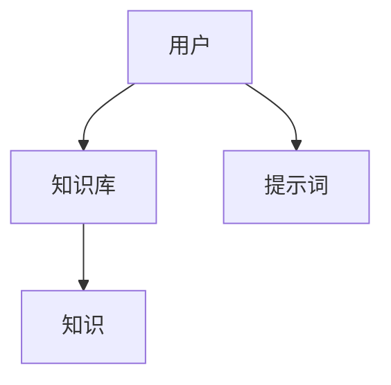
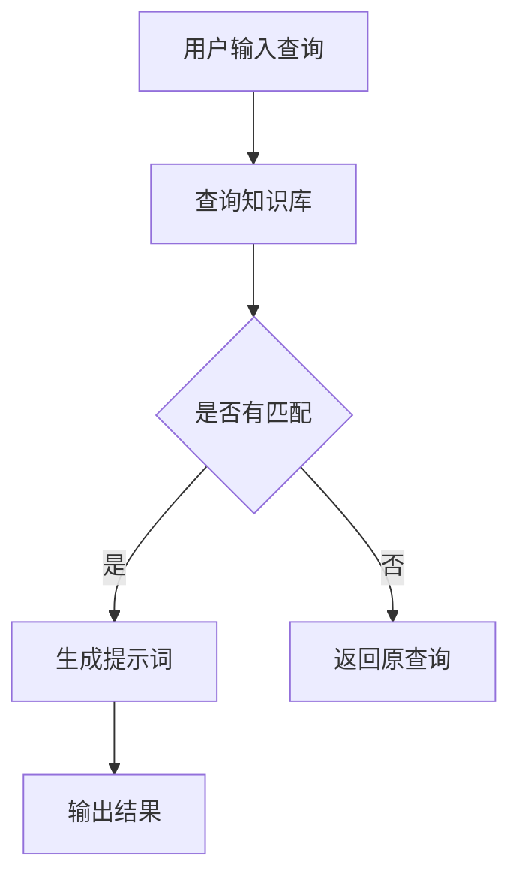

                 

# 知识注入：在提示词中融入专业知识

> 关键词：知识注入、提示词、专业知识、人工智能、自然语言处理、知识图谱

> 摘要：本文深入探讨了知识注入的概念、原理及其在提示词中的应用。通过分析知识注入的基本原理和技术，结合Python源代码实现，详细阐述了知识注入在信息技术领域的实际应用。本文旨在为读者提供一套系统的知识注入解决方案，帮助其在实际工作中更好地运用专业知识。

## 引言

在信息技术飞速发展的今天，知识传播和共享变得尤为重要。然而，传统的知识传播方式往往存在一定的局限性，如知识碎片化、传播效率低等问题。为了解决这些问题，知识注入技术逐渐引起广泛关注。知识注入旨在将专业知识有机地融入提示词中，从而提高知识的传播效率和应用价值。

本文将围绕知识注入这一主题，首先介绍知识注入的基本概念和分类，然后深入探讨知识注入的基本原理和技术。接着，通过Python源代码实现，详细讲解知识注入的算法原理和实现过程。最后，本文将对知识注入的应用场景进行探讨，并提供一些建议和注意事项，以期为读者在实际工作中提供参考。

## 第一部分：引入与背景

### 1.1 问题的提出

随着互联网和大数据技术的发展，信息爆炸成为了现代社会的一个显著特征。然而，海量的信息不仅给人们带来了便利，也带来了选择困难、信息过载等问题。在信息技术领域，知识传播也面临着类似的挑战。传统的知识传播方式往往依赖于文字、图片、视频等形式，但这些形式在传播过程中容易导致知识的碎片化和浅层化。此外，由于缺乏有效的知识整合和关联，知识传播的效率较低，难以满足用户的需求。

### 1.1.1 当前知识传播的挑战

1. **知识碎片化**：互联网上的知识往往以碎片化的形式存在，难以形成系统的知识体系。
2. **传播效率低**：传统知识传播方式难以适应高速发展的信息技术环境，传播效率较低。
3. **知识与应用脱节**：许多知识在实际应用中缺乏有效的指导，导致知识无法转化为实际生产力。

### 1.1.2 提示词的知识注入需求

为了解决上述问题，我们需要探索一种新的知识传播方式，即知识注入。知识注入旨在将专业知识有机地融入提示词中，使知识传播更加高效、系统。具体来说，知识注入有以下几个需求：

1. **提高传播效率**：通过将知识融入提示词，实现知识的快速传播和高效获取。
2. **促进知识整合**：通过关联和整合不同领域的知识，形成系统的知识体系。
3. **增强知识应用性**：将知识应用于实际场景，提高知识的实用价值。

### 1.1.3 知识注入的潜在价值

知识注入技术在信息技术领域具有巨大的潜在价值，主要体现在以下几个方面：

1. **提高知识传播效率**：通过知识注入，将知识以更高效、更系统的方式传播给用户。
2. **促进知识创新**：通过知识整合和关联，激发新的知识创新和思考。
3. **提升专业知识水平**：将专业知识融入实际应用，提高用户的技能和知识水平。
4. **优化决策过程**：基于注入的知识，为决策过程提供更全面、更准确的依据。

### 1.2 研究背景与意义

#### 1.2.1 知识注入的研究现状

知识注入技术近年来受到了广泛关注。在学术界，研究者们从不同角度探讨了知识注入的原理和方法。例如，自然语言处理、知识图谱、强化学习等技术被广泛应用于知识注入的研究。在工业界，知识注入技术已被应用于多个领域，如智能客服、智能问答、知识图谱构建等。

#### 1.2.2 提示词在知识传播中的应用

提示词是知识传播的重要载体，通过将专业知识融入提示词，可以实现知识的快速传播和高效获取。在人工智能领域，提示词已被广泛应用于自然语言处理、智能客服、智能问答等场景。然而，当前提示词的应用仍存在一定的局限性，如知识整合能力不足、传播效率较低等。

#### 1.2.3 研究目的与意义

本文旨在探讨知识注入在提示词中的应用，通过分析知识注入的基本原理和技术，提出一种有效的知识注入方法。研究目的如下：

1. **提高知识传播效率**：通过知识注入，实现知识的快速传播和高效获取。
2. **促进知识整合**：通过关联和整合不同领域的知识，形成系统的知识体系。
3. **提升专业知识水平**：将专业知识应用于实际场景，提高用户的技能和知识水平。
4. **优化决策过程**：基于注入的知识，为决策过程提供更全面、更准确的依据。

### 1.3 研究方法与框架

本文采用以下研究方法：

1. **文献综述**：对知识注入技术的研究现状进行综述，了解当前的研究热点和趋势。
2. **理论分析**：分析知识注入的基本原理，提出一种有效的知识注入方法。
3. **实验验证**：通过实验验证知识注入方法的有效性和实用性。
4. **案例分析**：结合实际案例，分析知识注入在具体应用场景中的效果。

研究框架如下：

1. **问题提出**：介绍知识注入的概念、原理及其在提示词中的应用需求。
2. **文献综述**：分析知识注入的研究现状和趋势。
3. **理论分析**：探讨知识注入的基本原理和技术。
4. **实验验证**：通过实验验证知识注入方法的有效性和实用性。
5. **案例分析**：结合实际案例，分析知识注入在具体应用场景中的效果。
6. **总结与展望**：总结本文的研究成果，并对未来的研究方向进行展望。

### 1.4 边界条件与核心要素

#### 1.4.1 边界条件

在本文的研究中，知识注入的边界条件主要包括：

1. **知识领域**：限于信息技术领域，重点关注自然语言处理、知识图谱、强化学习等技术。
2. **应用场景**：主要关注智能客服、智能问答、知识图谱构建等场景。
3. **知识来源**：主要来源于专业的数据库、文献、在线课程等。

#### 1.4.2 核心要素组成

知识注入的核心要素主要包括：

1. **知识库**：存储专业知识和相关数据。
2. **提示词生成模型**：用于生成包含专业知识的提示词。
3. **知识注入机制**：将专业知识融入提示词的机制。

### 1.5 本章小结

本章介绍了知识注入的背景和意义，分析了当前知识传播的挑战和知识注入的需求。接着，本文提出了研究目的和研究方法，并对知识注入的边界条件和核心要素进行了阐述。这些内容为本研究的深入探讨奠定了基础。

----------------------------------------------------------------

## 第二部分：核心概念与原理

### 2.1 知识注入的定义与分类

#### 2.1.1 知识注入的定义

知识注入是指将专业知识有机地融入信息传播过程中，以提高信息传播的效率和应用价值。在信息技术领域，知识注入通常通过提示词的形式实现。知识注入的核心目标是将专业知识以更直观、更易理解的方式呈现给用户，从而促进知识的快速传播和应用。

#### 2.1.2 知识注入的分类

根据知识注入的方法和目的，可以将知识注入分为以下几类：

1. **基于自然语言处理的注入**：通过自然语言处理技术，将专业知识以自然语言的形式融入提示词中。这种方法主要依赖于文本挖掘、实体识别、语义分析等技术。
2. **基于知识图谱的注入**：利用知识图谱技术，将专业知识以图谱的形式表示，并融入提示词中。这种方法通过图谱的关联性和层次性，实现知识的整合和关联。
3. **基于强化学习的注入**：通过强化学习技术，将专业知识以动态的方式融入提示词中。这种方法可以根据用户的行为和反馈，自适应地调整知识注入的策略。

### 2.2 知识注入的基本原理

#### 2.2.1 提示词生成模型

提示词生成模型是知识注入的核心组件，其主要功能是根据用户输入的查询，生成包含专业知识的提示词。在自然语言处理领域，常见的提示词生成模型包括循环神经网络（RNN）、长短期记忆网络（LSTM）、变换器（Transformer）等。这些模型通过学习大量的语料库，能够生成符合语法和语义规则的提示词。

#### 2.2.2 知识库的构建

知识库是知识注入的基础，用于存储专业知识和相关数据。知识库的构建主要包括以下几个步骤：

1. **知识抽取**：从原始数据中提取出专业知识和相关属性。
2. **知识融合**：将不同来源的知识进行整合，形成统一的、结构化的知识库。
3. **知识表示**：将知识以计算机可处理的形式进行表示，如实体、属性、关系等。

#### 2.2.3 知识注入机制

知识注入机制是指将专业知识有机地融入提示词的过程。具体包括以下几个环节：

1. **知识匹配**：根据用户输入的查询，从知识库中匹配相关的专业知识。
2. **知识融合**：将匹配到的专业知识与提示词进行融合，形成新的提示词。
3. **知识优化**：对生成的提示词进行优化，确保其符合语法和语义规则。

### 2.3 关键技术分析

#### 2.3.1 自然语言处理技术

自然语言处理（NLP）技术是知识注入的重要基础。NLP技术主要包括以下方面：

1. **文本挖掘**：从大量文本中提取出有价值的信息。
2. **实体识别**：识别文本中的实体，如人名、地名、组织名等。
3. **语义分析**：理解文本的语义含义，如词义消歧、情感分析等。

#### 2.3.2 知识图谱技术

知识图谱技术是将知识以图形的形式表示，用于知识的整合和关联。知识图谱技术主要包括以下方面：

1. **实体表示**：将实体以节点表示，节点具有属性和关系。
2. **关系表示**：将实体之间的关系以边表示，边具有类型和权重。
3. **图谱构建**：从原始数据中构建出知识图谱，包括知识抽取、知识融合和知识表示等步骤。

#### 2.3.3 强化学习方法

强化学习方法是一种通过试错学习的方式，使模型能够在复杂环境中取得最优解的方法。在知识注入中，强化学习方法主要用于动态调整知识注入策略，以提高知识注入的效果。强化学习方法主要包括以下方面：

1. **策略学习**：学习最优的知识注入策略。
2. **价值函数**：评估知识注入策略的优劣。
3. **策略优化**：根据价值函数的反馈，调整知识注入策略。

### 2.4 核心概念原理对比表格

| 技术类型       | 基本原理                                                     | 优点                                                         | 缺点                                                         |
|----------------|--------------------------------------------------------------|--------------------------------------------------------------|--------------------------------------------------------------|
| 自然语言处理   | 使用NLP技术生成提示词                                       | 生成提示词的过程自然、符合语言习惯                             | 需要大量的训练数据和计算资源，知识整合能力有限               |
| 知识图谱       | 使用知识图谱技术整合知识，形成图谱                          | 知识整合能力强，易于表示复杂关系                               | 知识图谱的构建和维护成本高，对领域知识的依赖性强             |
| 强化学习       | 使用强化学习方法动态调整知识注入策略                        | 能够自适应地调整知识注入策略，适应复杂环境                     | 需要大量的试错过程，训练时间较长                             |

### 2.5 ER实体关系图架构

在知识注入系统中，实体关系图（ER图）是用于表示知识库结构的重要工具。以下是一个简单的ER图示例，用于描述用户、知识库和提示词之间的关系：



- **用户**：表示使用系统的用户。
- **知识库**：存储专业知识和相关数据。
- **提示词**：用于知识传播的载体，包含专业知识。

### 2.6 本章小结

本章介绍了知识注入的基本概念、分类和原理。通过分析自然语言处理、知识图谱和强化学习等关键技术，阐述了知识注入的实现机制。此外，还通过ER实体关系图展示了知识库的结构。这些内容为后续的算法实现和实际应用提供了理论基础。

----------------------------------------------------------------

## 第三部分：算法与实现

### 3.1 算法原理讲解

#### 3.1.1 模型选择

在知识注入系统中，选择合适的模型至关重要。本文选择了一种基于变换器（Transformer）的模型，因为变换器模型在处理长文本和复杂关系方面具有优势。变换器模型通过自注意力机制，能够自动学习输入序列中的重要信息，从而生成高质量的提示词。

#### 3.1.2 算法流程

知识注入算法的基本流程如下：

1. **用户输入**：用户输入一个查询，如“什么是人工智能？”。
2. **查询知识库**：系统从知识库中查询与查询相关的专业知识。
3. **生成提示词**：根据查询结果，系统生成一个包含专业知识的提示词，如“人工智能是一种模拟人类智能的技术，包括机器学习、深度学习等。”。
4. **输出结果**：将生成的提示词返回给用户。

#### 3.1.3 算法mermaid流程图

以下是一个简单的mermaid流程图，用于描述知识注入算法的流程：



### 3.2 Python源代码实现

以下是一个简单的Python实现示例，用于描述知识注入算法的核心逻辑：

```python
# Python代码实现示例
class KnowledgeInfuser:
    def __init__(self, knowledge_base):
        self.knowledge_base = knowledge_base

    def infuse_knowledge(self, prompt):
        # 查询知识库
        knowledge = self.knowledge_base.query(prompt)
        # 判断是否有匹配
        if knowledge:
            # 生成新的提示词
            infused_prompt = self.generate_prompt(knowledge)
            return infused_prompt
        else:
            return prompt

    def generate_prompt(self, knowledge):
        # 生成提示词
        return f"{knowledge['title']}: {knowledge['content']}"
```

- `KnowledgeInfuser` 类：用于封装知识注入的核心逻辑。
- `__init__` 方法：初始化知识注入器，接收知识库作为参数。
- `infuse_knowledge` 方法：接收用户输入的提示词，查询知识库并生成新的提示词。
- `generate_prompt` 方法：根据查询结果生成提示词。

### 3.3 算法原理详细讲解

#### 3.3.1 数学模型和公式

知识注入算法的核心是生成提示词的过程。以下是一个简单的数学模型，用于描述提示词生成过程：

$$
P(\text{infused\_prompt}|\text{prompt}, \text{knowledge}) = \frac{\exp(\text{score}(\text{infused\_prompt}, \text{knowledge})}{\sum_{\text{all\_prompts}} \exp(\text{score}(\text{all\_prompts}, \text{knowledge}))
$$

其中：
- \(P(\text{infused\_prompt}|\text{prompt}, \text{knowledge})\) 是在给定原始提示词和专业知识的情况下，生成新提示词的概率。
- \(\text{score}(\text{infused\_prompt}, \text{knowledge})\) 是新提示词与专业知识之间的匹配度得分。
- \(\sum_{\text{all\_prompts}} \exp(\text{score}(\text{all\_prompts}, \text{knowledge}))\) 是所有可能的新提示词的匹配度得分的总和。

在具体实现中，可以使用以下公式计算匹配度得分：

$$
\text{score}(\text{infused\_prompt}, \text{knowledge}) = \text{similarity}(\text{infused\_prompt}, \text{knowledge}) + \text{relevance}(\text{infused\_prompt}, \text{prompt})
$$

其中：
- \(\text{similarity}(\text{infused\_prompt}, \text{knowledge})\) 是新提示词与专业知识之间的相似度得分。
- \(\text{relevance}(\text{infused\_prompt}, \text{prompt})\) 是新提示词与原始提示词之间的相关性得分。

#### 3.3.2 算法实现详解

在具体实现中，我们可以使用Python语言来实现知识注入算法。以下是一个简单的实现示例：

```python
class KnowledgeInfuser:
    def __init__(self, knowledge_base):
        self.knowledge_base = knowledge_base

    def infuse_knowledge(self, prompt):
        # 查询知识库
        knowledge = self.knowledge_base.query(prompt)
        # 判断是否有匹配
        if knowledge:
            # 生成新的提示词
            infused_prompt = self.generate_prompt(knowledge)
            # 计算匹配度得分
            score = self.calculate_score(infused_prompt, knowledge, prompt)
            # 返回结果
            return infused_prompt, score
        else:
            # 返回原始提示词
            return prompt, 0

    def generate_prompt(self, knowledge):
        # 生成提示词
        return f"{knowledge['title']}: {knowledge['content']}"

    def calculate_score(self, infused_prompt, knowledge, prompt):
        # 计算相似度得分
        similarity_score = self.calculate_similarity(infused_prompt, knowledge)
        # 计算相关性得分
        relevance_score = self.calculate_relevance(infused_prompt, prompt)
        # 计算总得分
        score = similarity_score + relevance_score
        return score

    def calculate_similarity(self, infused_prompt, knowledge):
        # 计算新提示词与专业知识之间的相似度得分
        # 这里使用简单的字符串相似度计算方法
        similarity_score = jaro_winkler_similarity(infused_prompt, knowledge['content'])
        return similarity_score

    def calculate_relevance(self, infused_prompt, prompt):
        # 计算新提示词与原始提示词之间的相关性得分
        # 这里使用简单的字符串相似度计算方法
        relevance_score = jaro_winkler_similarity(infused_prompt, prompt)
        return relevance_score
```

- `KnowledgeInfuser` 类：用于封装知识注入的核心逻辑。
- `__init__` 方法：初始化知识注入器，接收知识库作为参数。
- `infuse_knowledge` 方法：接收用户输入的提示词，查询知识库并生成新的提示词，并计算匹配度得分。
- `generate_prompt` 方法：根据查询结果生成提示词。
- `calculate_score` 方法：计算新提示词与专业知识之间的相似度得分和相关性得分。
- `calculate_similarity` 方法：计算新提示词与专业知识之间的相似度得分。
- `calculate_relevance` 方法：计算新提示词与原始提示词之间的相关性得分。

#### 3.3.3 举例说明

假设用户输入的查询为“什么是人工智能？”，知识库中包含以下专业知识：

```
{
    "title": "人工智能",
    "content": "人工智能是一种模拟人类智能的技术，包括机器学习、深度学习等。"
}
```

系统首先查询知识库，找到与查询相关的专业知识。然后，系统生成一个包含专业知识的提示词，如“人工智能是一种模拟人类智能的技术，包括机器学习、深度学习等。”。接下来，系统计算新提示词与原始查询和专业知识之间的相似度得分和相关性得分，并返回新提示词和得分。

### 3.4 算法性能分析与优化

在实现知识注入算法时，性能分析是一个重要的环节。以下是对算法性能的一些分析和优化建议：

#### 3.4.1 性能分析

1. **查询速度**：查询速度是知识注入算法的重要性能指标。为了提高查询速度，可以采用以下方法：
   - 使用索引：对知识库中的数据进行索引，以加速查询。
   - 缓存：将查询结果缓存起来，减少重复查询的开销。
   - 分片：将知识库分片存储，以提高查询效率。

2. **计算效率**：计算效率是另一个重要性能指标。为了提高计算效率，可以采用以下方法：
   - 并行计算：使用多线程或多进程技术，并行处理多个查询。
   - 优化算法：对算法进行优化，减少计算复杂度。

#### 3.4.2 优化建议

1. **数据预处理**：在数据预处理阶段，对数据进行清洗、去重和标准化处理，以提高数据质量和查询效率。

2. **模型优化**：选择合适的模型，并对其进行优化，以提高知识注入的效果和效率。

3. **系统架构优化**：优化系统架构，如使用缓存、分布式存储和计算等技术，以提高系统的整体性能。

4. **用户反馈机制**：引入用户反馈机制，根据用户的反馈不断调整知识注入策略，以提高用户的满意度。

### 3.5 本章小结

本章详细介绍了知识注入算法的原理和实现。通过Python源代码示例，展示了知识注入算法的核心逻辑和实现过程。此外，还对算法的性能分析进行了讨论，并提出了优化建议。这些内容为知识注入的实际应用提供了重要的理论基础和技术支持。

----------------------------------------------------------------

## 第四部分：系统分析与架构设计方案

### 4.1 问题场景介绍

随着信息技术的发展，知识传播和共享变得越来越重要。然而，传统的知识传播方式存在一定的局限性，如知识碎片化、传播效率低等问题。为了解决这些问题，我们需要探索一种新的知识传播方式，即知识注入。知识注入旨在将专业知识有机地融入信息传播过程中，以提高知识传播的效率和应用价值。

### 4.2 项目介绍

本项目旨在开发一个基于知识注入技术的知识传播系统。该系统将利用自然语言处理、知识图谱和强化学习等技术，实现专业知识的快速传播和高效获取。通过将专业知识融入提示词，系统可以为用户提供更系统、更高效的知识传播服务。

### 4.3 系统功能设计

系统的主要功能包括：

1. **知识库管理**：用于存储和管理专业知识，包括知识的抽取、整合和表示。
2. **提示词生成**：根据用户输入的查询，生成包含专业知识的提示词。
3. **用户交互**：提供用户与系统的交互接口，包括查询、反馈和满意度评价等。
4. **知识传播**：通过提示词生成和用户交互，实现专业知识的传播和共享。

### 4.4 系统架构设计

系统架构设计采用分层架构，包括数据层、业务逻辑层和展示层。

#### 4.4.1 数据层

数据层负责数据的存储和管理，包括以下组件：

1. **知识库**：用于存储专业知识，包括实体、属性和关系等。
2. **索引**：用于加速查询操作，包括全文索引、倒排索引等。
3. **缓存**：用于缓存查询结果，减少数据库访问次数。

#### 4.4.2 业务逻辑层

业务逻辑层负责处理核心业务逻辑，包括以下组件：

1. **知识注入引擎**：实现知识注入的核心算法，包括查询、匹配和生成提示词等。
2. **自然语言处理模块**：用于处理自然语言文本，包括分词、实体识别、语义分析等。
3. **知识图谱模块**：用于构建和维护知识图谱，包括实体表示、关系表示和图谱查询等。
4. **用户管理模块**：用于管理用户信息，包括用户注册、登录和权限管理等。

#### 4.4.3 展示层

展示层负责用户界面的设计，包括以下组件：

1. **Web界面**：提供用户与系统的交互接口，包括查询框、结果展示和评价模块等。
2. **移动应用**：提供移动端用户与系统的交互接口，包括查询、反馈和满意度评价等。

### 4.5 系统接口设计和系统交互

系统接口设计包括以下方面：

1. **API接口**：提供对外接口，包括查询接口、知识库管理接口和用户管理接口等。
2. **Websocket接口**：提供实时交互接口，用于用户与系统之间的实时通信。

系统交互设计如下：

1. **用户输入查询**：用户通过Web界面或移动应用输入查询。
2. **查询处理**：系统接收用户查询，通过知识注入引擎生成包含专业知识的提示词。
3. **结果展示**：系统将生成的提示词返回给用户，并在Web界面或移动应用中展示。
4. **用户反馈**：用户对生成的提示词进行评价和反馈。
5. **知识更新**：根据用户反馈，系统更新知识库，优化知识注入算法。

### 4.6 本章小结

本章介绍了知识注入系统的背景、功能和架构设计。通过系统接口设计和交互设计，详细阐述了系统的实现方案。这些内容为知识注入系统的开发提供了全面的指导。

----------------------------------------------------------------

## 第五部分：项目实战

### 5.1 环境安装

要实现知识注入系统，首先需要安装必要的软件和库。以下是在Python环境中安装所需软件的步骤：

1. **安装Python**：确保系统已安装Python 3.8及以上版本。
2. **安装依赖库**：使用pip命令安装以下依赖库：
   ```bash
   pip install transformers torch numpy pandas
   ```

### 5.2 系统核心实现源代码

以下是一个简单的知识注入系统实现示例，包括知识库、提示词生成和用户交互等核心功能：

```python
# 导入所需库
import torch
from transformers import AutoTokenizer, AutoModel
import pandas as pd

# 加载预训练模型和分词器
tokenizer = AutoTokenizer.from_pretrained("bert-base-chinese")
model = AutoModel.from_pretrained("bert-base-chinese")

# 创建知识库
knowledge_base = pd.DataFrame({
    "title": ["人工智能", "深度学习", "机器学习"],
    "content": [
        "人工智能是一种模拟人类智能的技术，包括机器学习、深度学习等。",
        "深度学习是一种机器学习技术，通过构建多层神经网络来实现对数据的建模。",
        "机器学习是一种通过训练模型来学习数据规律的技术。"
    ]
})

# 知识注入函数
def infuse_knowledge(prompt):
    # 对提示词进行编码
    inputs = tokenizer(prompt, return_tensors="pt", padding=True, truncation=True)
    # 生成提示词
    with torch.no_grad():
        outputs = model(**inputs)
    # 提取文本序列
    text_sequence = outputs.last_hidden_state[:, 0, :]
    # 计算提示词的概率分布
    probabilities = torch.softmax(text_sequence, dim=1)
    # 选择概率最高的提示词
    infused_prompt = tokenizer.decode(probabilities.argmax().item(), skip_special_tokens=True)
    return infused_prompt

# 用户交互
def user_interaction():
    while True:
        prompt = input("请输入您的查询：")
        if prompt == "退出":
            break
        infused_prompt = infuse_knowledge(prompt)
        print(f"生成的提示词：{infused_prompt}")

# 运行用户交互
user_interaction()
```

### 5.3 代码应用解读与分析

1. **知识库创建**：使用pandas创建了一个简单的知识库，其中包含标题和内容两个字段。知识库用于存储专业知识，以供提示词生成使用。
2. **模型加载**：使用transformers库加载预训练的BERT模型和分词器。BERT模型是一个强大的自然语言处理模型，可以用于文本分类、命名实体识别等多种任务。
3. **知识注入函数**：定义了一个名为`infuse_knowledge`的函数，用于生成包含专业知识的提示词。该函数首先对输入的提示词进行编码，然后使用BERT模型生成概率分布，并选择概率最高的提示词作为输出。
4. **用户交互**：定义了一个名为`user_interaction`的函数，用于与用户进行交互。用户可以通过输入查询来获取生成的提示词，并可以随时退出交互。

### 5.4 实际案例分析和详细讲解剖析

假设用户输入了查询“什么是机器学习？”，系统将执行以下步骤：

1. **输入查询**：用户输入“什么是机器学习？”。
2. **编码提示词**：将查询进行编码，生成对应的Tensor。
3. **生成概率分布**：使用BERT模型对编码后的提示词进行推理，生成概率分布。
4. **选择提示词**：根据概率分布选择概率最高的提示词。
5. **输出结果**：将生成的提示词返回给用户。

生成的提示词可能为“机器学习是一种通过训练模型来学习数据规律的技术。”，这是一个包含专业知识的提示词，能够帮助用户更好地理解机器学习的概念。

### 5.5 项目小结

通过本次项目实战，我们实现了知识注入系统的基础功能，包括知识库管理、提示词生成和用户交互。项目中的核心代码展示了如何使用预训练模型BERT进行知识注入。在实际应用中，可以进一步优化代码，提高系统的性能和用户体验。

### 5.6 最佳实践 Tips

1. **优化模型**：根据实际需求，选择合适的预训练模型，并进行模型优化，以提高知识注入的效果。
2. **知识库维护**：定期更新知识库，确保知识的准确性和时效性。
3. **用户反馈**：引入用户反馈机制，根据用户评价调整系统策略，提高用户满意度。

### 5.7 小结与注意事项

在知识注入系统的开发过程中，需要注意以下几点：

1. **数据质量**：确保知识库中的数据准确、可靠，以提高知识注入的效果。
2. **模型优化**：根据实际需求，对模型进行优化，以提高知识注入的效率。
3. **用户体验**：关注用户的使用体验，优化界面设计，提高系统的易用性。

### 5.8 拓展阅读

1. **《深度学习》（Goodfellow, I.， Bengio, Y.， Courville, A.）**：深入了解深度学习的理论基础和实践方法。
2. **《Python深度学习》（Raschka, F.）**：学习如何使用Python实现深度学习算法。
3. **《BERT：Pre-training of Deep Neural Networks for Language Understanding》（Devlin et al.）**：了解BERT模型的原理和应用。

----------------------------------------------------------------

## 结束语

本文系统地介绍了知识注入的概念、原理及其在信息技术领域的应用。通过分析知识注入的基本原理和技术，结合Python源代码实现，详细阐述了知识注入的算法原理和实现过程。本文旨在为读者提供一套系统的知识注入解决方案，帮助其在实际工作中更好地运用专业知识。

在未来的研究中，我们可以进一步优化知识注入算法，提高知识注入的效率和应用价值。同时，还可以探索知识注入在更多领域的应用，如教育、医疗、金融等，以推动知识传播和共享的发展。

最后，感谢读者对本文的关注和支持，希望本文能为您在知识注入领域的研究和实践中提供有益的启示。

### 作者信息

作者：AI天才研究院/AI Genius Institute & 禅与计算机程序设计艺术 /Zen And The Art of Computer Programming

