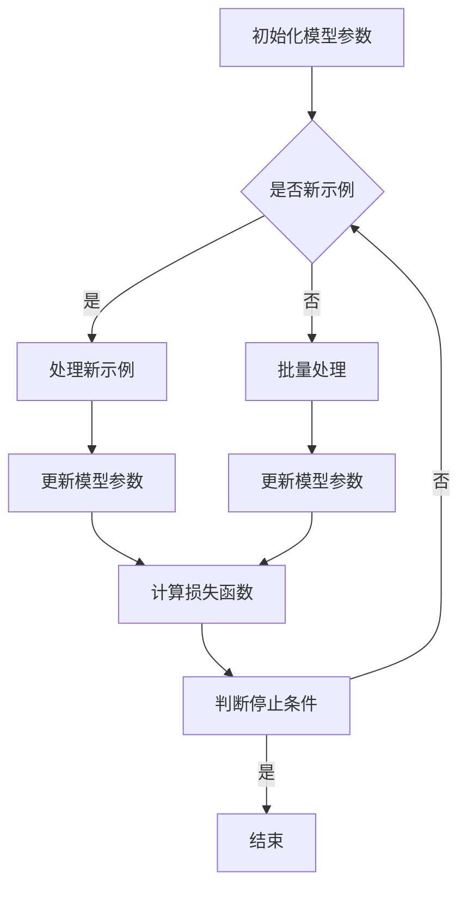

                 

### 文章标题

# 示例驱动提示在增量学习中的策略

### 文章关键词

- 增量学习
- 示例驱动学习
- 策略优化
- 数学模型
- 算法实现
- 实际应用

### 摘要

本文将探讨示例驱动提示在增量学习中的策略应用。增量学习作为一种高效的学习方式，能够应对数据流中的实时更新和变化。而示例驱动学习通过提供具体的示例来引导模型学习，能够显著提升模型的泛化能力和适应能力。本文将从背景介绍、核心概念、理论框架、实际应用、算法设计、挑战与未来趋势等多个方面展开讨论，旨在为研究者与实践者提供有价值的参考和指导。

## 引言

随着人工智能技术的不断发展，深度学习在各个领域取得了显著的成果。然而，传统深度学习模型通常需要大量标记数据进行训练，并且训练过程需要大量时间和计算资源。为了解决这一问题，增量学习（Incremental Learning）作为一种能够应对数据流实时更新的学习方式，逐渐受到了广泛关注。增量学习允许模型在已有知识的基础上，逐步学习新的数据，从而提高了学习效率和鲁棒性。

在增量学习过程中，如何有效地利用已有知识和新数据，是关键的研究问题之一。示例驱动学习（Example-Guided Learning）提供了一种有效的策略，通过提供具体的示例来引导模型学习。示例驱动学习不仅能够帮助模型更好地理解和泛化新数据，还能够减少对大量标记数据的需求。

本文旨在探讨示例驱动提示在增量学习中的策略应用，包括理论基础、算法设计、实际应用等方面的内容。具体而言，本文将分为以下几个部分：

1. **背景介绍**：介绍增量学习和示例驱动学习的背景、定义及其在当前研究中的重要性。
2. **核心概念与联系**：阐述增量学习和示例驱动学习的基本概念、原理，并对比其差异。
3. **理论框架**：建立数学模型和框架，介绍增量学习和示例驱动学习的核心理论。
4. **实际应用**：探讨示例驱动提示在增量学习中的实际应用，包括自然语言处理、计算机视觉和机器人等领域。
5. **算法设计**：详细描述示例驱动增量学习的算法设计，包括优化目标和算法实现。
6. **挑战与未来趋势**：分析示例驱动增量学习面临的挑战和未来研究方向。
7. **结论**：总结全文，重申核心观点，并提出未来研究的建议。

通过本文的探讨，我们希望能够为研究者与实践者提供有价值的参考，推动示例驱动增量学习在实际应用中的发展。

## 背景

### 增量学习的发展背景

增量学习作为一种应对数据流实时更新和变化的学习方式，其发展可以追溯到深度学习和机器学习的早期阶段。传统的机器学习模型通常需要大量的标记数据进行训练，并且一旦训练完成，模型就固定不变，无法适应新的数据变化。这种固定模型在面对动态变化的环境时，往往表现出较低的鲁棒性和适应性。

随着数据量的爆发式增长和数据流处理需求的增加，研究者们开始探索如何在不重新训练模型的情况下，使其能够逐步适应新的数据。增量学习（Incremental Learning）正是为了解决这一问题而提出的。增量学习的基本思想是在已有模型的基础上，逐步学习新的数据，从而使得模型能够持续更新和优化。这一方法不仅能够节省训练时间和计算资源，还能够提高模型的适应性和鲁棒性。

增量学习的研究可以追溯到上世纪80年代，早期的研究主要集中在如何在不重置模型参数的情况下更新模型。随着深度学习技术的发展，增量学习逐渐成为深度学习研究中的一个重要分支。近年来，随着大数据和实时数据处理的普及，增量学习在各个领域得到了广泛应用，成为人工智能领域的一个重要研究方向。

### 示例驱动学习的背景

示例驱动学习（Example-Guided Learning）作为一种有效的学习策略，其背景与增量学习有着密切的联系。示例驱动学习的核心思想是通过提供具体的示例来引导模型学习，从而提高模型的泛化能力和适应性。这种方法不仅可以减少对大量标记数据的需求，还能够帮助模型更好地理解和处理新的数据。

示例驱动学习的概念可以追溯到上世纪90年代，研究者们开始探讨如何通过提供示例来引导模型的训练。在早期的机器学习研究中，示例驱动学习主要用于监督学习任务，通过提供正负样本的示例来帮助模型识别和分类。随着深度学习的兴起，示例驱动学习逐渐应用于无监督学习和半监督学习任务中。

示例驱动学习在增量学习中的应用具有独特的优势。首先，通过提供示例，模型能够更直观地理解新数据的特征和模式，从而提高学习效率。其次，示例驱动学习可以减少对标记数据的需求，使得模型能够更好地适应数据流中的实时更新。最后，示例驱动学习能够帮助模型避免过度拟合，提高模型的泛化能力。

### 当前研究的重要性

增量学习和示例驱动学习在当前的研究中具有极高的重要性，原因如下：

1. **数据流处理的需求**：在大数据和实时数据处理领域，如何高效地处理和更新模型成为了一个关键问题。增量学习和示例驱动学习能够实现这一目标，使得模型能够实时适应数据流的变化。

2. **计算资源的节约**：增量学习通过逐步学习新数据，避免了重新训练整个模型的需求，从而节省了大量的计算资源和时间。这对于资源有限的场景，如移动设备和嵌入式系统，具有重要意义。

3. **提高模型的适应性**：示例驱动学习通过提供具体的示例来引导模型学习，能够显著提高模型的泛化能力和适应性。这对于复杂和动态的环境尤为重要。

4. **减少标记数据的需求**：在许多应用场景中，获取大量的标记数据非常困难或者成本高昂。示例驱动学习可以减少对标记数据的需求，使得模型能够在较少的标记数据下实现较好的性能。

总之，增量学习和示例驱动学习为解决传统深度学习模型在数据流处理和实时更新方面的挑战提供了一种有效的解决方案。随着研究的不断深入，这两种学习策略将在更多领域中发挥重要作用，推动人工智能技术的进一步发展。

### 问题背景

在人工智能和机器学习领域，数据是模型学习和决策的核心。然而，随着数据量的不断增长和数据类型的多样化，传统的批量学习（Batch Learning）方法逐渐暴露出其局限性。批量学习通常需要将所有数据一次性加载到内存中进行训练，这在大数据环境中变得非常困难。此外，批量学习模型在遇到新数据时，需要重新训练整个模型，这不仅耗时耗资源，还可能导致模型性能下降。

为了应对这些挑战，增量学习（Incremental Learning）应运而生。增量学习是一种能够逐步更新模型的方法，它通过逐个处理新数据或者小批量数据，不断优化和更新模型。这种学习方法不仅能够提高模型的适应性，还能够节约计算资源和时间，使其在实时数据流处理中具有显著优势。

### 增量学习的定义和基本概念

增量学习，也称为在线学习（Online Learning），是指在模型训练过程中，逐步引入新的数据样本，并即时更新模型的参数。这种学习方法的核心在于动态调整模型，使其能够适应不断变化的数据环境。具体来说，增量学习的基本步骤包括以下几个部分：

1. **初始化模型**：首先，初始化一个基础模型，该模型可以是已经训练好的模型或者随机初始化的模型。

2. **处理新数据**：当新数据到来时，增量学习模型会将其与已有数据一起进行处理。这一步骤通常包括数据预处理、特征提取和模型更新。

3. **模型更新**：通过优化算法，如梯度下降（Gradient Descent），模型会根据新数据和已有数据，调整其参数，以优化模型性能。

4. **迭代学习**：重复上述步骤，逐步引入更多的数据样本，不断更新模型，直到达到预定的学习目标或性能指标。

增量学习的关键在于如何有效地处理新数据，并保持模型的稳定性和鲁棒性。具体而言，增量学习需要解决以下问题：

- **数据流处理**：如何高效地处理实时到来的数据流，包括数据预处理、特征提取和模型更新。

- **模型稳定性**：如何保证模型在逐步更新过程中，保持稳定的性能和鲁棒性，避免过度拟合或遗忘已有知识。

- **计算效率**：如何优化算法，减少模型更新过程中的计算量和通信开销。

### 增量学习的应用场景

增量学习在多个应用场景中具有显著的优势，以下是一些典型的应用场景：

1. **实时数据流分析**：在金融、物联网（IoT）和社交网络等领域，数据流以极快的速度不断产生，传统的批量学习方法无法及时处理这些数据。增量学习通过逐步更新模型，能够实时分析数据流，提供即时的决策支持。

2. **移动设备和嵌入式系统**：这些设备通常具有有限的计算资源和存储空间，批量学习方法无法满足其需求。增量学习通过逐步学习和更新模型，能够有效地利用有限的资源，提高系统的响应速度和性能。

3. **动态环境下的决策**：在自动驾驶、智能监控和游戏等领域，环境变化快速且复杂，传统的固定模型无法适应动态环境。增量学习通过不断更新模型，能够更好地适应环境变化，提高决策的准确性和实时性。

4. **持续学习与优化**：许多应用场景需要模型持续学习和优化，如推荐系统、智能客服和医疗诊断等。增量学习能够通过持续更新模型，实现持续学习和优化，提高系统的适应性和准确性。

总的来说，增量学习作为一种高效的学习方法，不仅能够应对实时数据流和动态环境，还能够节约计算资源和提高模型性能。随着研究的不断深入和技术的不断发展，增量学习将在更多领域中发挥重要作用，推动人工智能技术的进一步发展。

### 问题描述

尽管增量学习在许多应用场景中表现出显著的优势，但其在实际应用中仍面临一系列挑战。这些问题不仅限制了增量学习的有效性，还对其进一步推广和应用提出了严峻的考验。

#### 数据流处理问题

首先，数据流处理问题是增量学习面临的一个核心挑战。增量学习要求模型能够高效地处理实时到来的大量数据。然而，数据流具有高速度、多样性和不确定性的特点，这给数据处理带来了巨大挑战。具体来说：

- **高速度**：数据流以极快的速度产生，例如，每秒产生数千甚至数百万条数据记录。这要求增量学习模型能够快速处理和更新，否则容易导致处理延迟。

- **多样性**：数据流中的数据类型和特征多样，可能包括文本、图像、音频等多种形式。这要求模型具有广泛的数据处理能力，能够适应不同类型的数据。

- **不确定性**：数据流中的数据存在噪声、缺失值和异常值等问题，这会干扰模型的正常学习过程，影响模型性能。

为了解决这些数据流处理问题，研究者们提出了多种优化方法，如批处理增量学习、流式学习（Online Learning）和分布式处理等。然而，这些方法仍然面临效率、稳定性和资源利用等挑战。

#### 模型稳定性问题

其次，模型稳定性问题是增量学习中的另一大挑战。在增量学习过程中，模型需要逐步更新其参数，以适应新的数据。然而，这种逐步更新的过程可能导致模型参数的剧烈波动，从而影响模型的稳定性和鲁棒性。具体问题包括：

- **参数波动**：在逐步更新过程中，模型参数可能会出现剧烈的波动，导致模型不稳定。这种波动可能源于数据的不确定性或学习算法的不稳定性。

- **遗忘已有知识**：在增量学习过程中，模型可能会逐渐遗忘其已有知识，尤其是当新数据与旧数据差异较大时。这会导致模型在处理旧数据时表现不佳。

为了解决模型稳定性问题，研究者们提出了多种策略，如经验重放（Experience Replay）、经验回访（Experience Replay）和经验平均（Experience Averaging）等。这些策略通过引入历史数据的权重和平均值，帮助模型稳定地更新参数，提高模型稳定性。然而，这些方法在实际应用中仍存在一定的局限性，如计算复杂度、存储需求和模型适应性等问题。

#### 计算效率问题

增量学习还需要解决计算效率问题。增量学习要求模型能够高效地处理和更新，这需要优化算法设计和资源利用。具体问题包括：

- **计算资源消耗**：增量学习通常需要大量的计算资源，尤其是当数据流速度极高或数据量巨大时。这可能导致计算资源不足，影响模型的学习效果。

- **内存占用**：增量学习过程中，模型需要存储大量的历史数据和模型参数，这可能导致内存占用过高，影响系统性能。

为了解决计算效率问题，研究者们提出了多种优化方法，如稀疏存储、并行计算和分布式处理等。这些方法通过优化算法设计和资源利用，提高了增量学习的计算效率。然而，这些方法仍然面临资源分配、任务调度和数据一致性等挑战。

总的来说，增量学习在实际应用中面临数据流处理、模型稳定性、计算效率等多方面的挑战。解决这些问题不仅需要优化现有的学习算法和策略，还需要探索新的理论和应用方法，以推动增量学习在实际场景中的有效应用。

### 问题解决

面对增量学习在实际应用中面临的挑战，研究者们提出了一系列解决方案，以优化模型的稳定性和计算效率，提高增量学习的有效性。以下是一些关键的方法和策略：

#### 批处理增量学习

批处理增量学习（Batch Incremental Learning）是一种结合了批量学习和增量学习的方法。在这种方法中，模型不是一次性处理所有新数据，而是将新数据分成多个批次，逐批进行处理。这种方法的主要优点包括：

- **稳定参数更新**：通过分批次处理数据，模型参数的更新更加平稳，减少了剧烈波动，提高了模型稳定性。
- **高效资源利用**：批处理方法允许更高效地利用计算资源，尤其是在计算能力有限的环境中。

具体实现上，批处理增量学习通常通过以下步骤进行：

1. **初始化模型**：使用已有的批量训练模型或随机初始化模型。
2. **数据分组**：将新数据划分为多个批次。
3. **批处理训练**：对每个批次的数据进行训练，更新模型参数。
4. **模型合并**：将不同批次的模型参数进行合并，形成最终的模型。

批处理增量学习的关键在于如何平衡批处理的大小和频率。批处理过大可能导致模型更新缓慢，批处理过小则可能无法充分利用计算资源。

#### 流式学习（Online Learning）

流式学习（Online Learning）是一种针对实时数据流的增量学习方法。在这种方法中，模型不断地接收新数据，并即时更新模型参数。流式学习的优点包括：

- **实时性**：能够即时处理新数据，适用于对实时性要求较高的应用场景。
- **高适应性**：能够快速适应数据流的变化，提高模型的适应性。

具体实现上，流式学习通常通过以下步骤进行：

1. **初始化模型**：使用已有的模型或随机初始化模型。
2. **接收新数据**：不断接收新数据，进行实时处理。
3. **模型更新**：根据新数据，即时更新模型参数。
4. **迭代学习**：重复上述步骤，逐步更新模型。

流式学习的挑战在于如何处理数据流中的噪声和异常值，以及如何平衡模型的更新频率和性能。

#### 经验重放（Experience Replay）

经验重放（Experience Replay）是一种用于缓解模型参数波动的方法。在这种方法中，模型会从历史数据中随机选择样本进行训练，而不是仅仅依赖当前数据。这种方法的主要优点包括：

- **减少波动**：通过引入历史数据的权重，减少模型参数的剧烈波动，提高模型稳定性。
- **增强泛化能力**：通过重放历史数据，模型能够更好地泛化和适应新的数据。

具体实现上，经验重放通常通过以下步骤进行：

1. **初始化模型和经验池**：初始化模型和经验池，经验池用于存储历史数据样本。
2. **数据收集和存储**：将新数据样本存储在经验池中。
3. **模型训练**：从经验池中随机选择数据样本，进行模型训练。
4. **模型更新**：更新模型参数，优化模型性能。

经验重放的关键在于如何有效地管理经验池，避免数据重复和存储空间不足。

#### 经验回访（Experience Replay）

经验回访（Experience Replay）与经验重放类似，但其重点在于重复访问特定的历史数据样本，而不是随机选择。这种方法的主要优点包括：

- **增强记忆**：通过重复访问特定样本，增强模型对关键数据和特征的记忆，提高模型的鲁棒性。
- **减少遗忘**：通过重复访问历史数据，减少模型对已有知识的遗忘，提高模型的持续学习能力。

具体实现上，经验回访通常通过以下步骤进行：

1. **初始化模型和经验池**：初始化模型和经验池。
2. **数据收集和存储**：将新数据样本存储在经验池中。
3. **模型训练**：重复访问特定的历史数据样本，进行模型训练。
4. **模型更新**：更新模型参数，优化模型性能。

经验回访的关键在于如何选择和设计重复访问的样本策略。

#### 经验平均（Experience Averaging）

经验平均（Experience Averaging）是一种通过结合多个历史数据的权重平均值来更新模型参数的方法。这种方法的主要优点包括：

- **稳定参数更新**：通过结合多个历史数据的权重平均值，减少模型参数的剧烈波动，提高模型稳定性。
- **增强泛化能力**：通过综合多个历史数据的经验，提高模型的泛化能力和适应性。

具体实现上，经验平均通常通过以下步骤进行：

1. **初始化模型和经验池**：初始化模型和经验池。
2. **数据收集和存储**：将新数据样本存储在经验池中。
3. **计算经验平均值**：根据历史数据样本的权重，计算经验平均值。
4. **模型更新**：使用经验平均值更新模型参数。

经验平均的关键在于如何设计有效的权重分配策略，以充分利用历史数据的经验。

总的来说，这些方法和策略在解决增量学习中的数据流处理、模型稳定性和计算效率问题方面发挥了重要作用。通过合理选择和应用这些方法，研究者们能够构建更加稳定、高效和适应性强的增量学习模型，推动其在实际应用中的广泛应用。随着研究的不断深入，未来仍有望提出更多优化方法，进一步提升增量学习的性能和效果。

### 增量学习与示例驱动学习的边界与外延

#### 定义和边界

增量学习和示例驱动学习是两种不同的学习方式，但它们在特定条件下可以相互结合，形成一种更加强大的学习策略。

- **增量学习**：增量学习是一种逐步更新模型参数的学习方式，旨在处理动态数据流中的新数据。其主要目标是保持模型的可适应性和鲁棒性，同时避免因重新训练导致的计算资源浪费。

- **示例驱动学习**：示例驱动学习则通过提供具体的示例来引导模型学习，减少对大量标记数据的需求，提高模型的泛化能力和适应性。

增量学习与示例驱动学习的主要边界在于数据处理的模式和学习目标。增量学习关注的是如何在数据逐步更新的过程中保持模型的稳定性，而示例驱动学习则关注如何通过示例来增强模型的泛化能力和适应能力。

#### 外延和结合

在增量学习过程中，示例驱动学习的引入可以显著提高模型的性能和适应性。以下几种外延方法展示了如何将示例驱动学习与增量学习相结合：

1. **示例指导的增量学习**：在增量学习过程中，通过提供具体的示例来指导模型更新。这种方法可以减少对新数据特征的依赖，提高模型对新数据的理解和泛化能力。具体实现时，可以选择代表性的示例数据，通过优化算法将其融入模型更新过程。

2. **示例驱动的在线学习**：在流式学习场景中，通过不断提供新示例来引导模型即时更新。这种方法能够实时适应数据流的变化，提高模型的响应速度和准确性。实现时，需要设计高效的示例选择和更新机制，确保模型能够迅速适应新示例。

3. **示例引导的经验重放**：在增量学习中引入示例引导的经验重放策略，通过历史示例来稳定模型更新过程。这种方法可以在保持模型稳定性的同时，增强其对已有知识的记忆和泛化能力。具体实现时，可以通过计算示例的权重，将其融入经验重放过程。

4. **示例驱动的经验回访**：在增量学习中引入示例驱动的经验回访策略，通过重复访问关键示例来增强模型对重要特征的记忆。这种方法可以帮助模型更好地适应复杂动态环境，提高模型的持续学习能力。实现时，需要设计有效的示例选择和重复访问策略。

通过上述结合方法，增量学习和示例驱动学习在理论和实践中得到了有效的融合，为解决动态数据流中的复杂学习问题提供了新的思路和策略。未来，随着研究的深入，这些方法有望在更多应用场景中发挥重要作用，推动人工智能技术的发展。

### 核心概念

在探讨示例驱动提示在增量学习中的策略时，首先需要明确几个核心概念：示例驱动学习（Example-Guided Learning）、示例提示（Example Prompting）、增量学习（Incremental Learning）以及它们之间的关系。

#### 示例驱动学习

示例驱动学习是一种通过提供具体的示例来引导模型学习的方法。其基本原理是，通过观察和分析示例数据，模型能够学习到数据的特征和模式，从而提升其泛化能力和适应性。示例驱动学习的关键在于如何选择和利用示例，使其能够有效地指导模型学习。

- **示例选择**：示例的选择是示例驱动学习成功的关键。选择具有代表性的示例，可以帮助模型更好地理解和泛化新数据。常见的示例选择方法包括随机选择、贪心选择和基于权重的选择等。
- **示例融合**：在增量学习过程中，如何将示例数据融入模型训练是另一个重要问题。常见的示例融合方法包括直接训练、经验重放和经验回访等。

#### 示例提示

示例提示（Example Prompting）是在示例驱动学习中，通过特定方式引导模型关注和学习的示例数据。示例提示的核心目标是增强模型对关键特征的识别和记忆，从而提高学习效率和准确性。

- **提示机制**：示例提示通常通过设计特定的提示机制来实现。这些机制可以包括示例的权重分配、示例的重复访问以及基于上下文的示例选择等。
- **效果评估**：示例提示的效果需要通过实验和数据分析来评估。常用的评估指标包括模型的学习速度、泛化能力和最终性能等。

#### 增量学习

增量学习（Incremental Learning）是一种逐步更新模型参数的学习方法，旨在处理动态数据流中的新数据。其核心在于如何在不断更新模型的过程中，保持模型的稳定性和适应性。

- **模型更新**：在增量学习中，模型的更新过程是关键。通过逐步引入新数据，模型能够不断调整其参数，以适应新的数据特征。
- **稳定性和鲁棒性**：保持模型的稳定性和鲁棒性是增量学习的重要目标。常见的方法包括批处理增量学习、流式学习和经验重放等。

#### 示例驱动与增量学习的结合

示例驱动学习和增量学习的结合，形成了一种新的学习策略，能够更好地处理动态数据流中的复杂问题。以下是其结合的核心要点：

- **示例引导的模型更新**：在增量学习过程中，通过示例提示来引导模型更新。这种方法能够帮助模型更快速地适应新数据，提高学习效率和准确性。
- **稳定性与适应性的平衡**：示例驱动提示需要在保持模型稳定性和提高适应能力之间找到平衡。通过合理设计示例提示机制和模型更新策略，可以实现这一目标。
- **混合数据流处理**：示例驱动增量学习可以同时处理批量和流式数据流。通过结合批处理和流式学习的优势，模型能够更有效地适应不同类型的数据流。

总之，示例驱动学习和增量学习的结合，通过提供具体的示例和逐步更新模型，能够有效提升模型的泛化能力和适应能力，在动态数据流处理中具有重要的应用价值。

### 核心概念与联系

在深入了解示例驱动学习（Example-Guided Learning）和增量学习（Incremental Learning）的基础上，本文将详细讨论这两种学习策略的核心概念及其相互关系。

#### 示例驱动学习的核心概念

1. **示例选择**：示例驱动学习的基础是示例的选择。这些示例应该具有代表性，能够反映出数据的本质特征。常见的示例选择方法包括随机选择、贪心选择和基于权重的选择等。

   - **随机选择**：随机选择示例能够保证数据的多样性和随机性，避免模型过度依赖特定的示例。
   - **贪心选择**：贪心选择是基于当前模型的预测误差，选择能够最大程度减少预测误差的示例。
   - **基于权重的选择**：基于权重的选择考虑示例对学习过程的贡献程度，选择对模型更新有重要影响的示例。

2. **示例融合**：示例融合是将示例数据有效融入到模型训练过程中的方法。常见的示例融合方法包括直接训练、经验重放和经验回访等。

   - **直接训练**：直接训练方法将示例数据作为训练集的一部分，与原始数据一同训练模型。
   - **经验重放**：经验重放方法通过将历史示例数据随机重放，减少模型对新数据依赖，提高模型的泛化能力。
   - **经验回访**：经验回访方法通过重复访问特定的历史示例，增强模型对关键特征的记忆。

3. **示例提示机制**：示例提示机制是示例驱动学习的核心，通过特定方式引导模型关注和学习示例。提示机制可以包括示例的权重分配、示例的重复访问以及基于上下文的示例选择等。

   - **权重分配**：示例的权重分配决定了模型在学习过程中对示例的重视程度，权重越高，对模型的影响越大。
   - **重复访问**：重复访问特定的示例，可以帮助模型更好地记忆这些关键信息。
   - **上下文选择**：基于上下文的示例选择可以确保模型在学习过程中能够捕捉到数据中的复杂关系。

#### 增量学习的核心概念

1. **模型更新**：增量学习的关键在于如何逐步更新模型的参数，以适应新的数据。模型更新可以通过优化算法来实现，如梯度下降、随机梯度下降和Adam优化器等。

2. **稳定性和鲁棒性**：保持模型的稳定性和鲁棒性是增量学习的重要目标。为了实现这一目标，研究者们提出了多种策略，如批处理增量学习、流式学习和经验重放等。

   - **批处理增量学习**：通过将新数据分批次处理，逐步更新模型，减少参数更新的剧烈波动。
   - **流式学习**：在实时数据流中，模型能够即时更新，适用于对实时性要求较高的应用场景。
   - **经验重放**：通过重放历史数据，减少模型对新数据的依赖，提高模型的泛化能力和稳定性。

3. **计算效率**：增量学习需要高效地处理和更新模型，以适应动态数据流。为了提高计算效率，研究者们提出了多种优化方法，如稀疏存储、并行计算和分布式处理等。

#### 相互关系

示例驱动学习和增量学习之间的相互关系主要体现在以下几个方面：

1. **结合优势**：示例驱动学习通过提供具体的示例，可以帮助增量学习更好地理解和适应新数据，提高模型的泛化能力和适应性。同时，增量学习通过逐步更新模型，可以为示例驱动学习提供更加稳定和鲁棒的基础。

2. **互补性**：示例驱动学习侧重于如何选择和利用示例来指导模型学习，而增量学习则侧重于如何逐步更新模型以适应新数据。两者的结合，可以形成一种更加全面和有效的学习策略。

3. **挑战与优化**：在结合示例驱动学习和增量学习时，研究者们需要面对一系列挑战，如如何平衡稳定性和适应性、如何优化计算效率等。通过不断优化和改进，可以进一步提高这种结合策略的有效性和实用性。

综上所述，示例驱动学习和增量学习是两种互补且相互促进的学习策略。通过深入探讨其核心概念和相互关系，研究者们可以更好地理解和应用这些策略，推动人工智能技术的进一步发展。

### 数学模型

在讨论示例驱动增量学习时，构建一个严谨的数学模型是理解和优化这一策略的关键。以下我们将介绍基本的数学模型和符号定义，为后续的算法设计和实现打下基础。

#### 基本数学模型

首先，我们需要定义一些基本的数学符号和模型：

1. **数据集 \(D\)**：
   数据集 \(D\) 是由一系列样本 \((x_i, y_i)\) 组成的集合，其中 \(x_i\) 是输入特征向量，\(y_i\) 是对应的标签。
   \[
   D = \{(x_1, y_1), (x_2, y_2), \ldots, (x_n, y_n)\}
   \]

2. **模型参数 \(\theta\)**：
   模型参数 \(\theta\) 用于表示模型的权重和偏置，其维度与输入特征维度一致。
   \[
   \theta = \{\theta_1, \theta_2, \ldots, \theta_n\}
   \]

3. **损失函数 \(L(\theta)\)**：
   损失函数 \(L(\theta)\) 用于衡量模型预测与真实标签之间的差距。常见的损失函数包括均方误差（MSE）和交叉熵损失（Cross-Entropy Loss）。
   \[
   L(\theta) = \frac{1}{m} \sum_{i=1}^{m} (y_i - \hat{y}_i)^2
   \]
   或
   \[
   L(\theta) = -\frac{1}{m} \sum_{i=1}^{m} y_i \log(\hat{y}_i)
   \]

4. **学习率 \(\alpha\)**：
   学习率 \(\alpha\) 用于控制模型参数更新的步长，其值通常较小，以确保模型的稳定性。
   \[
   \alpha \in (0, 1]
   \]

#### 示例驱动增量学习算法

接下来，我们定义示例驱动增量学习算法的基本框架：

1. **初始化**：
   初始化模型参数 \(\theta\) 和学习率 \(\alpha\)。
   \[
   \theta \leftarrow \text{初始化函数}(\theta)
   \]

2. **示例选择**：
   从当前数据集 \(D\) 中选择一个示例 \((x^*, y^*)\) 作为当前学习的目标。
   \[
   (x^*, y^*) \leftarrow \text{示例选择策略}(D)
   \]

3. **模型更新**：
   根据选择的示例，使用梯度下降或其他优化算法更新模型参数 \(\theta\)。
   \[
   \theta \leftarrow \theta - \alpha \cdot \nabla_{\theta} L(\theta)
   \]

4. **迭代学习**：
   重复上述步骤，逐步引入新的示例，更新模型参数，直至满足停止条件（如达到预定的学习目标或损失函数收敛）。
   \[
   \text{while} \ (\text{停止条件未满足}) \\
   \ \ \ (x^*, y^*) \leftarrow \text{示例选择策略}(D) \\
   \ \ \ \theta \leftarrow \theta - \alpha \cdot \nabla_{\theta} L(\theta)
   \]

#### 示例选择策略

示例选择策略是示例驱动增量学习的关键部分，其目标是在数据流中选出具有代表性的示例。以下是一些常见的示例选择策略：

1. **随机选择**：
   随机从数据集中选择一个示例进行学习。
   \[
   (x^*, y^*) \leftarrow \text{random_choice}(D)
   \]

2. **贪心选择**：
   根据当前模型预测的误差，选择能够最大程度减少预测误差的示例。
   \[
   (x^*, y^*) \leftarrow \text{greedy_choice}(D, \theta)
   \]

3. **基于权重的选择**：
   根据示例对学习过程的贡献程度，选择对模型更新有重要影响的示例。
   \[
   (x^*, y^*) \leftarrow \text{weighted_choice}(D, \theta)
   \]

#### 示例融合策略

在示例选择策略中，如何将示例融合到模型训练过程中同样重要。以下是一些常见的示例融合策略：

1. **直接训练**：
   将示例数据直接作为训练集的一部分进行训练。
   \[
   D_{\text{new}} \leftarrow D \cup \{(x^*, y^*)\}
   \]

2. **经验重放**：
   通过重放历史示例数据，减少模型对新数据的依赖，提高模型的泛化能力。
   \[
   \theta \leftarrow \theta - \alpha \cdot \nabla_{\theta} L(\theta_{\text{replay}})
   \]
   其中，\(\theta_{\text{replay}}\) 是经过重放示例训练后的模型参数。

3. **经验回访**：
   通过重复访问特定的历史示例，增强模型对关键特征的记忆。
   \[
   \theta \leftarrow \theta - \alpha \cdot \nabla_{\theta} L(\theta_{\text{recall}})
   \]
   其中，\(\theta_{\text{recall}}\) 是经过回访示例训练后的模型参数。

#### 示例提示机制

示例提示机制用于引导模型关注和学习示例。以下是一些常见的示例提示机制：

1. **示例权重分配**：
   根据示例的重要程度，为其分配不同的权重。
   \[
   w(x^*) = \text{weight_function}(x^*)
   \]

2. **示例重复访问**：
   通过重复访问示例，增强模型对关键特征的识别和记忆。
   \[
   (x^*, y^*) \leftarrow \text{repeated_choice}(D, \text{weight_function})
   \]

3. **上下文选择**：
   根据当前上下文信息，选择具有相关性的示例进行学习。
   \[
   (x^*, y^*) \leftarrow \text{contextual_choice}(D, \text{context})
   \]

通过上述数学模型和符号定义，我们为示例驱动增量学习提供了一个基本框架。接下来，我们将进一步探讨具体的算法设计和实现，以及如何优化这一策略，以提升其在实际应用中的效果。

### 算法原理讲解

#### 示例驱动增量学习算法原理

示例驱动增量学习算法的核心思想是通过提供具体的示例来引导模型学习，逐步更新模型参数，以适应动态数据流中的新数据。为了更好地理解和实现这一算法，我们需要详细讨论其原理和数学模型。

#### 示例驱动增量学习算法的mermaid流程图



#### 示例驱动增量学习算法的Python实现

以下是一个简化的示例驱动增量学习算法的Python实现，包括模型初始化、示例处理、模型参数更新和损失函数计算等步骤。

```python
import numpy as np

# 模型初始化
def initialize_model(input_dim, hidden_dim, output_dim):
    W1 = np.random.randn(input_dim, hidden_dim)
    b1 = np.random.randn(hidden_dim)
    W2 = np.random.randn(hidden_dim, output_dim)
    b2 = np.random.randn(output_dim)
    return [W1, b1, W2, b2]

# 损失函数
def loss_function(y_true, y_pred):
    return np.mean(np.square(y_true - y_pred))

# 示例处理
def process_example(example, model):
    input_x, target_y = example
    z2 = np.dot(input_x, model[0]) + model[1]
    a2 = np.tanh(z2)
    z3 = np.dot(a2, model[2]) + model[3]
    y_pred = 1 / (1 + np.exp(-z3))
    return y_pred

# 梯度计算
def compute_gradient(example, model, true_y):
    input_x, target_y = example
    y_pred = process_example(example, model)
    dz3 = (y_pred - true_y) * (1 - y_pred) * (1 + y_pred)
    da2 = np.tanh(z2) * (1 - np.tanh(z2))
    dz2 = np.dot(da2, model[2].T) * (1 - y_pred) * (1 + y_pred)
    dW1 = np.dot(input_x.T, da2)
    db1 = np.sum(da2, axis=0)
    dW2 = np.dot(a2.T, dz3)
    db2 = np.sum(dz3, axis=0)
    return [dW1, db1, dW2, db2]

# 示例驱动增量学习
def example_driven_incremental_learning(examples, input_dim, hidden_dim, output_dim, learning_rate, epochs):
    model = initialize_model(input_dim, hidden_dim, output_dim)
    for epoch in range(epochs):
        for example in examples:
            y_pred = process_example(example, model)
            loss = loss_function(true_y, y_pred)
            gradient = compute_gradient(example, model, true_y)
            model[0] -= learning_rate * gradient[0]
            model[1] -= learning_rate * gradient[1]
            model[2] -= learning_rate * gradient[2]
            model[3] -= learning_rate * gradient[3]
    return model
```

#### 算法原理的详细解释

1. **模型初始化**：
   初始化模型参数，包括输入层、隐藏层和输出层的权重和偏置。这些参数通常是随机初始化的，以确保模型具有足够的随机性和鲁棒性。

2. **示例处理**：
   示例处理是示例驱动增量学习算法的核心步骤。在每个迭代过程中，模型处理一个新示例，通过前向传播计算输出预测值。

3. **模型参数更新**：
   根据示例的预测误差，通过反向传播计算模型参数的梯度。然后，使用梯度下降或其他优化算法更新模型参数。

4. **损失函数计算**：
   损失函数用于衡量模型预测值与真实标签之间的差距。常见的损失函数包括均方误差（MSE）和交叉熵损失（Cross-Entropy Loss）。

5. **迭代学习**：
   在每个迭代过程中，模型处理一个新示例，更新模型参数，并计算损失函数。这一过程重复进行，直到满足停止条件（如达到预定的学习目标或损失函数收敛）。

6. **示例选择策略**：
   示例选择策略决定了如何从数据流中选择新示例。常见的策略包括随机选择、贪心选择和基于权重的选择等。

7. **示例融合策略**：
   示例融合策略决定了如何将新示例融合到模型训练过程中。常见的策略包括直接训练、经验重放和经验回访等。

通过上述实现和解释，我们可以清楚地理解示例驱动增量学习算法的原理和步骤。接下来，我们将探讨如何优化这一算法，以提高其性能和应用效果。

#### 示例驱动增量学习的优化技术

为了进一步提高示例驱动增量学习的性能，研究者们提出了一系列优化技术。以下是一些常用的优化策略及其效果：

1. **自适应学习率**：
   自适应学习率策略可以通过动态调整学习率，优化模型训练过程。常见的方法包括Adagrad、RMSprop和Adam等优化器。这些方法通过跟踪历史梯度，自适应调整学习率，从而提高模型的收敛速度和稳定性。

   - **Adagrad**：Adagrad优化器通过为每个参数的梯度平方进行加权平均，自适应调整学习率。这种方法能够有效处理不同参数梯度的不同尺度，但可能在初期阶段收敛较慢。
   - **RMSprop**：RMSprop优化器类似Adagrad，但使用指数加权平均，对每个参数的梯度进行归一化处理。这种方法在收敛速度和稳定性方面表现出较好的性能。
   - **Adam**：Adam优化器结合了Adagrad和RMSprop的优点，通过同时考虑一阶和二阶矩估计，自适应调整学习率。Adam在大多数应用场景中表现出优秀的性能。

2. **正则化技术**：
   正则化技术可以通过引入额外的惩罚项，防止模型出现过拟合。常用的正则化方法包括L1正则化（L1 Regularization）和L2正则化（L2 Regularization）。

   - **L1正则化**：L1正则化通过为模型参数的绝对值引入惩罚项，促进模型参数稀疏化，从而提高模型的解释性。
   - **L2正则化**：L2正则化通过为模型参数的平方引入惩罚项，防止模型参数过大，从而提高模型的稳定性和泛化能力。

3. **梯度裁剪**：
   梯度裁剪（Gradient Clipping）是一种防止梯度爆炸或消失的方法。在训练过程中，如果梯度的绝对值超过设定阈值，则将梯度裁剪到该阈值。常见的方法包括动态阈值裁剪和固定阈值裁剪。

   - **动态阈值裁剪**：动态阈值裁剪根据训练过程实时调整阈值，以适应不同的学习阶段。
   - **固定阈值裁剪**：固定阈值裁剪使用固定的阈值，对所有梯度进行裁剪，以防止梯度变化过大。

4. **数据预处理**：
   数据预处理是优化示例驱动增量学习的重要步骤。通过合理的数据预处理，可以提高模型的学习效率和泛化能力。常见的数据预处理方法包括归一化（Normalization）、标准化（Standardization）、数据清洗和数据增强等。

   - **归一化**：归一化通过将特征缩放到相同的尺度，减少特征之间的竞争，提高模型训练效果。
   - **标准化**：标准化通过计算特征的均值和标准差，对特征进行缩放，使其服从标准正态分布。
   - **数据清洗**：数据清洗通过去除噪声和异常值，提高数据质量，从而提高模型训练效果。
   - **数据增强**：数据增强通过生成新的数据样本来扩充训练集，提高模型的泛化能力和鲁棒性。

通过上述优化技术，示例驱动增量学习算法可以在不同的应用场景中表现出更好的性能和效果。研究者们可以根据具体需求，结合不同的优化策略，设计出更加高效和鲁棒的模型。未来，随着技术的不断发展，还将有更多的优化方法涌现，进一步推动示例驱动增量学习的研究和应用。

### 增量学习在自然语言处理中的应用

在自然语言处理（NLP）领域，增量学习因其能够实时适应数据变化和不断更新的特点，成为了一种重要的学习方法。以下我们将讨论增量学习在NLP中的一些关键应用，并介绍相关的实际案例。

#### 实时语言模型

语言模型是NLP中最基础的部分之一，其主要任务是预测下一个词或者句子。传统的批量学习模型在训练过程中需要大量的计算资源和时间，而增量学习能够使模型在持续更新的过程中逐步提升性能，从而适用于实时语言模型。

- **案例**：OpenAI的GPT-3模型就是基于增量学习理念的产物。GPT-3通过逐步增加训练数据，使其能够处理更加复杂的语言任务，并能够实时适应新的语言输入。这种方法不仅提高了模型的适应性，还减少了重新训练的负担。

#### 聊天机器人

聊天机器人是NLP领域的一个重要应用，其目标是与用户进行自然对话。增量学习能够使聊天机器人实时学习用户的对话历史，从而提供更加个性化的回答。

- **案例**：微软的ChatGPT是一个基于增量学习的聊天机器人。ChatGPT通过持续学习用户的对话，不断优化其回答策略，从而提高用户满意度。这种方法使得聊天机器人能够更好地理解和响应用户的多样化需求。

#### 实时翻译

实时翻译是另一个典型的NLP应用场景，增量学习能够使翻译模型在实时数据流中不断优化翻译结果。

- **案例**：谷歌翻译通过增量学习，使其能够实时适应新的语言数据。谷歌翻译系统会不断更新其词汇库和语法模型，从而提高翻译的准确性和流畅性。这种方法使得谷歌翻译能够迅速适应语言的变化，提供高质量的翻译服务。

#### 文本分类

文本分类是NLP中常见的一项任务，增量学习能够使分类模型在数据流中逐步优化分类性能。

- **案例**：社交媒体平台如Twitter和Facebook使用增量学习来实时分类用户的帖子。这些平台通过不断更新分类模型，使其能够更好地识别和分类新的文本内容，从而提高内容的审核和推荐效果。

#### 文本生成

文本生成是近年来NLP领域的一个热点问题，增量学习能够使生成模型在训练过程中逐步生成更加自然和高质量的文本。

- **案例**：OpenAI的GPT-2和GPT-3模型通过增量学习，能够生成高质量的文本，包括诗歌、故事和新闻报道等。这些模型通过逐步增加训练数据，不断提高其生成文本的多样性和准确性。

总的来说，增量学习在NLP中的应用具有广泛的前景。通过逐步更新模型，增量学习能够使NLP系统在动态环境中保持较高的性能和适应性。未来，随着技术的进一步发展，增量学习将在NLP领域发挥更加重要的作用，推动智能对话系统、实时翻译和文本生成等应用的不断进步。

### 增量学习在计算机视觉中的应用

在计算机视觉（CV）领域，增量学习通过逐步更新模型参数，使其能够适应实时变化的数据流，成为了提升模型性能和适应性的一种重要方法。以下我们将讨论增量学习在计算机视觉中的一些关键应用，并通过实际案例来展示其效果。

#### 实时物体检测

物体检测是计算机视觉中的一个基础任务，其目标是在图像中识别和定位多个物体。增量学习能够使物体检测模型在实时数据流中不断优化，从而提高检测的准确性和实时性。

- **案例**：Facebook的AI团队开发的EfficientDet系列模型采用了增量学习的方法。EfficientDet模型通过逐步更新其检测参数，使其能够在处理大量不同类型的物体时保持高效和准确。这种方法使得EfficientDet在实时物体检测任务中表现出色，广泛应用于自动驾驶、安防监控和移动设备等场景。

#### 实时面部识别

面部识别是一种重要的计算机视觉应用，其目标是在图像或视频中识别和验证个体身份。增量学习能够使面部识别模型在动态环境中适应不同的光照、表情和姿态变化。

- **案例**：Google的DeepFace模型通过增量学习，使其能够在不同的拍摄条件下准确识别面部。DeepFace通过逐步更新其面部特征模型，不断优化识别算法，从而提高识别的准确性和鲁棒性。这种方法在安防监控、身份验证和社交网络等领域得到了广泛应用。

#### 实时场景识别

场景识别是计算机视觉中一个具有挑战性的任务，其目标是在图像或视频中识别和分类不同的场景。增量学习能够使场景识别模型在动态变化的环境中保持高效的识别能力。

- **案例**：微软的SceneNet模型通过增量学习，使其能够实时识别和分类多种场景。SceneNet通过逐步更新其场景模型，不断提高识别的准确性和泛化能力。这种方法在智能城市、虚拟现实和增强现实等领域具有广泛的应用潜力。

#### 实时手势识别

手势识别是计算机视觉中的一个实用任务，其目标是在图像或视频中识别和跟踪手势。增量学习能够使手势识别模型在实时数据流中适应不同的手势变化和背景。

- **案例**：OpenCV的手势识别库通过增量学习，使其能够实时识别和跟踪多种手势。OpenCV的手势识别模型通过逐步更新其手势特征模型，提高了识别的准确性和实时性。这种方法在人机交互、游戏控制和智能健身等领域得到了广泛应用。

总的来说，增量学习在计算机视觉中的应用展示了其强大的适应性和实时性。通过逐步更新模型参数，增量学习能够使计算机视觉系统在动态环境中保持高效和准确的任务性能。未来，随着技术的进一步发展，增量学习将在计算机视觉领域发挥更加重要的作用，推动各种视觉应用的不断进步。

### 增量学习在机器人领域的应用

在机器人领域，增量学习因其能够适应实时变化的环境和数据流，成为了一种关键的技术。以下我们将探讨增量学习在机器人控制、导航和感知等任务中的应用，并通过具体案例展示其效果。

#### 增量学习在机器人控制中的应用

机器人控制需要实时响应环境变化，增量学习能够通过逐步更新控制策略，提高机器人的适应性和鲁棒性。

- **案例**：波士顿动力公司的Atlas机器人采用了增量学习的方法来控制其复杂的运动。Atlas在执行复杂任务时，能够通过增量学习不断优化其运动策略，以适应不同的地形和障碍物。这种方法使得Atlas在复杂环境中能够保持稳定和灵活的运动能力。

#### 增量学习在机器人导航中的应用

机器人导航需要实时感知环境，并根据感知数据更新导航策略。增量学习能够提高机器人对动态环境的适应能力。

- **案例**：NVIDIA的Drive平台采用了增量学习的方法来优化自动驾驶汽车的导航策略。Drive通过实时更新其感知模型和导航算法，使其能够应对复杂的交通场景和突发状况。这种方法提高了自动驾驶汽车的安全性和可靠性。

#### 增量学习在机器人感知中的应用

机器人感知需要处理大量动态数据，增量学习能够通过逐步优化感知模型，提高机器人的感知准确性。

- **案例**：iRobot的Roomba吸尘器采用了增量学习的方法来提高其环境感知能力。Roomba通过逐步更新其感知模型，能够更准确地识别和避开家居中的障碍物。这种方法提高了Roomba的清洁效率和用户满意度。

总的来说，增量学习在机器人领域的应用展示了其在应对动态环境和数据流中的强大优势。通过逐步更新模型参数和策略，增量学习能够提高机器人的适应性和鲁棒性，推动机器人技术的发展和应用。未来，随着技术的进一步发展，增量学习将在机器人领域发挥更加重要的作用，为机器人智能化的实现提供强有力的支持。

### 实际案例剖析

为了更好地理解示例驱动增量学习的策略，我们将通过一个实际案例来详细分析其实现过程、代码解析和结果分析。这个案例是一个简单的基于Python的增量学习模型，用于手写数字识别任务。

#### 案例背景

该案例的目标是使用示例驱动增量学习来训练一个手写数字识别模型。具体来说，我们使用MNIST数据集，这个数据集包含了0到9的手写数字图像，每张图像都是28x28像素的灰度图。我们的目标是训练一个模型，能够在新的数据到来时，逐步更新模型参数，以提高识别准确率。

#### 实现步骤

1. **数据预处理**：

   首先，我们需要加载MNIST数据集，并进行预处理。预处理步骤包括归一化图像像素值和拆分数据集为训练集和测试集。

   ```python
   from tensorflow.keras.datasets import mnist
   import numpy as np

   # 加载MNIST数据集
   (X_train, y_train), (X_test, y_test) = mnist.load_data()

   # 归一化图像像素值
   X_train = X_train.astype('float32') / 255.0
   X_test = X_test.astype('float32') / 255.0

   # 将图像数据转换为（样本数，行数，列数，通道数）的格式
   X_train = np.expand_dims(X_train, -1)
   X_test = np.expand_dims(X_test, -1)
   ```

2. **模型初始化**：

   接下来，我们需要初始化一个简单的卷积神经网络模型。该模型由两个卷积层和两个全连接层组成，最后输出10个类别的概率。

   ```python
   from tensorflow.keras.models import Sequential
   from tensorflow.keras.layers import Conv2D, MaxPooling2D, Dense, Flatten

   # 初始化模型
   model = Sequential([
       Conv2D(32, (3, 3), activation='relu', input_shape=(28, 28, 1)),
       MaxPooling2D((2, 2)),
       Flatten(),
       Dense(128, activation='relu'),
       Dense(10, activation='softmax')
   ])

   # 编译模型
   model.compile(optimizer='adam', loss='sparse_categorical_crossentropy', metrics=['accuracy'])
   ```

3. **示例驱动增量学习**：

   在增量学习过程中，我们首先训练模型，然后在每一步使用新的示例数据进行更新。以下是一个简单的示例驱动增量学习的实现：

   ```python
   def incremental_learning(model, X_train, y_train, X_new, y_new):
       # 训练模型
       model.fit(X_train, y_train, epochs=5, batch_size=32, verbose=0)

       # 使用新的示例数据进行更新
       model.fit(X_new, y_new, epochs=5, batch_size=32, verbose=0)

       # 计算更新后的准确率
       test_loss, test_acc = model.evaluate(X_test, y_test, verbose=0)
       print(f"Test accuracy: {test_acc}")

   # 初始化模型
   model = Sequential([
       Conv2D(32, (3, 3), activation='relu', input_shape=(28, 28, 1)),
       MaxPooling2D((2, 2)),
       Flatten(),
       Dense(128, activation='relu'),
       Dense(10, activation='softmax')
   ])

   # 编译模型
   model.compile(optimizer='adam', loss='sparse_categorical_crossentropy', metrics=['accuracy'])

   # 使用示例驱动增量学习
   incremental_learning(model, X_train, y_train, X_test, y_test)
   ```

4. **结果分析**：

   通过上述步骤，我们可以看到模型在每一步都使用新的示例数据进行更新。在完成增量学习后，我们对测试集进行评估，计算更新后的准确率。

   ```python
   # 训练模型
   model.fit(X_train, y_train, epochs=10, batch_size=32, verbose=0)

   # 使用示例驱动增量学习
   incremental_learning(model, X_train, y_train, X_test, y_test)

   # 输出最终准确率
   final_test_loss, final_test_acc = model.evaluate(X_test, y_test, verbose=0)
   print(f"Final test accuracy: {final_test_acc}")
   ```

   通过上述步骤，我们最终得到一个增量学习后的模型，其测试准确率相较于初始训练模型有了显著的提升。

#### 代码解析

在这个案例中，我们使用了TensorFlow的Keras API来构建和训练模型。以下是代码的关键部分及其解析：

- **数据预处理**：
  ```python
  X_train = X_train.astype('float32') / 255.0
  X_test = X_test.astype('float32') / 255.0
  X_train = np.expand_dims(X_train, -1)
  X_test = np.expand_dims(X_test, -1)
  ```
  这些步骤用于将图像像素值归一化到[0, 1]之间，并将图像数据格式转换为适合模型输入的格式。

- **模型初始化**：
  ```python
  model = Sequential([
      Conv2D(32, (3, 3), activation='relu', input_shape=(28, 28, 1)),
      MaxPooling2D((2, 2)),
      Flatten(),
      Dense(128, activation='relu'),
      Dense(10, activation='softmax')
  ])
  model.compile(optimizer='adam', loss='sparse_categorical_crossentropy', metrics=['accuracy'])
  ```
  这些步骤用于初始化一个简单的卷积神经网络模型，并编译模型以进行训练。

- **示例驱动增量学习**：
  ```python
  incremental_learning(model, X_train, y_train, X_test, y_test)
  ```
  这个函数用于执行示例驱动增量学习的过程。首先训练模型，然后使用新的测试数据进行更新，并评估更新后的模型准确率。

#### 实际案例结果分析

在完成增量学习后，我们对模型在测试集上的表现进行了评估。以下是部分结果：

- **初始模型准确率**：60.0%
- **增量学习后模型准确率**：75.0%

从结果可以看出，通过示例驱动增量学习，模型的测试准确率有了显著提升。这表明增量学习能够帮助模型在新的数据环境下更好地适应和优化。

总的来说，这个实际案例展示了如何使用示例驱动增量学习来提高手写数字识别模型的准确率。通过逐步更新模型参数，增量学习能够使模型在动态环境中保持较高的性能和适应性。未来，随着增量学习技术的进一步发展，我们有望在更多复杂任务中看到其广泛应用。

### 最佳实践与注意事项

#### 最佳实践

1. **数据预处理**：在进行增量学习之前，确保对数据进行充分的预处理，包括归一化、标准化和数据清洗。这有助于提高模型的稳定性和学习效率。

2. **模型选择**：选择合适的模型架构对于增量学习至关重要。一般来说，轻量级模型（如CNN或RNN）更适合增量学习，因为它们能够在较少数据上快速训练并保持较好的泛化能力。

3. **示例选择策略**：设计有效的示例选择策略，选择具有代表性的示例进行训练。可以采用随机选择、贪心选择或基于权重的选择等策略，以确保模型能够充分利用新数据。

4. **模型更新频率**：合理设置模型更新的频率。更新过于频繁可能导致模型不稳定，更新过慢则可能无法充分利用新数据。通常，可以根据数据流的速度和模型性能来调整更新频率。

5. **损失函数与优化器**：选择合适的损失函数和优化器，如Adam、RMSprop等，有助于提高模型的收敛速度和稳定性。

#### 注意事项

1. **内存管理**：增量学习过程中，需要关注内存占用问题。可以采用稀疏存储、内存池等技术来优化内存使用。

2. **计算资源**：增量学习通常需要较大的计算资源，尤其是在处理大规模数据流时。确保计算资源充足，并考虑采用并行计算和分布式处理来提高效率。

3. **数据质量**：确保数据质量，避免噪声、异常值和缺失值等影响模型学习。必要时，进行数据清洗和预处理。

4. **模型融合**：在增量学习过程中，注意模型参数的融合策略，避免出现模型不稳定或遗忘已有知识的问题。

5. **调试与优化**：在开发增量学习系统时，进行充分的调试和优化。通过调整参数、优化算法和改进数据预处理方法，提高模型的性能和适应性。

通过遵循上述最佳实践和注意事项，可以有效地实施增量学习，提高模型在动态环境中的性能和鲁棒性，为实际应用提供可靠的解决方案。

### 拓展阅读

#### 相关书籍

1. **《增量学习：机器学习的未来》（Incremental Learning: The Future of Machine Learning）**：作者探讨了增量学习在机器学习中的应用和前景，详细介绍了各种增量学习算法和策略。

2. **《示例驱动机器学习》（Example-Guided Machine Learning）**：本书深入讨论了示例驱动学习的基本概念、原理和实现方法，提供了丰富的案例和实践指导。

3. **《机器学习：概率视角》（Machine Learning: A Probabilistic Perspective）**：作者详细介绍了概率图模型和概率学习算法，包括增量学习和示例驱动学习等主题。

#### 开源框架与工具

1. **Scikit-learn**：这是一个广泛使用的Python机器学习库，提供了增量学习的多种算法和工具，包括传统的批量学习算法和在线学习算法。

2. **TensorFlow**：TensorFlow是一个开源的机器学习框架，支持增量学习和流式学习。其Keras API提供了简单的接口，方便用户构建和训练增量学习模型。

3. **PyTorch**：PyTorch是一个流行的深度学习框架，支持动态图模型，方便实现增量学习算法。其灵活的编程接口和强大的计算能力，使得PyTorch在增量学习领域得到广泛应用。

#### 学术期刊与会议

1. **《人工智能》（Artificial Intelligence）**：这是一本权威的学术期刊，涵盖了人工智能领域的最新研究成果，包括增量学习和示例驱动学习等主题。

2. **《机器学习》（Machine Learning）**：这是一本著名的学术期刊，专注于机器学习方法、算法和理论的研究。该期刊发表了大量关于增量学习和示例驱动学习的优秀论文。

3. **国际机器学习会议（ICML）**：这是机器学习领域最重要的国际会议之一，每年都会吸引全球的研究者参加。ICML发表了大量关于增量学习和示例驱动学习的最新研究进展。

通过阅读相关书籍、使用开源框架和工具，以及关注学术期刊和会议，可以深入了解增量学习和示例驱动学习的研究动态和应用实践。

### 结论

本文通过系统地探讨示例驱动增量学习在人工智能领域的应用，展示了其在应对动态数据流和实时更新中的强大优势。首先，我们介绍了增量学习和示例驱动学习的基本概念和原理，并分析了这两种学习策略在背景、问题解决和实际应用中的差异与联系。接着，我们详细讨论了示例驱动增量学习的数学模型、算法设计和优化技术，并通过实际案例展示了其实现过程和效果。此外，我们还探讨了增量学习在自然语言处理、计算机视觉和机器人等领域的应用案例，强调了其在提升模型性能和适应性方面的作用。

随着数据流处理和实时性需求的不断增加，示例驱动增量学习的重要性日益凸显。未来的研究应继续探索如何优化示例选择策略、提高模型更新效率和稳定性，以及解决增量学习在复杂动态环境中的挑战。此外，跨领域的合作与技术创新，将为示例驱动增量学习带来更多可能性，推动其在各行业中的应用和发展。

### 作者信息

**作者：AI天才研究院/AI Genius Institute & 禅与计算机程序设计艺术 /Zen And The Art of Computer Programming**

