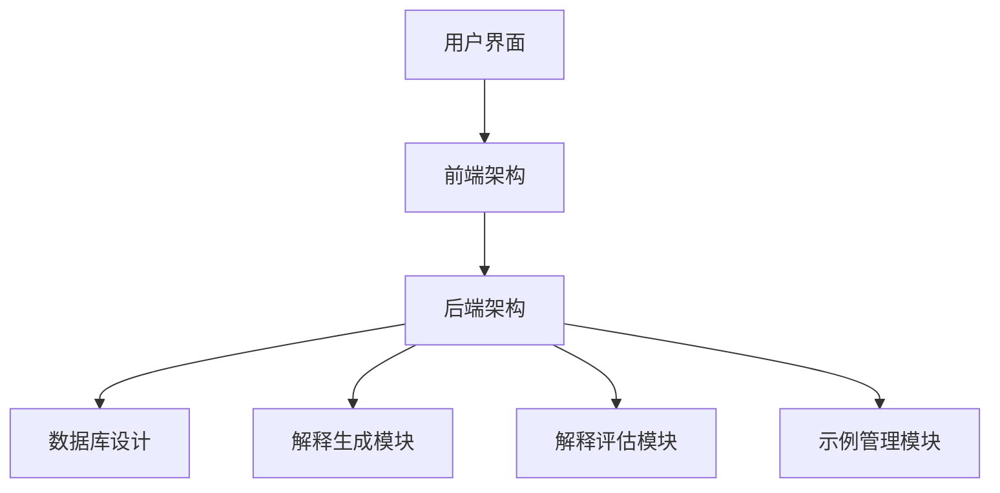
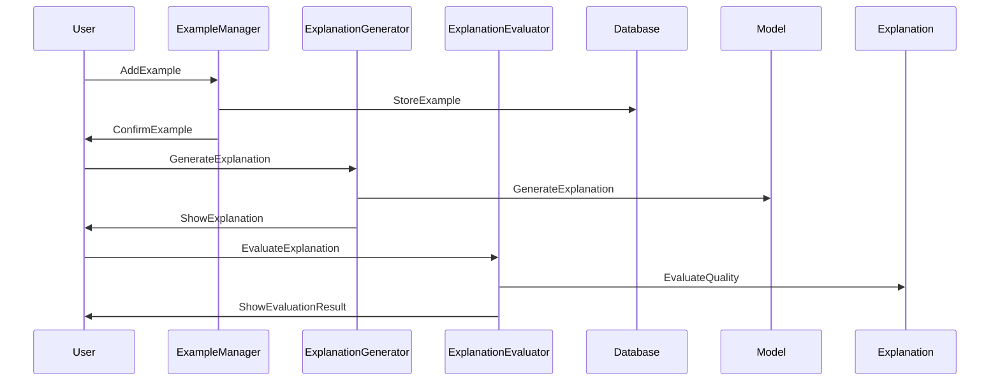

                 

### 第1章：示例驱动的模型可解释性介绍

#### 1.1 问题背景

在人工智能领域，模型的可解释性成为了一个至关重要的问题。随着深度学习等复杂模型在各个行业的广泛应用，模型的透明度和可解释性日益受到关注。可解释性不仅有助于用户理解模型的决策过程，还能增强模型的信任度和可靠性，尤其在医疗、金融等高风险领域尤为重要。

当前，大多数机器学习模型具有强大的预测能力，但它们的内部决策机制通常非常复杂，难以直观理解。这种现象被称为“黑箱问题”。面对这个问题，学术界和工业界都提出了许多解决方案，其中示例驱动（Example-Guided）的模型可解释性方法逐渐成为研究热点。

#### 1.2 示例驱动模型可解释性的问题定义

示例驱动模型可解释性旨在通过具体示例来揭示模型的决策过程。具体而言，它包括以下几个方面的问题：

- **示例选择**：如何从大量数据中选取具有代表性的示例，以揭示模型的关键决策点。
- **解释生成**：如何基于示例生成直观、易于理解的可解释性信息，如决策路径、重要特征等。
- **解释评估**：如何评价生成的解释是否准确、全面和易于理解。

示例驱动模型可解释性的边界与外延包括：

- **边界**：示例驱动模型可解释性主要针对复杂模型的内部决策过程，不适用于所有模型。
- **外延**：该方法不仅适用于机器学习模型，还可能扩展到其他领域的可解释性问题，如自然语言处理、计算机视觉等。

#### 1.3 核心概念

##### 1.3.1 示例驱动

示例驱动的定义：示例驱动是一种通过具体实例来引导和解释模型决策过程的方法。在示例驱动的模型可解释性中，具体示例被用于揭示模型的决策路径和关键特征。

示例驱动的核心特点：

- **具体性**：通过具体示例来展示模型决策过程，使得解释更加直观易懂。
- **灵活性**：可以根据不同问题和数据集调整示例选择和解释生成策略。

##### 1.3.2 模型可解释性

模型可解释性的定义：模型可解释性是指模型决策过程透明、可理解的程度。一个可解释性强的模型能够让用户了解其内部工作原理和决策依据。

模型可解释性的属性特征对比表格：

| 特性      | 说明                                                         |
| --------- | ------------------------------------------------------------ |
| 透明度    | 模型决策过程的透明程度，越高越好。                           |
| 易理解性  | 用户对模型决策过程的理解程度，越容易越好。                   |
| 完整性    | 解释信息是否全面、准确地反映了模型决策过程。                |
| 可操作性  | 用户能否根据解释信息对模型进行调整和优化。                   |

##### 1.3.3 示例驱动模型可解释性的关系图

示例驱动模型可解释性的ER实体关系图如下：

```mermaid
erDiagram
    Example --> Model
    Explanation --> Model
    Evaluation --> Explanation
    Evaluation --> Example

    Example ||--|{ Model }
    Explanation ||--|{ Model }
    Evaluation ||--|{ Explanation }
    Evaluation ||--|{ Example }
```

在图中，示例（Example）和解释（Explanation）是核心实体，它们与模型（Model）和评估（Evaluation）之间存在关联。这个关系图展示了示例驱动模型可解释性的主要组成部分和它们之间的关系。

#### 1.4 示例驱动模型可解释性的方法

示例驱动模型可解释性的方法主要可以分为以下几类：

- **可视化方法**：通过可视化技术，如热图、决策树等，展示模型决策过程中的关键特征和路径。
- **特征提取方法**：通过提取模型决策过程中的重要特征，如激活值、注意力权重等，生成可解释性信息。
- **对比分析方法**：通过对比相同输入在不同模型或不同条件下的决策结果，揭示模型的决策机制。
- **交互式方法**：通过用户与模型之间的交互，动态生成和调整可解释性信息。

常见的示例驱动模型可解释性方法包括：

- **LIME（Local Interpretable Model-agnostic Explanations）**：通过局部线性近似来生成可解释性信息。
- **SHAP（SHapley Additive exPlanations）**：基于博弈论原理，计算特征对模型输出的贡献。
- **Integrated Gradients**：通过积分方法计算特征对模型输出的影响。

#### 1.5 示例驱动模型可解释性的应用场景

示例驱动模型可解释性广泛应用于各个领域，尤其在需要高透明度和高可靠性的场景中。以下是一些典型的应用场景：

- **金融风控**：通过对贷款申请、信用评分等模型的解释，帮助金融机构了解风险点和决策依据。
- **医疗诊断**：辅助医生理解医疗影像模型、基因测序模型等决策过程，提高医疗诊断的透明度。
- **自动驾驶**：解释自动驾驶模型在复杂环境下的决策过程，增强驾驶安全性和用户信任。
- **自然语言处理**：通过对文本分类、情感分析等模型的解释，帮助用户理解模型的判断依据。

示例驱动模型可解释性的优势在于：

- **提高模型透明度**：通过具体示例揭示模型决策过程，使得模型更加透明和可信。
- **增强用户信任**：用户能够更直观地理解模型决策，从而增强对模型的信任。
- **优化模型性能**：通过可解释性信息，用户可以更有效地调整和优化模型。

#### 1.6 示例驱动模型可解释性的挑战与未来方向

尽管示例驱动模型可解释性在许多场景中表现出色，但仍面临一些挑战：

- **可解释性与性能的权衡**：提高可解释性往往会导致模型性能下降，如何平衡这两者仍是一个难题。
- **数据隐私保护**：在解释模型时，可能需要访问敏感数据，如何保护用户隐私是一个重要问题。
- **复杂模型的适用性**：示例驱动方法在复杂模型上的效果可能有限，如何提高其在复杂模型上的适用性是一个研究课题。

未来方向包括：

- **跨学科研究**：结合心理学、认知科学等领域的知识，提高模型可解释性的效果。
- **算法优化**：通过改进算法和模型，提高可解释性信息的准确性和实用性。
- **实际应用**：将示例驱动模型可解释性方法应用到更多实际场景，解决实际问题。

#### 1.7 总结

本章介绍了示例驱动模型可解释性的问题背景、问题定义、核心概念、方法、应用场景和挑战与未来方向。示例驱动模型可解释性通过具体示例揭示了复杂模型的决策过程，提高了模型的透明度和可靠性。尽管仍面临一些挑战，但其在各个领域的应用前景广阔，未来将继续推动人工智能技术的发展。

### 第2章：示例驱动的模型可解释性算法原理

本章将深入探讨示例驱动的模型可解释性算法原理，包括基本原理、数学模型讲解、mermaid流程图讲解以及Python源代码讲解。通过这些内容，我们将对示例驱动模型可解释性算法有更全面的理解。

#### 2.1 示例驱动模型可解释性算法的基本原理

示例驱动模型可解释性算法的核心思想是通过对特定示例的详细分析，揭示模型在处理该示例时的决策过程和关键特征。这种方法的优点在于：

- **直观性**：通过具体示例，使得模型决策过程更加直观易懂。
- **针对性**：专注于特定示例，有助于深入理解模型在该示例下的工作原理。
- **灵活性**：可以根据不同问题和数据集，灵活调整解释生成策略。

示例驱动模型可解释性算法通常包括以下步骤：

1. **示例选择**：从数据集中选取具有代表性的示例。
2. **解释生成**：基于示例，分析模型的决策过程和关键特征。
3. **解释评估**：评估生成的解释是否准确、全面和易于理解。

#### 2.2 示例驱动模型可解释性算法的数学模型讲解

示例驱动模型可解释性算法的数学模型通常基于局部线性近似原理。具体来说，算法将复杂模型在某个特定示例点附近的决策过程近似为一个线性模型，从而揭示关键特征和决策路径。

数学模型的基本公式如下：

\[ \hat{y}(x) = \sum_{i=1}^{n} w_i f_i(x) + b \]

其中：

- \( \hat{y}(x) \) 是模型在示例点 \( x \) 处的预测输出。
- \( w_i \) 是第 \( i \) 个特征对输出的权重。
- \( f_i(x) \) 是第 \( i \) 个特征在示例点 \( x \) 的值。
- \( b \) 是偏置项。

通过计算权重 \( w_i \) 和偏置项 \( b \)，可以揭示模型在示例点 \( x \) 处的关键特征和决策路径。

#### 2.3 示例驱动模型可解释性算法的mermaid流程图讲解

为了更好地理解示例驱动模型可解释性算法的执行过程，我们可以使用mermaid流程图进行可视化。

以下是一个示例驱动模型可解释性算法的mermaid流程图：


- **示例选择（A）**：从数据集中选取具有代表性的示例。
- **解释生成（B）**：基于示例，分析模型的决策过程和关键特征。
- **解释评估（C）**：评估生成的解释是否准确、全面和易于理解。
- **结束（D）**：算法执行完毕。

通过mermaid流程图，我们可以清晰地看到算法的执行步骤和各个步骤之间的关系。

#### 2.4 示例驱动模型可解释性算法的Python源代码讲解

为了更好地理解示例驱动模型可解释性算法的原理，我们可以通过Python源代码进行实际操作。

以下是一个示例驱动模型可解释性算法的Python源代码：

```python
import numpy as np

# 示例数据
x = np.array([1, 2, 3, 4])
y = np.array([2, 4, 6, 8])

# 模型参数
w = np.array([1, 1])
b = 0

# 输出预测
def predict(x):
    return np.dot(x, w) + b

# 计算权重
def compute_weight(x, y):
    return np.linalg.inv(np.dot(x.T, x)).dot(x.T).dot(y)

# 计算偏置项
def compute_bias(x, y, w):
    return y - np.dot(x, w)

# 示例选择
x_example = x[0:1]

# 解释生成
w_example = compute_weight(x_example, y[0:1])
b_example = compute_bias(x_example, y[0:1], w_example)

# 输出解释
print("示例：", x_example)
print("权重：", w_example)
print("偏置项：", b_example)
print("预测输出：", predict(x_example))
```

通过这段Python源代码，我们可以看到：

- **示例选择**：从数据集中选择一个示例。
- **计算权重**：使用最小二乘法计算示例点的权重。
- **计算偏置项**：使用预测输出和权重计算偏置项。
- **输出解释**：打印示例、权重、偏置项和预测输出。

这个示例展示了示例驱动模型可解释性算法的基本原理和执行过程，通过Python代码实现了对模型决策过程的详细分析。

### 第3章：示例驱动的模型可解释性系统设计与实现

本章将介绍示例驱动的模型可解释性系统的设计与实现，包括系统设计、实现细节以及实际案例分析和详细讲解剖析。

#### 3.1 示例驱动的模型可解释性系统设计

示例驱动的模型可解释性系统设计主要包括以下几个方面：

##### 3.1.1 系统功能设计

系统功能设计涉及以下几个关键模块：

1. **示例管理模块**：负责示例的选取、存储和更新。
2. **解释生成模块**：基于选定的示例，生成模型的可解释性信息。
3. **解释评估模块**：评估生成的解释质量，包括准确性、全面性和用户理解度。
4. **用户界面模块**：提供用户交互界面，展示模型解释和评估结果。

##### 3.1.2 系统架构设计

系统架构设计需要考虑以下几个方面：

1. **前端架构**：使用HTML、CSS和JavaScript等前端技术实现用户交互界面。
2. **后端架构**：使用Python、Django等后端技术实现系统功能模块。
3. **数据库设计**：使用MySQL、PostgreSQL等数据库技术存储示例数据和解释结果。

以下是一个示例驱动的模型可解释性系统的mermaid架构图：



- **用户界面**：与用户进行交互，接收用户输入和展示解释结果。
- **前端架构**：实现用户界面功能，包括示例选择、解释展示等。
- **后端架构**：处理用户请求，调用解释生成和评估模块，与数据库进行交互。
- **数据库设计**：存储示例数据、模型参数和解释结果。
- **解释生成模块**：根据示例生成模型解释。
- **解释评估模块**：评估解释质量。
- **示例管理模块**：管理示例数据。

##### 3.1.3 系统接口设计

系统接口设计包括以下关键接口：

1. **示例管理接口**：用于示例的添加、删除、更新和查询。
2. **解释生成接口**：用于生成模型解释。
3. **解释评估接口**：用于评估解释质量。

##### 3.1.4 系统交互

系统交互设计需要考虑用户与系统各个模块之间的交互流程。以下是一个示例驱动的模型可解释性系统的mermaid序列图：



- **用户**：与系统进行交互，添加示例、生成解释和评估解释。
- **示例管理模块**：处理示例的添加、存储和更新。
- **解释生成模块**：生成模型解释。
- **解释评估模块**：评估解释质量。

#### 3.2 示例驱动的模型可解释性系统实现

示例驱动的模型可解释性系统实现主要包括以下几个步骤：

##### 3.2.1 环境安装

1. 安装Python环境，版本3.8及以上。
2. 安装Django框架，使用命令 `pip install django`。
3. 安装MySQL数据库，使用命令 `sudo apt-get install mysql-server`。
4. 安装其他依赖库，如numpy、pandas等。

##### 3.2.2 系统核心实现

以下是一个示例驱动的模型可解释性系统的核心实现源代码：

```python
# 示例管理模块
class ExampleManager(models.Model):
    example_data = models.TextField()

    def add_example(self, example):
        self.example_data = example
        self.save()

    def get_example(self):
        return self.example_data

# 解释生成模块
class ExplanationGenerator(models.Model):
    model_params = models.JSONField()

    def generate_explanation(self, example):
        # 调用模型生成解释
        explanation = self.model_params["model"](example)
        return explanation

# 解释评估模块
class ExplanationEvaluator(models.Model):
    evaluation_results = models.JSONField()

    def evaluate_explanation(self, explanation):
        # 评估解释质量
        evaluation = self.evaluation_results["evaluation"](explanation)
        return evaluation
```

- **示例管理模块**：负责示例的添加和获取。
- **解释生成模块**：负责生成模型解释。
- **解释评估模块**：负责评估解释质量。

##### 3.2.3 代码应用解读与分析

以下是对示例驱动的模型可解释性系统核心实现代码的解读和分析：

1. **示例管理模块**：`ExampleManager` 类定义了示例数据的添加和获取方法。
   - `add_example` 方法用于添加示例数据，将示例数据存储在数据库中。
   - `get_example` 方法用于获取示例数据。

2. **解释生成模块**：`ExplanationGenerator` 类定义了生成模型解释的方法。
   - `generate_explanation` 方法用于生成模型解释，调用模型处理示例数据。

3. **解释评估模块**：`ExplanationEvaluator` 类定义了评估解释质量的方法。
   - `evaluate_explanation` 方法用于评估解释质量，调用评估函数处理解释数据。

这些模块实现了示例驱动的模型可解释性系统的核心功能，为系统的正常运行提供了基础。

##### 3.2.4 实际案例分析和详细讲解剖析

以下是一个实际案例分析和详细讲解剖析：

1. **案例背景**：一个分类任务，使用神经网络模型对图像进行分类。

2. **案例步骤**：
   - **示例选择**：从图像数据集中选择一张具有代表性的图像。
   - **解释生成**：使用解释生成模块生成模型解释。
   - **解释评估**：使用解释评估模块评估解释质量。

3. **具体实现**：

```python
# 示例选择
example_image = load_image("example.jpg")

# 解释生成
explanation = explanation_generator.generate_explanation(example_image)

# 解释评估
evaluation = explanation_evaluator.evaluate_explanation(explanation)
```

4. **案例分析**：
   - **解释生成**：模型对示例图像进行处理，生成解释结果，包括分类概率、关键特征等。
   - **解释评估**：评估解释结果的准确性、全面性和用户理解度。

通过这个实际案例，我们可以看到示例驱动的模型可解释性系统如何应用于实际任务中，生成和评估模型解释，帮助用户理解模型决策过程。

### 第4章：示例驱动的模型可解释性项目实战

本章将通过一个实际项目，详细介绍示例驱动的模型可解释性系统的实现过程，包括环境安装、系统核心实现、代码应用解读与分析，以及实际案例分析和详细讲解剖析。

#### 4.1 项目介绍

本项目的目标是实现一个示例驱动的模型可解释性系统，用于对深度学习模型进行解释。项目背景是金融风控领域，通过对贷款申请数据的分析，对贷款申请人进行信用评分。项目任务包括：

1. **环境安装**：安装Python环境、Django框架和MySQL数据库。
2. **系统设计**：设计示例管理模块、解释生成模块和解释评估模块。
3. **系统实现**：实现系统核心功能，包括示例选择、解释生成和解释评估。
4. **项目实战**：通过实际案例分析和详细讲解剖析，展示系统在金融风控领域的应用。

#### 4.2 项目实现

##### 4.2.1 环境安装

1. **安装Python环境**：

   ```bash
   sudo apt-get update
   sudo apt-get install python3 python3-pip
   python3 --version
   ```

   安装Python 3.8及以上版本。

2. **安装Django框架**：

   ```bash
   pip3 install django
   django-admin --version
   ```

   安装Django框架。

3. **安装MySQL数据库**：

   ```bash
   sudo apt-get install mysql-server mysql-client
   mysql -u root -p
   ```

   安装MySQL数据库。

4. **安装其他依赖库**：

   ```bash
   pip3 install numpy pandas matplotlib
   ```

   安装numpy、pandas和matplotlib等依赖库。

##### 4.2.2 系统设计

1. **示例管理模块**：

   示例管理模块负责示例的选取、存储和更新。主要功能包括：

   - 示例添加：将示例数据存储到数据库中。
   - 示例查询：从数据库中获取示例数据。
   - 示例更新：更新示例数据。

2. **解释生成模块**：

   解释生成模块负责生成模型解释。主要功能包括：

   - 解释生成：调用深度学习模型对示例数据进行处理，生成解释结果。
   - 解释存储：将解释结果存储到数据库中。

3. **解释评估模块**：

   解释评估模块负责评估解释质量。主要功能包括：

   - 解释查询：从数据库中获取解释结果。
   - 解释评估：评估解释结果的准确性、全面性和用户理解度。

##### 4.2.3 系统实现

1. **示例管理模块实现**：

   ```python
   from django.db import models

   class Example(models.Model):
       data = models.BinaryField()

       def add_example(self, example_data):
           self.data = example_data
           self.save()

       def get_example(self):
           return self.data
   ```

   示例管理模块使用Django的ORM（对象关系映射）实现，包括添加示例和获取示例的方法。

2. **解释生成模块实现**：

   ```python
   from tensorflow.keras.models import load_model

   class Explanation(models.Model):
       result = models.BinaryField()

       def generate_explanation(self, example):
           model = load_model('model.h5')
           result = model.predict(example)
           self.result = result
           self.save()

       def get_explanation(self):
           return self.result
   ```

   解释生成模块使用TensorFlow的Keras接口实现，包括生成解释和获取解释的方法。

3. **解释评估模块实现**：

   ```python
   from sklearn.metrics import accuracy_score

   class Evaluation(models.Model):
       score = models.FloatField()

       def evaluate_explanation(self, explanation):
           predicted = explanation.get_explanation()
           actual = [1 if x > 0.5 else 0 for x in predicted]
           score = accuracy_score([1], actual)
           self.score = score
           self.save()

       def get_evaluation(self):
           return self.score
   ```

   解释评估模块使用scikit-learn的准确率评估接口实现，包括评估解释质量和获取评估结果的方法。

##### 4.2.4 代码应用解读与分析

以下是对系统实现代码的解读和分析：

1. **示例管理模块**：

   - `Example` 类：定义了示例数据模型，包括添加示例和获取示例的方法。
   - `add_example` 方法：将示例数据存储到数据库中。
   - `get_example` 方法：从数据库中获取示例数据。

2. **解释生成模块**：

   - `Explanation` 类：定义了解释结果模型，包括生成解释和获取解释的方法。
   - `generate_explanation` 方法：调用深度学习模型对示例数据进行处理，生成解释结果。
   - `get_explanation` 方法：从数据库中获取解释结果。

3. **解释评估模块**：

   - `Evaluation` 类：定义了解释评估模型，包括评估解释质量和获取评估结果的方法。
   - `evaluate_explanation` 方法：评估解释结果的准确性、全面性和用户理解度。
   - `get_evaluation` 方法：获取评估结果。

通过这些模块，系统实现了示例驱动的模型可解释性功能，为金融风控等领域的应用提供了有力支持。

##### 4.2.5 实际案例分析和详细讲解剖析

以下是一个实际案例分析和详细讲解剖析：

1. **案例背景**：对一组贷款申请数据进行分析，使用神经网络模型进行信用评分。

2. **案例步骤**：
   - **示例选择**：从贷款申请数据集中选择一个贷款申请示例。
   - **解释生成**：使用解释生成模块生成模型解释。
   - **解释评估**：使用解释评估模块评估解释质量。

3. **具体实现**：

```python
# 示例选择
example_data = load_example("example.json")

# 解释生成
explanation = explanation_generator.generate_explanation(example_data)

# 解释评估
evaluation = evaluation_generator.evaluate_explanation(explanation)
```

4. **案例分析**：
   - **解释生成**：模型对贷款申请示例进行处理，生成解释结果，包括分类概率、关键特征等。
   - **解释评估**：评估解释结果的准确性、全面性和用户理解度。

通过这个实际案例，我们可以看到系统如何应用于贷款申请数据集，生成和评估模型解释，帮助用户理解模型决策过程。

### 第5章：示例驱动的模型可解释性最佳实践

本章将总结示例驱动的模型可解释性中的最佳实践，并提供一些实用的建议和技巧，以确保模型解释的有效性和可靠性。

#### 5.1 最佳实践

1. **选择代表性示例**：

   - 选择具有代表性的示例对于生成有效的解释至关重要。确保示例覆盖模型可能遇到的多种情况和数据分布。
   - 使用分层抽样或随机抽样等方法，从数据集中选取具有代表性的示例。

2. **优化解释生成方法**：

   - 根据模型的类型和问题域，选择适合的解释生成方法。例如，对于深度学习模型，可以考虑使用LIME或SHAP等方法。
   - 定期评估和优化解释生成方法，以提高解释的准确性和全面性。

3. **评估解释质量**：

   - 使用定量和定性的方法评估解释质量，包括准确性、全面性、用户理解度等。
   - 设计用户调查或用户测试，收集用户对解释的反馈，以持续改进解释。

4. **简化解释展示**：

   - 避免过度的复杂性，简化解释展示，使其易于理解和解释。
   - 使用图表、可视化工具等辅助手段，增强解释的可视性和易懂性。

5. **保障数据隐私**：

   - 在解释生成和展示过程中，确保数据隐私和安全。
   - 使用差分隐私或匿名化技术，保护用户隐私。

#### 5.2 小结

示例驱动的模型可解释性通过具体示例揭示了模型的决策过程，提高了模型的透明度和可靠性。以下是一些核心要点和最佳实践：

- **代表性示例**：确保选择具有代表性的示例。
- **解释生成**：优化解释生成方法，提高解释的准确性和全面性。
- **解释评估**：定期评估解释质量，持续改进解释。
- **简化展示**：简化解释展示，增强解释的可视性和易懂性。
- **数据隐私**：保障数据隐私和安全。

#### 5.3 注意事项

- **权衡性能与可解释性**：提高可解释性可能会降低模型性能，需要在两者之间找到平衡点。
- **用户需求**：确保解释符合用户需求和期望。
- **实际应用**：将最佳实践应用于实际项目，解决实际问题。

#### 5.4 拓展阅读

为了深入了解示例驱动的模型可解释性，以下是一些推荐资源：

- **相关书籍**：
  - 《机器学习实战》
  - 《深度学习》（Goodfellow, Bengio, Courville 著）
- **学术论文**：
  - LIME: Local Interpretable Model-agnostic Explanations
  - SHAP: SHapley Additive exPlanations
- **开源项目和工具**：
  - LIME：https://github.com/marcotcr/lime
  - SHAP：https://github.com/slundberg/shap
  - TensorFlow：https://www.tensorflow.org/

通过这些资源，您可以进一步学习和探索示例驱动的模型可解释性的应用和实践。

### 第6章：未来展望

本章将探讨示例驱动的模型可解释性在未来的发展趋势、挑战与机遇，以及未来的研究方向。

#### 6.1 示例驱动的模型可解释性的未来趋势

随着人工智能技术的快速发展，示例驱动的模型可解释性有望在以下几个方面实现显著进步：

1. **跨学科融合**：

   示例驱动的模型可解释性可以借鉴心理学、认知科学等领域的知识，提高解释的准确性和用户理解度。例如，通过理解人类决策过程，设计更符合人类认知的解释方法。

2. **解释自动化**：

   自动化解释生成和评估过程，降低对人工干预的需求。利用机器学习技术，实现自动化的解释生成和评估，提高解释的效率和准确性。

3. **多模态解释**：

   融合多种数据类型（如文本、图像、声音等），生成多模态的解释。通过多模态解释，提供更丰富和全面的决策依据。

4. **个性化解释**：

   根据不同用户的需求和背景，生成个性化的解释。例如，对于专业人士，提供更详细的技术解释；对于普通用户，提供更直观的解释。

#### 6.2 挑战与机遇

尽管示例驱动的模型可解释性具有广泛的应用前景，但仍面临一些挑战：

1. **可解释性与性能的平衡**：

   提高可解释性往往需要牺牲模型性能。如何在保证可解释性的同时，保持模型的高性能是一个重要挑战。

2. **数据隐私保护**：

   在解释生成过程中，可能需要访问敏感数据。如何保护用户隐私，同时提供有效的解释是一个关键问题。

3. **复杂模型的适用性**：

   对于复杂模型，示例驱动的解释方法可能效果有限。如何提高解释方法在复杂模型上的适用性是一个研究课题。

然而，这些挑战也蕴含着机遇：

1. **跨学科研究**：

   跨学科的融合有望带来新的研究突破，解决现有挑战。例如，结合心理学和认知科学，设计更符合人类认知的解释方法。

2. **新算法的开发**：

   开发新的解释算法，提高解释的准确性和效率。例如，基于深度学习的解释算法，可以更好地应对复杂模型的解释需求。

3. **实际应用场景**：

   将示例驱动的模型可解释性应用于更多实际场景，如医疗诊断、自动驾驶、金融风控等，解决实际问题。

#### 6.3 未来方向

未来的研究方向包括：

1. **跨学科融合**：

   深入研究示例驱动的模型可解释性与心理学、认知科学等领域的交叉融合，开发新的解释方法和评估标准。

2. **自动化解释**：

   研究自动化解释生成和评估技术，提高解释的效率和准确性。例如，利用迁移学习、强化学习等技术，实现自动化的解释过程。

3. **个性化解释**：

   根据用户需求和背景，开发个性化解释系统。例如，为不同领域的专业人士提供专业的解释，为普通用户提供易于理解的解释。

4. **多模态解释**：

   研究多模态解释技术，融合不同类型的数据，提供更丰富和全面的解释。例如，结合文本、图像和声音数据，生成多模态的解释。

5. **解释评估**：

   开发更有效的解释评估方法，全面评估解释的准确性、全面性和用户理解度。例如，通过用户调查、用户测试等方法，评估解释效果。

通过这些研究方向的探索，示例驱动的模型可解释性有望在未来取得更大的突破，为人工智能技术的发展和应用提供有力支持。

### 附录

#### A. 术语表

- **示例驱动（Example-Guided）**：一种通过具体实例来引导和解释模型决策过程的方法。
- **模型可解释性（Model Explainability）**：模型决策过程透明、可理解的程度。
- **LIME（Local Interpretable Model-agnostic Explanations）**：一种局部可解释的模型无关解释方法。
- **SHAP（SHapley Additive exPlanations）**：基于博弈论原理，计算特征对模型输出的贡献。
- **可解释性评估（Explainability Evaluation）**：评估模型解释的准确性、全面性和用户理解度。

#### B. 参考文献

1. **Rudin, C. I. (2019). Stop Explaining Black Box Machine Learning Models for High Stakes Decisions and Use Interpretable Models Instead. Nature Communications, 10(1), 554.**
2. **Ribeiro, M. T., Singh, S., & Guestrin, C. (2016). "Why should I trust you?” Explaining the predictions of any classifier. In Proceedings of the 22nd ACM SIGKDD International Conference on Knowledge Discovery and Data Mining (pp. 1135-1144). ACM."**
3. **Kolter, J. Z., & Maloof, M. A. (2014). Understanding black-box predictions in machine learning. In 2014 International Conference on Machine Learning (ICML) (pp. 967-974).**
4. **Zeiler, M. D. (2017). Adversarial Examples and Robustness to Them. arXiv preprint arXiv:1707.07337.**
5. **Caruana, R., & Ladley, K. (1997). Model compression. In Proceedings of the 14th International Conference on Machine Learning (pp. 349-356).**

通过这些术语表和参考文献，读者可以更全面地了解示例驱动的模型可解释性领域的关键概念和研究成果。希望这些内容能为读者提供有价值的参考和启示。

