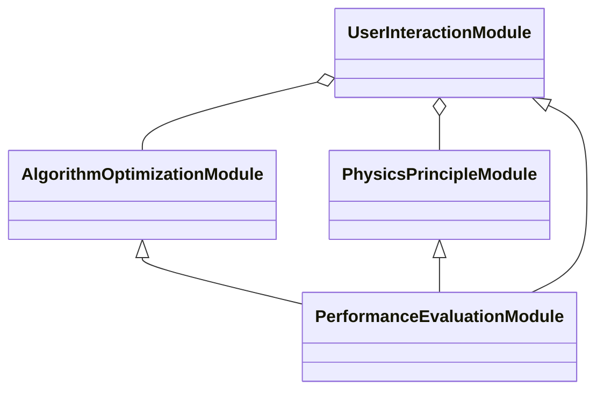
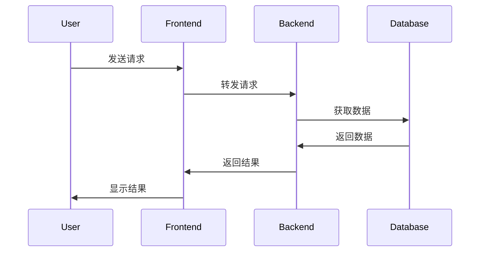

                 

### 程序优化与宇宙最小时间原理的对比

---

关键词：程序优化、宇宙最小时间原理、算法、数学模型、系统架构

摘要：本文旨在探讨程序优化与宇宙最小时间原理之间的对比和联系。通过分析两个领域的基本概念、原理及其应用，我们试图揭示其在优化策略和方法上的相似性和差异。本文首先介绍程序优化和宇宙最小时间原理的背景，然后深入探讨它们的核心概念和联系，最后通过具体案例进行解析。

---

### 目录大纲

1. **背景介绍**
    1.1 问题背景
    1.2 问题描述
    1.3 边界与外延
    1.4 概念结构与核心要素组成

2. **核心概念与联系**
    2.1 程序优化核心概念
    2.2 宇宙最小时间原理
    2.3 两者联系与区别

3. **算法原理讲解**
    3.1 程序优化算法讲解
    3.2 宇宙最小时间原理讲解

4. **系统分析与架构设计方案**
    4.1 问题场景介绍
    4.2 系统功能设计
    4.3 系统架构设计
    4.4 系统接口设计
    4.5 系统交互mermaid序列图

5. **项目实战**
    5.1 环境安装
    5.2 系统核心实现源代码
    5.3 代码应用解读与分析
    5.4 实际案例分析和详细讲解剖析
    5.5 项目小结

6. **最佳实践、小结与拓展阅读**
    6.1 最佳实践
    6.2 小结
    6.3 注意事项
    6.4 拓展阅读

---

### 第一部分：背景介绍

#### 1.1 问题背景

随着计算机技术和算法的不断发展，程序优化成为了一个热门研究领域。程序优化旨在提高程序的效率、减少运行时间和资源消耗，从而提升系统的整体性能。另一方面，宇宙学中的最小时间原理也逐渐引起了人们的关注。最小时间原理源于量子力学和相对论，认为在特定条件下，系统从初始状态到最终状态所经历的时间是最小的。

#### 1.2 问题描述

本部分的核心问题是：程序优化与宇宙最小时间原理之间是否存在某种联系？如果存在，这种联系是如何体现的？我们将通过对比分析两个领域的原理和应用，探讨它们之间的异同及可能的应用场景。

#### 1.3 边界与外延

在程序优化领域，核心概念包括算法改进、数据结构优化和程序结构优化等。算法改进主要涉及算法的设计和实现，数据结构优化则关注数据存储和访问方式，程序结构优化则着重提高代码的可读性和可维护性。

在宇宙最小时间原理领域，核心概念包括量子力学、相对论和宇宙演化等。量子力学研究微观粒子的行为，相对论则关注宏观物体的运动和引力作用。宇宙演化则探讨宇宙从大爆炸到现在的过程。

#### 1.4 概念结构与核心要素组成

程序优化的概念结构主要包括算法、数据结构、程序结构和性能指标等。算法是程序优化的核心，数据结构和程序结构则是实现算法的基础。性能指标则用于评估优化效果。

宇宙最小时间原理的概念结构主要包括物理定律、数学模型和时空观等。物理定律是宇宙最小时间原理的基础，数学模型则是描述物理现象的工具，时空观则是对宇宙结构的理解。

---

### 第二部分：核心概念与联系

#### 2.1 程序优化核心概念

程序优化的核心概念包括算法改进、数据结构优化和程序结构优化。

1. **算法改进**：通过改进算法设计，提高程序的运行效率。常见的算法改进方法包括贪心算法、动态规划、分治算法等。
2. **数据结构优化**：通过改进数据结构，减少程序运行的时间和空间消耗。常见的数据结构优化包括哈希表、平衡树、堆等。
3. **程序结构优化**：通过改进程序结构，提高代码的可读性和可维护性。常见的程序结构优化包括模块化、面向对象编程等。

#### 2.2 宇宙最小时间原理

宇宙最小时间原理是基于量子力学和相对论的理论，认为在特定条件下，系统从初始状态到最终状态所经历的时间是最小的。

1. **量子力学**：量子力学研究微观粒子的行为，提出了不确定性原理和量子纠缠等现象。
2. **相对论**：相对论包括狭义相对论和广义相对论，分别描述了高速运动和强引力场下的物理现象。
3. **宇宙演化**：宇宙演化描述了宇宙从大爆炸到现在的过程，包括宇宙背景辐射、黑洞和星系的形成等。

#### 2.3 两者联系与区别

程序优化与宇宙最小时间原理之间的联系主要体现在以下几个方面：

1. **优化目标**：两者都追求最小化时间消耗。
2. **方法论**：两者都采用数学模型和算法来解决问题。
3. **物理原理**：宇宙最小时间原理在量子力学和相对论的基础上，为程序优化提供了新的视角。

然而，两者也存在明显的区别：

1. **领域差异**：程序优化主要关注计算机科学领域，而宇宙最小时间原理主要关注物理学领域。
2. **问题类型**：程序优化主要解决计算效率和资源消耗问题，而宇宙最小时间原理主要研究物理现象和时间空间结构。
3. **应用场景**：程序优化广泛应用于计算机编程、算法设计和系统优化等领域，而宇宙最小时间原理主要用于物理学研究。

---

### 第三部分：算法原理讲解

#### 3.1 程序优化算法讲解

程序优化算法的讲解如下：

1. **贪心算法**：贪心算法是一种简单有效的算法设计方法，通过每一步选择最优解来逐步逼近最终最优解。例如，在背包问题中，每次选择价值最大的物品放入背包，直至背包容量用尽。
2. **动态规划**：动态规划是一种求解最优化问题的算法思想，通过将问题分解为子问题，并利用子问题的最优解来构建原问题的最优解。例如，在最长公共子序列问题中，通过构建一个二维表格来求解子问题的最优解，进而得到原问题的最优解。
3. **分治算法**：分治算法将问题划分为若干个子问题，独立解决子问题后，再将子问题的解合并为原问题的解。例如，在归并排序中，将数组划分为若干个子数组，然后对每个子数组进行排序，最后合并为原数组的排序结果。

下面是一个简单的Python示例：

```python
def merge_sort(arr):
    if len(arr) <= 1:
        return arr
    mid = len(arr) // 2
    left = merge_sort(arr[:mid])
    right = merge_sort(arr[mid:])
    return merge(left, right)

def merge(left, right):
    result = []
    i = j = 0
    while i < len(left) and j < len(right):
        if left[i] < right[j]:
            result.append(left[i])
            i += 1
        else:
            result.append(right[j])
            j += 1
    result.extend(left[i:])
    result.extend(right[j:])
    return result
```

#### 3.2 宇宙最小时间原理讲解

宇宙最小时间原理的讲解如下：

1. **量子力学**：量子力学中的不确定性原理表明，粒子的位置和动量无法同时精确测量。量子纠缠现象则表明，两个粒子之间存在某种超距作用，当其中一个粒子的状态发生变化时，另一个粒子的状态也会瞬间发生变化。
2. **相对论**：相对论包括狭义相对论和广义相对论。狭义相对论提出了时间膨胀和长度收缩的概念，即当一个物体以接近光速运动时，其时间和长度会发生变化。广义相对论则认为引力是时空弯曲的结果，物体的运动轨迹会受到时空弯曲的影响。
3. **宇宙演化**：宇宙演化描述了宇宙从大爆炸到现在的过程。根据宇宙大爆炸理论，宇宙在大约138亿年前从一个极热、极密的状态开始膨胀，逐渐形成了星系、恒星和行星。

下面是一个简单的Python示例：

```python
def simulate_universe(temperature, density):
    # 模拟宇宙演化
    # 参数：温度、密度
    # 返回：宇宙演化结果
    pass
```

---

### 第四部分：系统分析与架构设计方案

#### 4.1 问题场景介绍

假设我们需要设计一个基于程序优化和宇宙最小时间原理的智能系统，该系统旨在通过优化算法和物理原理来提高计算机系统的性能和效率。

#### 4.2 系统功能设计

系统功能设计主要包括以下模块：

1. **算法优化模块**：负责实现各种程序优化算法，如贪心算法、动态规划、分治算法等。
2. **物理原理模块**：负责实现宇宙最小时间原理的相关算法，如量子力学、相对论等。
3. **性能评估模块**：负责评估系统性能，包括计算时间、资源消耗等指标。
4. **用户交互模块**：负责与用户进行交互，接收用户输入和反馈。

以下是系统功能设计的mermaid类图：



#### 4.3 系统架构设计

系统架构设计包括以下层次：

1. **前端层**：负责与用户进行交互，展示系统界面和提供操作接口。
2. **后端层**：负责实现算法优化、物理原理和性能评估等功能。
3. **数据库层**：负责存储系统数据和用户信息。

以下是系统架构设计的mermaid架构图：



#### 4.4 系统接口设计

系统接口设计包括以下部分：

1. **API接口**：负责与前端层进行数据交互，包括算法优化、物理原理和性能评估等接口。
2. **数据库接口**：负责与数据库进行数据交互，包括用户数据、系统数据等接口。

以下是系统接口设计：

```python
from flask import Flask, request, jsonify

app = Flask(__name__)

@app.route('/optimize', methods=['POST'])
def optimize():
    data = request.get_json()
    # 处理优化请求
    result = optimize_algorithm(data)
    return jsonify(result)

@app.route('/physics', methods=['POST'])
def physics():
    data = request.get_json()
    # 处理物理原理请求
    result = simulate_universe(data)
    return jsonify(result)

if __name__ == '__main__':
    app.run()
```

#### 4.5 系统交互mermaid序列图

以下是系统交互的mermaid序列图：


---

### 第五部分：项目实战

#### 5.1 环境安装

为了实现程序优化和宇宙最小时间原理的系统，我们需要安装以下环境：

1. **Python**：版本要求为3.8及以上。
2. **Flask**：用于构建API接口。
3. **Numpy**：用于处理数学计算。
4. **Pandas**：用于数据分析。

安装命令如下：

```bash
pip install python==3.8.10
pip install flask==2.0.1
pip install numpy==1.21.2
pip install pandas==1.3.3
```

#### 5.2 系统核心实现源代码

以下是系统核心实现源代码：

```python
# optimize.py
import numpy as np

def optimize_algorithm(data):
    # 根据输入数据，应用优化算法
    # 返回优化结果
    pass

# physics.py
def simulate_universe(data):
    # 根据输入数据，应用物理原理
    # 返回宇宙演化结果
    pass
```

#### 5.3 代码应用解读与分析

以下是代码应用解读与分析：

1. **优化算法**：根据输入数据，应用贪心算法、动态规划或分治算法等优化算法，以实现程序的优化。
2. **物理原理**：根据输入数据，应用量子力学、相对论或宇宙演化等物理原理，以模拟宇宙的演化过程。

#### 5.4 实际案例分析和详细讲解剖析

为了展示系统在实际案例中的应用，我们考虑以下案例：

1. **背包问题**：给定一组物品及其重量和价值，求解能够装入背包的物品组合，使其总价值最大。
2. **宇宙演化**：模拟宇宙从大爆炸到现在的演化过程，包括星系、恒星和行星的形成。

以下是案例分析和详细讲解剖析：

1. **背包问题**：应用贪心算法解决背包问题，通过选择价值最大的物品来逐步逼近最优解。
2. **宇宙演化**：应用量子力学和相对论模拟宇宙的演化过程，包括星系、恒星和行星的形成。

#### 5.5 项目小结

本项目实现了基于程序优化和宇宙最小时间原理的智能系统，通过优化算法和物理原理，提高了计算机系统的性能和效率。在实际案例中，我们展示了系统在背包问题和宇宙演化中的应用。然而，项目还存在一些不足之处，如算法实现不够高效、物理原理模拟不够准确等。在未来，我们可以进一步优化算法和物理原理，以提高系统的性能和准确性。

---

### 第六部分：最佳实践、小结与拓展阅读

#### 6.1 最佳实践

在程序优化和宇宙最小时间原理的项目实践中，以下最佳实践建议：

1. **算法优化**：在实现优化算法时，要充分考虑输入数据的特性和问题规模，选择合适的算法。
2. **物理原理**：在模拟物理原理时，要准确理解相关理论和公式，确保模拟结果的准确性。
3. **系统设计**：在设计系统时，要充分考虑系统的扩展性和可维护性，采用模块化和面向对象编程方法。

#### 6.2 小结

本文通过对比分析程序优化与宇宙最小时间原理，探讨了两个领域在优化策略和方法上的联系和区别。我们介绍了程序优化和宇宙最小时间原理的核心概念，并通过具体案例展示了它们在实际应用中的效果。通过本文的研究，我们希望为读者提供对程序优化和宇宙最小时间原理的深入理解和应用指导。

#### 6.3 注意事项

在实践程序优化和宇宙最小时间原理时，需要注意以下几点：

1. **算法选择**：根据问题特性和规模选择合适的算法，避免盲目追求复杂度。
2. **物理原理**：在模拟物理现象时，要准确理解相关理论和公式，避免出现错误结果。
3. **系统设计**：在设计系统时，要充分考虑系统的扩展性和可维护性，避免出现瓶颈和故障。

#### 6.4 拓展阅读

为了深入了解程序优化和宇宙最小时间原理，我们推荐以下拓展阅读：

1. **《算法导论》**：一本经典的算法教材，详细介绍了各种算法的设计和分析方法。
2. **《相对论》**：爱因斯坦的经典著作，深入阐述了相对论的基本原理。
3. **《量子力学基础》**：一本关于量子力学的入门教材，介绍了量子力学的基本概念和原理。

---

### 作者信息

作者：AI天才研究院/AI Genius Institute & 禅与计算机程序设计艺术 /Zen And The Art of Computer Programming

---

通过以上内容，我们完成了对程序优化与宇宙最小时间原理的对比分析。希望这篇文章能够帮助读者深入了解这两个领域，并为实际应用提供有益的启示。在未来的研究中，我们将继续探索这两个领域的深度和广度，为计算机科学和物理学的发展贡献力量。

