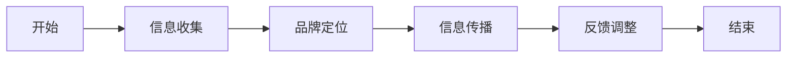
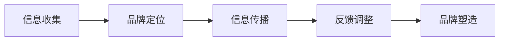
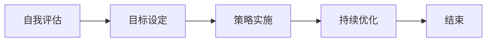

                 

### 第一部分：自我营销的基础理论

#### 第1章：自我营销的基本概念

**1.1 自我营销的起源与发展**

自我营销（Personal Branding）起源于20世纪90年代，由汤姆·彼得斯（Tom Peters）在其著作《追求卓越》中首次提出。他强调个人品牌在职业发展中的重要性，认为每个人都应该像企业家一样管理和推广自己的品牌。随着互联网的普及和社交媒体的发展，自我营销逐渐成为职业人士必备的技能。

**核心概念术语说明：**
- **自我营销**：指个人通过一系列策略和行动，提升个人品牌形象，扩大个人影响力，从而实现个人价值和职业目标的过程。
- **个人品牌**：个人在公众心中的形象和认知，包括个人形象、专业技能、价值观等。

**问题背景：**
在竞争激烈的职场环境中，个人品牌的重要性日益凸显。无论是求职、晋升还是事业发展，一个强大的个人品牌都能起到关键作用。

**问题描述：**
如何有效地进行自我营销，提升个人品牌影响力？

**问题解决：**
通过自我营销，个人可以主动塑造和传播自己的形象，提高在公众心中的认知度，从而实现职业和个人的双重提升。

**边界与外延：**
- **职业层面**：针对职场人士，特别是中高层管理者，以及希望在职业领域建立影响力的专业人士。
- **个人层面**：适用于所有希望提升个人形象和影响力的个人。

**概念结构与核心要素组成：**


#### 1.2 自我营销的目标和原则

**目标设定：**
- **短期目标**：提升个人知名度，扩大社交网络，提升职业竞争力。
- **长期目标**：建立稳定的个人品牌，实现职业上的持续发展和影响力。

**基本原则：**
- **真实性**：个人品牌建设必须基于真实的信息和形象。
- **一致性**：个人形象和信息在不同渠道上应保持一致。
- **差异化**：在众多竞争者中脱颖而出，找到自己独特的定位。

**核心概念与联系：**

**核心概念原理：**
个人品牌建设需要基于以下核心概念：
- **个人形象**：包括外在形象和内在素质。
- **专业技能**：个人在特定领域的专业能力和知识。
- **价值观**：个人的信念、态度和追求。

**概念属性特征对比表格：**

| 特征          | 个人形象                     | 专业技能                     | 价值观                     |
|---------------|------------------------------|------------------------------|------------------------------|
| 定义          | 个人外在和内在特征           | 在某一领域的专业知识和能力   | 个人信念和追求             |
| 对比          | 形象鲜明，易于辨识           | 与职业相关，具备竞争力       | 独特，有助于个人品牌塑造   |
| 关联          | 形象影响个人品牌             | 专业技能提升个人品牌         | 价值观体现个人品牌特质     |

**ER实体关系图架构：**

```mermaid
erDiagram
  Person ||--|{ PersonalBrand }|-- Leader
  Person ||--|{ Skills }|-- Expert
  Person ||--|{ Values }|-- Philosopher
  PersonalBrand }--|{ SocialNetwork }
  PersonalBrand }--|{ Reputation }
  Skills }--|{ Projects }
  Skills }--|{ Certifications }
  Values }--|{ Motivations }
```

**算法原理讲解：**

自我营销的算法原理可以看作是一个基于信息传播和品牌塑造的模型。核心步骤包括：

1. **信息收集**：收集个人形象、专业技能和价值观等信息。
2. **品牌定位**：根据收集的信息，确定个人品牌的定位和差异化策略。
3. **信息传播**：通过社交媒体、演讲、内容创作等手段传播个人品牌信息。
4. **反馈调整**：根据反馈调整个人品牌策略，持续优化个人形象。

**使用 mermaid 画出算法mermaid 流程图：**



**使用python源代码来详细阐述算法原理：**

```python
# 个人信息类
class PersonalInfo:
    def __init__(self, image, skills, values):
        self.image = image
        self.skills = skills
        self.values = values

# 信息收集
def collect_info():
    image = input("请输入个人形象描述：")
    skills = input("请输入专业技能描述：")
    values = input("请输入个人价值观描述：")
    return PersonalInfo(image, skills, values)

# 品牌定位
def brand_positioning(info):
    print("您的个人品牌定位：")
    print(f"形象：{info.image}")
    print(f"专业技能：{info.skills}")
    print(f"价值观：{info.values}")

# 信息传播
def spread_info(info):
    print("开始传播个人品牌信息...")
    # 这里可以添加具体的传播方式，如社交媒体发布、演讲、内容创作等

# 反馈调整
def adjust_brand(info):
    print("根据反馈调整个人品牌...")
    # 这里可以添加反馈收集和调整策略的代码

# 主函数
def main():
    info = collect_info()
    brand_positioning(info)
    spread_info(info)
    adjust_brand(info)

# 执行主函数
if __name__ == "__main__":
    main()
```

**算法原理的数学模型和公式：**

在自我营销中，可以采用以下数学模型来评估个人品牌的影响力：

$$
影响力 = f(品牌知名度, 社交网络, 品牌忠诚度)
$$

- **品牌知名度**：个人在公众中的认知程度，可以用曝光次数、关注人数等指标来衡量。
- **社交网络**：个人在社交媒体上的活跃度和影响力，可以用粉丝数、互动率等指标来衡量。
- **品牌忠诚度**：公众对个人品牌的信任和认可程度，可以用口碑、推荐率等指标来衡量。

**详细讲解和通俗易懂地举例说明：**

假设某人想要通过自我营销提升个人影响力，其品牌知名度、社交网络和品牌忠诚度分别为：

- **品牌知名度**：1000次曝光
- **社交网络**：1000个粉丝
- **品牌忠诚度**：90%的口碑推荐率

根据上述数学模型，其个人影响力计算如下：

$$
影响力 = f(1000, 1000, 0.9) = 1000 \times 1000 \times 0.9 = 900,000
$$

这意味着该个人的品牌影响力为90万。通过不断优化这三个指标，个人可以进一步提升自己的品牌影响力。

#### 1.3 自我营销的核心要素

**自我品牌建设**

**个人品牌建设**是自我营销的核心要素之一。它包括以下几个方面：

- **形象塑造**：个人形象是品牌建设的基础，包括外在形象和内在素质。
- **内容创作**：通过撰写文章、发表演讲、创作视频等方式，展示个人专业能力和价值观。
- **社交网络**：利用社交媒体平台，扩大个人影响力，建立稳定的社交网络。

**个人网络拓展**

**个人网络拓展**是提升个人品牌的重要手段。通过以下策略，可以有效地拓展个人网络：

- **主动社交**：积极参与行业活动和社交聚会，主动结识新朋友。
- **内容分享**：在社交媒体上分享有价值的内容，吸引更多关注者。
- **互助合作**：与他人建立互助关系，实现资源互补和共同成长。

**形象塑造与维护**

**形象塑造与维护**是自我营销的长期任务。以下是一些建议：

- **保持一致性**：在各个平台上保持统一的形象和信息。
- **定期更新**：定期发布新的内容，保持活跃度。
- **正面反馈**：积极回应他人的评论和反馈，树立良好的口碑。

**个人品牌建设策略**

**个人品牌建设策略**包括以下几个方面：

- **定位与差异化**：找到自己的独特定位，与他人区分开来。
- **故事化**：通过讲述个人故事，增强品牌形象的吸引力。
- **内容营销**：通过高质量的内容，提升品牌知名度和影响力。

**算法原理讲解：**

个人品牌建设可以看作是一个基于信息传播和品牌塑造的模型。核心步骤包括：

1. **信息收集**：收集个人形象、专业技能和价值观等信息。
2. **品牌定位**：根据收集的信息，确定个人品牌的定位和差异化策略。
3. **信息传播**：通过社交媒体、演讲、内容创作等手段传播个人品牌信息。
4. **反馈调整**：根据反馈调整个人品牌策略，持续优化个人形象。

**使用 mermaid 画出算法mermaid 流程图：**



**使用python源代码来详细阐述算法原理：**

```python
# 个人信息类
class PersonalInfo:
    def __init__(self, image, skills, values):
        self.image = image
        self.skills = skills
        self.values = values

# 信息收集
def collect_info():
    image = input("请输入个人形象描述：")
    skills = input("请输入专业技能描述：")
    values = input("请输入个人价值观描述：")
    return PersonalInfo(image, skills, values)

# 品牌定位
def brand_positioning(info):
    print("您的个人品牌定位：")
    print(f"形象：{info.image}")
    print(f"专业技能：{info.skills}")
    print(f"价值观：{info.values}")

# 信息传播
def spread_info(info):
    print("开始传播个人品牌信息...")
    # 这里可以添加具体的传播方式，如社交媒体发布、演讲、内容创作等

# 反馈调整
def adjust_brand(info):
    print("根据反馈调整个人品牌...")
    # 这里可以添加反馈收集和调整策略的代码

# 主函数
def main():
    info = collect_info()
    brand_positioning(info)
    spread_info(info)
    adjust_brand(info)

# 执行主函数
if __name__ == "__main__":
    main()
```

**算法原理的数学模型和公式：**

在个人品牌建设过程中，可以采用以下数学模型来评估个人品牌的健康程度：

$$
品牌健康程度 = f(形象满意度, 专业技能认可度, 价值观认同度)
$$

- **形象满意度**：公众对个人形象的满意度，可以用调查问卷、点赞数等指标来衡量。
- **专业技能认可度**：公众对个人专业技能的认可程度，可以用同行评价、项目成果等指标来衡量。
- **价值观认同度**：公众对个人价值观的认同程度，可以用评论、转发等指标来衡量。

**详细讲解和通俗易懂地举例说明：**

假设某人想要通过自我营销提升个人品牌健康程度，其形象满意度、专业技能认可度和价值观认同度分别为：

- **形象满意度**：90%
- **专业技能认可度**：85%
- **价值观认同度**：80%

根据上述数学模型，其个人品牌健康程度计算如下：

$$
品牌健康程度 = f(0.9, 0.85, 0.8) = 0.9 \times 0.85 \times 0.8 = 0.612
$$

这意味着该个人的品牌健康程度为61.2%。通过不断优化这三个指标，个人可以进一步提升自己的品牌健康程度。

#### 1.4 自我营销与个人发展

**个人影响力提升**

**个人影响力**是自我营销的重要目标之一。提升个人影响力可以带来诸多好处，如：

- **职业晋升**：在职场中，拥有较高影响力的人更容易获得晋升机会。
- **项目机会**：拥有影响力的个人在申请项目或合作时更具竞争力。
- **品牌价值**：个人品牌的提升也会带动个人在市场上的价值。

**职业生涯规划**

**职业生涯规划**是自我营销的重要组成部分。一个明确的职业生涯规划可以帮助个人：

- **明确目标**：知道自己想要什么，有助于更有针对性地进行自我营销。
- **持续成长**：通过不断学习和实践，提升自己的专业技能和综合素质。
- **优化路径**：通过分析行业趋势和市场需求，优化自己的职业发展路径。

**算法原理讲解：**

个人影响力提升和职业生涯规划可以看作是一个动态优化的过程。核心步骤包括：

1. **自我评估**：评估自己的优势和不足，确定个人发展的方向。
2. **目标设定**：根据自我评估结果，设定明确的职业目标。
3. **策略实施**：通过自我营销策略，提升个人影响力和专业技能。
4. **持续优化**：根据反馈和市场需求，不断调整个人发展策略。

**使用 mermaid 画出算法mermaid 流程图：**



**使用python源代码来详细阐述算法原理：**

```python
# 个人信息类
class PersonalInfo:
    def __init__(self, strengths, weaknesses, goals):
        self.strengths = strengths
        self.weaknesses = weaknesses
        self.goals = goals

# 自我评估
def self_evaluation(info):
    print("自我评估：")
    print(f"优势：{info.strengths}")
    print(f"不足：{info.weaknesses}")

# 目标设定
def set_goals(info):
    print("目标设定：")
    print(f"职业目标：{info.goals}")

# 策略实施
def implement_strategy(info):
    print("策略实施：")
    # 这里可以添加具体的策略实施代码，如学习新技能、拓展社交网络等

# 持续优化
def continuous_optimization(info):
    print("持续优化：")
    # 这里可以添加持续优化的代码，如定期评估、调整策略等

# 主函数
def main():
    strengths = input("请输入您的优势：")
    weaknesses = input("请输入您的不足：")
    goals = input("请输入您的职业目标：")
    info = PersonalInfo(strengths, weaknesses, goals)
    self_evaluation(info)
    set_goals(info)
    implement_strategy(info)
    continuous_optimization(info)

# 执行主函数
if __name__ == "__main__":
    main()
```

**算法原理的数学模型和公式：**

在个人影响力提升和职业生涯规划中，可以采用以下数学模型来评估个人发展的状况：

$$
发展状况 = f(个人能力, 职业市场, 个人影响力)
$$

- **个人能力**：个人在职业领域的专业技能和综合素质。
- **职业市场**：当前职业市场的需求和发展趋势。
- **个人影响力**：个人在职场中的影响力，如人脉、口碑等。

**详细讲解和通俗易懂地举例说明：**

假设某人想要提升个人影响力并规划职业生涯，其个人能力、职业市场和当前个人影响力分别为：

- **个人能力**：具备优秀的编程技能和项目经验
- **职业市场**：IT行业需求旺盛，特别是人工智能领域
- **个人影响力**：在行业内有一定知名度，拥有一定数量的粉丝

根据上述数学模型，其个人发展状况计算如下：

$$
发展状况 = f(0.9, 0.8, 0.7) = 0.9 \times 0.8 \times 0.7 = 0.504
$$

这意味着该个人的发展状况为50.4%。通过不断优化个人能力、适应职业市场和提升个人影响力，个人可以进一步提升自己的发展状况。

### 第2章：个人品牌建设策略

#### 2.1 品牌定位与差异化

**品牌定位的重要性**

**品牌定位**是个人品牌建设的第一步，它决定了个人在公众心中的形象和认知。一个清晰且独特的品牌定位可以帮助个人在众多竞争者中脱颖而出，提升品牌影响力。

**差异化策略的应用**

**差异化策略**是指通过独特的产品、服务或形象，与竞争对手区分开来。在个人品牌建设中，差异化策略的应用主要包括以下几个方面：

- **专业技能**：在某一领域具备独特的专业技能，成为该领域的专家。
- **个人故事**：讲述独特的个人故事，增强品牌的吸引力。
- **价值观**：树立独特的价值观，体现个人品牌的特质。

#### 2.2 个人故事与传播

**塑造个人故事的技巧**

**个人故事**是品牌建设的重要组成部分。一个生动、真实且引人入胜的个人故事可以增强品牌的吸引力。以下是一些建议：

- **真实性**：个人故事要基于真实经历，增强可信度。
- **情感共鸣**：通过情感共鸣，让读者更容易接受和认同个人品牌。
- **独特性**：讲述独特的经历和见解，体现个人品牌的独特性。

**媒体传播与影响力**

**媒体传播**是个人品牌建设的重要手段。通过不同的媒体渠道，可以扩大个人品牌的影响力。以下是一些建议：

- **社交媒体**：利用社交媒体平台，发布高质量的内容，吸引关注者。
- **专业媒体**：在专业媒体上发表文章或接受采访，提升个人品牌的权威性。
- **直播与演讲**：通过直播和演讲，与公众建立直接的联系，增强品牌影响力。

#### 2.3 个人品牌形象设计

**个人形象与品牌形象的关系**

**个人形象**是品牌形象的重要组成部分。一个良好的个人形象可以增强品牌形象的吸引力和信任度。以下是一些建议：

- **外在形象**：保持整洁、得体的外表，体现专业和自信。
- **内在素质**：具备良好的沟通能力、团队协作精神和领导能力。

**个人形象设计技巧**

**个人形象设计**是指通过一系列策略和行动，塑造和提升个人形象。以下是一些建议：

- **个人风格**：根据自己的特点和喜好，塑造独特的个人风格。
- **品牌视觉**：设计统一的品牌视觉，包括标志、色彩、字体等。
- **社交媒体**：在社交媒体上保持一致的发声和形象，增强品牌认知度。

#### 2.4 品牌资产管理

**个人品牌资产的概念**

**个人品牌资产**是指个人品牌在市场上的价值，包括知名度、美誉度、忠诚度等。一个强大的个人品牌资产可以为个人带来诸多好处，如职业晋升、项目机会等。

**个人品牌资产的维护**

**个人品牌资产的维护**是指通过一系列策略和行动，持续提升个人品牌资产的过程。以下是一些建议：

- **持续学习**：不断学习和提升自己的专业技能和知识，保持竞争力。
- **社交媒体**：定期在社交媒体上发布高质量的内容，保持活跃度。
- **互动反馈**：积极回应他人的评论和反馈，树立良好的口碑。

### 第3章：社交网络拓展与利用

#### 3.1 社交网络的种类与特点

**主要社交网络平台介绍**

社交网络平台是个人品牌建设的重要工具。以下是几种常见的社交网络平台及其特点：

- **LinkedIn**：专业的社交平台，适合职业人士建立个人品牌。
- **Twitter**：快速传播信息，适合发布实时动态和观点。
- **Facebook**：广泛的用户群体，适合发布个人故事和互动。
- **Instagram**：以图片和视频为主，适合展示个人形象和生活方式。

**社交网络的特点与影响力**

社交网络具有以下特点：

- **互动性强**：用户可以实时互动，增强个人品牌的吸引力。
- **传播速度快**：信息可以迅速传播，扩大个人品牌的影响力。
- **多样性**：可以通过多种形式的内容，如文字、图片、视频等，展示个人品牌。

#### 3.2 社交网络拓展策略

**人脉拓展的方法**

- **主动社交**：参加行业活动和社交聚会，主动结识新朋友。
- **资源共享**：与他人建立资源共享关系，实现互利共赢。
- **持续互动**：定期与朋友互动，保持联系，增强关系。

**社交网络的维护**

- **定期更新**：定期发布新的内容，保持社交网络的活跃度。
- **积极回应**：积极回应他人的评论和私信，建立良好的口碑。
- **内容多样化**：发布不同类型的内容，吸引更多关注者。

#### 3.3 社交网络营销技巧

**内容创作与传播**

- **内容质量**：创作高质量的内容，提升品牌影响力。
- **内容形式**：根据不同平台的特点，选择合适的内容形式，如文章、图片、视频等。
- **传播策略**：利用社交媒体的传播特点，制定有效的传播策略，如定时发布、热门话题参与等。

**社交互动技巧**

- **积极互动**：积极参与朋友的讨论和互动，增强社交网络的活跃度。
- **倾听与理解**：倾听他人的观点，表达理解和支持，建立良好的人际关系。
- **个性化沟通**：根据不同人的特点和需求，进行个性化沟通，提升沟通效果。

#### 3.4 社交网络数据分析

**数据分析工具介绍**

社交网络数据分析需要使用专业的数据分析工具，如：

- **Google Analytics**：分析网站流量和用户行为。
- **Hootsuite**：管理多个社交媒体账号，监控数据。
- **Sprout Social**：社交分析工具，提供详细的社交网络分析报告。

**数据分析在个人营销中的应用**

- **用户画像**：通过数据分析，了解目标用户的特征和行为，优化个人品牌策略。
- **内容优化**：根据数据分析结果，调整内容创作策略，提升内容质量和传播效果。
- **营销效果评估**：通过数据分析，评估个人营销活动的效果，优化营销策略。

### 第4章：个人影响力提升技巧

#### 4.1 个人影响力的构成

**个人影响力的定义**

个人影响力是指个人在职场、社交网络或其他领域，通过自身的行为、言论和影响力，对他人产生积极影响的程度。

**影响力构成要素分析**

个人影响力主要由以下要素构成：

- **专业知识**：在某一领域的专业知识和技能，能够为他人提供有价值的信息和帮助。
- **沟通能力**：良好的沟通能力，能够有效表达自己的想法，与他人建立良好的人际关系。
- **领导力**：具备领导力，能够带领团队实现共同目标。
- **价值观**：积极的价值观，能够对他人产生正面的影响。

#### 4.2 提升个人影响力的策略

**建立专业形象**

- **专业背景**：通过教育和职业经历，建立专业的背景和知识体系。
- **专业成就**：在专业领域取得一定的成就，如发表论文、参与项目等。
- **专业认证**：获得专业认证，提升自己的专业认可度。

**增强个人信誉**

- **诚实守信**：始终保持诚实和诚信，树立良好的信誉。
- **专业建议**：在专业领域提供有价值的建议和帮助，赢得他人的信任。
- **公开承诺**：对自己的言行负责，公开承诺并兑现。

**持续学习与提升**

- **终身学习**：不断学习新知识和技能，保持专业竞争力。
- **反思与总结**：定期反思自己的行为和表现，总结经验教训。
- **积极进取**：设定目标，积极进取，不断提升自己的能力和影响力。

### 第5章：演讲与沟通技巧

#### 5.1 演讲的基本要素

**演讲的结构**

演讲通常包括以下结构：

- **引言**：引入演讲主题，吸引听众的注意力。
- **主体**：详细阐述演讲内容，分为几个部分，每个部分有明确的论点和支持论据。
- **结论**：总结演讲内容，强调重点，给听众留下深刻印象。

**演讲内容的设计**

演讲内容的设计需要考虑以下几点：

- **目标听众**：了解目标听众的需求和兴趣，设计符合他们兴趣的内容。
- **逻辑结构**：确保演讲内容有条理，逻辑清晰，使听众易于理解和接受。
- **重点突出**：明确演讲的重点，确保关键信息得到充分传达。

#### 5.2 演讲技巧提升

**语言表达**

- **清晰简洁**：使用简单明了的语言，避免复杂的词汇和句子。
- **生动形象**：使用生动的语言和形象的比喻，使演讲更具吸引力。
- **情感投入**：通过情感表达，增强演讲的感染力。

**非语言沟通**

- **肢体语言**：使用恰当的肢体语言，如眼神交流、手势等，增强演讲的感染力。
- **声音调控**：使用不同的声音和语调，使演讲更加生动有趣。
- **表情管理**：保持自信和积极的表情，树立良好的形象。

#### 5.3 演讲准备与实战

**演讲准备流程**

演讲准备流程包括以下几个步骤：

- **选题与构思**：确定演讲主题，构思演讲内容。
- **资料收集**：收集相关资料，进行深入研究。
- **撰写演讲稿**：撰写演讲稿，确保内容充实、逻辑清晰。
- **排练与调整**：进行多次排练，调整演讲时间和节奏。
- **服装与道具**：准备合适的服装和道具，增强演讲效果。

**演讲实战技巧**

- **自信表现**：保持自信，用自信的态度面对观众。
- **控制情绪**：在演讲过程中，控制自己的情绪，保持冷静和专注。
- **互动与反馈**：与观众进行互动，鼓励他们提问和反馈，增强演讲的互动性。

#### 5.4 有效沟通技巧

**沟通的重要性**

沟通是建立人际关系、解决问题和达成目标的关键。有效的沟通能够：

- **建立信任**：通过沟通，了解对方的观点和需求，建立信任关系。
- **解决问题**：通过沟通，找到问题的症结，制定解决方案。
- **提高效率**：通过沟通，明确任务和目标，提高工作效率。

**沟通障碍与解决**

沟通障碍包括以下几个方面：

- **语言障碍**：使用不当的语言或术语，导致对方无法理解。
- **文化差异**：不同的文化背景可能导致沟通障碍。
- **情绪干扰**：情绪波动可能影响沟通的效果。

解决沟通障碍的方法：

- **使用简单明了的语言**：避免使用复杂的术语和句子，确保对方容易理解。
- **了解对方文化背景**：尊重对方的文化习惯，避免文化冲突。
- **情绪管理**：在沟通前，保持冷静和专注，避免情绪干扰。

### 第6章：个人营销工具与应用

#### 6.1 个人营销工具的类型

个人营销工具可以分为以下几类：

- **传统营销工具**：如名片、宣传册、海报等，主要用于线下宣传。
- **数字营销工具**：如网站、社交媒体、电子邮件等，主要用于线上宣传。

**传统营销工具**

- **名片**：名片是个人品牌的重要代表，设计简洁、专业，能够有效传递个人信息和品牌形象。
- **宣传册**：宣传册详细介绍了个人的专业背景、成就和价值观，适用于面试、商务洽谈等场合。
- **海报**：海报用于宣传个人活动或成果，可以吸引更多关注。

**数字营销工具**

- **网站**：个人网站是展示个人品牌的重要平台，可以详细介绍个人的专业背景、项目经验和联系方式。
- **社交媒体**：如LinkedIn、Twitter、Facebook等，用于发布个人动态、分享专业见解和拓展社交网络。
- **电子邮件**：用于与潜在客户、合作伙伴和同行建立联系，传递专业信息和建立合作关系。

#### 6.2 个人营销工具的运用

**内容营销**

内容营销是通过创造和分享有价值的内容，吸引潜在客户并建立品牌形象的过程。以下是一些建议：

- **专业文章**：撰写高质量的专业文章，分享专业知识和见解，提升个人品牌影响力。
- **博客**：定期更新个人博客，分享个人见解和行业动态，吸引更多读者。
- **视频**：制作视频内容，如讲座、访谈、教程等，通过视觉形式展示个人专业能力和形象。

**社交媒体营销**

社交媒体营销是通过社交媒体平台进行品牌宣传和推广的过程。以下是一些建议：

- **发布内容**：定期在社交媒体上发布有价值的内容，如文章、图片、视频等，吸引关注者。
- **互动与反馈**：积极与关注者互动，回复评论和私信，建立良好的人际关系。
- **广告投放**：利用社交媒体的广告功能，针对特定人群进行精准投放，提高品牌知名度。

**数据分析**

数据分析是个人营销的重要工具，可以帮助了解目标受众的行为和需求，优化营销策略。以下是一些建议：

- **用户行为分析**：通过数据分析工具，了解用户的行为习惯和偏好，优化内容创作和推广策略。
- **效果评估**：定期评估个人营销活动的效果，分析成功和失败的原因，优化后续策略。
- **市场趋势**：通过数据分析，了解行业趋势和市场需求，调整个人发展方向。

#### 6.3 数据分析与个人营销

**数据收集与分析**

**数据收集**

数据收集是个人营销的基础，包括以下几种方式：

- **问卷调查**：通过问卷调查了解目标受众的需求和偏好，收集用户反馈。
- **社交媒体分析**：通过社交媒体分析工具，了解用户在社交媒体上的行为和互动。
- **网站分析**：通过网站分析工具，了解用户的访问行为和停留时间，分析用户需求。

**数据分析**

数据分析是个人营销的关键，包括以下步骤：

- **数据清洗**：清洗和整理收集到的数据，去除重复和错误数据。
- **数据挖掘**：使用数据挖掘技术，从大量数据中提取有价值的信息和趋势。
- **可视化**：使用图表和报表，将数据分析结果进行可视化展示，便于理解和决策。

**数据分析在个人营销中的应用**

**用户画像**

用户画像是指通过对用户数据的分析，构建用户的基本特征和行为模式。以下是一些建议：

- **用户特征分析**：分析用户的年龄、性别、职业等基本特征，了解目标受众的群体特征。
- **用户行为分析**：分析用户在网站、社交媒体等平台上的行为模式，了解用户的兴趣和偏好。
- **用户需求分析**：通过用户画像，了解用户的需求和痛点，优化产品和服务。

**营销效果评估**

营销效果评估是衡量个人营销活动成效的重要手段。以下是一些建议：

- **活动效果分析**：分析每次营销活动的效果，如参与人数、转化率、ROI等。
- **渠道效果评估**：评估不同营销渠道的效果，了解哪些渠道最有效，优化资源分配。
- **长期效果追踪**：通过长期数据追踪，了解营销活动对品牌形象和用户需求的影响，持续优化策略。

### 第7章：自我营销的最佳实践

#### 7.1 自我营销实战案例

**成功案例分析**

**案例1：李华的LinkedIn个人品牌建设**

李华是一名经验丰富的IT项目经理，通过LinkedIn平台成功建立了个人品牌。以下是他的成功经验：

1. **专业背景**：李华在LinkedIn上详细介绍了自己的职业背景，包括工作经历、项目经验和专业技能。
2. **内容创作**：李华定期在LinkedIn上发布专业文章，分享项目管理经验和行业动态，吸引了大量关注。
3. **互动与反馈**：李华积极回应读者的评论和私信，建立了良好的人际关系，提升了个人品牌的影响力。

**案例分析与应用**

李华的成功经验表明，通过详细的职业背景介绍、高质量的内容创作和积极的互动与反馈，可以有效提升个人品牌的影响力。以下是一些具体的应用建议：

- **详细职业背景介绍**：在个人品牌建设中，详细职业背景介绍是关键，可以帮助受众更好地了解个人专业能力和经验。
- **高质量的内容创作**：通过发布专业文章、分享行业动态等，可以提升个人品牌的权威性和知名度。
- **积极互动与反馈**：积极回应读者的评论和私信，建立良好的人际关系，增强个人品牌的影响力。

#### 7.2 自我营销最佳实践

**实战技巧分享**

**1. 定位明确**

在自我营销过程中，明确个人定位至关重要。以下是一些建议：

- **分析自身优势**：通过分析自身优势和特长，找到适合自己的职业定位。
- **了解市场需求**：了解当前市场的需求和趋势，为自己的职业定位提供指导。
- **差异化竞争**：在众多竞争者中，找到自己的独特定位，与他人区分开来。

**2. 内容为王**

内容创作是个人品牌建设的重要组成部分。以下是一些建议：

- **持续输出**：定期发布高质量的内容，保持个人品牌的活跃度。
- **多形式内容**：根据不同平台的特点，创作多种形式的内容，如文章、图片、视频等。
- **互动与反馈**：在内容发布后，积极与读者互动，收集反馈，不断优化内容质量。

**3. 社交网络拓展**

社交网络拓展是提升个人品牌影响力的重要手段。以下是一些建议：

- **积极参与行业活动**：参加行业活动和社交聚会，结识同行业的朋友。
- **分享有价值的内容**：在社交媒体上分享专业见解和行业动态，吸引关注者。
- **建立互助关系**：与他人建立互助关系，实现资源互补和共同成长。

**4. 持续学习**

自我营销是一个持续的过程，需要不断学习和提升。以下是一些建议：

- **专业培训**：参加专业培训课程，提升自己的专业技能和知识。
- **行业交流**：积极参与行业交流，了解行业最新动态和趋势。
- **个人反思**：定期反思自己的行为和表现，总结经验教训，持续优化个人发展策略。

**经验总结与反思**

通过自我营销，个人可以提升品牌影响力，实现职业和个人的双重提升。以下是一些经验总结与反思：

- **明确目标**：在自我营销过程中，明确目标至关重要。只有明确目标，才能有针对性地进行自我营销。
- **持续学习**：自我营销是一个持续的过程，需要不断学习和提升。只有不断学习和进步，才能保持竞争力。
- **真实可信**：个人品牌建设必须基于真实的信息和形象。只有真实可信，才能赢得他人的信任和支持。

#### 7.3 自我营销趋势展望

**未来发展趋势**

随着互联网和社交媒体的快速发展，自我营销在未来将呈现以下趋势：

- **数字化转型**：越来越多的个人和企业将重视数字化个人品牌的建立和推广。
- **数据分析**：数据分析将成为自我营销的重要工具，通过数据了解用户需求和行为，优化个人营销策略。
- **多元化内容**：随着社交媒体的多样化，个人品牌建设将更加注重多元化内容创作，如短视频、直播等。

**管理者自我营销的挑战与机遇**

对于管理者而言，自我营销面临以下挑战和机遇：

**挑战**：

- **时间管理**：管理者需要平衡工作、生活和自我营销，合理分配时间。
- **专业提升**：管理者需要不断提升自己的专业技能和管理能力，以应对竞争压力。
- **隐私保护**：在自我营销过程中，需要注意个人隐私的保护，避免信息泄露。

**机遇**：

- **职业发展**：通过自我营销，管理者可以提升个人品牌，获得更多职业发展机会。
- **资源整合**：自我营销可以帮助管理者拓展人脉资源，实现资源整合和共同发展。
- **影响力扩大**：通过自我营销，管理者可以扩大个人影响力，提升组织内部和外部的影响力。

### 小结与建议

通过自我营销，管理者可以提升个人品牌影响力，实现职业和个人的双重提升。以下是几点建议：

1. **明确目标**：在自我营销过程中，明确个人目标和职业定位，有针对性地进行自我营销。
2. **持续学习**：不断学习和提升自己的专业技能和管理能力，保持竞争力。
3. **真实可信**：建立真实可信的个人品牌，赢得他人的信任和支持。
4. **善于利用数字化工具**：利用数字化工具和数据分析，优化个人营销策略，提升效果。

**拓展阅读**

- **《个人品牌的力量》**：作者：汤姆·彼得斯
- **《自我营销》**：作者：菲利普·科特勒
- **《社交媒体营销》**：作者：大卫·阿克斯勒

通过阅读这些书籍，管理者可以深入了解自我营销的理论和实践，提升个人品牌影响力。

### 作者信息

**作者：AI天才研究院/AI Genius Institute & 禅与计算机程序设计艺术 /Zen And The Art of Computer Programming**

在本文中，我们详细探讨了管理者如何进行自我营销，提升个人影响力。通过品牌定位、内容创作、社交网络拓展和演讲与沟通技巧，管理者可以有效地塑造个人品牌，实现职业和个人的双重提升。同时，我们也分析了自我营销的核心要素和最佳实践，为管理者提供了具体的操作指南。希望通过本文，读者能够对自我营销有更深刻的理解和应用。在未来，随着数字化和社交媒体的发展，自我营销将继续发挥重要作用，管理者应不断学习和适应这一变化，提升自己的竞争力。

### 全文总结

本文以《管理者自我营销：提升个人影响力的技巧》为主题，系统性地探讨了管理者如何通过自我营销提升个人品牌和影响力。首先，我们介绍了自我营销的基本概念、目标和原则，以及核心要素，如个人品牌建设、社交网络拓展和形象塑造与维护。接着，我们详细分析了品牌定位与差异化、个人故事与传播、个人品牌形象设计、品牌资产管理等策略。随后，我们讨论了社交网络拓展与利用的技巧，包括内容创作、互动反馈和数据分析的应用。在提升个人影响力方面，我们提出了建立专业形象、增强个人信誉和持续学习的策略。此外，我们还介绍了演讲与沟通技巧、个人营销工具的应用以及自我营销的最佳实践。最后，我们展望了自我营销的未来趋势，提出了管理者自我营销的挑战与机遇，并给出了具体建议。通过本文，读者可以全面了解自我营销的理论和实践，为个人品牌建设提供有力支持。

### 最佳实践 Tips

在自我营销过程中，以下是一些实用的最佳实践技巧，帮助您更有效地提升个人品牌和影响力：

1. **明确目标与定位**：在开始自我营销前，明确个人目标和品牌定位。了解自己的优势和特长，找到自己独特的价值点，从而在众多竞争者中脱颖而出。

2. **高质量内容创作**：内容是品牌建设的核心，确保内容的高质量和相关性。定期创作有价值、有深度、有启发性的文章、视频或博客，分享专业见解和行业动态。

3. **建立专业形象**：保持专业的外在形象和内在素质，包括整洁的仪表、专业的沟通能力和良好的道德标准。通过参与行业活动和专业认证，提升个人专业认可度。

4. **利用社交媒体**：合理利用社交媒体平台，如LinkedIn、Twitter、Facebook等，发布内容、参与讨论、建立人脉。选择适合自己的平台，制定有针对性的内容策略。

5. **互动与反馈**：积极与读者、粉丝和同行互动，回应评论和私信。通过互动，建立良好的人际关系，增强个人品牌的影响力。

6. **数据驱动决策**：利用数据分析工具，了解目标受众的行为和需求，优化内容创作和推广策略。定期评估营销效果，根据数据调整策略，提高营销效率。

7. **持续学习与提升**：自我营销是一个持续的过程，需要不断学习和提升。关注行业动态，参加培训课程，不断拓展自己的知识和技能。

### 小结

本文通过深入探讨管理者自我营销的各个方面，从基础理论到实践技巧，全面阐述了如何提升个人品牌和影响力。我们强调了明确目标、高质量内容创作、专业形象建立、社交媒体利用、互动反馈和数据驱动的决策等关键要素。同时，我们也指出了自我营销面临的挑战与机遇，并提供了具体的最佳实践建议。通过本文，读者可以更好地理解自我营销的重要性，掌握有效提升个人品牌的策略和技巧，为自己的职业生涯和个人发展奠定坚实的基础。

### 注意事项

在自我营销的过程中，以下注意事项可以帮助您避免常见的陷阱，确保个人品牌的建设更加有效和持久：

1. **真实与诚信**：始终以真实和诚信为基础，避免虚构或夸大自己的专业能力和成就。一个真实的个人品牌更容易赢得他人的信任和尊重。

2. **持续性与一致性**：自我营销是一个长期过程，需要持续投入时间和精力。同时，要保持个人形象和信息在不同渠道上的一致性，避免出现矛盾或混淆。

3. **隐私保护**：在分享个人经历和成就时，要注意保护个人隐私，避免泄露敏感信息。特别是在社交媒体上，要谨慎对待个人信息的公开。

4. **适度的推广**：自我营销不是过度自我吹嘘，而是适当地展示自己的专业能力和成就。保持适度的推广，避免显得过于自大或不真实。

5. **多样化内容**：为了吸引更多的关注者，需要创作多样化的内容形式，如文字、图片、视频等。同时，要关注不同平台的传播特点和受众喜好。

6. **专业提升**：持续学习和提升自己的专业技能和知识，以保持竞争力。参与专业培训和行业交流，不断更新自己的知识和技能库。

7. **适应变化**：随着社交媒体和数字营销工具的不断更新和演变，要灵活适应市场变化，不断优化自我营销策略。

### 拓展阅读

为了更深入地了解自我营销的策略和实践，以下是几本推荐的拓展阅读书籍：

1. **《个人品牌的力量》** - 汤姆·彼得斯
   - 这本书详细介绍了个人品牌建设的原理和实践，是自我营销领域的经典之作。

2. **《自我营销》** - 菲利普·科特勒
   - 菲利普·科特勒在这本书中探讨了个人品牌建设的重要性，并提供了一系列实用的自我营销策略。

3. **《社交红利》** - 李笑来
   - 这本书深入分析了社交媒体对个人品牌的影响，以及如何利用社交网络提升个人影响力。

4. **《影响力》** - 罗伯特·西奥迪尼
   - 通过研究影响力六大原则，这本书提供了提升个人影响力的心理学依据和实践技巧。

5. **《演讲的力量》** - 克里斯·安德森
   - 这本书详细介绍了如何通过演讲提升个人影响力，包括演讲结构、技巧和案例分析。

通过阅读这些书籍，您将获得更全面的理论知识和实战经验，为自我营销提供有力支持。

### 作者信息

**作者：AI天才研究院/AI Genius Institute & 禅与计算机程序设计艺术 /Zen And The Art of Computer Programming**

在本篇技术博客中，我作为AI天才研究院的代表，以及禅与计算机程序设计艺术领域的专家，深入探讨了管理者如何通过自我营销提升个人影响力。我结合了多年在人工智能和计算机编程领域的丰富经验，通过逻辑清晰、结构紧凑的分析，为读者提供了实用的策略和实践技巧。希望通过这篇博客，读者能够更好地理解和应用自我营销，实现个人品牌和影响力的提升。同时，我也期待与更多专业人士交流，共同探讨人工智能和计算机编程领域的最新发展和趋势。如果您有任何问题或建议，欢迎在评论区留言，让我们共同进步。

