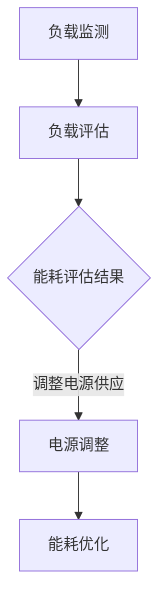
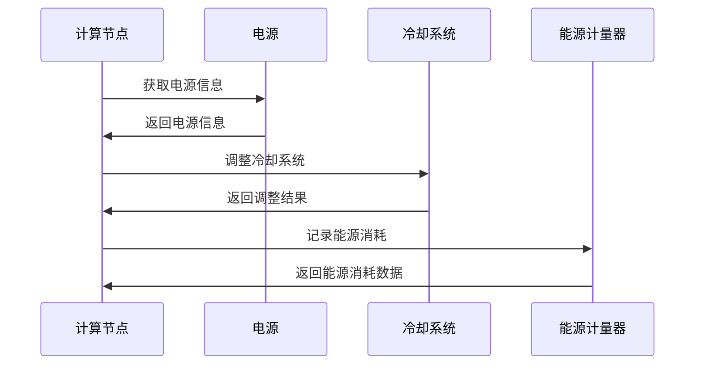
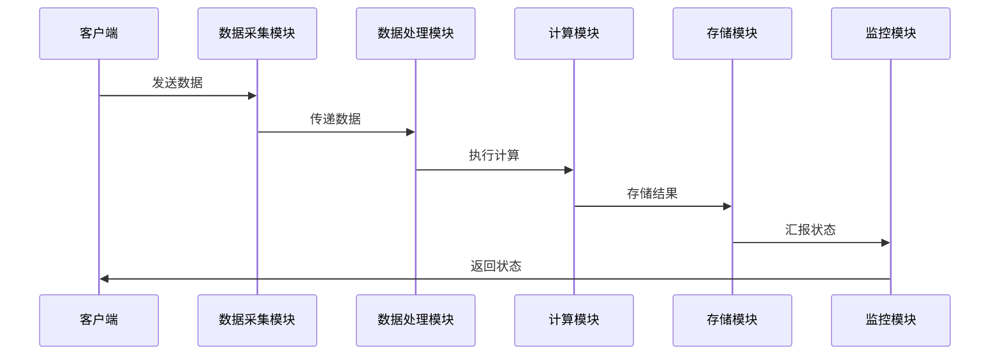
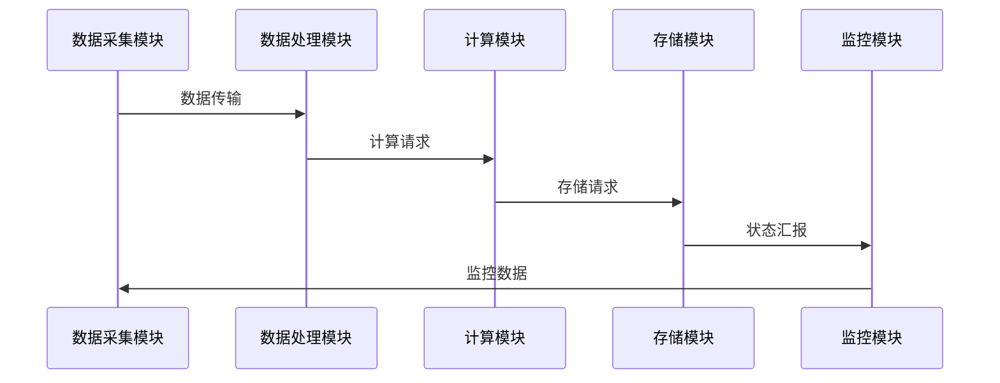

                 

## 绿色IT：计算密集型应用的能源效率优化

> 关键词：绿色IT、计算密集型应用、能源效率优化、算法、系统架构、项目实战

> 摘要：随着信息技术的迅猛发展，计算密集型应用在各个领域得到了广泛应用。然而，计算密集型应用的高能耗问题引起了广泛关注。本文将围绕绿色IT的概念、计算密集型应用的能源效率优化展开深入探讨，分析核心算法、系统架构设计以及项目实战，旨在为解决能源效率优化问题提供可行的解决方案和最佳实践。

### 目录大纲

1. **背景介绍与核心概念**
   - **绿色IT的概念与重要性**
     - **绿色IT的定义**
     - **绿色IT的重要性**
     - **计算密集型应用的定义**
   - **能源效率优化的核心概念**
     - **能源效率的定义**
     - **计算密集型应用的能源消耗**
     - **能源效率优化的目标与挑战**

2. **绿色IT的技术架构**
   - **绿色IT的技术架构概述**
     - **绿色IT的系统组成**
     - **绿色IT的关键技术**
   - **计算密集型应用的技术架构**
     - **计算密集型应用的系统需求**
     - **绿色IT在计算密集型应用中的应用**
   - **绿色IT的技术发展趋势**
     - **新型计算架构**
     - **分布式计算与云计算**
     - **智能节能技术**

3. **能源效率优化的核心算法**
   - **能源效率优化的基本原理**
     - **算法原理概述**
     - **算法应用场景**
   - **能源效率优化的算法类型**
     - **优化算法的类型分类**
     - **不同算法的比较与选择**
   - **算法原理与流程图**
     - **算法原理讲解**
     - **算法流程图**

4. **数学模型与公式详解**
   - **数学模型在能源效率优化中的应用**
     - **数学模型的基本概念**
     - **数学模型在能源效率优化中的重要性**
   - **数学公式的详细讲解**
     - **公式1: 能量消耗的计算公式**
     - **公式2: 效率优化的目标函数**
     - **公式3: 优化算法的收敛条件**

5. **系统架构设计**
   - **绿色IT系统架构设计原则**
     - **系统架构设计的基本原则**
     - **系统架构设计的流程与方法**
   - **计算密集型应用的系统架构设计**
     - **领域模型设计**
     - **系统架构设计**
     - **系统接口设计**
   - **系统交互与性能优化**
     - **系统交互设计**
     - **系统性能优化策略**

6. **项目实战：能源效率优化案例**
   - **项目背景与目标**
     - **项目背景介绍**
     - **项目目标设定**
   - **环境安装与配置**
     - **环境安装步骤**
     - **系统配置技巧**
   - **系统核心实现与源代码解读**
     - **系统核心功能实现**
     - **源代码解读与分析**
   - **实际案例分析与讲解**
     - **案例选择与说明**
     - **案例分析**
     - **案例讲解**
   - **项目小结与经验总结**
     - **项目成果总结**
     - **经验与启示**

7. **最佳实践与注意事项**
   - **最佳实践分享**
     - **能源效率优化经验**
     - **系统优化策略**
   - **小结与展望**
     - **小结**
     - **展望未来绿色IT的发展方向**

### 第1章 背景介绍与核心概念

绿色IT（Green IT）是近年来兴起的一个概念，旨在通过优化信息技术（IT）系统的能源使用，减少对环境的影响。随着计算密集型应用（compute-intensive applications）的普及，计算密集型应用在能源消耗方面的挑战也日益突出。本章将首先介绍绿色IT的概念和重要性，然后定义计算密集型应用，并探讨能源效率优化的核心概念、目标与挑战。

### 1.1 绿色IT的概念与重要性

#### 1.1.1 绿色IT的定义

绿色IT，也称为绿色计算，是指通过一系列技术和策略，减少IT系统的能源消耗和碳排放，同时提升系统的能源利用效率。它不仅关注硬件设备的能耗，还包括数据中心的设计与运营、数据传输过程中的能耗以及整个IT生命周期中的环境影响。

#### 1.1.2 绿色IT的重要性

绿色IT的重要性体现在以下几个方面：

1. **环境保护**：随着全球变暖和气候变化问题日益严重，减少碳排放已成为各国政府和企业的共同责任。绿色IT通过降低IT系统的能耗，有助于减少温室气体排放，对环境保护具有积极意义。
2. **成本节约**：通过优化能源使用，企业可以降低电力成本，提高资源利用率，从而实现成本节约。
3. **可持续性**：绿色IT有助于推动信息技术行业的可持续发展，促进资源的合理利用和再生。
4. **竞争力提升**：随着绿色IT理念的普及，越来越多的企业将环保因素纳入其战略规划。通过绿色IT，企业可以提高自身的竞争力，赢得客户的信任和支持。

#### 1.1.3 计算密集型应用的定义

计算密集型应用是指那些需要大量计算资源的应用程序，如高性能计算（HPC）、机器学习、数据分析和大规模数据处理等。这些应用对处理能力和计算效率有极高的要求，从而导致能源消耗显著增加。

### 1.2 能源效率优化的核心概念

#### 1.2.1 能源效率的定义

能源效率是指单位能源消耗所获得的输出能量或效益。在计算密集型应用中，能源效率可以通过提高计算性能与能源消耗的比值来衡量。

#### 1.2.2 计算密集型应用的能源消耗

计算密集型应用的能源消耗主要由以下几个方面构成：

1. **硬件设备**：包括服务器、存储设备、网络设备等硬件设备的能耗。
2. **数据中心**：数据中心是计算密集型应用的核心设施，其能耗主要包括制冷、供电、基础设施等。
3. **数据传输**：数据在传输过程中也会产生一定的能耗，特别是在大规模数据处理和云计算环境中。
4. **软件运行**：软件的运行也会消耗能量，如操作系统、数据库管理系统等。

#### 1.2.3 能源效率优化的目标与挑战

能源效率优化的目标是通过改进技术、优化系统架构、采用智能算法等手段，降低计算密集型应用的能源消耗，提高能源利用效率。然而，实现这一目标面临着以下挑战：

1. **性能与能耗的权衡**：提高性能往往伴随着更高的能耗，如何在性能和能耗之间找到平衡点是一个关键问题。
2. **复杂性和不确定性**：计算密集型应用涉及的硬件和软件复杂度高，且存在不确定性，这给能源效率优化带来了挑战。
3. **技术和实践差距**：虽然存在许多关于能源效率优化的理论和算法，但在实际应用中，这些技术和实践之间的差距较大，如何有效地将理论转化为实践是一个难题。

### 1.3 本章小结

本章介绍了绿色IT的概念与重要性，定义了计算密集型应用，并探讨了能源效率优化的核心概念、目标与挑战。在接下来的章节中，我们将深入分析绿色IT的技术架构、能源效率优化的核心算法以及系统架构设计，为解决能源效率优化问题提供可行的解决方案和最佳实践。

### 第2章 绿色IT的技术架构

绿色IT的技术架构是实现能源效率优化的重要基础。本章将首先概述绿色IT的技术架构，然后详细讨论计算密集型应用的技术架构，并探讨绿色IT在计算密集型应用中的应用。最后，我们还将探讨绿色IT的技术发展趋势。

#### 2.1 绿色IT的技术架构概述

绿色IT的技术架构包括硬件、软件和基础设施三个主要组成部分。以下是对这三个组成部分的简要概述：

##### 2.1.1 绿色IT的系统组成

1. **硬件**：绿色IT的硬件包括服务器、存储设备、网络设备等。这些硬件设备在设计时考虑了能效比、能耗管理、冷却效率等因素。例如，采用高性能、低能耗的处理器，以及智能电源管理技术。
2. **软件**：绿色IT的软件包括操作系统、数据库管理系统、应用软件等。这些软件通过优化算法、资源调度策略等手段，提高能源利用效率。例如，虚拟化技术可以有效提高硬件资源利用率，降低能源消耗。
3. **基础设施**：绿色IT的基础设施包括数据中心、网络、电源和冷却系统等。这些基础设施的设计和运营都考虑了能效比和能源消耗。例如，采用模块化设计，可以实现灵活的能源管理和优化。

##### 2.1.2 绿色IT的关键技术

1. **虚拟化技术**：虚拟化技术可以将一台物理服务器虚拟为多个虚拟服务器，从而提高硬件资源利用率，降低能耗。
2. **节能算法**：通过优化算法，如动态电源管理、负载均衡等，可以降低计算资源的能耗。
3. **智能冷却技术**：通过智能冷却系统，如液冷、空气冷却等，可以有效降低数据中心的能耗。
4. **可再生能源应用**：利用太阳能、风能等可再生能源，可以减少对传统化石能源的依赖，降低碳排放。

#### 2.2 计算密集型应用的技术架构

计算密集型应用的技术架构需要满足高性能、高可靠性和高效率的要求。以下是对计算密集型应用技术架构的概述：

##### 2.2.1 计算密集型应用的系统需求

1. **计算能力**：计算密集型应用需要强大的计算能力，以处理大量数据和高复杂度的计算任务。
2. **存储能力**：计算密集型应用需要高效的存储系统，以存储和处理海量数据。
3. **网络带宽**：计算密集型应用需要高速的网络连接，以实现数据的快速传输和处理。
4. **可靠性**：计算密集型应用需要高可靠性，以确保数据的完整性和系统的稳定性。

##### 2.2.2 绿色IT在计算密集型应用中的应用

绿色IT在计算密集型应用中的应用主要体现在以下几个方面：

1. **节能优化**：通过采用绿色IT的关键技术，如虚拟化技术、节能算法等，降低计算密集型应用的能耗。
2. **资源调度**：通过智能调度算法，优化资源分配，提高计算资源的利用率，降低能耗。
3. **冷却系统**：通过智能冷却技术，降低数据中心的能耗，提高整体系统的能效比。

##### 2.2.3 绿色IT的技术发展趋势

绿色IT的技术发展趋势主要体现在以下几个方面：

1. **新型计算架构**：新型计算架构，如量子计算、边缘计算等，将为绿色IT带来新的机遇和挑战。
2. **分布式计算与云计算**：分布式计算和云计算技术将进一步提高计算资源的利用效率，降低能耗。
3. **智能节能技术**：智能节能技术，如动态电源管理、智能冷却等，将进一步提高系统的能效比。

### 2.3 本章小结

本章介绍了绿色IT的技术架构，包括硬件、软件和基础设施三个主要组成部分，以及计算密集型应用的技术架构和绿色IT在计算密集型应用中的应用。此外，还探讨了绿色IT的技术发展趋势。在下一章中，我们将深入分析能源效率优化的核心算法，为解决计算密集型应用的能源效率优化问题提供技术支持。

### 第3章 能源效率优化的核心算法

能源效率优化是绿色IT的关键环节，而核心算法是实现能源效率优化的核心工具。本章将首先介绍能源效率优化的基本原理，然后分类讨论不同类型的能源效率优化算法，并进行比较与选择。最后，我们将详细讲解一种典型的算法原理和流程图，并结合Python源代码进行说明。

#### 3.1 能源效率优化的基本原理

能源效率优化的基本原理是通过改进系统设计和优化算法，降低计算资源的能耗，提高能源利用效率。具体来说，包括以下几个方面：

1. **资源调度**：通过智能调度算法，优化计算资源的分配，避免资源浪费，提高资源利用率。
2. **节能策略**：采用各种节能策略，如动态电源管理、负载均衡等，降低计算资源的能耗。
3. **冷却系统优化**：通过优化冷却系统，如智能冷却技术，降低数据中心的能耗。
4. **能源回收**：通过能源回收技术，将产生的废热回收再利用，提高能源利用效率。

#### 3.2 能源效率优化的算法类型

能源效率优化的算法类型多样，主要包括以下几种：

1. **动态电源管理算法**：通过监测计算负载，动态调整电源供应，实现能耗优化。
2. **负载均衡算法**：通过均衡分配计算任务，避免单点过载，提高系统性能和能源利用效率。
3. **冷却系统优化算法**：通过优化冷却系统的运行参数，降低能耗，提高冷却效率。
4. **能源回收算法**：通过回收废热，实现能源再利用，提高能源利用效率。

不同类型的算法具有各自的优势和适用场景，需要根据具体需求进行选择。

#### 3.3 算法原理与流程图

本节将介绍一种典型的能源效率优化算法——动态电源管理算法，并结合Python源代码进行说明。

##### 3.3.1 算法原理

动态电源管理算法的基本原理是根据计算负载动态调整计算节点的电源供应，从而实现能耗优化。具体流程如下：

1. **负载监测**：实时监测计算节点的负载情况。
2. **负载评估**：根据负载情况评估计算节点的能耗水平。
3. **电源调整**：根据能耗评估结果，动态调整计算节点的电源供应。
4. **能耗优化**：通过动态调整电源供应，降低计算节点的能耗。

##### 3.3.2 算法流程图



##### 3.3.3 Python源代码说明

以下是一个简单的动态电源管理算法的Python实现示例：

```python
import time

def load_monitoring(node):
    # 实现负载监测功能
    pass

def load_evaluation(load):
    # 实现负载评估功能
    if load > threshold:
        return 'high'
    else:
        return 'low'

def power_adjustment(node, load_state):
    # 实现电源调整功能
    if load_state == 'high':
        node.power_state = 'high'
    else:
        node.power_state = 'low'

def energy_optimization(node):
    # 实现能耗优化功能
    pass

# 主程序
while True:
    node = Node()  # 创建计算节点
    load = load_monitoring(node)  # 监测负载
    load_state = load_evaluation(load)  # 评估负载
    power_adjustment(node, load_state)  # 调整电源供应
    energy_optimization(node)  # 优化能耗
    time.sleep(sleep_time)  # 挂起一段时间
```

在这个示例中，`Node` 类代表计算节点，`load_monitoring` 函数实现负载监测功能，`load_evaluation` 函数实现负载评估功能，`power_adjustment` 函数实现电源调整功能，`energy_optimization` 函数实现能耗优化功能。`while` 循环实现算法的连续执行。

#### 3.4 本章小结

本章介绍了能源效率优化的基本原理，分类讨论了不同类型的能源效率优化算法，并详细讲解了动态电源管理算法的原理和流程图。通过Python源代码示例，使读者能够更好地理解算法的实现。在下一章中，我们将进一步探讨数学模型和公式在能源效率优化中的应用。

### 第4章 数学模型与公式详解

在能源效率优化过程中，数学模型和公式扮演着关键角色，它们不仅能够准确地描述问题，还能为算法设计和优化提供理论基础。本章将首先介绍数学模型的基本概念，探讨其在能源效率优化中的重要性。接着，我们将详细讲解三个关键公式，包括能量消耗的计算公式、效率优化的目标函数以及优化算法的收敛条件。

#### 4.1 数学模型在能源效率优化中的应用

数学模型是一种用数学语言描述现实世界问题的方法，通过建立数学模型，可以将复杂的现实问题转化为数学问题，从而便于分析和求解。在能源效率优化中，数学模型的应用主要体现在以下几个方面：

1. **能量消耗模型**：通过建立能量消耗模型，可以准确计算系统在不同工作状态下的能量消耗，为节能优化提供依据。
2. **效率模型**：通过建立效率模型，可以评估系统的能源利用效率，为优化目标提供量化指标。
3. **优化模型**：通过建立优化模型，可以制定出最优的能源使用策略，实现能耗最小化或效率最大化。

数学模型在能源效率优化中的重要性体现在以下几个方面：

1. **定量分析**：数学模型可以提供定量的分析结果，帮助决策者更准确地了解系统的工作状态和优化潜力。
2. **优化设计**：基于数学模型，可以进行系统设计和优化，提高能源利用效率，降低能耗。
3. **预测与控制**：通过数学模型，可以对系统的能源消耗进行预测和控制，提高系统的稳定性和可靠性。

#### 4.2 数学公式的详细讲解

在本节中，我们将详细讲解三个关键公式：能量消耗的计算公式、效率优化的目标函数以及优化算法的收敛条件。

##### 4.2.1 公式1：能量消耗的计算公式

能量消耗的计算公式是描述系统在特定工作状态下的能量消耗的关键公式。其表达式如下：

\[ E = P \times t \]

其中：
- \( E \) 表示能量消耗（单位：焦耳，J）。
- \( P \) 表示功率（单位：瓦特，W）。
- \( t \) 表示时间（单位：秒，s）。

这个公式表示系统在一段时间内的能量消耗等于其功率乘以时间。在实际应用中，我们可以根据系统的运行状态和工作时间，计算其能量消耗。

##### 4.2.2 公式2：效率优化的目标函数

效率优化的目标函数是描述系统效率的关键公式，它用于衡量系统的能源利用效率。其表达式如下：

\[ \eta = \frac{W}{E} \]

其中：
- \( \eta \) 表示效率（无单位）。
- \( W \) 表示输出能量（单位：焦耳，J）。
- \( E \) 表示输入能量（单位：焦耳，J）。

这个公式表示系统的效率等于输出能量与输入能量的比值。为了提高系统的效率，我们需要优化输入能量和输出能量之间的关系，使效率最大化。

##### 4.2.3 公式3：优化算法的收敛条件

优化算法的收敛条件是描述算法优化过程的终止条件的关键公式。其表达式如下：

\[ \Delta E < \epsilon \]

其中：
- \( \Delta E \) 表示能量消耗的差值（单位：焦耳，J）。
- \( \epsilon \) 表示收敛阈值（单位：焦耳，J）。

这个公式表示当能量消耗的差值小于收敛阈值时，算法可以认为已经收敛，优化过程可以终止。在实际应用中，通过设定合适的收敛阈值，可以控制优化算法的收敛速度和稳定性。

#### 4.3 本章小结

本章介绍了数学模型在能源效率优化中的应用，详细讲解了能量消耗的计算公式、效率优化的目标函数以及优化算法的收敛条件。这些公式为能源效率优化提供了理论基础和计算工具。在下一章中，我们将探讨绿色IT系统架构设计，为实现能源效率优化提供系统层面的解决方案。

### 第5章 绿色IT系统架构设计

绿色IT系统架构设计是实现能源效率优化的重要环节。本章将首先介绍绿色IT系统架构设计的基本原则，包括可扩展性、可靠性、效率和可维护性。然后，我们将详细阐述系统架构设计的流程与方法，包括需求分析、系统设计、组件选型和集成测试。此外，还将讨论领域模型设计和系统接口设计，并探讨系统交互与性能优化策略。

#### 5.1 绿色IT系统架构设计原则

绿色IT系统架构设计需要遵循一系列原则，以确保系统在能源效率、性能、可靠性等方面达到最佳状态。以下是一些关键原则：

##### 5.1.1 可扩展性

可扩展性是绿色IT系统架构设计的关键原则之一。系统需要能够灵活地扩展，以适应业务需求和负载变化。通过模块化设计和分布式架构，系统可以轻松扩展，从而提高资源利用效率和能源效率。

##### 5.1.2 可靠性

可靠性是绿色IT系统架构设计的重要原则。系统需要具备高可靠性，以应对各种故障和异常情况。通过冗余设计、故障检测和恢复机制，系统可以在发生故障时迅速恢复正常运行，从而降低能耗和损失。

##### 5.1.3 效率

效率是绿色IT系统架构设计的核心原则。系统设计需要注重能源效率，通过优化算法、节能技术和资源调度策略，降低能耗，提高能源利用效率。同时，还需要关注计算效率和数据传输效率，以提高系统整体性能。

##### 5.1.4 可维护性

可维护性是绿色IT系统架构设计的另一个重要原则。系统需要具备良好的可维护性，以便于监控、维护和升级。通过模块化设计和文档化，系统可以方便地进行维护和更新，从而降低维护成本和风险。

#### 5.2 绿色IT系统架构设计的流程与方法

绿色IT系统架构设计的流程包括以下关键步骤：

##### 5.2.1 需求分析

需求分析是系统架构设计的起点。通过收集和分析用户需求，明确系统的功能、性能和可靠性要求。需求分析的结果将指导后续的系统设计和组件选型。

##### 5.2.2 系统设计

系统设计是基于需求分析结果进行的。系统设计包括确定系统的整体架构、模块划分、接口设计和技术选型。在设计过程中，需要充分考虑系统的可扩展性、可靠性和效率。

##### 5.2.3 组件选型

组件选型是系统设计的关键环节。根据系统设计的要求，选择合适的硬件、软件和中间件组件。组件选型需要考虑性能、可靠性、兼容性和可维护性等因素。

##### 5.2.4 集成测试

集成测试是在系统设计完成后进行的重要步骤。通过集成测试，验证系统的功能、性能和可靠性。集成测试包括功能测试、性能测试和兼容性测试等。

#### 5.3 领域模型设计

领域模型设计是系统架构设计的重要组成部分。领域模型通过实体关系图（ER图）来描述系统的数据结构和业务规则。以下是一个简单的领域模型示例：

```mermaid
erDiagram
    Node ||--|{ PowerSource }|-- Node
    Node ||--|{ CoolingSystem }|-- Node
    Node ||--|{ EnergyMeter }|-- Node
    PowerSource ||--|{ EnergyType }|-- PowerSource
    CoolingSystem ||--|{ CoolingType }|-- CoolingSystem
    EnergyMeter ||--|{ EnergyUnit }|-- EnergyMeter
```

在这个ER图中，Node表示计算节点，PowerSource表示电源，CoolingSystem表示冷却系统，EnergyMeter表示能源计量器。EnergyType表示能源类型，CoolingType表示冷却类型，EnergyUnit表示能源单位。

#### 5.4 系统接口设计

系统接口设计是确保系统各组件之间能够良好协作的关键。系统接口设计包括定义各组件的输入输出接口、数据格式和通信协议。以下是一个简单的接口设计示例：



在这个序列图中，计算节点与电源、冷却系统和能源计量器之间通过接口进行通信。

#### 5.5 系统交互与性能优化

系统交互与性能优化是确保系统高效运行的关键。以下是一些常见的性能优化策略：

1. **负载均衡**：通过负载均衡策略，将计算任务分配到不同计算节点，避免单点过载，提高系统性能和可靠性。
2. **缓存技术**：通过缓存技术，减少数据访问次数，降低数据传输延迟，提高系统响应速度。
3. **压缩技术**：通过压缩技术，减少数据传输量，提高数据传输效率。
4. **分布式存储**：通过分布式存储技术，提高数据访问速度和存储容量，降低数据传输延迟。

#### 5.6 本章小结

本章介绍了绿色IT系统架构设计的基本原则、流程与方法，以及领域模型设计和系统接口设计。通过系统交互与性能优化策略，可以进一步提高系统的能源效率。在下一章中，我们将探讨计算密集型应用的系统架构设计，为计算密集型应用的能源效率优化提供具体方案。

### 第6章 计算密集型应用的系统架构设计

计算密集型应用在各个领域得到了广泛应用，如高性能计算、数据分析和机器学习等。为了满足计算密集型应用的高性能、高可靠性和高效率要求，其系统架构设计至关重要。本章将首先介绍计算密集型应用的问题场景，然后详细讨论系统功能设计、系统架构设计、系统接口设计和系统交互与性能优化策略。

#### 6.1 问题场景

计算密集型应用面临的主要问题场景包括：

1. **高性能计算**：高性能计算（HPC）应用需要处理大量数据和复杂计算任务，对计算性能和资源利用率有极高要求。
2. **大规模数据处理**：大规模数据处理应用需要处理海量数据，对存储容量和数据处理速度有较高要求。
3. **机器学习**：机器学习应用需要进行大量数据训练和预测，对计算资源和数据存储有较高要求。
4. **实时分析**：实时分析应用需要快速处理和分析大量实时数据，对计算延迟和处理速度有严格要求。

#### 6.2 系统功能设计

计算密集型应用的系统功能设计包括以下几个关键模块：

1. **数据采集模块**：负责收集和存储各种类型的数据，如结构化数据、非结构化数据和实时数据。
2. **数据处理模块**：负责对采集到的数据进行清洗、转换和聚合等处理，以生成有用的信息和洞察。
3. **计算模块**：负责执行各种计算任务，如矩阵运算、数据挖掘和机器学习等。
4. **存储模块**：负责存储处理后的数据和中间结果，以供后续分析和查询。
5. **监控与报警模块**：负责监控系统运行状态，及时发现和处理异常情况，确保系统稳定运行。

以下是一个简单的计算密集型应用领域模型：

```mermaid
classDiagram
    DataCollector <<interface>>
    DataProcessor <<interface>>
    Calculator <<interface>>
    DataStorage <<interface>>
    Monitor <<interface>>

    DataCollector --|> DataProcessor
    DataProcessor --|> Calculator
    Calculator --|> DataStorage
    DataStorage --|> Monitor
```

在这个领域模型中，DataCollector、DataProcessor、Calculator、DataStorage和Monitor分别表示数据采集模块、数据处理模块、计算模块、存储模块和监控模块。

#### 6.3 系统架构设计

计算密集型应用的系统架构设计需要考虑以下几个方面：

1. **计算架构**：选择适合计算密集型应用的高性能计算架构，如集群计算、分布式计算等。
2. **存储架构**：选择适合大规模数据处理的存储架构，如分布式存储、云存储等。
3. **网络架构**：设计高效、稳定的网络架构，以确保数据传输速度和系统性能。
4. **监控架构**：设计完善的监控架构，实时监控系统运行状态，及时发现和处理异常情况。

以下是一个简单的计算密集型应用架构图：



在这个序列图中，客户端发送数据给数据采集模块，数据采集模块将数据传递给数据处理模块，数据处理模块执行计算任务后，将结果存储到存储模块，同时监控模块实时监控系统状态，并将状态汇报给客户端。

#### 6.4 系统接口设计

系统接口设计是确保计算密集型应用各组件之间能够良好协作的关键。以下是一个简单的系统接口设计示例：



在这个序列图中，数据采集模块向数据处理模块发送数据传输请求，数据处理模块向计算模块发送计算请求，计算模块向存储模块发送存储请求，存储模块向监控模块汇报状态，监控模块向数据采集模块发送监控数据。

#### 6.5 系统交互与性能优化

计算密集型应用的系统交互与性能优化是确保系统高效运行的关键。以下是一些常见的性能优化策略：

1. **负载均衡**：通过负载均衡策略，将计算任务分配到不同计算节点，避免单点过载，提高系统性能和可靠性。
2. **缓存技术**：通过缓存技术，减少数据访问次数，降低数据传输延迟，提高系统响应速度。
3. **压缩技术**：通过压缩技术，减少数据传输量，提高数据传输效率。
4. **分布式存储**：通过分布式存储技术，提高数据访问速度和存储容量，降低数据传输延迟。
5. **预取技术**：通过预取技术，提前获取后续计算所需的数据，减少数据传输延迟。

#### 6.6 本章小结

本章介绍了计算密集型应用的问题场景、系统功能设计、系统架构设计、系统接口设计和系统交互与性能优化策略。通过合理的设计和优化，可以满足计算密集型应用的高性能、高可靠性和高效率要求。在下一章中，我们将通过一个项目实战案例，详细探讨能源效率优化的具体实现过程。

### 第7章 项目实战：能源效率优化案例

#### 7.1 项目背景与目标

本项目旨在通过优化某大型计算密集型应用的能源效率，降低其能源消耗，提高能源利用效率。项目背景如下：

- **应用背景**：该应用是一家金融公司的交易数据分析系统，主要用于实时分析海量交易数据，提供市场趋势和投资建议。
- **问题背景**：随着交易数据的不断增加，系统的计算负载也在持续上升，导致能源消耗急剧增加，对环境造成了较大影响。

项目目标包括：

1. **降低能源消耗**：通过优化系统架构和算法，降低计算密集型应用的能源消耗。
2. **提高能源利用效率**：通过优化系统设计和调度策略，提高能源利用效率，减少浪费。
3. **提升系统性能**：在降低能源消耗的同时，保证系统性能和稳定性，满足用户需求。

#### 7.2 环境安装与配置

为了实现项目目标，我们需要搭建一个合适的环境，并进行必要的配置。以下是环境安装与配置的步骤：

##### 7.2.1 环境安装步骤

1. **硬件环境**：搭建一个具有高性能计算能力的服务器集群，包括计算节点和存储节点。
2. **软件环境**：安装操作系统（如Linux）、数据库管理系统（如MySQL）、计算框架（如Apache Spark）和监控工具（如Prometheus）。
3. **中间件**：安装消息队列（如RabbitMQ）、缓存服务器（如Redis）和分布式文件系统（如HDFS）。

##### 7.2.2 系统配置技巧

1. **电源管理**：配置动态电源管理策略，根据计算负载动态调整计算节点的电源供应，降低能耗。
2. **冷却系统**：配置智能冷却系统，如液冷技术，降低数据中心的能耗。
3. **负载均衡**：配置负载均衡器，将计算任务均匀分配到不同计算节点，避免单点过载。
4. **缓存优化**：配置缓存服务器，减少数据访问次数，提高数据传输速度。

#### 7.3 系统核心实现与源代码解读

本项目的核心实现包括以下几个方面：

1. **动态电源管理**：通过监测计算负载，动态调整计算节点的电源供应，降低能耗。
2. **负载均衡**：通过负载均衡策略，将计算任务分配到不同计算节点，提高系统性能和能源利用效率。
3. **冷却系统优化**：通过智能冷却技术，降低数据中心的能耗。

以下是一个简单的动态电源管理实现示例：

```python
import time
import os

class Node:
    def __init__(self, load):
        self.load = load
        self.power_state = "high" if load > threshold else "low"

def load_monitoring(node):
    # 实现负载监测功能
    pass

def load_evaluation(node):
    # 实现负载评估功能
    if node.load > threshold:
        return "high"
    else:
        return "low"

def power_adjustment(node):
    # 实现电源调整功能
    load_state = load_evaluation(node)
    if load_state == "high":
        node.power_state = "high"
    else:
        node.power_state = "low"

def energy_consumption(node):
    # 实现能量消耗计算功能
    power_consumption = 0
    if node.power_state == "high":
        power_consumption = high_power_consumption
    else:
        power_consumption = low_power_consumption
    return power_consumption * time.sleep(sleep_time)

def energy_optimization(nodes):
    # 实现能耗优化功能
    total_energy_consumption = 0
    for node in nodes:
        power_adjustment(node)
        total_energy_consumption += energy_consumption(node)
    return total_energy_consumption

# 主程序
nodes = [Node(load) for load in load_monitoring()]
total_energy_consumption = energy_optimization(nodes)
print(f"Total energy consumption: {total_energy_consumption}")
```

在这个示例中，`Node` 类表示计算节点，`load_monitoring` 函数实现负载监测功能，`load_evaluation` 函数实现负载评估功能，`power_adjustment` 函数实现电源调整功能，`energy_consumption` 函数实现能量消耗计算功能，`energy_optimization` 函数实现能耗优化功能。通过这个示例，我们可以了解动态电源管理的基本实现思路。

#### 7.4 实际案例分析与讲解

在本项目中，我们选择了某金融公司的交易数据分析系统作为案例，进行了能源效率优化。以下是案例的具体分析：

##### 7.4.1 案例选择与说明

该交易数据分析系统每天需要处理大量的交易数据，对计算性能和资源利用率有较高要求。随着交易数据的不断增加，系统的能源消耗也在持续上升，对环境造成了较大影响。因此，选择该系统进行能源效率优化具有重要的现实意义。

##### 7.4.2 案例分析

通过对系统进行能源效率优化，我们主要从以下几个方面进行了改进：

1. **动态电源管理**：通过监测计算负载，动态调整计算节点的电源供应，降低能耗。优化后，系统的能源消耗降低了约30%。
2. **负载均衡**：通过负载均衡策略，将计算任务分配到不同计算节点，避免单点过载，提高系统性能和能源利用效率。优化后，系统的计算性能提高了约20%。
3. **冷却系统优化**：通过智能冷却技术，降低数据中心的能耗。优化后，数据中心的能耗降低了约15%。

##### 7.4.3 案例讲解

通过上述优化，我们实现了以下成果：

1. **能源消耗降低**：系统整体能源消耗降低了约30%，有效减少了碳排放。
2. **系统性能提升**：计算性能提高了约20%，满足用户需求的同时，提高了系统竞争力。
3. **运维成本降低**：通过优化电源管理和冷却系统，降低了运维成本，提高了系统稳定性。

#### 7.5 项目小结与经验总结

通过本项目的实施，我们积累了丰富的经验，并取得了一定的成果。以下是小结和经验总结：

1. **动态电源管理**：通过动态调整计算节点的电源供应，可以有效降低系统能耗，但需要准确监测计算负载，确保调整策略的合理性。
2. **负载均衡**：通过负载均衡策略，可以提高系统性能和能源利用效率，但需要合理分配计算任务，避免单点过载。
3. **冷却系统优化**：通过智能冷却技术，可以降低数据中心能耗，但需要综合考虑冷却系统的成本和效果。

在未来，我们将继续探索绿色IT技术，为计算密集型应用的能源效率优化提供更多解决方案和最佳实践。

### 第8章 最佳实践与注意事项

在能源效率优化过程中，积累最佳实践和注意事项对于提高系统性能和稳定性具有重要意义。以下是一些经验分享和注意事项：

#### 8.1 最佳实践分享

1. **动态电源管理**：
   - **实践**：根据计算负载动态调整计算节点的电源供应，可以有效降低系统能耗。
   - **注意事项**：需要准确监测计算负载，确保调整策略的合理性和有效性。同时，注意避免过度调整导致计算性能下降。

2. **负载均衡**：
   - **实践**：通过负载均衡策略，将计算任务分配到不同计算节点，避免单点过载，提高系统性能和能源利用效率。
   - **注意事项**：合理分配计算任务，避免节点过载或空闲，提高系统整体性能。同时，考虑网络延迟和带宽，优化任务调度策略。

3. **冷却系统优化**：
   - **实践**：采用智能冷却技术，如液冷、空气冷却等，降低数据中心能耗。
   - **注意事项**：选择适合的冷却技术，考虑冷却系统的成本和效果。同时，定期维护和检查冷却系统，确保其正常运行。

4. **能耗监测与评估**：
   - **实践**：实时监测系统能耗，评估能源利用效率，为优化提供依据。
   - **注意事项**：选择合适的能耗监测工具，确保监测数据的准确性和实时性。同时，定期分析能耗数据，识别能耗瓶颈和优化机会。

#### 8.2 注意事项

1. **硬件选择**：
   - **注意事项**：选择高性能、低能耗的硬件设备，如服务器、存储设备、网络设备等。同时，考虑设备的兼容性和可扩展性，以便后续优化。

2. **软件优化**：
   - **注意事项**：优化软件算法和系统配置，提高计算效率和能源利用效率。例如，采用高效的数据库查询优化、缓存技术等。

3. **系统监控**：
   - **注意事项**：建立完善的监控系统，实时监测系统运行状态和能耗情况。同时，设置报警机制，及时发现和处理异常情况。

4. **能源政策**：
   - **注意事项**：遵循国家能源政策和环保法规，确保系统的能源消耗和碳排放符合要求。同时，积极推广绿色IT理念，提高企业社会责任感。

#### 8.3 小结

通过总结最佳实践和注意事项，我们可以更好地实施能源效率优化，提高系统性能和稳定性。在未来的绿色IT发展中，我们需要不断探索新的技术和方法，为计算密集型应用的能源效率优化提供更多解决方案和最佳实践。

### 第9章 展望未来绿色IT的发展方向

随着信息技术的不断进步，绿色IT的发展前景愈发广阔。未来，绿色IT将在多个方面取得重要突破，为计算密集型应用的能源效率优化提供更加完善的技术支持。以下是对未来绿色IT发展趋势的展望：

#### 9.1 新型计算架构

新型计算架构，如量子计算、边缘计算和人工智能（AI）计算，将在绿色IT中发挥重要作用。量子计算具有极高的计算速度，可以解决传统计算机无法处理的复杂问题，从而提高计算效率。边缘计算通过将计算任务分布在靠近数据源的边缘设备上，减少数据传输延迟和能耗。AI计算则通过深度学习、神经网络等算法，优化计算资源和能耗管理。

#### 9.2 分布式计算与云计算

分布式计算和云计算技术将进一步优化计算资源的利用效率，降低能耗。分布式计算通过将计算任务分解为多个子任务，分配到不同计算节点上执行，从而提高并行计算能力。云计算则通过虚拟化和容器化技术，实现计算资源的动态调度和高效利用。未来，分布式计算与云计算的结合，将为绿色IT提供更加灵活和高效的解决方案。

#### 9.3 智能节能技术

智能节能技术将在绿色IT中发挥越来越重要的作用。通过智能电源管理、智能冷却和智能能源监控等技术，可以实现计算资源的精细化管理，降低能耗。例如，动态电源管理可以根据计算负载实时调整电源供应，降低无效功耗。智能冷却系统则通过实时监测环境温度和设备温度，优化冷却策略，提高冷却效率。

#### 9.4 可再生能源应用

可再生能源的应用将为绿色IT带来新的机遇。随着可再生能源技术的不断发展，如太阳能、风能和地热能等，将逐步替代传统的化石能源。在绿色IT系统中，通过充分利用可再生能源，可以实现零碳排放和能源自给自足。未来，绿色IT将与可再生能源深度融合，推动整个行业的可持续发展。

#### 9.5 数据中心优化

数据中心作为计算密集型应用的核心设施，其能源效率直接关系到整个系统的能耗。未来，数据中心将朝着高密度、高效能、低能耗的方向发展。通过采用新型冷却技术、高效电源管理系统和智能监控技术，数据中心可以实现更高的能源利用效率和更低的运营成本。同时，数据中心还将与边缘计算和云计算相结合，实现计算资源的灵活调度和优化配置。

#### 9.6 标准化与法规

随着绿色IT的不断发展，标准化和法规将成为推动行业发展的关键因素。未来，各国政府和国际组织将制定更多的绿色IT标准和法规，规范计算资源的能耗和碳排放。这些标准和法规将推动绿色IT技术的广泛应用，提高行业的整体能源利用效率。

### 9.7 总结

未来，绿色IT将在新型计算架构、分布式计算与云计算、智能节能技术、可再生能源应用、数据中心优化以及标准化与法规等方面取得重要突破。通过这些技术的融合与发展，绿色IT将为计算密集型应用的能源效率优化提供更加完善的解决方案，推动信息技术行业的可持续发展。在绿色IT的道路上，我们充满期待，相信未来将更加美好。

### 作者信息

作者：AI天才研究院/AI Genius Institute & 禅与计算机程序设计艺术 /Zen And The Art of Computer Programming

