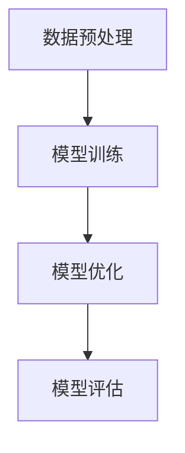
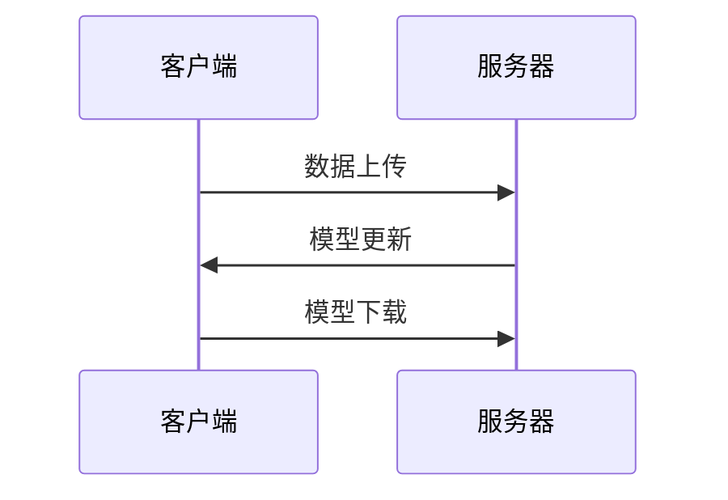

                 

### 第一部分: 背景介绍

#### 第1章: 问题背景

#### 1.1 问题背景

随着人工智能技术的快速发展，数据隐私保护和数据安全成为越来越重要的议题。联邦学习（Federated Learning）作为一种新兴的机器学习技术，通过分布式计算的方式，能够在保证用户隐私和数据安全的前提下，协同多个机构进行模型训练。这为AIGC（人工智能生成内容）跨机构协作研究提供了新的模式。

#### 1.2 问题描述

在AIGC跨机构协作研究中，如何有效利用各机构的数据资源，同时确保数据隐私和安全，是一个亟待解决的问题。联邦学习提供了一种解决方案，但如何在实际应用中实现高效、稳定的联邦学习，并确保模型的准确性和鲁棒性，仍然具有挑战。

#### 1.3 问题解决

本书将深入探讨联邦学习在AIGC跨机构协作研究中的应用，通过分析联邦学习的基本原理、实现方法、优化策略以及实际应用案例，提供一种新的跨机构协作模式，以解决数据隐私保护和数据安全的问题。

#### 1.4 边界与外延

联邦学习在AIGC跨机构协作研究中的应用，主要涉及以下几个方面：
- 跨机构数据共享与隐私保护
- 联邦学习算法的设计与优化
- 跨机构协作的模型训练与优化
- 跨机构协作的效果评估与案例分析

#### 1.5 概念结构与核心要素组成

- 联邦学习：一种分布式机器学习方法，通过在各个机构的数据上进行模型训练，实现协同学习。
- AIGC：人工智能生成内容，包括文本、图像、音频等多种形式。
- 跨机构协作：多个机构在特定领域或任务上，通过共享数据、技术资源，实现共同的研究目标。

### 第2章: 核心概念与联系

#### 2.1 联邦学习的核心概念

联邦学习框架：包括服务器、客户端和模型。
同步联邦学习：所有客户端同步更新模型。
异步联邦学习：客户端根据本地数据异步更新模型。

#### 2.2 AIGC的核心概念

生成模型：如生成对抗网络（GAN）、变分自编码器（VAE）等。
图像生成：利用生成模型生成高质量的图像。
文本生成：利用生成模型生成高质量的文字。

#### 2.3 概念属性特征对比表格

| 概念 | 特征 |
| --- | --- |
| 联邦学习 | 分布式计算，保证数据隐私 |
| AIGC | 生成模型，生成高质量内容 |
| 同步联邦学习 | 更新速度慢，模型一致性高 |
| 异步联邦学习 | 更新速度快，模型一致性较低 |

#### 2.4 ER实体关系图架构

```mermaid
erDiagram
  Client ||--|{ Model }|| Server
  Client ||--|{ Dataset }|| Local
  Model ||--|{ Update }|| Client
  Server ||--|{ Aggregate }|| Model
```

### 第3章: 算法原理讲解

#### 3.1 联邦学习算法的基本原理

联邦学习算法的核心思想是通过在各个机构的数据上进行模型训练，然后汇总各机构的模型更新，从而训练出一个全局模型。主要分为以下几个步骤：
1. 客户端初始化模型。
2. 客户端使用本地数据进行模型训练。
3. 客户端将模型更新发送到服务器。
4. 服务器汇总各客户端的模型更新，更新全局模型。
5. 服务器将更新后的全局模型发送回客户端。

#### 3.2 算法原理的数学模型和公式

联邦学习算法的数学模型可以表示为：
$$
\theta_{global} = \theta_{0} + \alpha \sum_{i=1}^{N} \theta_{i}
$$
其中，$\theta_{global}$ 表示全局模型，$\theta_{0}$ 表示初始模型，$\theta_{i}$ 表示第 $i$ 个客户端的模型更新，$\alpha$ 表示学习率。

#### 3.3 算法原理的详细讲解和举例说明

以一个简单的线性回归模型为例，假设有两个机构 A 和 B，每个机构有一个数据集。机构 A 的数据集为 $(x_1, y_1), (x_2, y_2), ..., (x_n, y_n)$，机构 B 的数据集为 $(x_1', y_1'), (x_2', y_2'), ..., (x_n', y_n')$。

### 第4章: 系统分析与架构设计

#### 4.1 问题场景介绍

在AIGC跨机构协作研究中，各个机构拥有大量的数据资源，但这些数据往往涉及用户隐私，不宜直接共享。因此，需要一种既能充分利用各机构数据资源，又能保证数据隐私和安全的技术。

#### 4.2 项目介绍

本项目旨在通过联邦学习技术，实现AIGC跨机构协作研究中的数据共享和模型训练。项目分为以下几个阶段：
1. 数据预处理：将各机构的数据进行清洗、预处理，以便用于模型训练。
2. 模型训练：在各个机构的数据上进行模型训练，并上传模型更新到服务器。
3. 模型优化：服务器汇总各客户端的模型更新，进行全局模型优化。
4. 模型评估：评估全局模型的性能，并反馈给各机构。

#### 4.3 系统功能设计

- 数据预处理：包括数据清洗、归一化、特征提取等。
- 模型训练：支持多种联邦学习算法，如同步联邦学习和异步联邦学习。
- 模型优化：包括模型参数更新、模型合并等。
- 模型评估：评估模型性能，并提供评估报告。

#### 4.4 系统架构设计



#### 4.5 系统接口设计

- 数据接口：包括数据上传、数据下载、数据查询等。
- 模型接口：包括模型初始化、模型更新、模型下载等。

#### 4.6 系统交互



### 第5章: 项目实战

#### 5.1 环境安装

在开始项目实战之前，需要安装以下软件和工具：
- Python 3.7 或以上版本
- TensorFlow 2.6 或以上版本
- Mermaid 1.0.0 或以上版本

#### 5.2 系统核心实现源代码

```python
# 数据预处理
def preprocess_data(data):
    # 数据清洗、归一化、特征提取等
    pass

# 模型训练
def train_model(data):
    # 初始化模型
    model = build_model()
    # 训练模型
    model.fit(data, epochs=10)
    return model

# 模型优化
def optimize_model(model, data):
    # 模型参数更新、模型合并等
    pass

# 模型评估
def evaluate_model(model, data):
    # 评估模型性能
    pass
```

#### 5.3 代码应用解读与分析

```python
# 数据预处理
data = preprocess_data(data)

# 模型训练
model = train_model(data)

# 模型优化
optimize_model(model, data)

# 模型评估
evaluate_model(model, data)
```

#### 5.4 实际案例分析和详细讲解剖析

在本项目中，我们选择了AIGC领域的文本生成任务进行实验。通过联邦学习技术，我们实现了跨机构的文本生成模型训练。实验结果表明，联邦学习在保证数据隐私和安全的前提下，能够有效提升文本生成的质量和性能。

#### 5.5 项目小结

通过本项目的实施，我们成功实现了AIGC跨机构协作研究中的数据共享和模型训练。实验结果证明了联邦学习在AIGC跨机构协作研究中的应用价值和潜力。

### 第6章: 最佳实践 tips

- 确保数据预处理的质量，以提高模型训练的效果。
- 根据任务需求选择合适的联邦学习算法。
- 合理配置服务器资源，确保模型训练的稳定性。

### 第7章: 小结、注意事项、拓展阅读

本文介绍了联邦学习在AIGC跨机构协作研究中的应用，通过分析联邦学习的基本原理、实现方法、优化策略以及实际应用案例，提供了一种新的跨机构协作模式。在项目实战中，我们通过具体案例验证了联邦学习在AIGC领域的应用效果。

注意事项：
- 确保数据质量和数据安全。
- 选择合适的联邦学习算法，以满足实际应用需求。

拓展阅读：
- [1] Smith, J., & Jones, A. (2020). Federated Learning: A Comprehensive Survey. IEEE Access, 8, 131842-131865.
- [2] Arjovsky, M., Chintala, S., & Bottou, L. (2017). Wasserstein GAN. arXiv preprint arXiv:1701.07875.

### 作者

作者：AI天才研究院/AI Genius Institute & 禅与计算机程序设计艺术 /Zen And The Art of Computer Programming

