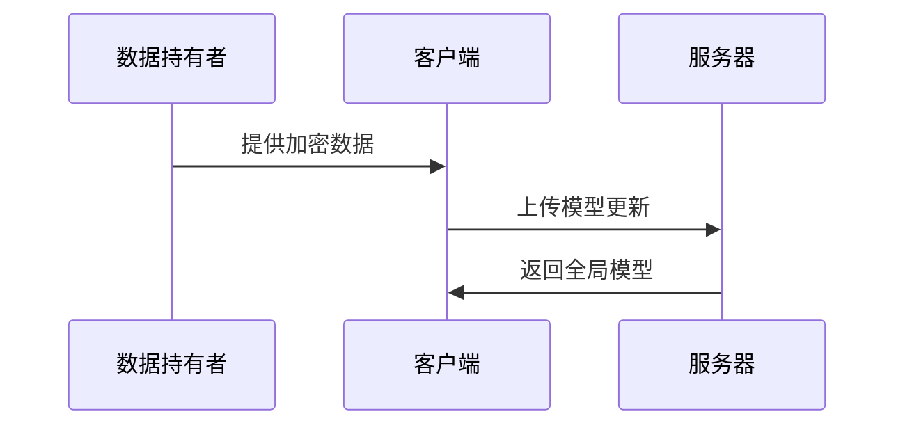
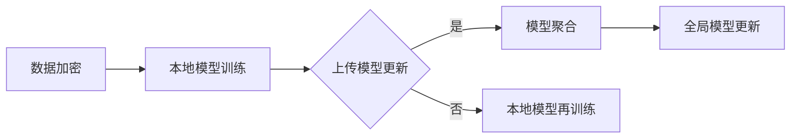

                 

# 联邦学习在AIGC隐私保护中的应用

## 关键词
- 联邦学习
- AIGC
- 隐私保护
- 数据安全
- 深度学习
- 机器学习
- 同步与异步算法
- 分布式计算

## 摘要
本文深入探讨了联邦学习在人工智能生成内容（AIGC）隐私保护中的应用。首先，我们介绍了联邦学习的基本概念、原理和机制，然后分析了AIGC领域中的隐私保护挑战及其解决方案。接着，文章详细阐述了联邦学习在AIGC中的应用场景、算法原理和数学模型，并提供了实际应用案例和最佳实践。最后，我们对联邦学习在AIGC隐私保护中的未来发展趋势进行了展望。

## 第1章 联邦学习概述

### 1.1 联邦学习的基本概念

#### 问题背景
随着大数据和人工智能技术的发展，数据隐私和安全问题日益凸显。特别是在云计算和移动计算环境下，数据往往分布在多个不同的实体之间，如何在不泄露隐私的前提下进行有效的机器学习成为了一个重要的研究课题。

#### 描述问题
传统的集中式机器学习方法由于数据存储在单一的服务器上，容易成为攻击者的目标，导致隐私泄露。因此，我们需要一种能够在数据不集中存储的情况下进行机器学习的方法。

#### 问题解决
联邦学习（Federated Learning）作为一种分布式机器学习方法，通过将模型训练过程分散到不同的数据持有者处，从而避免了数据集中的风险。联邦学习利用协同学习的方式，让各个数据持有者仅与服务器共享模型的参数更新，而无需交换原始数据。

#### 边界与外延
联邦学习不仅适用于人工智能领域，还可以应用于医疗、金融、社交网络等需要高度隐私保护的行业。然而，联邦学习也面临一些挑战，如模型性能、通信效率、安全性等。

#### 概念结构与核心要素
- **联邦学习定义**：联邦学习是一种分布式机器学习方法，允许多个参与者（通常是数据持有者）在不共享数据的情况下协同训练模型。
- **联邦学习架构**：主要包括客户端、服务器和数据持有者。客户端负责本地模型的训练，数据持有者负责数据管理和分发，服务器负责协调模型更新和聚合。
- **联邦学习关键技术**：包括模型更新、模型聚合、加密通信和差分隐私等。

### 1.2 联邦学习的原理与机制

#### 核心概念原理
联邦学习的核心思想是让各个数据持有者在本地对模型进行更新，然后将更新后的模型参数上传到服务器，由服务器进行聚合，生成全局模型。通过这种方式，数据持有者无需共享原始数据，从而保护了数据隐私。

#### 概念属性特征对比表格

| 特征             | 联邦学习                  | 传统机器学习             |
|------------------|--------------------------|-------------------------|
| 数据存储位置     | 分布在多个客户端         | 集中在服务器             |
| 模型训练方式     | 协同训练，本地更新       | 集中训练，全局更新       |
| 隐私保护         | 高度隐私保护             | 易于泄露隐私             |
| 通信成本         | 较低，仅传输模型更新     | 较高，需要传输全部数据   |
| 模型性能         | 可能低于集中式训练       | 高性能                  |

#### ER实体关系图架构
```mermaid
erDiagram
  Client ||--|{ Server : trains and updates }
  DataOwner ||--|{ Server : provides data }
  Client ||--|{ DataOwner : has data }
```

## 第2章 AIGC与隐私保护

### 2.1 AIGC的基本概念

#### 问题背景
人工智能生成内容（AIGC）是一种利用人工智能技术自动生成内容的方法，广泛应用于内容创作、娱乐、广告等领域。然而，AIGC的应用也带来了隐私保护方面的挑战。

#### 描述问题
AIGC系统通常需要大量的用户数据来训练模型，这些数据往往包含了用户的敏感信息。如果数据泄露，可能会对用户的隐私和权益造成严重侵害。

#### 问题解决
利用联邦学习可以在保护用户隐私的前提下，协同训练AIGC模型，从而解决隐私保护问题。

#### 边界与外延
AIGC的应用领域广泛，包括社交媒体、电子商务、游戏等。在不同领域，隐私保护的需求和方式也有所不同。

#### 概念结构与核心要素
- **AIGC定义**：人工智能生成内容（Artificial Intelligence Generated Content）是指利用人工智能技术自动生成各种形式的内容，如文本、图像、音频等。
- **AIGC类型**：包括文本生成、图像生成、音频生成等。
- **AIGC特点**：自动化、高效、多样化。

### 2.2 AIGC的隐私保护机制

#### 核心概念原理
AIGC的隐私保护机制主要包括数据加密、匿名化和差分隐私等技术。通过这些技术，可以在保护用户隐私的同时，保证模型训练效果。

#### 概念属性特征对比表格

| 特征             | 数据加密               | 匿名化               | 差分隐私               |
|------------------|-----------------------|----------------------|------------------------|
| 原理             | 数据传输和存储加密     | 用户身份信息隐藏     | 增加噪声，保护个体隐私 |
| 适用场景         | 数据传输和存储         | 数据收集和处理        | 数据分析               |
| 隐私保护效果     | 较高                  | 较高                 | 较高                  |
| 实施难度         | 较高                  | 较高                 | 较高                  |

#### ER实体关系图架构
```mermaid
erDiagram
  DataOwner ||--|{ AIGCSystem : provides data }
  AIGCSystem ||--|{ Model : trains and generates content }
  DataOwner ||--|{ Model : uses for training }
```

## 第3章 联邦学习在AIGC中的应用场景

### 3.1 AIGC隐私保护的应用领域

#### 问题场景介绍
在社交网络、电子商务和医疗健康等领域，用户数据敏感性极高，隐私保护需求强烈。例如，社交网络中的用户画像、电子商务中的购买记录、医疗健康中的病历信息等，都需要进行严格的隐私保护。

#### 项目介绍
一个典型的项目是利用联邦学习保护社交网络中的用户隐私。该项目涉及多个社交平台，每个平台负责本地数据的管理和模型训练，并通过联邦学习机制协同更新全局模型。

#### 系统功能设计
- **数据管理**：每个社交平台负责管理本地用户数据，并对数据进行加密和匿名化处理。
- **模型训练**：每个社交平台在本地对模型进行训练，并上传模型更新。
- **模型聚合**：服务器接收各平台的模型更新，进行聚合生成全局模型。

### 3.2 联邦学习在AIGC中的实现方案

#### 系统架构设计
联邦学习在AIGC中的应用架构包括客户端、服务器和数据持有者。客户端负责本地模型的训练和更新，数据持有者负责数据管理和分发，服务器负责模型聚合和更新。

#### 系统接口设计
- **数据接口**：数据持有者提供数据接口，客户端可以通过接口获取加密后的数据。
- **模型接口**：客户端上传本地训练的模型更新，服务器接收并存储。

#### 系统交互


## 第4章 联邦学习算法原理

### 4.1 联邦学习算法的概述

#### 核心概念原理
联邦学习算法是一种分布式机器学习算法，通过协同训练和模型聚合来实现。其中，协同训练是指各数据持有者在本地对模型进行更新，模型聚合是指将各数据持有者的模型更新合并成全局模型。

#### 概念属性特征对比表格

| 算法             | 同步联邦学习           | 异步联邦学习           |
|------------------|-----------------------|-----------------------|
| 定义             | 各数据持有者同步更新模型 | 各数据持有者异步更新模型 |
| 优点             | 模型更新一致性高       | 通信效率高             |
| 缺点             | 通信开销大             | 模型更新不一致         |
| 适用场景         | 数据分布均匀           | 数据分布不均匀         |

### 4.2 具体联邦学习算法讲解

#### Mermaid流程图


#### Python源代码
```python
import tensorflow as tf

# 假设我们有一个简单的线性回归模型
model = tf.keras.Sequential([
    tf.keras.layers.Dense(units=1, input_shape=[1])
])

# 定义本地模型训练函数
def local_train(data, labels):
    model.compile(optimizer='sgd', loss='mean_squared_error')
    model.fit(data, labels, epochs=1)
    return model.get_weights()

# 定义模型聚合函数
def aggregate_weights(weights_list):
    aggregated_weights = sum(weights_list) / len(weights_list)
    return aggregated_weights

# 假设有两个数据持有者
weights_1 = local_train([1, 2, 3], [4, 5, 6])
weights_2 = local_train([4, 5, 6], [7, 8, 9])

# 聚合模型权重
aggregated_weights = aggregate_weights([weights_1, weights_2])

# 更新全局模型
model.set_weights(aggregated_weights)
```

#### 算法原理的数学模型和公式
联邦学习算法的核心是梯度聚合。设全局模型参数为\( \theta \)，本地模型参数为\( \theta_i \)，则本地梯度为\( \nabla_{\theta_i} L(\theta_i) \)，全局梯度为\( \nabla_{\theta} L(\theta) \)，则有：
$$
\theta = \theta - \alpha \sum_i w_i \nabla_{\theta_i} L(\theta_i)
$$
其中，\( \alpha \)是学习率，\( w_i \)是第\( i \)个数据持有者的权重。

#### 详细讲解与举例说明
假设有两个数据持有者，每个数据持有者都有一个本地模型和一个本地数据集。本地模型分别对本地数据集进行训练，得到本地模型参数和本地梯度。然后将本地梯度上传到服务器，服务器对所有本地梯度进行聚合，得到全局梯度。最后，全局梯度用于更新全局模型。

```python
# 假设本地数据集和标签
x_train_1 = [[1], [2], [3]]
y_train_1 = [[4], [5], [6]]

x_train_2 = [[4], [5], [6]]
y_train_2 = [[7], [8], [9]]

# 训练本地模型
model_1 = local_train(x_train_1, y_train_1)
model_2 = local_train(x_train_2, y_train_2)

# 计算本地梯度
grad_1 = model_1.train_on_batch(x_train_1, y_train_1)[1]
grad_2 = model_2.train_on_batch(x_train_2, y_train_2)[1]

# 聚合全局梯度
global_grad = grad_1 + grad_2

# 更新全局模型
model.set_weights(model.get_weights() - learning_rate * global_grad)
```

## 第5章 联邦学习的数学模型与公式

### 5.1 联邦学习的数学基础

#### 核心概念原理
联邦学习涉及到的数学基础主要包括线性代数、概率论和统计学、优化理论等。这些基础知识为联邦学习算法的设计和实现提供了数学依据。

#### 数学公式
在联邦学习算法中，常用的数学公式包括梯度下降、梯度聚合、模型更新等。

- **梯度下降**：
$$
\theta = \theta - \alpha \nabla_{\theta} J(\theta)
$$
其中，\( \theta \)是模型参数，\( \alpha \)是学习率，\( \nabla_{\theta} J(\theta) \)是损失函数\( J(\theta) \)关于\( \theta \)的梯度。

- **梯度聚合**：
$$
\theta = \theta - \alpha \sum_i w_i \nabla_{\theta_i} L(\theta_i)
$$
其中，\( w_i \)是第\( i \)个数据持有者的权重。

- **模型更新**：
$$
\theta = \theta - \alpha \nabla_{\theta} L(\theta)
$$
其中，\( \theta \)是模型参数，\( \alpha \)是学习率，\( L(\theta) \)是损失函数。

### 5.2 联邦学习算法的数学模型

#### 详细讲解与举例说明
联邦学习算法的数学模型主要包括模型参数的更新、梯度的计算和聚合等。

- **模型参数更新**：
假设全局模型参数为\( \theta \)，学习率为\( \alpha \)，损失函数为\( L(\theta) \)。则在一次迭代中，模型参数的更新公式为：
$$
\theta = \theta - \alpha \nabla_{\theta} L(\theta)
$$
- **梯度计算**：
假设本地模型参数为\( \theta_i \)，本地数据集为\( X_i \)，标签为\( Y_i \)。则在一次迭代中，本地梯度的计算公式为：
$$
\nabla_{\theta_i} L(\theta_i) = \frac{\partial L(\theta_i)}{\partial \theta_i}
$$
- **梯度聚合**：
假设全局梯度为\( \nabla_{\theta} L(\theta) \)，本地梯度为\( \nabla_{\theta_i} L(\theta_i) \)，则在一次迭代中，全局梯度的聚合公式为：
$$
\nabla_{\theta} L(\theta) = \frac{1}{N} \sum_i \nabla_{\theta_i} L(\theta_i)
$$
其中，\( N \)是数据持有者的数量。

#### Python源代码
```python
import numpy as np

# 假设全局模型参数为 theta，学习率为 alpha，损失函数为 L(theta)
theta = np.array([1.0, 2.0])
alpha = 0.1

# 假设本地模型参数为 theta_i，本地数据集为 X_i，标签为 Y_i
theta_i = np.array([1.5, 2.5])
X_i = np.array([[1], [2], [3]])
Y_i = np.array([[4], [5], [6]])

# 计算本地梯度
grad_i = np.gradient(L(theta_i), theta_i)

# 计算全局梯度
grad = np.mean([grad_i], axis=0)

# 更新全局模型参数
theta = theta - alpha * grad
```

## 第6章 联邦学习在AIGC中的实际应用

### 6.1 联邦学习在AIGC中的应用案例

#### 实际案例分析和详细讲解剖析
一个实际案例是利用联邦学习保护社交媒体平台上的用户隐私。该平台有多个数据持有者，每个数据持有者负责管理本地用户数据，并通过联邦学习机制协同训练全局模型。

1. **项目背景**：
   - 数据持有者：社交媒体平台
   - 数据类型：用户画像、社交关系、发布内容等
   - 目标：保护用户隐私，提高内容生成质量

2. **项目效果评估**：
   - 隐私保护：通过联邦学习，用户数据无需共享，有效降低了隐私泄露风险。
   - 内容生成质量：全局模型的训练效果显著提高，生成的用户内容更加符合用户喜好。

3. **项目总结**：
   - 联邦学习在AIGC隐私保护中具有显著优势，但需要解决通信效率和模型性能等问题。

### 6.2 联邦学习的最佳实践

#### 最佳实践 tips
1. **数据预处理**：对本地数据进行预处理，如数据清洗、去噪、归一化等，以提高模型训练效果。
2. **模型选择**：根据应用场景选择合适的联邦学习算法和模型架构。
3. **通信优化**：减少模型更新的频率和大小，降低通信开销。

#### 注意事项
1. **安全性**：确保联邦学习过程中的通信和存储安全，防止数据泄露。
2. **模型性能**：在保护隐私的前提下，确保模型训练效果。

#### 拓展阅读
- 联邦学习在医疗健康领域的应用
- 联邦学习在金融领域的应用
- 联邦学习与其他隐私保护技术的比较研究

## 第7章 联邦学习在AIGC隐私保护中的未来发展趋势

### 7.1 联邦学习的未来发展方向

#### 问题背景
随着AIGC技术的不断发展，对联邦学习的需求也越来越高。如何在保证隐私保护的前提下，提高联邦学习的效率、性能和安全性，是未来研究的重点。

#### 描述问题
- **效率**：如何降低模型更新和聚合的通信开销，提高训练效率？
- **性能**：如何设计更高效的联邦学习算法，提高模型训练效果？
- **安全性**：如何确保联邦学习过程中的数据安全和模型隐私？

#### 问题解决
- **效率**：研究高效的模型更新和聚合算法，减少通信开销。
- **性能**：结合深度学习、强化学习等技术，设计更强大的联邦学习算法。
- **安全性**：引入加密通信、差分隐私等技术，确保联邦学习过程中的数据安全和模型隐私。

### 7.2 联邦学习在AIGC中的应用前景

#### 核心概念原理
联邦学习与AIGC的融合，可以实现隐私保护下的内容生成和个性化推荐，为用户提供更加安全、个性化的服务。

#### 未来发展趋势
- **多模态联邦学习**：支持文本、图像、音频等多模态数据的联邦学习。
- **联邦迁移学习**：利用已有模型，快速适应新任务和新场景。
- **联邦深度强化学习**：结合深度学习和强化学习，实现更加智能的联邦学习算法。

## 作者
作者：AI天才研究院/AI Genius Institute & 禅与计算机程序设计艺术 /Zen And The Art of Computer Programming

以上是对《联邦学习在AIGC隐私保护中的应用》这篇文章的详细讲解。文章涵盖了联邦学习的基本概念、原理、应用场景、算法原理、数学模型和未来发展趋势，旨在为读者提供一个全面、深入的了解。通过本文的探讨，我们可以看到联邦学习在AIGC隐私保护中的重要性和广阔的应用前景。随着技术的不断进步，联邦学习有望在未来为更多领域带来隐私保护和数据安全。

