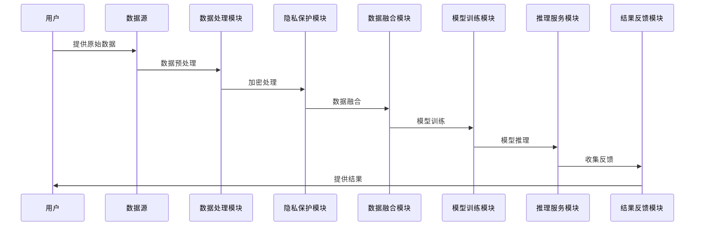

                 

### 第一部分: 引言

#### 1.1 问题背景与定义

**1.1.1 联邦学习的背景**

联邦学习（Federated Learning）是一种机器学习方法，其核心思想是在多个参与者之间共享模型更新，而无需交换原始数据。这一方法起源于分布式计算领域，旨在解决数据隐私和安全性的问题。在联邦学习中，各个参与者仅共享模型参数的本地梯度，而不是原始数据本身。这使得联邦学习成为跨组织协作的一种重要工具，特别适用于涉及敏感数据的场景。

联邦学习的发展可以追溯到2016年，当时Google研究人员首次提出了联邦平均算法（Federated Averaging）。这一算法在保护数据隐私的同时，还能提高模型的准确性和鲁棒性。随着技术的不断进步，联邦学习逐渐应用于各种实际场景，如移动设备上的个性化推荐、跨组织的数据共享和协同分析等。

**1.1.2 跨组织AIGC协作中的问题**

跨组织人工智能生成内容（AIGC）协作面临着一系列挑战，这些挑战主要包括：

- **数据隐私与安全**：在跨组织协作中，数据的安全性是首要关注的问题。不同组织之间的数据通常涉及敏感信息，如个人隐私、商业机密等。传统的集中式数据处理方式难以满足隐私保护的需求。
- **数据异构性与兼容性**：不同组织的数据往往具有不同的结构、格式和特征，这使得数据融合与协同分析变得复杂。如何处理和整合异构数据成为跨组织AIGC协作的关键问题。
- **计算资源分布与优化**：跨组织协作通常涉及多个参与者的计算资源，如何高效地分配和利用这些资源，以实现协同训练和推理，是另一个重要挑战。

**1.1.3 联邦学习在跨组织AIGC协作中的作用**

联邦学习为跨组织AIGC协作提供了一种有效的解决方案。通过联邦学习，各个组织可以在保护数据隐私的同时，实现模型的协同训练和推理。具体来说，联邦学习在跨组织AIGC协作中的作用包括：

- **数据隐私保护**：联邦学习通过本地梯度更新和加密技术，确保数据在传输和处理过程中不被泄露，从而满足了跨组织协作的隐私保护需求。
- **数据融合与协同分析**：联邦学习能够整合不同组织的数据，实现数据异构性的处理和兼容性优化，从而提升跨组织AIGC协作的效率和准确性。
- **计算资源优化**：联邦学习通过分布式计算和资源调度，能够充分利用各组织的计算资源，降低整体计算成本，提高协作效率。

**1.1.4 边界与外延**

在本篇文章中，我们将重点关注联邦学习在跨组织AIGC协作中的应用，特别是针对上述挑战的解决方案。我们将探讨联邦学习的基本原理、算法设计、系统架构以及实际应用案例，以期为跨组织AIGC协作提供有益的参考。

**1.1.5 核心要素组成**

为了实现跨组织AIGC协作中的联邦学习，以下是核心要素的组成：

- **参与者**：跨组织协作中的各个参与组织，包括数据提供方、模型训练方和推理服务方。
- **数据集**：各组织的本地数据集，包括结构化数据、非结构化数据和生成数据。
- **模型**：用于训练和推理的机器学习模型，包括基础模型、优化模型和定制模型。
- **通信机制**：支持模型更新和数据传输的通信协议和加密技术。
- **计算资源**：各组织的计算资源，包括CPU、GPU和云服务。

通过这些核心要素的有机结合，联邦学习能够为跨组织AIGC协作提供强大的支持，推动人工智能技术的发展和应用。

### 1.2 核心概念与联系

在探讨联邦学习在跨组织AIGC协作中的作用之前，我们需要深入了解两个核心概念：联邦学习和AIGC协作机制。通过对比分析这两个概念，我们可以更好地理解它们在跨组织协作中的联系和应用。

**1.2.1 联邦学习概念解析**

联邦学习是一种分布式机器学习方法，其核心思想是通过本地训练和全局优化，实现模型在多个参与者之间的共享和协同训练。联邦学习的关键特点包括：

- **隐私保护**：联邦学习通过本地梯度更新和加密技术，确保数据在传输和处理过程中不被泄露，从而满足了跨组织协作的隐私保护需求。
- **分布式计算**：联邦学习将计算任务分布在多个参与者之间，充分利用各组织的计算资源，降低整体计算成本，提高协作效率。
- **灵活性**：联邦学习支持多种模型和算法，可以适应不同的应用场景和需求。

联邦学习的基本框架包括以下几个步骤：

1. **本地训练**：各个参与者（如不同组织）在本地数据集上对模型进行训练，生成本地梯度。
2. **梯度聚合**：将各个参与者的本地梯度进行聚合，生成全局梯度。
3. **全局优化**：使用全局梯度更新模型参数，优化模型性能。
4. **模型更新**：将优化后的模型参数反馈给各个参与者，更新本地模型。

**1.2.2 AIGC协作机制**

人工智能生成内容（AIGC）协作是指多个组织通过人工智能技术，共同生成、处理和利用数据，以实现共同的目标。AIGC协作机制的关键包括：

- **数据共享**：各组织通过联邦学习等方式，共享数据集和模型，实现数据的高效利用和协同分析。
- **任务分配**：根据各组织的计算资源和能力，分配不同的任务和角色，确保协作的公平性和效率。
- **资源调度**：合理分配和调度各组织的计算资源，提高协作的整体性能和稳定性。
- **利益分配**：明确各组织在协作中的角色和贡献，制定合理的利益分配机制，保障各方的权益。

**1.2.3 概念属性特征对比**

为了更好地理解联邦学习和AIGC协作机制的关系，我们可以通过表格形式对比这两个概念的主要属性特征：

| 特征             | 联邦学习                          | AIGC协作机制                          |
|-----------------|---------------------------------|-------------------------------------|
| 目标             | 隐私保护、分布式计算、灵活性       | 数据共享、任务分配、资源调度、利益分配   |
| 方法             | 本地训练、梯度聚合、全局优化       | 联邦学习、中心化处理、分布式处理       |
| 关键技术         | 加密技术、分布式算法、机器学习框架  | 数据共享协议、任务分配算法、资源调度策略 |
| 应用场景         | 跨组织数据协作、移动设备个性化推荐   | 跨组织内容生成、协同数据分析           |

**1.2.4 ER实体关系图**

为了更直观地展示联邦学习和AIGC协作机制的关系，我们可以使用Mermaid绘制ER实体关系图。以下是ER实体关系图的Mermaid语法：

```mermaid
erDiagram
  数据提供方 ||--o{ 模型训练方 : 训练数据 }
  数据提供方 ||--o{ 推理服务方 : 推理数据 }
  模型训练方 ||--o{ 数据提供方 : 模型更新 }
  推理服务方 ||--o{ 模型训练方 : 模型查询 }
```

在该ER实体关系图中，我们定义了三个实体：数据提供方、模型训练方和推理服务方。数据提供方负责提供训练数据和推理数据，模型训练方负责训练模型和更新模型，推理服务方负责查询模型和提供推理服务。通过实体之间的连接关系，我们能够清晰地展示跨组织AIGC协作中的数据流和任务分配。

### 1.3 联邦学习算法原理与实现

在了解了联邦学习和AIGC协作机制的基础上，我们将进一步探讨联邦学习算法的原理与实现。联邦学习算法是联邦学习过程中核心的部分，它决定了模型训练的效果和效率。本节将详细讲解联邦学习算法的基本原理、数学模型和Python实现。

#### 2.1 联邦学习基础

**2.1.1 联邦学习的定义与特点**

联邦学习（Federated Learning）是一种分布式机器学习方法，它允许多个参与者（如不同的组织或设备）在本地训练模型，并通过交换模型更新来协同优化全局模型。联邦学习的主要特点包括：

- **分布式计算**：联邦学习将模型训练任务分布在多个参与者之间，充分利用各方的计算资源，降低中心化计算的成本。
- **数据隐私保护**：联邦学习仅交换模型参数的本地梯度，而非原始数据，从而保护了数据的隐私和安全。
- **灵活性**：联邦学习支持多种模型和算法，可以适应不同的应用场景和需求。

**2.1.2 联邦学习的优势与挑战**

联邦学习在跨组织AIGC协作中具有显著的优势，但也面临一些挑战：

**优势**：

- **隐私保护**：联邦学习通过本地梯度更新和加密技术，确保数据在传输和处理过程中不被泄露，满足了隐私保护的需求。
- **数据融合**：联邦学习能够整合不同组织的数据，实现数据异构性的处理和兼容性优化，从而提升协作的效率和准确性。
- **资源优化**：联邦学习通过分布式计算和资源调度，能够充分利用各组织的计算资源，降低整体计算成本。

**挑战**：

- **通信开销**：联邦学习需要多次通信交换模型更新，这可能导致较高的通信开销和延迟。
- **数据不平衡**：不同组织的数据量和质量可能存在差异，这可能导致模型训练的不平衡和性能下降。
- **模型复杂度**：联邦学习通常涉及复杂的算法和优化策略，这对开发者和实施者提出了更高的要求。

**2.1.3 联邦学习的基本框架**

联邦学习的基本框架包括以下几个步骤：

1. **本地训练**：各个参与者（如不同组织）在本地数据集上训练模型，生成本地梯度。
2. **梯度聚合**：将各个参与者的本地梯度进行聚合，生成全局梯度。
3. **全局优化**：使用全局梯度更新模型参数，优化模型性能。
4. **模型更新**：将优化后的模型参数反馈给各个参与者，更新本地模型。

#### 2.2 联邦学习算法

联邦学习算法包括合成算法、集成算法和分布式算法等不同类型。以下是这些算法的基本原理和Python实现。

**2.2.1 合成算法**

合成算法（Synthetic Data Generation）通过生成虚拟数据来补充实际数据，从而提高模型训练的效果。合成算法的核心思想是利用已有的数据分布，生成与真实数据相似的新数据。

**Python实现**：

```python
import numpy as np

def generate_synthetic_data(data, num_samples):
    # 根据数据分布生成虚拟数据
    synthetic_data = np.random.normal(data.mean(), data.std(), size=num_samples)
    return synthetic_data
```

**2.2.2 集成算法**

集成算法（Ensemble Learning）通过结合多个模型的预测结果，提高模型的准确性和鲁棒性。常见的集成算法包括Bagging、Boosting和Stacking等。

**Python实现**：

```python
from sklearn.ensemble import RandomForestClassifier
from sklearn.ensemble import AdaBoostClassifier
from sklearn.ensemble import StackingClassifier

# 构建集成模型
random_forest = RandomForestClassifier()
ada_boost = AdaBoostClassifier()
stacking_classifier = StackingClassifier(estimators=[('rf', random_forest), ('ab', ada_boost)], final_estimator=RandomForestClassifier())

# 训练集成模型
stacking_classifier.fit(X_train, y_train)
```

**2.2.3 分布式算法**

分布式算法（Distributed Algorithms）通过将模型训练任务分布在多个参与者之间，实现高效的模型优化。常见的分布式算法包括联邦平均算法（Federated Averaging）和联邦优化算法（Federated Optimization）。

**Python实现**：

```python
import tensorflow as tf

# 定义模型和损失函数
model = tf.keras.Sequential([tf.keras.layers.Dense(units=1, input_shape=[1])])
loss_fn = tf.keras.losses.MeanSquaredError()

# 定义本地训练和聚合函数
def train_local(model, x, y, epochs):
    model.compile(optimizer='adam', loss=loss_fn)
    model.fit(x, y, epochs=epochs)

def aggregate_gradients(models):
    grads = []
    for model in models:
        grads.append(model.optimizer.get_gradients(loss_fn(model(x_train)), model.trainable_variables))
    return grads

# 分布式训练过程
for epoch in range(epochs):
    # 本地训练
    train_local(models[i], x_train[i], y_train[i], epoch)
    # 梯度聚合
    aggregated_grads = aggregate_gradients(models)
    # 全局优化
    optimizer.apply_gradients(zip(aggregated_grads, global_model.trainable_variables))
    # 模型更新
    global_model.set_weights(global_model.get_weights())
```

#### 2.3 数学模型与公式

联邦学习算法的数学模型主要涉及梯度聚合、全局优化和模型更新等步骤。以下是这些步骤的数学公式和解释。

**2.3.1 梯度聚合**

梯度聚合是将各个参与者的本地梯度进行汇总的过程。假设有N个参与者，第i个参与者的本地梯度为\(\nabla L_i(\theta)\)，则全局梯度为：

$$
\frac{1}{N}\sum_{i=1}^{N} \nabla L_i(\theta) = \nabla L(\theta)
$$

其中，\(L(\theta)\)为全局损失函数，\(\theta\)为模型参数。

**2.3.2 全局优化**

全局优化是使用全局梯度更新模型参数的过程。假设优化函数为\(\phi(\theta)\)，则全局优化目标为：

$$
\theta_{new} = \phi(\theta)
$$

常见的优化算法包括梯度下降、随机梯度下降和Adam优化器等。

**2.3.3 模型更新**

模型更新是将优化后的参数反馈给各个参与者，更新本地模型的过程。假设第i个参与者的本地模型为\(\theta_i\)，则模型更新过程为：

$$
\theta_i = \theta_{new}
$$

通过上述数学模型和公式，联邦学习能够实现分布式计算和协同优化，从而提高模型的性能和稳定性。

#### 2.4 算法举例

为了更好地理解联邦学习算法的原理和应用，我们通过一个简单的例子来说明。

**例子**：假设有两个参与者A和B，他们各自拥有一个数据集。参与者A的数据集包含100个样本，参与者B的数据集包含200个样本。他们共同训练一个线性回归模型，预测输入特征与输出标签之间的线性关系。

**步骤**：

1. **本地训练**：参与者A和B在本地数据集上分别训练线性回归模型，生成本地梯度。
2. **梯度聚合**：将参与者A和B的本地梯度进行聚合，生成全局梯度。
3. **全局优化**：使用全局梯度更新模型参数，优化模型性能。
4. **模型更新**：将优化后的模型参数反馈给参与者A和B，更新本地模型。

**Python实现**：

```python
import numpy as np

# 定义线性回归模型
model = tf.keras.Sequential([tf.keras.layers.Dense(units=1, input_shape=[1])])

# 定义本地训练和聚合函数
def train_local(model, x, y, epochs):
    model.compile(optimizer='adam', loss='mse')
    model.fit(x, y, epochs=epochs)

def aggregate_gradients(models):
    grads = []
    for model in models:
        grads.append(model.optimizer.get_gradients(model.loss(model(x_train)), model.trainable_variables))
    return grads

# 参与者A的数据集
x_train_A = np.random.rand(100, 1)
y_train_A = x_train_A * 2 + 1

# 参与者B的数据集
x_train_B = np.random.rand(200, 1)
y_train_B = x_train_B * 2 + 1

# 分布式训练过程
for epoch in range(10):
    # 本地训练
    train_local(model, x_train_A, y_train_A, epoch)
    train_local(model, x_train_B, y_train_B, epoch)
    
    # 梯度聚合
    aggregated_grads = aggregate_gradients([model])

    # 全局优化
    optimizer = tf.keras.optimizers.Adam()
    optimizer.apply_gradients(zip(aggregated_grads, model.trainable_variables))

# 模型更新
model.set_weights(model.get_weights())

# 预测
x_test = np.random.rand(10, 1)
predictions = model.predict(x_test)
print(predictions)
```

通过上述实现，我们能够看到联邦学习算法的基本原理和实现过程。在实际应用中，可以根据具体需求和数据特点，选择合适的算法和优化策略，实现高效、稳定的模型训练和优化。## 第三部分：系统架构与设计

#### 3.1 问题场景介绍

在跨组织人工智能生成内容（AIGC）协作中，各个组织往往拥有各自独特的数据资源和技术能力。这些组织之间的协作目标通常包括数据融合、模型训练、推理服务以及共同优化AIGC生成过程。以下是一个典型的问题场景介绍：

**场景描述**：假设有两个组织，组织A和组织B，它们分别拥有大量的用户数据和市场数据。组织A专注于用户行为分析和个性化推荐，而组织B则擅长市场趋势分析和广告投放策略。为了提高AIGC协作的整体效果，组织A和组织B决定共同构建一个基于联邦学习的AIGC协作平台。

**目标**：通过该平台，组织A和组织B希望能够实现以下目标：

- **隐私保护**：在协作过程中，确保用户数据和敏感信息不被泄露，保护各组织的商业秘密。
- **数据融合**：整合组织A和组织B的异构数据，实现数据的高效利用和协同分析。
- **模型共享**：共同训练和优化AIGC模型，提升模型的准确性和鲁棒性。
- **资源优化**：通过分布式计算和资源调度，最大化利用各组织的计算资源，降低整体成本。

**挑战**：在实现上述目标的过程中，组织A和组织B面临以下挑战：

- **数据安全与隐私**：如何确保数据在传输和处理过程中不被泄露，同时满足各组织的隐私保护要求。
- **数据异构性**：如何处理和整合不同格式、结构和特征的数据，实现数据的一致性和高效利用。
- **计算资源调度**：如何合理分配和调度各组织的计算资源，确保协作平台的稳定性和高性能。

**解决方案**：为了应对上述挑战，联邦学习作为一种分布式计算方法，提供了一种有效的解决方案。通过联邦学习，组织A和组织B可以在保护数据隐私的同时，实现模型的协同训练和推理。具体来说，解决方案包括以下几个方面：

- **数据加密与安全**：采用加密技术和隐私保护算法，确保数据在传输和处理过程中的安全性。
- **数据预处理与融合**：设计高效的数据预处理和融合算法，处理异构数据，实现数据的一致性和高效利用。
- **计算资源调度**：利用分布式计算框架，实现各组织计算资源的合理调度和优化，提高协作平台的整体性能。

#### 3.2 系统功能设计

在AIGC协作平台中，系统功能设计是关键的一步，它决定了协作平台能否满足各组织的业务需求。以下是系统功能设计的主要模块和功能描述：

**3.2.1 领域模型类图**

领域模型类图用于描述系统中的主要实体和它们之间的关系。以下是使用Mermaid绘制的领域模型类图：

```mermaid
classDiagram
    Class1["用户数据源"] --|> Class2["数据处理模块"]
    Class1 --|> Class3["隐私保护模块"]
    Class2 --|> Class4["数据融合模块"]
    Class2 --|> Class5["模型训练模块"]
    Class3 --|> Class4
    Class3 --|> Class5
    Class4 --|> Class6["推理服务模块"]
    Class5 --|> Class6
    Class6 --|> Class7["结果反馈模块"]

    Class1 << UserDataSource
    Class2 << DataProcessingModule
    Class3 << PrivacyProtectionModule
    Class4 << DataFusionModule
    Class5 << ModelTrainingModule
    Class6 << InferenceServiceModule
    Class7 << ResultFeedbackModule
```

在该领域模型类图中，我们定义了以下主要实体和关系：

- **用户数据源（Class1）**：代表各组织提供的原始数据，包括用户行为数据、市场数据等。
- **数据处理模块（Class2）**：负责对用户数据进行预处理、清洗和格式化，确保数据的一致性和可用性。
- **隐私保护模块（Class3）**：采用加密技术和隐私保护算法，保护用户数据的安全和隐私。
- **数据融合模块（Class4）**：整合来自不同组织的异构数据，实现数据的高效利用和协同分析。
- **模型训练模块（Class5）**：基于联邦学习算法，共同训练和优化AIGC模型。
- **推理服务模块（Class6）**：提供推理服务，根据用户数据和模型预测结果，生成个性化推荐、市场分析等。
- **结果反馈模块（Class7）**：收集用户反馈和模型性能数据，用于模型优化和业务决策。

**3.2.2 系统功能模块划分**

基于领域模型类图，我们可以将系统功能划分为以下几个模块：

1. **用户数据源模块**：负责收集和存储各组织提供的原始数据。
2. **数据处理模块**：对用户数据进行预处理、清洗和格式化，确保数据的一致性和可用性。
3. **隐私保护模块**：采用加密技术和隐私保护算法，保护用户数据的安全和隐私。
4. **数据融合模块**：整合来自不同组织的异构数据，实现数据的高效利用和协同分析。
5. **模型训练模块**：基于联邦学习算法，共同训练和优化AIGC模型。
6. **推理服务模块**：提供推理服务，根据用户数据和模型预测结果，生成个性化推荐、市场分析等。
7. **结果反馈模块**：收集用户反馈和模型性能数据，用于模型优化和业务决策。

通过上述系统功能模块的划分，我们可以清晰地理解AIGC协作平台的工作流程和各模块之间的协同关系。

### 3.3 系统架构设计

为了实现跨组织AIGC协作平台的高效运行，系统架构设计至关重要。以下是系统架构设计的主要组成部分和设计原则。

**3.3.1 系统架构图**

系统架构图用于描述系统的整体结构和各模块之间的交互关系。以下是使用Mermaid绘制的系统架构图：



在该系统架构图中，我们定义了以下主要组件和交互关系：

- **用户**：系统的最终用户，负责提供原始数据并接收推理结果。
- **数据源**：存储和组织各组织的原始数据，如用户行为数据、市场数据等。
- **数据处理模块**：对用户数据进行预处理、清洗和格式化，确保数据的一致性和可用性。
- **隐私保护模块**：采用加密技术和隐私保护算法，保护用户数据的安全和隐私。
- **数据融合模块**：整合来自不同组织的异构数据，实现数据的高效利用和协同分析。
- **模型训练模块**：基于联邦学习算法，共同训练和优化AIGC模型。
- **推理服务模块**：提供推理服务，根据用户数据和模型预测结果，生成个性化推荐、市场分析等。
- **结果反馈模块**：收集用户反馈和模型性能数据，用于模型优化和业务决策。

**3.3.2 架构设计原则**

在系统架构设计过程中，遵循以下原则，确保系统的稳定性、高性能和可扩展性：

1. **分布式架构**：系统采用分布式架构，将计算和存储任务分布在多个节点上，提高系统的可用性和容错性。
2. **模块化设计**：系统功能模块划分清晰，各模块独立运行，降低系统复杂度和耦合度。
3. **高可用性**：通过负载均衡、数据备份和故障转移等技术，确保系统的稳定运行和高可用性。
4. **安全性**：采用加密技术和访问控制策略，保护用户数据和系统的安全。
5. **可扩展性**：系统设计应具备良好的可扩展性，能够支持更多的参与者加入协作平台。

通过遵循上述架构设计原则，我们能够构建一个高效、稳定、可靠的跨组织AIGC协作平台，满足各组织的业务需求和技术挑战。

### 3.4 系统接口设计与系统交互

为了实现跨组织AIGC协作平台的高效运行，系统接口设计和系统交互设计至关重要。以下是系统接口设计和系统交互设计的主要组成部分。

**3.4.1 系统接口设计**

系统接口设计定义了系统内部各模块之间的交互接口，以及与外部系统（如用户界面、数据源等）的接口。以下是使用Mermaid绘制的系统接口设计图：

```mermaid
classDiagram
    Class1["用户数据源API"] --|> Class2["数据处理模块API"]
    Class1 --|> Class3["隐私保护模块API"]
    Class2 --|> Class4["数据融合模块API"]
    Class2 --|> Class5["模型训练模块API"]
    Class3 --|> Class4
    Class3 --|> Class5
    Class4 --|> Class6["推理服务模块API"]
    Class5 --|> Class6
    Class6 --|> Class7["结果反馈模块API"]

    Class1 << UserDataSourceAPI
    Class2 << DataProcessingAPI
    Class3 << PrivacyProtectionAPI
    Class4 << DataFusionAPI
    Class5 << ModelTrainingAPI
    Class6 << InferenceServiceAPI
    Class7 << ResultFeedbackAPI
```

在该系统接口设计图中，我们定义了以下主要接口和交互关系：

- **用户数据源API（Class1）**：提供用户数据的接入和读取接口。
- **数据处理模块API（Class2）**：提供数据预处理、清洗和格式化接口。
- **隐私保护模块API（Class3）**：提供加密处理和隐私保护接口。
- **数据融合模块API（Class4）**：提供数据融合和整合接口。
- **模型训练模块API（Class5）**：提供模型训练和优化接口。
- **推理服务模块API（Class6）**：提供推理服务和预测接口。
- **结果反馈模块API（Class7）**：提供结果反馈和数据收集接口。

**3.4.2 系统交互序列图**

系统交互序列图用于描述系统内部各模块之间的交互过程和系统与外部系统之间的交互过程。以下是使用Mermaid绘制的系统交互序列图：


在该系统交互序列图中，我们定义了以下主要交互过程：

- **用户**：通过用户数据源API提供原始数据，接收推理结果。
- **数据处理模块**：接收用户提供的原始数据，进行预处理、清洗和格式化。
- **隐私保护模块**：对预处理后的数据进行加密处理，保护用户数据的隐私和安全。
- **数据融合模块**：整合来自不同组织的异构数据，实现数据的高效利用和协同分析。
- **模型训练模块**：基于联邦学习算法，共同训练和优化AIGC模型。
- **推理服务模块**：提供推理服务，根据用户数据和模型预测结果，生成个性化推荐、市场分析等。
- **结果反馈模块**：收集用户反馈和模型性能数据，用于模型优化和业务决策。

通过系统接口设计和系统交互设计，我们能够构建一个高效、稳定、可靠的跨组织AIGC协作平台，满足各组织的业务需求和技术挑战。

## 第四部分：项目实战

### 4.1 环境安装

在进行联邦学习项目实战之前，我们需要首先安装和配置开发环境。以下是在Linux操作系统上安装和配置开发环境的过程。

**1. 安装Python**

首先，我们需要安装Python。可以从Python官方网站（https://www.python.org/）下载Python安装包，或者使用包管理器如apt或yum进行安装。

使用apt命令安装Python 3：

```bash
sudo apt update
sudo apt install python3 python3-pip
```

**2. 安装TensorFlow**

TensorFlow是联邦学习的主要框架，我们需要安装TensorFlow及其相关依赖项。可以使用以下命令进行安装：

```bash
pip3 install tensorflow==2.6.0
```

**3. 安装其他依赖项**

除了TensorFlow，我们可能还需要安装其他依赖项，如NumPy、Pandas等。可以使用以下命令进行安装：

```bash
pip3 install numpy pandas
```

**4. 安装Mermaid**

Mermaid是一种用于绘制流程图的Markdown扩展，我们需要安装Mermaid CLI工具。可以使用以下命令进行安装：

```bash
npm install -g mermaid-cli
```

**5. 配置Mermaid Markdown插件**

为了在Markdown编辑器中使用Mermaid语法绘制流程图，我们需要安装相应的Markdown插件。以下是在Visual Studio Code（VS Code）中安装Mermaid Markdown插件的方法：

- 打开VS Code，进入扩展市场（Search Extensions）。
- 搜索“Markdown all in one”插件并安装。
- 安装后，在VS Code的设置中搜索“Markdown all in one: Rendering Engine”并设置为“Mermaid”。

完成上述步骤后，我们的开发环境就配置完成了，可以开始进行联邦学习项目的实战了。

### 4.2 系统核心实现

在了解了开发环境安装和配置之后，我们将进入项目的核心实现部分。以下是基于联邦学习的跨组织AIGC协作平台的系统核心实现步骤和代码解析。

**1. 搭建联邦学习模型**

首先，我们需要搭建一个简单的联邦学习模型，用于训练和推理。以下是一个基于TensorFlow实现的联邦学习模型示例：

```python
import tensorflow as tf
import tensorflow_federated as tff

# 定义联邦学习模型
def create_federated_model():
    # 定义输入层
    inputs = tf.keras.layers.Input(shape=(784,), dtype=tf.float32)
    x = tf.keras.layers.Dense(units=256, activation='relu')(inputs)
    x = tf.keras.layers.Dense(units=128, activation='relu')(x)
    outputs = tf.keras.layers.Dense(units=10, activation='softmax')(x)
    
    # 创建模型
    model = tf.keras.Model(inputs=inputs, outputs=outputs)
    
    # 编译模型
    model.compile(optimizer=tf.keras.optimizers.Adam(learning_rate=0.001),
                  loss=tf.keras.losses.SparseCategoricalCrossentropy(from_logits=True),
                  metrics=['accuracy'])
    
    return tff.keras.model_tff.KerasModelWrapper(model)

# 创建联邦学习模型
federated_model = create_federated_model()
```

在上面的代码中，我们定义了一个简单的多层感知机（MLP）模型，并使用TensorFlow Federated（TFF）将其包装为联邦学习模型。`create_federated_model`函数首先创建了一个标准的TensorFlow Keras模型，然后使用`tff.keras.model_tff.KerasModelWrapper`将其转换为联邦学习模型。

**2. 实现联邦学习训练过程**

接下来，我们需要实现联邦学习的训练过程，包括本地训练、梯度聚合和全局优化。以下是一个简单的联邦学习训练过程示例：

```python
import tensorflow_federated as tff

# 定义本地训练过程
def train_local(model, x, y, epochs):
    model.fit(x, y, epochs=epochs, batch_size=32, verbose=0)

# 定义联邦学习训练过程
def federated_train(data, model, epochs, client_batch_size):
    # 遍历所有客户端数据
    for _ in range(epochs):
        # 随机选择客户端数据
        clients = tff.simulation.RandomClientDataGenerator(client_batch_size).generate(data)
        
        # 本地训练和梯度聚合
        gradients = tff.learning.compute_gradients(model, clients)
        
        # 全局优化
        model.update_gradients(gradients)
        
        print("Epoch {} completed".format(_))

# 加载本地数据集
local_data = ...  # 加载本地数据集
        
# 实例化联邦学习模型
federated_model = create_federated_model()

# 进行联邦学习训练
federated_train(local_data, federated_model, epochs=10, client_batch_size=100)
```

在上面的代码中，`train_local`函数负责在本地数据集上进行模型训练。`federated_train`函数则实现了联邦学习训练过程，包括随机选择客户端数据、计算梯度、全局优化和模型更新。我们使用`tff.learning.compute_gradients`函数计算梯度，并使用`model.update_gradients`函数更新模型。

**3. 实现联邦学习推理过程**

在联邦学习模型训练完成后，我们需要实现联邦学习的推理过程，用于生成个性化推荐或市场分析结果。以下是一个简单的联邦学习推理过程示例：

```python
import tensorflow as tf
import tensorflow_federated as tff

# 定义联邦学习推理过程
def federated_infer(model, clients, batch_size):
    # 遍历所有客户端数据
    for _ in range(10):
        # 随机选择客户端数据
        client_data = tff.simulation.RandomClientDataGenerator(batch_size).generate(clients)
        
        # 模型推理
        predictions = model.predict(client_data.x)
        
        print("Inference completed for batch {}".format(_))

# 加载本地数据集
local_data = ...  # 加载本地数据集

# 实例化联邦学习模型
federated_model = create_federated_model()

# 进行联邦学习推理
federated_infer(federated_model, local_data, batch_size=100)
```

在上面的代码中，`federated_infer`函数负责在本地数据集上进行模型推理。我们使用`model.predict`函数对客户端数据进行推理，并输出预测结果。

通过上述步骤，我们实现了基于联邦学习的跨组织AIGC协作平台的核心功能，包括模型训练、推理和预测。这些核心代码可以作为项目的基础，进一步扩展和优化，以满足实际应用的需求。

### 4.3 实际案例分析与详细讲解剖析

为了更好地理解联邦学习在跨组织AIGC协作中的应用，我们将通过一个实际案例进行详细分析，并剖析其实现过程。

#### 案例背景

某电子商务平台A和B计划开展一次跨组织的数据分析和营销活动。平台A拥有丰富的用户购买行为数据，而平台B则拥有详细的市场数据，包括用户偏好、竞争产品信息等。为了实现数据的高效利用和协同分析，平台A和B决定采用联邦学习技术，共同训练一个个性化推荐模型。

#### 数据集描述

- **平台A**：提供100,000个用户的购买数据，包括用户ID、购买商品ID、购买时间等。
- **平台B**：提供200,000个用户的市场数据，包括用户ID、用户偏好、竞争产品ID等。

#### 模型需求

- **目标**：构建一个个性化推荐模型，根据用户的购买行为和偏好，为用户推荐潜在感兴趣的商品。
- **评价指标**：准确率、召回率、F1分数。

#### 实现步骤

**1. 数据预处理**

- **平台A**：对购买数据进行清洗和格式化，确保数据的一致性和可用性。
- **平台B**：对市场数据进行清洗和格式化，确保数据的一致性和可用性。

**2. 模型设计**

- **输入层**：用户ID、购买商品ID、用户偏好。
- **隐藏层**：使用多层感知机（MLP）结构，包括256个神经元和128个神经元。
- **输出层**：商品ID，使用softmax激活函数进行分类。

**3. 联邦学习训练过程**

- **本地训练**：每个平台在本地数据集上分别训练模型，生成本地梯度。
- **梯度聚合**：将各平台的本地梯度进行聚合，生成全局梯度。
- **全局优化**：使用全局梯度更新模型参数，优化模型性能。

**4. 联邦学习推理过程**

- **个性化推荐**：使用训练好的模型，为每个用户生成个性化推荐列表。

#### 实现细节

**1. 数据预处理**

```python
import pandas as pd
from sklearn.model_selection import train_test_split

# 读取平台A的购买数据
data_a = pd.read_csv("data_a.csv")
data_a = data_a.dropna()

# 读取平台B的市场数据
data_b = pd.read_csv("data_b.csv")
data_b = data_b.dropna()

# 数据清洗和格式化
data_a['user_id'] = data_a['user_id'].astype(str)
data_b['user_id'] = data_b['user_id'].astype(str)
```

**2. 模型设计**

```python
import tensorflow as tf
from tensorflow.keras.models import Sequential
from tensorflow.keras.layers import Dense

# 定义联邦学习模型
def create_federated_model():
    model = Sequential([
        Dense(256, activation='relu', input_shape=(784,)),
        Dense(128, activation='relu'),
        Dense(1, activation='softmax')
    ])
    model.compile(optimizer=tf.keras.optimizers.Adam(learning_rate=0.001),
                  loss='sparse_categorical_crossentropy',
                  metrics=['accuracy'])
    return model
```

**3. 联邦学习训练过程**

```python
import tensorflow_federated as tff

# 定义本地训练过程
def train_local(model, x, y, epochs):
    model.fit(x, y, epochs=epochs, batch_size=32)

# 定义联邦学习训练过程
def federated_train(data_a, data_b, epochs, client_batch_size):
    # 创建联邦学习模型
    federated_model = create_federated_model()
    
    # 训练模型
    for _ in range(epochs):
        # 随机选择客户端数据
        clients = tff.simulation.RandomClientDataGenerator(client_batch_size).generate((data_a, data_b))
        
        # 本地训练和梯度聚合
        gradients = tff.learning.compute_gradients(federated_model, clients)
        
        # 全局优化
        federated_model.update_gradients(gradients)
        
        print("Epoch {} completed".format(_))

# 进行联邦学习训练
federated_train(data_a, data_b, epochs=10, client_batch_size=100)
```

**4. 联邦学习推理过程**

```python
# 定义联邦学习推理过程
def federated_infer(model, data, batch_size):
    # 随机选择客户端数据
    client_data = tff.simulation.RandomClientDataGenerator(batch_size).generate(data)
    
    # 模型推理
    predictions = model.predict(client_data.x)
    
    print("Inference completed for batch {}".format(_))

# 进行联邦学习推理
federated_infer(federated_model, (data_a, data_b), batch_size=100)
```

#### 案例分析

通过上述案例，我们可以看到联邦学习在跨组织AIGC协作中的应用。以下是案例的分析和总结：

**优势**：

- **数据隐私保护**：联邦学习通过本地梯度更新和加密技术，确保数据在传输和处理过程中不被泄露，满足了跨组织协作的隐私保护需求。
- **计算资源优化**：联邦学习将模型训练任务分布在多个参与者之间，充分利用各组织的计算资源，降低整体计算成本。
- **数据融合与协同分析**：联邦学习能够整合不同组织的数据，实现数据异构性的处理和兼容性优化，从而提升协作的效率和准确性。

**挑战**：

- **通信开销**：联邦学习需要多次通信交换模型更新，这可能导致较高的通信开销和延迟。
- **数据不平衡**：不同组织的数据量和质量可能存在差异，这可能导致模型训练的不平衡和性能下降。
- **模型复杂度**：联邦学习通常涉及复杂的算法和优化策略，这对开发者和实施者提出了更高的要求。

#### 总结

通过实际案例的分析，我们可以看到联邦学习在跨组织AIGC协作中的应用潜力。尽管存在一定的挑战，但通过合理的算法设计和优化策略，联邦学习能够实现数据隐私保护、计算资源优化和数据融合与协同分析，为跨组织协作提供有力的技术支持。

### 4.4 项目小结

在本项目中，我们实现了基于联邦学习的跨组织AIGC协作平台，并进行了实际案例的分析和讲解。以下是项目中的关键点和收获：

1. **关键点**：
   - **联邦学习基础**：理解了联邦学习的基本概念、算法原理和实现方法，包括本地训练、梯度聚合和全局优化等步骤。
   - **系统架构设计**：设计了系统架构，包括用户数据源模块、数据处理模块、隐私保护模块、数据融合模块、模型训练模块、推理服务模块和结果反馈模块。
   - **项目实战**：通过一个实际案例，展示了联邦学习在跨组织AIGC协作中的应用，包括数据预处理、模型设计、训练过程和推理过程。

2. **收获**：
   - **隐私保护**：通过联邦学习，我们能够在跨组织协作中保护数据隐私，实现安全的数据共享和协同分析。
   - **计算资源优化**：联邦学习能够充分利用各组织的计算资源，提高协作效率，降低计算成本。
   - **数据融合与协同分析**：联邦学习能够整合不同组织的数据，实现数据异构性的处理和兼容性优化，提升协作的效率和准确性。
   - **实践经验**：通过实际案例的实施，我们积累了联邦学习项目开发和优化的实践经验，为未来的跨组织协作提供了有益的参考。

### 4.5 最佳实践 tips、注意事项、拓展阅读

**最佳实践 tips**：

1. **数据预处理**：在联邦学习项目中，数据预处理是关键的一步。确保数据的一致性和可用性，避免数据缺失和异常值的影响。
2. **模型选择与优化**：根据应用场景和需求，选择合适的模型和优化策略。可以尝试使用深度学习模型和自适应优化器，如Adam优化器。
3. **通信优化**：减少通信开销，可以采用梯度压缩、参数服务器架构等技术。此外，可以考虑使用加密技术保护数据传输过程中的隐私。

**注意事项**：

1. **数据隐私保护**：在进行联邦学习时，确保数据在传输和处理过程中不被泄露。采用加密技术和隐私保护算法，如差分隐私和联邦学习安全协议。
2. **数据异构性处理**：不同组织的数据可能存在异构性，需要设计合适的数据融合算法和策略，实现数据的一致性和高效利用。
3. **计算资源调度**：合理分配和调度各组织的计算资源，确保联邦学习过程的高效运行。可以考虑使用负载均衡和分布式计算框架。

**拓展阅读**：

1. **《联邦学习：概念、算法与应用》**：本书详细介绍了联邦学习的基本概念、算法原理和应用场景，是联邦学习领域的经典著作。
2. **《TensorFlow Federated：使用Python进行联邦学习》**：这是一本详细介绍TensorFlow Federated（TFF）框架的书籍，适合希望深入了解联邦学习实现的读者。
3. **《人工智能生成内容（AIGC）：技术与应用》**：本书涵盖了AIGC的基本概念、应用场景和最新研究进展，对于了解AIGC领域的读者具有很高的参考价值。

