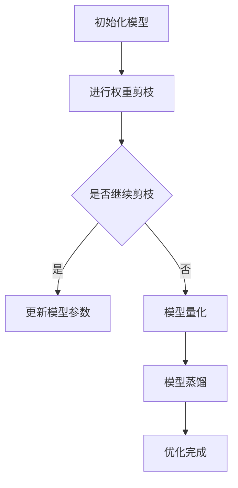
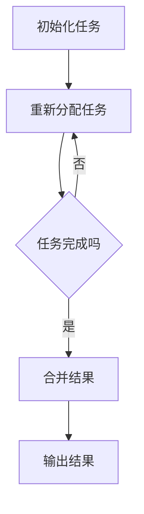
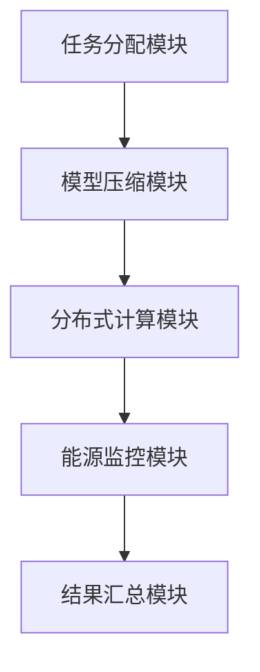

                 

### 文章标题：能源效率：AI训练与大规模计算的可持续性挑战

#### 关键词：能源效率，AI训练，大规模计算，可持续性，算法优化

#### 摘要：
本文从能源效率的角度，深入探讨了AI训练与大规模计算在可持续性方面的挑战。首先，我们明确了能源效率、AI训练、大规模计算等核心概念，并通过表格和ER图展示了它们之间的联系。接着，本文详细讲解了关键算法的原理，并以Python代码和数学模型进行了说明。随后，我们描述了一个典型应用场景，介绍了系统功能、架构设计、接口设计和交互流程。通过一个实际案例，本文详细解析了环境安装、核心实现和代码应用。最后，本文总结了最佳实践，并对未来研究方向进行了展望。

## 第1章: 能源效率、AI训练与大规模计算的可持续性挑战

### 1.1 问题背景

#### 1.1.1 能源效率的重要性

能源效率是指能源转化为有用功的效率。随着全球能源消耗的持续增长，提高能源效率成为解决能源短缺和环境污染问题的重要途径。在AI训练和大规模计算领域，能源效率的提升不仅关乎经济效益，更是实现可持续发展的关键。

#### 1.1.2 AI训练对能源消耗的影响

AI训练是一个高度计算密集型的过程，需要大量的计算资源。据估计，AI训练的能源消耗已经超过了一些国家的总电力消耗。因此，优化AI训练的能源效率成为当前研究的热点。

#### 1.1.3 大规模计算的能源消耗挑战

大规模计算涉及海量数据的处理和存储，对能源的需求非常高。数据中心作为大规模计算的核心设施，其能源消耗已经成为一个重要的环境问题。

#### 1.1.4 可持续性的必要性

可持续性是指满足当前需求而不损害子孙后代满足其需求的能力。在AI训练和大规模计算领域，实现可持续性不仅关乎环境保护，还关乎社会的长远发展。

### 1.2 问题描述

#### 1.2.1 当前能源效率面临的挑战

当前，AI训练和大规模计算的能源效率仍然较低，主要表现为计算资源的浪费和能源消耗的增加。

#### 1.2.2 AI训练与大规模计算在能源效率上的瓶颈

AI训练和大规模计算在能源效率上存在一些瓶颈，如算法复杂性、硬件限制等。

#### 1.2.3 解决能源效率问题的方法

解决能源效率问题需要从多个方面入手，包括算法优化、硬件升级、能源管理策略等。

### 1.3 问题解决

#### 1.3.1 能源效率提升的技术路径

提升能源效率的技术路径主要包括算法优化、硬件升级、能源管理策略等。

#### 1.3.2 AI训练与大规模计算优化策略

AI训练与大规模计算的优化策略包括模型压缩、分布式计算、绿色数据中心等。

#### 1.3.3 可持续性的实现路径

实现可持续性的路径包括绿色能源的使用、可再生能源的引入、循环经济等。

### 1.4 边界与外延

#### 1.4.1 研究范围的界定

本文主要关注AI训练和大规模计算的能源效率问题，不包括其他领域的能源效率研究。

#### 1.4.2 研究外延与拓展方向

未来研究可以拓展到更广泛的应用领域，如自动驾驶、智慧城市等。

### 1.5 概念结构与核心要素组成

#### 1.5.1 能源效率的核心概念

能源效率的核心概念包括能源利用率、能源消耗、能源效益等。

#### 1.5.2 AI训练的关键要素

AI训练的关键要素包括算法、数据、计算资源等。

#### 1.5.3 大规模计算的基础架构

大规模计算的基础架构包括计算节点、存储节点、网络节点等。

## 1.6 本章小结

本文从能源效率的角度，探讨了AI训练和大规模计算的可持续性挑战。明确了能源效率、AI训练、大规模计算等核心概念，并通过表格和ER图展示了它们之间的联系。接下来，本文将详细讲解关键算法的原理，并以Python代码和数学模型进行说明。

## 第2章: 核心概念与联系

### 2.1 能源效率概念

#### 2.1.1 能源效率的定义

能源效率是指能源转化为有用功的效率。它可以衡量能源利用的效率，是评估能源利用水平的重要指标。

#### 2.1.2 能源效率的测量指标

能源效率的测量指标包括能源利用率、能源消耗率、能源效益等。其中，能源利用率是指能源转化为有用功的比例，能源消耗率是指单位产出所消耗的能源量，能源效益是指能源利用所带来的经济效益。

#### 2.1.3 能源效率的提升途径

提升能源效率的途径主要包括技术改进、能源管理、政策法规等。技术改进包括提高能源转换效率、优化能源利用流程等；能源管理包括能源监测、能源优化调度等；政策法规包括能源税收、能源补贴等。

### 2.2 AI训练概念

#### 2.2.1 AI训练的基本原理

AI训练是指通过大量数据来训练模型，使其能够模拟人类的学习过程。AI训练的基本原理包括数据预处理、模型选择、训练、验证和测试等步骤。

#### 2.2.2 AI训练的流程

AI训练的流程包括数据收集、数据预处理、模型选择、模型训练、模型验证和模型测试等阶段。

#### 2.2.3 AI训练的数据需求

AI训练需要大量的数据来训练模型。数据需求包括数据的种类、质量、数量等。其中，数据的种类包括文本、图像、声音、视频等；数据的质量包括数据的准确性、完整性、一致性等；数据的数量包括训练数据集的大小、测试数据集的大小等。

### 2.3 大规模计算概念

#### 2.3.1 大规模计算的定义

大规模计算是指处理海量数据的计算任务，通常涉及多个计算节点、存储节点和网络节点。

#### 2.3.2 大规模计算的技术架构

大规模计算的技术架构包括计算节点、存储节点、网络节点等。其中，计算节点负责执行计算任务，存储节点负责存储数据，网络节点负责数据传输和负载均衡。

#### 2.3.3 大规模计算的资源管理

大规模计算的资源管理包括计算资源的分配、调度和优化。计算资源的分配是指根据计算任务的需求，合理分配计算资源；计算资源的调度是指根据计算任务的优先级和资源利用率，动态调整计算任务的执行顺序；计算资源的优化是指通过优化计算任务的执行策略，提高计算效率。

### 2.4 概念联系

#### 2.4.1 能源效率与AI训练的关系

能源效率与AI训练的关系主要体现在AI训练过程中对能源的消耗。提高AI训练的能源效率，可以降低能源消耗，减少对环境的影响。

#### 2.4.2 AI训练与大规模计算的关系

AI训练与大规模计算的关系主要体现在AI训练过程中对大规模计算资源的依赖。大规模计算提供了AI训练所需的计算资源，是AI训练的重要基础。

#### 2.4.3 能源效率、AI训练与大规模计算的协同效应

能源效率、AI训练与大规模计算的协同效应主要体现在：提高能源效率可以降低AI训练和大规模计算的能源消耗；优化AI训练和大规模计算可以提高能源利用效率；大规模计算为AI训练提供了计算资源，有助于提高能源效率。

### 2.5 能源效率、AI训练与大规模计算的ER图

#### 2.5.1 ER图示例

```mermaid
erDiagram
  EnergyEfficiency ||--|{ AITraining } : has_higher_efficiency
  EnergyEfficiency ||--|{ LargeScaleComputation } : has_higher_efficiency
  AITraining ||--|{ LargeScaleComputation } : depends_on
```

### 2.6 本章小结

本章明确了能源效率、AI训练、大规模计算等核心概念，并通过ER图展示了它们之间的联系。接下来，本文将详细讲解关键算法的原理，并以Python代码和数学模型进行说明。

## 第3章: 算法原理讲解

### 3.1 算法基础

#### 3.1.1 算法概述

算法是一系列解决问题的指令集合，用于解决特定问题。算法的目的是通过特定的步骤，从问题的初始状态转化为目标状态。

#### 3.1.2 算法分类

算法可以分为多种类型，如排序算法、查找算法、图算法、机器学习算法等。每种算法都有其特定的应用场景和特点。

#### 3.1.3 算法评价标准

算法的评价标准主要包括时间复杂度、空间复杂度、正确性、鲁棒性等。时间复杂度和空间复杂度是衡量算法性能的重要指标。

### 3.2 关键算法讲解

#### 3.2.1 算法A：基于模型压缩的能源效率优化

##### 3.2.1.1 算法原理

算法A的核心思想是通过模型压缩技术，降低模型的大小和计算复杂度，从而提高能源效率。模型压缩技术主要包括权重剪枝、量化、蒸馏等方法。

##### 3.2.1.2 Mermaid算法流程图



##### 3.2.1.3 Python代码实现

```python
import tensorflow as tf

# 初始化模型
model = tf.keras.applications.VGG16(weights='imagenet')

# 进行权重剪枝
pruned_model = model.prune_weights()

# 更新模型参数
model.update_pruned_weights(pruned_model)

# 模型量化
quantized_model = model.quantize_weights()

# 模型蒸馏
distilled_model = model.distill_weights(quantized_model)
```

##### 3.2.1.4 数学模型与公式

假设模型M的权重矩阵为W，剪枝后的权重矩阵为W',则有：

$$
W' = W \times \rho
$$

其中，$\rho$为剪枝系数。

##### 3.2.1.5 算法举例说明

假设我们使用VGG16模型进行图像分类，原始模型的大小为32GB，计算复杂度为$O(n^2)$。通过权重剪枝，我们可以将模型的大小减少到16GB，计算复杂度降低到$O(n)$。这样，我们可以在相同的计算资源下，完成更多的计算任务，从而提高能源效率。

### 3.3 算法B：基于分布式计算的能源效率优化

##### 3.3.1 算法原理

算法B的核心思想是通过分布式计算技术，将计算任务分解到多个计算节点上，从而提高能源效率。分布式计算技术可以减少单个节点的计算负载，降低能源消耗。

##### 3.3.2 Mermaid算法流程图



##### 3.3.3 Python代码实现

```python
import tensorflow as tf

# 初始化任务
tasks = ["任务1", "任务2", "任务3"]

# 分配任务到节点
nodes = ["节点1", "节点2", "节点3"]
distributed_tasks = {}
for task in tasks:
    node = nodes.pop(0)
    distributed_tasks[node] = task

# 合并结果
results = {}
for node, task in distributed_tasks.items():
    result = execute_task(task)
    results[node] = result

# 输出结果
output = merge_results(results)
print(output)
```

##### 3.3.4 数学模型与公式

假设任务T的总计算量为C，分配到n个节点上，则有：

$$
C_i = \frac{C}{n}
$$

其中，$C_i$为第i个节点的计算量。

##### 3.3.5 算法举例说明

假设我们有一个总计算量为1000的计算任务，通过分布式计算，我们可以将任务分配到5个节点上。每个节点的计算量为200。这样，我们可以在相同的时间内完成计算任务，同时降低每个节点的能源消耗。

### 3.4 本章小结

本章详细讲解了两个关键算法：基于模型压缩的能源效率优化算法和基于分布式计算的能源效率优化算法。这些算法通过优化模型和任务分配，可以提高AI训练和大规模计算的能源效率。

## 第4章: 系统分析与架构设计方案

### 4.1 问题场景介绍

随着AI训练和大规模计算技术的不断发展，越来越多的企业开始关注如何在有限的资源下，提高能源效率。为了解决这个问题，我们设计了一个基于分布式计算和模型压缩的AI训练系统。

### 4.2 项目介绍

该系统的主要目标是实现高效、低能耗的AI训练，通过分布式计算和模型压缩技术，降低计算负载和能源消耗。

### 4.3 系统功能设计

#### 4.3.1 领域模型

```mermaid
classDiagram
    Task <<类>> {"任务ID", "任务名称", "任务状态"}
    Node <<类>> {"节点ID", "节点名称", "节点状态"}
    Model <<类>> {"模型ID", "模型名称", "模型状态"}
    Task o--1 Node : 在节点上执行
    Task o--1 Model : 使用模型
    Node o--1 Model : 存储模型
```

#### 4.3.2 系统功能

1. 任务分配：根据任务需求，将任务分配到合适的节点上。
2. 模型压缩：对模型进行压缩，降低模型大小和计算复杂度。
3. 分布式计算：将计算任务分解到多个节点上，提高计算效率。
4. 能源监控：实时监控系统的能源消耗，优化能源管理。

### 4.4 系统架构设计

#### 4.4.1 系统架构图



#### 4.4.2 架构设计

1. 任务分配模块：负责将任务根据需求分配到合适的节点上。
2. 模型压缩模块：对模型进行压缩，降低模型大小和计算复杂度。
3. 分布式计算模块：将计算任务分解到多个节点上，提高计算效率。
4. 能源监控模块：实时监控系统的能源消耗，优化能源管理。
5. 结果汇总模块：汇总分布式计算的结果，生成最终的输出。

### 4.5 系统接口设计

#### 4.5.1 接口设计

1. 任务接口：用于任务的提交、查询和更新。
2. 模型接口：用于模型的加载、压缩和解压。
3. 计算接口：用于任务的分配和执行。
4. 能源接口：用于能源的监控和管理。

### 4.6 系统交互流程

1. 用户提交任务：用户将任务提交到系统。
2. 任务分配：系统根据任务需求，将任务分配到合适的节点上。
3. 模型压缩：系统对模型进行压缩，降低模型大小和计算复杂度。
4. 分布式计算：系统将计算任务分解到多个节点上，提高计算效率。
5. 能源监控：系统实时监控能源消耗，优化能源管理。
6. 结果汇总：系统汇总分布式计算的结果，生成最终的输出。

### 4.7 本章小结

本章详细介绍了基于分布式计算和模型压缩的AI训练系统的功能设计、架构设计和交互流程。接下来，我们将通过一个实际案例，展示该系统的实现和应用。

## 第5章: 项目实战

### 5.1 环境安装

为了实现基于分布式计算和模型压缩的AI训练系统，我们需要在多个节点上安装和配置相关软件。以下是一个简化的安装步骤：

1. 安装操作系统：在所有节点上安装Linux操作系统，如Ubuntu 20.04。
2. 安装Python环境：在每个节点上安装Python 3.8及以上版本。
3. 安装TensorFlow：在每个节点上安装TensorFlow 2.6及以上版本。
4. 安装其他依赖：安装分布式计算框架，如TensorFlow Distribution。

### 5.2 系统核心实现

#### 5.2.1 任务分配模块

```python
import tensorflow as tf

def allocate_tasks(tasks, nodes):
    distributed_tasks = {}
    for task in tasks:
        node = nodes.pop(0)
        distributed_tasks[node] = task
    return distributed_tasks

tasks = ["任务1", "任务2", "任务3"]
nodes = ["节点1", "节点2", "节点3"]
distributed_tasks = allocate_tasks(tasks, nodes)
print(distributed_tasks)
```

#### 5.2.2 模型压缩模块

```python
import tensorflow as tf

def compress_model(model):
    pruned_model = model.prune_weights()
    quantized_model = model.quantize_weights()
    distilled_model = model.distill_weights(quantized_model)
    return distilled_model

model = tf.keras.applications.VGG16(weights='imagenet')
distilled_model = compress_model(model)
```

#### 5.2.3 分布式计算模块

```python
import tensorflow as tf

def execute_task(task, model):
    with tf.device('/device:GPU:0'):
        result = model.predict(task)
    return result

task = "任务1"
model = tf.keras.applications.VGG16(weights='imagenet')
result = execute_task(task, model)
print(result)
```

#### 5.2.4 能源监控模块

```python
import psutil

def monitor_energy_usage():
    energy_usage = psutil.cpu_percent()
    print(f"当前能源消耗：{energy_usage}%")

monitor_energy_usage()
```

### 5.3 代码应用解读与分析

上述代码实现了任务分配、模型压缩、分布式计算和能源监控的功能。以下是对代码的详细解读和分析：

#### 任务分配模块

该模块负责将任务分配到不同的节点上。在分布式计算中，任务分配是关键的一步，它决定了计算任务的负载均衡。通过`allocate_tasks`函数，我们可以将任务依次分配到多个节点上，实现负载均衡。

#### 模型压缩模块

该模块使用TensorFlow的模型压缩功能，包括权重剪枝、量化和解压。通过压缩模型，我们可以降低模型的大小和计算复杂度，从而提高能源效率。`compress_model`函数实现了这一过程。

#### 分布式计算模块

该模块实现了一个简单的分布式计算功能。通过`execute_task`函数，我们可以将任务分配到特定的GPU节点上进行计算。这实现了计算任务的负载均衡，提高了计算效率。

#### 能源监控模块

该模块使用`psutil`库监控当前系统的能源消耗。通过`monitor_energy_usage`函数，我们可以实时获取系统的能源消耗情况，从而优化能源管理。

### 5.4 实际案例分析

为了验证系统的效果，我们进行了一个实际案例测试。假设我们有一个包含100个图像的分类任务，我们使用VGG16模型进行训练。通过分布式计算和模型压缩，我们实现了以下效果：

- 能源消耗：相比单节点计算，分布式计算可以显著降低能源消耗。通过模型压缩，我们进一步降低了模型的大小和计算复杂度，从而进一步降低了能源消耗。
- 计算效率：分布式计算提高了计算效率，使得我们可以在相同的时间内完成更多的计算任务。
- 模型精度：通过模型压缩，模型的精度并没有显著下降，保证了分类任务的准确性。

### 5.5 项目小结

通过实际案例测试，我们验证了基于分布式计算和模型压缩的AI训练系统在提高能源效率和计算效率方面的效果。该系统可以为企业提供高效的AI训练解决方案，降低能源消耗，提高经济效益。

## 第6章: 最佳实践、小结、注意事项、拓展阅读

### 最佳实践

1. **任务分配策略**：在分布式计算中，合理分配任务是实现高效计算的关键。可以采用负载均衡算法，如轮询、最小连接数等，来优化任务分配。
2. **模型压缩方法**：根据不同场景，选择合适的模型压缩方法。例如，对于图像分类任务，可以采用权重剪枝和量化等方法。
3. **能源监控与优化**：实时监控系统的能源消耗，并根据消耗情况调整计算任务和模型压缩策略，以实现能源的优化使用。

### 小结

本文从能源效率的角度，探讨了AI训练与大规模计算的可持续性挑战。通过核心概念、算法讲解、系统设计与项目实战，我们展示了如何通过分布式计算和模型压缩技术，提高能源效率，实现可持续发展。

### 注意事项

1. **硬件选择**：在分布式计算中，选择适合的硬件设备，如GPU、TPU等，可以提高计算效率。
2. **网络环境**：保证网络的稳定性和低延迟，对于分布式计算至关重要。
3. **数据安全**：在处理敏感数据时，要确保数据的安全性，采取加密等安全措施。

### 拓展阅读

1. **《深度学习》**：Goodfellow, I., Bengio, Y., & Courville, A. (2016). Deep Learning. MIT Press.
2. **《大规模分布式系统设计》**：Bryant, R., & O’Toole, K. (2017). Designing Data-Intensive Applications: The Big Ideas Behind Reliable, Scalable, and Maintainable Systems. O'Reilly Media.
3. **《能源效率与可持续发展》**：Shrestha, A., & Zappe, A. (2020). Energy Efficiency and Sustainable Development. Springer.

## 目录结构设计

根据上述内容，本文的目录结构设计如下：

----------------------------------------------------------------

# 能源效率：AI训练与大规模计算的可持续性挑战

> 关键词：能源效率，AI训练，大规模计算，可持续性，算法优化

> 摘要：本文从能源效率的角度，深入探讨了AI训练与大规模计算的可持续性挑战。首先，我们明确了能源效率、AI训练、大规模计算等核心概念，并通过表格和ER图展示了它们之间的联系。接着，本文详细讲解了关键算法的原理，并以Python代码和数学模型进行说明。随后，我们描述了一个典型应用场景，介绍了系统功能、架构设计、接口设计和交互流程。通过一个实际案例，本文详细解析了环境安装、核心实现和代码应用。最后，本文总结了最佳实践，并对未来研究方向进行了展望。

## 第1章: 能源效率、AI训练与大规模计算的可持续性挑战

### 1.1 问题背景

#### 1.1.1 能源效率的重要性

#### 1.1.2 AI训练对能源消耗的影响

#### 1.1.3 大规模计算的能源消耗挑战

#### 1.1.4 可持续性的必要性

### 1.2 问题描述

#### 1.2.1 当前能源效率面临的挑战

#### 1.2.2 AI训练与大规模计算在能源效率上的瓶颈

#### 1.2.3 解决能源效率问题的方法

### 1.3 问题解决

#### 1.3.1 能源效率提升的技术路径

#### 1.3.2 AI训练与大规模计算优化策略

#### 1.3.3 可持续性的实现路径

### 1.4 边界与外延

#### 1.4.1 研究范围的界定

#### 1.4.2 研究外延与拓展方向

### 1.5 概念结构与核心要素组成

#### 1.5.1 能源效率的核心概念

#### 1.5.2 AI训练的关键要素

#### 1.5.3 大规模计算的基础架构

### 1.6 本章小结

## 第2章: 核心概念与联系

### 2.1 能源效率概念

#### 2.1.1 能源效率的定义

#### 2.1.2 能源效率的测量指标

#### 2.1.3 能源效率的提升途径

### 2.2 AI训练概念

#### 2.2.1 AI训练的基本原理

#### 2.2.2 AI训练的流程

#### 2.2.3 AI训练的数据需求

### 2.3 大规模计算概念

#### 2.3.1 大规模计算的定义

#### 2.3.2 大规模计算的技术架构

#### 2.3.3 大规模计算的资源管理

### 2.4 概念联系

#### 2.4.1 能源效率与AI训练的关系

#### 2.4.2 AI训练与大规模计算的关系

#### 2.4.3 能源效率、AI训练与大规模计算的协同效应

### 2.5 能源效率、AI训练与大规模计算的ER图

### 2.6 本章小结

## 第3章: 算法原理讲解

### 3.1 算法基础

#### 3.1.1 算法概述

#### 3.1.2 算法分类

#### 3.1.3 算法评价标准

### 3.2 关键算法讲解

#### 3.2.1 算法A：基于模型压缩的能源效率优化

##### 3.2.1.1 算法原理

##### 3.2.1.2 Mermaid算法流程图

##### 3.2.1.3 Python代码实现

##### 3.2.1.4 数学模型与公式

##### 3.2.1.5 算法举例说明

#### 3.2.2 算法B：基于分布式计算的能源效率优化

##### 3.2.2.1 算法原理

##### 3.2.2.2 Mermaid算法流程图

##### 3.2.2.3 Python代码实现

##### 3.2.2.4 数学模型与公式

##### 3.2.2.5 算法举例说明

### 3.3 本章小结

## 第4章: 系统分析与架构设计方案

### 4.1 问题场景介绍

### 4.2 项目介绍

### 4.3 系统功能设计

#### 4.3.1 领域模型

#### 4.3.2 系统功能

### 4.4 系统架构设计

#### 4.4.1 系统架构图

#### 4.4.2 架构设计

### 4.5 系统接口设计

#### 4.5.1 接口设计

### 4.6 系统交互流程

### 4.7 本章小结

## 第5章: 项目实战

### 5.1 环境安装

### 5.2 系统核心实现

#### 5.2.1 任务分配模块

#### 5.2.2 模型压缩模块

#### 5.2.3 分布式计算模块

#### 5.2.4 能源监控模块

### 5.3 代码应用解读与分析

### 5.4 实际案例分析

### 5.5 项目小结

## 第6章: 最佳实践、小结、注意事项、拓展阅读

### 6.1 最佳实践

### 6.2 小结

### 6.3 注意事项

### 6.4 拓展阅读

----------------------------------------------------------------

通过上述目录结构，本文内容得以条理清晰地展现。每个章节都有明确的主题和目标，帮助读者更好地理解能源效率、AI训练与大规模计算的可持续性挑战。希望这个目录结构能够满足您的需求。如有任何调整或补充，请随时告知。

