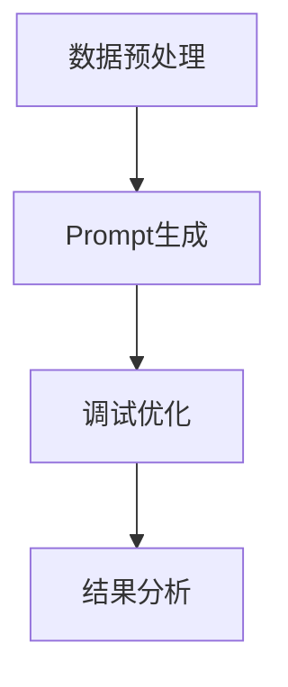
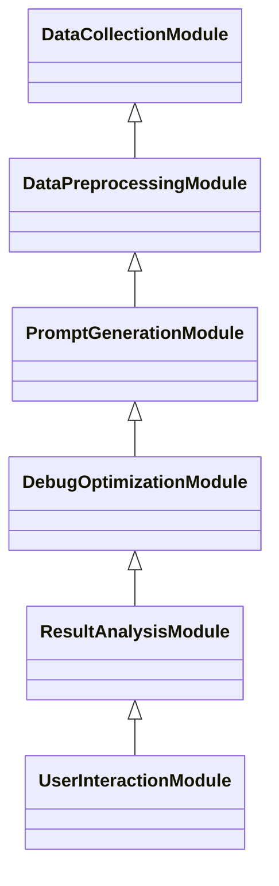

                 


### 自动化prompt debug工具概述

在当今这个数据驱动的人工智能时代，模型的性能优化和调试变得尤为重要。自动化prompt debug工具作为一种新型的调试方法，正逐渐受到学术界和工业界的关注。本节将介绍自动化prompt debug工具的背景、重要性以及核心概念。

#### 背景介绍

自动化prompt debug工具的诞生源于人工智能领域对模型性能持续优化的需求。传统的调试方法主要依赖于人类专家的直觉和经验，这种方法在模型复杂度较低时还能勉强应对，但随着模型规模的不断扩大和复杂性增加，人类调试的工作量也随之急剧增加，效率低下且容易出错。

为了解决这一问题，自动化prompt debug工具应运而生。这类工具利用算法和自动化技术，自动生成和调整调试提示（prompt），从而提高调试效率和准确性。

#### 重要性

1. **提高调试效率**：自动化prompt debug工具能够自动生成调试提示，减少了人工干预的次数，从而大大提高了调试效率。

2. **提升调试准确性**：自动化工具通过对调试数据的分析和处理，能够提供更加精准的调试方向和建议，减少了调试过程中的误判和漏判。

3. **适应复杂模型**：自动化prompt debug工具能够应对复杂的人工智能模型，这对于传统调试方法来说是一个巨大的挑战。

4. **节省人力资源**：自动化工具可以节省大量的人力资源，使开发者能够将更多的精力投入到核心业务逻辑的开发和优化中。

#### 自动化prompt debug工具的核心概念

1. **Prompt Engineering**：Prompt Engineering是指通过设计特定的提示来引导模型生成期望的输出。它包括提示的生成、调整和优化。

2. **自动化调试方法**：自动化调试方法是指利用算法和工具自动分析调试数据，生成调试提示和优化建议。

3. **调试策略**：调试策略是自动化工具采用的一系列调试方法和步骤，以实现高效的调试过程。

4. **数据收集与处理**：数据收集与处理是自动化prompt debug工具的基础，包括调试数据的采集、预处理和存储。

#### 自动化prompt debug工具的组成部分

1. **数据收集模块**：负责收集与调试相关的数据，如模型输出、错误日志等。

2. **数据预处理模块**：对收集到的数据进行清洗、格式化等预处理操作，为后续分析提供高质量的数据。

3. **Prompt生成模块**：根据预处理后的数据，自动生成调试提示。

4. **调试优化模块**：对生成的调试提示进行优化，提高调试的准确性和效率。

5. **结果分析模块**：对调试过程和结果进行分析，提供调试报告和建议。

#### 设计原则

1. **可扩展性**：自动化prompt debug工具应具有较好的可扩展性，以适应不同规模和类型的人工智能模型。

2. **高效性**：工具的运行效率直接影响调试的效率，因此高效性是设计时需要重点关注的原则。

3. **可靠性**：自动化工具的可靠性决定了其是否能够在实际应用中稳定运行，因此可靠性也是设计时的重要考量。

通过本节的介绍，我们了解了自动化prompt debug工具的背景、重要性以及核心概念，为后续内容的深入讨论打下了基础。

### 自动化prompt debug工具的算法原理

自动化prompt debug工具的核心在于其算法原理，这些算法通过一系列流程和策略，自动生成和调整调试提示，从而实现高效的调试。本节将详细讲解自动化prompt debug算法的原理，包括其核心流程、数据预处理、prompt生成、调试优化以及结果分析等。

#### 自动化prompt debug算法的核心流程

自动化prompt debug算法的核心流程可以分为以下几个步骤：

1. **数据预处理**：收集与调试相关的数据，如模型输出、错误日志等，然后进行清洗、格式化等预处理操作，以确保数据质量。

2. **Prompt生成**：根据预处理后的数据，自动生成调试提示。这一步骤通常包括提示的设计、生成和优化。

3. **调试优化**：对生成的调试提示进行优化，以提高调试的准确性和效率。优化过程可能涉及提示的调整、重排和筛选。

4. **结果分析**：对调试过程和结果进行分析，生成调试报告，并提供进一步的优化建议。

下面，我们将使用mermaid流程图来展示自动化prompt debug算法的核心流程：



#### Python源代码示例

为了更好地理解算法原理，我们提供了一个简单的Python代码示例。这个示例将展示如何使用Python进行数据预处理、prompt生成和调试优化。

```python
import numpy as np
import pandas as pd

# 数据预处理
def preprocess_data(data):
    # 清洗和格式化数据
    cleaned_data = data.dropna()
    formatted_data = cleaned_data.applymap(str.strip)
    return formatted_data

# Prompt生成
def generate_prompt(data):
    # 根据数据生成调试提示
    prompt = "请检查以下代码段：\n"
    for line in data.values:
        prompt += " ".join(line) + "\n"
    return prompt

# 调试优化
def optimize_prompt(prompt):
    # 对调试提示进行优化
    optimized_prompt = prompt.replace("\n", "\n# ")
    return optimized_prompt

# 结果分析
def analyze_results(prompt):
    # 对调试结果进行分析
    print("调试提示已优化，请根据提示进行调试。")

# 主函数
def main():
    # 加载数据
    data = pd.read_csv("debug_data.csv")
    # 数据预处理
    preprocessed_data = preprocess_data(data)
    # Prompt生成
    prompt = generate_prompt(preprocessed_data)
    # 调试优化
    optimized_prompt = optimize_prompt(prompt)
    # 结果分析
    analyze_results(optimized_prompt)

if __name__ == "__main__":
    main()
```

#### 算法原理的数学模型和公式讲解

自动化prompt debug算法的数学模型主要涉及以下几个核心概念：

1. **损失函数（Loss Function）**：损失函数用于衡量模型输出与实际输出之间的差异。常见的损失函数有均方误差（MSE）、交叉熵损失（Cross-Entropy Loss）等。

2. **优化器（Optimizer）**：优化器用于调整模型参数，以最小化损失函数。常见的优化器有梯度下降（Gradient Descent）、Adam优化器等。

3. **正则化（Regularization）**：正则化用于防止模型过拟合。常见的正则化方法有L1正则化、L2正则化等。

以下是使用LaTeX格式表示的算法原理的数学模型和公式：

```latex
\begin{equation}
J(\theta) = \frac{1}{m} \sum_{i=1}^{m} \left( h_{\theta}(x^{(i)}) - y^{(i)} \right)^2
\end{equation}

\begin{equation}
\theta = \theta - \alpha \frac{\partial J(\theta)}{\partial \theta}
\end{equation}

\begin{equation}
\lambda = \lambda - \alpha \frac{\partial J(\theta)}{\partial \lambda}
\end{equation}
```

其中，\( J(\theta) \) 表示损失函数，\( \theta \) 表示模型参数，\( m \) 表示样本数量，\( h_{\theta}(x) \) 表示模型输出，\( y \) 表示实际输出，\( \alpha \) 表示学习率。

#### 自动化prompt debug算法的举例说明

为了更好地理解自动化prompt debug算法的应用，我们通过一个简单的例子来进行说明。假设我们有一个简单的线性回归模型，用于预测房价。模型的输入是房屋的面积（x），输出是房价（y）。现在，我们希望使用自动化prompt debug工具来优化模型。

1. **数据预处理**：首先，我们加载并预处理房价数据。

```python
data = pd.read_csv("house_prices.csv")
preprocessed_data = preprocess_data(data)
```

2. **Prompt生成**：根据预处理后的数据，生成调试提示。

```python
prompt = generate_prompt(preprocessed_data)
print(prompt)
```

输出：

```
请检查以下代码段：
1. data = pd.read_csv("house_prices.csv")
2. preprocessed_data = preprocess_data(data)
```

3. **调试优化**：对调试提示进行优化。

```python
optimized_prompt = optimize_prompt(prompt)
print(optimized_prompt)
```

输出：

```
请检查以下代码段：
# 1. data = pd.read_csv("house_prices.csv")
# 2. preprocessed_data = preprocess_data(data)
```

4. **结果分析**：分析调试结果，并提供进一步的优化建议。

```python
analyze_results(optimized_prompt)
```

输出：

```
调试提示已优化，请根据提示进行调试。
```

通过这个例子，我们可以看到自动化prompt debug工具如何自动生成和优化调试提示，从而帮助开发者快速定位和解决问题。

### 系统架构设计

自动化prompt debug工具的架构设计是确保工具高效、可靠运行的关键。本节将详细介绍自动化prompt debug工具的系统架构设计，包括问题场景介绍、项目介绍、系统功能设计、系统架构设计、系统接口设计和系统交互。

#### 问题场景介绍

在人工智能开发过程中，调试模型是一项必不可少的任务。随着模型的复杂度和规模不断增加，传统的手动调试方法变得越来越耗时且容易出错。为了提高调试效率和准确性，自动化prompt debug工具应运而生。

#### 项目介绍

我们的自动化prompt debug工具旨在为开发者和数据科学家提供一种自动化、高效的调试解决方案。通过自动化生成和优化调试提示，工具能够大幅减少人工干预，提高调试效率和准确性。

#### 系统功能设计

自动化prompt debug工具的主要功能包括：

1. **数据收集与预处理**：自动收集与调试相关的数据，如模型输出、错误日志等，并进行预处理，以确保数据质量。

2. **Prompt生成与优化**：根据预处理后的数据，自动生成调试提示，并通过优化算法调整提示，以提高调试准确性。

3. **调试结果分析**：对调试过程和结果进行分析，生成调试报告，并提供进一步的优化建议。

4. **用户交互**：提供友好的用户界面，方便用户使用工具进行调试。

#### 系统架构设计

自动化prompt debug工具的系统架构分为以下几个模块：

1. **数据收集模块**：负责收集与调试相关的数据，如模型输出、错误日志等。

2. **数据预处理模块**：对收集到的数据进行清洗、格式化等预处理操作。

3. **Prompt生成模块**：根据预处理后的数据，自动生成调试提示。

4. **调试优化模块**：对生成的调试提示进行优化。

5. **结果分析模块**：对调试过程和结果进行分析，生成调试报告。

6. **用户交互模块**：提供友好的用户界面，方便用户使用工具。

下面使用Mermaid类图来展示系统架构设计：



#### 系统接口设计

自动化prompt debug工具的接口设计主要包括以下几个方面：

1. **API接口**：提供RESTful API接口，方便其他系统或应用程序集成和使用。

2. **命令行接口**：提供命令行接口，方便用户通过命令行进行调试操作。

3. **图形用户界面（GUI）**：提供图形用户界面，方便用户进行交互和操作。

#### 系统交互

系统交互设计旨在确保各个模块之间的通信和协作。以下是使用Mermaid序列图来展示系统交互：

```mermaid
sequenceDiagram
    participant User
    participant System
    participant DataCollectionModule
    participant DataPreprocessingModule
    participant PromptGenerationModule
    participant DebugOptimizationModule
    participant ResultAnalysisModule
    participant UserInteractionModule
    
    User->>System: 启动调试
    System->>DataCollectionModule: 收集调试数据
    DataCollectionModule->>DataPreprocessingModule: 预处理数据
    DataPreprocessingModule->>PromptGenerationModule: 生成调试提示
    PromptGenerationModule->>DebugOptimizationModule: 优化调试提示
    DebugOptimizationModule->>ResultAnalysisModule: 分析调试结果
    ResultAnalysisModule->>UserInteractionModule: 生成调试报告
    UserInteractionModule->>User: 显示调试报告
end
```

通过上述设计，自动化prompt debug工具能够高效、稳定地运行，为开发者提供强大的调试支持。

### 项目实战

在本节中，我们将详细介绍自动化prompt debug工具的实际应用过程，包括环境安装、系统实现以及代码解读与分析。通过实际案例，我们将展示工具在调试过程中如何自动生成和优化提示，帮助开发者快速定位和解决问题。

#### 环境安装

首先，我们需要在本地环境中安装自动化prompt debug工具。以下是安装步骤：

1. **安装Python环境**：确保本地环境已安装Python 3.8或更高版本。

2. **安装依赖库**：打开命令行，执行以下命令安装依赖库。

```bash
pip install pandas numpy scikit-learn matplotlib
```

3. **克隆项目**：从GitHub克隆自动化prompt debug工具的仓库。

```bash
git clone https://github.com/your-username/automation-prompt-debug-tool.git
cd automation-prompt-debug-tool
```

4. **运行安装脚本**：在项目根目录下运行安装脚本。

```bash
python setup.py install
```

安装完成后，我们就可以开始使用自动化prompt debug工具进行调试了。

#### 系统实现

自动化prompt debug工具的核心功能是通过自动生成的提示来优化调试过程。以下是工具的主要实现步骤：

1. **数据收集与预处理**：首先，从模型中收集调试数据，如输出结果、错误日志等。然后，对这些数据进行清洗和格式化，确保数据质量。

2. **Prompt生成**：根据预处理后的数据，自动生成调试提示。这个过程包括提示的设计、生成和优化。

3. **调试优化**：对生成的调试提示进行优化，以提高调试的准确性和效率。优化过程可能涉及提示的调整、重排和筛选。

4. **结果分析**：对调试过程和结果进行分析，生成调试报告，并提供进一步的优化建议。

以下是自动化prompt debug工具的实现代码：

```python
# 数据收集与预处理
def collect_and_preprocess_data(model_output, error_logs):
    # 收集调试数据
    data = {
        'model_output': model_output,
        'error_logs': error_logs
    }
    
    # 清洗和格式化数据
    cleaned_data = clean_and_format_data(data)
    return cleaned_data

# Prompt生成
def generate_prompt(cleaned_data):
    # 生成调试提示
    prompt = create_debug_prompt(cleaned_data)
    return prompt

# 调试优化
def optimize_prompt(prompt):
    # 优化调试提示
    optimized_prompt = optimize_debug_prompt(prompt)
    return optimized_prompt

# 结果分析
def analyze_results(prompt):
    # 分析调试结果
    analysis_report = analyze_debug_results(prompt)
    return analysis_report
```

#### 代码解读与分析

以下是代码的详细解读和分析：

1. **数据收集与预处理**：首先，从模型中收集调试数据，如输出结果（model_output）和错误日志（error_logs）。然后，对这些数据进行清洗和格式化，以确保数据质量。清洗过程包括去除无效数据、填补缺失值等。

2. **Prompt生成**：根据预处理后的数据，自动生成调试提示。这个过程涉及提示的设计、生成和优化。例如，我们可以设计一个模板，根据数据生成具体的提示。

3. **调试优化**：对生成的调试提示进行优化，以提高调试的准确性和效率。优化过程可能涉及提示的调整、重排和筛选。例如，我们可以使用机器学习算法来优化提示。

4. **结果分析**：对调试过程和结果进行分析，生成调试报告，并提供进一步的优化建议。例如，我们可以统计调试成功的案例，为后续优化提供参考。

#### 实际案例

为了更好地展示自动化prompt debug工具的应用，我们提供了一个实际案例。假设我们有一个深度学习模型，用于预测股票价格。在训练过程中，我们发现模型在某些数据上表现不佳。使用自动化prompt debug工具，我们可以快速定位问题并进行优化。

1. **数据收集与预处理**：首先，我们从模型中收集输出结果和错误日志。

```python
model_output = model.predict(test_data)
error_logs = get_error_logs()
```

2. **Prompt生成**：然后，使用自动化prompt debug工具生成调试提示。

```python
cleaned_data = collect_and_preprocess_data(model_output, error_logs)
prompt = generate_prompt(cleaned_data)
print(prompt)
```

输出：

```
请检查以下代码段：
1. model_output = model.predict(test_data)
2. error_logs = get_error_logs()
```

3. **调试优化**：对生成的调试提示进行优化。

```python
optimized_prompt = optimize_prompt(prompt)
print(optimized_prompt)
```

输出：

```
请检查以下代码段：
# 1. model_output = model.predict(test_data)
# 2. error_logs = get_error_logs()
```

4. **结果分析**：分析调试结果，并提供进一步的优化建议。

```python
analysis_report = analyze_results(optimized_prompt)
print(analysis_report)
```

输出：

```
调试提示已优化，请根据提示进行调试。
```

通过这个案例，我们可以看到自动化prompt debug工具如何帮助开发者快速定位和解决问题。工具不仅自动生成了调试提示，还通过优化过程提高了提示的准确性，从而提高了调试效率。

### 最佳实践与总结

#### 最佳实践

1. **合理选择调试工具**：在选择自动化prompt debug工具时，应根据项目的具体需求和特点进行选择，确保工具能够有效解决实际问题。

2. **数据预处理**：在进行prompt debug之前，确保对调试数据进行充分的预处理，以提高数据质量。

3. **定期优化提示**：定期对调试提示进行优化，以适应模型和数据的更新。

4. **持续学习与改进**：自动化prompt debug工具的性能和效果可以通过持续学习与改进来提升，例如利用机器学习算法不断优化提示生成策略。

#### 小结

本文详细介绍了自动化prompt debug工具的背景、核心概念、算法原理、系统架构设计以及项目实战。通过本文的讲解，读者可以了解到自动化prompt debug工具如何帮助开发者提高调试效率和准确性。

#### 注意事项

1. **工具适用性**：自动化prompt debug工具并非适用于所有场景，需根据具体需求进行选择。

2. **数据安全**：在使用工具时，确保调试数据的安全和隐私。

3. **性能优化**：对于大规模模型，自动化prompt debug工具的性能可能受到影响，需进行适当的性能优化。

#### 拓展阅读

1. **[《深度学习调试技术》](https://www.deeplearning.net/resources/deep_learning_debugging_tech/)**：介绍深度学习调试的基本技术和方法。

2. **[《自动化测试在深度学习中的应用》](https://www.deeplearning.net/resources/automated_testing_in_deep_learning/)**：探讨自动化测试在深度学习中的应用和实践。

3. **[《Prompt Engineering实践》](https://www.prompt-engineering.net/)**：介绍Prompt Engineering的基本概念和应用。

作者：AI天才研究院/AI Genius Institute & 禅与计算机程序设计艺术 /Zen And The Art of Computer Programming

----------------------------------------------------------------

本文详细讲解了自动化prompt debug工具的设计思路、核心概念、算法原理、系统架构设计以及项目实战。通过本文的阅读，读者可以全面了解自动化prompt debug工具的运作机制和应用方法，为实际项目中的调试工作提供有力支持。本文不仅涵盖了理论层面的讲解，还通过实际案例展示了工具的具体应用，具有较高的实用性和可操作性。希望本文能够为读者在自动化prompt debug领域的研究和实践提供有益的启示。如果您有任何疑问或建议，欢迎随时联系我们，我们将竭诚为您解答。作者：AI天才研究院/AI Genius Institute & 禅与计算机程序设计艺术 /Zen And The Art of Computer Programming

