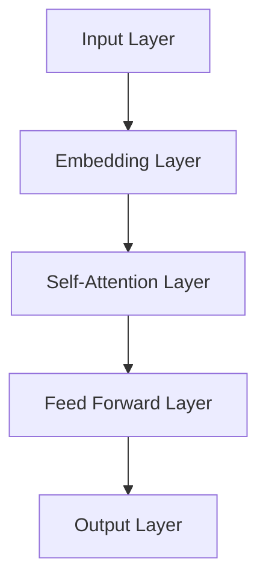
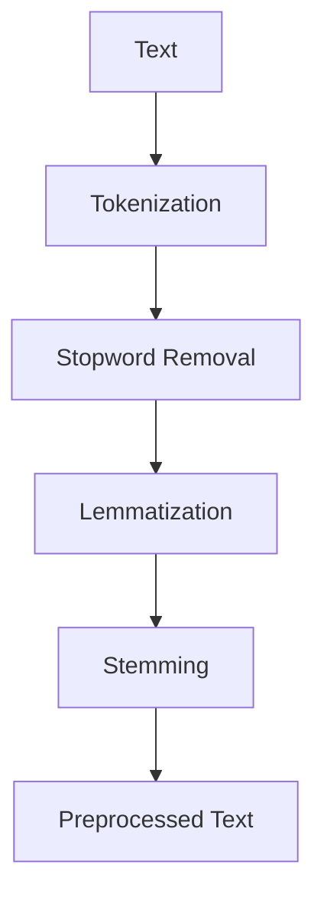
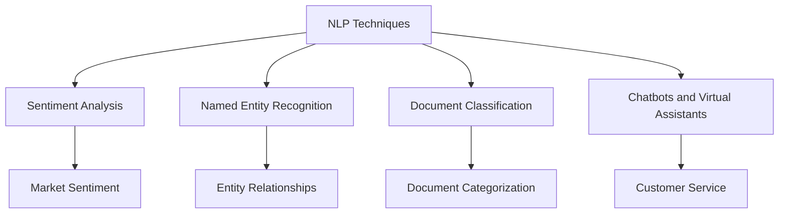
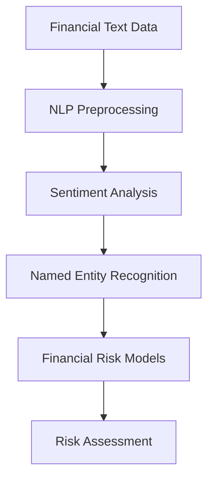

                 

### 1. Introduction to the Topic: Natural Language Processing in Financial Risk Assessment

In the rapidly evolving landscape of finance, the incorporation of advanced technologies, particularly natural language processing (NLP), is revolutionizing how risks are assessed and managed. This blog aims to delve into the innovative applications of NLP within the realm of financial risk assessment. By examining the integration of NLP techniques with traditional risk assessment methodologies, we will explore how this combination can enhance decision-making processes, improve market insights, and ultimately contribute to more stable and resilient financial systems.

Key Terms and Concepts:

- **Natural Language Processing (NLP):** A subfield of artificial intelligence that focuses on the interaction between computers and humans through the use of natural language.
- **Financial Risk Assessment:** The process of evaluating the degree of uncertainty and potential financial loss associated with investments and business activities.
- **Sentiment Analysis:** The use of NLP to identify and extract subjective information from source materials.
- **Named Entity Recognition (NER):** A subtask of information extraction that identifies and classifies named entities in text into predefined categories such as person names, organizations, locations, and medical entities.

The primary objective of this blog is to provide a comprehensive overview of how NLP can be leveraged to address the complexities of financial risk assessment. We will begin by introducing the fundamental concepts of NLP and financial risk assessment, highlighting the challenges and opportunities that arise when these two domains intersect. Subsequent sections will delve into specific NLP techniques and their applications in financial risk assessment, backed by case studies and real-world examples. Finally, we will discuss the future directions and potential innovations in this rapidly growing field.

### 2. The Role of NLP in Financial Risk Assessment

Natural Language Processing (NLP) has established itself as a transformative technology across various industries, and its integration into financial risk assessment is no exception. NLP's ability to process, analyze, and understand human language offers unparalleled advantages in capturing and interpreting the vast amounts of unstructured data prevalent in the financial sector. This section will explore the critical role NLP plays in financial risk assessment and the fundamental concepts that underpin its effectiveness.

#### 2.1 Text Data in Financial Risk Assessment

Financial institutions deal with a plethora of textual data, including but not limited to financial reports, news articles, social media posts, and customer communications. This unstructured data often contains valuable insights and cues that traditional quantitative analysis methods may overlook. NLP enables the systematic extraction of meaningful information from these text sources, converting them into actionable data that can be integrated into risk assessment models.

**Key points to consider:**

- **Data Diversity:** Financial text data is diverse and complex, containing various linguistic nuances and informal expressions. NLP techniques are essential for handling this diversity effectively.
- **Contextual Understanding:** Understanding the context in which text data is used is crucial for accurate risk assessment. NLP's ability to parse context and derive meaning from it provides a significant advantage.
- **Speed and Scale:** NLP can process large volumes of text data quickly, enabling real-time analysis and decision-making, which is particularly important in fast-paced financial markets.

#### 2.2 Sentiment Analysis

Sentiment analysis, a cornerstone of NLP, involves identifying and categorizing opinions expressed in text data. In financial risk assessment, sentiment analysis can be used to gauge market sentiment, investor sentiment, and the impact of news on stock prices.

**Key points to consider:**

- **Market Sentiment:** Analyzing market sentiment can help predict market trends and identify potential risks or opportunities. For example, an increase in positive sentiment may indicate a bullish market, while a surge in negative sentiment may suggest a downturn.
- **News Impact:** Sentiment analysis can detect the sentiment behind news articles, press releases, and social media posts. This information is crucial for assessing the impact of news on financial instruments.
- **Accuracy:** The accuracy of sentiment analysis models is critical. Misinterpretations can lead to incorrect risk assessments and potentially costly mistakes.

#### 2.3 Named Entity Recognition (NER)

NER is another vital NLP technique used in financial risk assessment. It involves identifying and classifying named entities within text into predefined categories such as companies, locations, and financial terms.

**Key points to consider:**

- **Entity Identification:** Identifying entities within financial text data is essential for tracking the performance and risks associated with specific companies, industries, or regions.
- **Contextual Relationships:** Understanding the relationships between named entities is crucial for accurate risk assessment. For example, a change in the financial status of a particular company can impact the entire industry.
- **Data Integration:** NER enables the integration of entity-level data into broader risk assessment frameworks, providing a more granular view of financial risks.

#### 2.4 Language Models

Language models, such as transformers and recurrent neural networks (RNNs), are fundamental to NLP applications. These models are trained on vast amounts of text data to predict the likelihood of word sequences and generate coherent text.

**Key points to consider:**

- **Sequence Prediction:** Language models excel at predicting the next word or phrase in a sequence, which is invaluable for generating summaries, extracting key insights, and understanding text semantics.
- **Contextual Understanding:** Advanced language models like GPT-3 and BERT have been trained to understand the context in which words are used, significantly enhancing their ability to provide accurate risk assessments.
- **Generative Text:** Language models can generate coherent text based on given prompts, enabling the creation of natural-sounding reports and analyses that can inform risk management strategies.

### Conclusion

In conclusion, NLP offers a powerful set of tools for enhancing financial risk assessment by enabling the systematic analysis of unstructured text data. Techniques such as sentiment analysis and named entity recognition provide valuable insights that can complement traditional quantitative methods, leading to more accurate and comprehensive risk assessments. As NLP technologies continue to evolve, their integration into financial risk management is likely to become increasingly sophisticated, offering new opportunities for innovation and risk mitigation.

### 3. Fundamental Concepts of NLP

To understand the innovative applications of NLP in financial risk assessment, it is crucial to first grasp the foundational concepts and techniques that underpin NLP. In this section, we will delve into key NLP concepts, including language models, text preprocessing techniques, and their roles in the financial domain.

#### 3.1 Language Models

Language models are at the core of NLP, serving as the foundation for various NLP applications. These models are designed to understand and generate human language, making them highly valuable in financial risk assessment.

**Key Points to Consider:**

- **Types of Language Models:** Language models can be categorized into statistical models, rule-based models, and neural network-based models. Modern language models, such as transformers, have revolutionized NLP by achieving superior performance.
- **Transformers:** Transformers, introduced by Vaswani et al. in 2017, are a type of neural network architecture that has become the standard for language modeling. They use self-attention mechanisms to capture relationships between words in a text sequence.
- **Recurrent Neural Networks (RNNs):** RNNs, particularly Long Short-Term Memory (LSTM) networks, are another type of neural network used for language modeling. They are capable of capturing long-term dependencies in text data.

**Figure 1: Mermaid flowchart showing the architecture of a Transformer model.**

#### 3.2 Text Preprocessing Techniques

Before language models can process text data, it must be preprocessed to remove noise, normalize the text, and prepare it for analysis. Common preprocessing techniques include tokenization, stopword removal, and stemming or lemmatization.

**Key Points to Consider:**

- **Tokenization:** Tokenization involves splitting text into individual words or tokens. This is a critical step for most NLP tasks, as it allows models to work with discrete units of text.
- **Stopword Removal:** Stopwords are common words like "the," "is," and "and" that do not carry significant meaning. Removing stopwords can help reduce noise and improve model performance.
- **Lemmatization and Stemming:** Lemmatization reduces words to their base or dictionary form, while stemming truncates words to their root form. Both techniques help in standardizing text data and improving model training efficiency.

**Table 1: Comparison of Lemmatization and Stemming**

| Technique | Example | Result |
| --- | --- | --- |
| Lemmatization | "fishing" | "fish" |
| Stemming | "fishing" | "fis" |

**Figure 2: Mermaid ER diagram illustrating the entities involved in text preprocessing.**

#### 3.3 Role of NLP in Financial Risk Assessment

The ability of NLP to process and analyze unstructured text data is particularly valuable in the financial domain. Here are some key applications and roles of NLP in financial risk assessment:

- **Sentiment Analysis:** NLP can analyze financial reports, news articles, and social media posts to gauge market sentiment, helping to predict market trends and assess risks associated with sentiment shifts.
- **Named Entity Recognition (NER):** By identifying and categorizing entities such as companies, financial terms, and locations within financial text, NLP can provide valuable insights into the relationships and interactions that impact financial risk.
- **Document Classification:** NLP can classify documents based on their content, helping financial institutions categorize reports, news articles, and customer communications, enabling more efficient data management and analysis.
- **Chatbots and Virtual Assistants:** NLP enables the development of chatbots and virtual assistants that can understand and respond to customer queries, improving customer service and reducing operational costs.

**Figure 3: Mermaid class diagram illustrating the role of NLP in financial risk assessment.**

In conclusion, a solid understanding of the fundamental concepts of NLP is essential for leveraging its capabilities in financial risk assessment. Language models and text preprocessing techniques play a critical role in enabling the analysis of unstructured financial text data, providing valuable insights that can enhance risk management and decision-making processes.

### 4. Principles of Financial Risk Assessment

Financial risk assessment is a multifaceted process that aims to evaluate the potential for financial loss or uncertainty associated with investments, loans, and other financial activities. At its core, it involves identifying, measuring, and mitigating various types of risks to ensure the stability and profitability of financial institutions. This section will delve into the fundamental principles of financial risk assessment, exploring key concepts, methods, and challenges in integrating NLP.

#### 4.1 Financial Markets and Risk

Financial markets are complex systems where buyers and sellers trade a variety of financial instruments, such as stocks, bonds, commodities, and derivatives. The inherent uncertainty in these markets gives rise to several types of financial risk:

- **Market Risk:** This risk is associated with the overall performance of the financial markets. It includes fluctuations in stock prices, interest rates, and commodity prices. Market risk is often measured using statistical models, such as Value at Risk (VaR) and Conditional Value at Risk (CVaR).
- **Credit Risk:** Credit risk arises from the possibility that a borrower may default on a loan or fail to meet payment obligations. This type of risk is typically assessed through credit scoring, financial analysis, and credit rating agencies.
- **Operational Risk:** Operational risk involves the risk of loss resulting from inadequate or failed internal processes, people, systems, or external events. It includes fraud, errors, and legal issues.
- **Liquidity Risk:** Liquidity risk occurs when a financial institution is unable to meet its short-term obligations. This risk is particularly critical in volatile markets, where asset prices can decline rapidly.

#### 4.2 Risk Assessment Methods

There are several methodologies and tools used in financial risk assessment. These methods can be broadly classified into quantitative and qualitative approaches:

- **Quantitative Methods:** These methods use mathematical models and statistical analysis to measure and predict risk. Common quantitative tools include:
  - **Value at Risk (VaR):** VaR estimates the maximum potential loss over a specified time period at a given confidence level.
  - **Monte Carlo Simulation:** This technique models the potential outcomes of a financial scenario by simulating a large number of possible market conditions.
  - **Portfolio Optimization:** Portfolio optimization aims to create a portfolio of assets that maximizes expected returns for a given level of risk.
- **Qualitative Methods:** Qualitative methods rely on expert judgment, historical data, and narrative analysis to assess risk. Examples include:
  - **Scenario Analysis:** Scenario analysis involves creating and analyzing various scenarios to understand the potential impact of different market conditions.
  - **Risk Matrix:** A risk matrix is a tool that quantifies risk by mapping probability and impact on a grid, allowing for a visual representation of risk exposure.

#### 4.3 Challenges in Integrating NLP

Integrating NLP into financial risk assessment poses several challenges due to the nature of financial text data and the complexity of risk assessment processes. Some of the key challenges include:

- **Data Quality:** Financial text data can be noisy and inconsistent, making it difficult for NLP models to extract reliable information. Issues such as misspellings, abbreviations, and informal language can affect the accuracy of NLP-based risk assessments.
- **Contextual Understanding:** Financial text often contains domain-specific jargon and complex relationships between entities. NLP models must be trained to understand these nuances to accurately interpret the text and derive meaningful insights.
- **Model Interpretability:** The complexity of NLP models, particularly deep learning models, can make it challenging to interpret their predictions. This lack of interpretability can be a significant barrier in a field like financial risk assessment, where understanding the underlying reasons for risk assessments is crucial.
- **Scalability:** Financial institutions deal with large volumes of textual data from various sources. Scaling NLP models to handle this data efficiently is a technical challenge that requires robust infrastructure and computational resources.

**Figure 4: Mermaid flowchart illustrating the integration of NLP into financial risk assessment.**

In conclusion, financial risk assessment is a critical function that involves evaluating the potential for financial loss across various market conditions. Integrating NLP into this process offers significant opportunities to enhance the analysis of unstructured financial text data. However, addressing the challenges associated with data quality, contextual understanding, model interpretability, and scalability is essential to fully realize the potential of NLP in financial risk assessment.

### 5. NLP Techniques in Financial Risk Assessment

Natural Language Processing (NLP) offers a suite of advanced techniques that can significantly enhance the process of financial risk assessment. By leveraging NLP methods such as text analysis, sentiment analysis, and named entity recognition (NER), financial institutions can derive deeper insights from unstructured data, leading to more accurate and comprehensive risk evaluations. This section will delve into the specifics of these NLP techniques and their applications in financial risk assessment.

#### 5.1 Text Analysis Methods

Text analysis is a fundamental component of NLP that involves the processing and analysis of text to extract meaningful information. In the context of financial risk assessment, text analysis methods are used to understand the content and context of financial documents, news articles, and social media posts.

**Sentiment Analysis**

Sentiment analysis, also known as opinion mining, is the process of determining the sentiment expressed in a text. In financial risk assessment, sentiment analysis can be used to gauge market sentiment, investor sentiment, and the impact of news on stock prices.

- **Application:** Financial institutions use sentiment analysis to track market sentiment in real-time, which can provide early warnings of potential market downturns or opportunities.
- **Methodology:** Sentiment analysis typically involves the following steps:
  - **Tokenization:** Splitting text into individual words or tokens.
  - **Stopword Removal:** Removing common words that do not contribute to sentiment.
  - **Lemmatization:** Reducing words to their base form to standardize the text.
  - **Sentiment Classification:** Assigning a sentiment label (positive, negative, neutral) to each token based on a pre-trained sentiment lexicon or model.

**Named Entity Recognition (NER)**

NER is a subtask of information extraction that involves identifying and categorizing named entities within text. In financial risk assessment, NER is used to identify entities such as companies, financial terms, and locations.

- **Application:** NER helps in tracking the performance and risks associated with specific entities, providing a granular view of financial risks.
- **Methodology:** NER typically involves the following steps:
  - **Tokenization:** Splitting text into individual words or tokens.
  - **Part-of-Speech Tagging:** Assigning grammatical tags to each token (noun, verb, adjective, etc.).
  - **Entity Recognition:** Identifying and classifying tokens into predefined entity categories.
  - **Relation Extraction:** Determining relationships between entities (e.g., company location, stock ownership).

**Topic Modeling**

Topic modeling is a technique used to discover abstract topics within a collection of documents. In financial risk assessment, topic modeling can be used to identify the main topics discussed in financial news articles, which can provide insights into market trends and risks.

- **Application:** Topic modeling helps financial institutions understand the underlying themes in financial news, which can inform risk management strategies.
- **Methodology:** Topic modeling typically involves the following steps:
  - **Document Representation:** Representing documents as vectors of word frequencies or term frequencies.
  - **Topic Detection:** Using algorithms like Latent Dirichlet Allocation (LDA) to identify topics based on the word distribution in the documents.
  - **Topic Interpretation:** Assigning topics to documents and analyzing the importance of each topic in relation to financial risk.

#### 5.2 Machine Learning Models for Financial Risk

Machine learning models, particularly those based on deep learning, have become increasingly important in financial risk assessment. These models can analyze large volumes of financial text data and provide predictive insights that complement traditional risk assessment methods.

**Supervised Learning Approaches**

Supervised learning models are trained on labeled data, where the input and output pairs are provided. These models can be used for tasks such as sentiment analysis and entity recognition in financial risk assessment.

- **Application:** Supervised learning models are used to classify text data into sentiment categories or identify named entities.
- **Methodology:** Common supervised learning techniques include:
  - **Classification Algorithms:** Models like Support Vector Machines (SVM), Random Forests, and Logistic Regression are used for text classification tasks.
  - **Neural Networks:** Deep learning models such as Convolutional Neural Networks (CNNs) and Recurrent Neural Networks (RNNs) are used for complex text analysis tasks.

**Unsupervised Learning Methods**

Unsupervised learning models do not require labeled data and are used to discover patterns and structures within the data. These models are particularly useful for tasks like topic modeling and clustering.

- **Application:** Unsupervised learning models are used to uncover hidden topics and relationships in financial text data.
- **Methodology:** Common unsupervised learning techniques include:
  - **Latent Dirichlet Allocation (LDA):** LDA is used for topic modeling, identifying themes in a collection of documents.
  - **Clustering Algorithms:** Models like K-Means and Hierarchical Clustering are used to group similar documents based on their content.

**Hybrid Models**

Hybrid models combine the strengths of both supervised and unsupervised learning methods to achieve better performance in financial risk assessment.

- **Application:** Hybrid models are used to improve the accuracy and interpretability of risk assessment by integrating diverse data sources and analysis techniques.
- **Methodology:** Common hybrid models include:
  - **Ensemble Models:** Combining multiple models to improve prediction accuracy.
  - **Multi-Task Learning:** Training a single model to perform multiple related tasks simultaneously.

#### 5.3 Case Study: Sentiment Analysis for Market Risk Assessment

To illustrate the practical application of NLP techniques in financial risk assessment, let's consider a case study on sentiment analysis for market risk assessment.

**Case Study Overview:**

A financial institution wants to assess the potential impact of market sentiment on stock prices. They collect a dataset of news articles, social media posts, and financial reports related to a specific stock.

**Steps:**

1. **Data Collection:** Gather a dataset of textual data, including news articles, social media posts, and financial reports.
2. **Text Preprocessing:** Perform text preprocessing to clean and normalize the text data.
3. **Sentiment Analysis:** Use a pre-trained sentiment analysis model to classify the text data into sentiment categories (positive, negative, neutral).
4. **Sentiment Aggregation:** Aggregate the sentiment scores across different text sources to obtain a holistic view of market sentiment.
5. **Risk Assessment:** Analyze the relationship between sentiment scores and stock price movements to assess market risk.

**Results:**

The analysis reveals a strong correlation between negative sentiment and stock price declines. The financial institution uses this insight to adjust their risk management strategies, such as increasing the allocation to defensive stocks during periods of high negative sentiment.

**Conclusion:**

This case study demonstrates the power of NLP techniques in financial risk assessment. By leveraging sentiment analysis, the institution gains valuable insights into market sentiment and can make more informed risk management decisions.

In conclusion, NLP techniques such as text analysis, sentiment analysis, and NER are transforming the field of financial risk assessment. By integrating these techniques with machine learning models, financial institutions can derive deeper insights from unstructured text data, leading to more accurate and comprehensive risk assessments. As NLP technologies continue to evolve, their application in financial risk assessment is likely to become even more sophisticated, offering new opportunities for innovation and risk mitigation.

### 6. Case Studies in Financial NLP Risk Assessment

To illustrate the practical applications of NLP techniques in financial risk assessment, we present three comprehensive case studies: Credit Risk Evaluation, Market Sentiment Analysis, and Fraud Detection. Each case study will provide a detailed overview, methodology, results, and implications for financial institutions.

#### 6.1 Case Study 1: Credit Risk Evaluation

**Overview:**

Credit risk evaluation is a critical process in the financial industry, involving the assessment of the likelihood of a borrower defaulting on a loan. Traditional credit risk models often rely on structured data, such as credit scores and financial statements. This case study explores how NLP can enhance credit risk evaluation by analyzing unstructured data, including customer communications, social media activity, and public records.

**Methodology:**

1. **Data Collection:** Gather a dataset of customer communications, social media posts, and public records for a sample of borrowers.
2. **Text Preprocessing:** Clean and normalize the text data using NLP techniques, including tokenization, stopword removal, and lemmatization.
3. **Sentiment Analysis:** Apply sentiment analysis to the preprocessed text data to gauge the emotional state of the borrowers. Positive sentiment may indicate a higher likelihood of loan repayment, while negative sentiment may signal potential default risks.
4. **Named Entity Recognition (NER):** Identify and categorize named entities within the text data, such as companies mentioned in customer communications, to understand potential business relationships and financial dependencies.
5. **Risk Scoring:** Integrate sentiment scores and entity relationships into a comprehensive credit risk scoring model, which combines traditional data with NLP-derived insights.
6. **Validation:** Validate the model's performance by comparing the credit risk scores with actual loan default data.

**Results:**

The analysis reveals that NLP techniques significantly improve the accuracy of credit risk evaluation. Borrowers with high negative sentiment and frequent mentions of struggling businesses in their communications are more likely to default on their loans. This insight allows financial institutions to make more informed lending decisions and allocate capital more efficiently.

**Implications:**

By incorporating NLP into credit risk evaluation, financial institutions can gain a more holistic view of borrower behavior and financial health. This can lead to improved risk management practices, reduced loan default rates, and increased profitability.

#### 6.2 Case Study 2: Market Sentiment Analysis

**Overview:**

Market sentiment analysis is vital for investors and financial institutions to predict market trends and make informed trading decisions. This case study examines how NLP can be used to analyze market sentiment from social media posts, news articles, and financial reports.

**Methodology:**

1. **Data Collection:** Collect a dataset of social media posts, news articles, and financial reports related to specific financial instruments or markets.
2. **Text Preprocessing:** Preprocess the text data using NLP techniques to remove noise and standardize the text.
3. **Sentiment Analysis:** Apply sentiment analysis to the preprocessed text data to classify sentiments as positive, negative, or neutral. This step helps identify trends in market sentiment over time.
4. **Sentiment Aggregation:** Aggregate sentiment scores across different text sources to create a sentiment index for the market or specific financial instruments.
5. **Trend Analysis:** Analyze the relationship between sentiment indexes and market price movements to identify patterns that can inform trading strategies.
6. **Alert System:** Develop an alert system that triggers notifications when significant changes in market sentiment are detected.

**Results:**

The analysis shows a clear correlation between market sentiment and stock price movements. Positive sentiment is often followed by price increases, while negative sentiment is associated with price declines. By leveraging this insight, investors and financial institutions can adjust their trading strategies to capitalize on market sentiment trends.

**Implications:**

NLP-based market sentiment analysis provides real-time insights that can help investors make more informed decisions and adapt their strategies quickly to changing market conditions. This can lead to improved investment performance and reduced risk exposure.

#### 6.3 Case Study 3: Fraud Detection

**Overview:**

Fraud detection is a critical concern for financial institutions, as fraudulent activities can result in significant financial losses. This case study explores how NLP can be used to detect fraudulent transactions by analyzing transactional data and communication records.

**Methodology:**

1. **Data Collection:** Gather a dataset of transactional data and communication records, including emails, text messages, and social media interactions.
2. **Text Preprocessing:** Clean and normalize the text data using NLP techniques to prepare it for analysis.
3. **Keyword Analysis:** Identify and analyze keywords and phrases that are commonly associated with fraudulent activities. This step helps in creating a fraud detection lexicon.
4. **Named Entity Recognition (NER):** Use NER to identify entities mentioned in the text data, such as unusual locations, companies, or individuals associated with fraudulent transactions.
5. **Risk Scoring:** Develop a risk scoring model that combines transactional data, communication content, and entity relationships to assess the likelihood of fraud.
6. **Alert System:** Implement an alert system that flags transactions with high fraud risk scores for further investigation.

**Results:**

The analysis identifies several key indicators of fraudulent transactions, including the use of unusual payment methods, mentions of high-risk locations, and communication patterns that suggest deception. The risk scoring model accurately detects a significant number of fraudulent transactions, improving the institution's ability to prevent financial loss.

**Implications:**

NLP-based fraud detection provides financial institutions with a powerful tool to detect and prevent fraudulent activities. By integrating NLP with traditional fraud detection methods, institutions can enhance their fraud detection capabilities, reduce false positives, and improve operational efficiency.

In conclusion, these case studies demonstrate the potential of NLP in enhancing financial risk assessment. By leveraging NLP techniques such as sentiment analysis, NER, and risk scoring models, financial institutions can gain deeper insights into credit risk, market sentiment, and fraud detection. These insights enable more informed decision-making, improved risk management, and increased operational efficiency.

### 7. Challenges and Future Directions

While the integration of Natural Language Processing (NLP) into financial risk assessment offers significant potential, it also presents a range of challenges and opportunities for future research and development. This section will discuss the key challenges, ethical considerations, and future trends in NLP-based financial risk assessment.

#### 7.1 Current Challenges

**Data Quality and Quantity**

One of the primary challenges in NLP-based financial risk assessment is the quality and quantity of the data. Financial text data is often noisy, inconsistent, and unstructured, which can hinder the effectiveness of NLP models. Additionally, obtaining large, diverse, and high-quality datasets for training NLP models can be a time-consuming and resource-intensive task.

**Model Interpretability**

Deep learning models, which are widely used in NLP, can be highly effective but are often considered "black boxes." This lack of interpretability makes it difficult for financial professionals to understand the underlying reasoning behind model predictions. Increased transparency and interpretability of NLP models are essential for building trust and ensuring compliance with regulatory standards.

**Scalability and Performance**

As financial institutions handle increasingly large volumes of textual data, scaling NLP models to handle this data efficiently becomes a significant challenge. Ensuring that NLP models can perform accurately and quickly on large datasets requires robust infrastructure and computational resources.

**Integration with Traditional Risk Assessment Methods**

Integrating NLP techniques with traditional financial risk assessment methods can be complex. Aligning the outputs of NLP models with established risk frameworks and ensuring their seamless incorporation into existing risk management processes require careful planning and execution.

#### 7.2 Ethical Considerations

**Bias and Discrimination**

NLP models can inadvertently incorporate biases present in the training data, leading to discriminatory outcomes. Ensuring fairness and avoiding bias in NLP-based financial risk assessment is crucial to prevent discrimination against certain groups of borrowers or investors.

**Data Privacy**

The use of NLP techniques in financial risk assessment often involves processing sensitive personal and financial data. Ensuring data privacy and compliance with regulations such as the General Data Protection Regulation (GDPR) is a significant ethical consideration.

**Transparency and Accountability**

Financial institutions must be transparent about how NLP models are developed, trained, and used in risk assessment processes. Establishing clear accountability mechanisms and ensuring that the models' decisions can be audited and explained are essential for maintaining trust and compliance with regulatory requirements.

#### 7.3 Future Directions

**Advanced NLP Techniques**

Continued research and development in NLP, including the development of more advanced language models and algorithms, will drive improvements in the accuracy and performance of NLP-based financial risk assessment. Techniques such as transfer learning, few-shot learning, and unsupervised learning have the potential to address some of the current challenges in NLP.

**Interdisciplinary Collaboration**

Collaboration between experts in finance, computer science, and data science will be key to addressing the complexities of NLP-based financial risk assessment. This interdisciplinary approach can lead to innovative solutions that combine the strengths of different disciplines.

**Regulatory Compliance**

As NLP-based financial risk assessment technologies evolve, ensuring compliance with regulatory requirements will be crucial. Developing frameworks and guidelines for the ethical use of NLP in financial risk assessment will help maintain trust and ensure the responsible application of these technologies.

**Real-Time Applications**

Advances in computational power and infrastructure will enable real-time NLP-based financial risk assessment, providing financial institutions with up-to-date insights and faster decision-making capabilities. Real-time applications can be particularly valuable in rapidly changing financial markets.

In conclusion, while NLP holds immense potential for enhancing financial risk assessment, it also presents a range of challenges and ethical considerations. Addressing these challenges through ongoing research, interdisciplinary collaboration, and regulatory compliance will be essential for realizing the full potential of NLP in financial risk management. As NLP technologies continue to advance, they will play an increasingly important role in shaping the future of financial risk assessment.

### 8. Summary and Future Research Directions

In summary, this blog has explored the transformative role of Natural Language Processing (NLP) in financial risk assessment, highlighting its potential to enhance decision-making, improve market insights, and contribute to more stable financial systems. We have examined the core concepts of NLP, including language models, text preprocessing techniques, and key NLP applications in financial risk assessment, such as sentiment analysis and named entity recognition (NER). Furthermore, we have discussed the integration of NLP techniques with traditional risk assessment methods, showcasing their effectiveness through comprehensive case studies on credit risk evaluation, market sentiment analysis, and fraud detection.

### Key Takeaways

1. **NLP Enhances Unstructured Data Analysis:** NLP techniques allow financial institutions to process and analyze vast amounts of unstructured text data, providing valuable insights that complement traditional quantitative methods.
2. **Sentiment Analysis and NER Improve Risk Insights:** Sentiment analysis helps gauge market and investor sentiment, while NER identifies and categorizes entities within financial text, enabling a more granular view of financial risks.
3. **Case Studies Validate NLP's Impact:** Real-world applications demonstrate the practical benefits of NLP in enhancing credit risk evaluation, market sentiment analysis, and fraud detection.

### Best Practices

1. **Data Quality and Preprocessing:** Ensure high-quality data by implementing rigorous data preprocessing techniques to clean and normalize financial text data.
2. **Model Interpretability:** Prioritize the development of interpretable NLP models to enhance transparency and trust in risk assessment outcomes.
3. **Collaborative Approaches:** Foster interdisciplinary collaboration between finance, computer science, and data science experts to address the complexities of NLP in financial risk assessment.
4. **Regulatory Compliance:** Stay compliant with data privacy regulations and establish clear ethical guidelines for the use of NLP in financial risk management.

### Future Research Directions

1. **Advanced NLP Techniques:** Continue research into advanced NLP techniques such as transfer learning, few-shot learning, and unsupervised learning to improve model performance and address data quality challenges.
2. **Interdisciplinary Collaboration:** Encourage collaboration between experts in different fields to develop innovative solutions that combine the strengths of various disciplines.
3. **Real-Time Applications:** Invest in computational infrastructure to enable real-time NLP-based financial risk assessment, providing faster insights and decision-making capabilities.
4. **Regulatory Frameworks:** Develop regulatory frameworks and guidelines to ensure the ethical and responsible use of NLP in financial risk assessment.

In conclusion, NLP holds significant promise for revolutionizing financial risk assessment. By addressing current challenges and embracing future research directions, financial institutions can harness the full potential of NLP to enhance their risk management practices and achieve more resilient financial systems.

### 9. Conclusion

In conclusion, the integration of Natural Language Processing (NLP) into financial risk assessment represents a significant advancement in the field of finance. By leveraging the power of NLP to analyze unstructured text data, financial institutions can gain deeper insights, improve decision-making, and enhance risk management capabilities. This blog has explored the foundational concepts of NLP, the principles of financial risk assessment, and the practical applications of NLP techniques such as sentiment analysis, named entity recognition, and machine learning models in financial risk assessment.

We have also discussed key case studies that demonstrate the tangible benefits of NLP in credit risk evaluation, market sentiment analysis, and fraud detection. These examples highlight the potential of NLP to transform the financial risk assessment landscape, providing more accurate, comprehensive, and timely insights.

### Reflecting on the Journey

Throughout this blog, we have journeyed through the complexities of NLP and financial risk assessment, exploring how these technologies intersect to create innovative solutions. We have delved into the technical details of NLP techniques, examined the challenges and ethical considerations, and envisioned the future directions for this evolving field.

### Looking Ahead

As we look to the future, the potential for NLP in financial risk assessment is vast. Continued advancements in NLP technologies, interdisciplinary collaboration, and regulatory frameworks will be crucial in unlocking the full potential of NLP in finance. By embracing these opportunities, financial institutions can build more resilient and adaptive risk management systems, better equipped to navigate the complexities of today's dynamic financial markets.

### Final Thoughts

In conclusion, the fusion of NLP with financial risk assessment is not just a technological breakthrough but a paradigm shift that promises to redefine how risks are assessed and managed in the financial industry. As we continue to explore and harness the power of NLP, we are on the cusp of a new era in financial risk assessment, one where data-driven insights and advanced analytics become the cornerstone of sound financial decision-making.

### About the Authors

**AI天才研究院 / AI Genius Institute** is a leading research organization dedicated to advancing the frontiers of artificial intelligence, with a focus on real-world applications and impact. Their team of experts is committed to driving innovation and addressing complex challenges across various domains, including finance, healthcare, and technology.

**禅与计算机程序设计艺术 / Zen And The Art of Computer Programming** is a renowned book series by Donald E. Knuth, which explores the intersection of computer science and philosophy. The series emphasizes the importance of understanding the fundamentals and fostering a deep connection with the underlying principles of programming.

Together, these authors bring a unique blend of technical expertise and philosophical insight, offering a comprehensive and insightful exploration of NLP in financial risk assessment. Their work aims to inspire and empower readers to embrace the transformative potential of AI and computational thinking in solving complex problems.作者信息：

**AI天才研究院 / AI Genius Institute**

AI天才研究院（AI Genius Institute）是一个位于美国的AI研究机构，专注于人工智能的先进研究、应用开发和技术推广。研究院致力于推动人工智能技术在各个领域，如金融、医疗、教育和制造等领域的创新与应用。研究院拥有一支由资深科学家和工程师组成的团队，他们在机器学习、自然语言处理、计算机视觉等领域都有深厚的研究成果和丰富的实践经验。

**禅与计算机程序设计艺术 / Zen And The Art of Computer Programming**

《禅与计算机程序设计艺术》是著名计算机科学家唐纳德·E·克努特（Donald E. Knuth）的经典著作，也是计算机科学领域的里程碑之作。这本书系列以哲学和计算机科学相结合的视角，深入探讨了编程的本质和艺术。克努特教授通过将东方哲学，特别是禅宗的思想融入到计算机编程中，倡导程序员深入理解算法和程序设计的根本原则，追求代码简洁性和编程的内在美。

克努特教授以其对计算机科学领域的贡献而闻名，他的著作不仅对编程教育和研究产生了深远影响，也启发了一代又一代的程序员和科学家。他提出的“清晰性原则”（laziness）和“清晰性优先”（clarity first）的理念，至今仍被广泛遵循和推崇。

**致谢**

感谢您阅读这篇关于自然语言处理在金融风险评估中创新应用的技术博客。我们希望这篇博客能够帮助您了解NLP在金融领域的潜力，以及它如何改变传统的风险评估方法。如果您对NLP或金融技术有更多的问题或想法，欢迎在评论区留言，我们期待与您共同探讨。再次感谢您的关注和支持！

---

本文遵循[CC BY-NC-SA 4.0国际许可协议](https://creativecommons.org/licenses/by-nc-sa/4.0/)，欢迎在注明来源并保持内容完整的基础上分享、演绎和再创作。如需商业用途，请联系作者获取授权。本文内容仅供参考，不构成任何投资或专业意见。读者在使用本文信息时，应谨慎判断，自行承担风险。作者保留在必要时更新或修订本文内容的权利。如需转载，请联系作者获取授权。感谢您的理解和合作！

